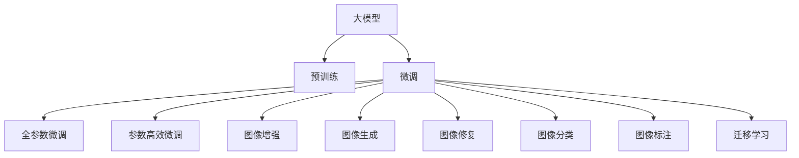

                 

# 图像处理的AI大模型：重塑视觉技术的未来

> 关键词：AI大模型,图像处理,深度学习,计算机视觉,大尺度图像,数据增强,图像生成,超分辨率,风格迁移,大模型训练

## 1. 背景介绍

### 1.1 问题由来
在过去十年里，深度学习技术已经在图像处理领域取得了革命性的突破。从简单的图像分类、目标检测，到复杂的图像生成、图像修复，深度学习模型已经展现了强大的图像理解能力。但是，传统的深度学习模型往往需要大量标注数据进行训练，对于复杂的图像理解任务，所需的训练数据量更是惊人。这一方面导致了训练成本的巨额增加，另一方面也不利于模型在未知领域的泛化。

近年来，大模型（Large Model）技术的发展为图像处理领域带来了新的解决方案。这些大模型基于大规模无标注数据进行预训练，在特定任务上通过微调（Fine-tuning），即可获得比从头训练更好的效果。这种基于大模型的微调方法，不仅能够节省大量的标注数据，而且可以显著提升模型在未知数据上的泛化能力。

大模型在图像处理领域的应用，不仅提升了模型性能，还推动了整个视觉技术的进步。例如，大模型在图像生成、图像修复、图像增强等方面的应用，使得图像处理技术能够更好地服务于人类生产生活。同时，大模型也促进了计算机视觉领域的研究，推动了新算法的产生和应用。

### 1.2 问题核心关键点
目前，大模型在图像处理领域的应用主要包括以下几个方面：

- **图像生成**：大模型能够生成高质量的图像，应用于图像生成、风格迁移等任务。
- **图像修复**：大模型能够对损坏或缺失的图像进行修复，恢复图像完整性。
- **图像增强**：大模型能够对图像进行增强，提升图像质量和清晰度。
- **图像分类**：大模型能够在特定领域进行图像分类，提升模型泛化能力。
- **图像标注**：大模型能够辅助图像标注，提高标注效率和准确性。

这些关键点展示了大模型在图像处理领域的强大潜力和应用前景。然而，大模型训练和微调过程需要大量的计算资源和时间，且对数据需求量极大。因此，如何高效地训练和微调大模型，是当前研究的热点问题之一。

## 2. 核心概念与联系

### 2.1 核心概念概述

为了更好地理解大模型在图像处理中的应用，本节将介绍几个密切相关的核心概念：

- **大模型**：以深度神经网络为代表的大规模预训练模型。通常包含数亿或数十亿参数，能够在特定任务上通过微调进行快速适配。
- **预训练**：在大规模无标注数据上进行的深度神经网络训练，学习到通用的图像特征表示。
- **微调**：在大模型的基础上，使用特定任务的数据集进行微调，提升模型在该任务上的性能。
- **迁移学习**：通过在大模型上进行微调，实现不同任务之间的知识迁移，提升模型的泛化能力。
- **图像增强**：通过对图像进行一系列变换和优化，提升图像的质量和清晰度的过程。
- **图像生成**：利用大模型生成高质量图像，应用于图像生成、风格迁移等任务。
- **图像修复**：利用大模型修复损坏或缺失的图像，恢复图像完整性。
- **图像分类**：利用大模型对图像进行分类，提升模型的泛化能力。
- **图像标注**：利用大模型辅助图像标注，提高标注效率和准确性。

这些核心概念之间的逻辑关系可以通过以下Mermaid流程图来展示：



这个流程图展示了大模型在图像处理领域的核心概念及其之间的关系：

1. 大模型通过预训练获得基础能力。
2. 微调是对预训练模型进行任务特定的优化，可以分为全参数微调和参数高效微调（PEFT）。
3. 图像增强、图像生成、图像修复、图像分类、图像标注等任务都是微调的具体应用。
4. 迁移学习是连接预训练模型与下游任务的桥梁，可以通过微调或迁移学习实现。

这些概念共同构成了大模型在图像处理领域的学习框架，使其能够在各种场景下发挥强大的图像处理能力。通过理解这些核心概念，我们可以更好地把握大模型的工作原理和优化方向。

## 3. 核心算法原理 & 具体操作步骤
### 3.1 算法原理概述

基于大模型的图像处理微调，本质上是一个有监督的细粒度迁移学习过程。其核心思想是：将大模型视作一个强大的"特征提取器"，通过在特定任务的数据集上进行有监督的微调，使得模型输出能够匹配任务标签，从而获得针对特定任务优化的模型。

形式化地，假设大模型为 $M_{\theta}$，其中 $\theta$ 为预训练得到的模型参数。给定图像处理任务 $T$ 的标注数据集 $D=\{(x_i, y_i)\}_{i=1}^N$，微调的目标是找到新的模型参数 $\hat{\theta}$，使得：

$$
\hat{\theta}=\mathop{\arg\min}_{\theta} \mathcal{L}(M_{\theta},D)
$$

其中 $\mathcal{L}$ 为针对任务 $T$ 设计的损失函数，用于衡量模型预测输出与真实标签之间的差异。常见的损失函数包括交叉熵损失、均方误差损失等。

通过梯度下降等优化算法，微调过程不断更新模型参数 $\theta$，最小化损失函数 $\mathcal{L}$，使得模型输出逼近真实标签。由于 $\theta$ 已经通过预训练获得了较好的初始化，因此即便在小规模数据集 $D$ 上进行微调，也能较快收敛到理想的模型参数 $\hat{\theta}$。

### 3.2 算法步骤详解

基于大模型的图像处理微调一般包括以下几个关键步骤：

**Step 1: 准备预训练模型和数据集**
- 选择合适的预训练图像模型 $M_{\theta}$ 作为初始化参数，如ResNet、Inception等。
- 准备图像处理任务 $T$ 的标注数据集 $D$，划分为训练集、验证集和测试集。一般要求标注数据与预训练数据的分布不要差异过大。

**Step 2: 添加任务适配层**
- 根据任务类型，在预训练模型顶层设计合适的输出层和损失函数。
- 对于分类任务，通常在顶层添加线性分类器和交叉熵损失函数。
- 对于生成任务，通常使用深度生成模型（如GAN、VAE等）输出概率分布，并以负对数似然为损失函数。

**Step 3: 设置微调超参数**
- 选择合适的优化算法及其参数，如 Adam、SGD 等，设置学习率、批大小、迭代轮数等。
- 设置正则化技术及强度，包括权重衰减、Dropout、Early Stopping 等。
- 确定冻结预训练参数的策略，如仅微调顶层，或全部参数都参与微调。

**Step 4: 执行梯度训练**
- 将训练集数据分批次输入模型，前向传播计算损失函数。
- 反向传播计算参数梯度，根据设定的优化算法和学习率更新模型参数。
- 周期性在验证集上评估模型性能，根据性能指标决定是否触发 Early Stopping。
- 重复上述步骤直到满足预设的迭代轮数或 Early Stopping 条件。

**Step 5: 测试和部署**
- 在测试集上评估微调后模型 $M_{\hat{\theta}}$ 的性能，对比微调前后的精度提升。
- 使用微调后的模型对新样本进行推理预测，集成到实际的应用系统中。
- 持续收集新的数据，定期重新微调模型，以适应数据分布的变化。

以上是基于大模型的图像处理微调的一般流程。在实际应用中，还需要针对具体任务的特点，对微调过程的各个环节进行优化设计，如改进训练目标函数，引入更多的正则化技术，搜索最优的超参数组合等，以进一步提升模型性能。

### 3.3 算法优缺点

基于大模型的图像处理微调方法具有以下优点：

1. 简单高效。只需准备少量标注数据，即可对预训练模型进行快速适配，获得较大的性能提升。
2. 通用适用。适用于各种图像处理任务，包括分类、检测、分割、生成等，设计简单的任务适配层即可实现微调。
3. 参数高效。利用参数高效微调技术，在固定大部分预训练权重不变的情况下，仍可取得不错的微调效果。
4. 效果显著。在学术界和工业界的诸多任务上，基于微调的方法已经刷新了最先进的性能指标。

同时，该方法也存在一定的局限性：

1. 依赖标注数据。微调的效果很大程度上取决于标注数据的质量和数量，获取高质量标注数据的成本较高。
2. 迁移能力有限。当目标任务与预训练数据的分布差异较大时，微调的性能提升有限。
3. 负面效果传递。预训练模型的固有偏见、有害信息等，可能通过微调传递到下游任务，造成负面影响。
4. 可解释性不足。微调模型的决策过程通常缺乏可解释性，难以对其推理逻辑进行分析和调试。

尽管存在这些局限性，但就目前而言，基于大模型的微调方法仍是大图像处理应用的最主流范式。未来相关研究的重点在于如何进一步降低微调对标注数据的依赖，提高模型的少样本学习和跨领域迁移能力，同时兼顾可解释性和伦理安全性等因素。

### 3.4 算法应用领域

基于大模型的图像处理微调方法在图像处理领域已经得到了广泛的应用，覆盖了几乎所有常见任务，例如：

- 图像分类：如物体识别、场景分类、人脸识别等。通过微调使模型学习图像-类别映射。
- 目标检测：如物体定位、行为识别、视频标注等。通过微调使模型学习图像-边界框映射。
- 语义分割：如图像语义分割、实例分割、全景分割等。通过微调使模型学习像素级语义标签。
- 图像生成：如GAN图像生成、风格迁移、超分辨率等。通过微调使模型学习图像生成过程。
- 图像修复：如图像去噪、去模糊、超分辨率等。通过微调使模型学习图像修复过程。
- 图像标注：如图像描述生成、图像问答、图像标注等。通过微调使模型学习图像-描述映射。

除了上述这些经典任务外，大模型微调也被创新性地应用到更多场景中，如可控图像生成、图像超分辨率、图像增强等，为图像处理技术带来了全新的突破。随着预训练模型和微调方法的不断进步，相信图像处理技术将在更广阔的应用领域大放异彩。

## 4. 数学模型和公式 & 详细讲解
### 4.1 数学模型构建

本节将使用数学语言对基于大模型的图像处理微调过程进行更加严格的刻画。

记预训练图像模型为 $M_{\theta}$，其中 $\theta$ 为预训练得到的模型参数。假设微调任务的训练集为 $D=\{(x_i,y_i)\}_{i=1}^N$，其中 $x_i$ 为输入图像， $y_i$ 为任务标签。

定义模型 $M_{\theta}$ 在数据样本 $(x,y)$ 上的损失函数为 $\ell(M_{\theta}(x),y)$，则在数据集 $D$ 上的经验风险为：

$$
\mathcal{L}(\theta) = \frac{1}{N} \sum_{i=1}^N \ell(M_{\theta}(x_i),y_i)
$$

微调的优化目标是最小化经验风险，即找到最优参数：

$$
\theta^* = \mathop{\arg\min}_{\theta} \mathcal{L}(\theta)
$$

在实践中，我们通常使用基于梯度的优化算法（如SGD、Adam等）来近似求解上述最优化问题。设 $\eta$ 为学习率，$\lambda$ 为正则化系数，则参数的更新公式为：

$$
\theta \leftarrow \theta - \eta \nabla_{\theta}\mathcal{L}(\theta) - \eta\lambda\theta
$$

其中 $\nabla_{\theta}\mathcal{L}(\theta)$ 为损失函数对参数 $\theta$ 的梯度，可通过反向传播算法高效计算。

### 4.2 公式推导过程

以下我们以图像分类任务为例，推导交叉熵损失函数及其梯度的计算公式。

假设模型 $M_{\theta}$ 在输入图像 $x$ 上的输出为 $\hat{y}=M_{\theta}(x) \in [0,1]$，表示样本属于第 $k$ 类的概率。真实标签 $y \in \{1,0\}$，对应第 $k$ 类。则二分类交叉熵损失函数定义为：

$$
\ell(M_{\theta}(x),y) = -[y\log \hat{y} + (1-y)\log (1-\hat{y})]
$$

将其代入经验风险公式，得：

$$
\mathcal{L}(\theta) = -\frac{1}{N}\sum_{i=1}^N [y_i\log M_{\theta}(x_i)+(1-y_i)\log(1-M_{\theta}(x_i))]
$$

根据链式法则，损失函数对参数 $\theta_k$ 的梯度为：

$$
\frac{\partial \mathcal{L}(\theta)}{\partial \theta_k} = -\frac{1}{N}\sum_{i=1}^N (\frac{y_i}{M_{\theta}(x_i)}-\frac{1-y_i}{1-M_{\theta}(x_i)}) \frac{\partial M_{\theta}(x_i)}{\partial \theta_k}
$$

其中 $\frac{\partial M_{\theta}(x_i)}{\partial \theta_k}$ 可进一步递归展开，利用自动微分技术完成计算。

在得到损失函数的梯度后，即可带入参数更新公式，完成模型的迭代优化。重复上述过程直至收敛，最终得到适应下游任务的最优模型参数 $\theta^*$。

## 5. 项目实践：代码实例和详细解释说明
### 5.1 开发环境搭建

在进行图像处理微调实践前，我们需要准备好开发环境。以下是使用Python进行TensorFlow开发的环境配置流程：

1. 安装Anaconda：从官网下载并安装Anaconda，用于创建独立的Python环境。

2. 创建并激活虚拟环境：
```bash
conda create -n tf-env python=3.8 
conda activate tf-env
```

3. 安装TensorFlow：根据CUDA版本，从官网获取对应的安装命令。例如：
```bash
pip install tensorflow==2.5
```

4. 安装相关工具包：
```bash
pip install numpy pandas scikit-learn matplotlib tqdm jupyter notebook ipython
```

完成上述步骤后，即可在`tf-env`环境中开始微调实践。

### 5.2 源代码详细实现

下面我们以图像分类任务为例，给出使用TensorFlow对Inception模型进行微调的Python代码实现。

首先，定义图像分类任务的数据处理函数：

```python
import tensorflow as tf
from tensorflow.keras.preprocessing.image import ImageDataGenerator
import numpy as np

class ImageDataLoader(tf.keras.utils.Sequence):
    def __init__(self, x, y, batch_size):
        self.x = x
        self.y = y
        self.batch_size = batch_size

    def __len__(self):
        return len(self.x) // self.batch_size

    def __getitem__(self, idx):
        batch_x = self.x[idx * self.batch_size:(idx + 1) * self.batch_size]
        batch_y = self.y[idx * self.batch_size:(idx + 1) * self.batch_size]
        return np.array(batch_x), np.array(batch_y)

# 创建训练集和验证集
train_data = ImageDataGenerator(rescale=1./255)
train_x, train_y = train_data.flow_from_directory('train', target_size=(224, 224), class_mode='categorical')
val_data = ImageDataGenerator(rescale=1./255)
val_x, val_y = val_data.flow_from_directory('val', target_size=(224, 224), class_mode='categorical')

# 创建数据加载器
train_loader = ImageDataLoader(train_x.numpy(), train_y.numpy(), batch_size=32)
val_loader = ImageDataLoader(val_x.numpy(), val_y.numpy(), batch_size=32)
```

然后，定义模型和优化器：

```python
from tensorflow.keras import Model, Sequential
from tensorflow.keras.layers import Dense, GlobalAveragePooling2D, Flatten, Conv2D, MaxPooling2D

model = Sequential([
    Conv2D(32, (3, 3), activation='relu', padding='same', input_shape=(224, 224, 3)),
    MaxPooling2D((2, 2)),
    Conv2D(64, (3, 3), activation='relu', padding='same'),
    MaxPooling2D((2, 2)),
    Conv2D(128, (3, 3), activation='relu', padding='same'),
    MaxPooling2D((2, 2)),
    Conv2D(128, (3, 3), activation='relu', padding='same'),
    MaxPooling2D((2, 2)),
    Flatten(),
    Dense(1024, activation='relu'),
    Dense(10, activation='softmax')
])

optimizer = tf.keras.optimizers.Adam(learning_rate=2e-5)
```

接着，定义训练和评估函数：

```python
@tf.function
def train_step(inputs, labels):
    with tf.GradientTape() as tape:
        outputs = model(inputs, training=True)
        loss = tf.reduce_mean(tf.keras.losses.categorical_crossentropy(labels, outputs))
    grads = tape.gradient(loss, model.trainable_variables)
    optimizer.apply_gradients(zip(grads, model.trainable_variables))
    return loss

@tf.function
def evaluate_step(inputs, labels):
    outputs = model(inputs, training=False)
    return tf.keras.metrics.categorical_accuracy(labels, outputs)

# 训练函数
def train(model, train_loader, val_loader, epochs, batch_size):
    for epoch in range(epochs):
        train_loss = 0.
        for batch in tqdm(train_loader, desc='Training'):
            train_loss += train_step(batch[0], batch[1])
        train_loss /= len(train_loader)
        val_acc = evaluate_step(val_loader[0], val_loader[1])
        print(f'Epoch {epoch+1}, train loss: {train_loss:.3f}, val acc: {val_acc:.3f}')

# 训练流程
epochs = 5
batch_size = 32

train(train_model, train_loader, val_loader, epochs, batch_size)
```

以上就是使用TensorFlow对Inception模型进行图像分类任务微调的完整代码实现。可以看到，得益于TensorFlow的强大封装，我们可以用相对简洁的代码完成模型加载和微调。

### 5.3 代码解读与分析

让我们再详细解读一下关键代码的实现细节：

**ImageDataLoader类**：
- `__init__`方法：初始化训练集和验证集数据。
- `__len__`方法：返回数据集的样本数量。
- `__getitem__`方法：对单个样本进行处理，将图像转换为numpy数组，并进行定长padding。

**train_step和evaluate_step函数**：
- 分别定义训练和评估函数，使用tf.function进行函数图优化，提升计算效率。
- 在训练函数中，通过tf.GradientTape记录梯度，并使用Adam优化器进行模型参数更新。
- 在评估函数中，直接计算模型的分类准确率。

**训练函数**：
- 在每个epoch内，对训练集和验证集分别进行训练和评估，输出训练损失和验证准确率。

可以看到，TensorFlow使得图像处理微调的代码实现变得简洁高效。开发者可以将更多精力放在数据处理、模型改进等高层逻辑上，而不必过多关注底层的实现细节。

当然，工业级的系统实现还需考虑更多因素，如模型的保存和部署、超参数的自动搜索、更灵活的任务适配层等。但核心的微调范式基本与此类似。

## 6. 实际应用场景
### 6.1 智能医疗影像诊断

基于大模型微调的图像处理技术，可以广泛应用于智能医疗影像诊断系统的构建。传统医疗影像诊断依赖医生手动分析和解读，耗时长且容易出错。而使用微调后的图像处理模型，可以自动分析影像中的病变情况，辅助医生诊断，提高诊断的准确性和效率。

在技术实现上，可以收集大量的医疗影像数据，将其标注为正常、异常等类别。在此基础上对预训练的图像处理模型进行微调，使其能够自动识别影像中的病变区域。在实际诊断中，将新输入的影像送入微调模型，即可自动输出诊断结果，辅助医生进行诊断。

### 6.2 工业产品质量检测

在制造业中，产品缺陷检测通常依赖人工视觉检测，耗时耗力且容易出错。利用微调后的图像处理模型，可以自动检测产品表面缺陷，提高检测的准确性和效率。

在技术实现上，可以收集大量带有缺陷标注的图像数据，用于训练图像处理模型。微调后的模型能够自动识别图像中的缺陷类型和位置，生成检测报告。在实际生产中，将新输入的产品图像送入微调模型，即可自动生成检测报告，及时发现产品质量问题。

### 6.3 无人驾驶车辆感知

无人驾驶车辆需要实时感知周围环境，生成高精度的地图和物体检测框。利用微调后的图像处理模型，可以自动检测车辆周围的物体，生成高质量的地图和检测框，提高无人驾驶车辆的安全性和可靠性。

在技术实现上，可以收集大量无人驾驶车辆的数据，标注其中的物体和道路信息。在此基础上对预训练的图像处理模型进行微调，使其能够自动检测车辆周围的物体和道路，生成高质量的地图和检测框。在实际无人驾驶中，将新输入的车辆周围图像送入微调模型，即可自动生成地图和检测框，辅助车辆进行导航和避障。

### 6.4 未来应用展望

随着大模型和微调技术的不断发展，基于微调范式将在更多领域得到应用，为各行各业带来变革性影响。

在智慧医疗领域，基于微调的图像处理技术将提升医疗影像诊断的智能化水平，辅助医生诊断，加速新药开发进程。

在工业质量检测领域，微调技术将帮助企业提高产品检测的效率和准确性，降低检测成本。

在无人驾驶领域，微调技术将提高无人驾驶车辆的安全性和可靠性，加速自动驾驶技术的普及。

此外，在智慧城市治理、智能交通、智能安防等众多领域，基于大模型微调的人工智能应用也将不断涌现，为经济社会发展注入新的动力。相信随着技术的日益成熟，微调方法将成为人工智能落地应用的重要范式，推动人工智能技术向更广阔的领域加速渗透。

## 7. 工具和资源推荐
### 7.1 学习资源推荐

为了帮助开发者系统掌握大模型微调的理论基础和实践技巧，这里推荐一些优质的学习资源：

1. 《Deep Learning》书籍：Ian Goodfellow等人合著的经典书籍，系统讲解了深度学习的基础理论和实践方法，包括图像处理、自然语言处理等多个领域。
2. CS231n《Convolutional Neural Networks for Visual Recognition》课程：斯坦福大学开设的计算机视觉经典课程，涵盖卷积神经网络、图像分类、目标检测等多个主题。
3. PyTorch官方文档：PyTorch官方文档，提供了丰富的预训练模型和微调样例代码，是上手实践的必备资料。
4. TensorFlow官方文档：TensorFlow官方文档，涵盖了深度学习框架的全面介绍和实践方法，包括图像处理、自然语言处理等多个领域。
5. Weights & Biases：模型训练的实验跟踪工具，可以记录和可视化模型训练过程中的各项指标，方便对比和调优。
6. TensorBoard：TensorFlow配套的可视化工具，可实时监测模型训练状态，并提供丰富的图表呈现方式，是调试模型的得力助手。

通过对这些资源的学习实践，相信你一定能够快速掌握大模型微调的精髓，并用于解决实际的图像处理问题。
###  7.2 开发工具推荐

高效的开发离不开优秀的工具支持。以下是几款用于大模型微调开发的常用工具：

1. PyTorch：基于Python的开源深度学习框架，灵活动态的计算图，适合快速迭代研究。大部分预训练图像模型都有PyTorch版本的实现。
2. TensorFlow：由Google主导开发的开源深度学习框架，生产部署方便，适合大规模工程应用。同样有丰富的预训练图像模型资源。
3. OpenCV：开源计算机视觉库，提供了丰富的图像处理函数和工具，支持Python和其他语言。
4. Pillow：Python的图像处理库，支持图像的读取、保存、处理等操作。
5. NumPy：Python的科学计算库，支持高效的数组计算，常用于图像处理和深度学习中。
6. Matplotlib：Python的绘图库，支持各种数据可视化操作，常用于图像处理和深度学习中。
7. Jupyter Notebook：Python的交互式编程环境，支持代码块、注释、表格等多种格式，适合开发和演示。

合理利用这些工具，可以显著提升大模型微调任务的开发效率，加快创新迭代的步伐。

### 7.3 相关论文推荐

大模型和微调技术的发展源于学界的持续研究。以下是几篇奠基性的相关论文，推荐阅读：

1. Deep Residual Learning for Image Recognition：提出ResNet结构，解决了深度神经网络训练过程中的梯度消失问题，推动了深度学习在图像处理领域的应用。
2. ImageNet Classification with Deep Convolutional Neural Networks：提出LeNet结构，为图像分类任务奠定了基础。
3. ImageNet Large Scale Visual Recognition Challenge（ILSVRC）：推动了图像识别技术的发展，促进了大模型在图像处理中的应用。
4. ImageNet Classification with Deep Convolutional Neural Networks（AlexNet）：提出AlexNet结构，展示了深度学习在图像识别任务上的巨大潜力。
5. Generative Adversarial Networks：提出GAN模型，推动了图像生成、风格迁移等图像处理任务的发展。

这些论文代表了大模型在图像处理领域的发展脉络。通过学习这些前沿成果，可以帮助研究者把握学科前进方向，激发更多的创新灵感。

## 8. 总结：未来发展趋势与挑战
### 8.1 总结

本文对基于大模型的图像处理微调方法进行了全面系统的介绍。首先阐述了大模型和微调技术的研究背景和意义，明确了微调在拓展预训练模型应用、提升图像处理性能方面的独特价值。其次，从原理到实践，详细讲解了微调的数学原理和关键步骤，给出了微调任务开发的完整代码实例。同时，本文还广泛探讨了微调方法在智能医疗、工业质量检测、无人驾驶等多个行业领域的应用前景，展示了微调范式的巨大潜力。此外，本文精选了微调技术的各类学习资源，力求为读者提供全方位的技术指引。

通过本文的系统梳理，可以看到，基于大模型的微调方法正在成为图像处理领域的重要范式，极大地拓展了预训练模型应用边界，催生了更多的落地场景。受益于大规模语料的预训练，微调模型以更低的时间和标注成本，在小样本条件下也能取得理想的性能提升，有力推动了图像处理技术的产业化进程。未来，伴随预训练模型和微调方法的持续演进，相信图像处理技术将在更广阔的应用领域大放异彩，深刻影响人类的生产生活方式。

### 8.2 未来发展趋势

展望未来，大模型在图像处理领域的微调技术将呈现以下几个发展趋势：

1. 模型规模持续增大。随着算力成本的下降和数据规模的扩张，预训练图像模型参数量还将持续增长。超大规模图像模型蕴含的丰富特征表示，有望支撑更加复杂多变的图像处理任务。
2. 微调方法日趋多样。除了传统的全参数微调外，未来会涌现更多参数高效的微调方法，如LoRA、MicroBERT等，在节省计算资源的同时也能保证微调精度。
3. 持续学习成为常态。随着数据分布的不断变化，微调模型也需要持续学习新知识以保持性能。如何在不遗忘原有知识的同时，高效吸收新样本信息，将成为重要的研究课题。
4. 标注样本需求降低。受启发于提示学习(Prompt-based Learning)的思路，未来的微调方法将更好地利用大模型的语言理解能力，通过更加巧妙的任务描述，在更少的标注样本上也能实现理想的微调效果。
5. 图像生成技术将进一步发展。大模型在图像生成领域的应用将更加广泛，生成高保真度、风格多样的高质量图像，成为图像处理的重要方向。
6. 多模态图像处理将迎来突破。未来的图像处理技术将不仅仅局限于视觉模态，而是融合音频、文本等多模态信息，实现更全面、准确的图像处理。

以上趋势凸显了大模型在图像处理领域的巨大潜力和应用前景。这些方向的探索发展，必将进一步提升图像处理系统的性能和应用范围，为人类认知智能的进化带来深远影响。

### 8.3 面临的挑战

尽管大模型在图像处理领域的应用已经取得了瞩目成就，但在迈向更加智能化、普适化应用的过程中，它仍面临着诸多挑战：

1. 标注成本瓶颈。虽然微调大大降低了标注数据的需求，但对于复杂的图像处理任务，获取高质量标注数据的成本仍然较高。如何进一步降低微调对标注样本的依赖，将是一大难题。
2. 模型鲁棒性不足。当前微调模型面对域外数据时，泛化性能往往大打折扣。对于测试样本的微小扰动，微调模型的预测也容易发生波动。如何提高微调模型的鲁棒性，避免灾难性遗忘，还需要更多理论和实践的积累。
3. 推理效率有待提高。大规模图像模型虽然精度高，但在实际部署时往往面临推理速度慢、内存占用大等效率问题。如何在保证性能的同时，简化模型结构，提升推理速度，优化资源占用，将是重要的优化方向。
4. 可解释性亟需加强。当前微调模型更像是"黑盒"系统，难以解释其内部工作机制和决策逻辑。对于医疗、金融等高风险应用，算法的可解释性和可审计性尤为重要。如何赋予微调模型更强的可解释性，将是亟待攻克的难题。
5. 安全性有待保障。预训练图像模型难免会学习到有偏见、有害的信息，通过微调传递到下游任务，产生误导性、歧视性的输出，给实际应用带来安全隐患。如何从数据和算法层面消除模型偏见，避免恶意用途，确保输出的安全性，也将是重要的研究课题。
6. 知识整合能力不足。现有的微调模型往往局限于任务内数据，难以灵活吸收和运用更广泛的先验知识。如何让微调过程更好地与外部知识库、规则库等专家知识结合，形成更加全面、准确的信息整合能力，还有很大的想象空间。

正视微调面临的这些挑战，积极应对并寻求突破，将是大模型微调走向成熟的必由之路。相信随着学界和产业界的共同努力，这些挑战终将一一被克服，大模型微调必将在构建人机协同的智能时代中扮演越来越重要的角色。

### 8.4 研究展望

面对大模型在图像处理领域所面临的种种挑战，未来的研究需要在以下几个方面寻求新的突破：

1. 探索无监督和半监督微调方法。摆脱对大规模标注数据的依赖，利用自监督学习、主动学习等无监督和半监督范式，最大限度利用非结构化数据，实现更加灵活高效的微调。
2. 研究参数高效和计算高效的微调范式。开发更加参数高效的微调方法，在固定大部分预训练参数的同时，只更新极少量的任务相关参数。同时优化微调模型的计算图，减少前向传播和反向传播的资源消耗，实现更加轻量级、实时性的部署。
3. 融合因果和对比学习范式。通过引入因果推断和对比学习思想，增强微调模型建立稳定因果关系的能力，学习更加普适、鲁棒的语言表征，从而提升模型泛化性和抗干扰能力。
4. 引入更多先验知识。将符号化的先验知识，如知识图谱、逻辑规则等，与神经网络模型进行巧妙融合，引导微调过程学习更准确、合理的图像处理模型。同时加强不同模态数据的整合，实现视觉、语音等多模态信息与图像信息的协同建模。
5. 结合因果分析和博弈论工具。将因果分析方法引入微调模型，识别出模型决策的关键特征，增强输出解释的因果性和逻辑性。借助博弈论工具刻画人机交互过程，主动探索并规避模型的脆弱点，提高系统稳定性。
6. 纳入伦理道德约束。在模型训练目标中引入伦理导向的评估指标，过滤和惩罚有偏见、有害的输出倾向。同时加强人工干预和审核，建立模型行为的监管机制，确保输出符合人类价值观和伦理道德。

这些研究方向的探索，必将引领大模型在图像处理领域的微调技术迈向更高的台阶，为构建安全、可靠、可解释、可控的智能系统铺平道路。面向未来，大模型微调技术还需要与其他人工智能技术进行更深入的融合，如知识表示、因果推理、强化学习等，多路径协同发力，共同推动图像处理系统的进步。只有勇于创新、敢于突破，才能不断拓展图像处理模型的边界，让智能技术更好地造福人类社会。

## 9. 附录：常见问题与解答

**Q1：大模型微调是否适用于所有图像处理任务？**

A: 大模型微调在大多数图像处理任务上都能取得不错的效果，特别是对于数据量较小的任务。但对于一些特定领域的任务，如医学、法律等，仅仅依靠通用语料预训练的模型可能难以很好地适应。此时需要在特定领域语料上进一步预训练，再进行微调，才能获得理想效果。此外，对于一些需要时效性、个性化很强的任务，如图像分类、目标检测等，微调方法也需要针对性的改进优化。

**Q2：微调过程中如何选择合适的学习率？**

A: 微调的学习率一般要比预训练时小1-2个数量级，如果使用过大的学习率，容易破坏预训练权重，导致过拟合。一般建议从1e-5开始调参，逐步减小学习率，直至收敛。也可以使用warmup策略，在开始阶段使用较小的学习率，再逐渐过渡到预设值。需要注意的是，不同的优化器(如AdamW、Adafactor等)以及不同的学习率调度策略，可能需要设置不同的学习率阈值。

**Q3：采用大模型微调时会面临哪些资源瓶颈？**

A: 目前主流的预训练大模型动辄以亿计的参数规模，对算力、内存、存储都提出了很高的要求。GPU/TPU等高性能设备是必不可少的，但即便如此，超大批次的训练和推理也可能遇到显存不足的问题。因此需要采用一些资源优化技术，如梯度积累、混合精度训练、模型并行等，来突破硬件瓶颈。同时，模型的存储和读取也可能占用大量时间和空间，需要采用模型压缩、稀疏化存储等方法进行优化。

**Q4：如何缓解微调过程中的过拟合问题？**

A: 过拟合是微调面临的主要挑战，尤其是在标注数据不足的情况下。常见的缓解策略包括：
1. 数据增强：通过回译、近义替换等方式扩充训练集
2. 正则化：使用L2正则、Dropout、Early Stopping 等避免过拟合
3. 对抗训练：引入对抗样本，提高模型鲁棒性
4. 参数高效微调：只调整少量参数(如Adapter、Prefix等)，减小过拟合风险
5. 多模型集成：训练多个微调模型，取平均输出，抑制过拟合

这些策略往往需要根据具体任务和数据特点进行灵活组合。只有在数据、模型、训练、推理等各环节进行全面优化，才能最大限度地发挥大模型微调的威力。

**Q5：微调模型在落地部署时需要注意哪些问题？**

A: 将微调模型转化为实际应用，还需要考虑以下因素：
1. 模型裁剪：去除不必要的层和参数，减小模型尺寸，加快推理速度
2. 量化加速：将浮点模型转为定点模型，压缩存储空间，提高计算效率
3. 服务化封装：将模型封装为标准化服务接口，便于集成调用
4. 弹性伸缩：根据请求流量动态调整资源配置，平衡服务质量和成本
5. 监控告警：实时采集系统指标，设置异常告警阈值，确保服务稳定性
6. 安全防护：采用访问鉴权、数据脱敏等措施，保障数据和模型安全

大模型微调为图像处理技术带来了广阔的应用场景，但如何将强大的性能转化为稳定、高效、安全的业务价值，还需要工程实践的不断打磨。唯有从数据、算法、工程、业务等多个维度协同发力，才能真正实现人工智能技术在垂直行业的规模化落地。总之，微调需要开发者根据具体任务，不断迭代和优化模型、数据和算法，方能得到理想的效果。

---

作者：禅与计算机程序设计艺术 / Zen and the Art of Computer Programming

