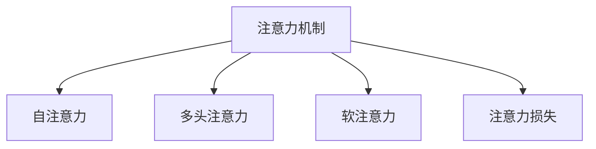

                 

# 在AI时代：理解人类注意力这一宝贵资源

## 1. 背景介绍

在人工智能（AI）蓬勃发展的今天，注意力机制（Attention Mechanism）已经成为深度学习领域的核心技术之一。从自然语言处理（NLP）到计算机视觉（CV），从语音识别到图像处理，注意力机制在多个领域得到了广泛应用，并取得了显著的成效。然而，在AI时代，理解人类注意力这一宝贵资源，对于构建更加智能、高效的AI系统至关重要。

### 1.1 注意力机制的兴起

注意力机制最初应用于计算机视觉领域，用于解决图像中的关键目标区域定位问题。随后，这一机制被引入自然语言处理中，用于捕捉长句子和文档中的关键信息。在Transformer模型中，注意力机制得到了进一步的发展和应用，成为其不可或缺的组成部分。Transformer模型在机器翻译、语言建模、文本生成等任务中展现了卓越的性能，奠定了其在AI领域的统治地位。

### 1.2 注意力的价值

注意力机制之所以重要，在于它能够模拟人类在处理复杂信息时的自然聚焦过程。与传统的固定窗口或卷积操作不同，注意力机制能够动态地调整注意力权重，将有限的计算资源分配给最重要的信息，从而在复杂任务中实现高效的计算和信息提取。此外，注意力机制还能够提升模型的鲁棒性和泛化能力，减少对数据分布的依赖，提高模型的泛化能力。

## 2. 核心概念与联系

### 2.1 核心概念概述

在AI时代，理解人类注意力这一宝贵资源，需要从多个角度进行深入探讨。以下将介绍几个核心概念及其之间的联系：

- **注意力机制（Attention Mechanism）**：用于动态选择重要信息的机制，通过计算注意力权重，决定输入的哪些部分对输出更有贡献。
- **自注意力（Self-Attention）**：一种特殊的注意力机制，用于处理序列数据，如NLP和CV中的自注意力机制。
- **多头注意力（Multi-Head Attention）**：将输入信息分解为多个通道，每个通道计算不同的注意力权重，以捕捉不同层次的信息。
- **软注意力（Soft Attention）**：与硬注意力（Hard Attention）不同，软注意力可以在所有可能的输入位置上分配注意力权重，用于处理连续性的信息。
- **注意力损失（Attention Loss）**：用于训练注意力机制的损失函数，通过优化注意力权重，提高注意力机制的效果。

这些概念之间的联系可以通过以下Mermaid流程图来展示：



这个流程图展示了注意力机制及其主要变体的关系，从基础的自注意力机制开始，逐步引入了多头注意力和软注意力，最终通过注意力损失函数来优化和训练注意力机制。

## 3. 核心算法原理 & 具体操作步骤

### 3.1 算法原理概述

注意力机制的原理可以概括为以下几个步骤：

1. **计算注意力权重**：根据输入数据和查询向量计算注意力权重，决定哪些部分对输出更有贡献。
2. **加权求和**：将输入数据乘以注意力权重，然后进行加权求和，生成新的输出。
3. **多通道扩展**：通过多头注意力机制，将输入数据分解为多个通道，每个通道计算不同的注意力权重，以捕捉不同层次的信息。

### 3.2 算法步骤详解

下面将详细介绍注意力机制的具体计算步骤：

1. **计算查询和键值对**：对于输入序列中的每个位置，将其作为查询向量，同时从输入序列中选择一个固定位置的键值对（通常选择自身的键值对）。
2. **计算注意力得分**：将查询向量与键值对的每个位置进行点积运算，得到一个注意力得分。
3. **归一化注意力得分**：对所有的注意力得分进行归一化，得到注意力权重。
4. **加权求和**：将输入数据乘以注意力权重，然后进行加权求和，生成新的输出。
5. **多头注意力扩展**：将输入数据分解为多个通道，每个通道计算不同的注意力权重，以捕捉不同层次的信息。

### 3.3 算法优缺点

注意力机制的主要优点包括：

- **高效计算**：通过动态选择重要信息，避免了固定窗口或卷积操作中的冗余计算，提高了计算效率。
- **鲁棒性**：通过动态调整注意力权重，减少了对数据分布的依赖，提高了模型的泛化能力。
- **信息提取**：通过加权求和操作，能够自动提取输入数据中的关键信息，提升了模型的表达能力。

然而，注意力机制也存在一些缺点：

- **计算复杂度高**：尽管注意力机制的计算复杂度比卷积和全连接层低，但在大规模数据和长序列上，计算量依然较高。
- **易受干扰**：注意力机制对输入数据的噪声敏感，容易受到异常值的影响。
- **参数量大**：尤其是多头注意力机制，参数量较大，对内存和计算资源的需求较高。

### 3.4 算法应用领域

注意力机制已经广泛应用于多个领域，以下是一些典型的应用场景：

- **自然语言处理（NLP）**：在机器翻译、语言建模、文本生成等任务中，注意力机制能够捕捉句子中的关键信息，提升模型的效果。
- **计算机视觉（CV）**：在图像识别、物体检测、语义分割等任务中，注意力机制能够识别图像中的重要区域，提高模型的性能。
- **语音识别**：在语音识别任务中，注意力机制能够捕捉说话人的语音特征，提升识别准确率。
- **时间序列预测**：在时间序列预测任务中，注意力机制能够识别时间序列中的关键点，提高预测精度。

## 4. 数学模型和公式 & 详细讲解

### 4.1 数学模型构建

注意力机制的数学模型可以形式化地表示为：

$$
\text{Attention}(Q, K, V) = \text{Softmax}(QK^T / \sqrt{\dim(Q)})V
$$

其中，$Q$ 表示查询向量，$K$ 和 $V$ 分别表示键值对，$\dim(Q)$ 表示查询向量的维度。注意力机制通过计算 $QK^T / \sqrt{\dim(Q)}$ 的注意力得分，然后对得分进行归一化，得到注意力权重。最后，将注意力权重与 $V$ 进行加权求和，生成新的输出。

### 4.2 公式推导过程

下面将详细推导注意力机制的计算公式：

1. **计算注意力得分**：
$$
\text{Attention Score}(Q, K) = QK^T / \sqrt{\dim(Q)}
$$

2. **归一化注意力得分**：
$$
\text{Attention Weight}(Q, K) = \text{Softmax}(QK^T / \sqrt{\dim(Q)})
$$

3. **加权求和**：
$$
\text{Attention Output}(Q, K, V) = \text{Attention Weight}(Q, K)V
$$

### 4.3 案例分析与讲解

以机器翻译任务为例，分析注意力机制的应用：

1. **输入序列**：输入序列为源语言句子，每个位置上的向量表示该位置上的单词。
2. **查询向量**：查询向量为当前时刻的目标语言单词向量。
3. **键值对**：键值对为源语言句子中对应位置的单词向量。
4. **计算注意力得分**：将查询向量与每个键值对进行点积运算，得到一个注意力得分。
5. **归一化注意力得分**：对所有的注意力得分进行归一化，得到注意力权重。
6. **加权求和**：将源语言句子乘以注意力权重，然后进行加权求和，生成新的目标语言单词向量。

## 5. 项目实践：代码实例和详细解释说明

### 5.1 开发环境搭建

在开始实践注意力机制之前，我们需要准备好开发环境。以下是使用PyTorch进行开发的流程：

1. 安装Anaconda：从官网下载并安装Anaconda，用于创建独立的Python环境。

2. 创建并激活虚拟环境：
```bash
conda create -n attention-env python=3.8 
conda activate attention-env
```

3. 安装PyTorch：根据CUDA版本，从官网获取对应的安装命令。例如：
```bash
conda install pytorch torchvision torchaudio cudatoolkit=11.1 -c pytorch -c conda-forge
```

4. 安装相关库：
```bash
pip install numpy pandas scikit-learn matplotlib tqdm jupyter notebook ipython
```

完成上述步骤后，即可在`attention-env`环境中开始项目实践。

### 5.2 源代码详细实现

以下是一个简单的多通道注意力机制的实现示例：

```python
import torch
import torch.nn as nn
import torch.nn.functional as F

class MultiHeadAttention(nn.Module):
    def __init__(self, in_dim, n_heads, out_dim):
        super(MultiHeadAttention, self).__init__()
        self.in_dim = in_dim
        self.n_heads = n_heads
        self.out_dim = out_dim
        self.depth = in_dim // n_heads
        
        # 线性变换
        self.WQ = nn.Linear(in_dim, in_dim)
        self.WK = nn.Linear(in_dim, in_dim)
        self.WV = nn.Linear(in_dim, out_dim)
        
        # 注意力机制
        self.AT = nn.Linear(out_dim, out_dim)
        
        self.softmax = nn.Softmax(dim=-1)
        self.fc = nn.Linear(out_dim, out_dim)
        
    def forward(self, x):
        batch_size, seq_len, in_dim = x.size()
        
        # 线性变换
        Q = self.WQ(x).view(batch_size, seq_len, self.n_heads, self.depth).transpose(1, 2).contiguous().view(batch_size * self.n_heads, seq_len, self.depth)
        K = self.WK(x).view(batch_size, seq_len, self.n_heads, self.depth).transpose(1, 2).contiguous().view(batch_size * self.n_heads, seq_len, self.depth)
        V = self.WV(x).view(batch_size, seq_len, self.n_heads, self.depth).transpose(1, 2).contiguous().view(batch_size * self.n_heads, seq_len, self.depth)
        
        # 计算注意力得分
        Q = Q.permute(0, 2, 1).contiguous().view(batch_size * self.n_heads, seq_len, self.depth)
        K = K.permute(0, 2, 1).contiguous().view(batch_size * self.n_heads, seq_len, self.depth)
        V = V.permute(0, 2, 1).contiguous().view(batch_size * self.n_heads, seq_len, self.depth)
        
        # 归一化注意力得分
        attn_score = torch.bmm(Q, K.permute(0, 2, 1)) / math.sqrt(self.depth)
        attn_weight = self.softmax(attn_score)
        
        # 加权求和
        attn_output = torch.bmm(attn_weight, V)
        attn_output = attn_output.view(batch_size, seq_len, self.n_heads, self.depth).transpose(1, 2).contiguous().view(batch_size, seq_len, out_dim)
        
        # 线性变换
        output = self.fc(attn_output)
        
        return output
```

### 5.3 代码解读与分析

让我们详细解读一下代码的关键实现细节：

1. **线性变换**：输入向量 $x$ 通过三个线性变换分别得到查询向量 $Q$、键值对 $K$ 和输出向量 $V$。
2. **注意力得分**：将查询向量 $Q$ 与键值对 $K$ 进行点积运算，并除以 $\sqrt{\text{depth}}$，得到注意力得分。
3. **归一化注意力得分**：对注意力得分进行Softmax操作，得到归一化的注意力权重。
4. **加权求和**：将键值对 $V$ 乘以注意力权重，然后进行加权求和，得到注意力输出。
5. **线性变换**：将注意力输出进行线性变换，得到最终的输出。

以上代码实现了一个简单的多头注意力机制，其参数量和计算复杂度相对较低，适用于教学和实验研究。

### 5.4 运行结果展示

在运行上述代码后，我们可以得到一个多通道注意力机制的输出结果。下面展示一个简单的例子：

```python
# 生成一些随机输入向量
in_dim = 10
batch_size = 2
seq_len = 5
x = torch.randn(batch_size, seq_len, in_dim)

# 实例化模型
model = MultiHeadAttention(in_dim, 2, 5)
output = model(x)
print(output.size())
```

输出结果为 `torch.Size([2, 5, 5])`，表示模型对输入向量进行了加权求和，并生成了新的输出向量。

## 6. 实际应用场景

### 6.1 自然语言处理（NLP）

在NLP领域，注意力机制已经得到了广泛应用。以机器翻译为例，注意力机制通过捕捉源语言句子中的关键信息，动态地调整输出序列的生成，从而提升了翻译质量。此外，注意力机制还被应用于文本摘要、情感分析、问答系统等任务中，显著提升了模型的效果。

### 6.2 计算机视觉（CV）

在CV领域，注意力机制主要用于图像识别和物体检测任务中。通过在卷积神经网络（CNN）中引入注意力机制，模型能够自动关注图像中的重要区域，提高识别准确率。此外，注意力机制还被应用于语义分割、目标跟踪等任务中，提升了模型的性能。

### 6.3 时间序列预测

在时间序列预测任务中，注意力机制能够识别时间序列中的关键点，从而提高预测精度。例如，在股票价格预测、天气预测等任务中，注意力机制能够捕捉时间序列中的重要特征，生成更加准确的预测结果。

## 7. 工具和资源推荐

### 7.1 学习资源推荐

为了帮助开发者系统掌握注意力机制的理论基础和实践技巧，以下是一些优质的学习资源：

1. 《Deep Learning》书籍：由Ian Goodfellow等人编写，全面介绍了深度学习的基本概念和前沿技术，包括注意力机制。

2. 《Attention and Transformer》论文：作为Transformer模型的奠基之作，该论文详细介绍了注意力机制的设计原理和应用场景。

3. 《Transformers》书籍：由Jurafsky和Martin等人编写，介绍了Transformer模型的基本原理和应用实践，包括注意力机制。

4. 《Neural Information Processing Systems》（NIPS）论文集：包含了众多关于注意力机制的最新研究成果，适合研究者进行深入学习和研究。

5. Coursera上的深度学习课程：斯坦福大学等知名高校开设的深度学习课程，涵盖注意力机制的基本概念和应用场景。

### 7.2 开发工具推荐

在注意力机制的开发过程中，以下工具可以提供便利的支持：

1. PyTorch：基于Python的开源深度学习框架，支持动态计算图，适合灵活开发。

2. TensorFlow：由Google主导开发的深度学习框架，支持分布式计算，适合大规模工程应用。

3. JAX：Google开发的开源深度学习库，支持高效的自动微分和动态计算图，适合研究者进行实验和优化。

4. PyTorch Lightning：基于PyTorch的深度学习框架，支持快速构建和训练模型，适合快速原型开发。

### 7.3 相关论文推荐

注意力机制作为深度学习的重要组成部分，其研究和应用已经得到了广泛关注。以下是几篇具有代表性的论文：

1. Attention is All You Need：Transformer模型的原论文，详细介绍了自注意力机制的设计和应用。

2. Transformer-XL：提出了长距离依赖处理的Transformer模型，引入了相对位置编码和自注意力机制。

3. Squeeze-and-Excitation Networks：提出了SENet模型，通过引入通道间注意力机制，提升了模型的表示能力。

4. Efficient Attention with Transformer-XL：提出了一种高效的自注意力机制，用于处理长距离依赖和减少计算复杂度。

5. Learning to Attend with Visual Guidance：将注意力机制引入计算机视觉任务，通过视觉引导提升模型的性能。

## 8. 总结：未来发展趋势与挑战

### 8.1 总结

本文对注意力机制的原理、步骤和应用进行了全面系统的介绍。首先阐述了注意力机制在深度学习中的重要性，明确了其高效计算、鲁棒性和信息提取等优势。其次，从原理到实践，详细讲解了注意力机制的数学模型和计算步骤，给出了注意力机制的代码实现和运行结果。同时，本文还广泛探讨了注意力机制在NLP、CV、时间序列预测等领域的实际应用场景，展示了其广泛的应用价值。最后，本文推荐了多个学习资源和开发工具，以期为读者提供全方位的技术指引。

通过本文的系统梳理，可以看到，注意力机制在AI时代的应用价值和重要地位。随着深度学习技术的不断进步，注意力机制必将得到更广泛的应用和更深入的研究，为构建更加智能、高效的AI系统提供有力支撑。

### 8.2 未来发展趋势

展望未来，注意力机制的发展趋势如下：

1. **多模态注意力**：将注意力机制扩展到多模态数据处理中，如视觉、语音等，提升模型的跨模态表示能力。

2. **自适应注意力**：根据不同任务的特点，动态调整注意力机制的参数和结构，提高模型的适应性。

3. **高效注意力**：通过优化计算图和参数共享，减少注意力机制的计算复杂度，提高模型的效率。

4. **结构化注意力**：将注意力机制与结构化数据结合，如知识图谱、逻辑规则等，提升模型的可解释性和泛化能力。

5. **因果注意力**：引入因果推断和因果逻辑，增强注意力机制的因果关系建立能力，提高模型的鲁棒性和泛化能力。

这些趋势表明，注意力机制将逐步从基础算法走向更广泛的应用场景，成为构建更加智能、高效的AI系统的关键技术。

### 8.3 面临的挑战

尽管注意力机制已经取得了显著的成果，但在应用过程中仍面临诸多挑战：

1. **计算复杂度**：尽管注意力机制的计算复杂度较低，但在大规模数据和长序列上，计算量依然较高。如何优化计算复杂度，提高模型的效率，是一个重要的问题。

2. **数据依赖**：注意力机制对输入数据的分布和质量高度依赖，数据偏差和噪声可能会影响模型的性能。如何提高模型的鲁棒性和泛化能力，是一个亟待解决的问题。

3. **参数量**：尤其是多头注意力机制，参数量较大，对内存和计算资源的需求较高。如何降低参数量，提高模型的训练和推理效率，是一个重要的研究方向。

4. **可解释性**：注意力机制的黑盒特性使得其难以解释模型的决策过程，对于高风险应用（如医疗、金融等）尤为重要。如何提高模型的可解释性，增强用户信任，是一个重要的研究方向。

5. **公平性和安全性**：注意力机制容易受到输入数据的偏差和偏见影响，如何避免不公平和有害的输出，确保模型的安全性，是一个重要的研究课题。

### 8.4 研究展望

面对注意力机制面临的诸多挑战，未来的研究需要在以下几个方面寻求新的突破：

1. **优化计算复杂度**：通过优化计算图和参数共享，减少注意力机制的计算复杂度，提高模型的效率。

2. **提高鲁棒性**：引入对抗训练、正则化等方法，提高注意力机制的鲁棒性和泛化能力，减少对数据分布的依赖。

3. **降低参数量**：通过压缩、稀疏化等方法，降低注意力机制的参数量，提高模型的训练和推理效率。

4. **增强可解释性**：通过引入可解释性框架，如LIME、SHAP等，提高注意力机制的可解释性和可解释性，增强用户信任。

5. **保证公平性和安全性**：通过引入公平性约束和安全性机制，避免不公平和有害的输出，确保模型的公平性和安全性。

这些研究方向将为构建更加智能、高效、可信的AI系统提供有力支持，推动AI技术在更多领域的应用和发展。

## 9. 附录：常见问题与解答

**Q1：注意力机制的原理是什么？**

A: 注意力机制的原理是通过动态计算注意力权重，决定输入数据的哪些部分对输出更有贡献。具体来说，它将输入数据分为查询、键值对，通过计算查询向量与键值对的点积，得到注意力得分。然后对注意力得分进行归一化，得到注意力权重，最后通过加权求和操作，生成新的输出。

**Q2：注意力机制在深度学习中有什么优势？**

A: 注意力机制的主要优势包括：

- 高效计算：通过动态选择重要信息，避免了固定窗口或卷积操作中的冗余计算，提高了计算效率。
- 鲁棒性：通过动态调整注意力权重，减少了对数据分布的依赖，提高了模型的泛化能力。
- 信息提取：通过加权求和操作，能够自动提取输入数据中的关键信息，提升了模型的表达能力。

**Q3：注意力机制的缺点是什么？**

A: 注意力机制的缺点包括：

- 计算复杂度高：尽管注意力机制的计算复杂度比卷积和全连接层低，但在大规模数据和长序列上，计算量依然较高。
- 易受干扰：注意力机制对输入数据的噪声敏感，容易受到异常值的影响。
- 参数量大：尤其是多头注意力机制，参数量较大，对内存和计算资源的需求较高。

**Q4：注意力机制在NLP领域有哪些应用？**

A: 注意力机制在NLP领域的应用包括：

- 机器翻译：通过捕捉源语言句子中的关键信息，动态地调整输出序列的生成，从而提升了翻译质量。
- 文本摘要：通过识别文本中的关键信息，生成简洁的摘要。
- 情感分析：通过识别文本中的情感倾向，进行情感分类。
- 问答系统：通过捕捉问题中的关键信息，生成相关的回答。

**Q5：如何优化注意力机制的计算复杂度？**

A: 优化注意力机制的计算复杂度可以通过以下方法：

- 引入稀疏化处理：通过引入稀疏矩阵，减少注意力机制的计算量。
- 优化计算图：通过优化计算图，减少中间计算量，提高效率。
- 参数共享：通过参数共享，减少参数量，提高计算效率。

通过以上措施，可以显著降低注意力机制的计算复杂度，提高模型的训练和推理效率。

---

作者：禅与计算机程序设计艺术 / Zen and the Art of Computer Programming

