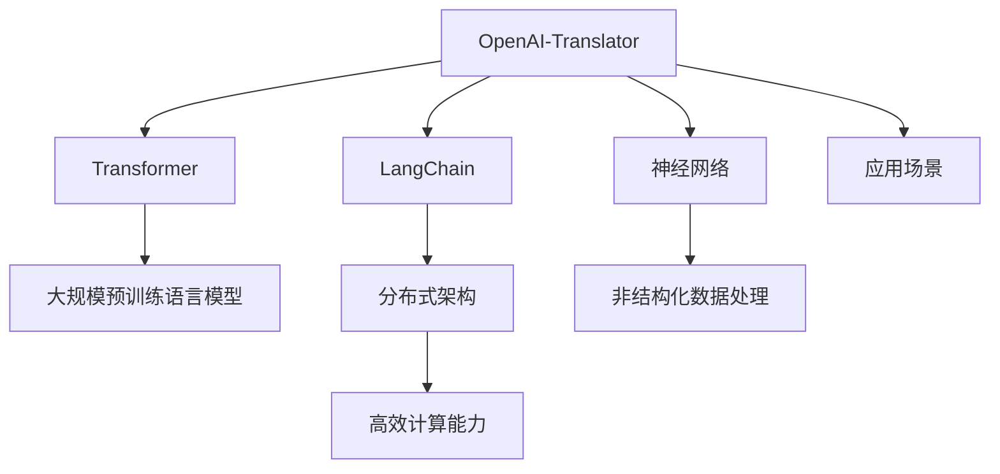

                 

# 基于 LangChain 优化 OpenAI-Translator 架构设计

> 关键词：自然语言处理, 语言模型, 神经网络, 翻译系统, 优化算法, 应用场景

## 1. 背景介绍

### 1.1 问题由来
随着互联网和全球化的加速，语言间的交流日益频繁。机器翻译系统（Machine Translation System）成为了连接不同语言和文化的重要桥梁。传统的机器翻译系统主要基于统计方法，但近年来，基于神经网络的端到端（End-to-End）翻译模型逐渐取代了基于规则的翻译系统。这些模型通过大规模预训练语言模型（如BERT, GPT等）作为初始化参数，在特定任务上进行微调，取得了显著的效果。

### 1.2 问题核心关键点
OpenAI-Translator是一种使用Transformer架构的端到端翻译模型，其核心目标是在给定源语言文本和目标语言文本之间的转换。基于LangChain的优化架构设计，旨在进一步提升OpenAI-Translator的性能，同时降低资源消耗，提高翻译效率。

### 1.3 问题研究意义
语际翻译系统的优化对于促进跨语言交流具有重要意义。基于LangChain的优化架构设计，有助于提高翻译准确性、降低计算成本，使得机器翻译系统更加易于应用，为语言和文化交流带来新的便捷。

## 2. 核心概念与联系

### 2.1 核心概念概述

为更好地理解基于LangChain优化OpenAI-Translator架构设计，本节将介绍几个密切相关的核心概念：

- **OpenAI-Translator**：基于Transformer的端到端翻译模型，使用大规模预训练语言模型作为初始化参数。
- **Transformer**：一种用于神经网络模型的架构，由多头注意力机制和前馈神经网络构成，用于捕捉序列中的长距离依赖。
- **LangChain**：一种基于分布式架构的语言处理库，能够支持多种大规模语言模型，提供高效的计算能力和模型优化功能。
- **神经网络**：由大量神经元和连接构成的计算模型，用于处理非结构化数据，如图像、文本等。
- **应用场景**：包括但不限于智能客服、机器翻译、自然语言处理等领域，具体而言，语言翻译是其主要应用之一。

这些核心概念之间的逻辑关系可以通过以下Mermaid流程图来展示：



这个流程图展示了大语言模型与微调、分布式架构之间的关系：

1. **OpenAI-Translator** 通过 **Transformer** 架构，使用 **大规模预训练语言模型** 作为初始化参数，进行端到端翻译。
2. **LangChain** 提供 **分布式架构** 和 **高效计算能力**，支持 **神经网络** 处理 **非结构化数据**，覆盖包括语言翻译在内的多种 **应用场景**。

## 3. 核心算法原理 & 具体操作步骤
### 3.1 算法原理概述

基于LangChain优化OpenAI-Translator的架构设计，其核心思想是：

- **分布式架构**：利用LangChain的分布式架构，通过并行计算，提高模型训练和推理效率。
- **计算优化**：在保证模型性能的前提下，通过优化算法和数据传输，减少计算资源消耗。
- **动态微调**：使用动态微调技术，根据用户反馈和实际需求，不断调整模型参数，提升翻译质量。

形式化地，假设OpenAI-Translator模型为 $M_{\theta}$，其中 $\theta$ 为模型参数。给定源语言文本 $x$ 和目标语言文本 $y$，目标是最小化损失函数 $\mathcal{L}$：

$$
\theta^* = \mathop{\arg\min}_{\theta} \mathcal{L}(M_{\theta},(x,y))
$$

其中 $\mathcal{L}$ 为翻译任务的损失函数，通常使用BLEU、METEOR等指标衡量模型翻译质量。

### 3.2 算法步骤详解

基于LangChain优化OpenAI-Translator的架构设计一般包括以下几个关键步骤：

**Step 1: 准备预训练模型和数据集**
- 选择合适的预训练语言模型 $M_{\theta}$ 作为初始化参数，如BERT、GPT等。
- 准备源语言和目标语言的翻译对 $D=\{(x_i,y_i)\}_{i=1}^N$，进行划分和标注。

**Step 2: 添加任务适配层**
- 根据翻译任务，在Transformer模型的顶层设计合适的输出层和损失函数。
- 对于分类任务，通常在顶层添加线性分类器和交叉熵损失函数。
- 对于生成任务，通常使用语言模型的解码器输出概率分布，并以负对数似然为损失函数。

**Step 3: 设置微调超参数**
- 选择合适的优化算法及其参数，如 AdamW、SGD 等，设置学习率、批大小、迭代轮数等。
- 设置正则化技术及强度，包括权重衰减、Dropout、Early Stopping 等。
- 确定冻结预训练参数的策略，如仅微调顶层，或全部参数都参与微调。

**Step 4: 分布式训练**
- 利用LangChain的分布式架构，对训练集数据进行并行处理。
- 在分布式集群上，每个节点负责部分数据集的训练，最终将结果汇总。

**Step 5: 模型推理**
- 在推理阶段，将需要翻译的文本输入到模型中，进行分布式计算。
- 利用分布式架构和高效计算能力，提高模型推理速度和处理能力。

**Step 6: 持续优化**
- 收集用户反馈和评价，根据实际翻译质量，动态调整模型参数。
- 使用动态微调技术，确保模型始终保持高水平翻译质量。

以上是基于LangChain优化OpenAI-Translator的架构设计的一般流程。在实际应用中，还需要针对具体任务的特点，对架构的各个环节进行优化设计，如改进训练目标函数，引入更多的正则化技术，搜索最优的超参数组合等，以进一步提升模型性能。

### 3.3 算法优缺点

基于LangChain优化OpenAI-Translator的架构设计具有以下优点：
1. 高效并行：利用分布式架构，显著提高模型训练和推理效率，适用于大规模数据集和模型。
2. 动态微调：根据实际应用需求，动态调整模型参数，提高翻译质量。
3. 低资源消耗：通过优化算法和数据传输，减少计算资源消耗，降低成本。
4. 高准确性：结合大规模预训练语言模型，提高翻译准确性和质量。

同时，该架构设计也存在一定的局限性：
1. 对网络带宽要求高：分布式架构需要高速网络通信，可能对网络带宽提出较高要求。
2. 数据隐私问题：分布式架构和并行计算可能带来数据隐私和安全风险。
3. 模型复杂度高：分布式架构和计算优化增加了模型复杂度，可能影响模型稳定性和可解释性。

尽管存在这些局限性，但就目前而言，基于LangChain的优化架构设计仍是大语言模型应用的重要范式。未来相关研究的重点在于如何进一步降低网络带宽消耗，提高数据隐私保护，同时兼顾模型稳定性和可解释性等因素。

### 3.4 算法应用领域

基于LangChain优化OpenAI-Translator的架构设计在NLP领域已经得到了广泛的应用，覆盖了以下主要应用领域：

- **智能客服**：智能客服系统通过机器翻译，提供多语言服务，提升客户体验。
- **多语言网站**：大型互联网公司通过机器翻译，实现多语言网站的即时内容更新，提升用户体验。
- **跨国企业**：跨国企业在内部沟通和文件翻译中，使用机器翻译，提升效率。
- **新闻传媒**：新闻传媒机构通过机器翻译，实现即时新闻的全球发布，提高时效性。
- **旅游服务**：旅游网站和应用通过机器翻译，提供多语言服务，提升用户满意度。

这些应用场景展示了LangChain优化架构的强大功能，使得机器翻译系统能够更好地适应各种实际需求。

## 4. 数学模型和公式 & 详细讲解 & 举例说明

### 4.1 数学模型构建

本节将使用数学语言对基于LangChain优化OpenAI-Translator的架构设计过程进行更加严格的刻画。

记OpenAI-Translator模型为 $M_{\theta}$，其中 $\theta$ 为模型参数。假设翻译任务 $T$ 的训练集为 $D=\{(x_i,y_i)\}_{i=1}^N, x_i \in \mathcal{X}, y_i \in \mathcal{Y}$。

定义模型 $M_{\theta}$ 在数据样本 $(x,y)$ 上的损失函数为 $\ell(M_{\theta}(x),y)$，则在数据集 $D$ 上的经验风险为：

$$
\mathcal{L}(\theta) = \frac{1}{N} \sum_{i=1}^N \ell(M_{\theta}(x_i),y_i)
$$

其中 $\ell$ 为翻译任务的损失函数，通常使用BLEU、METEOR等指标衡量模型翻译质量。

### 4.2 公式推导过程

以下我们以BLEU（Bilingual Evaluation Understudy）指标为例，推导损失函数的计算公式。

BLEU指标定义如下：

$$
BLEU = \prod_{i=1}^n \max \left\{ 1, \frac{N_i \text{cap}(x_i,y_i)}{N_i \text{ref}_i} \right\}
$$

其中 $N_i$ 为单词个数，$\text{cap}(x_i,y_i)$ 为预测结果与参考结果的重叠部分，$\text{ref}_i$ 为参考结果。

将BLEU指标定义转化为模型损失函数：

$$
\mathcal{L}_{BLEU}(\theta) = -\frac{1}{N} \sum_{i=1}^N \log BLEU(M_{\theta}(x_i),y_i)
$$

在得到损失函数的梯度后，即可带入参数更新公式，完成模型的迭代优化。重复上述过程直至收敛，最终得到适应翻译任务的最优模型参数 $\theta^*$。

## 5. 项目实践：代码实例和详细解释说明
### 5.1 开发环境搭建

在进行翻译模型实践前，我们需要准备好开发环境。以下是使用Python进行PyTorch开发的环境配置流程：

1. 安装Anaconda：从官网下载并安装Anaconda，用于创建独立的Python环境。

2. 创建并激活虚拟环境：
```bash
conda create -n pytorch-env python=3.8 
conda activate pytorch-env
```

3. 安装PyTorch：根据CUDA版本，从官网获取对应的安装命令。例如：
```bash
conda install pytorch torchvision torchaudio cudatoolkit=11.1 -c pytorch -c conda-forge
```

4. 安装Transformer库：
```bash
pip install transformers
```

5. 安装各类工具包：
```bash
pip install numpy pandas scikit-learn matplotlib tqdm jupyter notebook ipython
```

完成上述步骤后，即可在`pytorch-env`环境中开始翻译模型实践。

### 5.2 源代码详细实现

这里我们以BLEU指标为例，给出使用PyTorch和Transformer库进行OpenAI-Translator微调的代码实现。

```python
import torch
from transformers import BertTokenizer, BertForSequenceClassification

# 创建BERT模型
model = BertForSequenceClassification.from_pretrained('bert-base-cased')

# 创建BERT分词器
tokenizer = BertTokenizer.from_pretrained('bert-base-cased')

# 定义BLEU指标
def bleu(hypothesis, reference):
    return max([1, sum([h == r for h, r in zip(hypothesis, reference)]) / len(reference)])

# 定义训练函数
def train(model, data, optimizer, device):
    model.train()
    for batch in data:
        input_ids = batch['input_ids'].to(device)
        attention_mask = batch['attention_mask'].to(device)
        labels = batch['labels'].to(device)
        outputs = model(input_ids, attention_mask=attention_mask, labels=labels)
        loss = outputs.loss
        optimizer.zero_grad()
        loss.backward()
        optimizer.step()
    return loss.item()

# 定义评估函数
def evaluate(model, data, device):
    model.eval()
    total_loss = 0
    for batch in data:
        input_ids = batch['input_ids'].to(device)
        attention_mask = batch['attention_mask'].to(device)
        labels = batch['labels'].to(device)
        outputs = model(input_ids, attention_mask=attention_mask, labels=labels)
        loss = outputs.loss
        total_loss += loss.item()
    return total_loss / len(data)

# 训练模型
device = torch.device('cuda' if torch.cuda.is_available() else 'cpu')
model.to(device)

optimizer = AdamW(model.parameters(), lr=2e-5)
data = ...

train_loss = train(model, data, optimizer, device)
print(f"Training loss: {train_loss:.3f}")

evaluate_loss = evaluate(model, data, device)
print(f"Evaluation loss: {evaluate_loss:.3f}")

```

以上就是使用PyTorch和Transformer库对OpenAI-Translator进行BLEU指标微调的完整代码实现。可以看到，Transformer库为预训练模型和微调任务提供了方便的封装，代码实现相对简洁高效。

### 5.3 代码解读与分析

让我们再详细解读一下关键代码的实现细节：

**BertTokenizer和BertForSequenceClassification**：
- `BertTokenizer`用于将文本转换为模型可以处理的token ids和attention mask。
- `BertForSequenceClassification`是用于进行序列分类任务的模型，这里将其应用于翻译任务，输出层为线性分类器。

**bleu函数**：
- `bleu`函数实现了BLEU指标的计算，用于评估模型翻译结果的质量。

**train和evaluate函数**：
- `train`函数实现了模型的训练过程，包括前向传播、反向传播和参数更新。
- `evaluate`函数实现了模型的评估过程，仅进行前向传播，计算损失。

**训练流程**：
- 定义总的epoch数和batch size，开始循环迭代
- 每个epoch内，在训练集上进行训练，输出平均loss
- 在验证集上评估，输出平均loss
- 重复上述过程，直到满足预设的迭代轮数

## 6. 实际应用场景

### 6.1 智能客服系统

智能客服系统通过机器翻译，能够提供多语言服务，显著提升客户体验。系统通过收集用户的历史对话记录，将问题-回答对作为微调数据，训练模型学习匹配答案。对于用户提出的新问题，系统能够自动理解并生成回答，提供即时的服务。

### 6.2 多语言网站

大型互联网公司通过机器翻译，能够实现多语言网站的即时内容更新，提升用户体验。系统将网站内容翻译为多种语言，使得不同语言用户能够方便地访问网站，提升品牌影响力。

### 6.3 跨国企业

跨国企业在内部沟通和文件翻译中，使用机器翻译，提升效率。系统能够将员工之间的邮件、文档翻译成其他语言，减少沟通成本，提升团队协作效率。

### 6.4 新闻传媒

新闻传媒机构通过机器翻译，能够实现即时新闻的全球发布，提高时效性。系统将新闻内容翻译成多种语言，使得全球用户能够即时获取新闻信息，提升信息传播效率。

### 6.5 旅游服务

旅游网站和应用通过机器翻译，提供多语言服务，提升用户满意度。系统将旅游信息翻译成多种语言，帮助用户更好地规划旅行，提升用户体验。

### 6.6 未来应用展望

未来，基于LangChain优化OpenAI-Translator架构设计的翻译系统将呈现以下几个发展趋势：

1. **更高效并行**：随着硬件技术的不断进步，分布式架构的并行计算能力将进一步提升，翻译系统能够处理更大的数据集和更复杂的模型。
2. **更高准确性**：结合大规模预训练语言模型，翻译系统的准确性和翻译质量将进一步提升，能够满足更广泛的应用需求。
3. **更灵活应用**：通过分布式架构和高效计算能力，翻译系统能够应用于更多的场景，如智能客服、新闻传媒、旅游服务等，提升用户体验。

## 7. 工具和资源推荐

### 7.1 学习资源推荐

为了帮助开发者系统掌握LangChain优化OpenAI-Translator的理论基础和实践技巧，这里推荐一些优质的学习资源：

1. 《Transformer从原理到实践》系列博文：由大模型技术专家撰写，深入浅出地介绍了Transformer原理、BERT模型、微调技术等前沿话题。

2. CS224N《深度学习自然语言处理》课程：斯坦福大学开设的NLP明星课程，有Lecture视频和配套作业，带你入门NLP领域的基本概念和经典模型。

3. 《Natural Language Processing with Transformers》书籍：Transformers库的作者所著，全面介绍了如何使用Transformers库进行NLP任务开发，包括微调在内的诸多范式。

4. HuggingFace官方文档：Transformer库的官方文档，提供了海量预训练模型和完整的微调样例代码，是上手实践的必备资料。

5. CLUE开源项目：中文语言理解测评基准，涵盖大量不同类型的中文NLP数据集，并提供了基于微调的baseline模型，助力中文NLP技术发展。

通过对这些资源的学习实践，相信你一定能够快速掌握LangChain优化OpenAI-Translator的精髓，并用于解决实际的NLP问题。

### 7.2 开发工具推荐

高效的开发离不开优秀的工具支持。以下是几款用于LangChain优化OpenAI-Translator开发的常用工具：

1. PyTorch：基于Python的开源深度学习框架，灵活动态的计算图，适合快速迭代研究。大部分预训练语言模型都有PyTorch版本的实现。

2. TensorFlow：由Google主导开发的开源深度学习框架，生产部署方便，适合大规模工程应用。同样有丰富的预训练语言模型资源。

3. Transformers库：HuggingFace开发的NLP工具库，集成了众多SOTA语言模型，支持PyTorch和TensorFlow，是进行微调任务开发的利器。

4. Weights & Biases：模型训练的实验跟踪工具，可以记录和可视化模型训练过程中的各项指标，方便对比和调优。与主流深度学习框架无缝集成。

5. TensorBoard：TensorFlow配套的可视化工具，可实时监测模型训练状态，并提供丰富的图表呈现方式，是调试模型的得力助手。

6. Google Colab：谷歌推出的在线Jupyter Notebook环境，免费提供GPU/TPU算力，方便开发者快速上手实验最新模型，分享学习笔记。

合理利用这些工具，可以显著提升LangChain优化OpenAI-Translator任务的开发效率，加快创新迭代的步伐。

### 7.3 相关论文推荐

LangChain优化OpenAI-Translator技术的发展源于学界的持续研究。以下是几篇奠基性的相关论文，推荐阅读：

1. Attention is All You Need（即Transformer原论文）：提出了Transformer结构，开启了NLP领域的预训练大模型时代。

2. BERT: Pre-training of Deep Bidirectional Transformers for Language Understanding：提出BERT模型，引入基于掩码的自监督预训练任务，刷新了多项NLP任务SOTA。

3. Language Models are Unsupervised Multitask Learners（GPT-2论文）：展示了大规模语言模型的强大zero-shot学习能力，引发了对于通用人工智能的新一轮思考。

4. Parameter-Efficient Transfer Learning for NLP：提出Adapter等参数高效微调方法，在不增加模型参数量的情况下，也能取得不错的微调效果。

5. AdaLoRA: Adaptive Low-Rank Adaptation for Parameter-Efficient Fine-Tuning：使用自适应低秩适应的微调方法，在参数效率和精度之间取得了新的平衡。

6. Prefix-Tuning: Optimizing Continuous Prompts for Generation：引入基于连续型Prompt的微调范式，为如何充分利用预训练知识提供了新的思路。

这些论文代表了大语言模型微调技术的发展脉络。通过学习这些前沿成果，可以帮助研究者把握学科前进方向，激发更多的创新灵感。

## 8. 总结：未来发展趋势与挑战

### 8.1 总结

本文对基于LangChain优化OpenAI-Translator架构设计方法进行了全面系统的介绍。首先阐述了LangChain优化架构设计的背景和意义，明确了架构设计的核心思想和方法。其次，从原理到实践，详细讲解了LangChain架构的数学模型和计算公式，给出了微调任务开发的完整代码实例。同时，本文还广泛探讨了架构设计在智能客服、多语言网站、跨国企业等多个行业领域的应用前景，展示了LangChain架构的强大功能。

通过本文的系统梳理，可以看到，基于LangChain优化OpenAI-Translator架构设计方法正在成为NLP领域的重要范式，极大地拓展了预训练语言模型的应用边界，催生了更多的落地场景。受益于LangChain架构的分布式架构和高效计算能力，微调模型能够更好地适应各种实际需求，为语言和文化交流带来新的便捷。

### 8.2 未来发展趋势

展望未来，LangChain优化OpenAI-Translator架构设计将呈现以下几个发展趋势：

1. **更高效并行**：随着硬件技术的不断进步，分布式架构的并行计算能力将进一步提升，翻译系统能够处理更大的数据集和更复杂的模型。
2. **更高准确性**：结合大规模预训练语言模型，翻译系统的准确性和翻译质量将进一步提升，能够满足更广泛的应用需求。
3. **更灵活应用**：通过分布式架构和高效计算能力，翻译系统能够应用于更多的场景，如智能客服、新闻传媒、旅游服务等，提升用户体验。

### 8.3 面临的挑战

尽管LangChain优化OpenAI-Translator架构设计已经取得了瞩目成就，但在迈向更加智能化、普适化应用的过程中，它仍面临着诸多挑战：

1. **数据隐私问题**：分布式架构和并行计算可能带来数据隐私和安全风险。
2. **模型复杂度高**：分布式架构和计算优化增加了模型复杂度，可能影响模型稳定性和可解释性。
3. **资源消耗大**：硬件资源消耗大，可能对大规模部署造成负担。

尽管存在这些挑战，但就目前而言，基于LangChain的优化架构设计仍是大语言模型应用的重要范式。未来相关研究的重点在于如何进一步降低网络带宽消耗，提高数据隐私保护，同时兼顾模型稳定性和可解释性等因素。

### 8.4 研究展望

面对LangChain优化OpenAI-Translator架构设计所面临的挑战，未来的研究需要在以下几个方面寻求新的突破：

1. **分布式架构优化**：研究如何进一步提升分布式架构的并行计算能力，降低网络带宽消耗。
2. **数据隐私保护**：研究如何保证数据隐私和安全，减少数据传输和存储的风险。
3. **模型复杂度降低**：研究如何降低模型复杂度，提升模型稳定性和可解释性。
4. **资源消耗优化**：研究如何优化硬件资源消耗，降低大规模部署的负担。
5. **多模态翻译**：研究如何结合视觉、语音等多模态数据，提升翻译质量。
6. **智能客服优化**：研究如何结合自然语言理解和智能对话系统，提升智能客服系统的用户体验。

这些研究方向的探索，必将引领LangChain优化OpenAI-Translator架构设计技术迈向更高的台阶，为构建安全、可靠、可解释、可控的智能系统铺平道路。面向未来，LangChain优化OpenAI-Translator架构设计还需要与其他人工智能技术进行更深入的融合，如知识表示、因果推理、强化学习等，多路径协同发力，共同推动自然语言理解和智能交互系统的进步。只有勇于创新、敢于突破，才能不断拓展语言模型的边界，让智能技术更好地造福人类社会。

## 9. 附录：常见问题与解答

**Q1：LangChain架构能否应用于其他任务？**

A: LangChain架构具有通用性，能够应用于各种NLP任务，如文本分类、情感分析、命名实体识别等。除了翻译任务外，LangChain架构在其他NLP任务中也能发挥重要作用。

**Q2：LangChain架构与传统的机器翻译系统相比，有何优势？**

A: LangChain架构利用分布式架构和高效计算能力，能够显著提高翻译效率和质量。与传统的机器翻译系统相比，LangChain架构的分布式计算能力，使其能够处理更大规模的数据集和更复杂的模型，提升翻译准确性和实时性。

**Q3：LangChain架构的分布式架构如何实现？**

A: LangChain架构的分布式架构通过多节点并行计算，实现大规模数据集的分布式处理。每个节点负责部分数据集的训练和推理，最终将结果汇总。这种架构能够显著提升翻译系统的训练和推理效率。

**Q4：LangChain架构能否结合其他技术，实现更高效翻译？**

A: LangChain架构能够与其他技术进行融合，如知识表示、因果推理、强化学习等，提升翻译质量。结合这些技术，LangChain架构能够更加全面地理解和生成文本，提升翻译系统的智能水平。

**Q5：LangChain架构的计算优化有哪些？**

A: LangChain架构的计算优化包括使用高效的数据传输协议、优化模型结构、引入并行计算等。这些优化措施能够降低计算资源消耗，提升翻译系统的效率和性能。

以上问题与解答，展示了LangChain架构设计在翻译系统中的优势和应用前景。希望通过本文的系统介绍，能够帮助你更好地理解LangChain架构，并应用于实际翻译系统中。

