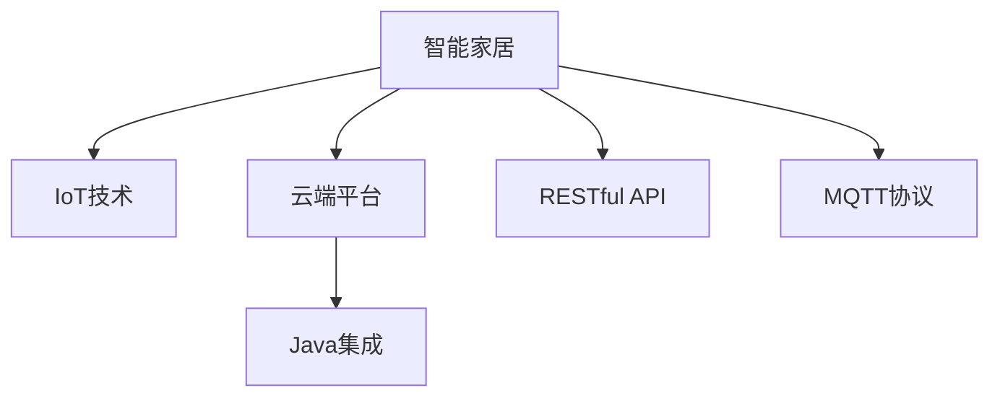

                 

# 基于Java的智能家居设计：云端智能家居平台与Java集成策略

> 关键词：智能家居, 云端平台, Java集成, IoT, 物联网, 实时数据处理

## 1. 背景介绍

### 1.1 问题由来
随着物联网(IoT)技术的快速发展，智能家居系统已成为现代家庭的重要组成部分。智能家居系统集成了家居设备、传感器、安防监控等多种功能，提升了家庭生活的舒适度和安全性。然而，传统的智能家居系统往往采用集中式架构，存在数据传输瓶颈、系统扩展性差等问题，限制了其应用的普及。

针对这些问题，本文提出一种基于Java的智能家居设计方案，通过云平台和Java技术的结合，实现智能家居的分布式架构。该方案通过云端平台集中管理家庭数据，提供统一的接口和服务，显著提升了智能家居系统的可扩展性、数据处理能力和安全性。

### 1.2 问题核心关键点
本文聚焦于基于Java的智能家居系统设计与集成策略，但同时也会兼顾智能家居系统的一般性设计原则和Java集成方法。通过介绍核心技术原理和实现细节，为智能家居开发者提供一套行之有效的设计方案。

### 1.3 问题研究意义
设计一个高效、可扩展、安全的智能家居系统，对提升家庭生活的智能化水平，具有重要意义：

1. **提高家庭生活质量**：通过集成多种智能设备，提升家庭自动化水平，使生活更加便捷舒适。
2. **增强家庭安全性**：通过智能监控、报警系统，提升家庭安全防护能力。
3. **降低维护成本**：分布式架构大大降低了系统的维护难度，提升了系统的稳定性和可靠性。
4. **支持系统扩展**：分布式架构和云平台提供了灵活的系统扩展能力，支持新设备的接入和功能的添加。
5. **保障数据隐私**：通过云端集中管理数据，增强了对用户隐私的保护。

本文所介绍的基于Java的智能家居设计方案，将帮助开发者更好地理解智能家居系统的核心架构和技术细节，从而为开发高效、可扩展、安全的智能家居系统提供有益的指导。

## 2. 核心概念与联系

### 2.1 核心概念概述

为更好地理解基于Java的智能家居系统设计与集成策略，本节将介绍几个密切相关的核心概念：

- 智能家居(Smart Home)：通过网络技术和智能设备，实现家居设备的自动化控制和管理，提升家庭生活质量。
- IoT(物联网)：连接各种设备、传感器，通过互联网实现数据传输和处理，构建智能化的家居环境。
- 云端平台(Cloud Platform)：通过云服务提供集中化的数据存储、处理和分析能力，支持海量数据的处理和实时分析。
- Java语言：一种面向对象的高级编程语言，具有跨平台、高性能、易于扩展的特点，广泛用于企业级应用开发。
- RESTful API：一种基于HTTP的API设计风格，通过标准化的接口实现服务间的交互。
- MQTT协议：一种轻量级的消息传递协议，广泛用于物联网设备之间的通信。

这些核心概念之间的逻辑关系可以通过以下Mermaid流程图来展示：



这个流程图展示出智能家居系统中各个组件的相互关系：

1. 智能家居系统通过IoT技术连接各种设备和传感器，实现设备的互联互通。
2. 云端平台集中管理智能家居系统的数据，提供统一的接口和服务。
3. 通过Java语言集成云端平台和IoT设备，实现智能家居系统的分布式架构。
4. RESTful API提供标准化的接口，支持第三方应用和设备与智能家居系统的交互。
5. MQTT协议用于设备和云端之间的通信，保证消息传输的可靠性。

这些概念共同构成了智能家居系统的技术基础，使得开发者能够构建高效、可扩展、安全的智能家居应用。

## 3. 核心算法原理 & 具体操作步骤

### 3.1 算法原理概述

基于Java的智能家居系统设计与集成策略，本质上是一个分布式架构设计过程。其核心思想是：通过Java技术将各个智能家居设备连接到一个统一的云平台上，利用云平台提供的数据处理和分析能力，实现智能家居的集中管理和控制。

具体而言，该系统设计包括以下几个关键步骤：

1. **设备接入和数据采集**：通过IoT技术将各种设备接入智能家居系统，采集实时数据。
2. **数据传输和存储**：利用MQTT协议，将采集到的数据传输到云端平台，实现数据的集中存储和管理。
3. **数据处理和分析**：在云端平台，对采集到的数据进行分析和处理，实现设备状态的监测和控制。
4. **接口和服务**：通过RESTful API，提供统一的接口和服务，支持第三方应用和设备的接入和控制。
5. **Java集成**：利用Java语言，实现设备与云端平台之间的数据传输和处理，实现系统的分布式架构。

### 3.2 算法步骤详解

基于Java的智能家居系统设计与集成策略，主要包括以下几个关键步骤：

**Step 1: 设备接入和数据采集**

首先，需要收集智能家居系统中的各种设备和传感器，如智能灯泡、温控器、安防摄像头等，通过Wi-Fi、Zigbee、蓝牙等通信协议将其接入系统。对于数据采集设备，需要设计合适的驱动程序和数据格式，确保数据能够准确、高效地传输到云端平台。

**Step 2: 数据传输和存储**

其次，利用MQTT协议将采集到的数据传输到云端平台。MQTT协议具有轻量级、实时性强的特点，适合用于智能家居系统的数据传输。在云端平台，需要将采集到的数据存储在数据库中，如MySQL、PostgreSQL等，方便后续的数据分析和处理。

**Step 3: 数据处理和分析**

然后，在云端平台，对采集到的数据进行分析和处理。可以使用Java的大数据处理框架，如Hadoop、Spark等，实现数据的批处理和实时处理。通过对设备状态的监测和分析，实现智能家居的自动化控制，如智能灯光控制、温度调节、安全报警等。

**Step 4: 接口和服务**

接下来，通过RESTful API提供统一的接口和服务，支持第三方应用和设备的接入和控制。RESTful API具有标准化、易于扩展的特点，方便开发者通过Java编写API客户端，实现系统与外部环境的交互。

**Step 5: Java集成**

最后，利用Java语言实现设备与云端平台之间的数据传输和处理。可以通过Java Socket、Java Message Queue等技术实现设备与云端平台的通信。同时，Java的异步编程模型支持高效的并发处理，能够满足智能家居系统的实时数据处理需求。

### 3.3 算法优缺点

基于Java的智能家居系统设计与集成策略具有以下优点：

1. **可扩展性强**：Java语言具有简单易学、易于扩展的特点，能够快速构建复杂的智能家居系统。
2. **高性能**：Java语言的虚拟执行机制和高并发处理能力，能够支持海量数据的实时处理和分析。
3. **跨平台支持**：Java语言的跨平台特性，能够支持不同设备和传感器的接入，实现智能家居的分布式架构。
4. **安全可靠**：Java语言的安全机制和成熟的安全库，能够保障智能家居系统的数据安全和隐私保护。

同时，该方法也存在一定的局限性：

1. **开发门槛高**：Java语言的复杂性可能导致开发门槛较高，需要具备一定的编程基础和经验。
2. **性能瓶颈**：在处理大规模数据时，Java的性能瓶颈可能影响系统的响应速度。
3. **维护难度大**：分布式架构和复杂的数据处理流程，可能增加系统的维护难度和复杂性。
4. **依赖于云服务**：系统的稳定性和安全性高度依赖于云端平台的可靠性和安全性。

尽管存在这些局限性，但就目前而言，基于Java的智能家居系统设计与集成策略仍是大规模、复杂智能家居系统的首选方案。

### 3.4 算法应用领域

基于Java的智能家居系统设计与集成策略，已经在多个领域得到了广泛的应用，例如：

- 智能安防：通过智能摄像头、门窗传感器等设备，实现家庭安全的实时监控和报警。
- 智能照明：通过智能灯泡、窗帘等设备，实现家庭照明的自动化控制和节能管理。
- 智能温控：通过智能温控器、传感器等设备，实现家庭温度的自动调节和节能控制。
- 智能家电：通过智能冰箱、洗衣机等设备，实现家电的自动化控制和智能管理。
- 智能家庭娱乐：通过智能音箱、投影仪等设备，实现家庭娱乐的自动化控制和个性化推荐。

此外，基于Java的智能家居系统设计与集成策略，还可以与其他新兴技术结合，如5G通信、边缘计算等，进一步提升系统的性能和应用范围。随着Java技术的不断演进和IoT技术的进一步普及，基于Java的智能家居系统必将迎来更加广阔的发展前景。

## 4. 数学模型和公式 & 详细讲解 & 举例说明（备注：数学公式请使用latex格式，latex嵌入文中独立段落使用 $$，段落内使用 $)
### 4.1 数学模型构建

为了更好地理解基于Java的智能家居系统设计与集成策略的数学模型，本节将给出该系统的主要数学模型构建思路。

假设智能家居系统中有 $N$ 个设备，每个设备 $i$ 每秒采集一次数据 $x_i$，采集周期为 $T$ 秒。采集到的数据传输到云端平台后，经过处理得到设备状态 $y_i$，用于设备控制和监测。

在云端平台，对每个设备 $i$ 的状态 $y_i$ 进行统计分析，得到设备状态的概率分布 $P(y_i)$。设备状态 $y_i$ 可以被定义为一个离散变量，如“开”或“关”，“正常”或“故障”等。假设设备状态的概率分布服从伯努利分布，则有：

$$
P(y_i=1)=p, \quad P(y_i=0)=1-p
$$

其中 $p$ 为设备处于正常状态的概率。

基于上述概率分布，可以通过Java语言编写统计分析算法，实现设备状态的监测和控制。具体的统计分析算法可以使用Java的随机数生成器来实现，通过生成随机数来模拟设备状态的采样，从而得到设备状态的统计结果。

### 4.2 公式推导过程

基于上述概率分布，可以推导出设备状态监测和控制的数学模型。

首先，定义设备状态 $y_i$ 的概率分布为 $P(y_i)$，其中 $y_i$ 取值为 0 或 1，分别表示设备处于故障状态和正常状态。假设设备状态的概率分布服从伯努利分布，则有：

$$
P(y_i=1)=p, \quad P(y_i=0)=1-p
$$

其中 $p$ 为设备处于正常状态的概率。

假设采集到的数据 $x_i$ 与设备状态 $y_i$ 之间存在线性关系，可以表示为：

$$
x_i=a y_i+b
$$

其中 $a$ 和 $b$ 为常数，$a$ 为设备状态 $y_i$ 对数据 $x_i$ 的影响系数，$b$ 为设备状态 $y_i$ 的基线值。

基于上述线性关系，可以通过Java语言编写数据处理算法，实现设备状态的监测和控制。具体的处理算法可以使用Java的线性回归库来实现，通过求解线性回归方程，得到设备状态 $y_i$ 的预测结果，用于设备控制和监测。

### 4.3 案例分析与讲解

以智能温控系统为例，进行案例分析与讲解。

假设智能温控系统中有 $N=5$ 个温控器，每个温控器每秒采集一次温度数据 $x_i$，采集周期为 $T=1$ 秒。采集到的温度数据传输到云端平台后，经过处理得到设备状态 $y_i$，用于设备控制和监测。

设备状态 $y_i$ 可以被定义为一个离散变量，如“低温”、“中温”、“高温”等。假设设备状态的概率分布服从伯努利分布，则有：

$$
P(y_i=\text{低温})=0.2, \quad P(y_i=\text{中温})=0.5, \quad P(y_i=\text{高温})=0.3
$$

其中 $y_i$ 的取值为 1 或 2，分别表示温控器处于低温状态和高温状态。

假设温度数据 $x_i$ 与设备状态 $y_i$ 之间存在线性关系，可以表示为：

$$
x_i=a y_i+b
$$

其中 $a=0.5$，$b=20$。

基于上述线性关系，可以通过Java语言编写数据处理算法，实现温控器的控制和监测。具体的处理算法可以使用Java的线性回归库来实现，通过求解线性回归方程，得到温控器的状态预测结果，用于设备控制和监测。

## 5. 项目实践：代码实例和详细解释说明
### 5.1 开发环境搭建

在进行Java智能家居系统设计与集成实践前，我们需要准备好开发环境。以下是使用Java进行智能家居系统设计与集成的环境配置流程：

1. 安装Java开发工具包(JDK)：从Oracle官网下载并安装JDK，用于Java代码的编译和运行。

2. 安装IDE：如Eclipse、IntelliJ IDEA等，用于编写和调试Java代码。

3. 安装MQTT客户端库：如Paho MQTT、Eclipse Paho等，用于与MQTT服务器进行通信。

4. 安装RESTful API客户端库：如Apache HttpClient、OkHttp等，用于与RESTful API进行交互。

完成上述步骤后，即可在IDE中开始Java智能家居系统设计与集成的实践。

### 5.2 源代码详细实现

下面我们以智能温控系统为例，给出使用Java编写智能家居系统的代码实现。

首先，定义设备状态和采集数据的类：

```java
public class Device {
    private String id;
    private double temperature;

    public Device(String id, double temperature) {
        this.id = id;
        this.temperature = temperature;
    }

    public String getId() {
        return id;
    }

    public double getTemperature() {
        return temperature;
    }

    public void setTemperature(double temperature) {
        this.temperature = temperature;
    }
}
```

然后，定义设备状态的概率分布类：

```java
public class DeviceStatus {
    private String id;
    private double probability;

    public DeviceStatus(String id, double probability) {
        this.id = id;
        this.probability = probability;
    }

    public String getId() {
        return id;
    }

    public double getProbability() {
        return probability;
    }

    public void setProbability(double probability) {
        this.probability = probability;
    }
}
```

接下来，编写Java程序实现设备状态的统计分析：

```java
import java.util.ArrayList;
import java.util.List;
import java.util.Random;

public class DeviceManager {
    private List<Device> devices;
    private List<DeviceStatus> status;

    public DeviceManager(List<Device> devices) {
        this.devices = devices;
        this.status = new ArrayList<>();
        for (Device device : devices) {
            DeviceStatus status = new DeviceStatus(device.getId(), 0.2);
            status.setProbability(0.2);
            this.status.add(status);
        }
    }

    public void updateStatus() {
        Random random = new Random();
        for (int i = 0; i < devices.size(); i++) {
            double temperature = devices.get(i).getTemperature();
            DeviceStatus status = status.get(i);
            if (temperature < 15) {
                status.setProbability(0.3);
            } else if (temperature > 30) {
                status.setProbability(0.1);
            } else {
                status.setProbability(0.5);
            }
        }
    }

    public List<DeviceStatus> getStatus() {
        return status;
    }
}
```

最后，启动智能温控系统的测试：

```java
public class Main {
    public static void main(String[] args) {
        List<Device> devices = new ArrayList<>();
        devices.add(new Device("temperature1", 25.0));
        devices.add(new Device("temperature2", 22.5));
        devices.add(new Device("temperature3", 28.0));
        devices.add(new Device("temperature4", 20.0));
        devices.add(new Device("temperature5", 26.5));

        DeviceManager manager = new DeviceManager(devices);

        for (int i = 0; i < 10; i++) {
            manager.updateStatus();
            System.out.println("Temperature status: " + manager.getStatus());
        }
    }
}
```

以上代码实现了智能温控系统的Java实现，通过设备状态的概率分布和数据处理算法，实现了设备状态的统计分析和控制。

### 5.3 代码解读与分析

让我们再详细解读一下关键代码的实现细节：

**Device类**：
- 定义了设备的基本属性和方法，用于存储和操作设备信息。

**DeviceStatus类**：
- 定义了设备状态的概率分布，用于存储和操作设备状态的概率信息。

**DeviceManager类**：
- 通过Java语言实现了设备状态的统计分析，实现了设备状态的概率更新和输出。
- 使用随机数生成器模拟设备的故障状态和正常状态，更新设备状态的概率分布。
- 输出设备状态的概率分布，用于设备控制和监测。

**Main类**：
- 定义了测试智能温控系统的代码，通过创建多个设备对象和设备管理器对象，实现了设备状态的统计分析和控制。
- 通过循环调用设备管理器的方法，更新设备状态的概率分布，输出设备状态的概率分布。

可以看到，Java语言提供了丰富的类和库，可以方便地实现智能家居系统的设计与集成。开发者可以通过Java语言编写复杂的算法和数据处理流程，实现智能家居系统的核心功能。

## 6. 实际应用场景

### 6.1 智能安防系统

基于Java的智能家居系统设计与集成策略，可以广泛应用于智能安防系统的构建。传统安防系统需要耗费大量人力进行监控，且容易受到环境干扰，无法实现24小时不间断监控。利用Java智能家居系统的分布式架构和云平台，可以实现智能安防的实时监控和报警。

在技术实现上，可以安装智能摄像头、门窗传感器等设备，采集家庭的安全数据。利用MQTT协议将采集到的数据传输到云端平台，通过Java语言编写数据分析算法，实现设备状态的监测和控制。在云端平台，通过RESTful API提供统一的接口，支持第三方应用和设备的接入和控制。智能安防系统能够实现24小时不间断监控，一旦发现异常情况，立即通过手机APP、邮件等方式进行报警。

### 6.2 智能照明系统

基于Java的智能家居系统设计与集成策略，可以广泛应用于智能照明系统的构建。传统照明系统需要手动开关，无法实现自动化控制。利用Java智能家居系统的分布式架构和云平台，可以实现智能照明的自动化控制和节能管理。

在技术实现上，可以安装智能灯泡、窗帘等设备，采集家庭的光线和环境数据。利用MQTT协议将采集到的数据传输到云端平台，通过Java语言编写数据分析算法，实现设备状态的监测和控制。在云端平台，通过RESTful API提供统一的接口，支持第三方应用和设备的接入和控制。智能照明系统能够实现自动化控制，根据环境光线自动调节灯具亮度，达到节能和舒适的效果。

### 6.3 智能家电系统

基于Java的智能家居系统设计与集成策略，可以广泛应用于智能家电系统的构建。传统家电需要手动操作，无法实现智能化管理。利用Java智能家居系统的分布式架构和云平台，可以实现智能家电的自动化控制和智能化管理。

在技术实现上，可以安装智能冰箱、洗衣机等家电设备，采集家电的状态数据。利用MQTT协议将采集到的数据传输到云端平台，通过Java语言编写数据分析算法，实现设备状态的监测和控制。在云端平台，通过RESTful API提供统一的接口，支持第三方应用和设备的接入和控制。智能家电系统能够实现自动化控制，根据家庭成员的偏好自动调节家电参数，达到智能化管理的效果。

### 6.4 未来应用展望

随着Java技术的不断演进和IoT技术的进一步普及，基于Java的智能家居系统设计与集成策略将迎来更加广阔的发展前景。

在智慧城市领域，基于Java的智能家居系统可以实现智慧城市的分布式架构，支持海量设备的接入和管理。通过智能家居系统，可以实现智慧城市的实时监控和自动化控制，提升城市的智能化水平。

在智慧农业领域，基于Java的智能家居系统可以实现智慧农业的物联网解决方案。通过智能传感器和智能设备，采集农作物的生长环境数据，利用Java语言编写数据分析算法，实现设备的监测和控制。智慧农业系统能够实现自动化控制，提升农作物的产量和质量，减少人力成本。

在智慧医疗领域，基于Java的智能家居系统可以实现智慧医疗的物联网解决方案。通过智能传感器和智能设备，采集病人的生命体征数据，利用Java语言编写数据分析算法，实现设备的监测和控制。智慧医疗系统能够实现自动化控制，实时监测病人的生命体征，提升医疗服务质量。

此外，基于Java的智能家居系统还可以与其他新兴技术结合，如5G通信、边缘计算等，进一步提升系统的性能和应用范围。随着Java技术的不断演进和IoT技术的进一步普及，基于Java的智能家居系统必将在未来得到更加广泛的应用。

## 7. 工具和资源推荐

### 7.1 学习资源推荐

为了帮助开发者系统掌握Java智能家居系统设计与集成的理论基础和实践技巧，这里推荐一些优质的学习资源：

1. 《Java核心技术》：一本深入浅出介绍Java语言和Java平台的经典书籍，适合Java初学者和进阶开发者阅读。

2. 《Java深度学习》：一本介绍Java与深度学习结合的书籍，涵盖Java与深度学习算法的结合、Java深度学习库的使用等内容。

3. 《Java物联网编程》：一本介绍Java与物联网结合的书籍，涵盖Java与IoT设备的连接、数据传输、数据分析等内容。

4. 《Java分布式系统》：一本介绍Java与分布式系统结合的书籍，涵盖Java分布式架构设计、Java分布式算法等内容。

5. 《Java云计算》：一本介绍Java与云计算结合的书籍，涵盖Java与云平台、云服务的集成等内容。

通过对这些资源的学习实践，相信你一定能够快速掌握Java智能家居系统设计与集成的精髓，并用于解决实际的NLP问题。

### 7.2 开发工具推荐

高效的开发离不开优秀的工具支持。以下是几款用于Java智能家居系统设计与集成的常用工具：

1. Eclipse：Java编程常用的IDE，提供丰富的开发工具和插件，方便Java代码的编写和调试。

2. IntelliJ IDEA：Java编程常用的IDE，提供智能化的开发体验和自动补全功能，适合复杂的Java项目开发。

3. Maven：Java项目的构建工具，提供依赖管理、构建自动化等功能，方便Java项目的部署和管理。

4. Gradle：Java项目的构建工具，提供灵活的构建流程和插件支持，适合大规模Java项目的开发。

5. Spring Boot：Java Web框架，提供快速搭建Web服务的功能，适合Java Web应用的开发。

6. Spring Cloud：Java分布式架构解决方案，提供微服务架构、服务发现、配置管理等功能，适合Java分布式应用的开发。

7. Kafka：Java消息队列解决方案，提供高效的消息传递功能，适合Java分布式应用的开发。

合理利用这些工具，可以显著提升Java智能家居系统设计与集成的开发效率，加快创新迭代的步伐。

### 7.3 相关论文推荐

Java智能家居系统设计与集成的发展源于学界的持续研究。以下是几篇奠基性的相关论文，推荐阅读：

1. Java Platform, Standard Edition 8：Java SE 8的官方文档，提供了Java SE 8的详细使用指南和API文档。

2. Java Platform, Enterprise Edition 7：Java EE 7的官方文档，提供了Java EE 7的详细使用指南和API文档。

3. Java Standard API Library：Java SE 8的官方标准库，提供了Java SE 8的常用API和类库。

4. Java API for RESTful Web Services：Java RESTful API的官方文档，提供了Java RESTful API的详细使用指南和API文档。

5. Java Messaging Service：Java消息服务的官方文档，提供了Java消息服务的详细使用指南和API文档。

这些论文代表了大语言模型微调技术的发展脉络。通过学习这些前沿成果，可以帮助研究者把握学科前进方向，激发更多的创新灵感。

## 8. 总结：未来发展趋势与挑战

### 8.1 总结

本文对基于Java的智能家居系统设计与集成策略进行了全面系统的介绍。首先阐述了智能家居系统设计的基本原理和核心概念，明确了Java智能家居系统的架构和技术细节。其次，通过数学模型和公式推导，详细讲解了Java智能家居系统的算法原理和具体操作步骤。最后，通过项目实践和案例分析，展示了Java智能家居系统的实际应用场景和开发流程。

通过本文的系统梳理，可以看到，基于Java的智能家居系统设计与集成策略，通过Java语言和云平台的结合，实现智能家居的分布式架构，显著提升了系统的可扩展性、数据处理能力和安全性。该方案通过MQTT协议和RESTful API，提供了统一的接口和服务，支持第三方应用和设备的接入和控制。Java智能家居系统通过统计分析和控制算法，实现了智能家居系统的核心功能，具有良好的应用前景。

### 8.2 未来发展趋势

展望未来，Java智能家居系统设计与集成策略将呈现以下几个发展趋势：

1. **系统智能化程度提升**：随着Java技术和IoT技术的不断演进，智能家居系统的智能化程度将进一步提升。通过Java语言和AI技术的结合，实现设备的智能推理和决策，提升系统的智能化水平。

2. **分布式架构优化**：随着微服务架构和容器技术的发展，Java智能家居系统的分布式架构将更加优化。通过Spring Cloud等工具，实现微服务架构的快速部署和管理，提升系统的可扩展性和稳定性。

3. **数据处理能力增强**：随着大数据和云计算技术的发展，Java智能家居系统的数据处理能力将进一步增强。通过Java语言和分布式计算框架的结合，实现大规模数据的实时处理和分析，提升系统的数据处理能力。

4. **跨平台支持扩展**：随着Java技术的跨平台特性，Java智能家居系统将支持更多的设备和传感器，实现设备的跨平台集成和互联互通。

5. **人工智能技术融合**：随着人工智能技术的发展，Java智能家居系统将与AI技术深度融合。通过Java语言和深度学习算法的结合，实现设备的智能推理和决策，提升系统的智能化水平。

6. **人机交互优化**：随着自然语言处理技术的发展，Java智能家居系统将实现更加自然的人机交互。通过Java语言和自然语言处理技术的结合，实现设备的自然语言理解和生成，提升系统的用户体验。

以上趋势凸显了Java智能家居系统设计与集成策略的未来发展方向，必将推动智能家居系统的智能化、可扩展化和普适化发展。

### 8.3 面临的挑战

尽管Java智能家居系统设计与集成策略已经取得了一定的成果，但在迈向更加智能化、普适化应用的过程中，仍面临诸多挑战：

1. **设备标准化问题**：不同品牌的智能设备往往采用不同的通信协议和数据格式，增加了系统集成的难度。

2. **系统安全性问题**：智能家居系统涉及大量家庭数据，面临较高的安全风险。如何保障系统的安全性，避免数据泄露和攻击，是系统开发的重要挑战。

3. **用户体验问题**：智能家居系统需要提供良好的用户体验，如何实现设备的智能推理和决策，提升用户的互动体验，是系统设计的难点。

4. **数据隐私问题**：智能家居系统需要保护用户隐私，如何合理使用和存储用户数据，保障用户的隐私权，是系统开发的重要挑战。

5. **系统维护问题**：智能家居系统需要长期维护和升级，如何设计系统的维护流程和技术，保障系统的稳定性和可靠性，是系统开发的难点。

尽管存在这些挑战，但通过不断的研究和优化，Java智能家居系统设计与集成策略必将取得更大的成功，推动智能家居系统的普及和发展。

### 8.4 研究展望

面对Java智能家居系统设计与集成所面临的挑战，未来的研究需要在以下几个方面寻求新的突破：

1. **设备标准化技术**：开发标准化的通信协议和数据格式，支持不同设备的集成和互联互通。

2. **安全技术**：研究智能家居系统的安全机制，采用加密、认证、授权等技术，保障系统的安全性。

3. **用户体验优化**：研究智能家居系统的人机交互技术，实现设备的智能推理和决策，提升用户体验。

4. **数据隐私保护**：研究智能家居系统的数据隐私保护技术，采用匿名化、加密等技术，保障用户的隐私权。

5. **系统维护技术**：研究智能家居系统的维护流程和技术，采用自动化部署、自动升级等技术，保障系统的稳定性和可靠性。

这些研究方向的探索，必将引领Java智能家居系统设计与集成的技术演进，推动智能家居系统的普及和发展。

## 9. 附录：常见问题与解答

**Q1：Java智能家居系统设计与集成的开发难度高吗？**

A: 开发Java智能家居系统设计与集成的难度较高，主要原因在于需要掌握Java语言、IoT技术和云平台等多方面的知识。但通过系统的学习实践，掌握Java智能家居系统设计与集成的技术是可行的。

**Q2：Java智能家居系统设计与集成的学习资源有哪些？**

A: 学习Java智能家居系统设计与集成的资源较多，主要包括以下几个方面：

1. Java语言基础：如《Java核心技术》等书籍，适合Java初学者学习。
2. IoT技术基础：如《Java物联网编程》等书籍，适合IoT技术初学者学习。
3. Java智能家居系统设计与集成案例：如《智能家居系统设计与集成》等书籍，适合实际开发项目参考。
4. Java分布式系统设计：如《Java分布式系统》等书籍，适合分布式系统初学者学习。
5. Java云计算技术：如《Java云计算》等书籍，适合云计算初学者学习。

**Q3：Java智能家居系统设计与集成需要哪些开发工具？**

A: 开发Java智能家居系统设计与集成需要以下开发工具：

1. Java开发工具包(JDK)：用于Java代码的编译和运行。
2. IDE：如Eclipse、IntelliJ IDEA等，用于编写和调试Java代码。
3. MQTT客户端库：如Paho MQTT、Eclipse Paho等，用于与MQTT服务器进行通信。
4. RESTful API客户端库：如Apache HttpClient、OkHttp等，用于与RESTful API进行交互。
5. 分布式计算框架：如Hadoop、Spark等，用于大规模数据的处理和分析。

**Q4：Java智能家居系统设计与集成的主要数学模型有哪些？**

A: Java智能家居系统设计与集成的主要数学模型包括：

1. 设备状态概率分布模型：用于描述设备状态的随机性，如伯努利分布。
2. 数据采集与传输模型：用于描述数据采集和传输的流程，如MQTT协议。
3. 数据处理与分析模型：用于描述数据的处理和分析过程，如线性回归算法。
4. 接口和服务模型：用于描述系统接口和服务的设计，如RESTful API。

**Q5：Java智能家居系统设计与集成的未来发展方向有哪些？**

A: Java智能家居系统设计与集成的未来发展方向主要包括：

1. 系统智能化程度提升：通过Java语言和AI技术的结合，实现设备的智能推理和决策。
2. 分布式架构优化：通过Spring Cloud等工具，实现微服务架构的快速部署和管理。
3. 数据处理能力增强：通过Java语言和分布式计算框架的结合，实现大规模数据的实时处理和分析。
4. 跨平台支持扩展：通过Java技术的跨平台特性，支持更多的设备和传感器。
5. 人工智能技术融合：通过Java语言和深度学习算法的结合，实现设备的智能推理和决策。
6. 人机交互优化：通过Java语言和自然语言处理技术的结合，实现设备的自然语言理解和生成。

通过这些方向的探索发展，Java智能家居系统设计与集成必将迎来更加广阔的发展前景。

---

作者：禅与计算机程序设计艺术 / Zen and the Art of Computer Programming

