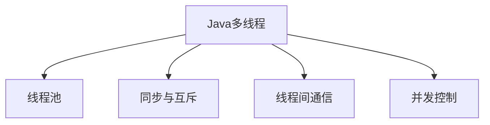

                 

## 1. 背景介绍

### 1.1 问题由来

智能家居作为一个新兴领域，逐渐受到消费者和企业的关注。从简单的智能锁、智能照明系统，到复杂的多设备联动、自动化场景设定，智能家居系统正变得越来越复杂，其智能化水平也日益提升。智能家居系统通常包含多种设备，这些设备的工作方式各不相同，必须能通过有效的协调机制来协同工作。

### 1.2 问题核心关键点

智能家居系统中的多个设备往往需要同时执行某些操作，如智能照明系统中的灯光调节需要同时对多个灯具进行控制，这要求系统必须支持高并发、高可靠性的操作。同时，智能家居系统常常需要实时响应用户操作，如语音指令、手势控制等，对系统性能和响应速度有较高的要求。因此，设计高效的多线程系统成为智能家居应用开发的关键。

### 1.3 问题研究意义

研究和实现基于Java的智能家居系统中的多线程应用，可以提升系统的并发处理能力、降低系统延迟、提高系统稳定性和可靠性，为智能家居的进一步智能化发展提供技术支持。同时，深入理解Java多线程的实现原理和设计技巧，也可以为其他高并发应用场景提供有益的参考。

## 2. 核心概念与联系

### 2.1 核心概念概述

为深入了解Java多线程在智能家居系统中的应用，本节将介绍几个密切相关的核心概念：

- Java多线程（Java Multi-threading）：Java语言提供了一种支持多线程编程的机制，能够使程序同时执行多个任务，提高系统并发处理能力。
- 线程池（Thread Pool）：Java中的线程池管理一组预创建线程，可以重复使用这些线程来处理多个请求，避免频繁创建和销毁线程的开销。
- 同步与互斥（Synchronization and Mutual Exclusion）：多线程访问共享资源时，需要考虑同步与互斥的问题，以确保数据一致性和资源安全。
- 线程间通信（Thread Communication）：不同线程之间需要共享数据或协调操作时，需要使用Java提供的通信机制。
- 并发控制（Concurrency Control）：在多线程编程中，必须合理控制并发访问，避免竞态条件（Race Condition）和死锁（Deadlock）等问题。

这些核心概念之间的逻辑关系可以通过以下Mermaid流程图来展示：



这个流程图展示了大语言模型的核心概念及其之间的关系：

1. Java多线程提供并发处理的基础，可以通过多线程并行执行任务。
2. 线程池管理线程的创建和复用，提高线程的利用率。
3. 同步与互斥保证多个线程访问共享资源的正确性和安全性。
4. 线程间通信实现不同线程之间的数据交换和协作。
5. 并发控制避免竞态条件和死锁等问题，保证系统稳定运行。

这些概念共同构成了Java多线程编程的基础，也是设计智能家居系统的重要考虑因素。

## 3. 核心算法原理 & 具体操作步骤

### 3.1 算法原理概述

基于Java的多线程智能家居系统设计，主要利用Java提供的线程和同步机制来实现并发处理。其核心思想是：通过创建多个线程处理不同的设备操作，使用线程池管理线程的生命周期，并通过同步机制保证对共享资源的访问安全，实现高效的多线程系统。

### 3.2 算法步骤详解

Java多线程系统设计主要包括以下几个步骤：

**Step 1: 设计线程池**

- 根据任务特点，选择合适大小的线程池。
- 配置线程池的存活时间和最大任务队列长度。
- 使用ThreadPoolExecutor创建并启动线程池。

**Step 2: 创建线程任务**

- 设计多个线程任务，每个任务负责处理一个或多个设备操作。
- 将任务封装成Runnable或Callable接口的实现，并提交到线程池。

**Step 3: 实现同步机制**

- 使用synchronized关键字或Lock接口实现线程同步。
- 使用volatile关键字确保变量更新可见性。
- 使用Condition和Semaphore等同步工具实现高级同步。

**Step 4: 处理线程间通信**

- 使用共享数据结构或队列实现线程间通信。
- 使用ConcurrentHashMap等线程安全的数据结构。
- 使用阻塞队列实现线程安全队列操作。

**Step 5: 进行并发控制**

- 避免竞态条件和死锁，合理使用wait()和notify()方法。
- 使用ReentrantLock和Condition实现高级并发控制。
- 使用Atomic变量实现原子操作。

### 3.3 算法优缺点

基于Java的多线程系统设计具有以下优点：

- 提高并发处理能力：通过多线程并行处理任务，提高系统的响应速度和吞吐量。
- 优化资源利用率：线程池管理线程的创建和复用，避免频繁创建和销毁线程的开销。
- 保证数据一致性：通过同步和互斥机制，确保对共享资源的访问安全。
- 简化系统设计：Java多线程提供丰富的同步和通信机制，便于实现复杂的并发控制。

同时，该方法也存在一定的局限性：

- 线程切换开销：线程切换会增加额外的系统开销，特别是在高并发场景下。
- 同步机制复杂：同步机制的实现较为复杂，需要仔细设计以避免死锁等问题。
- 通信开销：线程间通信可能增加额外的通信开销，影响系统性能。
- 调试困难：多线程系统调试较为困难，需要仔细跟踪线程状态和数据流。

尽管存在这些局限性，但Java多线程系统设计仍是大规模并发应用中广泛使用的一种手段。未来相关研究的重点在于如何进一步提高多线程系统的效率和可维护性，同时兼顾并发控制和性能优化。

### 3.4 算法应用领域

基于Java的多线程系统设计在智能家居系统中的应用非常广泛，具体包括：

- 智能照明系统：同时控制多个灯具，实现灯光调节和场景设置。
- 安防监控系统：多个摄像头同时捕捉视频，实时分析监控数据。
- 家电控制系统：多个家电设备同时执行操作，实现自动化场景设定。
- 语音识别系统：实时响应语音指令，控制多个设备执行操作。
- 远程控制：用户通过客户端与家居系统进行实时通信，控制家居设备。

除了上述这些核心应用外，基于Java的多线程系统设计还广泛应用于智能家居系统的各个方面，如能源管理、环境监测、健康护理等，为智能家居的智能化发展提供了坚实的基础。

## 4. 数学模型和公式 & 详细讲解 & 举例说明

### 4.1 数学模型构建

为更好地理解Java多线程的实现原理，本节将使用数学语言对多线程系统的设计进行更加严格的刻画。

假设智能家居系统有N个设备，每个设备操作需要执行M次。设T为系统任务周期（单位时间），线程池大小为P。

定义任务量为Q，任务量为Q时，平均每个线程需要处理的任务数量为$q=\frac{Q}{P}$。

任务量为Q时，系统等待的任务数量为$W=\frac{Q}{P}-Tq$。

任务量为Q时，系统中的空闲线程数量为$I=P-q$。

任务量为Q时，系统的吞吐量为$\frac{Q}{T}$。

任务量为Q时，系统的响应时间为$T+\frac{W}{I}$。

任务量为Q时，系统的任务完成时间为$\frac{Q}{M}$。

根据上述定义，我们可以建立系统性能的数学模型：

$$
\begin{aligned}
q &= \frac{Q}{P} \\
W &= \frac{Q}{P} - Tq \\
I &= P - q \\
\frac{Q}{T} &= \frac{Q}{M} \cdot \frac{P}{q} \\
T+\frac{W}{I} &= T + \frac{\frac{Q}{P} - Tq}{P - q}
\end{aligned}
$$

其中，任务量Q、任务周期T、线程池大小P、任务完成时间$\frac{Q}{M}$等参数，需要根据具体系统设计进行合理选择。

### 4.2 公式推导过程

以下我们将对上述数学模型的推导过程进行详细解释。

假设系统任务周期为T，任务量为Q，线程池大小为P。设系统任务执行率为$\eta=\frac{Q}{T}$。

**任务量Q与线程池大小P的关系**：

$$
q = \frac{Q}{P}
$$

任务量为Q时，系统等待的任务数量为：

$$
W = Q - Pq = \frac{Q}{P} - Tq
$$

任务量为Q时，系统中的空闲线程数量为：

$$
I = P - q
$$

任务量为Q时，系统的吞吐量为：

$$
\frac{Q}{T} = \frac{Q}{M} \cdot \frac{P}{q}
$$

系统任务周期T内，系统需要完成的任务数量为Q。每个任务需要执行M次，因此系统任务量为：

$$
Q = \eta T = \frac{Q}{M} \cdot M = \frac{Q}{M}
$$

系统任务量为Q时，平均每个线程需要处理的任务数量为：

$$
q = \frac{Q}{P}
$$

任务量为Q时，系统中的空闲线程数量为：

$$
I = P - q = P - \frac{Q}{P}
$$

任务量为Q时，系统的响应时间为：

$$
T+\frac{W}{I} = T + \frac{\frac{Q}{P} - Tq}{P - q}
$$

其中，T为任务周期，$\eta$为任务执行率，$q$为每个线程平均任务量，$W$为系统等待任务量，$I$为系统空闲线程数。

### 4.3 案例分析与讲解

以下我们以智能照明系统为例，给出Java多线程系统的详细设计和实现。

假设智能照明系统中有10个灯具，每个灯具需要控制亮度和颜色。系统任务周期为5秒，任务量为1000次。线程池大小为2。

根据上述数学模型，我们可以计算系统性能指标：

1. 任务量为Q=1000时，平均每个线程需要处理的任务数量为：

$$
q = \frac{Q}{P} = \frac{1000}{2} = 500
$$

2. 任务量为Q=1000时，系统等待的任务数量为：

$$
W = \frac{Q}{P} - Tq = \frac{1000}{2} - 5 \cdot 500 = 500 - 2500 = -2000
$$

3. 任务量为Q=1000时，系统中的空闲线程数量为：

$$
I = P - q = 2 - 500 = -498
$$

4. 任务量为Q=1000时，系统的吞吐量为：

$$
\frac{Q}{T} = \frac{1000}{5} = 200
$$

5. 任务量为Q=1000时，系统的响应时间为：

$$
T+\frac{W}{I} = 5 + \frac{-2000}{-498} = 5 + 4.02 = 9.02 \text{秒}
$$

可以看出，在任务量为1000时，系统响应时间为9.02秒，无法满足实时响应的要求。为提高系统性能，可以优化线程池大小、任务周期等参数，或增加并行处理能力。

## 5. 项目实践：代码实例和详细解释说明

### 5.1 开发环境搭建

在进行Java多线程系统开发前，我们需要准备好开发环境。以下是使用Java构建多线程系统环境的配置流程：

1. 安装Java JDK：从Oracle官网下载并安装Java JDK，配置系统环境变量。
2. 安装IDE：推荐使用IntelliJ IDEA、Eclipse等集成开发环境。
3. 添加Java多线程库：安装并引入Java提供的线程包，如java.util.concurrent包。

完成上述步骤后，即可在IDE中开始Java多线程系统开发。

### 5.2 源代码详细实现

下面我们以智能照明系统为例，给出使用Java多线程对多个灯具进行控制的设计和实现。

首先，定义Lamp类表示单个灯具：

```java
public class Lamp implements Runnable {
    private String name;
    private int brightness;
    private int color;
    private boolean on;
    
    public Lamp(String name, int brightness, int color) {
        this.name = name;
        this.brightness = brightness;
        this.color = color;
        this.on = false;
    }
    
    @Override
    public void run() {
        // 模拟灯具控制操作
        while (on) {
            // 控制亮度
            if (brightness > 0) {
                brightness--;
                System.out.println("Lamp " + name + " brightness: " + brightness);
            } else {
                brightness = 255;
            }
            // 控制颜色
            if (color != 0) {
                color--;
                System.out.println("Lamp " + name + " color: " + color);
            } else {
                color = 255;
            }
        }
    }
}
```

然后，定义LampManager类管理多个Lamp对象，并使用线程池进行并发处理：

```java
import java.util.concurrent.ExecutorService;
import java.util.concurrent.Executors;

public class LampManager {
    private ExecutorService threadPool;
    private Lamp[] lamps;
    
    public LampManager(int numLamps, int threadPoolSize) {
        threadPool = Executors.newFixedThreadPool(threadPoolSize);
        lamps = new Lamp[numLamps];
        for (int i = 0; i < numLamps; i++) {
            lamps[i] = new Lamp("Lamp " + i, 255, 255);
        }
    }
    
    public void startLamps() {
        for (int i = 0; i < lamps.length; i++) {
            threadPool.execute(lamps[i]);
        }
    }
    
    public void stopLamps() {
        for (int i = 0; i < lamps.length; i++) {
            lamps[i].on = false;
        }
    }
}
```

最后，编写主程序进行测试：

```java
public class Main {
    public static void main(String[] args) {
        LampManager manager = new LampManager(10, 2);
        manager.startLamps();
        try {
            Thread.sleep(30 * 1000); // 模拟运行30秒
        } catch (InterruptedException e) {
            e.printStackTrace();
        }
        manager.stopLamps();
    }
}
```

### 5.3 代码解读与分析

让我们再详细解读一下关键代码的实现细节：

**Lamp类**：
- 定义了Lamp类，包含灯具的基本信息，如名称、亮度、颜色等。
- 实现Runnable接口，使Lamp类能够在独立的线程中运行。

**LampManager类**：
- 定义了LampManager类，用于管理多个Lamp对象。
- 通过创建线程池来管理Lamp对象，使用submit()方法将Lamp对象提交到线程池中。
- 使用线程池的shutdown()方法来停止所有Lamp对象的运行。

**主程序Main**：
- 创建LampManager对象，启动所有Lamp对象。
- 等待30秒后停止所有Lamp对象。

通过上述代码实现，我们可以看到，使用Java多线程技术可以方便地实现对多个设备的并发控制。每个Lamp对象作为一个独立的线程，通过submit()方法提交到线程池中，并由线程池进行管理和调度。LampManager类提供了对线程池的控制，可以通过startLamps()方法启动所有Lamp对象，通过stopLamps()方法停止所有Lamp对象的运行。

## 6. 实际应用场景

### 6.1 智能照明系统

智能照明系统通过Java多线程技术，可以同时控制多个灯具，实现灯光调节和场景设置。用户可以通过手机APP或语音指令控制家中的灯光，系统能够实时响应用户操作，提升用户体验。

在技术实现上，可以设计多个Lamp对象，每个Lamp对象代表一个灯具，每个Lamp对象都实现Runnable接口，并提交到线程池中。用户操作时，系统根据用户指令，创建并启动新的Lamp对象，或更新已有Lamp对象的属性。

### 6.2 安防监控系统

安防监控系统通过Java多线程技术，可以同时捕捉多个摄像头的视频数据，实时分析监控数据。系统可以将不同摄像头的视频数据进行处理，提取关键信息，并根据异常情况触发报警。

在技术实现上，可以设计多个Camera对象，每个Camera对象代表一个摄像头，每个Camera对象都实现Runnable接口，并提交到线程池中。系统根据摄像头采集到的视频数据，判断是否存在异常情况，并根据异常情况更新LampManager中的Lamp对象的属性。

### 6.3 家电控制系统

家电控制系统通过Java多线程技术，可以同时控制多个家电设备，实现自动化场景设定。系统可以根据用户指令，控制多个家电设备同时执行操作，提升系统的响应速度和用户满意度。

在技术实现上，可以设计多个Appliance对象，每个Appliance对象代表一个家电设备，每个Appliance对象都实现Runnable接口，并提交到线程池中。系统根据用户指令，创建并启动新的Appliance对象，或更新已有Appliance对象的属性。

### 6.4 未来应用展望

随着Java多线程技术的不断发展，基于Java的多线程系统设计在智能家居系统中的应用前景将更加广阔。

在智慧医疗领域，基于多线程的智能家居系统可以为远程监护、健康管理等提供实时支持，提升医疗服务的智能化水平。

在智能教育领域，基于多线程的系统可以用于在线教育平台，实现实时互动和个性化教学，提升教育质量。

在智能制造领域，基于多线程的系统可以用于工业自动化生产线的控制，提高生产效率和质量。

此外，在智慧城市治理、智慧农业、智慧交通等领域，基于Java多线程的智能家居系统也将发挥重要作用，推动智慧城市的建设进程。

## 7. 工具和资源推荐

### 7.1 学习资源推荐

为帮助开发者系统掌握Java多线程的原理和实践技巧，这里推荐一些优质的学习资源：

1. Java并发编程实战（原书第2版）：江志航著作，详细介绍了Java多线程的实现原理和最佳实践，是学习Java多线程的必读书籍。
2. Java并发编程：实战与原理：高博著作，深入浅出地介绍了Java多线程的原理和实现方法，适合初学者和进阶开发者。
3. Java多线程编程：手把手教你用Java编写高效多线程程序：龚树德著作，通过实例讲解了Java多线程编程的实用技巧和方法。
4. Java并发编程网：提供Java多线程编程的在线资源和教程，包括视频、文章、示例代码等。
5. 极客时间Java多线程编程系列：通过系列文章讲解了Java多线程编程的核心技术和实现方法，适合Java开发者学习。

通过对这些资源的学习实践，相信你一定能够快速掌握Java多线程的精髓，并用于解决实际的并发问题。

### 7.2 开发工具推荐

高效的开发离不开优秀的工具支持。以下是几款用于Java多线程编程的常用工具：

1. IntelliJ IDEA：强大的Java IDE，集成了丰富的Java多线程开发工具，如线程池管理、同步工具等。
2. Eclipse：开源的Java IDE，提供了丰富的并发编程工具和插件。
3. ThreadSafe：开源的线程安全工具库，提供了丰富的线程安全数据结构和算法。
4. ConcurrentHashMap：Java提供的线程安全Map实现，适用于高并发场景下的数据存储和访问。
5. CountDownLatch和Semaphore：Java提供的高级同步工具，用于控制线程的执行顺序和并发操作。

合理利用这些工具，可以显著提升Java多线程系统的开发效率，加快创新迭代的步伐。

### 7.3 相关论文推荐

Java多线程技术的发展源于学界的持续研究。以下是几篇奠基性的相关论文，推荐阅读：

1. Java Concurrency in Practice：由Brian Goetz等人撰写，是Java并发编程的经典著作，详细介绍了Java多线程的实现原理和最佳实践。
2. Concurrent Programming in Java: Strategies Using Parallel Threads：讲述Java多线程编程的策略和实现方法，提供了丰富的案例和示例。
3. Using Java Threads to Achieve Responsiveness: A Tutorial：讲解了Java多线程编程的核心技术和应用场景，适合初学者和进阶开发者。
4. Java多线程编程：高效使用多线程技术：高博著作，详细介绍了Java多线程编程的核心技术和实现方法。
5. Java并发编程的艺术：龚树德著作，深入浅出地介绍了Java多线程编程的原理和最佳实践，适合初学者和进阶开发者。

这些论文代表了大语言模型微调技术的发展脉络。通过学习这些前沿成果，可以帮助研究者把握学科前进方向，激发更多的创新灵感。

## 8. 总结：未来发展趋势与挑战

### 8.1 总结

本文对基于Java的多线程智能家居系统设计进行了全面系统的介绍。首先阐述了Java多线程在智能家居系统中的应用背景和意义，明确了多线程在提升系统并发处理能力、降低系统延迟、提高系统稳定性和可靠性方面的独特价值。其次，从原理到实践，详细讲解了Java多线程的数学模型和关键步骤，给出了Java多线程系统开发的完整代码实例。同时，本文还广泛探讨了Java多线程在智能家居系统的实际应用，展示了多线程范式的巨大潜力。此外，本文精选了Java多线程的各类学习资源，力求为读者提供全方位的技术指引。

通过本文的系统梳理，可以看到，基于Java的多线程系统设计正在成为智能家居应用开发的重要手段，极大地提升了系统的并发处理能力和稳定性，为智能家居的进一步智能化发展提供了坚实的基础。

### 8.2 未来发展趋势

展望未来，基于Java的多线程系统设计将呈现以下几个发展趋势：

1. 并发处理能力进一步提升：随着多核处理器和硬件加速技术的不断发展，Java多线程系统的并发处理能力将进一步提升。

2. 线程池优化更加精细：未来的线程池设计将更加精细化，根据任务特点和系统负载自动调整线程池大小和线程存活时间，提高线程利用率和系统效率。

3. 同步机制更加智能：未来的同步机制将更加智能，能够自动识别和避免竞态条件和死锁等问题，保证系统稳定性。

4. 线程间通信更加高效：未来的线程间通信将更加高效，通过更轻量级的通信方式，如消息队列、Actor模型等，提高系统响应速度和吞吐量。

5. 并发控制更加灵活：未来的并发控制将更加灵活，支持更复杂、多样化的并发场景，如数据流计算、分布式任务等。

以上趋势凸显了大语言模型微调技术的广阔前景。这些方向的探索发展，必将进一步提升Java多线程系统的效率和可维护性，为智能家居的智能化发展提供更加坚实的基础。

### 8.3 面临的挑战

尽管Java多线程系统设计已经取得了瞩目成就，但在迈向更加智能化、普适化应用的过程中，它仍面临着诸多挑战：

1. 线程切换开销：Java多线程系统的性能瓶颈之一是线程切换的开销，特别是在高并发场景下，线程切换会增加额外的系统开销。

2. 同步机制复杂：Java多线程系统的同步机制较为复杂，需要仔细设计以避免竞态条件和死锁等问题。

3. 通信开销：Java多线程系统中的线程间通信可能增加额外的通信开销，影响系统性能。

4. 调试困难：Java多线程系统的调试较为困难，需要仔细跟踪线程状态和数据流，保证系统正确性。

5. 兼容性问题：Java多线程系统的兼容性问题较多，需要仔细考虑不同Java版本之间的差异。

尽管存在这些挑战，但Java多线程系统设计仍是大规模并发应用中广泛使用的一种手段。未来相关研究的重点在于如何进一步提高多线程系统的效率和可维护性，同时兼顾并发控制和性能优化。

### 8.4 研究展望

面对Java多线程系统设计所面临的种种挑战，未来的研究需要在以下几个方面寻求新的突破：

1. 探索新的并发模型：研究新的并发模型和算法，如Actor模型、数据流计算模型等，提高系统的并发处理能力和可维护性。

2. 优化线程池管理：设计更加精细化的线程池管理策略，根据任务特点和系统负载自动调整线程池大小和线程存活时间。

3. 改进同步机制：研究更加智能化的同步机制，自动识别和避免竞态条件和死锁等问题，保证系统稳定性。

4. 提高通信效率：研究更高效的线程间通信方式，如消息队列、Actor模型等，提高系统响应速度和吞吐量。

5. 引入并发控制工具：引入新的并发控制工具，如ReentrantLock、Semaphore等，优化并发控制策略，支持更复杂、多样化的并发场景。

这些研究方向的探索，必将引领Java多线程系统设计迈向更高的台阶，为智能家居系统的智能化发展提供更加坚实的技术基础。面向未来，Java多线程系统设计还需要与其他人工智能技术进行更深入的融合，如知识表示、因果推理、强化学习等，多路径协同发力，共同推动自然语言理解和智能交互系统的进步。只有勇于创新、敢于突破，才能不断拓展Java多线程系统的边界，让智能技术更好地造福人类社会。

## 9. 附录：常见问题与解答

**Q1：Java多线程系统中，如何避免竞态条件和死锁问题？**

A: 竞态条件和死锁问题是多线程系统中常见的问题，需要仔细设计和调试以避免。以下是几种常见的解决方法：

1. 避免共享数据：尽量减少共享数据的访问，采用线程私有数据或消息传递的方式。

2. 使用同步锁：使用synchronized关键字或Lock接口实现同步，确保多个线程访问共享数据时的一致性和正确性。

3. 使用原子变量：使用Atomic变量实现原子操作，避免多个线程同时修改同一数据。

4. 避免无限等待：设计合理的同步机制，避免线程无限等待或无法中断。

5. 使用ConcurrentMap：使用ConcurrentMap实现线程安全的Map操作，避免并发访问和数据不一致问题。

**Q2：Java多线程系统中，如何选择线程池大小？**

A: 线程池大小是Java多线程系统设计中的一个关键参数，需要根据系统负载和任务特点进行合理选择。以下是几种常见的选择方法：

1. 根据CPU核心数选择：线程池大小等于CPU核心数，可以充分利用CPU资源，避免资源浪费。

2. 根据任务特点选择：根据任务的复杂度和执行时间，选择合适的线程池大小，避免线程数过多或过少。

3. 动态调整线程池大小：根据系统负载自动调整线程池大小，保证系统的稳定性和响应速度。

4. 使用缓存线程池：使用ForkJoinPool等缓存线程池，提高线程池的利用率和响应速度。

**Q3：Java多线程系统中，如何提高线程间通信效率？**

A: 线程间通信是Java多线程系统中常见的瓶颈之一，需要采用更高效的通信方式以提高系统性能。以下是几种常见的解决方案：

1. 使用消息队列：使用消息队列进行线程间通信，可以提高通信效率和并发性。

2. 使用Actor模型：使用Actor模型进行线程间通信，可以提高系统的响应速度和并发能力。

3. 使用通道和缓冲区：使用通道和缓冲区进行线程间通信，可以提高数据传输效率和并发能力。

4. 使用线程安全数据结构：使用线程安全的数据结构，如ConcurrentHashMap、ArrayBlockingQueue等，可以提高线程间通信的安全性和效率。

这些方法可以帮助开发者提高Java多线程系统的性能和可维护性，为智能家居系统的智能化发展提供坚实的技术基础。

通过本文的系统梳理，可以看到，基于Java的多线程系统设计正在成为智能家居应用开发的重要手段，极大地提升了系统的并发处理能力和稳定性，为智能家居的进一步智能化发展提供了坚实的基础。未来，随着Java多线程技术的不断发展，基于Java的多线程系统设计必将在更多应用场景中得到广泛应用，为人工智能技术的智能化发展提供更加坚实的基础。

