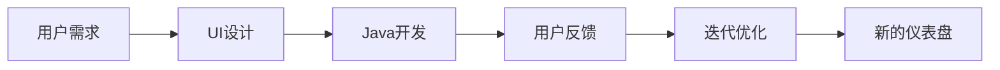

                 

# 基于Java的智能家居设计：自定义智能家居仪表盘的UI设计技巧

> 关键词：智能家居,Java,UI设计,仪表盘,自定义,智能家居系统

## 1. 背景介绍

随着物联网技术的发展，智能家居已经逐渐成为人们日常生活中不可或缺的一部分。而UI设计在智能家居系统中扮演着至关重要的角色，它不仅是用户与系统交互的主要界面，也是展示家居系统运行状态和提供便捷操作的核心工具。因此，如何高效、直观地设计出符合用户需求的智能家居仪表盘，是一个值得深入探讨的问题。

在本文中，我们将基于Java开发平台，介绍一些高效、实用的智能家居仪表盘UI设计技巧。这些技巧将帮助开发者设计出易于使用、美观直观的仪表盘，提升用户体验，使智能家居系统更具吸引力。

## 2. 核心概念与联系

### 2.1 核心概念概述

在智能家居系统中，UI设计主要包括两个核心概念：

1. **仪表盘(Dashboard)**：用户通过仪表盘可以查看和操作家居系统的各种功能，包括能源监控、设备状态、安全警报等。
2. **Java开发**：Java是一种广泛使用的编程语言，以其稳定性和跨平台性著称。Java的应用范围不仅限于企业级开发，还可以用于桌面应用、Web应用、Android应用等多种场景。

仪表盘的设计涉及到用户体验、交互设计、数据展示等多个方面，而Java则提供了强大的工具和框架，使得UI设计成为可能。通过将Java与仪表盘设计相结合，可以创造出既美观又实用的智能家居系统。

### 2.2 核心概念原理和架构的 Mermaid 流程图



在这个流程图中，用户需求是设计的起点，Java开发是实现的手段，用户反馈是优化的依据，最终形成新的仪表盘，构成了一个持续优化的闭环。

## 3. 核心算法原理 & 具体操作步骤

### 3.1 算法原理概述

智能家居仪表盘的设计主要依赖于数据展示和交互设计。以下是一些常用的设计原理：

1. **数据可视化**：通过图表、仪表盘等方式展示数据，使得信息一目了然。
2. **交互性**：设计可点击、可拖动等交互元素，提升用户体验。
3. **一致性**：保持仪表盘设计风格和颜色使用的一致性，增强系统整体感。
4. **可扩展性**：设计应支持多种设备和平台，满足用户在不同场景下的需求。

### 3.2 算法步骤详解

设计一个高效的智能家居仪表盘，一般遵循以下步骤：

1. **需求分析**：与用户沟通，了解其对家居系统的需求和使用习惯，确定仪表盘的功能和界面设计。
2. **设计原型**：根据需求分析结果，设计仪表盘的原型，包括布局、颜色、交互元素等。
3. **Java实现**：使用Java编写代码，实现仪表盘的各个功能模块。
4. **测试优化**：对实现后的仪表盘进行测试，收集用户反馈，优化用户体验。
5. **部署上线**：将优化后的仪表盘部署到智能家居系统中，提供给用户使用。

### 3.3 算法优缺点

**优点**：

1. **灵活性**：Java作为一种面向对象的编程语言，支持多种开发模式和框架，可以灵活应对不同的设计需求。
2. **跨平台性**：Java可以运行于多种操作系统和设备上，使得智能家居系统具有更好的兼容性。
3. **社区支持**：Java拥有庞大的开发者社区和丰富的第三方库，可以快速开发和实现复杂的仪表盘功能。

**缺点**：

1. **学习成本高**：Java的语法和概念较为复杂，初学者可能需要较长时间的学习和实践。
2. **性能问题**：Java应用程序在启动和运行时会有一定的性能开销，特别是在处理大量数据时。
3. **内存管理**：Java的垃圾回收机制虽然可以自动管理内存，但在一些特殊情况下，如长时间运行或处理大量数据时，仍需注意内存泄漏和性能优化。

### 3.4 算法应用领域

基于Java的智能家居仪表盘设计技术，广泛应用于家庭自动化、能源监控、智能安防等领域。例如，在家庭自动化系统中，可以通过仪表盘实时监控家中设备的运行状态和能耗情况，帮助用户进行能源管理和设备维护。在智能安防系统中，仪表盘可以显示报警信息、摄像头监控画面等，提升家庭安全水平。

## 4. 数学模型和公式 & 详细讲解 & 举例说明

在智能家居仪表盘的设计中，虽然不涉及复杂的数学模型，但一些基础的数学概念仍需理解，如坐标系、比例尺等。

### 4.1 数学模型构建

在Java开发中，坐标系和比例尺是设计仪表盘的基础。以下是一个简单的坐标系示例：

```java
import java.awt.Point;
import java.awt.GeneralPath;

public class CoordinateSystem {
    public static void main(String[] args) {
        Point origin = new Point(0, 0);
        Point point1 = new Point(100, 0);
        Point point2 = new Point(100, 100);
        Point point3 = new Point(0, 100);
        
        GeneralPath path = new GeneralPath();
        path.moveTo(point1.x, point1.y);
        path.lineTo(point2.x, point2.y);
        path.lineTo(point3.x, point3.y);
        path.closePath();
        
        // 绘制坐标系
        Graphics g = new Graphics();
        g.drawLine(point1.x, point1.y, point3.x, point3.y);
        g.drawLine(point2.x, point2.y, point3.x, point3.y);
        g.drawLine(point1.x, point1.y, point2.x, point2.y);
    }
}
```

### 4.2 公式推导过程

在实际设计中，坐标系和比例尺的推导过程较为简单。例如，在绘制一个矩形时，可以使用以下公式：

$$
\text{矩形宽度} = \text{矩形左侧} - \text{矩形右侧} \\
\text{矩形高度} = \text{矩形底部} - \text{矩形顶部}
$$

### 4.3 案例分析与讲解

在实际设计中，我们需要根据具体需求调整坐标系和比例尺，以满足用户的需求。例如，在设计一个能源监控仪表盘时，可以按照以下步骤进行：

1. **需求分析**：用户需要实时监控家中各个电器的能耗情况，并生成日、周、月的能耗报告。
2. **设计原型**：设计一个包含多个仪表盘的页面，每个仪表盘显示一个电器的能耗数据。
3. **Java实现**：使用Java Swing或JavaFX库绘制仪表盘，使用JDBC连接数据库，获取电器能耗数据，并动态更新仪表盘。
4. **测试优化**：在测试过程中，用户反馈仪表盘的数据更新速度较慢，因此优化了数据库查询和数据渲染的效率。
5. **部署上线**：将优化后的仪表盘部署到智能家居系统中，供用户使用。

## 5. 项目实践：代码实例和详细解释说明

### 5.1 开发环境搭建

在Java开发智能家居仪表盘时，需要安装Java开发工具包(JDK)和Java IDE（如Eclipse、IntelliJ IDEA等）。此外，还需要安装数据库（如MySQL、Oracle等）和图形界面库（如Swing、JavaFX等）。

### 5.2 源代码详细实现

以下是一个简单的Java Swing仪表盘示例，用于监控家中电器的能耗情况：

```java
import javax.swing.*;
import java.awt.*;
import java.sql.*;

public class EnergyDashboard extends JFrame {
    private JTable table;
    
    public EnergyDashboard() {
        setTitle("能源监控仪表盘");
        setDefaultCloseOperation(JFrame.EXIT_ON_CLOSE);
        setSize(800, 600);
        
        // 连接数据库
        Connection conn = DriverManager.getConnection("jdbc:mysql://localhost:3306/energy", "root", "password");
        Statement stmt = conn.createStatement();
        ResultSet rs = stmt.executeQuery("SELECT device_name, energy_consumption FROM energy_monitor");
        
        // 创建表格数据
        String[] columnNames = {"设备名称", "能耗"};
        Object[][] data = new Object[rs.getNumRows()][2];
        for (int i = 0; i < rs.getNumRows(); i++) {
            data[i][0] = rs.getString("device_name");
            data[i][1] = rs.getDouble("energy_consumption");
        }
        
        // 创建表格
        table = new JTable(data, columnNames);
        table.setFillsViewport(true);
        table.setSelectionMode(ListSelectionModel.SINGLE_SELECTION);
        
        // 创建表格布局
        JScrollPane scrollPane = new JScrollPane(table);
        getContentPane().add(scrollPane);
        setVisible(true);
    }
    
    public static void main(String[] args) {
        new EnergyDashboard();
    }
}
```

### 5.3 代码解读与分析

在上述代码中，我们使用了Java Swing库来创建仪表盘界面。具体步骤如下：

1. **连接数据库**：使用JDBC连接MySQL数据库，获取电器能耗数据。
2. **创建表格数据**：从数据库中获取能耗数据，并创建二维数组表示表格数据。
3. **创建表格**：使用JTable创建表格，设置表格的列名和数据。
4. **创建表格布局**：将表格放入JScrollPane中，并将其添加到JFrame界面中。
5. **启动JFrame**：通过main方法启动JFrame，显示仪表盘。

### 5.4 运行结果展示

运行上述代码，将得到一个简单的能源监控仪表盘界面，用户可以通过表格查看各个电器的能耗情况。

## 6. 实际应用场景

### 6.1 智能家居系统

智能家居系统的仪表盘设计主要关注设备状态监控、能耗管理、安防报警等功能。通过Java Swing或JavaFX库，开发者可以轻松地创建美观、直观的仪表盘界面，提升用户的体验和满意度。

### 6.2 家庭自动化系统

在家庭自动化系统中，仪表盘可以实时监控家中各个设备的运行状态，如灯光、窗帘、温控器等。通过Java Swing或JavaFX库，可以设计出具有高度交互性和可扩展性的仪表盘，使家庭自动化系统更加智能化和便捷化。

### 6.3 智能安防系统

在智能安防系统中，仪表盘可以显示摄像头监控画面、报警信息、入侵检测等。通过Java Swing或JavaFX库，可以设计出高度安全、稳定的安防仪表盘，提升家庭安全水平。

### 6.4 未来应用展望

未来，基于Java的智能家居仪表盘设计将具备更高的可扩展性、交互性和可视化能力。随着物联网技术的进一步发展，家居系统将更加智能化、集成化和自动化，Java作为跨平台开发的利器，将继续发挥重要作用。

## 7. 工具和资源推荐

### 7.1 学习资源推荐

1. **《Java编程思想》**：一本经典入门书籍，适合Java初学者学习Java基础和面向对象编程。
2. **《Swing教程》**：一本详细介绍Swing库的教程，涵盖Swing的基础知识和高级应用。
3. **《JavaFX教程》**：一本详细介绍JavaFX库的教程，涵盖JavaFX的基础知识和高级应用。
4. **《Java GUI编程实战》**：一本实战型书籍，通过项目实战介绍Java GUI编程技巧。
5. **《Java Swing GUI编程》**：一本详细介绍Swing GUI编程的书籍，涵盖Swing的各个组件和布局。

### 7.2 开发工具推荐

1. **Eclipse**：一款功能强大的Java IDE，支持Swing和JavaFX编程。
2. **IntelliJ IDEA**：一款现代的Java IDE，支持Swing和JavaFX编程，具有强大的代码自动完成和错误提示功能。
3. **NetBeans**：一款Java IDE，支持Swing编程，具有易用的界面和丰富的插件。

### 7.3 相关论文推荐

1. **《Java Swing GUI设计指南》**：介绍如何使用Swing库设计现代化的Java GUI应用。
2. **《JavaFX GUI设计指南》**：介绍如何使用JavaFX库设计现代化的Java GUI应用。
3. **《Java Swing和JavaFX比较》**：比较Swing和JavaFX库的优缺点，帮助开发者选择合适的开发工具。

## 8. 总结：未来发展趋势与挑战

### 8.1 研究成果总结

本文介绍了基于Java的智能家居仪表盘UI设计技巧，包括数据可视化、交互性、一致性和可扩展性等设计原理。通过Java Swing或JavaFX库，开发者可以轻松地创建美观、直观的仪表盘界面，提升用户体验。

### 8.2 未来发展趋势

1. **智能家居系统的普及**：随着物联网技术的发展，智能家居系统将成为人们日常生活中不可或缺的一部分，对于UI设计的需求也将越来越广泛。
2. **人工智能技术的应用**：未来的家居系统将更多地应用人工智能技术，如语音识别、人脸识别、智能推荐等，UI设计需要支持这些技术，提升系统的智能化水平。
3. **云计算和边缘计算的应用**：未来的家居系统将更多地依赖于云计算和边缘计算技术，UI设计需要支持分布式系统和多设备协同操作。

### 8.3 面临的挑战

1. **用户体验优化**：随着智能家居系统的复杂性增加，用户体验的优化将成为关键问题。UI设计需要关注用户的实际需求和反馈，不断优化设计。
2. **系统稳定性**：家居系统需要保证24小时稳定运行，UI设计需要考虑系统的稳定性和可扩展性。
3. **安全性**：家居系统需要保障用户数据的安全性和隐私性，UI设计需要考虑数据加密和访问控制。

### 8.4 研究展望

未来的UI设计研究将关注以下几个方向：

1. **交互设计**：通过引入自然语言处理和语音识别技术，提升系统的交互体验。
2. **可视化设计**：使用虚拟现实和增强现实技术，提升系统的可视化和沉浸感。
3. **多设备协同**：通过跨设备协同操作，提升系统的可扩展性和灵活性。

通过不断探索和创新，UI设计将为智能家居系统提供更强大、便捷、安全的用户体验，推动家居系统的智能化和集成化发展。

## 9. 附录：常见问题与解答

**Q1: 如何设计一个易于使用的智能家居仪表盘？**

A: 设计易于使用的智能家居仪表盘，需要考虑以下几个方面：

1. **简洁明了**：界面设计应简洁明了，避免过于复杂和冗余的信息。
2. **直观易用**：操作界面应直观易用，尽量减少用户的操作和学习成本。
3. **实时更新**：实时更新数据，让用户能够及时了解家居系统的状态。
4. **个性化设置**：提供个性化设置选项，让用户可以根据自己的需求调整仪表盘显示。

**Q2: 如何使用Java Swing或JavaFX库设计仪表盘？**

A: 使用Java Swing或JavaFX库设计仪表盘，需要遵循以下几个步骤：

1. **创建窗口和布局**：使用JFrame创建窗口，并使用不同的布局管理器（如FlowLayout、BorderLayout等）进行布局。
2. **添加组件**：在窗口中添加各种组件，如按钮、文本框、标签、表格等。
3. **事件处理**：为组件添加事件监听器，处理用户操作。
4. **数据展示**：将数据展示在表格中或标签中，并进行实时更新。
5. **测试优化**：对设计好的仪表盘进行测试，收集用户反馈并进行优化。

**Q3: 如何保证智能家居系统的安全性？**

A: 为了保证智能家居系统的安全性，需要采取以下措施：

1. **数据加密**：对用户数据进行加密，防止数据泄露。
2. **访问控制**：设置访问权限，限制用户对系统的访问范围。
3. **安全认证**：采用安全的认证方式，如OAuth2、OTP等，保障用户身份安全。
4. **异常检测**：实时监控系统行为，检测异常情况并及时处理。

这些措施可以有效地提高智能家居系统的安全性，保护用户数据和隐私。

---

作者：禅与计算机程序设计艺术 / Zen and the Art of Computer Programming

