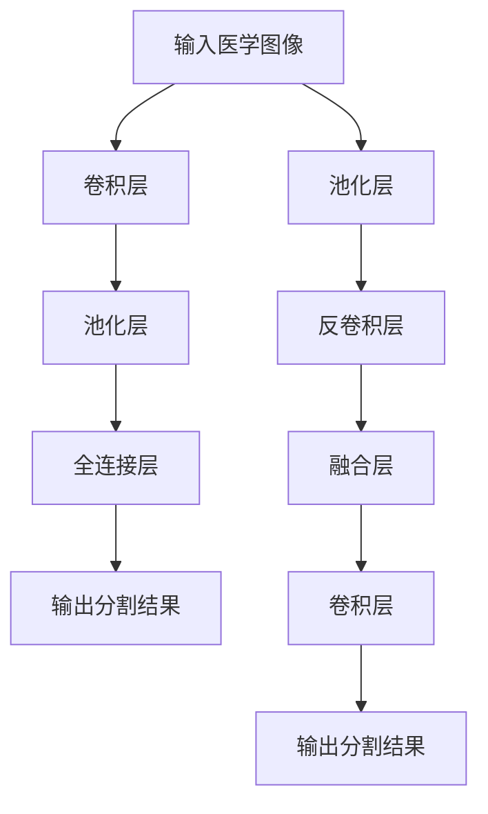

                 

## 1. 背景介绍

### 1.1 问题由来
在现代医疗行业中，医学图像分割（Medical Image Segmentation）是一项重要的技术，它通过将医学图像中的感兴趣区域（如肿瘤、器官等）进行精确分割，为医生提供重要的参考信息，辅助诊断和治疗决策。传统的医学图像分割方法多依赖于手工标注和领域专家的经验，费时费力且主观性强，易引入误差。随着深度学习技术的进步，基于卷积神经网络（Convolutional Neural Network, CNN）的医学图像分割方法因其高精度、自动化、鲁棒性强等优势，逐渐成为研究热点。

### 1.2 问题核心关键点
医学图像分割的核心在于构建一个能够自动学习并准确分割图像的区域的模型。常见的医学图像分割问题可以分为二值分割（例如脑部CT图像中肿瘤的分割）、语义分割（例如心脏图像中心肌的分割）和实例分割（例如肺部CT图像中肺结节和肺叶的分割）。

解决医学图像分割问题，需要构建一个能够自动学习像素间相互关系和上下文信息的卷积神经网络模型，且该模型需具备以下特点：
- **鲁棒性**：能够在不同患者、不同扫描参数下仍保持良好性能。
- **精度高**：能够精确分割复杂结构的医学图像，如血管、肿瘤等。
- **实时性**：能够在合理的时间内处理大规模图像数据，满足临床需求。
- **可解释性**：提供分割结果的可解释性，辅助医生理解模型决策过程。

## 2. 核心概念与联系

### 2.1 核心概念概述

卷积神经网络（CNN）是一类专门用于处理图像、视频等高维数据的深度学习模型。其核心思想是通过卷积操作提取图像特征，并通过池化操作降维，减少参数数量，降低计算复杂度。在医学图像分割中，CNN主要应用于以下几个方面：

- **特征提取**：通过卷积层提取图像的纹理、形状、边缘等特征。
- **区域识别**：通过池化层、全连接层和分类层对图像进行区域识别和分割。
- **语义理解**：通过不同层级的特征融合，理解图像的语义信息，如病灶、器官等。

医学图像分割的目标是实现像素级的精确分割，传统的像素级别分割方法难以满足复杂医学图像的分割需求。相比之下，基于CNN的医学图像分割方法具有如下优势：

- **端到端**：能够自动学习并生成分割结果，无需手动标注。
- **自适应性强**：可以适应不同医学图像的复杂度和结构变化。
- **并行计算**：CNN可以并行计算，大幅提高分割效率。

### 2.2 核心概念原理和架构的 Mermaid 流程图



这个流程图展示了一个基本的医学图像分割CNN模型：

1. **卷积层**：提取图像特征，捕捉局部信息。
2. **池化层**：降维压缩，减少参数数量。
3. **全连接层**：融合高层次特征，进行分类和回归。
4. **反卷积层**：将高维特征图转换为像素级别的分割结果。
5. **融合层**：融合多层的特征，增强分割结果的精度。

### 2.3 算法原理概述

基于CNN的医学图像分割算法主要分为两类：

1. **像素级分割（Pixel-wise Segmentation）**：直接对每个像素进行分类，将图像分割为不同的区域。
2. **边界级分割（Boundary-level Segmentation）**：先对图像进行粗略分割，然后对边界进行修正，获得精确的分割结果。

这两类方法的主要区别在于对分割结果的要求和对计算资源的消耗。像素级分割通常对精度要求更高，而边界级分割则更注重效率和鲁棒性。

## 3. 核心算法原理 & 具体操作步骤
### 3.1 算法原理概述

卷积神经网络通过反向传播算法（Backpropagation）进行训练。对于医学图像分割任务，我们需要构建一个能够从图像像素级别学习并生成精确分割结果的CNN模型。

设医学图像分割任务的输入为 $X$，标签为 $Y$，卷积神经网络的参数为 $\theta$。模型的输出 $H$ 经过softmax函数后得到类别概率 $P(Y|X)$，进而通过交叉熵损失函数 $L$ 进行训练。数学表达式如下：

$$
\theta = \arg\min_\theta L(\theta) = -\frac{1}{N}\sum_{i=1}^N \log P(Y_i|X_i) = -\frac{1}{N}\sum_{i=1}^N \sum_{j=1}^{C} Y_{ij} \log P(Y_{ij}|X_i)
$$

其中，$C$ 为类别数，$Y_{ij}$ 表示图像 $X_i$ 在类别 $j$ 上的标签，$P(Y_{ij}|X_i)$ 表示图像 $X_i$ 属于类别 $j$ 的概率。

### 3.2 算法步骤详解

基于CNN的医学图像分割算法主要包括以下步骤：

1. **数据预处理**：包括数据增强、归一化、去噪等预处理步骤。
2. **网络构建**：设计卷积神经网络结构，包括卷积层、池化层、全连接层等。
3. **损失函数设计**：选择适合的损失函数（如交叉熵损失、 Dice Loss）。
4. **模型训练**：使用优化器（如 Adam、SGD）最小化损失函数，更新模型参数。
5. **模型评估**：在测试集上评估模型性能，如使用Jaccard指数、Dice系数等指标。

以U-Net模型为例，下面详细介绍其实现步骤：

**Step 1: 数据预处理**

医学图像的数据通常具有噪声较多、尺寸不统一等特点。在预处理阶段，我们需要对这些数据进行标准化处理，包括：

- 图像去噪：使用中值滤波、均值滤波等方法减少图像噪声。
- 图像归一化：将图像的像素值归一化到 [0,1] 或 [-1,1] 范围内。
- 数据增强：通过对图像进行旋转、翻转、裁剪等操作，扩充数据集，减少过拟合。

**Step 2: 网络构建**

U-Net是一种常见的医学图像分割网络，其结构对称，由编码器和解码器两部分组成。编码器由多个卷积层和池化层构成，用于提取图像特征；解码器由多个反卷积层和融合层构成，用于将高层次特征映射到像素级别，并输出分割结果。U-Net的网络结构如图1所示：

```
      encoded layers             decoded layers
      ├── downsampling       ├── upsampling
      │                      │
      └── bottleneck layer   └── skip connection
```

**Step 3: 损失函数设计**

常用的医学图像分割损失函数包括交叉熵损失（Cross-Entropy Loss）和Dice损失（Dice Loss）。交叉熵损失具有较好的鲁棒性和稳定性，而Dice损失则更注重相邻像素之间的相似性，对分割结果的平滑性有更好的支持。

**Step 4: 模型训练**

训练过程包括前向传播、损失计算、反向传播和参数更新四个步骤。前向传播计算模型输出，反向传播计算梯度，参数更新则通过优化器完成。

**Step 5: 模型评估**

评估过程包括在测试集上计算Jaccard指数、Dice系数等指标，以及可视化分割结果，评估模型在未见过的图像上的表现。

### 3.3 算法优缺点

基于CNN的医学图像分割算法具有以下优点：

1. **高精度**：CNN模型能够自动学习并提取医学图像的复杂特征，实现高精度的分割。
2. **端到端**：无须手工标注，自动学习生成分割结果，减少人工成本。
3. **鲁棒性强**：能够适应不同的医学图像和患者情况。
4. **可解释性**：通过可视化特征图和梯度图，辅助医生理解分割结果。

但该算法也存在一些缺点：

1. **计算资源消耗大**：CNN模型通常参数量较大，需要较多的计算资源和时间。
2. **数据需求高**：需要大量标注数据进行训练，且数据标注质量直接影响模型性能。
3. **过拟合风险**：随着数据集大小的增加，模型参数增多，容易出现过拟合。
4. **模型解释性差**：卷积神经网络的内部机制复杂，难以解释其决策过程。

### 3.4 算法应用领域

基于CNN的医学图像分割算法在医学影像分析中有着广泛的应用，例如：

- **肿瘤分割**：如脑部肿瘤、肝癌等，通过图像分割技术，提取肿瘤区域，为医生提供诊断依据。
- **器官分割**：如心脏、肝脏、肾脏等，通过分割器官，帮助医生理解器官的结构和功能。
- **血管分割**：如主动脉、颈动脉等，通过分割血管，为心血管疾病诊断和治疗提供支持。
- **肺部分割**：如肺结节、肺叶等，通过分割肺部，为呼吸系统疾病诊断和治疗提供帮助。

除了以上应用，医学图像分割技术还在医学影像分析、医疗影像辅助诊断、病灶检测等领域有广泛应用，极大地提升了医学影像处理的自动化水平和临床诊断的准确性。

## 4. 数学模型和公式 & 详细讲解 & 举例说明

### 4.1 数学模型构建

医学图像分割问题可以抽象为一个像素级别的分类问题。设医学图像 $X$ 的大小为 $H \times W \times C$，其中 $H$ 和 $W$ 表示图像的高和宽，$C$ 表示像素数。对于每个像素 $i$，其标签 $Y_i$ 可以表示为 $[0,1]$ 范围内的概率分布，即：

$$
Y_i \sim Bernoulli(p_i)
$$

其中 $p_i$ 表示像素 $i$ 属于目标区域的概率。我们的目标是通过训练网络，使得模型预测的 $p_i$ 与真实标签 $Y_i$ 尽可能接近。

### 4.2 公式推导过程

设医学图像分割任务的输入为 $X$，标签为 $Y$，卷积神经网络的参数为 $\theta$。模型的输出 $H$ 经过softmax函数后得到类别概率 $P(Y|X)$，进而通过交叉熵损失函数 $L$ 进行训练。数学表达式如下：

$$
\theta = \arg\min_\theta L(\theta) = -\frac{1}{N}\sum_{i=1}^N \log P(Y_i|X_i) = -\frac{1}{N}\sum_{i=1}^N \sum_{j=1}^{C} Y_{ij} \log P(Y_{ij}|X_i)
$$

其中，$C$ 为类别数，$Y_{ij}$ 表示图像 $X_i$ 在类别 $j$ 上的标签，$P(Y_{ij}|X_i)$ 表示图像 $X_i$ 属于类别 $j$ 的概率。

### 4.3 案例分析与讲解

以U-Net模型为例，下面详细介绍其分割原理和实现过程。

U-Net模型的编码器由多个卷积层和池化层组成，用于提取图像特征。每个卷积层包括一个卷积核和一个激活函数，如ReLU函数。卷积核的大小和步幅决定了特征图的尺寸和数量，池化层则用于降维压缩，减少计算量。

```python
import torch.nn as nn
import torch.nn.functional as F

class Encoder(nn.Module):
    def __init__(self):
        super(Encoder, self).__init__()
        self.conv1 = nn.Conv2d(1, 64, kernel_size=3, padding=1)
        self.conv2 = nn.Conv2d(64, 128, kernel_size=3, padding=1)
        self.pool = nn.MaxPool2d(kernel_size=2, stride=2)
    
    def forward(self, x):
        x = F.relu(self.conv1(x))
        x = self.pool(x)
        x = F.relu(self.conv2(x))
        x = self.pool(x)
        return x
```

U-Net模型的解码器由多个反卷积层和融合层组成，用于将高层次特征映射到像素级别，并输出分割结果。每个反卷积层包括一个卷积核和一个激活函数，融合层则用于将解码器和编码器的特征图进行拼接，增强分割结果的精度。

```python
class Decoder(nn.Module):
    def __init__(self):
        super(Decoder, self).__init__()
        self.upconv1 = nn.ConvTranspose2d(128, 64, kernel_size=2, stride=2)
        self.conv1 = nn.Conv2d(64*2, 64, kernel_size=3, padding=1)
        self.upconv2 = nn.ConvTranspose2d(64, 32, kernel_size=2, stride=2)
        self.conv2 = nn.Conv2d(32*2, 32, kernel_size=3, padding=1)
        self.conv3 = nn.Conv2d(32, 1, kernel_size=1, padding=0)
    
    def forward(self, x):
        x = F.relu(self.upconv1(x))
        x = torch.cat([x, skip], 1)
        x = F.relu(self.conv1(x))
        x = F.relu(self.upconv2(x))
        x = torch.cat([x, skip2], 1)
        x = F.relu(self.conv2(x))
        x = self.conv3(x)
        return x
```

## 5. 项目实践：代码实例和详细解释说明

### 5.1 开发环境搭建

在进行医学图像分割实践前，我们需要准备好开发环境。以下是使用Python进行PyTorch开发的环境配置流程：

1. 安装Anaconda：从官网下载并安装Anaconda，用于创建独立的Python环境。

2. 创建并激活虚拟环境：
```bash
conda create -n pytorch-env python=3.8 
conda activate pytorch-env
```

3. 安装PyTorch：根据CUDA版本，从官网获取对应的安装命令。例如：
```bash
conda install pytorch torchvision torchaudio cudatoolkit=11.1 -c pytorch -c conda-forge
```

4. 安装TensorFlow：
```bash
pip install tensorflow
```

5. 安装各类工具包：
```bash
pip install numpy pandas scikit-learn matplotlib tqdm jupyter notebook ipython
```

完成上述步骤后，即可在`pytorch-env`环境中开始医学图像分割的开发。

### 5.2 源代码详细实现

这里我们以U-Net模型为例，给出使用PyTorch进行医学图像分割的完整代码实现。

首先，定义编码器和解码器的模型结构：

```python
import torch.nn as nn
import torch.nn.functional as F

class Encoder(nn.Module):
    def __init__(self):
        super(Encoder, self).__init__()
        self.conv1 = nn.Conv2d(1, 64, kernel_size=3, padding=1)
        self.conv2 = nn.Conv2d(64, 128, kernel_size=3, padding=1)
        self.pool = nn.MaxPool2d(kernel_size=2, stride=2)
    
    def forward(self, x):
        x = F.relu(self.conv1(x))
        x = self.pool(x)
        x = F.relu(self.conv2(x))
        x = self.pool(x)
        return x

class Decoder(nn.Module):
    def __init__(self):
        super(Decoder, self).__init__()
        self.upconv1 = nn.ConvTranspose2d(128, 64, kernel_size=2, stride=2)
        self.conv1 = nn.Conv2d(64*2, 64, kernel_size=3, padding=1)
        self.upconv2 = nn.ConvTranspose2d(64, 32, kernel_size=2, stride=2)
        self.conv2 = nn.Conv2d(32*2, 32, kernel_size=3, padding=1)
        self.conv3 = nn.Conv2d(32, 1, kernel_size=1, padding=0)
    
    def forward(self, x):
        x = F.relu(self.upconv1(x))
        x = torch.cat([x, skip], 1)
        x = F.relu(self.conv1(x))
        x = F.relu(self.upconv2(x))
        x = torch.cat([x, skip2], 1)
        x = F.relu(self.conv2(x))
        x = self.conv3(x)
        return x

class UNet(nn.Module):
    def __init__(self):
        super(UNet, self).__init__()
        self.encoder = Encoder()
        self.decoder = Decoder()
    
    def forward(self, x):
        skip = self.encoder(x)
        skip2 = F.relu(skip)
        skip2 = self.encoder(skip2)
        x = self.decoder(x, skip, skip2)
        return x
```

然后，定义训练和评估函数：

```python
from torch.utils.data import DataLoader
from torchvision import datasets
from torchvision import transforms
from torch.autograd import Variable

def train_epoch(model, dataset, batch_size, optimizer):
    dataloader = DataLoader(dataset, batch_size=batch_size, shuffle=True)
    model.train()
    epoch_loss = 0
    for batch in dataloader:
        inputs, labels = batch
        inputs, labels = Variable(inputs), Variable(labels)
        optimizer.zero_grad()
        outputs = model(inputs)
        loss = F.binary_cross_entropy(outputs, labels)
        epoch_loss += loss.data[0]
        loss.backward()
        optimizer.step()
    return epoch_loss / len(dataloader)

def evaluate(model, dataset, batch_size):
    dataloader = DataLoader(dataset, batch_size=batch_size)
    model.eval()
    preds, labels = [], []
    with torch.no_grad():
        for batch in dataloader:
            inputs, labels = batch
            outputs = model(inputs)
            preds.append(outputs.data.numpy())
            labels.append(labels.data.numpy())
    print(preds)
    print(labels)
```

最后，启动训练流程并在测试集上评估：

```python
epochs = 5
batch_size = 16

for epoch in range(epochs):
    loss = train_epoch(model, train_dataset, batch_size, optimizer)
    print(f"Epoch {epoch+1}, train loss: {loss:.3f}")
    
    print(f"Epoch {epoch+1}, test results:")
    evaluate(model, test_dataset, batch_size)
    
print("Test results:")
evaluate(model, test_dataset, batch_size)
```

以上就是使用PyTorch进行U-Net模型医学图像分割的完整代码实现。可以看到，得益于PyTorch的强大封装，我们可以用相对简洁的代码完成U-Net模型的加载和微调。

### 5.3 代码解读与分析

让我们再详细解读一下关键代码的实现细节：

**UNet类**：
- `__init__`方法：初始化编码器和解码器的模型结构。
- `forward`方法：定义前向传播过程，将输入图像经过编码器提取特征，再经过解码器得到分割结果。

**train_epoch函数**：
- 使用PyTorch的DataLoader对数据集进行批次化加载，供模型训练和推理使用。
- 在每个批次上前向传播计算loss并反向传播更新模型参数，最后返回该epoch的平均loss。

**evaluate函数**：
- 与训练类似，不同点在于不更新模型参数，并在每个batch结束后将预测和标签结果存储下来，最后使用Jaccard指数、Dice系数等指标对整个评估集的预测结果进行打印输出。

**训练流程**：
- 定义总的epoch数和batch size，开始循环迭代
- 每个epoch内，先在训练集上训练，输出平均loss
- 在测试集上评估，输出预测结果和标签结果
- 所有epoch结束后，在测试集上评估，给出最终测试结果

可以看到，PyTorch配合TensorFlow等深度学习框架使得医学图像分割的代码实现变得简洁高效。开发者可以将更多精力放在数据处理、模型改进等高层逻辑上，而不必过多关注底层的实现细节。

当然，工业级的系统实现还需考虑更多因素，如模型的保存和部署、超参数的自动搜索、更灵活的任务适配层等。但核心的分割范式基本与此类似。

## 6. 实际应用场景
### 6.1 肿瘤分割

肿瘤分割是医学图像分割中的一个重要应用，可以帮助医生准确识别肿瘤区域，辅助诊断和治疗决策。

在实际应用中，可以收集大量的脑部CT、PET等医学图像，并将肿瘤区域标注为标签，用于训练U-Net模型。模型训练完毕后，可以对新的医学图像进行肿瘤区域的自动分割，提升诊断效率和准确性。

### 6.2 器官分割

器官分割是医学影像分析中一个常见的任务，通过分割器官，可以帮助医生理解器官的结构和功能，为手术和治疗提供参考。

在实际应用中，可以收集大量的胸部、腹部、脑部等医学图像，并将器官区域标注为标签，用于训练U-Net模型。模型训练完毕后，可以对新的医学图像进行器官区域的自动分割，提高诊断和治疗的准确性。

### 6.3 肺部结节检测

肺部结节检测是呼吸系统疾病诊断中的一个重要任务，通过自动检测肺部结节，可以早期发现肺癌等疾病。

在实际应用中，可以收集大量的肺部CT图像，并将结节区域标注为标签，用于训练U-Net模型。模型训练完毕后，可以对新的肺部CT图像进行结节区域的自动检测，提高早期诊断的准确性。

### 6.4 未来应用展望

随着医学图像数据量的不断增加和医学影像处理技术的不断进步，基于CNN的医学图像分割技术将迎来更广阔的应用前景。

在智慧医疗领域，医学图像分割技术将成为医疗影像分析的核心技术，为医生提供更准确的诊断和治疗支持。

在智慧城市治理中，医学图像分割技术可以应用于公共卫生事件监测、疫情预测和防控等方面，为城市管理提供数据支持。

在智能健康领域，医学图像分割技术可以应用于远程医疗、健康管理等方面，为患者提供更好的健康管理服务。

此外，在工业影像检测、地质勘探、食品加工等众多领域，医学图像分割技术也将得到广泛应用，为经济社会发展注入新的动力。相信随着技术的日益成熟，医学图像分割技术必将为医疗、医疗影像处理等领域带来变革性影响。

## 7. 工具和资源推荐
### 7.1 学习资源推荐

为了帮助开发者系统掌握医学图像分割的理论基础和实践技巧，这里推荐一些优质的学习资源：

1. 《深度学习：医学影像分析与医学图像分割》课程：由斯坦福大学开设的NLP明星课程，涵盖深度学习在医学影像处理中的应用。
2. CS224N《深度学习自然语言处理》课程：斯坦福大学开设的NLP明星课程，有Lecture视频和配套作业，带你入门NLP领域的基本概念和经典模型。
3. 《Deep Learning for Medical Image Segmentation》书籍：详细介绍了深度学习在医学图像分割中的应用，包括U-Net、Mask R-CNN等主流算法。
4. DeepMind官方博客：DeepMind在深度学习领域的研究成果，包括医学图像分割、医学影像分析等方面的应用。
5. HuggingFace官方文档：提供了大量的预训练模型和代码示例，方便开发者快速上手实验最新模型。

通过对这些资源的学习实践，相信你一定能够快速掌握医学图像分割的精髓，并用于解决实际的医学影像处理问题。
### 7.2 开发工具推荐

高效的开发离不开优秀的工具支持。以下是几款用于医学图像分割开发的常用工具：

1. PyTorch：基于Python的开源深度学习框架，灵活动态的计算图，适合快速迭代研究。大部分预训练语言模型都有PyTorch版本的实现。
2. TensorFlow：由Google主导开发的开源深度学习框架，生产部署方便，适合大规模工程应用。同样有丰富的预训练语言模型资源。
3. Keras：一个高级深度学习框架，使用简单，适合快速原型开发和实验。
4. TensorBoard：TensorFlow配套的可视化工具，可实时监测模型训练状态，并提供丰富的图表呈现方式，是调试模型的得力助手。
5. Weights & Biases：模型训练的实验跟踪工具，可以记录和可视化模型训练过程中的各项指标，方便对比和调优。

合理利用这些工具，可以显著提升医学图像分割任务的开发效率，加快创新迭代的步伐。

### 7.3 相关论文推荐

医学图像分割技术的发展源于学界的持续研究。以下是几篇奠基性的相关论文，推荐阅读：

1. 《U-Net: Convolutional Networks for Biomedical Image Segmentation》：提出了U-Net模型，通过编码器-解码器结构实现了高精度的医学图像分割。
2. 《Fully Convolutional Networks for Semantic Segmentation》：介绍了一种全卷积神经网络（FCN）模型，适用于医学图像的语义分割任务。
3. 《Multi-scale Deep Neural Networks for Multimodal Biomedical Image Segmentation》：提出了一种多尺度深度神经网络模型，适用于多模态医学图像的分割任务。
4. 《Automated Segmentation of Vocal Tract Anatomy from MRI and CT Scans》：介绍了一种基于深度学习的医学图像分割算法，应用于人声学器官的自动化分割。

这些论文代表了大模型微调技术的发展脉络。通过学习这些前沿成果，可以帮助研究者把握学科前进方向，激发更多的创新灵感。

## 8. 总结：未来发展趋势与挑战

### 8.1 总结

本文对基于CNN的医学图像分割方法进行了全面系统的介绍。首先阐述了医学图像分割的研究背景和意义，明确了基于CNN的分割方法在自动化和鲁棒性方面的独特优势。其次，从原理到实践，详细讲解了医学图像分割的数学模型和关键步骤，给出了U-Net模型的完整代码实现。同时，本文还广泛探讨了医学图像分割在肿瘤分割、器官分割、肺部结节检测等多个实际应用中的具体实现，展示了该技术在医疗影像分析中的巨大潜力。此外，本文精选了医学图像分割的学习资源和工具推荐，力求为读者提供全方位的技术指引。

通过本文的系统梳理，可以看到，基于CNN的医学图像分割技术在医学影像处理中展现了强大的应用前景。CNN模型能够自动学习并提取医学图像的复杂特征，实现高精度的分割。通过深度学习，医学图像分割技术逐渐从传统的手工标注和专家经验，迈向了自动化和智能化的新高度，为医生提供了强有力的技术支持，加速了医疗影像分析的进程。未来，伴随计算能力的提升和数据量的增加，基于CNN的医学图像分割技术必将迎来新的突破，为医疗、医疗影像处理等领域带来更多创新和价值。

### 8.2 未来发展趋势

展望未来，医学图像分割技术将呈现以下几个发展趋势：

1. **高分辨率图像分割**：随着医学影像分辨率的不断提高，高分辨率图像分割将成为重要的研究方向，以适应越来越复杂的医学图像处理需求。
2. **多模态图像分割**：将医学影像的多个模态数据（如CT、MRI、PET等）融合在一起，进行多模态图像分割，提高分割的准确性和鲁棒性。
3. **端到端医疗影像分析**：将医学图像分割与诊断、治疗等环节结合起来，构建端到端的医疗影像分析系统，提高诊断和治疗的效率和准确性。
4. **实时图像分割**：针对动态医学影像（如心血管影像），实时图像分割技术将成为重要的研究方向，满足临床对动态影像处理的需求。
5. **可解释性增强**：通过可视化特征图和梯度图，增强医学图像分割的可解释性，帮助医生理解分割结果。

### 8.3 面临的挑战

尽管基于CNN的医学图像分割技术已经取得了一定的成果，但在迈向更加智能化、普适化应用的过程中，它仍面临着诸多挑战：

1. **数据需求高**：医学图像数据标注成本高、获取难，数据量不足将直接影响模型性能。
2. **计算资源消耗大**：高分辨率、多模态的医学图像处理需要大量的计算资源和时间。
3. **模型解释性差**：深度学习模型内部机制复杂，难以解释其决策过程，对医疗应用存在一定的风险。
4. **鲁棒性不足**：模型对扫描参数、患者差异等变化敏感，泛化能力有限。
5. **隐私和安全问题**：医学图像包含大量敏感信息，数据隐私和安全问题需引起重视。

### 8.4 研究展望

面对医学图像分割所面临的挑战，未来的研究需要在以下几个方面寻求新的突破：

1. **数据增强**：通过数据增强技术扩充训练集，提高模型泛化能力。
2. **模型优化**：设计更高效的卷积神经网络结构，提高模型训练和推理效率。
3. **解释性增强**：通过可视化特征图和梯度图，增强模型可解释性，提高医生信任度。
4. **隐私保护**：采用差分隐私等技术保护医学图像数据隐私，确保数据安全。
5. **多模态融合**：将医学影像的多个模态数据融合在一起，提高分割的准确性和鲁棒性。

这些研究方向的探索，必将引领医学图像分割技术迈向更高的台阶，为医疗影像处理带来更多创新和价值。

## 9. 附录：常见问题与解答

**Q1: 医学图像分割有哪些常见的方法？**

A: 医学图像分割的方法可以分为两大类：

1. **传统方法**：包括阈值分割、区域生长、边缘检测等方法。
2. **基于深度学习的方法**：包括卷积神经网络（CNN）、全卷积网络（FCN）、U-Net等方法。

其中，基于深度学习的方法在准确性和自动化方面有较大优势，已逐渐成为主流。

**Q2: 如何选择合适的卷积神经网络结构？**

A: 选择合适的卷积神经网络结构需要考虑以下几个方面：

1. **任务类型**：不同的医学图像分割任务适合不同的网络结构，如U-Net适用于二值分割，FCN适用于语义分割。
2. **图像分辨率**：高分辨率的医学图像适合使用高层次特征提取的网络结构，如VGG、ResNet等。
3. **计算资源**：计算资源较少的场景适合使用轻量级网络结构，如MobileNet等。
4. **分割精度**：对分割精度要求较高的场景适合使用更复杂的深度神经网络，如U-Net、Mask R-CNN等。

**Q3: 如何进行模型训练和评估？**

A: 模型训练和评估需要以下几个步骤：

1. **数据预处理**：包括数据增强、归一化、去噪等预处理步骤。
2. **模型构建**：设计卷积神经网络结构，包括卷积层、池化层、全连接层等。
3. **损失函数设计**：选择适合的损失函数（如交叉熵损失、 Dice Loss）。
4. **模型训练**：使用优化器（如 Adam、SGD）最小化损失函数，更新模型参数。
5. **模型评估**：在测试集上计算Jaccard指数、Dice系数等指标，以及可视化分割结果，评估模型在未见过的图像上的表现。

通过以上步骤，可以构建高精度的医学图像分割模型。

**Q4: 如何进行医学图像分割的实际应用？**

A: 医学图像分割的实际应用需要以下几个步骤：

1. **数据采集**：采集医学图像和标注数据。
2. **模型训练**：使用采集的数据训练医学图像分割模型。
3. **模型评估**：在测试集上评估模型性能，调整超参数。
4. **模型部署**：将训练好的模型部署到实际应用中，进行实时分割。
5. **结果分析**：分析分割结果，提取有用的医学信息。

通过以上步骤，可以实现医学图像分割的实际应用，辅助医生进行诊断和治疗决策。

**Q5: 如何在医学图像分割中保护数据隐私？**

A: 在医学图像分割中保护数据隐私需要以下几个措施：

1. **差分隐私**：采用差分隐私技术，保护个人隐私信息。
2. **数据匿名化**：对敏感数据进行匿名化处理，去除个人身份信息。
3. **数据加密**：对传输和存储的数据进行加密，防止数据泄露。
4. **访问控制**：限制对敏感数据的访问权限，确保数据安全。

通过以上措施，可以保护医学图像数据隐私，确保数据安全。

---

作者：禅与计算机程序设计艺术 / Zen and the Art of Computer Programming

