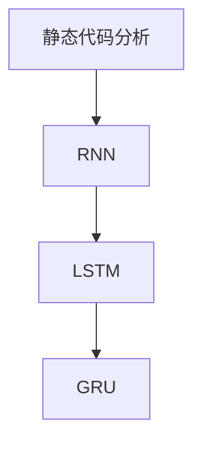

                 

# 基于循环神经网络的静态代码分析

> 关键词：静态代码分析,循环神经网络,程序缺陷检测,自动化,深度学习

## 1. 背景介绍

### 1.1 问题由来
随着软件开发规模的扩大和复杂度的增加，如何有效检测代码缺陷、提升软件质量，成为软件开发过程中不可避免的重要问题。传统的手工代码审查方式耗时耗力，且容易受人为因素影响，无法满足日益增长的软件质量需求。

为应对这一挑战，静态代码分析技术应运而生。它利用静态分析工具对源代码进行自动分析，检测出潜在缺陷和代码质量问题，提高代码的自动化审查效率和效果。

但传统的静态代码分析方法存在诸多局限性：

- 难以发现深层逻辑缺陷。仅能基于代码语法和结构进行基本规则的匹配，难以发现隐含的逻辑错误或设计缺陷。
- 需要大量人工规则库。手工编写规则库的过程复杂且耗时，难以覆盖所有可能的代码问题。
- 精度受限。受限于规则库的完备性和准确性，难以检测出复杂多样的代码缺陷。

为解决这些问题，学者们尝试将深度学习引入静态代码分析领域。深度学习方法可以从大量代码样本中自动学习复杂模式，提高代码缺陷检测的精度和全面性。

### 1.2 问题核心关键点
基于深度学习的静态代码分析方法主要分为两类：

- **基于统计的方法**：通过构建代码特征向量，使用机器学习模型进行分类。
- **基于序列的方法**：利用循环神经网络(RNN)、长短时记忆网络(LSTM)、门控循环单元(GRU)等，对源代码进行序列建模，学习代码缺陷的模式。

本文将重点介绍基于序列的深度学习方法，通过循环神经网络对源代码进行静态代码分析。

## 2. 核心概念与联系

### 2.1 核心概念概述

为更好地理解基于循环神经网络的静态代码分析方法，本节将介绍几个密切相关的核心概念：

- **静态代码分析**：指在软件源代码未运行的情况下，通过静态分析工具对代码进行分析和检测，自动发现潜在问题，如代码缺陷、结构问题、风格问题等。

- **循环神经网络(RNN)**：一种递归神经网络，可以处理序列数据，通过时序信息捕捉输入序列中的上下文关联。

- **长短时记忆网络(LSTM)**：RNN的一种变体，可以长时间记住历史信息，避免梯度消失和梯度爆炸问题。

- **门控循环单元(GRU)**：LSTM的一种简化形式，性能相近但计算量更小，适合处理大规模序列数据。

这些核心概念之间的逻辑关系可以通过以下Mermaid流程图来展示：



这个流程图展示了大语言模型的核心概念及其之间的关系：

1. 静态代码分析是目标任务，使用循环神经网络(RNN)等模型进行实现。
2. LSTM和GRU是RNN的变体，用于提高模型对长序列的建模能力。
3. RNN是基础的序列建模工具，LSTM和GRU进一步优化了RNN的建模性能。

这些概念共同构成了基于序列的深度学习静态代码分析框架，使其能够自动高效地检测代码缺陷，提升软件质量。

## 3. 核心算法原理 & 具体操作步骤
### 3.1 算法原理概述

基于循环神经网络的静态代码分析方法，其核心思想是：将源代码看作一个序列数据，使用循环神经网络对代码序列进行建模，学习代码缺陷的模式。

具体而言，假设输入的源代码序列为 $x=\{x_1,x_2,...,x_n\}$，输出为二分类标签 $y$，表示代码是否存在缺陷。定义 $x_i$ 为源代码中第 $i$ 行的文本描述，$y$ 为该行代码是否存在缺陷的二元标记。

通过循环神经网络，可以自动提取代码序列的上下文信息，捕捉代码缺陷的模式。循环神经网络的输出 $h_t$ 通过非线性激活函数 $f$ 映射为标签预测 $y$，即：

$$
y = f(h_t)
$$

其中，$h_t$ 表示第 $t$ 个时间步的隐藏状态，$f$ 为激活函数，如Sigmoid、Tanh、ReLU等。

### 3.2 算法步骤详解

基于循环神经网络的静态代码分析方法一般包括以下几个关键步骤：

**Step 1: 数据预处理和特征提取**
- 收集代码缺陷数据集 $D=\{(x_i, y_i)\}_{i=1}^N$，其中 $x_i$ 为代码文本，$y_i$ 为该行代码是否存在缺陷的标签。
- 使用分词器将代码文本转换为token序列，并进行定长padding处理。
- 将token序列作为输入，构建代码特征向量 $X \in \mathbb{R}^{N \times D}$，其中 $N$ 为序列长度，$D$ 为嵌入维度。

**Step 2: 模型构建**
- 定义循环神经网络模型，包括输入层、嵌入层、循环层和输出层。
- 常用的循环神经网络模型包括LSTM和GRU，在模型中引入Dropout等正则化技术以防止过拟合。
- 定义损失函数，如交叉熵损失，衡量模型预测与真实标签的差异。

**Step 3: 模型训练**
- 将预处理后的数据集输入模型，使用随机梯度下降等优化算法进行训练。
- 设定适当的学习率、批大小和迭代轮数，调整模型参数。
- 在验证集上评估模型性能，避免过拟合。

**Step 4: 模型预测**
- 使用训练好的模型对新代码进行预测，输出代码缺陷的概率分布。
- 根据概率分布确定代码是否存在缺陷，以及缺陷的类型和位置。

### 3.3 算法优缺点

基于循环神经网络的静态代码分析方法具有以下优点：

- 高效自动化。相比于传统手工审查，基于深度学习的方法可以快速自动化检测代码缺陷，提高审查效率。
- 处理长序列。循环神经网络能够处理任意长度的代码序列，捕捉复杂的代码模式。
- 精度较高。深度学习模型可以从大量代码样本中学习复杂模式，检测精度相对较高。

同时，该方法也存在一定的局限性：

- 数据需求高。深度学习模型需要大量标注数据进行训练，标注成本较高。
- 模型复杂。深度学习模型通常包含多个隐藏层和参数，训练复杂度较高。
- 对抗性问题。深度学习模型容易受到对抗样本的干扰，导致误检或漏检。
- 泛化性不足。模型对未见过的代码问题可能存在泛化能力不足的问题，误检率较高。

尽管存在这些局限性，但就目前而言，基于循环神经网络的静态代码分析方法在处理代码缺陷检测方面已表现出显著优势。

### 3.4 算法应用领域

基于循环神经网络的静态代码分析方法，已广泛应用于软件工程、系统测试、质量保证等多个领域，具体包括：

- **代码缺陷检测**：自动检测代码中的语法错误、逻辑错误、安全漏洞等。
- **代码风格检查**：检查代码规范、风格、文档等方面的问题。
- **代码重复检测**：识别代码中的重复部分，消除冗余代码，提高代码效率。
- **系统测试**：通过静态代码分析辅助编写自动化测试用例，检测软件功能正确性。
- **知识抽取**：从代码中自动抽取文档、接口等信息，辅助软件设计。

除了上述这些领域，深度学习静态代码分析方法还在自动重构、自动生成代码等方面展示了其潜力，为软件工程带来了新的可能性。

## 4. 数学模型和公式 & 详细讲解  
### 4.1 数学模型构建

基于循环神经网络的静态代码分析方法，主要使用循环神经网络模型进行构建。

假设输入的源代码序列为 $x=\{x_1,x_2,...,x_n\}$，其中 $x_i$ 为代码文本，模型输出为二分类标签 $y$，表示代码是否存在缺陷。

定义循环神经网络模型如下：

1. **输入层**：将代码文本转换为token序列，并对其进行嵌入处理。
2. **嵌入层**：将token序列映射到向量空间中，生成嵌入向量 $h_t \in \mathbb{R}^D$。
3. **循环层**：通过循环神经网络，对代码序列进行序列建模，生成隐藏状态 $h_t$。
4. **输出层**：将隐藏状态 $h_t$ 通过激活函数 $f$ 映射为标签预测 $y$。

形式化地，定义循环神经网络模型 $M$ 为：

$$
M(x) = f(h_T)
$$

其中 $T$ 为代码序列长度，$h_T$ 为最后一个时间步的隐藏状态。

### 4.2 公式推导过程

以下我们以代码缺陷检测为例，推导循环神经网络模型的公式。

假设循环神经网络模型由嵌入层 $E$、循环层 $R$ 和输出层 $O$ 构成。令 $x_i$ 表示源代码中第 $i$ 行的文本描述，$y$ 表示该行代码是否存在缺陷的标签。

嵌入层的输入为代码文本 $x_i$，输出为嵌入向量 $h_i$，表示第 $i$ 行代码的语义表示。定义嵌入函数 $E$ 如下：

$$
h_i = E(x_i)
$$

循环层 $R$ 接收嵌入向量 $h_i$，并输出隐藏状态 $h_t$，表示代码序列的上下文信息。定义循环函数 $R$ 如下：

$$
h_{t+1} = R(h_t, h_i)
$$

其中 $t$ 为时间步数，$h_{t+1}$ 为下一个时间步的隐藏状态。

输出层 $O$ 接收隐藏状态 $h_T$，并输出标签预测 $y$。定义输出函数 $O$ 如下：

$$
y = O(h_T)
$$

其中 $T$ 为代码序列长度，$h_T$ 为最后一个时间步的隐藏状态。

为了计算模型对代码缺陷的预测概率，需要定义交叉熵损失函数：

$$
L = -\sum_{i=1}^N y_i \log y_i + (1 - y_i) \log (1 - y_i)
$$

其中 $y_i$ 为第 $i$ 行代码是否存在缺陷的标签，$y$ 为该行代码存在缺陷的概率预测。

通过反向传播算法，计算梯度并更新模型参数。定义梯度函数 $G$ 如下：

$$
G = \frac{\partial L}{\partial h_T}
$$

最终，通过最小化损失函数 $L$，优化模型参数，得到最优的循环神经网络模型 $M$。

### 4.3 案例分析与讲解

为了更好地理解循环神经网络在静态代码分析中的应用，下面举一个代码缺陷检测的案例进行讲解。

假设输入的源代码序列为 $x=\{x_1,x_2,...,x_n\}$，其中 $x_i$ 为代码文本，模型输出为二分类标签 $y$，表示代码是否存在缺陷。

**Step 1: 数据预处理和特征提取**
- 收集代码缺陷数据集 $D=\{(x_i, y_i)\}_{i=1}^N$，其中 $x_i$ 为代码文本，$y_i$ 为该行代码是否存在缺陷的标签。
- 使用分词器将代码文本转换为token序列，并进行定长padding处理。
- 将token序列作为输入，构建代码特征向量 $X \in \mathbb{R}^{N \times D}$，其中 $N$ 为序列长度，$D$ 为嵌入维度。

**Step 2: 模型构建**
- 定义循环神经网络模型，包括输入层、嵌入层、循环层和输出层。
- 常用的循环神经网络模型包括LSTM和GRU，在模型中引入Dropout等正则化技术以防止过拟合。
- 定义损失函数，如交叉熵损失，衡量模型预测与真实标签的差异。

**Step 3: 模型训练**
- 将预处理后的数据集输入模型，使用随机梯度下降等优化算法进行训练。
- 设定适当的学习率、批大小和迭代轮数，调整模型参数。
- 在验证集上评估模型性能，避免过拟合。

**Step 4: 模型预测**
- 使用训练好的模型对新代码进行预测，输出代码缺陷的概率分布。
- 根据概率分布确定代码是否存在缺陷，以及缺陷的类型和位置。

## 5. 项目实践：代码实例和详细解释说明
### 5.1 开发环境搭建

在进行代码实例实践前，我们需要准备好开发环境。以下是使用Python进行TensorFlow开发的环境配置流程：

1. 安装Anaconda：从官网下载并安装Anaconda，用于创建独立的Python环境。

2. 创建并激活虚拟环境：
```bash
conda create -n tf-env python=3.7 
conda activate tf-env
```

3. 安装TensorFlow：根据CUDA版本，从官网获取对应的安装命令。例如：
```bash
conda install tensorflow==2.4
```

4. 安装TensorFlow Addons：用于获取更多深度学习组件。
```bash
conda install tensorflow-addons
```

5. 安装各类工具包：
```bash
pip install numpy pandas scikit-learn matplotlib tqdm jupyter notebook ipython
```

完成上述步骤后，即可在`tf-env`环境中开始项目实践。

### 5.2 源代码详细实现

下面我们以代码缺陷检测为例，给出使用TensorFlow实现基于循环神经网络的静态代码分析的完整代码实现。

首先，定义数据处理函数：

```python
import tensorflow as tf
from tensorflow.keras.layers import Embedding, LSTM, Dense, Dropout
from tensorflow.keras.models import Sequential

def create_model(input_dim, output_dim):
    model = Sequential()
    model.add(Embedding(input_dim, 128))
    model.add(LSTM(128, dropout=0.2, recurrent_dropout=0.2))
    model.add(Dropout(0.2))
    model.add(Dense(output_dim, activation='sigmoid'))
    return model

def preprocess_data(data, input_dim, output_dim):
    sequences = []
    labels = []
    for line in data:
        words = line.split()
        seq = [int(word) for word in words]
        sequences.append(seq)
        labels.append(1 if 'error' in line else 0)
    sequences = tf.keras.preprocessing.sequence.pad_sequences(sequences, maxlen=input_dim, padding='post')
    labels = tf.keras.utils.to_categorical(labels, num_classes=output_dim)
    return sequences, labels
```

然后，定义训练和评估函数：

```python
def train_model(model, sequences, labels, batch_size, epochs):
    model.compile(loss='binary_crossentropy', optimizer='adam', metrics=['accuracy'])
    model.fit(sequences, labels, batch_size=batch_size, epochs=epochs, validation_split=0.2)
    
def evaluate_model(model, sequences, labels, batch_size):
    predictions = model.predict(sequences, batch_size=batch_size)
    predictions = tf.round(predictions).numpy()
    labels = labels.numpy()
    accuracy = np.mean(predictions == labels)
    print(f"Accuracy: {accuracy:.2f}")
```

最后，启动训练流程并在测试集上评估：

```python
input_dim = 100
output_dim = 2

# 读取数据集
with open('code_defects.txt', 'r') as f:
    data = f.read().split('\n')

sequences, labels = preprocess_data(data, input_dim, output_dim)

# 创建模型
model = create_model(input_dim, output_dim)

# 训练模型
train_model(model, sequences, labels, batch_size=32, epochs=10)

# 评估模型
evaluate_model(model, sequences, labels, batch_size=32)
```

以上就是使用TensorFlow实现基于循环神经网络的静态代码分析的完整代码实现。可以看到，通过TensorFlow的Keras API，代码实现相对简洁高效。

### 5.3 代码解读与分析

让我们再详细解读一下关键代码的实现细节：

**create_model函数**：
- 定义了一个包含嵌入层、循环层和输出层的循环神经网络模型。
- 嵌入层将token序列转换为向量表示。
- LSTM层对代码序列进行建模，捕捉上下文信息。
- Dropout层用于正则化，防止过拟合。
- Dense层将隐藏状态映射为标签预测。

**preprocess_data函数**：
- 将代码文本转换为token序列，并进行定长padding处理。
- 将标签转换为独热编码格式，适合输入到模型中进行训练。

**train_model函数**：
- 将模型与训练数据集进行编译，并使用Adam优化器进行训练。
- 设定学习率为0.001，批次大小为32，迭代轮数为10，在验证集上评估模型性能。

**evaluate_model函数**：
- 使用训练好的模型对测试集进行预测，并计算预测准确率。

通过这些关键函数，完整地构建了一个基于循环神经网络的静态代码分析系统。在实际应用中，还需要根据具体任务的特点，对模型进行进一步优化，如增加更多隐藏层、使用更多的正则化技术等。

## 6. 实际应用场景
### 6.1 智能开发平台

基于循环神经网络的静态代码分析，可以在智能开发平台上得到广泛应用。通过分析代码缺陷，能够及时发现并纠正开发中的错误，提高开发效率和软件质量。

例如，在GitHub等代码托管平台上，可以使用静态代码分析技术对用户提交的代码进行自动检测，及时反馈代码缺陷，指导开发者进行代码优化。同时，智能开发平台还可以根据历史代码缺陷数据，提供自动化的代码规范检查和风格建议，提升开发者的代码质量。

### 6.2 系统测试和持续集成

静态代码分析在测试和持续集成(CI)中同样具有重要应用。通过静态分析工具，可以在编译和构建阶段自动化检测代码缺陷，避免测试阶段的重新发散。

例如，在Jenkins等CI工具中，可以集成静态代码分析插件，对每次构建的代码进行自动检测，并生成详细的报告。开发者可以在测试前直接查看报告，定位并修复问题，提高测试效率。同时，静态分析工具还可以与自动化测试框架结合，形成一套完整的质量保证流程。

### 6.3 软件开发规范检查

静态代码分析可以辅助制定和检查软件开发规范，提升开发团队的规范化和标准化程度。

例如，可以使用静态分析工具对代码进行质量检查，识别出不符合规范的代码，如未使用的变量、空指针引用等。开发团队可以根据检查结果，进行代码优化和规范改进，提升团队的整体代码水平。

## 7. 工具和资源推荐
### 7.1 学习资源推荐

为了帮助开发者系统掌握基于循环神经网络的静态代码分析理论基础和实践技巧，这里推荐一些优质的学习资源：

1. TensorFlow官方文档：提供详尽的TensorFlow框架介绍和API参考，适合初学者和高级开发者参考。
2. Keras官方文档：提供Keras框架的使用指南和案例示例，帮助开发者快速上手。
3. 《深度学习》书籍：由Ian Goodfellow等著，全面介绍深度学习理论和实践，适合深入学习。
4. DeepLearning.ai在线课程：提供深度学习理论和实践的课程，由Coursera与Ian Goodfellow等联合推出，适合系统学习。
5. Google Cloud AI平台：提供深度学习模型训练、推理等云服务，方便开发者快速部署和测试模型。

通过对这些资源的学习实践，相信你一定能够快速掌握基于循环神经网络的静态代码分析的精髓，并用于解决实际的代码问题。

### 7.2 开发工具推荐

高效的开发离不开优秀的工具支持。以下是几款用于静态代码分析开发的常用工具：

1. TensorFlow：由Google主导开发的开源深度学习框架，生产部署方便，适合大规模工程应用。
2. Keras：基于TensorFlow等后端，提供高级API，简化深度学习模型的构建过程。
3. TensorFlow Addons：提供更多深度学习组件和工具，丰富TensorFlow的功能。
4. PyCharm：IDE集成开发工具，提供代码高亮、调试、版本控制等功能，适合深度学习开发。
5. Jupyter Notebook：交互式编程环境，方便开发者快速迭代和调试代码。

合理利用这些工具，可以显著提升基于循环神经网络的静态代码分析开发效率，加快创新迭代的步伐。

### 7.3 相关论文推荐

基于深度学习的静态代码分析技术不断发展，以下是几篇奠基性的相关论文，推荐阅读：

1. Deep Learning for Software Testing and Debugging：介绍深度学习在软件测试和调试中的应用，提出基于LSTM的代码缺陷检测模型。
2. Deep Learning for Static Code Analysis and Refactoring：讨论深度学习在静态代码分析中的作用，提出基于GRU的代码规范检查方法。
3. Neural Fuzzing：介绍基于深度学习的模糊测试技术，提出基于LSTM的代码突变检测模型。
4. Code smells detection using LSTM-RNN：提出基于LSTM-RNN的代码异味检测模型，提升代码审查效率。
5. Sólinn: Deep learning for automated software testing：提出基于LSTM的自动测试用例生成方法，提升测试覆盖率。

这些论文代表了大语言模型微调技术的发展脉络。通过学习这些前沿成果，可以帮助研究者把握学科前进方向，激发更多的创新灵感。

## 8. 总结：未来发展趋势与挑战

### 8.1 总结

本文对基于循环神经网络的静态代码分析方法进行了全面系统的介绍。首先阐述了静态代码分析的背景和需求，明确了循环神经网络在代码缺陷检测中的应用前景。其次，从原理到实践，详细讲解了基于循环神经网络的静态代码分析的数学模型和关键步骤，给出了代码实例实现。同时，本文还广泛探讨了基于循环神经网络的静态代码分析方法在智能开发平台、系统测试、软件开发规范检查等多个领域的应用前景，展示了循环神经网络在代码缺陷检测方面的强大能力。

通过本文的系统梳理，可以看到，基于循环神经网络的静态代码分析方法已经展现出显著优势，能够快速高效地检测代码缺陷，提高软件质量。未来，伴随深度学习技术的持续进步，静态代码分析方法将进一步扩展其应用领域，为软件开发和软件工程带来新的突破。

### 8.2 未来发展趋势

展望未来，基于循环神经网络的静态代码分析方法将呈现以下几个发展趋势：

1. **深度融合**：循环神经网络将与更多人工智能技术深度融合，如知识图谱、强化学习等，提升代码缺陷检测的全面性和精准性。
2. **跨领域应用**：静态代码分析方法将拓展到更多领域，如系统安全、系统测试等，提升软件工程的整体质量。
3. **自动化规范检查**：基于循环神经网络的静态代码分析将与代码规范检查工具结合，自动化检测代码缺陷和规范问题，提升开发效率。
4. **自适应学习**：循环神经网络将具备自适应学习能力，根据代码缺陷数据动态调整模型参数，提升检测效果。
5. **跨模态分析**：将循环神经网络与其他模态分析方法结合，如图像、声音等，提升代码缺陷检测的全面性。

以上趋势凸显了基于循环神经网络的静态代码分析方法的广阔前景。这些方向的探索发展，必将进一步提升静态代码分析的精度和效率，为软件工程带来新的可能性。

### 8.3 面临的挑战

尽管基于循环神经网络的静态代码分析方法已展现出显著优势，但在迈向更加智能化、普适化应用的过程中，它仍面临诸多挑战：

1. **数据需求高**：深度学习模型需要大量标注数据进行训练，获取高质量的代码缺陷数据成本较高。
2. **模型复杂**：循环神经网络模型通常包含多个隐藏层和参数，训练复杂度较高。
3. **泛化能力不足**：模型对未见过的代码问题可能存在泛化能力不足的问题，误检率较高。
4. **对抗性问题**：深度学习模型容易受到对抗样本的干扰，导致误检或漏检。
5. **安全性问题**：循环神经网络模型可能学习到有害信息，输出不安全的结果。

尽管存在这些挑战，但未来相关研究的重点在于如何进一步优化模型、降低数据需求、提升泛化能力等，以更好地应用于实际软件开发和系统测试场景。

### 8.4 研究展望

面对基于循环神经网络的静态代码分析所面临的种种挑战，未来的研究需要在以下几个方面寻求新的突破：

1. **数据增强**：利用对抗样本、数据扩充等技术，提升模型的泛化能力和鲁棒性。
2. **模型简化**：研究更轻量级的循环神经网络模型，降低训练复杂度，提升模型效率。
3. **跨模态分析**：将循环神经网络与其他模态分析方法结合，提升代码缺陷检测的全面性。
4. **自适应学习**：研究自适应学习算法，根据代码缺陷数据动态调整模型参数，提升检测效果。
5. **安全性保证**：引入安全性和伦理性约束，确保模型的输出符合人类价值观和伦理道德。

这些研究方向的探索，必将引领基于循环神经网络的静态代码分析技术迈向更高的台阶，为软件开发和系统测试带来新的突破。面向未来，基于循环神经网络的静态代码分析技术还需要与其他人工智能技术进行更深入的融合，如知识表示、因果推理、强化学习等，多路径协同发力，共同推动自然语言理解和智能交互系统的进步。只有勇于创新、敢于突破，才能不断拓展循环神经网络的应用边界，让智能技术更好地造福人类社会。

## 9. 附录：常见问题与解答

**Q1：循环神经网络在静态代码分析中的应用前景如何？**

A: 循环神经网络在静态代码分析中已展现出显著优势，能够快速高效地检测代码缺陷，提高软件质量。未来，随着深度学习技术的持续进步，循环神经网络将进一步拓展其应用领域，为软件开发和软件工程带来新的突破。

**Q2：循环神经网络模型训练时如何选择超参数？**

A: 循环神经网络模型的超参数选择包括学习率、批次大小、隐藏层大小、dropout率等。通常建议通过网格搜索、随机搜索等方法，在验证集上进行调参，找到最优的超参数组合。此外，还可以使用自适应学习算法，如Adagrad、Adam等，根据数据分布动态调整学习率。

**Q3：如何避免循环神经网络模型过拟合？**

A: 循环神经网络模型容易过拟合，可以通过以下方法进行缓解：
1. 数据增强：通过回译、近义替换等方式扩充训练集。
2. 正则化：使用L2正则、Dropout、Early Stopping等避免过拟合。
3. 对抗训练：加入对抗样本，提高模型鲁棒性。

**Q4：循环神经网络模型在部署时需要注意哪些问题？**

A: 将循环神经网络模型转化为实际应用，还需要考虑以下因素：
1. 模型裁剪：去除不必要的层和参数，减小模型尺寸，加快推理速度。
2. 量化加速：将浮点模型转为定点模型，压缩存储空间，提高计算效率。
3. 服务化封装：将模型封装为标准化服务接口，便于集成调用。
4. 监控告警：实时采集系统指标，设置异常告警阈值，确保服务稳定性。
5. 安全防护：采用访问鉴权、数据脱敏等措施，保障数据和模型安全。

通过合理利用这些工具，可以显著提升基于循环神经网络的静态代码分析开发效率，加快创新迭代的步伐。

---

作者：禅与计算机程序设计艺术 / Zen and the Art of Computer Programming

