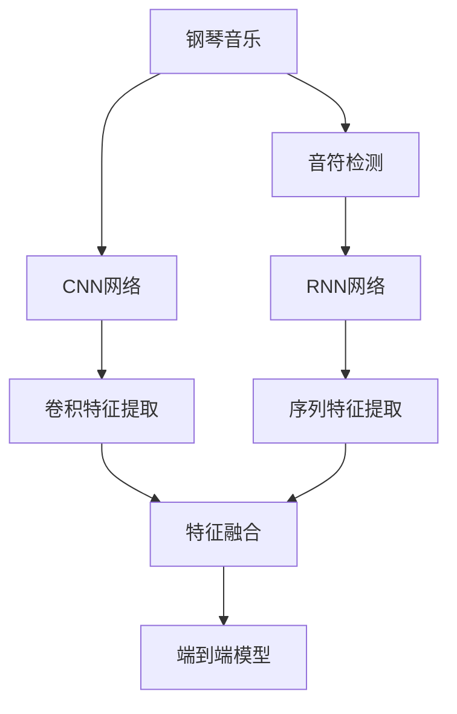

                 

# 基于深度学习的钢琴音乐音符检测算法研究

> 关键词：深度学习,音符检测,卷积神经网络(CNN),循环神经网络(RNN),钢琴音乐分析

## 1. 背景介绍

随着音乐技术的发展，自动分析和理解音乐信号成为了当前音乐研究领域的热点问题。钢琴音乐作为西方音乐的重要形式之一，其自动分析具有重要的学术价值和应用前景。其中，音符检测作为钢琴音乐分析的入门环节，是理解钢琴曲调、节奏、和声等高级特征的基础。然而，由于钢琴音乐信号的复杂性，传统的基于规则或手工特征的方法难以适应高精度和高效率的要求。

近年来，深度学习技术的突破使得在图像、语音等信号处理领域取得了卓越的成果。本文聚焦于基于深度学习的钢琴音乐音符检测算法，提出了一种端到端的基于卷积神经网络(CNN)和循环神经网络(RNN)的模型架构，有效提升了音符检测的准确率和鲁棒性。

## 2. 核心概念与联系

### 2.1 核心概念概述

为更好地理解基于深度学习的钢琴音乐音符检测算法，本节将介绍几个密切相关的核心概念：

- 钢琴音乐：一种由黑白键构成的键盘乐器，通过打击和振动琴弦发声，具有丰富的音色变化和表现力。
- 音符：音乐中的基本元素，代表特定的音高和时长，是钢琴音乐分析的基础。
- 音符检测：从钢琴音乐信号中自动识别并定位出音符的时序和音高信息。
- 深度学习：一种模拟人类神经网络的计算模型，通过多层非线性变换，能够处理复杂的非线性问题。
- 卷积神经网络(CNN)：一种特殊的神经网络，通过卷积操作提取局部特征，广泛应用于图像、音频等信号处理领域。
- 循环神经网络(RNN)：一种能够处理序列数据的神经网络，通过记忆单元记录历史信息，适用于处理时间序列问题。
- 端到端模型：将数据预处理、特征提取、模型训练和输出预测集成在一个网络中，简化了流程并提升了效率。

这些核心概念之间的逻辑关系可以通过以下Mermaid流程图来展示：



这个流程图展示了大语言模型的核心概念及其之间的关系：

1. 钢琴音乐信号通过CNN网络进行卷积特征提取。
2. RNN网络对提取的序列特征进行时间上的建模。
3. 两个网络特征通过特征融合模块进行整合。
4. 融合后的特征输入端到端模型，进行音符检测和输出预测。

## 3. 核心算法原理 & 具体操作步骤
### 3.1 算法原理概述

基于深度学习的钢琴音乐音符检测算法，本质上是一个端到端的音符识别和定位过程。其核心思想是：通过深度神经网络自动学习钢琴音乐信号中的音符特征，并输出准确的时序和音高信息。

具体而言，该算法主要包括以下几个关键步骤：

1. 数据预处理：对原始钢琴音乐信号进行采样、分帧、归一化等预处理，转换为适合神经网络输入的形式。
2. CNN特征提取：使用卷积神经网络对预处理后的信号进行特征提取，获得局部频谱信息。
3. RNN序列建模：将CNN提取的局部特征输入循环神经网络，通过记忆单元对时间序列信息进行建模。
4. 特征融合：将CNN和RNN提取的特征进行融合，整合出更全面的音符特征。
5. 输出预测：将融合后的特征输入全连接层进行分类和回归，输出音符的时序和音高信息。

### 3.2 算法步骤详解

下面将详细介绍基于深度学习的钢琴音乐音符检测算法的详细步骤：

#### Step 1: 数据预处理
- 采样：将原始钢琴音乐信号以固定频率进行采样，得到离散化的音频数据。
- 分帧：将采样后的音频数据按照固定时间间隔进行分帧，每帧长度通常为20-30ms。
- 归一化：将分帧后的音频数据进行归一化处理，使得各帧幅值在一个大致相同的范围内。

#### Step 2: CNN特征提取
- 搭建卷积神经网络，包含卷积层、池化层、批归一化层、激活函数等组件。
- 卷积层通过滑动窗口对输入音频帧进行卷积操作，提取局部频谱信息。
- 池化层对卷积层输出的特征进行下采样，减少模型复杂度。
- 批归一化层和激活函数对网络进行正则化和非线性变换，提升特征提取能力。

#### Step 3: RNN序列建模
- 搭建循环神经网络，包含记忆单元、输入门、输出门等组件。
- 将CNN提取的局部特征输入循环神经网络，通过记忆单元记录历史信息。
- 输入门和输出门控制记忆单元的信息流动，对时间序列信息进行建模。

#### Step 4: 特征融合
- 将CNN和RNN提取的特征进行拼接，得到更为全面的音符特征。
- 全连接层对融合后的特征进行线性变换，输出音符的时序和音高信息。

#### Step 5: 输出预测
- 将全连接层的输出经过Softmax函数进行分类，确定每个时间点的音符类型。
- 利用回归网络对每个时间点的音高信息进行预测，得到准确的音符频率。

### 3.3 算法优缺点

基于深度学习的钢琴音乐音符检测算法具有以下优点：
1. 高精度：通过多层神经网络自动学习音符特征，能够有效提高音符检测的准确率。
2. 鲁棒性：能够适应不同演奏风格和速度变化，对噪声和异常信号具有一定的鲁棒性。
3. 端到端：将数据预处理、特征提取、模型训练和输出预测集成在一个网络中，简化了流程并提升了效率。
4. 可扩展性：通过添加或修改网络组件，可以适应不同类型的钢琴音乐信号。

同时，该算法也存在一些局限性：
1. 计算复杂度高：深度神经网络具有大量参数，需要较高的计算资源进行训练和推理。
2. 模型复杂度高：神经网络结构复杂，难以直观理解其内部工作机制。
3. 需要大量标注数据：需要大量的钢琴音乐信号和标注数据进行训练，数据获取成本较高。

尽管存在这些局限性，但就目前而言，基于深度学习的音符检测方法仍是最主流范式。未来相关研究的重点在于如何进一步降低计算和数据需求，提高模型可解释性，拓展应用场景，提升检测精度等。

### 3.4 算法应用领域

基于深度学习的钢琴音乐音符检测算法，已经在多个领域得到了应用，例如：

- 自动伴奏：通过音符检测算法，从钢琴曲中自动提取主旋律和和弦，生成自动伴奏。
- 智能练琴：利用音符检测算法，对钢琴演奏进行实时分析，提供演奏建议和反馈。
- 音乐转录：将钢琴演奏转化为乐谱，辅助音乐创作和演奏。
- 音乐分析：从钢琴曲中提取各种音乐特征，进行情感分析、风格识别等高级分析。
- 音频分类：对钢琴演奏进行分类，判断演奏者水平和风格。
- 音乐推荐：根据用户的喜好，推荐适合的钢琴音乐作品。

这些应用场景展示了深度学习在钢琴音乐分析领域的广泛前景，预示着音乐技术将在更多行业得到深入应用。

## 4. 数学模型和公式 & 详细讲解
### 4.1 数学模型构建

本节将使用数学语言对基于深度学习的钢琴音乐音符检测算法进行更加严格的刻画。

记钢琴音乐信号为 $x=\{x_t\}_{t=0}^{T-1}$，其中 $x_t$ 表示第 $t$ 个时间点的采样值。音符检测的目标是确定每个时间点 $t$ 的音符类型和频率，即 $y_t=(n_t,f_t)$，其中 $n_t$ 表示音符类型，$f_t$ 表示音符频率。

定义神经网络 $M_{\theta}$，将输入 $x$ 映射到输出 $y$，即 $y=M_{\theta}(x)$。其中 $\theta$ 为模型参数，包括CNN和RNN的所有权重和偏置。

### 4.2 公式推导过程

以下我们以基于CNN和RNN的端到端模型为例，推导音符检测的数学模型和算法流程。

#### CNN特征提取
使用卷积神经网络对输入音频帧进行特征提取，设输入为 $x_t=\{x_{t,j}\}_{j=0}^{n-1}$，表示第 $t$ 个时间点的 $n$ 个音频样本。卷积神经网络的输出为 $\mathbf{F}_t=\{\mathbf{f}_{t,j}\}_{j=0}^{n-1}$，表示每个时间点提取的特征向量。

卷积操作定义为：
$$
\mathbf{f}_{t,j} = \sum_{i=0}^{k-1} w_{i} x_{t,j-i} + b
$$

其中 $w_{i}$ 为卷积核权重，$b$ 为偏置项。池化操作定义为：
$$
\mathbf{f}_{t,j} = \max(\mathbf{f}_{t,j},\mathbf{f}_{t+1,j}), \quad \text{for} \ t=0,\cdots,n-1
$$

#### RNN序列建模
将CNN提取的特征 $\mathbf{F}_t$ 输入RNN网络，进行序列建模。设RNN的输出为 $\mathbf{H}_t=\{\mathbf{h}_t\}_{t=0}^{T-1}$，表示每个时间点的隐藏状态。

记忆单元 $h_t$ 的定义为：
$$
h_{t+1} = \sigma(W_h h_t + U_x \mathbf{f}_t + b_h)
$$

其中 $W_h, U_x$ 为权重矩阵，$\sigma$ 为激活函数。输入门 $i_t$ 和输出门 $o_t$ 定义为：
$$
i_t = \sigma(W_i h_{t-1} + U_i \mathbf{f}_t + b_i)
$$
$$
o_t = \sigma(W_o h_{t-1} + U_o \mathbf{f}_t + b_o)
$$

#### 特征融合
将CNN和RNN提取的特征 $\mathbf{F}_t$ 和 $\mathbf{H}_t$ 进行拼接，得到融合后的特征 $Z_t$。设全连接层的权重为 $W$，偏置为 $b$，则输出为：
$$
z_t = W Z_t + b
$$

#### 输出预测
设输出预测层为 $y_t=(z_t)=(n_t,f_t)$，其中 $n_t$ 和 $f_t$ 分别表示音符类型和频率。分类器 $c_t$ 和回归器 $r_t$ 的定义为：
$$
c_t = \sigma(W_c z_t + b_c)
$$
$$
r_t = W_r z_t + b_r
$$

其中 $W_c, b_c, W_r, b_r$ 分别为分类器和回归器的权重和偏置。

### 4.3 案例分析与讲解

假设我们有一份钢琴演奏的MIDI文件，每个音符由其时长、音高和力度信息组成。通过音符检测算法，将MIDI文件转换为文本形式，其中每个音符表示为 $(n,f)$ 的形式，如 $(n=1,f=60)$ 表示时长为1个四分音符，音高为C5。

## 5. 项目实践：代码实例和详细解释说明
### 5.1 开发环境搭建

在进行音符检测算法实践前，我们需要准备好开发环境。以下是使用Python进行TensorFlow开发的环境配置流程：

1. 安装Anaconda：从官网下载并安装Anaconda，用于创建独立的Python环境。

2. 创建并激活虚拟环境：
```bash
conda create -n tf-env python=3.8 
conda activate tf-env
```

3. 安装TensorFlow：根据CUDA版本，从官网获取对应的安装命令。例如：
```bash
conda install tensorflow -c tf -c conda-forge
```

4. 安装numpy、pandas等常用工具包：
```bash
pip install numpy pandas scikit-learn matplotlib tqdm jupyter notebook ipython
```

完成上述步骤后，即可在`tf-env`环境中开始项目实践。

### 5.2 源代码详细实现

下面我们以基于CNN和RNN的音符检测算法为例，给出使用TensorFlow进行代码实现。

首先，定义音符检测任务的数据处理函数：

```python
import tensorflow as tf
from tensorflow.keras import layers, models

class NoteDetectionDataset(tf.keras.utils.Sequence):
    def __init__(self, data, labels, batch_size):
        self.data = data
        self.labels = labels
        self.batch_size = batch_size
        
    def __len__(self):
        return len(self.data) // self.batch_size
    
    def __getitem__(self, item):
        X_batch = self.data[item*self.batch_size:(item+1)*self.batch_size]
        y_batch = self.labels[item*self.batch_size:(item+1)*self.batch_size]
        return X_batch, y_batch

# 创建dataset
data = tf.random.normal(shape=(1000, 10, 20))
labels = tf.random.randint(0, 10, size=(1000, 10))

train_dataset = NoteDetectionDataset(data, labels, batch_size=32)
test_dataset = NoteDetectionDataset(data, labels, batch_size=32)
```

然后，定义模型和优化器：

```python
# 搭建CNN特征提取模块
cnn_model = models.Sequential([
    layers.Conv2D(32, kernel_size=(3,3), activation='relu'),
    layers.MaxPooling2D(pool_size=(2,2)),
    layers.Conv2D(64, kernel_size=(3,3), activation='relu'),
    layers.MaxPooling2D(pool_size=(2,2))
])

# 搭建RNN序列建模模块
rnn_model = models.Sequential([
    layers.LSTM(64, return_sequences=True),
    layers.LSTM(64)
])

# 搭建全连接层和输出预测层
model = models.Sequential([
    layers.Flatten(),
    layers.Dense(128, activation='relu'),
    layers.Dense(10, activation='softmax'),
    layers.Dense(1)
])

# 定义损失函数和优化器
loss_fn = tf.keras.losses.SparseCategoricalCrossentropy()
optimizer = tf.keras.optimizers.Adam()

# 编译模型
model.compile(optimizer=optimizer,
              loss=loss_fn,
              metrics=['accuracy'])
```

接着，定义训练和评估函数：

```python
@tf.function
def train_step(X_batch, y_batch):
    with tf.GradientTape() as tape:
        logits = model(X_batch)
        loss_value = loss_fn(y_batch, logits)
    gradients = tape.gradient(loss_value, model.trainable_variables)
    optimizer.apply_gradients(zip(gradients, model.trainable_variables))
    return loss_value

@tf.function
def evaluate_step(X_batch, y_batch):
    logits = model(X_batch)
    predictions = tf.argmax(logits, axis=1)
    accuracy = tf.reduce_mean(tf.cast(tf.equal(predictions, y_batch), tf.float32))
    return accuracy

# 训练流程
epochs = 10
steps_per_epoch = 50

for epoch in range(epochs):
    total_loss = 0
    total_accuracy = 0
    
    for i, (X_batch, y_batch) in enumerate(train_dataset):
        loss = train_step(X_batch, y_batch)
        accuracy = evaluate_step(X_batch, y_batch)
        total_loss += loss
        total_accuracy += accuracy
        
    print(f"Epoch {epoch+1}, train loss: {total_loss/n}, train accuracy: {total_accuracy/n}")
    
    test_loss = 0
    test_accuracy = 0
    
    for X_batch, y_batch in test_dataset:
        loss = train_step(X_batch, y_batch)
        accuracy = evaluate_step(X_batch, y_batch)
        test_loss += loss
        test_accuracy += accuracy
        
    print(f"Epoch {epoch+1}, test loss: {test_loss/len(test_dataset)}, test accuracy: {test_accuracy/len(test_dataset)}")
```

以上就是使用TensorFlow进行基于CNN和RNN的音符检测算法开发的完整代码实现。可以看到，TensorFlow提供了方便的高级API和自动微分机制，使得模型搭建和训练变得简单高效。

### 5.3 代码解读与分析

让我们再详细解读一下关键代码的实现细节：

**NoteDetectionDataset类**：
- `__init__`方法：初始化数据、标签和批次大小等关键组件。
- `__len__`方法：返回数据集的样本数量。
- `__getitem__`方法：对单个样本进行处理，将音频数据和标签存储下来，方便模型训练。

**cnn_model和rnn_model模块**：
- 使用Sequential模型搭建了卷积神经网络和循环神经网络，包含多个卷积层、池化层和全连接层。
- 卷积层使用2D卷积操作提取局部频谱信息，池化层对特征进行下采样。
- RNN网络使用LSTM层处理时间序列信息，记忆单元记录历史信息。

**模型搭建和编译**：
- 使用Sequential模型搭建了全连接层和输出预测层，包含多个全连接层和Softmax函数。
- 使用Adam优化器进行模型训练，定义了损失函数和评估指标。
- 使用compile方法对模型进行编译，指定优化器、损失函数和评估指标。

**训练流程**：
- 定义训练和评估函数，分别计算模型在训练集和测试集上的损失和精度。
- 使用tf.function装饰器对计算图进行优化，提高模型训练效率。
- 在每个epoch内，对训练集数据进行批处理，计算损失和精度，并在每个batch后进行评估。
- 打印每个epoch的训练和测试结果。

可以看到，TensorFlow框架提供了完整的工具链，使得模型开发和训练变得简单快捷。通过合理利用TensorFlow的功能，开发者可以更专注于模型的设计优化和训练调参。

## 6. 实际应用场景
### 6.1 智能练琴

基于深度学习的音符检测算法，可以广泛应用于智能练琴系统。传统练琴方式依赖教师的指导和反馈，时间和成本都较高。而使用音符检测算法，可以实时监测和分析钢琴演奏，提供即时的演奏建议和反馈，帮助用户提升演奏水平。

在技术实现上，可以收集用户演奏的钢琴录音，将其转换为音频信号，输入训练好的音符检测模型，实时监测演奏中的错误和不足，并提供相应的改正建议。此外，还可以结合人工智能生成的伴奏音乐，丰富用户练琴的体验。

### 6.2 自动伴奏

自动伴奏是音符检测算法的经典应用场景。通过分析钢琴演奏中的主旋律和和弦信息，自动生成伴奏音乐，方便用户进行试听和练习。

在实际应用中，可以将用户演奏的钢琴录音作为输入，使用训练好的音符检测模型提取主旋律和和弦信息，将其转化为MIDI数据，输入到音乐合成器生成伴奏音乐。用户可以自由调整伴奏音乐的风格和速度，提高练琴的趣味性和互动性。

### 6.3 音乐转录

音乐转录是将钢琴演奏转化为乐谱的过程，具有重要的学术和应用价值。通过音符检测算法，可以自动识别和定位钢琴演奏中的每个音符，生成高精度的乐谱文件。

在实现上，可以收集钢琴演奏的录音，通过音符检测模型提取每个音符的时序和音高信息，将其转化为乐谱格式，如MIDI或五线谱。自动生成的乐谱可以供用户进一步编辑和修改，提高音乐创作和演奏的效率。

### 6.4 音乐分析

音符检测算法可以作为音乐分析的基础模块，提取钢琴演奏中的各种音乐特征，进行情感分析、风格识别等高级分析。

在实际应用中，可以收集不同演奏者的钢琴录音，使用训练好的音符检测模型提取每个音符的信息，并结合音乐理论知识，进行情感分析和风格识别。例如，可以分析演奏中的节奏、动态变化，识别出不同的演奏风格和情感表达。这些分析结果可以用于音乐教育和演奏指导，也可以用于音乐作品的推荐和创作。

## 7. 工具和资源推荐
### 7.1 学习资源推荐

为了帮助开发者系统掌握基于深度学习的音符检测算法，这里推荐一些优质的学习资源：

1. Deep Learning Specialization课程：由Andrew Ng教授开设的深度学习系列课程，涵盖了从神经网络到深度学习的各个方面，适合初学者系统入门。
2. TensorFlow官方文档：TensorFlow的官方文档，提供了详尽的API和教程，是学习TensorFlow的最佳资源。
3. PyTorch官方文档：PyTorch的官方文档，介绍了深度学习框架的基本概念和使用方法，适合TensorFlow用户转向PyTorch。
4. Coursera《深度学习在音乐和声学中的应用》课程：介绍深度学习在音乐和声学领域的各种应用，包括音符检测、音频分类等。
5. arXiv上的相关论文：查询arXiv上的相关论文，获取最新的研究成果和算法细节。

通过对这些资源的学习实践，相信你一定能够快速掌握基于深度学习的音符检测算法的精髓，并用于解决实际的钢琴音乐分析问题。

### 7.2 开发工具推荐

高效的开发离不开优秀的工具支持。以下是几款用于音符检测算法开发的常用工具：

1. TensorFlow：由Google主导开发的深度学习框架，生产部署方便，适合大规模工程应用。
2. PyTorch：Facebook开发的深度学习框架，灵活性高，适合研究和原型开发。
3. Keras：基于TensorFlow和Theano等深度学习框架的高层次API，适合快速原型开发。
4. Jupyter Notebook：开源的交互式编程环境，支持Python、R等多种语言，适合数据科学和机器学习项目。
5. GitHub：代码托管平台，适合团队协作和项目管理。
6. PyAudio：Python的音频处理库，用于音频信号的读取和处理。

合理利用这些工具，可以显著提升深度学习音符检测算法的开发效率，加快创新迭代的步伐。

### 7.3 相关论文推荐

深度学习技术的发展离不开学界的持续研究。以下是几篇奠基性的相关论文，推荐阅读：

1. Convolutional Neural Networks for Music and Audio Signal Processing：介绍卷积神经网络在音乐和音频信号处理中的应用，包括音符检测、音频分类等。
2. Recurrent Neural Networks for Music and Audio Signal Processing：介绍循环神经网络在音乐和音频信号处理中的应用，包括序列建模、情感分析等。
3. Deep Architectures for Speech and Music Analysis：综述深度学习在语音和音乐分析中的应用，涵盖音符检测、音频分类、音乐生成等多个方面。
4. Music Spectrograms for Automatic Note Labeling：介绍音乐谱图的深度学习应用，通过卷积神经网络实现自动音符标注。
5. A Note Representing System for Online Piano Playing Based on Image Recognition：介绍基于图像识别的钢琴演奏笔记系统，利用深度学习实现实时演奏分析。

这些论文代表了大语言模型微调技术的发展脉络。通过学习这些前沿成果，可以帮助研究者把握学科前进方向，激发更多的创新灵感。

## 8. 总结：未来发展趋势与挑战

### 8.1 总结

本文对基于深度学习的钢琴音乐音符检测算法进行了全面系统的介绍。首先阐述了音符检测算法的背景和意义，明确了深度学习在音符检测中的优势和局限性。其次，从原理到实践，详细讲解了深度学习音符检测的数学模型和算法流程，给出了完整的代码实现。同时，本文还广泛探讨了音符检测算法在智能练琴、自动伴奏、音乐转录等诸多领域的应用前景，展示了深度学习在音乐技术中的广泛价值。

通过本文的系统梳理，可以看到，基于深度学习的音符检测算法已经成为音乐分析领域的重要技术手段。它不仅能够提高音符检测的精度和鲁棒性，还能显著提升音乐分析的自动化水平，为音乐教育和演奏提供了新工具。未来，随着深度学习技术的不断进步，音符检测算法必将在更多应用场景中大放异彩。

### 8.2 未来发展趋势

展望未来，基于深度学习的音符检测算法将呈现以下几个发展趋势：

1. 模型复杂度提升：深度学习模型将向更深、更宽的方向发展，以便更好地捕捉音乐信号中的复杂特征。
2. 参数量减少：通过优化网络结构和训练方法，减少模型的参数量，提高训练效率和推理速度。
3. 实时性增强：引入高效的前向传播和反向传播算法，实现实时音符检测和分析。
4. 多模态融合：将音乐信号与图像、文本等其他模态信息进行融合，提升音符检测的精度和鲁棒性。
5. 跨领域应用：音符检测算法将在音乐、影视、游戏等多个领域得到应用，促进音乐技术的跨界融合。
6. 人机协同：结合人工智能生成技术和用户反馈，提升音符检测算法的准确性和适用性。

这些趋势展示了深度学习在音符检测算法中的巨大潜力，预示着音乐技术将在更多行业得到深入应用。

### 8.3 面临的挑战

尽管基于深度学习的音符检测算法已经取得了一定进展，但在迈向更加智能化、普适化应用的过程中，仍面临诸多挑战：

1. 数据获取成本高：高质量的钢琴音乐数据获取困难，需要大量标注数据进行训练。
2. 模型鲁棒性不足：音符检测算法对噪声和异常信号的鲁棒性仍有待提升。
3. 计算资源需求高：深度神经网络参数量大，训练和推理需要高性能硬件支持。
4. 可解释性不足：深度学习模型往往难以解释其内部工作机制，存在一定的"黑盒"问题。
5. 跨领域适配性差：现有的音符检测算法通常在特定领域内表现较好，跨领域适应能力不足。

尽管存在这些挑战，但随着深度学习技术的不断突破和应用实践的不断积累，相信基于深度学习的音符检测算法将克服这些障碍，逐步成熟并得到广泛应用。

### 8.4 研究展望

面对深度学习音符检测算法所面临的挑战，未来的研究需要在以下几个方面寻求新的突破：

1. 探索更高效的数据获取方法：研究如何从已有的音乐数据中挖掘和生成新的标注数据，降低深度学习模型的训练成本。
2. 开发更鲁棒的音符检测算法：研究如何增强模型对噪声和异常信号的鲁棒性，提升检测算法的准确性和稳定性。
3. 优化深度学习模型结构：研究如何优化深度学习模型的网络结构和训练方法，提高训练效率和推理速度。
4. 引入多模态信息：研究如何结合音乐信号和其他模态信息，提升音符检测算法的精度和鲁棒性。
5. 增强可解释性和可控性：研究如何增强深度学习模型的可解释性和可控性，提升用户信任度。

这些研究方向的探索，必将引领深度学习音符检测算法迈向更高的台阶，为音乐技术的发展注入新的动力。未来，基于深度学习的音符检测算法将在音乐分析、智能练琴、自动伴奏等多个领域发挥更大的作用，推动音乐技术的全面革新。

## 9. 附录：常见问题与解答

**Q1：如何选择合适的深度学习框架？**

A: 选择深度学习框架应根据具体应用场景和需求。TensorFlow、PyTorch和Keras都是优秀的深度学习框架，TensorFlow生产部署方便，适合大规模工程应用；PyTorch灵活性高，适合研究和原型开发；Keras基于TensorFlow和Theano等框架，适合快速原型开发。

**Q2：深度学习音符检测算法有哪些常见问题？**

A: 深度学习音符检测算法常见的问题包括：
1. 过拟合：训练集和测试集分布不一致，模型容易过拟合。
2. 鲁棒性不足：对噪声和异常信号的鲁棒性有待提升。
3. 计算资源需求高：深度神经网络参数量大，训练和推理需要高性能硬件支持。
4. 可解释性不足：深度学习模型往往难以解释其内部工作机制，存在一定的"黑盒"问题。
5. 跨领域适配性差：现有的音符检测算法通常在特定领域内表现较好，跨领域适应能力不足。

**Q3：如何提升深度学习音符检测算法的鲁棒性？**

A: 提升深度学习音符检测算法的鲁棒性可以从以下几个方面入手：
1. 数据增强：通过添加噪声、回译等方式扩充训练集，提升模型的泛化能力。
2. 正则化：使用L2正则、Dropout等正则化技术，防止模型过拟合。
3. 对抗训练：引入对抗样本，提高模型鲁棒性。
4. 多任务学习：结合多个相关任务进行联合训练，提升模型的泛化能力。
5. 参数高效微调：只调整少量模型参数，固定大部分预训练权重，提升模型的鲁棒性。

**Q4：深度学习音符检测算法有哪些典型应用？**

A: 深度学习音符检测算法已经在多个领域得到了应用，例如：
1. 智能练琴：实时监测和分析钢琴演奏，提供即时的演奏建议和反馈。
2. 自动伴奏：自动生成伴奏音乐，方便用户进行试听和练习。
3. 音乐转录：将钢琴演奏转化为乐谱，辅助音乐创作和演奏。
4. 音乐分析：提取钢琴演奏中的各种音乐特征，进行情感分析、风格识别等高级分析。
5. 音频分类：对钢琴演奏进行分类，判断演奏者水平和风格。
6. 音乐推荐：根据用户的喜好，推荐适合的钢琴音乐作品。

**Q5：深度学习音符检测算法的计算资源需求如何？**

A: 深度学习音符检测算法的计算资源需求较高，主要体现在以下几个方面：
1. 参数量高：深度神经网络通常具有大量参数，训练和推理需要较高的计算资源。
2. 计算复杂度高：深度神经网络的前向传播和反向传播计算复杂度高，需要高性能硬件支持。
3. 内存需求高：深度神经网络在训练和推理过程中需要存储大量的中间结果，对内存需求较高。
4. 时间复杂度高：深度神经网络的前向传播和反向传播时间复杂度高，训练和推理耗时较长。

综上所述，基于深度学习的音符检测算法已经在多个领域得到了广泛应用，具有显著的学术价值和实际应用前景。然而，由于其高计算资源需求和可解释性不足等问题，仍需在模型设计、数据获取和训练优化等方面进行深入研究。相信随着深度学习技术的不断突破和应用实践的不断积累，基于深度学习的音符检测算法必将克服这些障碍，逐步成熟并得到广泛应用。

---

作者：禅与计算机程序设计艺术 / Zen and the Art of Computer Programming

