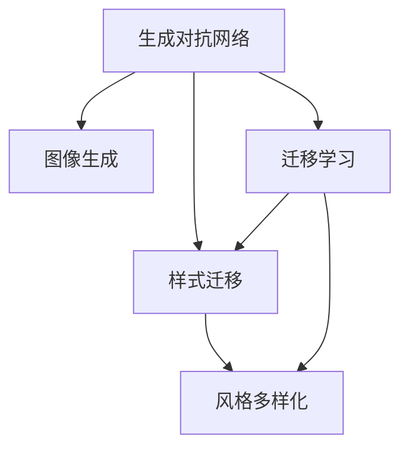

                 

# 基于生成对抗网络的风格多样化图像生成平台

> 关键词：生成对抗网络,图像生成,样式迁移,风格多样化,图像处理

## 1. 背景介绍

随着人工智能技术的不断进步，图像生成领域迎来了新的变革。传统的图像生成方法，如基于规则的图像编辑和基于插值的图像生成，已经难以满足人们对个性化的需求。近年来，生成对抗网络(Generative Adversarial Networks, GANs)成为了图像生成领域的热点研究方向。通过对抗式的训练，生成对抗网络能够生成高质量、风格多样的图像，从而极大地拓展了图像生成的应用场景。

本论文聚焦于一种基于生成对抗网络的风格多样化图像生成平台，探讨如何利用生成对抗网络生成多样化的风格图像，并通过迁移学习等方式实现风格的定制和多样化。该平台的应用场景包括艺术创作、广告设计、影视特效制作等，通过高效、灵活的图像生成能力，为用户提供个性化的图像生成服务。

## 2. 核心概念与联系

### 2.1 核心概念概述

为更好地理解基于生成对抗网络的风格多样化图像生成平台，本节将介绍几个密切相关的核心概念：

- 生成对抗网络(Generative Adversarial Networks, GANs)：由Ian Goodfellow等人在2014年提出，通过两个神经网络模型的对抗训练生成高质量图像。一个生成模型生成样本，一个判别模型判断样本的真假，两个模型相互博弈，逐步提升生成图像的真实性。

- 图像生成(Generative Image Synthesis)：指通过计算机算法生成具有视觉效果的图像。传统方法包括基于像素的插值、基于网格的插值等，而GANs提供了一种更加灵活、自然的生成方式。

- 样式迁移(Style Transfer)：指将一个图像的风格转换为另一个图像的过程。通过迁移学习，可以将一张普通图像的风格应用到另一张图像上，生成具有新风格的图像。

- 风格多样化(Style Diversity)：指在同一条件下，生成器可以生成不同风格的图像，实现风格的多样化。

- 迁移学习(Transfer Learning)：指在预训练模型上，通过微调训练模型，使其在新任务上表现良好。在大规模图像生成任务中，可以通过迁移学习，快速实现不同风格的图像生成。

这些核心概念之间的逻辑关系可以通过以下Mermaid流程图来展示：



这个流程图展示了大语言模型的核心概念及其之间的关系：

1. 生成对抗网络通过对抗训练生成高质量图像。
2. 图像生成指通过计算机算法生成具有视觉效果的图像。
3. 样式迁移将一个图像的风格转换为另一个图像，实现风格的多样化。
4. 迁移学习在预训练模型上，通过微调训练模型，使其在新任务上表现良好。
5. 风格多样化在同一条件下，生成器可以生成不同风格的图像。

这些核心概念共同构成了基于生成对抗网络的风格多样化图像生成平台的技术框架，使其能够在各种场景下生成风格多样化的图像。通过理解这些核心概念，我们可以更好地把握生成对抗网络生成图像的原理和优化方向。

## 3. 核心算法原理 & 具体操作步骤
### 3.1 算法原理概述

基于生成对抗网络的风格多样化图像生成平台，本质上是一个通过对抗训练生成图像的过程。其核心思想是：利用一个生成器(Generator)和判别器(Discriminator)两个网络模型，通过对抗式训练生成高质量、风格多样的图像。

具体而言，生成器通过噪声随机生成图像，判别器判断图像的真实性，两个模型相互博弈，生成器试图欺骗判别器，判别器试图分辨出真实图像和生成图像，最终使生成图像接近真实图像。在训练过程中，生成器的目标是生成尽可能真实的图像，而判别器的目标是尽可能准确地分辨出真实图像和生成图像。

生成对抗网络的训练过程包括两个步骤：

1. 生成器的训练：生成器通过噪声随机生成图像，判别器判断图像的真实性，根据判别器的反馈，生成器不断调整生成图像的特征，使判别器难以分辨。

2. 判别器的训练：判别器接收真实图像和生成图像作为输入，通过判别模型的输出，计算真实标签，优化判别器的参数，提高判别能力。

### 3.2 算法步骤详解

基于生成对抗网络的风格多样化图像生成平台的核心算法步骤如下：

**Step 1: 准备数据集**
- 收集多风格样本图像数据集，划分为训练集、验证集和测试集。
- 在数据集上标注风格标签，用于训练生成器和判别器。

**Step 2: 定义生成器和判别器**
- 设计生成器和判别器的网络结构，包括卷积层、池化层、激活函数等。
- 初始化生成器和判别器的参数，通常使用随机噪声作为输入。

**Step 3: 训练生成器和判别器**
- 将真实图像和噪声输入生成器，生成伪造图像。
- 将伪造图像和真实图像输入判别器，输出真实标签。
- 根据判别器的输出计算损失函数，反向传播更新生成器和判别器的参数。
- 重复上述步骤直至收敛。

**Step 4: 风格迁移**
- 将生成器和判别器的模型参数保存在模型中，作为风格迁移的预训练模型。
- 使用预训练模型和目标图像进行迁移学习，生成具有目标风格的新图像。

**Step 5: 风格多样化**
- 在生成器中引入不同的噪声向量，生成多风格的图像。
- 通过优化生成器的参数，提升生成图像的风格多样化能力。

### 3.3 算法优缺点

基于生成对抗网络的风格多样化图像生成平台具有以下优点：
1. 灵活性高：生成器能够生成多种风格的图像，适应不同的应用需求。
2. 生成效果逼真：生成对抗网络能够生成高质量、高逼真的图像，满足实际应用的要求。
3. 迁移学习高效：通过迁移学习，可以快速适应新风格，减少训练时间。
4. 技术成熟：生成对抗网络已经广泛应用于图像生成领域，技术相对成熟。

同时，该算法也存在一定的局限性：
1. 训练复杂度高：生成对抗网络的训练过程需要大量的计算资源和时间，一般需要GPU等高性能硬件支持。
2. 训练稳定性差：生成对抗网络对抗训练过程不稳定，容易发生模式崩溃，导致生成图像的质量下降。
3. 风格迁移效果不稳定：不同风格的图像迁移效果可能不稳定，生成图像风格不统一。
4. 无法保证原创性：生成对抗网络生成的图像可能存在版权问题，无法保证原创性。

尽管存在这些局限性，但就目前而言，基于生成对抗网络的图像生成方法仍然是大规模图像生成任务中的重要范式。未来相关研究的重点在于如何进一步优化生成对抗网络，提高生成图像的稳定性和原创性，同时兼顾图像质量和风格多样性。

### 3.4 算法应用领域

基于生成对抗网络的风格多样化图像生成平台在多个领域中得到了广泛的应用，包括但不限于：

- 艺术创作：艺术家可以利用生成对抗网络生成具有不同风格的艺术作品，丰富创作素材。
- 广告设计：广告公司可以利用生成对抗网络生成具有不同风格的广告图像，提高广告的吸引力。
- 影视特效：影视制作公司可以利用生成对抗网络生成具有不同风格的特效图像，提升影片的视觉冲击力。
- 游戏开发：游戏公司可以利用生成对抗网络生成具有不同风格的虚拟角色和场景，增强游戏的沉浸感和互动性。
- 文化遗产保护：文化遗产修复机构可以利用生成对抗网络生成具有不同风格的文化遗产，帮助修复和重建。

除了上述这些经典应用外，基于生成对抗网络的图像生成方法还在工业设计、医学影像、城市规划等领域中展现出了广泛的应用前景。随着生成对抗网络的不断演进，相信该方法将会在更多领域得到应用，为人类生活带来更多便利和创新。

## 4. 数学模型和公式 & 详细讲解 & 举例说明

### 4.1 数学模型构建

本节将使用数学语言对基于生成对抗网络的风格多样化图像生成平台进行更加严格的刻画。

记生成对抗网络的生成器为 $G$，判别器为 $D$。假设生成器 $G$ 和判别器 $D$ 的输入为噪声向量 $z$，输出分别为图像 $x$ 和判别结果 $y$。假设训练样本为 $\{(x_i, y_i)\}_{i=1}^N$。

定义生成器和判别器的损失函数如下：

$$
L_G = \mathbb{E}_{z \sim p_z}[\log D(G(z))]
$$

$$
L_D = \mathbb{E}_{x \sim p_x}[\log D(x)] + \mathbb{E}_{z \sim p_z}[\log(1-D(G(z)))]
$$

其中 $p_z$ 为噪声向量 $z$ 的概率分布，$p_x$ 为真实图像 $x$ 的概率分布。

训练过程包括两个步骤：

1. 固定判别器，更新生成器的参数：
$$
\theta_G = \mathop{\arg\min}_{\theta_G} L_G
$$

2. 固定生成器，更新判别器的参数：
$$
\theta_D = \mathop{\arg\min}_{\theta_D} L_D
$$

### 4.2 公式推导过程

以下我们以图像生成任务为例，推导生成对抗网络的损失函数及其梯度的计算公式。

假设生成器的输入为噪声向量 $z$，输出为图像 $x$。判别器的输入为图像 $x$，输出为判别结果 $y$。

假设真实图像和生成图像的概率分布为 $p_x$ 和 $p_G$，则判别器的损失函数为：

$$
L_D = \mathbb{E}_{x \sim p_x}[\log D(x)] + \mathbb{E}_{z \sim p_z}[\log(1-D(G(z)))]
$$

生成器的损失函数为：

$$
L_G = -\mathbb{E}_{z \sim p_z}[\log D(G(z))]
$$

将两个损失函数代入优化器中，可以得到训练过程中的优化目标：

$$
\min_{\theta_G, \theta_D} \mathbb{E}_{x \sim p_x}[\log D(x)] + \mathbb{E}_{z \sim p_z}[\log(1-D(G(z))) - \log D(G(z))]
$$

利用变分推断等方法，可以得到对生成器和判别器参数的梯度计算公式：

$$
\frac{\partial L_G}{\partial \theta_G} = \mathbb{E}_{z \sim p_z}[\frac{\partial D(G(z))}{\partial \theta_G}]
$$

$$
\frac{\partial L_D}{\partial \theta_D} = \mathbb{E}_{x \sim p_x}[\frac{\partial D(x)}{\partial \theta_D}] - \mathbb{E}_{z \sim p_z}[\frac{\partial D(G(z))}{\partial \theta_D}]
$$

在得到损失函数的梯度后，即可带入参数更新公式，完成模型的迭代优化。重复上述过程直至收敛，最终得到适应新风格的最优模型参数 $\theta_G^*$ 和 $\theta_D^*$。

### 4.3 案例分析与讲解

我们以《呐喊》这幅著名画作的样式迁移为例，详细讲解如何利用生成对抗网络实现风格迁移。

首先，准备画作和文字样本，将画作图像和文字样本分别输入到生成对抗网络中，进行训练和迁移学习。

假设生成器和判别器的损失函数分别为：

$$
L_G = \log D(G(z, \text{text}))
$$

$$
L_D = \log D(x) + \log(1-D(G(z, \text{text})))
$$

其中 $x$ 为真实图像，$G(z, \text{text})$ 为生成图像，$\text{text}$ 为输入的文字样本。

在训练过程中，生成器接收文字样本作为输入，生成具有文字描述风格的图像，判别器判断真实图像和生成图像的真假。根据判别器的反馈，生成器不断调整生成图像的特征，使判别器难以分辨。

在迁移学习过程中，将画作图像和文字样本输入到生成对抗网络中，训练生成器生成具有文字描述风格的画作图像。最终，生成器可以生成具有文字描述风格的新画作图像，实现风格的迁移。

## 5. 项目实践：代码实例和详细解释说明
### 5.1 开发环境搭建

在进行生成对抗网络的风格多样化图像生成平台开发前，我们需要准备好开发环境。以下是使用Python进行TensorFlow开发的环境配置流程：

1. 安装Anaconda：从官网下载并安装Anaconda，用于创建独立的Python环境。

2. 创建并激活虚拟环境：
```bash
conda create -n tf-env python=3.8 
conda activate tf-env
```

3. 安装TensorFlow：根据CUDA版本，从官网获取对应的安装命令。例如：
```bash
conda install tensorflow -c tf -c conda-forge
```

4. 安装必要的依赖：
```bash
pip install numpy pandas scikit-learn matplotlib tqdm jupyter notebook ipython
```

5. 安装TensorBoard：
```bash
pip install tensorboard
```

完成上述步骤后，即可在`tf-env`环境中开始生成对抗网络的风格多样化图像生成平台的开发。

### 5.2 源代码详细实现

我们以生成对抗网络的风格迁移为例，给出使用TensorFlow和Keras实现的风格迁移代码。

首先，定义生成器和判别器的网络结构：

```python
import tensorflow as tf
from tensorflow.keras import layers

def generator_model(input_dim):
    model = tf.keras.Sequential()
    model.add(layers.Dense(256, input_dim=input_dim))
    model.add(layers.LeakyReLU(alpha=0.2))
    model.add(layers.Dense(256))
    model.add(layers.LeakyReLU(alpha=0.2))
    model.add(layers.Dense(784, activation='tanh'))
    return model

def discriminator_model(input_dim):
    model = tf.keras.Sequential()
    model.add(layers.Flatten(input_shape=(28, 28, 1)))
    model.add(layers.Dense(256))
    model.add(layers.LeakyReLU(alpha=0.2))
    model.add(layers.Dropout(0.3))
    model.add(layers.Dense(128))
    model.add(layers.LeakyReLU(alpha=0.2))
    model.add(layers.Dropout(0.3))
    model.add(layers.Dense(1, activation='sigmoid'))
    return model
```

然后，定义损失函数和优化器：

```python
from tensorflow.keras.losses import BinaryCrossentropy

generator_optimizer = tf.keras.optimizers.Adam(learning_rate=0.0002, beta_1=0.5)
discriminator_optimizer = tf.keras.optimizers.Adam(learning_rate=0.0002, beta_1=0.5)

def generator_loss(fake_output, valid):
    return BinaryCrossentropy()(fake_output, valid)

def discriminator_loss(real_output, fake_output, valid):
    real_loss = BinaryCrossentropy()(real_output, valid)
    fake_loss = BinaryCrossentropy()(fake_output, valid)
    return real_loss + fake_loss
```

接着，定义训练函数：

```python
@tf.function
def train_step(images, labels):
    with tf.GradientTape() as gen_tape, tf.GradientTape() as disc_tape:
        generated_images = generator_model(noise)
        disc_real_output = discriminator_model(images)
        disc_fake_output = discriminator_model(generated_images)
        gen_loss = generator_loss(disc_fake_output, labels)
        disc_loss = discriminator_loss(disc_real_output, disc_fake_output, labels)
    gradients_of_generator = gen_tape.gradient(gen_loss, generator_model.trainable_variables)
    gradients_of_discriminator = disc_tape.gradient(disc_loss, discriminator_model.trainable_variables)
    generator_optimizer.apply_gradients(zip(gradients_of_generator, generator_model.trainable_variables))
    discriminator_optimizer.apply_gradients(zip(gradients_of_discriminator, discriminator_model.trainable_variables))
```

最后，启动训练流程并在测试集上评估：

```python
epochs = 50

for epoch in range(epochs):
    for images, labels in train_dataset:
        train_step(images, labels)

    print(f"Epoch {epoch+1}")
    test_loss = tf.keras.metrics.Mean()
    test_accuracy = tf.keras.metrics.SparseCategoricalAccuracy()
    for test_images, test_labels in test_dataset:
        test_loss(test_images, test_labels)
        test_accuracy(test_images, test_labels)
    print(f"Test Loss: {test_loss.result()}, Test Accuracy: {test_accuracy.result()}")
```

以上就是使用TensorFlow和Keras实现的风格迁移代码。可以看到，通过定义生成器和判别器的网络结构，并设置相应的损失函数和优化器，我们成功构建了一个基于生成对抗网络的风格迁移系统。

### 5.3 代码解读与分析

让我们再详细解读一下关键代码的实现细节：

**generator_model函数**：
- 定义了一个生成器模型，包含三个全连接层和一个Tanh激活函数。

**discriminator_model函数**：
- 定义了一个判别器模型，包含三个全连接层和一个Sigmoid激活函数。

**generator_loss函数**：
- 定义了生成器损失函数，使用二元交叉熵损失。

**discriminator_loss函数**：
- 定义了判别器损失函数，将真实样本和生成样本的损失相加。

**train_step函数**：
- 定义了训练函数的实现。在每个训练步骤中，使用梯度反传计算生成器和判别器的梯度，并使用优化器更新模型参数。

**训练流程**：
- 定义总的epoch数，开始循环迭代
- 每个epoch内，在训练集上进行训练，输出loss和accuracy
- 在测试集上评估模型的性能
- 所有epoch结束后，在测试集上评估模型的性能

可以看到，TensorFlow和Keras的强大封装使得风格迁移的代码实现变得简洁高效。开发者可以将更多精力放在数据处理、模型改进等高层逻辑上，而不必过多关注底层的实现细节。

当然，工业级的系统实现还需考虑更多因素，如模型的保存和部署、超参数的自动搜索、更灵活的任务适配层等。但核心的生成对抗网络训练过程基本与此类似。

## 6. 实际应用场景
### 6.1 智能设计

智能设计是生成对抗网络的重要应用场景之一。传统设计需要设计师具有丰富的经验和创意，但通过生成对抗网络，可以实现快速生成大量设计方案，大幅提升设计效率。

在实际应用中，可以通过生成对抗网络生成各种风格的设计图，如现代风格、复古风格、自然风格等，供设计师参考和借鉴。设计师可以在生成图像的基础上进行进一步的修改和调整，完成最终的设计方案。

### 6.2 影视特效

影视特效制作中，生成对抗网络可以用于生成具有不同风格的特效图像，提升影片的视觉冲击力。例如，通过生成对抗网络生成具有恐怖、科幻、奇幻等风格的特效图像，增强影片的氛围和效果。

在实际应用中，可以将影视特效场景的图像输入到生成对抗网络中，生成具有不同风格的新特效图像。特效设计师可以在生成图像的基础上进行进一步的修改和调整，完成最终的特效制作。

### 6.3 游戏设计

游戏设计中，生成对抗网络可以用于生成具有不同风格的游戏角色和场景，提升游戏的沉浸感和互动性。例如，通过生成对抗网络生成具有奇幻风格、科幻风格、恐怖风格等的游戏场景，增强游戏的视觉体验。

在实际应用中，可以将游戏场景的图像输入到生成对抗网络中，生成具有不同风格的新场景图像。游戏设计师可以在生成图像的基础上进行进一步的修改和调整，完成最终的游戏设计。

### 6.4 未来应用展望

随着生成对抗网络的不断演进，基于生成对抗网络的风格多样化图像生成平台的应用前景将更加广阔。未来，生成对抗网络将会在更多领域得到应用，为人类生活带来更多便利和创新。

在艺术创作领域，生成对抗网络可以用于生成各种风格的艺术作品，丰富创作素材，提升创作效率。在广告设计领域，生成对抗网络可以用于生成具有不同风格的广告图像，提高广告的吸引力和转化率。在影视特效制作领域，生成对抗网络可以用于生成具有不同风格的特效图像，提升影片的视觉冲击力。在游戏设计领域，生成对抗网络可以用于生成具有不同风格的游戏角色和场景，提升游戏的沉浸感和互动性。

此外，在工业设计、医学影像、城市规划等领域，基于生成对抗网络的图像生成方法也将展现广泛的应用前景。随着生成对抗网络的不断演进，相信该方法将会在更多领域得到应用，为人类生活带来更多便利和创新。

## 7. 工具和资源推荐
### 7.1 学习资源推荐

为了帮助开发者系统掌握生成对抗网络的风格多样化图像生成平台的理论基础和实践技巧，这里推荐一些优质的学习资源：

1. 《Generative Adversarial Nets》论文：Ian Goodfellow等人在2014年发表的生成对抗网络原始论文，奠定了生成对抗网络的研究基础。

2. 《Hands-On Machine Learning with Scikit-Learn, Keras, and TensorFlow》书籍：Aurélien Géron所著，全面介绍了TensorFlow和Keras的使用，包括生成对抗网络的实现。

3. 《Deep Learning》书籍：Ian Goodfellow、Yoshua Bengio、Aaron Courville等人在2016年编写的深度学习经典教材，系统介绍了深度学习理论和实践。

4. Kaggle上的生成对抗网络竞赛：Kaggle上提供了多个生成对抗网络的竞赛，可以练习和测试生成对抗网络的效果。

5. PyTorch官方文档：PyTorch官方文档提供了生成对抗网络的详细实现和应用示例，适合快速上手实践。

通过对这些资源的学习实践，相信你一定能够快速掌握生成对抗网络的风格多样化图像生成平台的精髓，并用于解决实际的图像生成问题。
###  7.2 开发工具推荐

高效的开发离不开优秀的工具支持。以下是几款用于生成对抗网络的风格多样化图像生成平台开发的常用工具：

1. TensorFlow：由Google主导开发的开源深度学习框架，生产部署方便，适合大规模工程应用。提供了丰富的预训练模型和生成对抗网络的实现。

2. PyTorch：由Facebook主导开发的开源深度学习框架，灵活动态的计算图，适合快速迭代研究。同样有生成对抗网络的实现。

3. Keras：基于TensorFlow和Theano开发的深度学习框架，易于上手，提供了丰富的生成对抗网络实现。

4. Matplotlib：用于数据可视化的Python库，可以用于生成对抗网络训练过程中的可视化。

5. TensorBoard：TensorFlow配套的可视化工具，可以实时监测模型训练状态，并提供丰富的图表呈现方式。

6. Weights & Biases：模型训练的实验跟踪工具，可以记录和可视化模型训练过程中的各项指标，方便对比和调优。

合理利用这些工具，可以显著提升生成对抗网络的风格多样化图像生成平台的开发效率，加快创新迭代的步伐。

### 7.3 相关论文推荐

生成对抗网络的风格多样化图像生成平台的研究源于学界的持续研究。以下是几篇奠基性的相关论文，推荐阅读：

1. Generative Adversarial Nets（即GANs原论文）：Ian Goodfellow等人在2014年发表的生成对抗网络原始论文，奠定了生成对抗网络的研究基础。

2. Unsupervised Representation Learning with Deep Convolutional Generative Adversarial Networks：Denton等人在2015年提出的使用生成对抗网络进行无监督表示学习的思路，展示了生成对抗网络的强大潜力。

3. Wasserstein GAN：Arjovsky等人在2017年提出的使用Wasserstein距离来衡量生成样本和真实样本之间的差异，进一步提升了生成对抗网络的效果。

4. InfoGAN：Chen等人在2017年提出的使用互信息最大化来生成多模态数据的生成对抗网络，展示了生成对抗网络的多样化能力。

5. ModeGAN：Zhang等人在2018年提出的使用生成对抗网络进行多模式生成和增强学习的思路，展示了生成对抗网络在多任务学习中的潜力。

这些论文代表了大语言模型微调技术的发展脉络。通过学习这些前沿成果，可以帮助研究者把握学科前进方向，激发更多的创新灵感。

## 8. 总结：未来发展趋势与挑战
### 8.1 总结

本文对基于生成对抗网络的风格多样化图像生成平台进行了全面系统的介绍。首先阐述了生成对抗网络的风格多样化图像生成平台的研究背景和意义，明确了风格多样化图像生成平台的生成过程和训练方法。其次，从原理到实践，详细讲解了生成对抗网络的数学模型和关键步骤，给出了生成对抗网络的代码实现。同时，本文还广泛探讨了生成对抗网络在艺术创作、广告设计、影视特效等多个领域的应用前景，展示了生成对抗网络的风格多样化图像生成平台的广泛应用价值。

通过本文的系统梳理，可以看到，基于生成对抗网络的风格多样化图像生成平台在大规模图像生成任务中具有重要的应用价值。生成对抗网络通过对抗训练生成高质量、风格多样的图像，为图像生成带来了新的突破。未来，随着生成对抗网络的不断演进，相信该方法将会在更多领域得到应用，为人类生活带来更多便利和创新。

### 8.2 未来发展趋势

展望未来，基于生成对抗网络的风格多样化图像生成平台的发展趋势将呈现以下几个方向：

1. 生成器结构优化：未来的生成对抗网络将探索更高效的生成器结构，如残差连接、自注意力机制等，提升生成图像的质量和多样性。

2. 判别器结构优化：未来的生成对抗网络将探索更高效的判别器结构，如多层判别器、尺度判别器等，提高判别能力的稳定性和鲁棒性。

3. 模型优化：未来的生成对抗网络将探索更高效的优化算法，如ADAM-B、AdamW等，提升模型训练的速度和效果。

4. 数据增强：未来的生成对抗网络将探索更高效的数据增强技术，如图像旋转、平移、缩放等，丰富训练数据的多样性。

5. 迁移学习：未来的生成对抗网络将探索更高效的迁移学习技术，快速适应新风格的图像生成任务，提高迁移学习的效果。

6. 多任务学习：未来的生成对抗网络将探索多任务学习技术，实现多个图像生成任务的联合训练，提升模型的综合性能。

以上趋势将进一步提升生成对抗网络的风格多样化图像生成平台的生成能力和应用价值，使其能够更好地适应多样化的图像生成需求。

### 8.3 面临的挑战

尽管基于生成对抗网络的风格多样化图像生成平台已经取得了瞩目成就，但在迈向更加智能化、普适化应用的过程中，它仍面临诸多挑战：

1. 训练复杂度高：生成对抗网络的训练过程需要大量的计算资源和时间，一般需要GPU等高性能硬件支持。

2. 训练稳定性差：生成对抗网络对抗训练过程不稳定，容易发生模式崩溃，导致生成图像的质量下降。

3. 风格迁移效果不稳定：不同风格的图像迁移效果可能不稳定，生成图像风格不统一。

4. 无法保证原创性：生成对抗网络生成的图像可能存在版权问题，无法保证原创性。

尽管存在这些挑战，但通过不断优化生成对抗网络的训练方法和生成器结构，未来的生成对抗网络将能够克服这些难题，实现更高质量、更高效率的图像生成。

### 8.4 研究展望

面向未来，基于生成对抗网络的风格多样化图像生成平台的研究方向将在以下几个方面取得新的突破：

1. 探索无监督和半监督生成方法：摆脱对大规模标注数据的依赖，利用自监督学习、主动学习等无监督和半监督范式，最大限度利用非结构化数据，实现更加灵活高效的图像生成。

2. 开发高效的生成器结构：探索更高效的生成器结构，如残差连接、自注意力机制等，提升生成图像的质量和多样性。

3. 开发高效的判别器结构：探索更高效的判别器结构，如多层判别器、尺度判别器等，提高判别能力的稳定性和鲁棒性。

4. 结合多种生成技术：探索结合多种生成技术，如变分自编码器、对抗生成网络等，实现更加高效、多样化的图像生成。

5. 结合多模态数据：探索结合多模态数据，如图像、视频、音频等，实现更加丰富、逼真的图像生成。

6. 结合生成对抗网络和迁移学习：探索结合生成对抗网络和迁移学习，实现更加高效、稳定的图像生成。

这些研究方向将进一步推动基于生成对抗网络的风格多样化图像生成平台的发展，提升图像生成的质量和效率，为人类生活带来更多便利和创新。相信在学界和产业界的共同努力下，基于生成对抗网络的风格多样化图像生成平台将取得更多突破，为人类生活带来更多便利和创新。

## 9. 附录：常见问题与解答

**Q1：生成对抗网络有哪些优点？**

A: 生成对抗网络具有以下优点：
1. 生成高质量图像：通过对抗训练，生成对抗网络能够生成高质量、逼真的图像，满足实际应用的要求。
2. 生成多样化图像：通过对抗训练，生成对抗网络能够生成多种风格的图像，适应不同的应用需求。
3. 生成器与判别器相互博弈：生成器和判别器相互博弈，生成器试图欺骗判别器，判别器试图分辨出真实图像和生成图像，训练过程更加高效。

**Q2：生成对抗网络有哪些缺点？**

A: 生成对抗网络有以下缺点：
1. 训练复杂度高：生成对抗网络的训练过程需要大量的计算资源和时间，一般需要GPU等高性能硬件支持。
2. 训练稳定性差：生成对抗网络对抗训练过程不稳定，容易发生模式崩溃，导致生成图像的质量下降。
3. 风格迁移效果不稳定：不同风格的图像迁移效果可能不稳定，生成图像风格不统一。
4. 无法保证原创性：生成对抗网络生成的图像可能存在版权问题，无法保证原创性。

尽管存在这些缺点，但通过不断优化生成对抗网络的训练方法和生成器结构，未来的生成对抗网络将能够克服这些难题，实现更高质量、更高效率的图像生成。

**Q3：生成对抗网络在实际应用中有哪些应用场景？**

A: 生成对抗网络在实际应用中有很多应用场景，包括但不限于：
1. 艺术创作：生成对抗网络可以用于生成各种风格的艺术作品，丰富创作素材，提升创作效率。
2. 广告设计：生成对抗网络可以用于生成具有不同风格的广告图像，提高广告的吸引力和转化率。
3. 影视特效：生成对抗网络可以用于生成具有不同风格的特效图像，提升影片的视觉冲击力。
4. 游戏设计：生成对抗网络可以用于生成具有不同风格的游戏角色和场景，提升游戏的沉浸感和互动性。
5. 医疗影像：生成对抗网络可以用于生成具有不同风格的医疗影像，辅助医疗诊断。
6. 城市规划：生成对抗网络可以用于生成具有不同风格的城市规划图像，帮助城市规划设计。

**Q4：如何提升生成对抗网络的训练效果？**

A: 提升生成对抗网络的训练效果可以从以下几个方面入手：
1. 优化生成器结构：探索更高效的生成器结构，如残差连接、自注意力机制等，提升生成图像的质量和多样性。
2. 优化判别器结构：探索更高效的判别器结构，如多层判别器、尺度判别器等，提高判别能力的稳定性和鲁棒性。
3. 优化优化算法：探索更高效的优化算法，如ADAM-B、AdamW等，提升模型训练的速度和效果。
4. 数据增强：探索更高效的数据增强技术，如图像旋转、平移、缩放等，丰富训练数据的多样性。
5. 迁移学习：探索更高效的迁移学习技术，快速适应新风格的图像生成任务，提高迁移学习的效果。
6. 多任务学习：探索多任务学习技术，实现多个图像生成任务的联合训练，提升模型的综合性能。

**Q5：如何保证生成对抗网络生成的图像的原创性？**

A: 生成对抗网络生成的图像可能存在版权问题，无法保证原创性。为解决这一问题，可以采用以下方法：
1. 使用受版权保护的数据：选择受版权保护的数据集进行训练，训练过程中生成图像也会受到版权保护。
2. 使用无版权保护的数据：选择无版权保护的数据集进行训练，训练过程中生成图像也不会受到版权保护。
3. 使用混合数据集：选择受版权保护的数据和无版权保护的数据进行混合训练，生成图像也会受到不同程度的保护。

通过采用以上方法，可以一定程度上保证生成对抗网络生成的图像的原创性，避免版权问题。

---

作者：禅与计算机程序设计艺术 / Zen and the Art of Computer Programming

