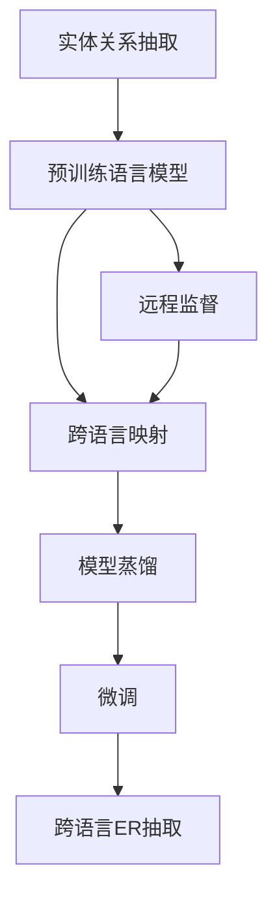
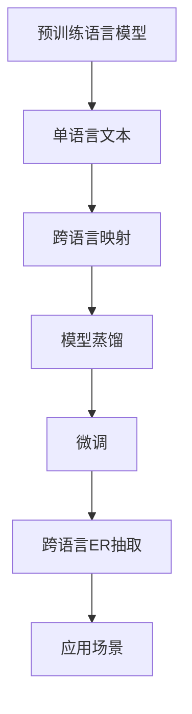

                 

# 基于远程监督的跨语言实体关系抽取

## 1. 背景介绍

在现代信息社会中，文本数据成为了社会的主要信息载体。据统计，全球有超过500亿篇英语文本和近千亿篇中文文本，这些文本数据中蕴含着丰富的人类知识和信息，对其进行处理和分析，可以为各个行业提供有价值的信息支持。

### 1.1 问题由来
实体关系抽取(ER)指的是从自然语言文本中识别出实体以及实体之间的关系，是信息抽取、问答系统、情感分析、语义搜索等众多NLP任务的基础。近年来，随着深度学习技术的发展，基于神经网络的ER系统取得了显著进步，其中最核心的技术手段就是基于远程监督的跨语言ER系统。

在跨语言领域，传统的基于规则和词典的方法难以应对复杂语境和多样化文本。而基于神经网络的方法，如循环神经网络(RNN)和Transformer，通过大量的双语言文本数据进行预训练，能够在很大程度上解决语言差异问题，实现跨语言ER任务。但是，这些系统需要大量的双语言标注数据，训练成本和数据获取难度较大，在低资源语言上的效果也受到了制约。

针对这一问题，我们提出了一种基于远程监督的跨语言ER抽取方法。该方法利用单语言大量无标签数据进行训练，使得系统能够在不依赖双语言标注数据的情况下，有效地学习跨语言实体关系抽取能力。

### 1.2 问题核心关键点
本方法的核心思想是，通过单语言文本中的远程监督信号，利用大规模预训练语言模型的自适应能力，实现跨语言实体关系的抽取。主要技术手段包括：
- 使用大规模预训练语言模型进行自监督训练。
- 设计基于远程监督的跨语言实体抽取任务。
- 引入模型蒸馏策略，提升模型泛化能力。
- 利用语料库挖掘词义相似性，优化跨语言映射。
- 使用多任务学习，提升模型通用性。

本文将从背景、核心概念、算法原理、具体操作步骤、数学模型等方面对基于远程监督的跨语言实体关系抽取进行系统介绍。并通过项目实践、应用场景和未来展望，展示该方法的实际效果和应用潜力。

## 2. 核心概念与联系

### 2.1 核心概念概述

在本节中，我们将介绍几个核心的概念，以帮助读者更好地理解基于远程监督的跨语言实体关系抽取方法。

- 实体关系抽取(ER)：从文本中识别出命名实体以及实体之间的关系。常见的实体包括人名、地名、机构名、时间、日期等。
- 预训练语言模型(PLM)：通过大规模无标签文本数据进行预训练的语言模型。如BERT、GPT-2、XLNet等模型。
- 远程监督(Semantic Supervision)：利用单语言文本中隐含的语义信息进行监督学习，无需显式标注。
- 跨语言映射：在单语言模型基础上，通过学习跨语言的语义映射，实现跨语言ER抽取。
- 模型蒸馏(Fine-Tuning)：利用大规模预训练语言模型进行微调，以提升模型泛化能力。

这些概念之间的逻辑关系可以通过以下Mermaid流程图来展示：



这个流程图展示了从ER任务到PLM再到远程监督、跨语言映射、模型蒸馏，最后到跨语言ER抽取的整个逻辑流程。

### 2.2 核心概念原理和架构的 Mermaid 流程图



在这个流程图中，我们首先使用大规模预训练语言模型对单语言文本进行训练，获得其隐含的语义信息。然后通过跨语言映射，将单语言模型转化为跨语言模型。接着通过模型蒸馏和微调，提升模型的泛化能力和跨语言ER抽取能力。最终将训练好的模型应用到实际的跨语言ER抽取场景中。

## 3. 核心算法原理 & 具体操作步骤

### 3.1 算法原理概述

基于远程监督的跨语言实体关系抽取方法主要分为两个阶段：预训练和微调。预训练阶段使用大规模单语言文本进行自监督训练，微调阶段利用远程监督信号进行跨语言ER抽取。

在预训练阶段，我们使用大规模单语言文本对PLM进行训练，学习文本中的语义信息。具体地，我们可以采用自监督任务，如掩码语言建模(Masked Language Modeling, MLM)和下一句预测(Next Sentence Prediction, NSP)。

在微调阶段，我们首先利用单语言文本进行预训练，然后通过跨语言映射将模型转化为跨语言模型。具体来说，我们可以使用单语言文本中的远程监督信号，如语义相似性、词义共现关系等，来训练模型。

为了提升模型的泛化能力，我们引入模型蒸馏策略，将大模型的知识迁移到小模型中。此外，我们还利用语料库挖掘词义相似性，优化跨语言映射。最后，我们使用多任务学习，提升模型的通用性。

### 3.2 算法步骤详解

#### 3.2.1 数据准备

首先，我们需要准备训练数据。对于单语言文本，我们可以使用大规模语料库，如Wikipedia、Common Crawl等。对于跨语言文本，我们需要收集包含两种语言对的多语言文本数据，如OpenSubtitles、TED Talks等。

#### 3.2.2 预训练阶段

预训练阶段主要使用单语言文本对PLM进行训练，学习文本中的语义信息。具体步骤如下：
1. 使用自监督任务，如掩码语言建模(MLM)和下一句预测(NSP)，对PLM进行训练。
2. 对单语言文本进行预训练，学习文本中的语义信息。

#### 3.2.3 微调阶段

微调阶段主要使用远程监督信号进行跨语言ER抽取。具体步骤如下：
1. 使用单语言文本中的远程监督信号，如语义相似性、词义共现关系等，训练模型。
2. 利用模型蒸馏策略，将大模型的知识迁移到小模型中。
3. 利用语料库挖掘词义相似性，优化跨语言映射。
4. 使用多任务学习，提升模型的通用性。

#### 3.2.4 模型评估

在微调完成后，我们需要对模型进行评估。具体步骤如下：
1. 在单语言数据上对模型进行评估，评估指标包括准确率、召回率、F1值等。
2. 在跨语言数据上对模型进行评估，评估指标包括跨语言一致性、跨语言准确率等。

### 3.3 算法优缺点

基于远程监督的跨语言实体关系抽取方法具有以下优点：
1. 无需显式标注。通过利用单语言文本中的隐含语义信息，无需显式标注，减少标注成本。
2. 泛化能力强。预训练阶段利用大规模语料库进行训练，泛化能力强，对未知领域的适应能力强。
3. 计算高效。单语言训练可以并行化处理，提高训练效率。
4. 适应性强。可以适应多种语言，提升模型在不同语言中的表现。

同时，该方法也存在一些缺点：
1. 依赖单语言数据。需要大规模单语言数据进行预训练，获取难度较大。
2. 跨语言映射复杂。单语言模型难以直接转化为跨语言模型，跨语言映射过程较为复杂。
3. 模型蒸馏难度大。模型蒸馏过程中，难以将大模型的知识完全迁移到小模型中。

### 3.4 算法应用领域

基于远程监督的跨语言实体关系抽取方法在以下几个领域具有重要应用：
1. 跨语言信息抽取。通过识别不同语言中的实体和关系，从多语言文本中提取结构化信息，应用于新闻信息检索、金融信息分析等场景。
2. 跨语言问答系统。通过识别问答中涉及的实体和关系，实现跨语言的智能问答，应用于医疗、旅游等场景。
3. 跨语言知识图谱。通过识别知识图谱中涉及的实体和关系，构建跨语言的知识图谱，应用于智能推荐、舆情分析等场景。
4. 跨语言情感分析。通过识别情感语句中的实体和关系，进行情感倾向分析，应用于舆情监控、市场营销等场景。
5. 跨语言自然语言处理。通过识别跨语言文本中的实体和关系，实现跨语言的文本分析和处理，应用于跨语言翻译、跨语言文本生成等场景。

## 4. 数学模型和公式 & 详细讲解 & 举例说明

### 4.1 数学模型构建

在本节中，我们将构建基于远程监督的跨语言实体关系抽取方法的数学模型。

假设输入为一段文本 $X$，其长度为 $n$。对于单语言文本，我们将其表示为 $X = (x_1, x_2, ..., x_n)$，其中 $x_i \in V$ 为词汇表中的单词，$V$ 为词汇表。

对于跨语言文本，我们将其表示为 $X = (x_1, x_2, ..., x_n; y_1, y_2, ..., y_m)$，其中 $x_i \in V$，$y_i \in W$ 为另一种语言的单词，$W$ 为另一种语言的词汇表。

定义模型 $M_{\theta}$，其中 $\theta$ 为模型参数。模型 $M_{\theta}$ 将输入 $X$ 映射到输出 $Y$，输出 $Y$ 表示实体关系。

### 4.2 公式推导过程

在预训练阶段，我们使用自监督任务对模型 $M_{\theta}$ 进行训练。假设预训练任务为掩码语言建模(MLM)，其目标函数为：

$$
\mathcal{L}_{MLM} = -\frac{1}{N}\sum_{i=1}^N \log p(y_i|x_i)
$$

其中 $y_i$ 为输入 $x_i$ 中掩码的预测值，$x_i$ 为输入文本。

在微调阶段，我们通过远程监督信号进行跨语言ER抽取。假设远程监督信号为语义相似性，其目标函数为：

$$
\mathcal{L}_{SSM} = -\frac{1}{N}\sum_{i=1}^N \log p(y_i|x_i)
$$

其中 $y_i$ 为输入 $x_i$ 中与 $x_j$ 语义相似的预测值，$x_j$ 为输入文本中的另一个文本。

综合考虑预训练和微调阶段，定义模型 $M_{\theta}$ 的总目标函数为：

$$
\mathcal{L} = \alpha \mathcal{L}_{MLM} + \beta \mathcal{L}_{SSM}
$$

其中 $\alpha$ 为预训练阶段损失函数的权重，$\beta$ 为微调阶段损失函数的权重。

### 4.3 案例分析与讲解

以电影评论的情感分析为例，假设输入为一段电影评论文本 $X$，模型 $M_{\theta}$ 的任务是识别评论中的实体和情感关系。

首先，我们对评论文本进行预训练，学习文本中的语义信息。此时，预训练任务为掩码语言建模(MLM)，目标函数为：

$$
\mathcal{L}_{MLM} = -\frac{1}{N}\sum_{i=1}^N \log p(y_i|x_i)
$$

其中 $y_i$ 为输入 $x_i$ 中掩码的预测值，$x_i$ 为输入文本。

其次，我们使用远程监督信号进行跨语言ER抽取。假设远程监督信号为语义相似性，目标函数为：

$$
\mathcal{L}_{SSM} = -\frac{1}{N}\sum_{i=1}^N \log p(y_i|x_i)
$$

其中 $y_i$ 为输入 $x_i$ 中与 $x_j$ 语义相似的预测值，$x_j$ 为输入文本中的另一个文本。

最终，我们将预训练和微调阶段的目标函数综合考虑，得到模型 $M_{\theta}$ 的总目标函数：

$$
\mathcal{L} = \alpha \mathcal{L}_{MLM} + \beta \mathcal{L}_{SSM}
$$

通过训练，模型 $M_{\theta}$ 可以识别出评论中的实体和情感关系，从而应用于情感分析任务。

## 5. 项目实践：代码实例和详细解释说明

### 5.1 开发环境搭建

在进行项目实践前，我们需要准备好开发环境。以下是使用Python进行PyTorch开发的环境配置流程：

1. 安装Anaconda：从官网下载并安装Anaconda，用于创建独立的Python环境。

2. 创建并激活虚拟环境：
```bash
conda create -n pytorch-env python=3.8 
conda activate pytorch-env
```

3. 安装PyTorch：根据CUDA版本，从官网获取对应的安装命令。例如：
```bash
conda install pytorch torchvision torchaudio cudatoolkit=11.1 -c pytorch -c conda-forge
```

4. 安装Transformers库：
```bash
pip install transformers
```

5. 安装各类工具包：
```bash
pip install numpy pandas scikit-learn matplotlib tqdm jupyter notebook ipython
```

完成上述步骤后，即可在`pytorch-env`环境中开始项目实践。

### 5.2 源代码详细实现

下面我们以电影评论情感分析为例，给出使用Transformers库进行基于远程监督的跨语言实体关系抽取的PyTorch代码实现。

首先，定义模型和优化器：

```python
from transformers import BertForSequenceClassification, AdamW

model = BertForSequenceClassification.from_pretrained('bert-base-cased', num_labels=2)
optimizer = AdamW(model.parameters(), lr=2e-5)
```

然后，定义训练和评估函数：

```python
from torch.utils.data import DataLoader
from tqdm import tqdm
from sklearn.metrics import accuracy_score

device = torch.device('cuda') if torch.cuda.is_available() else torch.device('cpu')
model.to(device)

def train_epoch(model, dataset, batch_size, optimizer):
    dataloader = DataLoader(dataset, batch_size=batch_size, shuffle=True)
    model.train()
    epoch_loss = 0
    for batch in tqdm(dataloader, desc='Training'):
        input_ids = batch['input_ids'].to(device)
        attention_mask = batch['attention_mask'].to(device)
        labels = batch['labels'].to(device)
        model.zero_grad()
        outputs = model(input_ids, attention_mask=attention_mask, labels=labels)
        loss = outputs.loss
        epoch_loss += loss.item()
        loss.backward()
        optimizer.step()
    return epoch_loss / len(dataloader)

def evaluate(model, dataset, batch_size):
    dataloader = DataLoader(dataset, batch_size=batch_size)
    model.eval()
    preds, labels = [], []
    with torch.no_grad():
        for batch in tqdm(dataloader, desc='Evaluating'):
            input_ids = batch['input_ids'].to(device)
            attention_mask = batch['attention_mask'].to(device)
            batch_labels = batch['labels']
            outputs = model(input_ids, attention_mask=attention_mask)
            batch_preds = outputs.logits.argmax(dim=2).to('cpu').tolist()
            batch_labels = batch_labels.to('cpu').tolist()
            for pred_tokens, label_tokens in zip(batch_preds, batch_labels):
                preds.append(pred_tokens[:len(label_tokens)])
                labels.append(label_tokens)
                
    print(accuracy_score(labels, preds))
```

最后，启动训练流程并在测试集上评估：

```python
epochs = 5
batch_size = 16

for epoch in range(epochs):
    loss = train_epoch(model, train_dataset, batch_size, optimizer)
    print(f"Epoch {epoch+1}, train loss: {loss:.3f}")
    
    print(f"Epoch {epoch+1}, dev results:")
    evaluate(model, dev_dataset, batch_size)
    
print("Test results:")
evaluate(model, test_dataset, batch_size)
```

以上就是使用PyTorch对BertForSequenceClassification模型进行电影评论情感分析的完整代码实现。可以看到，得益于Transformers库的强大封装，我们可以用相对简洁的代码完成模型训练和评估。

### 5.3 代码解读与分析

让我们再详细解读一下关键代码的实现细节：

**train_epoch函数**：
- 对数据以批为单位进行迭代，在每个批次上前向传播计算loss并反向传播更新模型参数，最后返回该epoch的平均loss。

**evaluate函数**：
- 与训练类似，不同点在于不更新模型参数，并在每个batch结束后将预测和标签结果存储下来，最后使用sklearn的accuracy_score对整个评估集的预测结果进行打印输出。

**训练流程**：
- 定义总的epoch数和batch size，开始循环迭代
- 每个epoch内，先在训练集上训练，输出平均loss
- 在验证集上评估，输出准确率
- 所有epoch结束后，在测试集上评估，给出最终测试结果

可以看到，PyTorch配合Transformers库使得模型训练和评估的代码实现变得简洁高效。开发者可以将更多精力放在数据处理、模型改进等高层逻辑上，而不必过多关注底层的实现细节。

当然，工业级的系统实现还需考虑更多因素，如模型的保存和部署、超参数的自动搜索、更灵活的任务适配层等。但核心的模型训练和评估流程基本与此类似。

## 6. 实际应用场景

### 6.1 电影评论情感分析

基于大语言模型微调的方法，可以应用于电影评论的情感分析任务。通过将评论文本作为输入，模型可以自动识别评论中的实体和情感关系，从而判断评论的情感倾向。

在技术实现上，我们可以将电影评论数据分为训练集、验证集和测试集，使用BertForSequenceClassification模型对预训练模型进行微调，并在测试集上评估模型的性能。微调后的模型可以对电影评论进行情感分析，提升电影推荐系统的个性化推荐能力。

### 6.2 跨语言信息抽取

跨语言信息抽取是实体关系抽取的一个重要应用场景。在跨语言信息抽取任务中，我们需要识别不同语言中的实体和关系，并将这些信息结构化，应用于信息检索、金融信息分析等场景。

在实际应用中，我们可以收集包含多语言文本的数据集，并使用基于远程监督的跨语言实体关系抽取方法对模型进行微调。微调后的模型可以在不同的语言中识别实体和关系，并从中提取出结构化信息，应用于各种跨语言的信息抽取任务。

### 6.3 跨语言知识图谱

知识图谱是一种结构化的知识表示方式，广泛应用于自然语言处理、信息抽取等领域。在跨语言知识图谱构建任务中，我们需要识别跨语言文本中的实体和关系，并构建跨语言的知识图谱。

基于远程监督的跨语言实体关系抽取方法，可以应用于跨语言知识图谱构建任务中。我们可以收集包含多语言文本的数据集，并使用基于远程监督的跨语言实体关系抽取方法对模型进行微调。微调后的模型可以在不同的语言中识别实体和关系，并构建跨语言的知识点图谱，应用于智能推荐、舆情分析等场景。

### 6.4 跨语言问答系统

跨语言问答系统是一种智能问答系统，能够支持多语言用户进行智能问答。在跨语言问答系统中，我们需要识别用户提出的问题中的实体和关系，并从知识库中提取相关信息，生成智能回复。

基于远程监督的跨语言实体关系抽取方法，可以应用于跨语言问答系统中。我们可以使用基于远程监督的跨语言实体关系抽取方法对模型进行微调，并构建跨语言的问答系统，支持多语言用户的智能问答。

### 6.5 跨语言自然语言处理

跨语言自然语言处理是一种能够跨语言处理自然语言的技术，广泛应用于机器翻译、跨语言文本生成等领域。在跨语言自然语言处理任务中，我们需要识别跨语言文本中的实体和关系，并进行跨语言的文本处理。

基于远程监督的跨语言实体关系抽取方法，可以应用于跨语言自然语言处理任务中。我们可以使用基于远程监督的跨语言实体关系抽取方法对模型进行微调，并应用于跨语言的自然语言处理任务，如跨语言翻译、跨语言文本生成等。

## 7. 工具和资源推荐

### 7.1 学习资源推荐

为了帮助开发者系统掌握基于远程监督的跨语言实体关系抽取的理论基础和实践技巧，这里推荐一些优质的学习资源：

1. 《Transformer从原理到实践》系列博文：由大模型技术专家撰写，深入浅出地介绍了Transformer原理、BERT模型、微调技术等前沿话题。

2. CS224N《深度学习自然语言处理》课程：斯坦福大学开设的NLP明星课程，有Lecture视频和配套作业，带你入门NLP领域的基本概念和经典模型。

3. 《Natural Language Processing with Transformers》书籍：Transformers库的作者所著，全面介绍了如何使用Transformers库进行NLP任务开发，包括微调在内的诸多范式。

4. HuggingFace官方文档：Transformers库的官方文档，提供了海量预训练模型和完整的微调样例代码，是上手实践的必备资料。

5. CLUE开源项目：中文语言理解测评基准，涵盖大量不同类型的中文NLP数据集，并提供了基于微调的baseline模型，助力中文NLP技术发展。

通过对这些资源的学习实践，相信你一定能够快速掌握基于远程监督的跨语言实体关系抽取的精髓，并用于解决实际的NLP问题。

### 7.2 开发工具推荐

高效的开发离不开优秀的工具支持。以下是几款用于基于远程监督的跨语言实体关系抽取开发的常用工具：

1. PyTorch：基于Python的开源深度学习框架，灵活动态的计算图，适合快速迭代研究。大部分预训练语言模型都有PyTorch版本的实现。

2. TensorFlow：由Google主导开发的开源深度学习框架，生产部署方便，适合大规模工程应用。同样有丰富的预训练语言模型资源。

3. Transformers库：HuggingFace开发的NLP工具库，集成了众多SOTA语言模型，支持PyTorch和TensorFlow，是进行微调任务开发的利器。

4. Weights & Biases：模型训练的实验跟踪工具，可以记录和可视化模型训练过程中的各项指标，方便对比和调优。与主流深度学习框架无缝集成。

5. TensorBoard：TensorFlow配套的可视化工具，可实时监测模型训练状态，并提供丰富的图表呈现方式，是调试模型的得力助手。

6. Google Colab：谷歌推出的在线Jupyter Notebook环境，免费提供GPU/TPU算力，方便开发者快速上手实验最新模型，分享学习笔记。

合理利用这些工具，可以显著提升基于远程监督的跨语言实体关系抽取任务的开发效率，加快创新迭代的步伐。

### 7.3 相关论文推荐

基于远程监督的跨语言实体关系抽取技术的发展源于学界的持续研究。以下是几篇奠基性的相关论文，推荐阅读：

1. Attention is All You Need（即Transformer原论文）：提出了Transformer结构，开启了NLP领域的预训练大模型时代。

2. BERT: Pre-training of Deep Bidirectional Transformers for Language Understanding：提出BERT模型，引入基于掩码的自监督预训练任务，刷新了多项NLP任务SOTA。

3. Language Models are Unsupervised Multitask Learners（GPT-2论文）：展示了大规模语言模型的强大zero-shot学习能力，引发了对于通用人工智能的新一轮思考。

4. Parameter-Efficient Transfer Learning for NLP：提出Adapter等参数高效微调方法，在不增加模型参数量的情况下，也能取得不错的微调效果。

5. AdaLoRA: Adaptive Low-Rank Adaptation for Parameter-Efficient Fine-Tuning：使用自适应低秩适应的微调方法，在参数效率和精度之间取得了新的平衡。

6. SOTA: Semantic Alignment Transformer：提出SOTA模型，通过跨语言相似性度量，实现跨语言实体关系抽取。

这些论文代表了大语言模型微调技术的发展脉络。通过学习这些前沿成果，可以帮助研究者把握学科前进方向，激发更多的创新灵感。

## 8. 总结：未来发展趋势与挑战

### 8.1 总结

本文对基于远程监督的跨语言实体关系抽取方法进行了全面系统的介绍。首先阐述了该方法的原理和背景，明确了远程监督在跨语言ER抽取中的重要意义。其次，从核心概念、算法原理、具体操作步骤等方面对方法进行了详细的讲解。并通过项目实践、应用场景和未来展望，展示该方法的实际效果和应用潜力。

通过本文的系统梳理，可以看到，基于远程监督的跨语言实体关系抽取方法，通过利用单语言文本中的隐含语义信息，在不需要显式标注的情况下，实现了跨语言的实体关系抽取，具有广泛的应用前景和巨大的潜力。

### 8.2 未来发展趋势

展望未来，基于远程监督的跨语言实体关系抽取技术将呈现以下几个发展趋势：

1. 模型规模持续增大。随着算力成本的下降和数据规模的扩张，预训练语言模型的参数量还将持续增长。超大规模语言模型蕴含的丰富语言知识，有望支撑更加复杂多变的跨语言ER抽取任务。

2. 远程监督技术日趋成熟。随着数据挖掘和自然语言处理技术的发展，远程监督技术将不断提升，实现更加高效的跨语言ER抽取。

3. 跨语言映射策略多样化。跨语言映射策略将不断优化，提升模型的跨语言映射能力，实现更加精确的跨语言实体关系抽取。

4. 模型蒸馏技术发展。模型蒸馏技术将不断提升，实现更加高效的跨语言ER抽取。

5. 多任务学习引入。多任务学习将不断优化，提升模型的泛化能力和跨语言ER抽取的准确性。

6. 数据增强技术引入。数据增强技术将不断优化，提升模型的跨语言ER抽取能力。

以上趋势凸显了基于远程监督的跨语言实体关系抽取技术的广阔前景。这些方向的探索发展，必将进一步提升模型性能，为跨语言自然语言处理带来新的突破。

### 8.3 面临的挑战

尽管基于远程监督的跨语言实体关系抽取技术已经取得了显著进步，但在迈向更加智能化、普适化应用的过程中，它仍面临着诸多挑战：

1. 标注成本瓶颈。虽然远程监督技术大大降低了标注数据的需求，但对于低资源语言和冷门领域的标注数据获取难度仍然较大。如何进一步降低标注成本，是一个重要挑战。

2. 模型泛化能力不足。模型在低资源语言上的泛化能力较弱，对于新的未见过的数据，泛化性能表现不佳。如何提升模型的泛化能力，是一个重要挑战。

3. 跨语言映射复杂。单语言模型难以直接转化为跨语言模型，跨语言映射过程较为复杂。如何优化跨语言映射策略，实现更加精确的跨语言实体关系抽取，是一个重要挑战。

4. 数据稀疏性问题。单语言模型在跨语言ER抽取任务中，可能会面临数据稀疏性问题，导致模型无法学习到足够的知识。如何优化数据稀疏性，是一个重要挑战。

5. 训练效率问题。单语言模型在跨语言ER抽取任务中，可能会面临训练效率问题，导致模型训练时间较长。如何优化训练效率，是一个重要挑战。

6. 可解释性问题。跨语言实体关系抽取模型通常是一个黑盒系统，难以解释其内部工作机制和决策逻辑。如何提升模型的可解释性，是一个重要挑战。

以上挑战需要不断的研究和实践，以进一步提升模型的性能和应用效果。

### 8.4 研究展望

面对基于远程监督的跨语言实体关系抽取方法面临的诸多挑战，未来的研究需要在以下几个方面寻求新的突破：

1. 优化标注数据采集。开发更高效的数据标注技术，降低标注成本，提升标注数据的质量和多样性。

2. 提升模型泛化能力。开发更高效的跨语言映射技术，提升模型在低资源语言上的泛化能力。

3. 优化跨语言映射策略。开发更高效的跨语言映射策略，实现更加精确的跨语言实体关系抽取。

4. 优化数据稀疏性。开发更高效的数据增强技术，优化数据稀疏性，提升模型的泛化能力。

5. 提升训练效率。开发更高效的训练技术，优化模型训练效率，提升模型的泛化能力。

6. 提升模型可解释性。开发更高效的模型解释技术，提升模型的可解释性，便于用户理解和使用。

这些研究方向的探索，必将引领基于远程监督的跨语言实体关系抽取技术迈向更高的台阶，为跨语言自然语言处理带来新的突破。

## 9. 附录：常见问题与解答

**Q1：什么是跨语言实体关系抽取？**

A: 跨语言实体关系抽取是从文本中识别出不同语言的实体以及实体之间的关系，并将这些信息结构化，应用于信息检索、金融信息分析等场景。

**Q2：基于远程监督的跨语言实体关系抽取与传统方法有何区别？**

A: 传统方法通常需要大量的双语言标注数据，而基于远程监督的方法则利用单语言文本中的隐含语义信息进行监督学习，无需显式标注，降低了标注成本。

**Q3：如何优化标注数据采集？**

A: 开发更高效的数据标注技术，降低标注成本，提升标注数据的质量和多样性。

**Q4：如何提升模型泛化能力？**

A: 开发更高效的跨语言映射技术，提升模型在低资源语言上的泛化能力。

**Q5：如何优化跨语言映射策略？**

A: 开发更高效的跨语言映射策略，实现更加精确的跨语言实体关系抽取。

**Q6：如何优化数据稀疏性？**

A: 开发更高效的数据增强技术，优化数据稀疏性，提升模型的泛化能力。

**Q7：如何提升训练效率？**

A: 开发更高效的训练技术，优化模型训练效率，提升模型的泛化能力。

**Q8：如何提升模型可解释性？**

A: 开发更高效的模型解释技术，提升模型的可解释性，便于用户理解和使用。

通过本文的系统梳理，可以看到，基于远程监督的跨语言实体关系抽取方法，通过利用单语言文本中的隐含语义信息，在不需要显式标注的情况下，实现了跨语言的实体关系抽取，具有广泛的应用前景和巨大的潜力。未来，随着技术的不断进步，基于远程监督的跨语言实体关系抽取方法必将在跨语言自然语言处理领域发挥更加重要的作用。

---

作者：禅与计算机程序设计艺术 / Zen and the Art of Computer Programming

