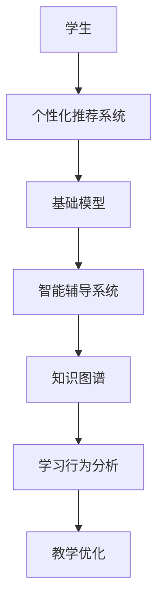

                 

# 基础模型在教育中的应用前景

> 关键词：教育技术,基础模型,个性化推荐,智能辅导系统,知识图谱

## 1. 背景介绍

### 1.1 问题由来

教育是社会进步的基石，但传统的教育方式长期以来效率低下、资源浪费严重。随着科技的迅猛发展，信息技术特别是人工智能(AI)技术正在逐步改变教育模式，基础模型的应用为教育技术带来了新机遇。通过利用深度学习等先进技术，实现智能化的教学、辅导、评估等功能，使教育资源得到更充分的利用，同时也能提供更为个性化的学习体验。

### 1.2 问题核心关键点

基础模型在教育中的应用主要体现在以下几个方面：

- 个性化推荐系统：利用基础模型分析学生的学习行为和兴趣，推荐适合的学习内容和资源，提高学习效率。
- 智能辅导系统：结合基础模型和自然语言处理技术，提供即时解答学生疑问，辅助教师教学，提升教育质量。
- 知识图谱：构建知识图谱，帮助学生建立知识体系，强化知识点间的关联，加深理解。

这些技术的应用使得教育资源更为均衡、个性化教学成为可能，同时也对教育技术提出了更高的要求。如何在满足教育场景需要的同时，提高模型的泛化能力和鲁棒性，是教育技术研究和应用中亟需解决的问题。

### 1.3 问题研究意义

基础模型在教育中的应用，对于教育事业的发展具有重要意义：

- 提升教学效果：通过智能推荐和智能辅导，提升学生的学习效率和质量，实现个性化教育。
- 优化资源配置：基础模型能更合理地分配教育资源，使资源利用更高效。
- 促进教育公平：帮助欠发达地区获取优质教育资源，缩小城乡教育差距。
- 激发创新思维：基础模型和教育技术的结合，为学生提供更加多样化的学习途径，激发创新和创造力。

## 2. 核心概念与联系

### 2.1 核心概念概述

为更好地理解基础模型在教育中的应用，我们首先介绍几个关键概念：

- 基础模型(Base Model)：指在预训练和微调过程中获得的通用语言模型，如BERT、GPT等。
- 个性化推荐系统：基于用户行为数据，通过分析预测其感兴趣内容并推荐给用户。
- 智能辅导系统：结合自然语言处理技术，自动解答学生疑问，辅助教师教学。
- 知识图谱(Knowledge Graph)：一种语义网结构，用于存储知识、表示概念和实体间关系。
- 学习行为分析：通过数据挖掘和学习分析技术，揭示学生学习行为规律，指导教学优化。

这些概念通过一系列的技术手段和方法，共同构建了一个以学生为中心、智能化的学习生态系统。

### 2.2 核心概念原理和架构的 Mermaid 流程图



这个流程图展示了基础模型在教育应用中的主要流程：

1. 学生输入学习需求，个性化推荐系统通过基础模型分析学生的兴趣，推荐适合的资源和内容。
2. 学生在学习过程中遇到问题，智能辅导系统自动解答，辅助教学。
3. 智能辅导系统通过基础模型分析学生问题，在知识图谱中查找相关知识，进一步解释解答。
4. 学习行为分析收集学生学习数据，基础模型进行行为分析，生成学习路径和建议，优化教学过程。

这些概念间的联系和互动，共同驱动了教育技术的不断进步和创新。

## 3. 核心算法原理 & 具体操作步骤
### 3.1 算法原理概述

基础模型在教育中的应用，主要依赖于深度学习中的推荐系统、自然语言处理和知识图谱等技术。以下是其主要算法原理：

- 个性化推荐系统：基于协同过滤、矩阵分解、深度学习等技术，构建推荐模型，通过基础模型对用户行为和兴趣进行预测，实现个性化推荐。
- 智能辅导系统：利用自然语言处理技术，将学生的提问转化为结构化问题，通过基础模型进行语义分析，在知识图谱中查找答案，生成回答。
- 知识图谱：构建由节点和边组成的网络结构，表示概念和实体间的语义关系，基础模型可以对其进行嵌入学习，方便后续的检索和推理。
- 学习行为分析：收集学生学习数据，通过基础模型进行模式识别和行为分析，生成学习路径和个性化建议，优化教学过程。

### 3.2 算法步骤详解

以下是基础模型在教育应用中几个关键算法的详细步骤：

**个性化推荐算法**：
1. 数据收集：收集学生的学习行为数据，如浏览记录、点击历史等。
2. 预处理：对数据进行清洗、归一化等处理。
3. 构建用户-物品关联矩阵：将学生的行为转化为用户-物品矩阵，利用协同过滤或矩阵分解方法计算用户对每个物品的兴趣度。
4. 嵌入学习：利用基础模型对物品进行嵌入学习，得到高维向量表示。
5. 推荐计算：基于用户兴趣度和物品向量，计算推荐结果。

**智能辅导算法**：
1. 语义分析：收集学生的提问，通过基础模型进行分词、命名实体识别、意图识别等语义分析。
2. 知识图谱检索：在知识图谱中查找相关概念和实体，构建问题解答图。
3. 生成回答：通过基础模型进行语义生成，生成自然语言回答。

**知识图谱构建算法**：
1. 数据收集：收集领域内实体、属性、关系等知识。
2. 实体识别：利用自然语言处理技术，自动从文本中识别实体。
3. 关系抽取：通过规则、深度学习等方法抽取实体间的关系。
4. 知识图谱嵌入：利用基础模型对知识图谱进行嵌入学习，生成稠密表示。
5. 知识推理：通过基础模型在知识图谱上进行推理，生成结论。

**学习行为分析算法**：
1. 数据收集：收集学生的学习数据，如学习时间、学习路径等。
2. 行为模式识别：利用基础模型对行为数据进行聚类、分类等模式识别。
3. 路径生成：根据识别出的模式，生成个性化的学习路径和建议。
4. 教学优化：基于生成路径和建议，调整教学内容、时间安排等，优化教学过程。

### 3.3 算法优缺点

基础模型在教育中的算法有以下优缺点：

**优点**：
1. 个性化推荐系统：通过基础模型分析用户行为，实现高度个性化的推荐，提高学习效率。
2. 智能辅导系统：利用自然语言处理技术，即时解答学生疑问，提升教学质量。
3. 知识图谱：通过基础模型嵌入知识，实现高效的知识检索和推理。
4. 学习行为分析：通过基础模型分析学习数据，优化教学过程，提升教学效果。

**缺点**：
1. 数据隐私问题：收集和分析学生学习数据可能涉及隐私问题，需严格控制数据使用。
2. 模型复杂度：基础模型结构复杂，计算量大，需高性能计算资源支持。
3. 泛化能力：基础模型在特定领域的数据上可能表现不佳，泛化能力有待提高。
4. 公平性问题：模型训练和应用可能存在偏见，需关注公平性问题。

### 3.4 算法应用领域

基础模型在教育中的应用，广泛覆盖了以下领域：

- 智能推荐：为学生推荐适合的课程、习题、阅读材料等。
- 智能辅导：提供自动化的答疑服务，辅助学生解决学习中的难题。
- 知识管理：通过知识图谱构建和嵌入学习，帮助学生掌握知识点间的关联。
- 教学优化：根据学生学习行为数据，优化教学方法和内容，提升教学效果。

这些应用极大地提升了教育资源的利用效率，同时也为学生提供了更加个性化、智能化的学习体验。

## 4. 数学模型和公式 & 详细讲解 & 举例说明
### 4.1 数学模型构建

基础模型在教育应用中，常使用深度学习中的推荐系统、自然语言处理和知识图谱等技术。下面以推荐系统为例，介绍其数学模型构建过程：

**协同过滤推荐模型**：
1. 用户-物品矩阵 $R$：
$$
R_{i,j} \in \{0,1\}, R_{i,j}=1 \Leftrightarrow \text{用户 }i\text{ 对物品 }j\text{ 感兴趣}
$$
2. 用户兴趣向量 $u_i$ 和物品特征向量 $v_j$：
$$
u_i \in \mathbb{R}^n, v_j \in \mathbb{R}^m, R \approx uv^T
$$
3. 用户对物品的预测兴趣度 $p_{i,j}$：
$$
p_{i,j} = u_i^T V^{-1} v_j
$$
其中 $V$ 为物品特征向量的协方差矩阵。

**基于深度学习的推荐模型**：
1. 用户-物品矩阵 $R$：
$$
R_{i,j} \in \{0,1\}, R_{i,j}=1 \Leftrightarrow \text{用户 }i\text{ 对物品 }j\text{ 感兴趣}
$$
2. 用户嵌入向量 $u_i$ 和物品嵌入向量 $v_j$：
$$
u_i \in \mathbb{R}^n, v_j \in \mathbb{R}^n
$$
3. 用户对物品的预测兴趣度 $p_{i,j}$：
$$
p_{i,j} = u_i^T v_j
$$

**知识图谱嵌入模型**：
1. 实体-关系-实体三元组 $E$：
$$
E = (e_i, r, e_j)
$$
2. 实体向量 $e_i$ 和关系向量 $r$：
$$
e_i \in \mathbb{R}^n, r \in \mathbb{R}^n
$$
3. 实体之间的关系 $r_{ij}$：
$$
r_{ij} = e_i^T r e_j
$$

### 4.2 公式推导过程

**协同过滤推荐模型的推导**：
1. 用户兴趣向量 $u_i$ 和物品特征向量 $v_j$：
$$
u_i = \sum_{k=1}^n \alpha_k x_{i,k}, v_j = \sum_{k=1}^m \beta_k y_{j,k}
$$
2. 用户对物品的预测兴趣度 $p_{i,j}$：
$$
p_{i,j} = u_i^T V^{-1} v_j = \sum_{k=1}^n \sum_{l=1}^m \alpha_k \beta_l x_{i,k} y_{j,l}
$$
3. 目标函数：
$$
\min_{\alpha, \beta} \frac{1}{2} \sum_{i,j} (p_{i,j} - r_{i,j})^2
$$

**基于深度学习的推荐模型的推导**：
1. 用户嵌入向量 $u_i$ 和物品嵌入向量 $v_j$：
$$
u_i = W_u^T h_i, v_j = W_v^T h_j
$$
2. 用户对物品的预测兴趣度 $p_{i,j}$：
$$
p_{i,j} = u_i^T v_j = (W_u^T h_i)^T (W_v^T h_j)
$$
3. 目标函数：
$$
\min_{W_u, W_v} \frac{1}{2} \sum_{i,j} (p_{i,j} - r_{i,j})^2
$$

**知识图谱嵌入模型的推导**：
1. 实体向量 $e_i$ 和关系向量 $r$：
$$
e_i = W_e^T h_i, r = W_r^T h_r
$$
2. 实体之间的关系 $r_{ij}$：
$$
r_{ij} = e_i^T r e_j = (W_e^T h_i)^T (W_r^T h_r) W_e h_j
$$
3. 目标函数：
$$
\min_{W_e, W_r} \frac{1}{2} \sum_{i,j} (r_{ij} - e_i^T r e_j)^2
$$

### 4.3 案例分析与讲解

**案例1：协同过滤推荐系统**

一个在线教育平台收集了用户对课程的评分数据，利用协同过滤推荐模型为用户推荐感兴趣的课程。设 $R_{i,j}$ 表示用户 $i$ 对课程 $j$ 的评分，通过奇异值分解(SVD)得到用户兴趣向量 $u_i$ 和物品特征向量 $v_j$，最终计算用户对物品的预测评分 $p_{i,j}$，实现个性化推荐。

**案例2：基于深度学习的推荐系统**

一个视频平台收集了用户对视频的观看数据，利用基于深度学习的推荐模型为用户推荐感兴趣的视频。设 $R_{i,j}$ 表示用户 $i$ 对视频 $j$ 的观看次数，通过神经网络模型 $h_i$ 和 $h_j$ 得到用户嵌入向量 $u_i$ 和物品嵌入向量 $v_j$，最终计算用户对物品的预测评分 $p_{i,j}$，实现个性化推荐。

**案例3：知识图谱嵌入模型**

一个问答平台收集了实体、属性和关系的数据，利用知识图谱嵌入模型为问答系统提供答案。设 $E = (e_i, r, e_j)$ 表示实体-关系-实体三元组，通过神经网络模型 $h_i$ 和 $h_j$ 得到实体向量 $e_i$ 和关系向量 $r$，最终计算实体之间的关系 $r_{ij}$，实现快速检索和推理。

这些案例展示了基础模型在教育应用中的不同应用场景和算法实现，对基础模型在教育中的应用提供了理论和实践的深入理解。

## 5. 项目实践：代码实例和详细解释说明
### 5.1 开发环境搭建

在进行教育技术开发前，需要准备好开发环境。以下是使用Python进行PyTorch开发的环境配置流程：

1. 安装Anaconda：从官网下载并安装Anaconda，用于创建独立的Python环境。

2. 创建并激活虚拟环境：
```bash
conda create -n pytorch-env python=3.8 
conda activate pytorch-env
```

3. 安装PyTorch：根据CUDA版本，从官网获取对应的安装命令。例如：
```bash
conda install pytorch torchvision torchaudio cudatoolkit=11.1 -c pytorch -c conda-forge
```

4. 安装Transformers库：
```bash
pip install transformers
```

5. 安装各类工具包：
```bash
pip install numpy pandas scikit-learn matplotlib tqdm jupyter notebook ipython
```

完成上述步骤后，即可在`pytorch-env`环境中开始教育技术开发。

### 5.2 源代码详细实现

下面我们以推荐系统为例，给出使用Transformers库对基础模型进行推荐系统开发的PyTorch代码实现。

首先，定义推荐系统相关的数据处理函数：

```python
from transformers import BertTokenizer
from torch.utils.data import Dataset
import torch

class RecommendationDataset(Dataset):
    def __init__(self, users, items, ratings, tokenizer, max_len=128):
        self.users = users
        self.items = items
        self.ratings = ratings
        self.tokenizer = tokenizer
        self.max_len = max_len
        
    def __len__(self):
        return len(self.users)
    
    def __getitem__(self, item):
        user = self.users[item]
        item = self.items[item]
        rating = self.ratings[item]
        
        user_input = [user] + [item] + [rating]
        encoding = self.tokenizer(user_input, return_tensors='pt', max_length=self.max_len, padding='max_length', truncation=True)
        user_ids = encoding['input_ids'][0]
        item_ids = encoding['input_ids'][1]
        rating_ids = encoding['input_ids'][2]
        
        return {'user_ids': user_ids,
                'item_ids': item_ids,
                'rating_ids': rating_ids}

# 加载用户、物品、评分数据
users = ['user1', 'user2', 'user3']
items = ['item1', 'item2', 'item3']
ratings = [4, 5, 3]
tokenizer = BertTokenizer.from_pretrained('bert-base-cased')

recommendation_dataset = RecommendationDataset(users, items, ratings, tokenizer)
```

然后，定义模型和优化器：

```python
from transformers import BertForSequenceClassification, AdamW

model = BertForSequenceClassification.from_pretrained('bert-base-cased', num_labels=3)

optimizer = AdamW(model.parameters(), lr=2e-5)
```

接着，定义训练和评估函数：

```python
from torch.utils.data import DataLoader
from tqdm import tqdm
from sklearn.metrics import roc_auc_score

device = torch.device('cuda') if torch.cuda.is_available() else torch.device('cpu')
model.to(device)

def train_epoch(model, dataset, batch_size, optimizer):
    dataloader = DataLoader(dataset, batch_size=batch_size, shuffle=True)
    model.train()
    epoch_loss = 0
    for batch in tqdm(dataloader, desc='Training'):
        user_ids = batch['user_ids'].to(device)
        item_ids = batch['item_ids'].to(device)
        rating_ids = batch['rating_ids'].to(device)
        model.zero_grad()
        outputs = model(user_ids, item_ids, rating_ids)
        loss = outputs.loss
        epoch_loss += loss.item()
        loss.backward()
        optimizer.step()
    return epoch_loss / len(dataloader)

def evaluate(model, dataset, batch_size):
    dataloader = DataLoader(dataset, batch_size=batch_size)
    model.eval()
    true_labels = []
    pred_labels = []
    with torch.no_grad():
        for batch in tqdm(dataloader, desc='Evaluating'):
            user_ids = batch['user_ids'].to(device)
            item_ids = batch['item_ids'].to(device)
            rating_ids = batch['rating_ids'].to(device)
            outputs = model(user_ids, item_ids, rating_ids)
            batch_pred_labels = outputs.logits.argmax(dim=1).to('cpu').tolist()
            batch_true_labels = rating_ids.to('cpu').tolist()
            for pred_label, true_label in zip(batch_pred_labels, batch_true_labels):
                pred_labels.append(pred_label)
                true_labels.append(true_label)
                
    print(roc_auc_score(true_labels, pred_labels))
```

最后，启动训练流程并在测试集上评估：

```python
epochs = 5
batch_size = 16

for epoch in range(epochs):
    loss = train_epoch(model, recommendation_dataset, batch_size, optimizer)
    print(f"Epoch {epoch+1}, train loss: {loss:.3f}")
    
    print(f"Epoch {epoch+1}, test AUC score:")
    evaluate(model, recommendation_dataset, batch_size)
    
print("Final test AUC score:")
evaluate(model, recommendation_dataset, batch_size)
```

以上就是使用PyTorch对基础模型进行推荐系统开发的完整代码实现。可以看到，得益于Transformers库的强大封装，我们可以用相对简洁的代码完成基础模型的加载和推荐系统的训练。

### 5.3 代码解读与分析

让我们再详细解读一下关键代码的实现细节：

**RecommendationDataset类**：
- `__init__`方法：初始化用户、物品、评分等关键组件。
- `__len__`方法：返回数据集的样本数量。
- `__getitem__`方法：对单个样本进行处理，将用户、物品、评分转换为向量形式，并进行定长padding，最终返回模型所需的输入。

**数据加载与处理**：
- 用户、物品、评分等数据需预处理为合适的形式，如使用列表表示，并利用分词器将字符串转换为向量形式。
- 标签处理：将评分转换为分类标签，如1表示正样本，0表示负样本。

**训练和评估函数**：
- 使用PyTorch的DataLoader对数据集进行批次化加载，供模型训练和推理使用。
- 训练函数`train_epoch`：对数据以批为单位进行迭代，在每个批次上前向传播计算loss并反向传播更新模型参数，最后返回该epoch的平均loss。
- 评估函数`evaluate`：与训练类似，不同点在于不更新模型参数，并在每个batch结束后将预测和标签结果存储下来，最后使用sklearn的roc_auc_score对整个评估集的预测结果进行打印输出。

**训练流程**：
- 定义总的epoch数和batch size，开始循环迭代
- 每个epoch内，先在训练集上训练，输出平均loss
- 在测试集上评估，输出AUC score
- 所有epoch结束后，在测试集上评估，给出最终测试结果

可以看到，PyTorch配合Transformers库使得基础模型的推荐系统开发变得简洁高效。开发者可以将更多精力放在数据处理、模型改进等高层逻辑上，而不必过多关注底层的实现细节。

当然，工业级的系统实现还需考虑更多因素，如模型的保存和部署、超参数的自动搜索、更灵活的任务适配层等。但核心的推荐系统范式基本与此类似。

## 6. 实际应用场景
### 6.1 智能推荐系统

基础模型的智能推荐系统在教育领域有广泛应用，如在线学习平台、在线图书馆、在线课程等。通过分析学生的学习行为和偏好，推荐适合的学习资源和课程，提升学习效率和效果。

**实际应用案例**：
一个在线学习平台收集了学生的学习行为数据，包括观看视频、完成作业、参与讨论等。利用基础模型对数据进行分析，得到学生的学习兴趣和偏好，推荐适合的课程和学习资源。同时，平台还可以根据学生的学习效果和反馈，实时调整推荐策略，提升推荐准确性。

### 6.2 智能辅导系统

基础模型的智能辅导系统可以辅助教师教学，解答学生疑问，提高教学质量。通过自然语言处理技术，将学生的提问转化为结构化问题，在知识图谱中查找答案，生成回答。

**实际应用案例**：
一个在线教育平台集成了智能辅导系统，学生在学习过程中遇到问题，可以通过智能客服系统输入问题，平台自动分析和解答，生成答案。系统还可以记录学生的问题，帮助教师分析教学效果和改进教学方法。

### 6.3 个性化学习路径

基础模型的学习行为分析可以收集学生的学习数据，通过分析生成个性化的学习路径和建议，优化教学过程。根据学生学习行为，调整教学内容和时间安排，提升学习效果。

**实际应用案例**：
一个在线教育平台利用基础模型分析学生的学习行为，生成个性化的学习路径和建议。如根据学生的阅读习惯和时间，推荐适合的书籍和阅读计划；根据学生的薄弱环节，推荐相关的习题和练习。

### 6.4 未来应用展望

未来，基础模型在教育领域的应用将更加广泛和深入，具体方向如下：

1. **自适应学习系统**：结合个性化推荐和智能辅导系统，构建自适应学习系统，根据学生的学习效果和反馈，动态调整学习内容和策略，实现个性化学习。

2. **多模态学习系统**：结合视觉、听觉等多模态数据，构建多模态学习系统，提升学生的学习体验和效果。

3. **智能评测系统**：利用基础模型进行知识图谱嵌入学习，构建智能评测系统，实现自动化的考试和评估。

4. **教育数据挖掘**：利用基础模型对教育数据进行深入挖掘和分析，揭示学习规律和行为模式，指导教学优化。

5. **教育资源优化**：利用基础模型优化教育资源的配置和分配，提升教育资源的利用效率。

6. **教育公平化**：结合基础模型和教育技术，为欠发达地区提供优质教育资源，缩小城乡教育差距。

这些方向的发展，将进一步提升教育技术的智能化水平，为学生提供更加个性化、高效的学习体验，同时也将推动教育事业的公平化、普惠化进程。

## 7. 工具和资源推荐
### 7.1 学习资源推荐

为了帮助开发者系统掌握基础模型在教育中的应用理论基础和实践技巧，这里推荐一些优质的学习资源：

1. 《深度学习基础》系列博文：由深度学习专家撰写，深入浅出地介绍了深度学习的基本概念和常用算法，涵盖推荐系统、自然语言处理、知识图谱等。

2. 《自然语言处理与深度学习》课程：由Coursera等平台开设的NLP课程，涵盖NLP的前沿技术和应用案例，适合入门和进阶学习。

3. 《推荐系统实战》书籍：详细介绍了推荐系统的发展历程和实现方法，结合实际案例，帮助读者掌握推荐系统的构建和优化。

4. 《自然语言处理综述》书籍：全面介绍了NLP的最新进展和前沿技术，适合全面理解NLP的各个方面。

5. 《教育技术前沿》书籍：涵盖教育技术的最新研究和发展方向，结合教育场景，介绍教育技术的应用和前景。

通过对这些资源的学习实践，相信你一定能够快速掌握基础模型在教育应用中的精髓，并用于解决实际的NLP问题。

### 7.2 开发工具推荐

高效的开发离不开优秀的工具支持。以下是几款用于基础模型教育技术开发的常用工具：

1. PyTorch：基于Python的开源深度学习框架，灵活动态的计算图，适合快速迭代研究。

2. TensorFlow：由Google主导开发的开源深度学习框架，生产部署方便，适合大规模工程应用。

3. Transformers库：HuggingFace开发的NLP工具库，集成了众多SOTA语言模型，支持PyTorch和TensorFlow，是进行基础模型开发的重要工具。

4. Weights & Biases：模型训练的实验跟踪工具，可以记录和可视化模型训练过程中的各项指标，方便对比和调优。

5. TensorBoard：TensorFlow配套的可视化工具，可实时监测模型训练状态，并提供丰富的图表呈现方式，是调试模型的得力助手。

6. Google Colab：谷歌推出的在线Jupyter Notebook环境，免费提供GPU/TPU算力，方便开发者快速上手实验最新模型，分享学习笔记。

合理利用这些工具，可以显著提升基础模型在教育技术开发的效率，加快创新迭代的步伐。

### 7.3 相关论文推荐

基础模型在教育中的应用源于学界的持续研究。以下是几篇奠基性的相关论文，推荐阅读：

1. Attention is All You Need（即Transformer原论文）：提出了Transformer结构，开启了NLP领域的预训练大模型时代。

2. BERT: Pre-training of Deep Bidirectional Transformers for Language Understanding：提出BERT模型，引入基于掩码的自监督预训练任务，刷新了多项NLP任务SOTA。

3. Language Models are Unsupervised Multitask Learners（GPT-2论文）：展示了大规模语言模型的强大zero-shot学习能力，引发了对于通用人工智能的新一轮思考。

4. Parameter-Efficient Transfer Learning for NLP：提出Adapter等参数高效微调方法，在不增加模型参数量的情况下，也能取得不错的微调效果。

5. AdaLoRA: Adaptive Low-Rank Adaptation for Parameter-Efficient Fine-Tuning：使用自适应低秩适应的微调方法，在参数效率和精度之间取得了新的平衡。

6. Knowledge-Graph-Based Recommendation System：基于知识图谱的推荐系统，利用图结构进行推荐计算，实现高效的推荐。

这些论文代表了大语言模型在教育中的应用发展脉络。通过学习这些前沿成果，可以帮助研究者把握学科前进方向，激发更多的创新灵感。

## 8. 总结：未来发展趋势与挑战

### 8.1 总结

本文对基础模型在教育中的应用进行了全面系统的介绍。首先阐述了基础模型和教育技术的研究背景和意义，明确了其在个性化推荐、智能辅导、学习行为分析等方面的应用价值。其次，从原理到实践，详细讲解了基础模型在教育应用中的关键算法，给出了推荐系统的完整代码实现。同时，本文还广泛探讨了基础模型在教育领域的应用场景，展示了其在智能推荐、智能辅导、个性化学习路径等方面的应用前景。此外，本文精选了基础模型在教育技术应用的各类学习资源，力求为读者提供全方位的技术指引。

通过本文的系统梳理，可以看到，基础模型在教育中的应用前景广阔，其个性化推荐、智能辅导、知识图谱嵌入等功能为教育技术带来了新的可能性。未来，随着技术的不断进步，基础模型在教育中的应用将更加深入，推动教育事业向智能化、个性化、普惠化的方向发展。

### 8.2 未来发展趋势

展望未来，基础模型在教育中的应用将呈现以下几个发展趋势：

1. **自适应学习系统**：结合个性化推荐和智能辅导系统，构建自适应学习系统，根据学生的学习效果和反馈，动态调整学习内容和策略，实现个性化学习。

2. **多模态学习系统**：结合视觉、听觉等多模态数据，构建多模态学习系统，提升学生的学习体验和效果。

3. **智能评测系统**：利用基础模型进行知识图谱嵌入学习，构建智能评测系统，实现自动化的考试和评估。

4. **教育数据挖掘**：利用基础模型对教育数据进行深入挖掘和分析，揭示学习规律和行为模式，指导教学优化。

5. **教育资源优化**：利用基础模型优化教育资源的配置和分配，提升教育资源的利用效率。

6. **教育公平化**：结合基础模型和教育技术，为欠发达地区提供优质教育资源，缩小城乡教育差距。

这些趋势凸显了基础模型在教育领域的应用潜力，未来将为教育事业带来更深远的影响。

### 8.3 面临的挑战

尽管基础模型在教育中的应用已取得一定进展，但在实际落地过程中，仍面临诸多挑战：

1. **数据隐私问题**：收集和分析学生学习数据可能涉及隐私问题，需严格控制数据使用，保障数据安全。

2. **模型复杂度**：基础模型结构复杂，计算量大，需高性能计算资源支持，难以在小规模硬件上实现。

3. **泛化能力**：基础模型在特定领域的数据上可能表现不佳，泛化能力有待提高。

4. **公平性问题**：模型训练和应用可能存在偏见，需关注公平性问题，避免对特定群体的歧视。

5. **资源配置**：教育资源的优化配置仍需更多研究，需考虑多方面因素，如师资、硬件等。

6. **用户体验**：基础模型在实际应用中，需兼顾用户界面和交互体验，提供友好的用户体验。

这些挑战需要多方共同努力，才能克服技术障碍，实现基础模型在教育中的全面落地。

### 8.4 研究展望

未来，研究基础模型在教育中的应用，可以从以下几个方向进行：

1. **无监督和半监督学习**：探索无监督和半监督学习范式，降低对大规模标注数据的依赖，充分利用非结构化数据，实现更加灵活高效的微调。

2. **参数高效微调**：开发更加参数高效的微调方法，在固定大部分预训练参数的同时，只更新极少量的任务相关参数。

3. **因果推断和博弈论**：引入因果推断和博弈论工具，增强模型决策的因果性和逻辑性，提高系统稳定性。

4. **知识整合**：将符号化的先验知识，如知识图谱、逻辑规则等，与神经网络模型进行巧妙融合，引导微调过程学习更准确、合理的语言模型。

5. **伦理性分析**：在模型训练目标中引入伦理导向的评估指标，过滤和惩罚有偏见、有害的输出倾向，确保模型输出的伦理性。

这些方向的研究将推动基础模型在教育中的深入应用，构建更为安全、可靠、可解释、可控的智能教育系统，助力教育事业的全面提升。

## 9. 附录：常见问题与解答

**Q1：基础模型在教育中的应用是否需要大量标注数据？**

A: 基础模型在教育中的应用，主要依赖于推荐系统、智能辅导和知识图谱嵌入等技术。推荐系统和智能辅导系统通常不需要标注数据，可以通过预训练模型和自然语言处理技术实现。知识图谱嵌入需要少量标注数据进行结构化处理，但数据需求相对较少。因此，基础模型在教育中的应用，对标注数据的依赖相对较小，但也需要根据具体应用场景进行优化。

**Q2：基础模型在教育中的应用是否存在偏见问题？**

A: 基础模型在教育中的应用，需注意模型训练和应用可能存在的偏见问题。例如，推荐系统可能对某些特定群体的推荐较少，智能辅导系统可能对某些话题的回答不够全面。为解决这些问题，可以引入多模态数据、上下文信息等，提升模型的公平性和泛化能力。同时，也需定期监控模型表现，及时调整和优化。

**Q3：基础模型在教育中的应用是否需要高性能计算资源？**

A: 基础模型在教育中的应用，通常需要高性能计算资源进行训练和推理。推荐系统、智能辅导系统和知识图谱嵌入等技术，需对模型进行复杂的训练和推理计算，需使用GPU、TPU等高性能设备。同时，模型也需要考虑优化算法和资源配置，提高计算效率。

**Q4：基础模型在教育中的应用是否需要考虑用户隐私问题？**

A: 基础模型在教育中的应用，需严格控制学生数据的收集和使用，保护学生隐私。可以采用匿名化处理、数据去标识化等技术，避免敏感信息泄露。同时，也需制定严格的数据保护政策，明确数据使用范围和权限。

**Q5：基础模型在教育中的应用是否需要考虑用户交互体验？**

A: 基础模型在教育中的应用，需考虑用户交互体验，提供友好的界面和交互方式。智能推荐系统、智能辅导系统和学习路径优化系统，都需设计直观易用的用户界面，便于用户操作和反馈。同时，也需优化系统响应速度，减少用户等待时间。

这些问答提供了对基础模型在教育应用中的常见问题的深入解读，有助于开发者更好地理解和使用基础模型，推动教育技术的发展。

---

作者：禅与计算机程序设计艺术 / Zen and the Art of Computer Programming

