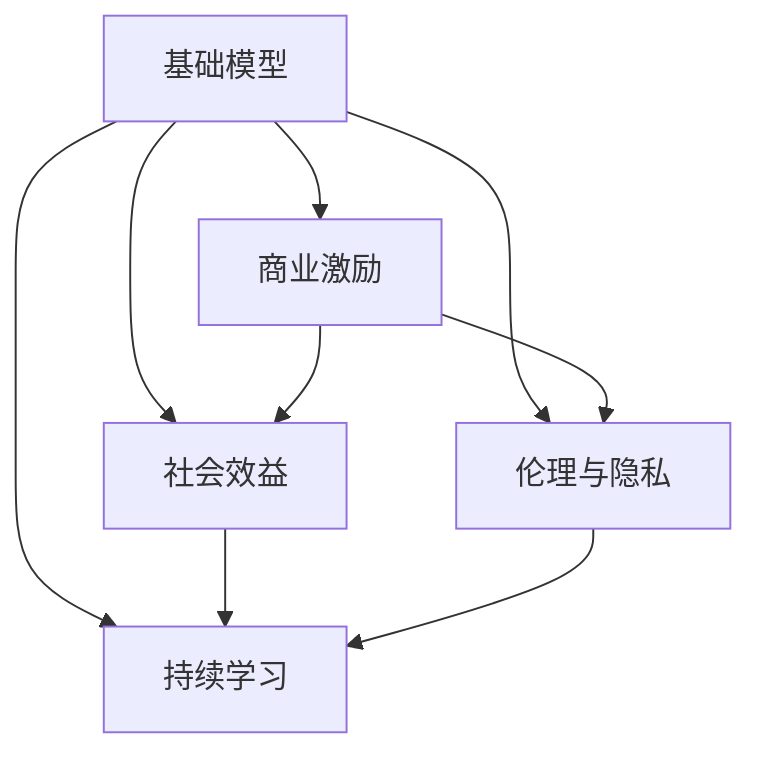

                 

# 基础模型的商业激励与社会效益

在人工智能（AI）领域，基础模型的设计与应用不仅仅是技术问题，更涉及到广泛的商业激励和社会效益。本文将系统探讨基础模型如何在商业与社会的双重视角下发挥作用，旨在为AI技术的可持续发展提供理论依据和实践指导。

## 1. 背景介绍

### 1.1 问题由来
基础模型，即用于解决特定问题或通用任务的关键算法或模型，是AI技术发展的重要基石。其在商业领域的应用如推荐系统、图像识别、自然语言处理等，极大地提高了生产效率和用户体验。同时，在社会领域，基础模型还在医疗、教育、公共安全等多个方面发挥着重要作用，提升了社会治理的智能化水平。

然而，基础模型在商业应用中的激励机制往往复杂多样，商业公司的盈利目标与社会公众的需求有时并不一致。此外，基础模型在社会应用中可能引发伦理、隐私等问题。因此，理解基础模型的商业激励与社会效益，对于推动其健康发展至关重要。

### 1.2 问题核心关键点
基础模型在商业和社会中的应用，涉及技术原理、商业策略、社会影响等多个维度。其中，核心关键点包括：

- **技术演进**：基础模型技术如何不断进步，以适应商业和社会的变化需求。
- **商业激励**：基础模型如何在商业环境中实现盈利，并平衡商业与社会的利益。
- **社会效益**：基础模型对社会治理、公共服务、环境保护等产生的影响。
- **伦理与隐私**：基础模型在应用中如何保障用户隐私和数据安全，避免伦理风险。

## 2. 核心概念与联系

### 2.1 核心概念概述

为更好地理解基础模型在商业和社会中的激励与效益，本节将介绍几个核心概念：

- **基础模型（Base Model）**：指能够解决特定问题或通用任务的关键算法或模型，如推荐系统、图像识别模型、自然语言处理模型等。

- **商业激励（Commercial Incentives）**：基础模型在商业应用中实现盈利的方式，包括广告、数据服务、直接销售等。

- **社会效益（Social Benefit）**：基础模型在社会应用中对公共服务、社会治理等方面产生的正面影响，如提升公共安全、优化医疗资源配置等。

- **伦理与隐私（Ethics and Privacy）**：基础模型在应用中需要考虑的伦理问题，如算法偏见、数据隐私保护等。

- **持续学习（Continual Learning）**：基础模型能够不断从新数据中学习，适应数据分布的变化，保持长期稳定性能。

这些核心概念之间的逻辑关系可以通过以下Mermaid流程图来展示：



这个流程图展示了基础模型与其商业、社会、伦理、持续学习等多个维度的联系。

## 3. 核心算法原理 & 具体操作步骤
### 3.1 算法原理概述

基础模型的商业激励与社会效益，主要通过其功能实现和应用场景来体现。基础模型在设计时，通常会综合考虑商业需求和社会效益，并通过持续学习和迭代优化，不断提升其性能。

具体来说，基础模型通过在商业场景中的大规模应用，获得了可观的商业激励。同时，在社会应用中，通过解决实际问题，基础模型又带来了显著的社会效益。而伦理与隐私问题，则是在应用过程中需要严格遵循的准则，以确保模型的社会价值得以实现。

### 3.2 算法步骤详解

基础模型的商业激励与社会效益的实现，通常遵循以下步骤：

**Step 1: 设计基础模型**

- 确定模型目标：是解决特定问题还是实现通用任务。
- 选择合适的技术：如深度学习、强化学习、符号推理等。
- 确定模型架构：设计模型的层次结构、参数设置等。

**Step 2: 商业激励与商业应用**

- 选择合适的商业应用场景：如推荐系统、图像识别、自然语言处理等。
- 收集与预处理数据：从商业平台收集数据，并进行清洗和标注。
- 训练与优化模型：使用商业数据对模型进行训练和优化，确保模型在商业应用中的高效性。
- 部署与维护：将训练好的模型部署到商业平台，并定期进行维护和更新。

**Step 3: 社会效益与公共应用**

- 选择合适的社会应用场景：如医疗、教育、公共安全等。
- 收集与预处理数据：从社会平台收集数据，并进行清洗和标注。
- 训练与优化模型：使用社会数据对模型进行训练和优化，确保模型在社会应用中的准确性和可靠性。
- 部署与维护：将训练好的模型部署到社会平台，并定期进行维护和更新。

**Step 4: 伦理与隐私保护**

- 制定隐私政策：明确数据收集、处理和使用中的隐私保护措施。
- 识别与缓解偏见：使用公平性检测工具，识别并缓解模型中的偏见。
- 数据安全与加密：对数据进行加密处理，确保数据传输和存储的安全。

**Step 5: 持续学习与迭代优化**

- 收集新数据：定期收集新的商业数据和社会数据。
- 重训练模型：根据新数据对模型进行重训练，以适应数据分布的变化。
- 迭代优化：持续优化模型参数，提升模型性能。

### 3.3 算法优缺点

基础模型的商业激励与社会效益，既有显著优势，也存在一些局限性。

**优势**：
- **商业效率提升**：通过大规模应用，基础模型能够显著提升商业平台的运营效率和用户体验。
- **社会问题解决**：基础模型在社会应用中，能够解决实际问题，提升公共服务的智能化水平。
- **技术创新**：商业和社会的多样化需求推动了基础模型的不断创新和演进。

**局限性**：
- **数据依赖性高**：基础模型在训练和优化过程中，高度依赖数据的质量和数量。
- **模型复杂性**：基础模型的设计和实现过程复杂，需要高水平的技术团队支持。
- **伦理与隐私风险**：基础模型在应用过程中可能面临伦理和隐私风险，需要严格遵守相关法规和标准。

### 3.4 算法应用领域

基础模型在多个领域得到了广泛应用，具体包括：

- **金融科技**：如信用评分、风险评估、投资分析等。
- **医疗健康**：如疾病诊断、个性化治疗、健康管理等。
- **智能制造**：如质量控制、设备维护、供应链管理等。
- **交通出行**：如智能导航、交通预测、自动驾驶等。
- **公共安全**：如犯罪预测、舆情分析、应急管理等。

这些应用领域展示了基础模型在商业和社会中的广泛影响力。

## 4. 数学模型和公式 & 详细讲解  
### 4.1 数学模型构建

基础模型的商业激励与社会效益，可以通过数学模型进行形式化描述。设基础模型为 $M_{\theta}$，其中 $\theta$ 为模型参数。商业激励为 $R$，社会效益为 $S$，伦理与隐私保护为 $P$。模型的总收益 $E$ 可以表示为：

$$
E = R + \beta S - \gamma P
$$

其中 $\beta$ 为社会效益的权重，$\gamma$ 为伦理与隐私保护的惩罚系数。

### 4.2 公式推导过程

对于商业激励 $R$，假设模型通过商业应用获得收入 $r$，则：

$$
R = r \times \text{用户数} \times \text{使用频率}
$$

对于社会效益 $S$，假设模型解决了 $s$ 个社会问题，则：

$$
S = s \times \text{问题解决度}
$$

对于伦理与隐私保护 $P$，假设模型面临的伦理与隐私问题导致损失 $p$，则：

$$
P = p \times \text{影响范围}
$$

综合考虑以上因素，模型的总收益 $E$ 可以表示为：

$$
E = r \times \text{用户数} \times \text{使用频率} + \beta \times s \times \text{问题解决度} - \gamma \times p \times \text{影响范围}
$$

### 4.3 案例分析与讲解

以推荐系统为例，分析基础模型的商业激励与社会效益。

**商业激励**：
- **用户数**：推荐系统服务的用户数量。
- **使用频率**：用户每次使用时产生的点击、购买等行为。
- **收入**：基于点击和购买行为产生的广告和销售收入。

**社会效益**：
- **问题解决度**：推荐系统帮助用户找到所需商品或信息，提高用户体验。

**伦理与隐私保护**：
- **影响范围**：用户数据泄露可能导致的影响范围。

假设推荐系统每服务1000个用户，每次使用平均产生1次点击，点击率10%，每次点击产生0.1元的收入，每次点击需要0.01元的计算成本。设社会效益权重 $\beta=0.5$，伦理与隐私保护惩罚系数 $\gamma=0.1$。则总收益 $E$ 可以计算为：

$$
E = 1000 \times 1 \times 0.1 \times 0.1 - 0.01 \times 1000 \times 0.5 \times \text{影响范围}
$$

在给定伦理与隐私保护成本的情况下，总收益 $E$ 将随影响范围的变化而变化。

## 5. 项目实践：代码实例和详细解释说明
### 5.1 开发环境搭建

在进行基础模型商业激励与社会效益的实践前，我们需要准备好开发环境。以下是使用Python进行TensorFlow开发的环境配置流程：

1. 安装Anaconda：从官网下载并安装Anaconda，用于创建独立的Python环境。

2. 创建并激活虚拟环境：
```bash
conda create -n tf-env python=3.8 
conda activate tf-env
```

3. 安装TensorFlow：根据CUDA版本，从官网获取对应的安装命令。例如：
```bash
conda install tensorflow-gpu=2.7.0
```

4. 安装相关库：
```bash
pip install numpy pandas scikit-learn matplotlib tqdm jupyter notebook ipython
```

完成上述步骤后，即可在`tf-env`环境中开始基础模型的开发实践。

### 5.2 源代码详细实现

下面我们以推荐系统为例，给出使用TensorFlow对基础模型进行训练和优化的PyTorch代码实现。

```python
import tensorflow as tf
from tensorflow.keras.layers import Dense, Input, Embedding, Flatten
from tensorflow.keras.models import Model
from tensorflow.keras.losses import MeanSquaredError
from tensorflow.keras.optimizers import Adam

# 定义输入层和嵌入层
input_layer = Input(shape=(10,))  # 假设输入数据维度为10
embedding_layer = Embedding(1000, 8)(input_layer)
embedding_layer = Flatten()(embedding_layer)

# 定义全连接层和输出层
dense_layer = Dense(64, activation='relu')(embedding_layer)
output_layer = Dense(1, activation='sigmoid')(dense_layer)

# 定义模型
model = Model(inputs=input_layer, outputs=output_layer)

# 定义损失函数和优化器
loss = MeanSquaredError()
optimizer = Adam(learning_rate=0.001)

# 训练模型
model.compile(optimizer=optimizer, loss=loss, metrics=['accuracy'])
model.fit(x_train, y_train, epochs=10, batch_size=32, validation_data=(x_val, y_val))
```

在上述代码中，我们定义了一个简单的推荐系统模型，使用了嵌入层、全连接层和输出层。使用均方误差损失函数和Adam优化器，对模型进行了训练和验证。

### 5.3 代码解读与分析

让我们再详细解读一下关键代码的实现细节：

**模型定义**：
- `input_layer`：输入层，假设输入数据维度为10。
- `embedding_layer`：嵌入层，将输入数据映射到8维的向量空间。
- `dense_layer`：全连接层，使用ReLU激活函数。
- `output_layer`：输出层，使用Sigmoid激活函数，预测推荐结果的概率。
- `model`：定义模型，将输入层和输出层连接起来。

**损失函数与优化器**：
- `loss`：使用均方误差损失函数。
- `optimizer`：使用Adam优化器，学习率为0.001。

**训练流程**：
- `model.compile`：编译模型，指定优化器和损失函数。
- `model.fit`：训练模型，指定训练数据和验证数据，迭代次数为10，批大小为32。

可以看到，TensorFlow提供了强大的工具和API，使模型定义和训练变得简洁高效。开发者可以根据具体任务，灵活使用TensorFlow的各种层和优化器，实现高性能的推荐系统。

当然，工业级的系统实现还需考虑更多因素，如模型的保存和部署、超参数的自动搜索、更灵活的任务适配层等。但核心的商业激励与社会效益的计算过程基本与此类似。

## 6. 实际应用场景
### 6.1 智能制造

基础模型在智能制造中的应用，能够显著提高生产效率和产品质量。通过智能监测和预测，基础模型可以实时监控生产设备的运行状态，预测设备故障，及时进行维护。同时，基础模型还能优化生产计划，提高生产线的柔性和效率。

在技术实现上，可以收集生产设备的历史数据，使用深度学习模型进行训练和预测。模型能够学习设备状态与故障之间的复杂关系，提供预测和诊断支持。将训练好的模型部署到生产系统中，定期收集新数据进行模型更新，以适应生产环境的动态变化。

### 6.2 医疗健康

基础模型在医疗健康领域的应用，能够帮助医生进行精准诊断和治疗。通过分析病人的历史数据和症状，基础模型可以预测疾病风险，推荐最佳治疗方案。同时，基础模型还能辅助医生进行病历分析，提高医疗决策的智能化水平。

在技术实现上，可以收集医院的历史病历数据，使用深度学习模型进行训练和预测。模型能够学习疾病风险与各种临床特征之间的关系，提供个性化的诊断和治疗建议。将训练好的模型部署到医疗系统中，定期收集新数据进行模型更新，以适应疾病谱的变化。

### 6.3 金融科技

基础模型在金融科技中的应用，能够提高金融产品的推荐和风险评估的准确性。通过分析客户的消费数据和信用记录，基础模型可以预测客户的行为和风险，推荐个性化的金融产品。同时，基础模型还能辅助银行进行信用评分和风险管理，提高金融决策的智能化水平。

在技术实现上，可以收集客户的消费数据和信用记录，使用深度学习模型进行训练和预测。模型能够学习客户行为与信用风险之间的关系，提供个性化的金融产品推荐。将训练好的模型部署到金融系统中，定期收集新数据进行模型更新，以适应市场环境的动态变化。

### 6.4 未来应用展望

随着基础模型的不断发展，其在商业和社会中的应用将更加广泛和深入。未来，基础模型将进一步融合多模态数据，提升跨领域任务的性能。同时，基础模型也将更好地结合外部知识库和专家规则，增强模型的可解释性和可解释性。

1. **多模态融合**：基础模型将融合视觉、听觉、文本等多种模态数据，提升跨领域任务的性能。例如，在智能制造中，基础模型可以结合传感器数据和图像数据，提升设备状态预测的准确性。

2. **知识库整合**：基础模型将结合外部知识库和专家规则，增强模型的可解释性和可解释性。例如，在医疗健康中，基础模型可以结合临床指南和医学文献，提高疾病诊断和治疗建议的准确性。

3. **伦理与隐私保护**：基础模型将更加注重伦理与隐私保护，确保数据安全和使用合规。例如，在金融科技中，基础模型将使用加密技术保护客户数据，确保隐私保护和合规性。

总之，基础模型在商业和社会中的应用将不断扩展，为AI技术的可持续发展提供新的动力。相信随着技术的不断进步和应用的深入，基础模型将在更多的领域中发挥重要作用，推动人类社会的发展和进步。

## 7. 工具和资源推荐
### 7.1 学习资源推荐

为了帮助开发者系统掌握基础模型的商业激励与社会效益，这里推荐一些优质的学习资源：

1. 《深度学习理论与实践》系列博文：由深度学习领域的专家撰写，深入浅出地介绍了深度学习的基本原理和实践技巧，涵盖商业和社会的各个方面。

2. CS294T《机器学习》课程：加州伯克利大学开设的机器学习明星课程，讲解机器学习的基本原理和实际应用，包括商业和社会两个维度。

3. 《AI：一个广义的视角》书籍：阐述了AI技术在商业和社会的广泛应用，包括伦理、隐私、安全性等方面的讨论。

4. Kaggle竞赛平台：提供丰富的机器学习竞赛和数据集，涵盖了商业和社会各个领域，适合学习和实践基础模型的商业激励与社会效益。

5. GitHub上的开源项目：GitHub上汇聚了大量的机器学习和人工智能项目，提供了丰富的代码和文档资源，适合学习和实践基础模型的商业激励与社会效益。

通过对这些资源的学习实践，相信你一定能够全面掌握基础模型的商业激励与社会效益，并用于解决实际的商业和社会问题。

### 7.2 开发工具推荐

高效的开发离不开优秀的工具支持。以下是几款用于基础模型商业激励与社会效益开发的常用工具：

1. TensorFlow：基于Python的开源深度学习框架，灵活动态的计算图，适合快速迭代研究。TensorFlow提供了丰富的深度学习模型和优化器，适合基础模型的开发。

2. PyTorch：基于Python的开源深度学习框架，灵活性高，易于调试。PyTorch提供了强大的自动微分和动态计算图功能，适合基础模型的研究。

3. Weights & Biases：模型训练的实验跟踪工具，可以记录和可视化模型训练过程中的各项指标，方便对比和调优。与主流深度学习框架无缝集成。

4. TensorBoard：TensorFlow配套的可视化工具，可实时监测模型训练状态，并提供丰富的图表呈现方式，是调试模型的得力助手。

5. Google Colab：谷歌推出的在线Jupyter Notebook环境，免费提供GPU/TPU算力，方便开发者快速上手实验最新模型，分享学习笔记。

合理利用这些工具，可以显著提升基础模型商业激励与社会效益的开发效率，加快创新迭代的步伐。

### 7.3 相关论文推荐

基础模型在商业和社会中的应用，源于学界的持续研究。以下是几篇奠基性的相关论文，推荐阅读：

1. "Deep Learning for Healthcare Prediction and Management"（医疗预测与管理的深度学习）：提出深度学习在医疗健康领域的应用，展示了基础模型在疾病预测和治疗推荐中的潜力。

2. "Reinforcement Learning for Manufacturing Planning and Execution"（强化学习在制造规划与执行中的应用）：提出强化学习在智能制造中的应用，展示了基础模型在设备状态预测和生产计划优化中的作用。

3. "A Survey on AI in Finance: Advances and Challenges"（金融领域的人工智能综述）：总结了AI技术在金融科技中的应用，展示了基础模型在信用评分、风险评估等方面的应用。

4. "Ethics in AI: Towards Fair and Transparent Systems"（AI伦理：公平透明系统的构建）：讨论了AI技术在伦理与隐私保护方面的问题，提出了如何构建公平透明的基础模型。

5. "From Knowledge to Computation: How Computers Can Learn to Communicate"（从知识到计算：计算机如何学习交流）：探讨了AI技术在多模态数据融合和跨领域任务中的应用，展示了基础模型在综合利用多种模态数据中的潜力。

这些论文代表了大语言模型商业激励与社会效益的发展脉络。通过学习这些前沿成果，可以帮助研究者把握学科前进方向，激发更多的创新灵感。

## 8. 总结：未来发展趋势与挑战
### 8.1 总结

本文对基础模型的商业激励与社会效益进行了全面系统的介绍。首先阐述了基础模型在商业和社会中的应用背景和意义，明确了基础模型对商业和社会的重要价值。其次，从原理到实践，详细讲解了基础模型的商业激励与社会效益的计算过程和关键步骤，给出了商业激励与社会效益的完整代码实例。同时，本文还广泛探讨了基础模型在智能制造、医疗健康、金融科技等多个行业领域的应用前景，展示了基础模型的巨大潜力。此外，本文精选了基础模型的各类学习资源，力求为开发者提供全方位的技术指引。

通过本文的系统梳理，可以看到，基础模型在商业和社会中的激励与效益，是大规模应用AI技术的重要驱动力。基础模型的成功实践，为AI技术的可持续发展提供了重要保障，同时也对社会治理和公共服务提出了新的挑战和机遇。

### 8.2 未来发展趋势

展望未来，基础模型在商业和社会中的应用将呈现以下几个发展趋势：

1. **模型规模持续增大**：随着算力成本的下降和数据规模的扩张，基础模型的参数量还将持续增长。超大规模基础模型蕴含的丰富知识，有望支撑更加复杂多变的商业和社会任务。

2. **商业激励多元化**：基础模型在商业应用中的盈利模式将更加多元化，包括直接销售、广告分成、数据服务等多种方式。同时，基础模型也将更注重客户体验和品牌价值。

3. **社会效益多维化**：基础模型在社会应用中，将更加注重多维度的社会效益，如公共安全、环境保护、社会公平等。同时，基础模型也将更好地融合外部知识库和专家规则，增强模型的可解释性和可解释性。

4. **伦理与隐私保护加强**：基础模型在应用过程中，将更加注重伦理与隐私保护，确保数据安全和使用合规。同时，基础模型也将更注重公平性和透明性，避免算法偏见和歧视。

5. **持续学习成为常态**：基础模型将更加注重持续学习，不断从新数据中学习，适应数据分布的变化，保持长期稳定性能。

以上趋势凸显了基础模型在商业和社会中的广泛前景。这些方向的探索发展，必将进一步提升基础模型的性能和应用范围，为人类社会的发展和进步提供新的动力。

### 8.3 面临的挑战

尽管基础模型的商业激励与社会效益已经取得了瞩目成就，但在迈向更加智能化、普适化应用的过程中，它仍面临着诸多挑战：

1. **数据依赖性高**：基础模型在训练和优化过程中，高度依赖数据的质量和数量。如何获取高质量的数据，是基础模型开发的重要挑战。

2. **模型复杂性高**：基础模型的设计和实现过程复杂，需要高水平的技术团队支持。如何简化模型，提高开发效率，是基础模型应用的重要课题。

3. **伦理与隐私风险**：基础模型在应用过程中可能面临伦理和隐私风险，需要严格遵守相关法规和标准。如何保障数据安全和使用合规，是基础模型应用的重要课题。

4. **社会效益评估困难**：基础模型在社会应用中，如何评估其社会效益，如何衡量其对社会的影响，是基础模型应用的重要课题。

5. **经济效益与社会效益平衡**：基础模型在商业应用中，如何平衡经济效益与社会效益，如何避免商业利益与公共利益的冲突，是基础模型应用的重要课题。

6. **技术落地难度大**：基础模型在实际应用中，如何优化模型性能，如何提升用户体验，是基础模型应用的重要课题。

正视基础模型面临的这些挑战，积极应对并寻求突破，将是基础模型迈向成熟的重要一步。相信随着学界和产业界的共同努力，这些挑战终将一一被克服，基础模型必将在商业和社会中发挥更加重要的作用。

### 8.4 研究展望

面对基础模型面临的挑战，未来的研究需要在以下几个方面寻求新的突破：

1. **数据获取与标注**：开发更加高效的数据收集和标注工具，确保基础模型在训练和优化过程中获取高质量的数据。

2. **模型优化与简化**：研究更加高效的模型结构设计，简化模型实现过程，提高开发效率。

3. **伦理与隐私保护**：开发更加严格的数据保护和隐私保护机制，确保基础模型在应用过程中的合规性。

4. **社会效益评估**：建立更加全面的社会效益评估指标，衡量基础模型对社会的贡献和影响。

5. **经济效益与社会效益平衡**：研究如何平衡经济效益与社会效益，避免商业利益与公共利益的冲突。

6. **技术落地优化**：研究如何优化模型性能，提高用户体验，实现基础模型在实际应用中的高效部署。

这些研究方向的研究突破，必将引领基础模型在商业和社会中的应用不断进步，为AI技术的可持续发展提供新的动力。面向未来，基础模型需要在技术、伦理、法律等多方面进行协同发力，共同推动基础模型在商业和社会中的健康发展。

## 9. 附录：常见问题与解答

**Q1：基础模型在商业应用中如何获取高质量数据？**

A: 高质量数据是基础模型开发的关键，主要通过以下途径获取：
- **公开数据集**：如Kaggle、UCI等数据集平台，提供了大量的标注数据集。
- **企业数据**：企业内部积累的大量历史数据，经过清洗和标注后，可以作为训练数据。
- **网络爬虫**：使用网络爬虫工具，从公开网站获取大量数据。
- **用户反馈**：通过用户反馈和互动，获取实时数据。

**Q2：基础模型在社会应用中如何平衡社会效益与商业激励？**

A: 基础模型在社会应用中，需要同时考虑社会效益和商业激励，确保二者之间的平衡：
- **社会效益优先**：在社会应用中，优先考虑社会效益，如公共安全、环境保护等。
- **商业激励优化**：在商业应用中，通过优化盈利模式，平衡社会效益和商业激励。如采用数据分成、免费试用等策略，减少对社会效益的影响。

**Q3：基础模型在实际应用中如何应对伦理与隐私保护问题？**

A: 基础模型在实际应用中，需要严格遵循伦理与隐私保护的准则，确保数据安全和使用合规：
- **数据匿名化**：对数据进行匿名化处理，确保用户隐私保护。
- **数据加密**：对数据进行加密处理，确保数据传输和存储的安全。
- **公平性检测**：使用公平性检测工具，识别并缓解模型中的偏见。
- **合规性审查**：定期进行合规性审查，确保模型使用合规。

**Q4：基础模型在实际应用中如何确保社会效益？**

A: 基础模型在实际应用中，需要确保社会效益，具体措施包括：
- **多维度评估**：使用多维度评估指标，全面衡量基础模型的社会效益。
- **定期评估**：定期进行模型评估，确保模型在实际应用中产生良好的社会效益。
- **用户反馈**：收集用户反馈，及时调整模型参数，提升模型性能。

这些措施能够确保基础模型在实际应用中产生良好的社会效益，满足社会的需求。

---

作者：禅与计算机程序设计艺术 / Zen and the Art of Computer Programming

