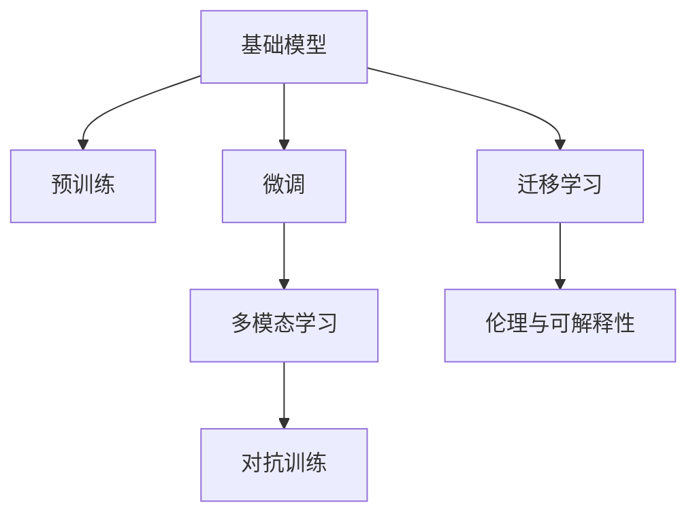

                 

# 基础模型的技术研究与社会责任

## 1. 背景介绍

随着人工智能技术的迅猛发展，基础模型（Foundation Model）作为一种强大的预训练语言模型，在自然语言处理（Natural Language Processing, NLP）、计算机视觉、语音识别等领域取得了显著的成果。这些模型通过在大规模无标签数据上进行预训练，学习到了丰富的语言和视觉知识，具备强大的泛化能力和自我学习的潜力。然而，基础模型的应用同时也引发了关于技术与社会责任的重要讨论，如何在追求技术进步的同时，合理地引导其社会应用，避免可能的负面影响，成为业界和学术界关注的热点问题。

## 2. 核心概念与联系

### 2.1 核心概念概述

为了更好地理解基础模型的技术研究与社会责任，我们需要明确几个关键概念：

- **基础模型**：指的是在大规模无标签数据上进行的自监督学习得到的预训练模型，如BERT、GPT等。这些模型能够学习到通用的语言和视觉知识，适用于多种下游任务。
- **预训练**：通过在大规模无标签数据上进行学习，使得模型能够捕捉到数据的统计特性和结构。预训练是基础模型构建的关键步骤。
- **微调（Fine-Tuning）**：在预训练模型基础上，使用下游任务的少量标注数据进行有监督训练，以适配特定任务。微调是基础模型应用的重要手段。
- **迁移学习（Transfer Learning）**：将一个领域学习到的知识，迁移到另一个相关领域，以减少从头训练的时间和数据需求。
- **多模态学习**：将不同模态（如文本、图像、语音等）的数据进行联合学习，提升模型的综合理解能力。
- **对抗训练（Adversarial Training）**：通过引入对抗样本，提高模型的鲁棒性和泛化能力。
- **伦理与可解释性**：基础模型的应用需要考虑伦理问题，如隐私保护、偏见消除、决策可解释性等。

### 2.2 核心概念原理和架构的 Mermaid 流程图



这个流程图展示了基础模型从预训练到微调，再到多模态学习和对抗训练的过程，以及模型应用中必须考虑的伦理与可解释性问题。

## 3. 核心算法原理 & 具体操作步骤

### 3.1 算法原理概述

基础模型通常采用自回归或自编码的架构进行预训练，其核心算法原理包括以下几个方面：

- **自回归模型**：如GPT，通过生成目标序列的条件概率，学习序列之间的依赖关系。
- **自编码模型**：如BERT，通过最大似然估计，学习输入和输出之间的映射关系。
- **预训练任务**：如语言建模、掩码语言模型等，通过这些任务使模型学习到语言的统计特性和结构。
- **微调任务**：根据具体下游任务，设计相应的任务适配层，进行微调以适配特定任务。

### 3.2 算法步骤详解

基础模型的构建和应用通常包括以下几个步骤：

1. **数据准备**：收集大规模无标签数据进行预训练，收集下游任务的少量标注数据进行微调。
2. **模型选择**：选择合适的预训练模型，如BERT、GPT等，作为微调的基础。
3. **任务适配层设计**：根据下游任务，设计相应的输出层和损失函数，进行任务适配。
4. **微调超参数设置**：设置学习率、批次大小、优化器、正则化等超参数。
5. **训练与评估**：使用下游任务的标注数据进行微调，周期性评估模型性能。
6. **部署与维护**：将微调后的模型部署到实际应用中，定期更新模型以适应新的数据。

### 3.3 算法优缺点

基础模型的优点包括：

- **泛化能力强**：通过在大规模数据上预训练，模型具有很强的泛化能力，适用于多种下游任务。
- **迁移学习效果好**：利用预训练的知识，微调能够快速适应新的任务，减少从头训练的时间。
- **可解释性**：预训练过程和微调过程的可解释性较高，容易理解和调试。

缺点包括：

- **资源需求高**：大规模预训练和微调需要大量的计算资源和存储空间。
- **过拟合风险**：模型在大规模数据上预训练，容易发生过拟合，特别是在下游任务数据量较少的情况下。
- **偏见问题**：预训练数据可能包含偏见，模型在微调过程中可能会学习并放大这些偏见。

### 3.4 算法应用领域

基础模型在NLP、计算机视觉、语音识别等领域有广泛的应用，例如：

- **NLP领域**：文本分类、命名实体识别、情感分析、机器翻译、对话系统等。
- **计算机视觉**：图像分类、目标检测、语义分割、图像生成等。
- **语音识别**：自动语音识别、语音合成、情感识别等。
- **多模态学习**：跨模态检索、视觉-文本融合、语音-文本联合识别等。

## 4. 数学模型和公式 & 详细讲解 & 举例说明

### 4.1 数学模型构建

基础模型的数学模型通常由预训练和微调两个阶段组成。以BERT为例，其数学模型构建包括以下几个步骤：

1. **输入表示**：将输入文本通过分词器转换为标记序列，并嵌入向量表示。
2. **位置编码**：为标记序列添加位置编码，以区分不同位置。
3. **Transformer编码器**：通过多层的自注意力机制和全连接层，进行特征提取。
4. **任务适配层**：根据下游任务设计相应的输出层和损失函数，进行微调。

### 4.2 公式推导过程

以BERT为例，其预训练任务为掩码语言模型，公式推导如下：

设输入为 $x$，输出为 $y$，模型参数为 $\theta$，则掩码语言模型的预测概率为：

$$
p(y|x;\theta) = \frac{exp(\theta W^\top x + b)}{\sum_k exp(\theta W^\top x_k + b_k)}
$$

其中 $W$ 为权重矩阵，$b$ 为偏置向量，$x_k$ 为掩码后的输入，$b_k$ 为掩码后的偏置向量。

### 4.3 案例分析与讲解

以BERT在情感分析任务上的应用为例，其微调过程如下：

1. **数据准备**：收集情感分析任务的标注数据集，将其划分为训练集、验证集和测试集。
2. **任务适配层设计**：在BERT的顶层添加全连接层，输出两个分类节点，分别对应正面和负面情感。
3. **微调超参数设置**：设置学习率为 $2e-5$，批次大小为 $16$，优化器为AdamW。
4. **训练与评估**：使用训练集进行微调，每2个epoch在验证集上评估一次性能，使用交叉熵损失函数。
5. **测试与部署**：在测试集上评估微调后的模型性能，将模型部署到实际应用中。

## 5. 项目实践：代码实例和详细解释说明

### 5.1 开发环境搭建

进行基础模型的微调开发，需要准备相应的Python环境。以下是一个基本的Python开发环境搭建流程：

1. **安装Python**：从官网下载并安装Python，建议选择最新版本。
2. **安装PyTorch**：使用conda或pip安装PyTorch，建议使用最新的稳定版本。
3. **安装Transformer库**：使用pip安装Transformer库，建议选择最新版本。
4. **安装数据集**：根据需要下载相应的大规模预训练数据集和下游任务的标注数据集。

### 5.2 源代码详细实现

以下是一个使用BERT模型进行情感分析任务微调的代码实现：

```python
import torch
import torch.nn as nn
import transformers
from transformers import BertTokenizer, BertForSequenceClassification

# 加载数据集
train_data = ...
train_labels = ...
test_data = ...
test_labels = ...

# 初始化分词器和模型
tokenizer = BertTokenizer.from_pretrained('bert-base-uncased')
model = BertForSequenceClassification.from_pretrained('bert-base-uncased', num_labels=2)

# 定义损失函数和优化器
criterion = nn.CrossEntropyLoss()
optimizer = torch.optim.Adam(model.parameters(), lr=2e-5)

# 定义训练函数
def train(model, data, labels, criterion, optimizer, device):
    model.to(device)
    model.train()
    for batch in data:
        input_ids = batch['input_ids'].to(device)
        attention_mask = batch['attention_mask'].to(device)
        labels = batch['labels'].to(device)
        logits = model(input_ids, attention_mask=attention_mask)
        loss = criterion(logits, labels)
        optimizer.zero_grad()
        loss.backward()
        optimizer.step()
    return loss.item()

# 定义评估函数
def evaluate(model, data, labels, criterion, device):
    model.eval()
    with torch.no_grad():
        loss = 0
        correct = 0
        for batch in data:
            input_ids = batch['input_ids'].to(device)
            attention_mask = batch['attention_mask'].to(device)
            labels = batch['labels'].to(device)
            logits = model(input_ids, attention_mask=attention_mask)
            loss += criterion(logits, labels).item()
            correct += (logits.argmax(dim=1) == labels).sum().item()
        return loss / len(data), correct / len(labels)

# 训练和评估
device = torch.device('cuda' if torch.cuda.is_available() else 'cpu')
for epoch in range(5):
    train_loss = train(model, train_data, train_labels, criterion, optimizer, device)
    dev_loss, dev_acc = evaluate(model, test_data, test_labels, criterion, device)
    print(f'Epoch {epoch+1}, train loss: {train_loss:.4f}, dev loss: {dev_loss:.4f}, dev acc: {dev_acc:.4f}')
```

### 5.3 代码解读与分析

这段代码实现了BERT模型在情感分析任务上的微调，主要步骤如下：

1. **数据加载**：使用PyTorch的DataLoader加载训练数据集和测试数据集。
2. **模型初始化**：加载预训练模型BERT，并定义全连接层输出分类节点。
3. **定义损失函数和优化器**：使用交叉熵损失函数和Adam优化器进行微调。
4. **训练函数**：定义训练过程，包括前向传播、损失计算、梯度更新等。
5. **评估函数**：定义评估过程，计算模型在测试集上的损失和准确率。
6. **训练与评估**：循环5次进行训练和评估，输出每个epoch的训练损失、验证损失和验证准确率。

## 6. 实际应用场景

### 6.4 未来应用展望

基础模型的应用前景广阔，未来将向以下几个方向发展：

1. **多模态学习**：基础模型将不仅仅处理单一模态数据，而是能够融合文本、图像、语音等多种模态信息，提升综合理解能力。
2. **大模型发展**：随着计算资源的增加，基础模型将向更大规模、更复杂的方向发展，以适应更多复杂的应用场景。
3. **模型压缩与加速**：通过模型压缩和加速技术，如剪枝、量化、混合精度训练等，使得基础模型能够在更小的设备上运行，提高应用效率。
4. **应用场景拓展**：基础模型将广泛应用于更多领域，如智慧医疗、智能制造、金融风险控制等，为各行各业带来智能化升级。
5. **伦理与安全**：基础模型应用过程中需要考虑伦理与安全问题，如隐私保护、偏见消除、决策可解释性等。

## 7. 工具和资源推荐

### 7.1 学习资源推荐

为了帮助开发者更好地理解基础模型的技术研究与社会责任，以下是一些推荐的学习资源：

1. **《深度学习》**：Ian Goodfellow等著，全面介绍了深度学习的基础知识和应用。
2. **《自然语言处理综论》**：Daniel Jurafsky等著，涵盖了NLP的各个方面。
3. **《计算机视觉：模型、学习和推理》**：Simon J.D. Prince著，介绍了计算机视觉的基础知识。
4. **《人工智能与人类未来》**：Nick Bostrom著，探讨了人工智能对人类未来的影响。
5. **《基础模型与伦理》**：Rachel Thomas等著，讨论了基础模型的伦理问题。

### 7.2 开发工具推荐

进行基础模型的微调开发，需要选择合适的开发工具，以下是一些推荐的工具：

1. **PyTorch**：高性能的深度学习框架，支持动态计算图，适用于研究和开发。
2. **TensorFlow**：由Google开发的深度学习框架，支持分布式训练，适用于大规模工程应用。
3. **Jupyter Notebook**：用于编写和分享Python代码的IDE，支持实时执行和可视化。
4. **Weights & Biases**：模型训练实验跟踪工具，支持多种框架，记录和可视化实验过程。
5. **TensorBoard**：TensorFlow配套的可视化工具，用于实时监测模型训练状态。

### 7.3 相关论文推荐

以下几篇论文是基础模型领域的重要研究成果，推荐阅读：

1. **《Attention is All You Need》**：Vaswani等，提出Transformer模型，开创了自注意力机制的先河。
2. **《BERT: Pre-training of Deep Bidirectional Transformers for Language Understanding》**：Devlin等，提出BERT模型，显著提升了语言理解任务的表现。
3. **《Parameter-Efficient Transfer Learning for NLP》**：Howard等，提出Adapter等参数高效微调方法，在保持参数数量不变的情况下，提升模型表现。
4. **《Language Models are Unsupervised Multitask Learners》**：OpenAI，展示了大型语言模型的强大zero-shot学习能力。
5. **《Deformable Transformers》**：Zheng等，提出Deformable Transformer模型，解决大模型训练中的梯度消失问题。

## 8. 总结：未来发展趋势与挑战

### 8.1 研究成果总结

基础模型在技术研究方面取得了显著进展，主要体现在以下几个方面：

1. **模型架构的创新**：如Transformer、BERT等模型，开创了新的深度学习架构，显著提升了模型的泛化能力和效率。
2. **大规模预训练**：通过在大规模无标签数据上进行预训练，模型学到了丰富的语言和视觉知识，提升了模型的通用性。
3. **参数高效微调**：如Adapter等方法，在保持参数数量不变的情况下，提升了模型在特定任务上的表现。

### 8.2 未来发展趋势

基础模型的未来发展趋势包括：

1. **多模态学习**：基础模型将能够融合不同模态的信息，提升综合理解能力。
2. **大模型发展**：随着计算资源的增加，基础模型将向更大规模、更复杂的方向发展。
3. **模型压缩与加速**：通过模型压缩和加速技术，使得基础模型能够在更小的设备上运行。
4. **应用场景拓展**：基础模型将广泛应用于更多领域，为各行各业带来智能化升级。
5. **伦理与安全**：基础模型应用过程中需要考虑伦理与安全问题，如隐私保护、偏见消除、决策可解释性等。

### 8.3 面临的挑战

基础模型在发展过程中面临以下挑战：

1. **计算资源需求高**：大规模预训练和微调需要大量的计算资源和存储空间。
2. **过拟合风险**：模型在大规模数据上预训练，容易发生过拟合，特别是在下游任务数据量较少的情况下。
3. **偏见问题**：预训练数据可能包含偏见，模型在微调过程中可能会学习并放大这些偏见。
4. **伦理与安全**：基础模型应用过程中需要考虑伦理与安全问题，如隐私保护、偏见消除、决策可解释性等。
5. **资源与成本**：大规模预训练和微调需要高昂的成本，需要寻找更加经济有效的方案。

### 8.4 研究展望

未来基础模型的研究方向包括：

1. **多模态学习**：研究如何将不同模态的数据进行联合学习，提升综合理解能力。
2. **大模型压缩与加速**：研究如何通过模型压缩和加速技术，使得基础模型能够在更小的设备上运行。
3. **伦理与安全**：研究如何确保基础模型应用的伦理与安全，如隐私保护、偏见消除、决策可解释性等。
4. **应用拓展**：研究基础模型在更多领域的应用，如智慧医疗、智能制造、金融风险控制等。
5. **公平性研究**：研究如何消除基础模型中的偏见，提升模型的公平性。

## 9. 附录：常见问题与解答

**Q1：基础模型在大规模数据上的预训练是否必要？**

A: 基础模型在大规模数据上的预训练是必要的。预训练使得模型能够学习到语言的统计特性和结构，提升了模型的泛化能力和效率。

**Q2：如何避免基础模型在微调过程中过拟合？**

A: 避免基础模型在微调过程中过拟合，可以采取以下措施：
1. **数据增强**：通过回译、近义替换等方式扩充训练集。
2. **正则化**：使用L2正则、Dropout、Early Stopping等方法避免过拟合。
3. **对抗训练**：引入对抗样本，提高模型的鲁棒性和泛化能力。

**Q3：如何保证基础模型应用的伦理与安全？**

A: 保证基础模型应用的伦理与安全，可以采取以下措施：
1. **隐私保护**：采用数据脱敏、加密等技术保护用户隐私。
2. **偏见消除**：通过多样化的数据集和算法设计，消除模型中的偏见。
3. **决策可解释性**：采用可解释性技术，如特征可视化、决策路径分析等，提高模型的可解释性。

**Q4：如何实现基础模型的多模态学习？**

A: 实现基础模型的多模态学习，可以采取以下措施：
1. **联合学习**：将不同模态的数据进行联合学习，提升综合理解能力。
2. **跨模态融合**：通过融合视觉、语音、文本等多种模态的信息，提升模型的综合理解能力。

**Q5：如何确保基础模型的公平性？**

A: 确保基础模型的公平性，可以采取以下措施：
1. **多样化的数据集**：使用多样化的数据集进行训练，消除模型中的偏见。
2. **公平性算法**：设计公平性算法，确保模型在各类用户群体中的表现一致。
3. **公平性评估**：定期评估模型的公平性，发现并修复潜在问题。

---

作者：禅与计算机程序设计艺术 / Zen and the Art of Computer Programming

