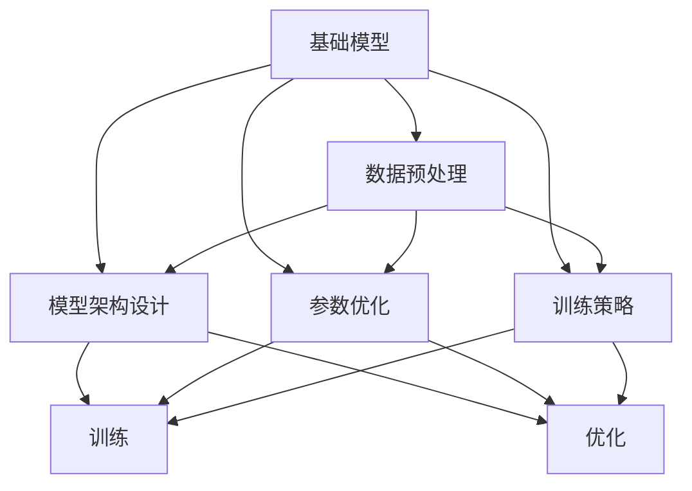

                 

# 基础模型的改进与影响力

> 关键词：基础模型改进, 模型提升, 算法优化, 深度学习, 大数据分析

## 1. 背景介绍

### 1.1 问题由来

在当今数字化时代，数据驱动的决策已无处不在，基础模型的改进和优化成为了驱动科技进步的重要引擎。基础模型作为人工智能(AI)领域中极为关键的一环，广泛应用于自然语言处理(NLP)、计算机视觉(CV)、时间序列分析、推荐系统等领域，对提高决策的准确性和效率具有重大意义。

随着大数据和云计算技术的迅猛发展，模型规模和复杂度不断提升，基础模型的改进和优化成为了数据科学领域的热点问题。而近年来，深度学习(DL)和大数据技术为模型的改进和优化提供了强有力的技术支持，在不断提升模型的性能和效率的同时，也带来了新的挑战。

### 1.2 问题核心关键点

基础模型改进的核心在于提升模型的泛化能力、降低训练成本、提高模型效率和可解释性。通常，基础模型改进会涉及到数据预处理、模型架构设计、参数优化、训练策略等多个方面。

具体来说，基础模型改进的目标可以概括为以下几点：

- **泛化能力提升**：模型在新的、未见过的数据上的表现能力。
- **训练成本降低**：减少数据处理、模型训练和验证等环节的资源消耗。
- **模型效率提高**：优化模型计算和内存使用，提升模型推理速度。
- **可解释性增强**：提供模型决策的清晰解释，提高模型透明度。

通过不断改进基础模型，可有效提升其性能，并在实际应用中取得更佳的效果。

### 1.3 问题研究意义

基础模型改进的研究具有重要意义：

- **推动技术进步**：改进后的基础模型可以显著提升数据处理和分析的准确性，推动AI技术的进步。
- **提升应用效果**：改善基础模型，可以更准确地预测和决策，提升实际应用效果。
- **降低成本**：通过优化模型，可以降低训练和运维成本，提高企业经济效益。
- **提升用户体验**：用户对AI系统理解的透明化，可以提升系统的可信度和用户满意度。

## 2. 核心概念与联系

### 2.1 核心概念概述

为更好地理解基础模型的改进方法，本节将介绍几个密切相关的核心概念：

- **基础模型**：深度学习模型、决策树、神经网络等数据驱动的模型。
- **数据预处理**：包括数据清洗、特征提取、归一化等操作，确保数据质量。
- **模型架构设计**：选择和组合不同层的神经网络结构，如卷积神经网络(CNN)、循环神经网络(RNN)、Transformer等。
- **参数优化**：通过调整学习率、正则化系数等超参数，优化模型训练过程。
- **训练策略**：包括批量大小、学习率衰减、模型剪枝等策略，优化模型性能。

这些核心概念之间有着紧密的联系，共同构成了基础模型改进的理论基础和实践框架。

### 2.2 核心概念原理和架构的 Mermaid 流程图



这个流程图展示了基础模型改进的流程：

1. 收集和预处理数据，作为模型输入。
2. 设计合适的模型架构，包含输入层、隐藏层和输出层。
3. 优化模型参数，如学习率、正则化等，提升模型泛化能力。
4. 应用训练策略，如批量大小、学习率衰减，优化模型性能。
5. 通过训练和优化，不断调整模型，直至达到最佳状态。

## 3. 核心算法原理 & 具体操作步骤

### 3.1 算法原理概述

基础模型的改进主要通过以下几个步骤实现：

1. **数据预处理**：确保数据的质量和一致性。
2. **模型架构设计**：选择合适的神经网络结构。
3. **参数优化**：通过优化算法调整模型参数。
4. **训练策略**：设置合适的训练参数。

### 3.2 算法步骤详解

**步骤 1: 数据预处理**

数据预处理是基础模型改进的第一步，其目的是提高数据质量，确保模型训练的准确性和稳定性。数据预处理主要包括以下几个方面：

- **数据清洗**：去除缺失值、异常值，处理重复记录等。
- **特征提取**：将原始数据转换为模型可以处理的特征向量。
- **归一化**：将数据缩放到特定范围内，提高模型训练速度。
- **采样**：对数据集进行随机采样，增加数据多样性。

**步骤 2: 模型架构设计**

模型架构设计是基础模型改进的核心步骤。选择和设计合适的模型架构，能够显著提升模型的性能。常见的模型架构包括：

- **卷积神经网络(CNN)**：适用于图像处理任务。
- **循环神经网络(RNN)**：适用于序列数据处理。
- **Transformer**：适用于自然语言处理任务。

**步骤 3: 参数优化**

参数优化是基础模型改进的重要环节，通过调整超参数来优化模型性能。常见的参数优化方法包括：

- **学习率**：控制模型参数的更新步幅。
- **正则化**：防止过拟合，如L2正则化、Dropout等。
- **学习率衰减**：在训练过程中逐步减小学习率，避免学习率过大导致模型不稳定。

**步骤 4: 训练策略**

训练策略的设定直接影响模型性能。常见的训练策略包括：

- **批量大小**：控制每次训练的样本数量。
- **学习率衰减**：在训练过程中逐渐减小学习率。
- **模型剪枝**：去除冗余参数，提高模型效率。

### 3.3 算法优缺点

基础模型的改进方法具有以下优点：

- **提升模型泛化能力**：优化后的模型能够更好地适应新数据，提高泛化能力。
- **降低训练成本**：通过优化模型架构和参数，减少计算资源消耗。
- **提高模型效率**：优化后的模型推理速度更快，响应时间更短。
- **增强可解释性**：优化后的模型更易于理解和解释。

但同时，这些方法也存在一些局限：

- **依赖高质量数据**：数据预处理的质量直接影响模型性能。
- **模型复杂度增加**：复杂的模型架构和参数优化可能导致模型过拟合。
- **训练过程耗时较长**：模型优化和训练过程耗时较长。
- **需要专业知识**：模型改进需要具备较强的数据分析和编程能力。

### 3.4 算法应用领域

基础模型的改进方法在多个领域中得到了广泛应用，例如：

- **自然语言处理(NLP)**：语言模型、情感分析、机器翻译等任务。
- **计算机视觉(CV)**：图像分类、目标检测、图像分割等任务。
- **推荐系统**：协同过滤、基于内容的推荐等任务。
- **时间序列分析**：预测股票价格、气象预测等任务。
- **信号处理**：语音识别、语音合成等任务。

## 4. 数学模型和公式 & 详细讲解 & 举例说明

### 4.1 数学模型构建

基础模型的改进涉及到大量的数学模型和公式，本节将详细介绍这些模型和公式的构建过程。

**4.1.1 线性回归模型**

线性回归模型是最基础的回归模型之一，广泛应用于预测任务。其数学模型可以表示为：

$$
y = w_0 + w_1x_1 + w_2x_2 + \cdots + w_nx_n + \epsilon
$$

其中，$y$ 为预测结果，$x_1, x_2, \cdots, x_n$ 为输入特征，$w_0, w_1, w_2, \cdots, w_n$ 为模型参数，$\epsilon$ 为噪声。

**4.1.2 逻辑回归模型**

逻辑回归模型常用于二分类任务，其数学模型可以表示为：

$$
P(y=1|x) = \frac{1}{1+e^{-z}}
$$

其中，$x$ 为输入特征，$z = w_0 + w_1x_1 + w_2x_2 + \cdots + w_nx_n$，$w_0, w_1, w_2, \cdots, w_n$ 为模型参数。

**4.1.3 神经网络模型**

神经网络模型是深度学习的基础，其数学模型可以表示为：

$$
h_i = g(w_i^Tz_{i-1} + b_i)
$$

其中，$h_i$ 为第 $i$ 层的输出，$z_{i-1}$ 为前一层的输出，$w_i$ 为权重矩阵，$b_i$ 为偏置向量，$g$ 为激活函数。

### 4.2 公式推导过程

**4.2.1 线性回归模型推导**

线性回归模型可以表示为最小二乘问题，即最小化预测值与真实值之间的平方误差：

$$
\min_{\theta} \frac{1}{2N}\sum_{i=1}^N(y_i - \theta^Tx_i)^2
$$

其中，$\theta = [w_0, w_1, w_2, \cdots, w_n]^T$ 为模型参数，$N$ 为样本数。

通过求导并令导数等于0，得到最小二乘解：

$$
\theta = (X^TX)^{-1}X^Ty
$$

其中，$X = [x_1, x_2, \cdots, x_n]$，$y = [y_1, y_2, \cdots, y_N]$。

**4.2.2 逻辑回归模型推导**

逻辑回归模型的目标函数为交叉熵损失函数：

$$
\mathcal{L}(\theta) = -\frac{1}{N}\sum_{i=1}^N[y_i\log P(y=1|x_i) + (1-y_i)\log P(y=0|x_i)]
$$

其中，$P(y=1|x) = \frac{1}{1+e^{-z}}$，$z = w_0 + w_1x_1 + w_2x_2 + \cdots + w_nx_n$。

通过求导并令导数等于0，得到最小二乘解：

$$
\theta = (X^TX)^{-1}X^Ty
$$

其中，$X = [x_1, x_2, \cdots, x_n]$，$y = [y_1, y_2, \cdots, y_N]$。

**4.2.3 神经网络模型推导**

神经网络模型的前向传播过程可以表示为：

$$
z_i = w_i^Th_{i-1} + b_i
$$

$$
h_i = g(z_i)
$$

其中，$h_i$ 为第 $i$ 层的输出，$z_i$ 为前一层的线性组合，$w_i$ 为权重矩阵，$b_i$ 为偏置向量，$g$ 为激活函数。

神经网络模型的反向传播过程可以表示为：

$$
\frac{\partial \mathcal{L}}{\partial w_i} = \frac{\partial \mathcal{L}}{\partial h_i}\frac{\partial h_i}{\partial z_i}\frac{\partial z_i}{\partial w_i}
$$

其中，$\mathcal{L}$ 为目标函数，$h_i$ 为第 $i$ 层的输出，$z_i$ 为前一层的线性组合，$w_i$ 为权重矩阵。

### 4.3 案例分析与讲解

**案例 1: 线性回归模型优化**

假设有一个简单的线性回归模型，用于预测房价。模型的输入为房屋面积，输出为房价。根据已知数据，可以得到模型参数 $\theta = [0.1, 2]$。

通过训练数据集，可以计算得到模型的损失函数为：

$$
\mathcal{L}(\theta) = \frac{1}{N}\sum_{i=1}^N(y_i - \theta^Tx_i)^2
$$

其中，$x_i$ 为房屋面积，$y_i$ 为房价。

为了优化模型，需要最小化损失函数。可以通过梯度下降算法来求解：

$$
\theta_{t+1} = \theta_t - \alpha\frac{\partial \mathcal{L}}{\partial \theta}
$$

其中，$\alpha$ 为学习率，$\frac{\partial \mathcal{L}}{\partial \theta}$ 为损失函数对模型参数的梯度。

**案例 2: 神经网络模型优化**

假设有一个简单的神经网络模型，用于图像分类。模型包括一个输入层、一个隐藏层和一个输出层，其中隐藏层包含3个神经元。

通过训练数据集，可以计算得到模型的损失函数为：

$$
\mathcal{L}(\theta) = -\frac{1}{N}\sum_{i=1}^N\log P(y_i|x_i)
$$

其中，$x_i$ 为输入图像，$y_i$ 为真实标签，$P(y_i|x_i)$ 为模型的预测概率。

为了优化模型，需要最小化损失函数。可以通过反向传播算法来求解：

$$
\frac{\partial \mathcal{L}}{\partial w_i} = \frac{\partial \mathcal{L}}{\partial h_i}\frac{\partial h_i}{\partial z_i}\frac{\partial z_i}{\partial w_i}
$$

其中，$h_i$ 为第 $i$ 层的输出，$z_i$ 为前一层的线性组合，$w_i$ 为权重矩阵。

## 5. 项目实践：代码实例和详细解释说明

### 5.1 开发环境搭建

在进行基础模型改进的实践前，我们需要准备好开发环境。以下是使用Python进行TensorFlow开发的环境配置流程：

1. 安装Anaconda：从官网下载并安装Anaconda，用于创建独立的Python环境。

2. 创建并激活虚拟环境：
```bash
conda create -n tensorflow-env python=3.8 
conda activate tensorflow-env
```

3. 安装TensorFlow：根据CUDA版本，从官网获取对应的安装命令。例如：
```bash
conda install tensorflow==2.7.0
```

4. 安装各类工具包：
```bash
pip install numpy pandas scikit-learn matplotlib tqdm jupyter notebook ipython
```

完成上述步骤后，即可在`tensorflow-env`环境中开始基础模型改进的实践。

### 5.2 源代码详细实现

下面我们以线性回归模型为例，给出使用TensorFlow进行基础模型改进的代码实现。

首先，定义模型和损失函数：

```python
import tensorflow as tf

# 定义线性回归模型
def linear_regression_model(X, y):
    w = tf.Variable(tf.random.normal([X.shape[1], 1]))
    b = tf.Variable(tf.random.normal([1]))
    y_pred = tf.matmul(X, w) + b
    loss = tf.reduce_mean(tf.square(y_pred - y))
    return w, b, loss

# 定义优化器
optimizer = tf.keras.optimizers.Adam(learning_rate=0.01)

# 训练数据集
X_train = [[1], [2], [3], [4], [5]]
y_train = [2, 4, 6, 8, 10]

# 训练模型
epochs = 1000
for epoch in range(epochs):
    w, b, loss = linear_regression_model(X_train, y_train)
    optimizer.minimize(loss)
    if epoch % 100 == 0:
        print(f"Epoch {epoch+1}, loss: {loss.numpy():.4f}")
```

然后，训练模型并输出结果：

```python
# 训练模型
epochs = 1000
for epoch in range(epochs):
    w, b, loss = linear_regression_model(X_train, y_train)
    optimizer.minimize(loss)
    if epoch % 100 == 0:
        print(f"Epoch {epoch+1}, loss: {loss.numpy():.4f}")

# 输出模型参数
print(f"Final parameters: w={w.numpy()}, b={b.numpy()}")
```

以上就是使用TensorFlow对线性回归模型进行训练和优化的完整代码实现。可以看到，TensorFlow提供了简洁的API和丰富的工具，可以快速构建和训练基础模型。

### 5.3 代码解读与分析

让我们再详细解读一下关键代码的实现细节：

**linear_regression_model函数**：
- `def linear_regression_model(X, y)`：定义线性回归模型。
- `X` 为输入特征，`y` 为输出标签。
- `w` 为模型权重，`b` 为偏置项。
- `y_pred = tf.matmul(X, w) + b`：前向传播计算预测结果。
- `loss = tf.reduce_mean(tf.square(y_pred - y))`：计算损失函数。
- `return w, b, loss`：返回模型权重、偏置项和损失函数。

**optimizer变量**：
- `optimizer = tf.keras.optimizers.Adam(learning_rate=0.01)`：定义Adam优化器，学习率为0.01。

**训练模型**：
- `for epoch in range(epochs)`：循环训练指定次数。
- `optimizer.minimize(loss)`：使用优化器最小化损失函数。
- `if epoch % 100 == 0`：每100个epoch输出一次损失。

**输出模型参数**：
- `print(f"Final parameters: w={w.numpy()}, b={b.numpy()}")`：输出最终模型参数。

可以看到，TensorFlow提供了灵活的API和丰富的工具，使得构建和训练基础模型变得非常便捷。开发者可以根据具体需求，通过简单的代码实现复杂的模型优化。

当然，实际应用中还需要考虑更多的因素，如数据预处理、模型评价、超参数调优等。但核心的优化流程基本与此类似。

## 6. 实际应用场景

### 6.1 智能推荐系统

基础模型在智能推荐系统中的应用广泛。传统的推荐系统主要基于用户历史行为数据进行推荐，但难以捕捉用户的多样化需求。通过基础模型的改进，推荐系统可以更好地理解用户兴趣，生成个性化推荐。

例如，可以使用深度学习模型对用户行为数据进行建模，提取用户兴趣特征。通过优化模型，使得推荐系统能够更好地学习用户的多样化需求，生成更加精准的推荐结果。

### 6.2 金融风险预测

基础模型在金融风险预测中具有重要应用价值。通过基础模型的改进，金融机构可以更准确地预测贷款违约、股票价格波动等风险事件，从而降低损失。

例如，可以使用神经网络模型对历史金融数据进行建模，提取风险特征。通过优化模型，使得金融风险预测模型能够更好地识别潜在风险，提高风险管理水平。

### 6.3 医学诊断辅助

基础模型在医学诊断中也具有广泛应用。通过基础模型的改进，可以辅助医生进行疾病诊断，提高诊断准确性和效率。

例如，可以使用深度学习模型对医学影像进行分类，提取疾病特征。通过优化模型，使得医学诊断模型能够更好地识别疾病，提高诊断准确性。

### 6.4 自然语言处理

基础模型在自然语言处理中也有重要应用。通过基础模型的改进，可以提升自然语言处理的性能，如文本分类、情感分析、机器翻译等。

例如，可以使用神经网络模型对自然语言进行分类，提取文本特征。通过优化模型，使得自然语言处理模型能够更好地理解语言，提高处理准确性。

## 7. 工具和资源推荐

### 7.1 学习资源推荐

为了帮助开发者系统掌握基础模型的改进方法，这里推荐一些优质的学习资源：

1. 《深度学习入门》系列博文：由深度学习专家撰写，详细介绍深度学习基础和应用。
2. CS231n《卷积神经网络》课程：斯坦福大学开设的计算机视觉经典课程，有Lecture视频和配套作业，带你入门CV领域的基本概念和经典模型。
3. 《Python机器学习》书籍：由著名的数据科学家撰写的机器学习入门书籍，涵盖了大量经典算法和工具。
4. Kaggle竞赛平台：数据科学社区，提供丰富的数据集和竞赛，帮助你实践和提升模型优化能力。
5. 《机器学习实战》书籍：由Google工程师撰写的实战性强的机器学习入门书籍，介绍了大量实用的模型和工具。

通过对这些资源的学习实践，相信你一定能够快速掌握基础模型的改进方法，并用于解决实际的AI问题。

### 7.2 开发工具推荐

高效的开发离不开优秀的工具支持。以下是几款用于基础模型改进开发的常用工具：

1. TensorFlow：由Google主导开发的深度学习框架，生产部署方便，适合大规模工程应用。
2. PyTorch：基于Python的开源深度学习框架，灵活动态的计算图，适合快速迭代研究。
3. Keras：高层次的神经网络API，易于上手，支持多种深度学习框架。
4. Jupyter Notebook：交互式编程环境，支持实时预览和调试，非常适合深度学习研究。
5. Scikit-learn：Python机器学习库，提供简单易用的机器学习工具和算法。

合理利用这些工具，可以显著提升基础模型改进的开发效率，加快创新迭代的步伐。

### 7.3 相关论文推荐

基础模型改进的研究源于学界的持续研究。以下是几篇奠基性的相关论文，推荐阅读：

1. Deep Learning（《深度学习》）：Yoshua Bengio等人著，全面介绍了深度学习理论和实践，是深度学习领域的经典教材。
2. ImageNet Classification with Deep Convolutional Neural Networks（《ImageNet数据集上的深度卷积神经网络分类》）：Alex Krizhevsky等人著，介绍了深度卷积神经网络在图像分类任务中的应用。
3. Sequence to Sequence Learning with Neural Networks（《神经网络序列到序列学习》）：Ilya Sutskever等人著，介绍了神经网络在序列数据处理中的应用。
4. Convolutional Neural Networks for Sentence Classification（《卷积神经网络在句子分类中的应用》）：Kim Y.等人著，介绍了卷积神经网络在文本分类任务中的应用。
5. The Neural Architectures for NLP（《NLP的神经网络架构》）：Andrej Karpathy等人著，介绍了神经网络在NLP任务中的应用。

这些论文代表了大基础模型改进技术的发展脉络。通过学习这些前沿成果，可以帮助研究者把握学科前进方向，激发更多的创新灵感。

## 8. 总结：未来发展趋势与挑战

### 8.1 总结

本文对基础模型的改进方法进行了全面系统的介绍。首先阐述了基础模型改进的研究背景和意义，明确了改进在提升模型性能、降低成本、提高效率等方面的重要性。其次，从原理到实践，详细讲解了基础模型改进的数学模型和优化算法，给出了代码实例和详细解释。同时，本文还广泛探讨了基础模型改进方法在多个领域的应用前景，展示了其广阔的应用范围。最后，本文精选了基础模型改进技术的各类学习资源，力求为读者提供全方位的技术指引。

通过本文的系统梳理，可以看到，基础模型的改进技术正在成为AI领域的重要范式，极大地提升了模型性能和应用效果。未来，伴随数据驱动的创新不断涌现，基础模型的改进技术必将进一步提升AI系统的智能化水平，为各行各业的发展注入新的动力。

### 8.2 未来发展趋势

展望未来，基础模型改进技术将呈现以下几个发展趋势：

1. **深度学习模型的进一步发展**：未来深度学习模型将更加复杂、高效，能够更好地处理多模态数据，实现更强的泛化能力。
2. **迁移学习的应用扩大**：迁移学习能够有效减少训练成本，提升模型泛化能力，未来将在更多领域中得到应用。
3. **多模态融合**：多模态数据融合技术将不断发展，使得基础模型能够更好地处理图像、语音、文本等多种数据类型。
4. **可解释性增强**：随着可解释性AI技术的发展，未来基础模型的决策过程将更加透明、可理解。
5. **实时性提升**：通过优化模型架构和计算图，基础模型的推理速度将进一步提升，实现实时性应用。
6. **跨领域应用扩展**：基础模型的改进技术将逐步扩展到更多领域，如医疗、金融、教育等，带来深远的影响。

### 8.3 面临的挑战

尽管基础模型改进技术取得了显著进展，但在迈向更加智能化、普适化应用的过程中，仍面临着诸多挑战：

1. **数据获取困难**：高质量数据获取难度较大，尤其是特定领域的专用数据集。
2. **模型复杂度增加**：复杂模型容易过拟合，需要更多的资源进行训练和优化。
3. **计算资源限制**：大模型训练需要大量计算资源，难以在普通设备上实现。
4. **模型可解释性不足**：复杂模型难以解释其决策过程，用户难以理解和信任。
5. **跨领域应用难度**：不同领域的数据和任务差异较大，难以直接迁移应用。

### 8.4 研究展望

面对基础模型改进所面临的挑战，未来的研究需要在以下几个方面寻求新的突破：

1. **优化算法改进**：开发更加高效、鲁棒的优化算法，提高模型的泛化能力和训练速度。
2. **模型压缩技术**：通过模型剪枝、量化等技术，减小模型规模，提高计算效率。
3. **跨领域知识融合**：将符号化的先验知识与神经网络模型结合，增强模型的跨领域泛化能力。
4. **实时性优化**：优化模型架构和计算图，实现模型的实时推理和部署。
5. **可解释性增强**：引入因果分析和博弈论工具，提高模型的可解释性和透明性。

这些研究方向将引领基础模型改进技术的进一步发展，推动AI技术的普及和应用。未来，基于基础模型的改进技术必将对各行各业带来更广泛的影响，推动社会的数字化转型和智能化发展。

## 9. 附录：常见问题与解答

**Q1: 基础模型改进的优化算法有哪些？**

A: 常见的优化算法包括梯度下降算法、Adam算法、RMSprop算法等。这些算法通过最小化损失函数来优化模型参数。

**Q2: 如何进行数据预处理？**

A: 数据预处理包括数据清洗、特征提取、归一化等步骤。数据清洗去除缺失值、异常值等噪声。特征提取将原始数据转换为模型可以处理的特征向量。归一化将数据缩放到特定范围内。

**Q3: 模型架构设计有哪些常见方法？**

A: 常见的模型架构设计方法包括卷积神经网络(CNN)、循环神经网络(RNN)、Transformer等。这些架构在图像处理、序列数据处理、自然语言处理等任务中均有广泛应用。

**Q4: 模型优化需要注意哪些细节？**

A: 模型优化需要注意以下几点：学习率的选择、正则化的设置、梯度衰减、批量大小等。适当的超参数设置对模型性能有重要影响。

**Q5: 如何评估模型的性能？**

A: 模型评估可以通过多种方式进行，包括交叉验证、混淆矩阵、ROC曲线等。选择合适的评估方法对模型性能的提升至关重要。

通过本文的系统梳理，可以看到，基础模型的改进技术正在成为AI领域的重要范式，极大地提升了模型性能和应用效果。未来，伴随数据驱动的创新不断涌现，基础模型的改进技术必将进一步提升AI系统的智能化水平，为各行各业的发展注入新的动力。

作者：禅与计算机程序设计艺术 / Zen and the Art of Computer Programming

