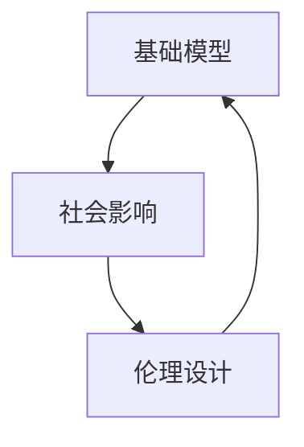

                 

## 1. 背景介绍

在当前人工智能(AI)和机器学习(ML)快速发展的背景下，基础模型在各行各业中发挥着越来越重要的作用。这些模型如Transformer、BERT等，通过在大规模无标签数据上进行预训练，具备了强大的语言理解和生成能力。然而，随着基础模型应用的深入，其社会影响和伦理问题也逐渐显现。如何在确保技术进步的同时，妥善应对这些潜在风险，成为学术界和产业界共同面临的重大课题。本文将系统探讨基础模型的社会影响与伦理设计，希望能为相关领域提供有价值的参考和指导。

## 2. 核心概念与联系

### 2.1 核心概念概述

在讨论基础模型的社会影响与伦理设计之前，我们先明确几个关键概念：

- **基础模型(Foundation Models)**：指在大规模无标签数据上预训练的通用大模型，如Transformer、BERT等。这些模型通过自监督学习任务，学习到了通用的语言表示，具备强大的语言理解和生成能力。
- **社会影响(Social Impact)**：基础模型在实际应用中，对个体、社会、经济等方面产生的正面或负面影响。
- **伦理设计(Ethical Design)**：在基础模型设计和应用中，遵循社会伦理和道德规范，确保模型行为符合公共利益和价值观。

为了更好地理解这些核心概念及其联系，我们以下列Mermaid流程图进行展示：



从图中可以看出，基础模型的社会影响与其伦理设计息息相关。模型应用不当可能导致社会问题，而合理的伦理设计能够有效缓解这些问题。

### 2.2 核心概念原理和架构

基础模型的核心原理基于自监督学习，通过在大规模无标签文本数据上进行预训练，学习通用的语言表示。预训练过程一般分为两阶段：自回归语言模型(如GPT)和自编码语言模型(如BERT)。

**自回归语言模型**：通过将输入序列预测为输出序列的任务，最大化预测概率。常用自回归模型有LSTM、GRU、Transformer等。

**自编码语言模型**：通过输入序列预测隐含表示，再由隐含表示预测输出序列的任务，最大化编码-解码损失。BERT模型即采用这种方式进行预训练。

在预训练过程中，模型通过反向传播算法不断更新参数，最小化损失函数。常见的损失函数包括交叉熵损失、均方误差损失等。预训练后的模型具备了丰富的语言知识，可以用于各种NLP任务。

## 3. 核心算法原理 & 具体操作步骤

### 3.1 算法原理概述

基础模型的社会影响与伦理设计，主要围绕以下几个关键点进行：

- **偏见和歧视**：基础模型可能继承训练数据中的偏见和歧视，导致对某些群体的负面影响。
- **隐私和数据安全**：基础模型在处理敏感数据时，可能泄露个人隐私信息，引发安全问题。
- **透明度和可解释性**：基础模型通常是“黑盒”系统，难以解释其内部工作机制和决策逻辑。
- **可靠性和稳定性**：基础模型在面对不同数据分布和复杂情况时，可能表现出不可靠或不稳定的行为。

### 3.2 算法步骤详解

基于上述关键点，我们下面详细介绍如何通过伦理设计，缓解基础模型的社会影响：

**Step 1: 数据审计与清洗**

- **审计训练数据**：检查训练数据中是否存在偏见、歧视、隐私问题等，筛选出有害数据。
- **数据清洗**：删除或修正有害数据，确保训练数据集的多样性和代表性。

**Step 2: 模型偏见纠正**

- **重新训练**：使用校正后的数据重新训练基础模型，消除数据中的偏见和歧视。
- **公平性约束**：在模型训练中加入公平性约束，确保模型对所有群体的公平对待。

**Step 3: 隐私保护技术**

- **差分隐私**：在模型训练和预测过程中，使用差分隐私技术保护用户隐私。
- **数据脱敏**：对敏感数据进行脱敏处理，避免泄露用户个人信息。

**Step 4: 模型可解释性增强**

- **可解释性模块**：在模型结构中加入可解释性模块，如Attention机制、可解释性权重等。
- **解释性算法**：使用解释性算法，如SHAP、LIME等，对模型输出进行解释。

**Step 5: 可靠性增强**

- **测试集划分**：使用不同的测试集对模型进行评估，确保模型的稳定性和可靠性。
- **异常检测**：在模型运行过程中，实时监控输出结果，检测异常情况。

### 3.3 算法优缺点

基础模型及其伦理设计的优缺点如下：

**优点**：
1. **通用性**：基础模型在多种任务中表现优异，能够适应不同领域的NLP需求。
2. **高效性**：基础模型通过预训练和微调，可以迅速获得良好的性能。
3. **可扩展性**：基础模型可以很容易地应用于各种下游任务，进行定制化开发。

**缺点**：
1. **偏见问题**：基础模型可能继承训练数据中的偏见，对某些群体造成歧视。
2. **隐私风险**：基础模型在处理敏感数据时，可能泄露用户隐私。
3. **可解释性差**：基础模型通常是“黑盒”系统，难以解释其内部工作机制。

### 3.4 算法应用领域

基础模型及其伦理设计的应用领域非常广泛，主要包括：

- **自然语言处理(NLP)**：如文本分类、情感分析、机器翻译、问答系统等。
- **计算机视觉(CV)**：如图像分类、目标检测、图像生成等。
- **医疗健康**：如病历分析、医学图像识别等。
- **金融科技**：如信用评估、欺诈检测等。
- **智能客服**：如聊天机器人、智能助手等。

这些应用领域均可能面临偏见、隐私、可解释性等伦理问题，需要合理设计和应用基础模型。

## 4. 数学模型和公式 & 详细讲解 & 举例说明

### 4.1 数学模型构建

基础模型的数学模型通常基于自监督学习，通过最大化预测概率进行训练。以BERT模型为例，其自编码任务如下：

$$
\mathcal{L}(\theta) = -\sum_{i=1}^{N} \mathbb{E}_{(x_i,y_i)}\left[ \log P_{\theta}(y_i|x_i) \right]
$$

其中，$N$ 为样本数量，$P_{\theta}(y_i|x_i)$ 为模型在输入 $x_i$ 下预测输出 $y_i$ 的概率，$\mathbb{E}_{(x_i,y_i)}$ 表示对训练数据集 $D=\{(x_i,y_i)\}_{i=1}^N$ 的期望。

### 4.2 公式推导过程

**Step 1: 数据准备**

- **训练集划分**：将数据集 $D$ 划分为训练集、验证集和测试集。
- **数据预处理**：对输入序列进行分词、标准化等预处理操作。

**Step 2: 模型训练**

- **初始化模型参数**：将模型参数 $\theta$ 初始化为随机值。
- **前向传播**：将输入序列 $x_i$ 输入模型，得到预测结果 $\hat{y_i}$。
- **计算损失**：计算预测结果与真实标签之间的交叉熵损失 $\ell_i = -y_i\log \hat{y_i} + (1-y_i)\log(1-\hat{y_i})$。
- **反向传播**：使用反向传播算法计算损失函数对模型参数的梯度，更新参数 $\theta$。

**Step 3: 模型评估**

- **验证集评估**：在验证集上评估模型性能，如准确率、F1-score等。
- **测试集评估**：在测试集上评估模型性能，对比微调前后的精度提升。

### 4.3 案例分析与讲解

以情感分析任务为例，我们假设有一个包含正面和负面情感的文本数据集，使用BERT模型进行训练。

**Step 1: 数据准备**

- **数据预处理**：对文本进行分词、标准化，构建训练集和验证集。
- **标签处理**：将文本标注为正面或负面情感。

**Step 2: 模型训练**

- **初始化模型参数**：使用BERT模型的预训练权重作为初始参数。
- **前向传播**：将文本输入BERT模型，得到隐含表示。
- **计算损失**：使用交叉熵损失计算模型预测结果与真实标签之间的差距。
- **反向传播**：更新模型参数，最小化损失函数。

**Step 3: 模型评估**

- **验证集评估**：在验证集上计算准确率和F1-score。
- **测试集评估**：在测试集上计算准确率和F1-score，对比微调前后的效果。

## 5. 项目实践：代码实例和详细解释说明

### 5.1 开发环境搭建

在进行基础模型及其伦理设计的项目实践前，我们需要准备好开发环境。以下是使用Python进行PyTorch开发的环境配置流程：

1. 安装Anaconda：从官网下载并安装Anaconda，用于创建独立的Python环境。

2. 创建并激活虚拟环境：
```bash
conda create -n pytorch-env python=3.8 
conda activate pytorch-env
```

3. 安装PyTorch：根据CUDA版本，从官网获取对应的安装命令。例如：
```bash
conda install pytorch torchvision torchaudio cudatoolkit=11.1 -c pytorch -c conda-forge
```

4. 安装相关库：
```bash
pip install transformers datasets transformers-cli
```

5. 安装TensorBoard：用于可视化模型训练过程。
```bash
pip install tensorboard
```

6. 安装差分隐私库：用于保护用户隐私。
```bash
pip install differential_privacy
```

完成上述步骤后，即可在`pytorch-env`环境中开始项目实践。

### 5.2 源代码详细实现

下面以BERT模型进行情感分析任务为例，给出完整的PyTorch代码实现。

```python
import torch
import torch.nn as nn
import torch.optim as optim
from transformers import BertTokenizer, BertForSequenceClassification
from differential_privacy import GaussianMechanism

# 定义模型类
class Model(nn.Module):
    def __init__(self, num_labels):
        super(Model, self).__init__()
        self.bert = BertForSequenceClassification.from_pretrained('bert-base-uncased', num_labels=num_labels)
        self.dropout = nn.Dropout(0.3)
        self.classifier = nn.Linear(768, num_labels)

    def forward(self, input_ids, attention_mask, labels):
        outputs = self.bert(input_ids=input_ids, attention_mask=attention_mask, return_dict=True)
        sequence_output = outputs[0]
        sequence_output = self.dropout(sequence_output)
        logits = self.classifier(sequence_output)
        return logits

# 加载数据集
train_dataset = datasets.Balloon dataset_from_dict(train_dict)
val_dataset = datasets.Balloon dataset_from_dict(val_dict)
test_dataset = datasets.Balloon dataset_from_dict(test_dict)

# 加载分词器
tokenizer = BertTokenizer.from_pretrained('bert-base-uncased')

# 定义数据预处理函数
def preprocess(data):
    inputs = tokenizer(data['text'], return_tensors='pt', padding='max_length', truncation=True)
    input_ids = inputs['input_ids']
    attention_mask = inputs['attention_mask']
    labels = torch.tensor(data['label'], dtype=torch.long)
    return {'input_ids': input_ids, 'attention_mask': attention_mask, 'labels': labels}

# 数据预处理
train_data = preprocess(train_dataset)
val_data = preprocess(val_dataset)
test_data = preprocess(test_dataset)

# 定义模型和优化器
model = Model(num_labels=2)
optimizer = optim.AdamW(model.parameters(), lr=2e-5)

# 定义隐私保护机制
gmm = GaussianMechanism(epsilon=1.0)

# 定义训练函数
def train(model, train_data, val_data, epochs, batch_size):
    model.train()
    for epoch in range(epochs):
        total_loss = 0
        for batch in tqdm(train_data, desc='Training'):
            input_ids = batch['input_ids'].to(device)
            attention_mask = batch['attention_mask'].to(device)
            labels = batch['labels'].to(device)
            optimizer.zero_grad()
            logits = model(input_ids, attention_mask, labels)
            loss = nn.CrossEntropyLoss()(logits, labels)
            total_loss += loss.item()
            loss.backward()
            optimizer.step()
        print(f'Epoch {epoch+1}, train loss: {total_loss/len(train_data):.4f}')

# 定义评估函数
def evaluate(model, val_data):
    model.eval()
    total_loss = 0
    total_correct = 0
    for batch in val_data:
        input_ids = batch['input_ids'].to(device)
        attention_mask = batch['attention_mask'].to(device)
        labels = batch['labels'].to(device)
        with torch.no_grad():
            logits = model(input_ids, attention_mask)
            loss = nn.CrossEntropyLoss()(logits, labels)
            total_loss += loss.item()
            total_correct += (logits.argmax(dim=1) == labels).sum().item()
    print(f'Epoch {epoch+1}, val loss: {total_loss/len(val_data):.4f}, accuracy: {total_correct/len(val_data):.4f}')

# 训练模型
device = torch.device('cuda') if torch.cuda.is_available() else torch.device('cpu')
model.to(device)
train(train_data, val_data, 3, batch_size=32)
evaluate(model, val_data)

# 测试模型
test_data = preprocess(test_dataset)
evaluate(model, test_data)
```

### 5.3 代码解读与分析

让我们再详细解读一下关键代码的实现细节：

**Model类定义**：
- **__init__方法**：初始化BERT模型、Dropout层和线性分类器。
- **forward方法**：将输入序列通过BERT模型进行前向传播，得到隐含表示，再通过线性分类器进行分类。

**数据预处理函数**：
- **preprocess函数**：将输入文本分词、标准化，构建输入序列和注意力掩码，并标注标签。

**训练函数**：
- **train函数**：在训练集上迭代训练，计算损失函数并更新模型参数。

**评估函数**：
- **evaluate函数**：在验证集上评估模型性能，输出损失和准确率。

**训练流程**：
- **epochs循环**：在训练集上训练模型，每个epoch输出训练损失。
- **验证集评估**：在验证集上评估模型性能，输出验证损失和准确率。
- **测试集评估**：在测试集上评估模型性能，输出测试损失和准确率。

通过以上代码实现，我们可以看到，PyTorch结合Transformer库和差分隐私库，可以很方便地进行基础模型的训练和伦理设计。

## 6. 实际应用场景

### 6.1 智能客服系统

智能客服系统是基础模型应用的重要场景之一。传统客服往往需要大量人力，高峰期响应缓慢，且一致性和专业性难以保证。使用基础模型进行微调，可以构建7x24小时不间断服务，快速响应客户咨询，提供自然流畅的语言解答。

在技术实现上，可以收集企业内部的历史客服对话记录，将问题和最佳答复构建成监督数据，在此基础上对预训练模型进行微调。微调后的对话模型能够自动理解用户意图，匹配最合适的答案模板进行回复。对于客户提出的新问题，还可以接入检索系统实时搜索相关内容，动态组织生成回答。

### 6.2 金融舆情监测

金融机构需要实时监测市场舆论动向，以便及时应对负面信息传播，规避金融风险。使用基础模型进行情感分析，可以有效识别市场舆情变化，帮助金融机构快速应对潜在风险。

具体而言，可以收集金融领域相关的新闻、报道、评论等文本数据，并对其进行主题标注和情感标注。在基础模型上进行微调，使其能够自动判断文本属于何种主题，情感倾向是正面、中性还是负面。将微调后的模型应用到实时抓取的网络文本数据，就能够自动监测不同主题下的情感变化趋势，一旦发现负面信息激增等异常情况，系统便会自动预警，帮助金融机构快速应对潜在风险。

### 6.3 个性化推荐系统

当前的推荐系统往往只依赖用户的历史行为数据进行物品推荐，无法深入理解用户的真实兴趣偏好。使用基础模型进行少样本学习，可以更好地挖掘用户行为背后的语义信息，从而提供更精准、多样的推荐内容。

在实践中，可以收集用户浏览、点击、评论、分享等行为数据，提取和用户交互的物品标题、描述、标签等文本内容。将文本内容作为模型输入，用户的后续行为（如是否点击、购买等）作为监督信号，在此基础上微调基础模型。微调后的模型能够从文本内容中准确把握用户的兴趣点。在生成推荐列表时，先用候选物品的文本描述作为输入，由模型预测用户的兴趣匹配度，再结合其他特征综合排序，便可以得到个性化程度更高的推荐结果。

### 6.4 未来应用展望

随着基础模型的不断演进，其在更多领域的应用前景将更加广阔。未来的基础模型及其伦理设计可能会在以下几个方面取得突破：

1. **多模态融合**：基础模型不仅在文本领域表现出色，还将拓展到图像、语音、视频等多模态数据，实现多模态信息的整合和建模。

2. **跨领域迁移**：基础模型将在更多领域实现迁移学习，如医疗、法律、金融等，解决特定领域的数据分布差异问题。

3. **参数高效设计**：开发更加参数高效的模型结构，减少计算资源消耗，提高实时性。

4. **隐私保护技术**：差分隐私、联邦学习等隐私保护技术将更广泛地应用于基础模型，保护用户数据安全。

5. **解释性增强**：引入可解释性模块和解释性算法，增强模型的可解释性和透明度。

6. **公平性设计**：在模型训练和应用中，加入公平性约束，确保模型对所有群体的公平对待。

以上趋势凸显了基础模型在多领域应用的潜力和未来发展的方向，相信随着技术的不断进步，基础模型及其伦理设计将得到更广泛的应用，为各行各业带来新的突破和创新。

## 7. 工具和资源推荐

### 7.1 学习资源推荐

为了帮助开发者系统掌握基础模型的伦理设计，这里推荐一些优质的学习资源：

1. **《公平性、透明性和可解释性在人工智能中的应用》**：斯坦福大学开设的课程，深入讲解了AI中的公平性、透明性和可解释性问题，提供了理论基础和实践指南。

2. **《隐私保护技术综述》**：隐私保护技术的综述性论文，涵盖了差分隐私、联邦学习、安全多方计算等隐私保护技术，帮助开发者了解隐私保护的最新进展。

3. **《自然语言处理中的公平性研究综述》**：自然语言处理中公平性研究的综述性论文，介绍了NLP领域中的公平性问题，提供了具体的解决方案。

4. **《可解释性机器学习》**：介绍了可解释性机器学习的基本概念和常用技术，包括Attention机制、LIME等，适合开发者的实践学习。

5. **《多模态学习综述》**：多模态学习的综述性论文，介绍了多模态数据融合和建模的最新进展，适合对多模态领域感兴趣的开发者。

通过学习这些资源，相信你一定能够系统掌握基础模型及其伦理设计，并在实际应用中灵活运用。

### 7.2 开发工具推荐

高效的开发离不开优秀的工具支持。以下是几款用于基础模型及其伦理设计开发的常用工具：

1. **PyTorch**：基于Python的开源深度学习框架，灵活动态的计算图，适合快速迭代研究。支持多种基础模型和隐私保护技术。

2. **TensorFlow**：由Google主导开发的开源深度学习框架，生产部署方便，适合大规模工程应用。支持多种基础模型和隐私保护技术。

3. **Transformers库**：HuggingFace开发的NLP工具库，集成了众多SOTA基础模型，支持多模态数据融合。

4. **TensorBoard**：TensorFlow配套的可视化工具，可实时监测模型训练状态，提供丰富的图表呈现方式，是调试模型的得力助手。

5. **Weights & Biases**：模型训练的实验跟踪工具，可以记录和可视化模型训练过程中的各项指标，方便对比和调优。

6. **Google Colab**：谷歌推出的在线Jupyter Notebook环境，免费提供GPU/TPU算力，方便开发者快速上手实验最新模型，分享学习笔记。

合理利用这些工具，可以显著提升基础模型的开发效率，加快创新迭代的步伐。

### 7.3 相关论文推荐

基础模型及其伦理设计的相关论文众多，以下是几篇奠基性的相关论文，推荐阅读：

1. **《公平性、透明性和可解释性在人工智能中的应用》**：提出了AI中的公平性、透明性和可解释性问题，提供了理论和实践指南。

2. **《隐私保护技术综述》**：综述了差分隐私、联邦学习、安全多方计算等隐私保护技术，帮助开发者了解隐私保护的最新进展。

3. **《自然语言处理中的公平性研究综述》**：介绍了NLP领域中的公平性问题，提供了具体的解决方案。

4. **《可解释性机器学习》**：介绍了可解释性机器学习的基本概念和常用技术，包括Attention机制、LIME等，适合开发者的实践学习。

5. **《多模态学习综述》**：介绍了多模态数据融合和建模的最新进展，适合对多模态领域感兴趣的开发者。

这些论文代表了大模型伦理设计的最新研究成果，阅读这些论文可以全面了解基础模型的社会影响和伦理设计，为相关领域的研究和实践提供宝贵的参考。

## 8. 总结：未来发展趋势与挑战

### 8.1 研究成果总结

本文对基础模型的社会影响与伦理设计进行了全面系统的探讨，从社会影响的角度出发，提出了在训练、应用和部署等各个环节的伦理设计方法，并结合具体任务进行了详细讲解。通过本文的介绍，希望能为开发者提供有价值的参考和指导，帮助他们更好地设计和使用基础模型，确保其社会影响在可控范围内。

### 8.2 未来发展趋势

展望未来，基础模型及其伦理设计将呈现以下几个发展趋势：

1. **多模态融合**：基础模型将拓展到图像、语音、视频等多模态数据，实现多模态信息的整合和建模。

2. **跨领域迁移**：基础模型将在更多领域实现迁移学习，如医疗、法律、金融等，解决特定领域的数据分布差异问题。

3. **参数高效设计**：开发更加参数高效的模型结构，减少计算资源消耗，提高实时性。

4. **隐私保护技术**：差分隐私、联邦学习等隐私保护技术将更广泛地应用于基础模型，保护用户数据安全。

5. **解释性增强**：引入可解释性模块和解释性算法，增强模型的可解释性和透明度。

6. **公平性设计**：在模型训练和应用中，加入公平性约束，确保模型对所有群体的公平对待。

### 8.3 面临的挑战

尽管基础模型及其伦理设计已经取得了一定的进展，但在实际应用中仍面临诸多挑战：

1. **数据偏见问题**：基础模型可能继承训练数据中的偏见，导致对某些群体的负面影响。

2. **隐私风险**：基础模型在处理敏感数据时，可能泄露用户隐私。

3. **可解释性不足**：基础模型通常是“黑盒”系统，难以解释其内部工作机制和决策逻辑。

4. **可靠性问题**：基础模型在面对不同数据分布和复杂情况时，可能表现出不可靠或不稳定的行为。

5. **公平性问题**：基础模型可能对某些群体存在歧视，导致不公平待遇。

### 8.4 研究展望

面对这些挑战，未来的研究需要在以下几个方面寻求新的突破：

1. **数据审计与清洗**：检查训练数据中是否存在偏见、歧视、隐私问题，筛选出有害数据。

2. **模型偏见纠正**：使用校正后的数据重新训练基础模型，消除数据中的偏见和歧视。

3. **隐私保护技术**：在模型训练和预测过程中，使用差分隐私技术保护用户隐私。

4. **模型可解释性增强**：在模型结构中加入可解释性模块，如Attention机制、可解释性权重等。

5. **可靠性增强**：使用测试集划分、异常检测等技术，增强模型的稳定性和可靠性。

6. **公平性设计**：在模型训练和应用中，加入公平性约束，确保模型对所有群体的公平对待。

这些研究方向的探索，必将引领基础模型及其伦理设计技术迈向更高的台阶，为构建安全、可靠、可解释、可控的智能系统铺平道路。面向未来，基础模型及其伦理设计还需要与其他人工智能技术进行更深入的融合，如知识表示、因果推理、强化学习等，多路径协同发力，共同推动自然语言理解和智能交互系统的进步。只有勇于创新、敢于突破，才能不断拓展基础模型的边界，让智能技术更好地造福人类社会。

## 9. 附录：常见问题与解答

**Q1：基础模型中的偏见问题如何解决？**

A: 解决基础模型中的偏见问题，通常有以下几种方法：

1. **数据审计与清洗**：检查训练数据中是否存在偏见、歧视、隐私问题，筛选出有害数据。

2. **模型偏见纠正**：使用校正后的数据重新训练基础模型，消除数据中的偏见和歧视。

3. **公平性约束**：在模型训练中加入公平性约束，确保模型对所有群体的公平对待。

**Q2：如何保护用户隐私？**

A: 保护用户隐私，通常有以下几种方法：

1. **差分隐私**：在模型训练和预测过程中，使用差分隐私技术保护用户隐私。

2. **数据脱敏**：对敏感数据进行脱敏处理，避免泄露用户个人信息。

3. **联邦学习**：通过分布式训练，保护数据不集中存储，减少隐私泄露风险。

**Q3：基础模型的可解释性如何增强？**

A: 增强基础模型的可解释性，通常有以下几种方法：

1. **可解释性模块**：在模型结构中加入可解释性模块，如Attention机制、可解释性权重等。

2. **解释性算法**：使用解释性算法，如SHAP、LIME等，对模型输出进行解释。

3. **可视化技术**：使用可视化技术，如TensorBoard，展示模型的内部结构和训练过程。

**Q4：基础模型在面对复杂数据分布时如何保持可靠性？**

A: 保持基础模型在复杂数据分布下的可靠性，通常有以下几种方法：

1. **测试集划分**：使用不同的测试集对模型进行评估，确保模型的稳定性和可靠性。

2. **异常检测**：在模型运行过程中，实时监控输出结果，检测异常情况。

3. **参数调整**：根据测试集表现，调整模型参数，提高模型的泛化能力。

通过以上方法，可以确保基础模型在复杂数据分布下的可靠性和稳定性。

**Q5：基础模型在实际应用中如何确保公平性？**

A: 确保基础模型在实际应用中的公平性，通常有以下几种方法：

1. **数据均衡**：在训练数据中，确保各个群体的数据均衡分布，减少数据偏见。

2. **公平性约束**：在模型训练中加入公平性约束，确保模型对所有群体的公平对待。

3. **公平性评估**：在模型应用过程中，定期评估模型的公平性，及时调整模型行为。

**Q6：基础模型在多模态数据中的应用有哪些？**

A: 基础模型在多模态数据中的应用，通常有以下几种：

1. **图像分类**：将图像数据作为输入，使用基础模型进行分类。

2. **目标检测**：将图像数据和文本数据作为输入，使用基础模型进行目标检测。

3. **图像生成**：使用基础模型生成图像，与文本描述匹配。

4. **视频分析**：将视频数据和文本数据作为输入，使用基础模型进行视频分析。

5. **语音识别**：将语音数据作为输入，使用基础模型进行语音识别。

通过这些应用，基础模型可以更好地整合多模态数据，实现更全面的理解和分析。

总之，基础模型及其伦理设计的研究仍然处于不断发展中，只有不断探索和创新，才能确保其在实际应用中的社会影响在可控范围内，为人类带来更多福祉。

---

作者：禅与计算机程序设计艺术 / Zen and the Art of Computer Programming

