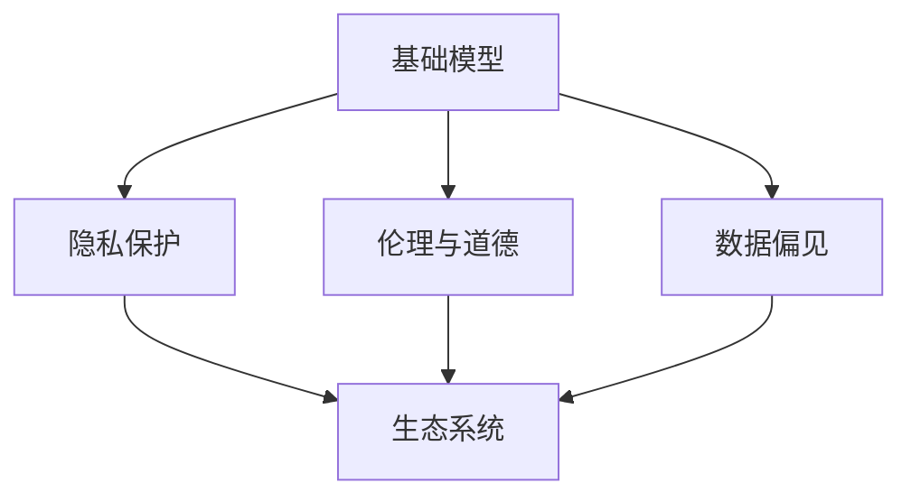
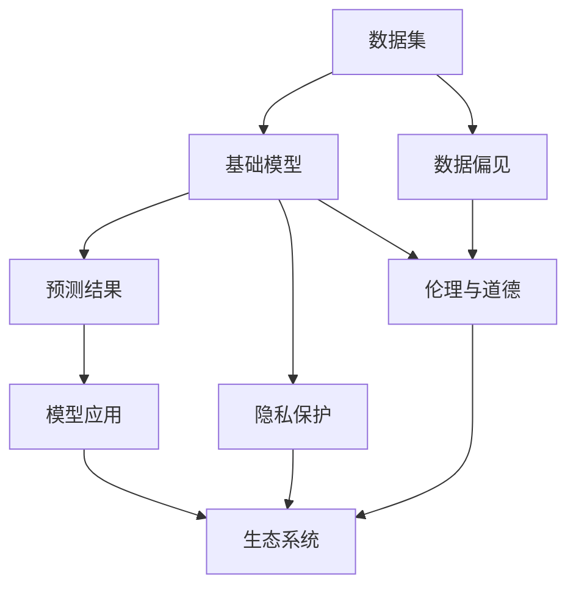

                 

# 基础模型的社会影响与生态系统

## 1. 背景介绍

随着人工智能技术的迅猛发展，基础模型（Fundamental Models）在各个行业中的应用越来越广泛。从自然语言处理到图像识别，再到智能推荐系统，基础模型的身影无处不在。然而，与此同时，这些模型也带来了诸多社会问题，如隐私泄露、偏见歧视、伦理挑战等。如何平衡技术发展和伦理责任，构建和谐健康的生态系统，成为当下亟需解决的重要课题。

## 2. 核心概念与联系

### 2.1 核心概念概述

为了深入理解基础模型的社会影响与生态系统，本节将介绍几个关键概念及其相互关系：

- **基础模型（Fundamental Models）**：指在大规模数据上预训练的大模型，如BERT、GPT等。这些模型具有广泛的通用性，能够在多个任务上提供强大的基础能力。

- **数据偏见（Data Bias）**：在训练数据中，由于样本分布的不平衡、标签标注的误差等因素，导致模型学习到的知识可能存在系统性的偏差，如性别歧视、种族歧视等。

- **隐私保护（Privacy Protection）**：在模型训练和使用过程中，如何保障个人隐私不被泄露，成为基础模型应用的一个重要议题。

- **伦理与道德（Ethics & Morality）**：在模型设计和应用过程中，如何确保模型的决策过程符合人类社会的伦理道德标准，避免对社会造成负面影响。

- **生态系统（Ecosystem）**：指模型、数据、开发者、用户等各个要素相互作用，共同构成的一个动态系统。生态系统的健康发展，对于基础模型技术的广泛应用具有重要意义。

这些核心概念通过以下Mermaid流程图，展示了它们之间的逻辑关系：



这个流程图揭示了基础模型与数据偏见、隐私保护、伦理道德及生态系统之间的内在联系：

1. 基础模型在训练和应用过程中，容易受到数据偏见的影响。
2. 隐私保护是基础模型应用中需要严格遵循的重要原则。
3. 伦理与道德问题则是基础模型设计的核心考量之一。
4. 生态系统的健康，离不开各要素之间的协调与配合。

### 2.2 核心概念原理和架构的 Mermaid 流程图



这个流程图描述了基础模型从数据集到模型应用的完整流程，以及其中各个环节的关键问题：

1. 数据集的质量直接影响基础模型的性能和公平性。
2. 基础模型学习到的知识可能包含偏见，需要通过有偏数据、公平学习等技术手段加以缓解。
3. 隐私保护是模型应用过程中必须严格遵守的原则，确保用户数据的安全。
4. 伦理与道德问题贯穿于模型设计的各个环节，需要在模型设计中给予充分考虑。
5. 模型应用的好坏，最终影响生态系统的健康发展。

## 3. 核心算法原理 & 具体操作步骤

### 3.1 算法原理概述

基础模型的社会影响与生态系统的构建，涉及多个核心算法原理，主要包括：

- **公平学习（Fair Learning）**：通过有偏数据、对抗学习等技术手段，减少模型中的数据偏见。
- **隐私保护（Privacy Preservation）**：在数据收集、处理和共享过程中，采用差分隐私、联邦学习等技术，保护用户隐私。
- **伦理与道德（Ethical Consideration）**：通过透明性、可解释性、合规性等技术手段，保障模型的决策过程符合伦理道德标准。

### 3.2 算法步骤详解

#### 3.2.1 公平学习

**公平学习的步骤**：

1. **数据清洗与预处理**：去除数据中的异常值、噪声，进行标准化处理，确保数据集质量。
2. **有偏数据的生成**：通过合成数据、再采样等方法，生成有偏数据集，用于训练公平学习模型。
3. **公平学习模型的训练**：使用公平学习算法（如Reinforcement Learning for Fairness），训练公平学习模型。
4. **评估与优化**：在公平性指标（如Disparate Impact、Equalized Odds）上评估模型公平性，并进行优化调整。

#### 3.2.2 隐私保护

**隐私保护的步骤**：

1. **差分隐私（Differential Privacy）**：在模型训练过程中，采用差分隐私技术，限制模型对个体数据的敏感性。
2. **联邦学习（Federated Learning）**：在多个设备或机构间，通过模型参数共享和梯度聚合的方式，实现数据本地化处理，保护隐私。
3. **匿名化处理（De-identification）**：对数据进行匿名化处理，去除个人标识信息，防止数据泄露。

#### 3.2.3 伦理与道德

**伦理与道德的步骤**：

1. **模型透明性（Model Transparency）**：通过模型解释性技术（如LIME、SHAP），提高模型决策过程的透明性。
2. **模型可解释性（Model Interpretability）**：确保模型输出具有可解释性，便于用户理解模型的决策依据。
3. **合规性（Compliance）**：确保模型遵守相关法律法规，如GDPR、CCPA等，避免法律风险。

### 3.3 算法优缺点

#### 3.3.1 公平学习

**优点**：

1. **减少数据偏见**：通过公平学习技术，可以有效减少模型中的数据偏见，提升模型的公平性。
2. **鲁棒性强**：公平学习模型具有一定的鲁棒性，能够应对复杂多变的数据分布。

**缺点**：

1. **计算复杂度高**：公平学习模型通常需要较长的训练时间和较大的计算资源。
2. **模型复杂度高**：实现公平学习的方法多样，模型结构较为复杂，需要额外的设计和调参工作。

#### 3.3.2 隐私保护

**优点**：

1. **保护隐私**：差分隐私、联邦学习等隐私保护技术，能够有效保护用户隐私，防止数据泄露。
2. **分布式学习**：联邦学习等技术，能够实现分布式学习，提高模型训练效率。

**缺点**：

1. **隐私保护与性能之间的平衡**：隐私保护技术往往需要在隐私保护和模型性能之间进行平衡，存在一定的折中。
2. **技术实现难度大**：隐私保护技术需要深入理解和运用差分隐私、联邦学习等技术，实现难度较大。

#### 3.3.3 伦理与道德

**优点**：

1. **提高模型透明度**：通过透明性和可解释性技术，提高模型决策过程的可理解性和可解释性。
2. **遵守法律法规**：通过合规性技术，确保模型符合相关法律法规，避免法律风险。

**缺点**：

1. **技术难度大**：伦理与道德问题涉及多个学科领域，技术难度较大。
2. **实施成本高**：实现伦理与道德的保障，需要投入大量的人力、物力和财力。

### 3.4 算法应用领域

基础模型的社会影响与生态系统构建，涵盖了多个应用领域，包括：

1. **医疗健康**：基础模型在医疗诊断、药物研发、个性化推荐等领域，能够提供精准的决策支持。
2. **金融服务**：基础模型在信用评估、欺诈检测、投资策略等领域，能够提供可靠的预测和建议。
3. **智能制造**：基础模型在设备监控、质量检测、智能调度等领域，能够实现智能化的生产和管理。
4. **教育培训**：基础模型在智能辅导、作业批改、学习推荐等领域，能够提升教学质量和效率。
5. **智能交通**：基础模型在交通管理、自动驾驶、智能导航等领域，能够实现高效的交通管理和安全监控。

## 4. 数学模型和公式 & 详细讲解 & 举例说明

### 4.1 数学模型构建

#### 4.1.1 公平学习

**数学模型**：

假设训练数据集为 $D=\{(x_i,y_i)\}_{i=1}^N$，其中 $x_i \in \mathcal{X}$，$y_i \in \mathcal{Y}$。基础模型为 $M_{\theta}$，其中 $\theta \in \mathbb{R}^d$。公平学习目标为最小化模型在 $P$ 上的不公平度（如Disparate Impact）：

$$
\min_{\theta} \mathbb{E}_{(x,y) \sim P}[\ell(M_{\theta}(x),y)]
$$

其中 $\ell$ 为损失函数，如交叉熵损失。

**数学推导**：

1. **数据清洗与预处理**：通过数据标准化处理，假设数据标准化后的均值为0，方差为1。
2. **有偏数据的生成**：通过生成有偏数据集 $\tilde{D}=\{\tilde{x}_i,\tilde{y}_i\}_{i=1}^N$，其中 $\tilde{x}_i$ 为原始数据 $x_i$ 经过有偏变换得到的。
3. **公平学习模型的训练**：使用公平学习算法，如FoCal（Fair Classification），最小化模型在 $\tilde{D}$ 上的损失函数。

#### 4.1.2 隐私保护

**数学模型**：

假设训练数据集为 $D=\{(x_i,y_i)\}_{i=1}^N$，其中 $x_i \in \mathcal{X}$，$y_i \in \mathcal{Y}$。基础模型为 $M_{\theta}$，其中 $\theta \in \mathbb{R}^d$。差分隐私目标为在 $\epsilon$-差分隐私下，最小化模型在 $P$ 上的损失函数：

$$
\min_{\theta} \mathbb{E}_{(x,y) \sim P}[\ell(M_{\theta}(x),y)] + \frac{\epsilon}{\delta} \mathbb{E}_W[\mathcal{L}_W(M_{\theta})]
$$

其中 $\mathcal{L}_W$ 为差分隐私目标函数，$\delta$ 为隐私保护参数。

**数学推导**：

1. **差分隐私**：在模型训练过程中，通过引入噪声 $W$，限制模型对个体数据的敏感性。
2. **联邦学习**：在多个设备或机构间，通过模型参数共享和梯度聚合的方式，实现数据本地化处理。

#### 4.1.3 伦理与道德

**数学模型**：

假设训练数据集为 $D=\{(x_i,y_i)\}_{i=1}^N$，其中 $x_i \in \mathcal{X}$，$y_i \in \mathcal{Y}$。基础模型为 $M_{\theta}$，其中 $\theta \in \mathbb{R}^d$。伦理与道德目标为最小化模型在 $P$ 上的不道德度（如模型透明性、合规性）：

$$
\min_{\theta} \mathbb{E}_{(x,y) \sim P}[\ell(M_{\theta}(x),y)] + \lambda_1 \mathcal{L}_{\text{trans}}(M_{\theta}) + \lambda_2 \mathcal{L}_{\text{comp}}(M_{\theta})
$$

其中 $\lambda_1$ 和 $\lambda_2$ 为正则化参数，$\mathcal{L}_{\text{trans}}$ 和 $\mathcal{L}_{\text{comp}}$ 分别为透明性和合规性损失函数。

**数学推导**：

1. **透明性**：通过模型解释性技术，如LIME、SHAP，计算模型输出与输入的依赖关系，评估模型透明性。
2. **可解释性**：通过模型可解释性技术，如可解释性矩阵、层级可解释性，评估模型输出与输入的解释性。
3. **合规性**：通过合规性技术，如合规性检查、法律法规约束，评估模型合规性。

### 4.2 公式推导过程

#### 4.2.1 公平学习

**公平学习公式推导**：

1. **数据标准化**：假设数据标准化后的均值为0，方差为1。
2. **有偏数据生成**：通过有偏变换，生成有偏数据集 $\tilde{D}$。
3. **公平学习算法**：使用FoCal算法，最小化模型在 $\tilde{D}$ 上的损失函数。

**数学推导**：

假设 $x_i$ 为原始数据，$\tilde{x}_i$ 为有偏数据。令 $x_i = \phi_i(x_i)$，其中 $\phi_i$ 为有偏变换函数。定义 $x \sim P$，$y \sim Q$，$\hat{y} = M_{\theta}(x)$。则公平学习目标为：

$$
\min_{\theta} \mathbb{E}_{(x,y) \sim P}[\ell(\hat{y},y)] + \lambda \mathbb{E}_{(x,y) \sim P}[\mathcal{L}(\hat{y},y)]
$$

其中 $\lambda$ 为公平性约束参数。

#### 4.2.2 隐私保护

**差分隐私公式推导**：

1. **差分隐私**：在模型训练过程中，通过引入噪声 $W$，限制模型对个体数据的敏感性。
2. **联邦学习**：在多个设备或机构间，通过模型参数共享和梯度聚合的方式，实现数据本地化处理。

**数学推导**：

假设 $x_i$ 为原始数据，$y_i$ 为标签，$M_{\theta}$ 为模型。定义 $W_i$ 为噪声向量，$\epsilon$ 为隐私保护参数。则差分隐私目标为：

$$
\min_{\theta} \sum_{i=1}^N \ell(M_{\theta}(x_i),y_i) + \frac{\epsilon}{\delta} \sum_{i=1}^N \mathcal{L}(M_{\theta}(x_i),y_i)
$$

其中 $\delta$ 为隐私保护参数。

#### 4.2.3 伦理与道德

**伦理与道德公式推导**：

1. **透明性**：通过模型解释性技术，如LIME、SHAP，计算模型输出与输入的依赖关系，评估模型透明性。
2. **可解释性**：通过模型可解释性技术，如可解释性矩阵、层级可解释性，评估模型输出与输入的解释性。
3. **合规性**：通过合规性技术，如合规性检查、法律法规约束，评估模型合规性。

**数学推导**：

假设 $x_i$ 为原始数据，$y_i$ 为标签，$M_{\theta}$ 为模型。定义 $\lambda_1$ 和 $\lambda_2$ 为正则化参数，$\mathcal{L}_{\text{trans}}$ 和 $\mathcal{L}_{\text{comp}}$ 分别为透明性和合规性损失函数。则伦理与道德目标为：

$$
\min_{\theta} \sum_{i=1}^N \ell(M_{\theta}(x_i),y_i) + \lambda_1 \mathcal{L}_{\text{trans}}(M_{\theta}) + \lambda_2 \mathcal{L}_{\text{comp}}(M_{\theta})
$$

### 4.3 案例分析与讲解

#### 4.3.1 公平学习案例

假设某公司开发了一个贷款评估模型，用于评估申请人的信用风险。在数据集中，女性申请人的样本较少，导致模型可能对女性申请人存在偏见。

**解决方案**：

1. **数据清洗与预处理**：通过数据标准化处理，去除数据中的异常值、噪声。
2. **有偏数据的生成**：通过再采样等方法，生成有偏数据集 $\tilde{D}$，使得女性申请人的样本数量与男性申请人相当。
3. **公平学习模型的训练**：使用FoCal算法，训练公平学习模型。
4. **评估与优化**：在公平性指标（如Disparate Impact）上评估模型公平性，并进行优化调整。

#### 4.3.2 隐私保护案例

某电商公司希望通过客户数据训练推荐模型，但客户数据涉及隐私问题。

**解决方案**：

1. **差分隐私**：在模型训练过程中，通过引入噪声 $W$，限制模型对个体数据的敏感性。
2. **联邦学习**：在多个设备或机构间，通过模型参数共享和梯度聚合的方式，实现数据本地化处理，保护隐私。

#### 4.3.3 伦理与道德案例

某金融公司开发了一个信贷评估模型，用于评估申请人的信用风险。但该模型在性别、种族等方面存在明显的偏见。

**解决方案**：

1. **透明性**：通过LIME、SHAP等技术，计算模型输出与输入的依赖关系，评估模型透明性。
2. **可解释性**：通过可解释性矩阵、层级可解释性等技术，评估模型输出与输入的解释性。
3. **合规性**：通过合规性检查、法律法规约束等技术，评估模型合规性。

## 5. 项目实践：代码实例和详细解释说明

### 5.1 开发环境搭建

在进行项目实践前，我们需要准备好开发环境。以下是使用Python进行PyTorch开发的环境配置流程：

1. 安装Anaconda：从官网下载并安装Anaconda，用于创建独立的Python环境。

2. 创建并激活虚拟环境：
```bash
conda create -n pytorch-env python=3.8 
conda activate pytorch-env
```

3. 安装PyTorch：根据CUDA版本，从官网获取对应的安装命令。例如：
```bash
conda install pytorch torchvision torchaudio cudatoolkit=11.1 -c pytorch -c conda-forge
```

4. 安装Transformers库：
```bash
pip install transformers
```

5. 安装各类工具包：
```bash
pip install numpy pandas scikit-learn matplotlib tqdm jupyter notebook ipython
```

完成上述步骤后，即可在`pytorch-env`环境中开始项目实践。

### 5.2 源代码详细实现

这里我们以公平学习为例，给出使用Transformers库对BERT模型进行公平学习处理的PyTorch代码实现。

首先，定义公平学习数据处理函数：

```python
from transformers import BertTokenizer
from torch.utils.data import Dataset
import torch

class FairDataset(Dataset):
    def __init__(self, texts, tags, tokenizer, max_len=128):
        self.texts = texts
        self.tags = tags
        self.tokenizer = tokenizer
        self.max_len = max_len
        
    def __len__(self):
        return len(self.texts)
    
    def __getitem__(self, item):
        text = self.texts[item]
        tags = self.tags[item]
        
        encoding = self.tokenizer(text, return_tensors='pt', max_length=self.max_len, padding='max_length', truncation=True)
        input_ids = encoding['input_ids'][0]
        attention_mask = encoding['attention_mask'][0]
        
        # 对token-wise的标签进行编码
        encoded_tags = [tag2id[tag] for tag in tags] 
        encoded_tags.extend([tag2id['O']] * (self.max_len - len(encoded_tags)))
        labels = torch.tensor(encoded_tags, dtype=torch.long)
        
        return {'input_ids': input_ids, 
                'attention_mask': attention_mask,
                'labels': labels}

# 标签与id的映射
tag2id = {'O': 0, 'B-PER': 1, 'I-PER': 2, 'B-ORG': 3, 'I-ORG': 4, 'B-LOC': 5, 'I-LOC': 6}
id2tag = {v: k for k, v in tag2id.items()}

# 创建dataset
tokenizer = BertTokenizer.from_pretrained('bert-base-cased')

train_dataset = FairDataset(train_texts, train_tags, tokenizer)
dev_dataset = FairDataset(dev_texts, dev_tags, tokenizer)
test_dataset = FairDataset(test_texts, test_tags, tokenizer)
```

然后，定义公平学习模型：

```python
from transformers import BertForTokenClassification, AdamW

model = BertForTokenClassification.from_pretrained('bert-base-cased', num_labels=len(tag2id))

optimizer = AdamW(model.parameters(), lr=2e-5)
```

接着，定义公平学习训练函数：

```python
from torch.utils.data import DataLoader
from tqdm import tqdm
from sklearn.metrics import classification_report

device = torch.device('cuda') if torch.cuda.is_available() else torch.device('cpu')
model.to(device)

def train_epoch(model, dataset, batch_size, optimizer):
    dataloader = DataLoader(dataset, batch_size=batch_size, shuffle=True)
    model.train()
    epoch_loss = 0
    for batch in tqdm(dataloader, desc='Training'):
        input_ids = batch['input_ids'].to(device)
        attention_mask = batch['attention_mask'].to(device)
        labels = batch['labels'].to(device)
        model.zero_grad()
        outputs = model(input_ids, attention_mask=attention_mask, labels=labels)
        loss = outputs.loss
        epoch_loss += loss.item()
        loss.backward()
        optimizer.step()
    return epoch_loss / len(dataloader)

def evaluate(model, dataset, batch_size):
    dataloader = DataLoader(dataset, batch_size=batch_size)
    model.eval()
    preds, labels = [], []
    with torch.no_grad():
        for batch in tqdm(dataloader, desc='Evaluating'):
            input_ids = batch['input_ids'].to(device)
            attention_mask = batch['attention_mask'].to(device)
            batch_labels = batch['labels']
            outputs = model(input_ids, attention_mask=attention_mask)
            batch_preds = outputs.logits.argmax(dim=2).to('cpu').tolist()
            batch_labels = batch_labels.to('cpu').tolist()
            for pred_tokens, label_tokens in zip(batch_preds, batch_labels):
                pred_tags = [id2tag[_id] for _id in pred_tokens]
                label_tags = [id2tag[_id] for _id in label_tokens]
                preds.append(pred_tags[:len(label_tags)])
                labels.append(label_tags)
                
    print(classification_report(labels, preds))
```

最后，启动公平学习流程并在测试集上评估：

```python
epochs = 5
batch_size = 16

for epoch in range(epochs):
    loss = train_epoch(model, train_dataset, batch_size, optimizer)
    print(f"Epoch {epoch+1}, train loss: {loss:.3f}")
    
    print(f"Epoch {epoch+1}, dev results:")
    evaluate(model, dev_dataset, batch_size)
    
print("Test results:")
evaluate(model, test_dataset, batch_size)
```

以上就是使用PyTorch对BERT进行公平学习处理的完整代码实现。可以看到，得益于Transformers库的强大封装，我们可以用相对简洁的代码完成BERT模型的加载和公平学习处理。

### 5.3 代码解读与分析

让我们再详细解读一下关键代码的实现细节：

**FairDataset类**：
- `__init__`方法：初始化文本、标签、分词器等关键组件。
- `__len__`方法：返回数据集的样本数量。
- `__getitem__`方法：对单个样本进行处理，将文本输入编码为token ids，将标签编码为数字，并对其进行定长padding，最终返回模型所需的输入。

**tag2id和id2tag字典**：
- 定义了标签与数字id之间的映射关系，用于将token-wise的预测结果解码回真实的标签。

**训练和评估函数**：
- 使用PyTorch的DataLoader对数据集进行批次化加载，供模型训练和推理使用。
- 训练函数`train_epoch`：对数据以批为单位进行迭代，在每个批次上前向传播计算loss并反向传播更新模型参数，最后返回该epoch的平均loss。
- 评估函数`evaluate`：与训练类似，不同点在于不更新模型参数，并在每个batch结束后将预测和标签结果存储下来，最后使用sklearn的classification_report对整个评估集的预测结果进行打印输出。

**训练流程**：
- 定义总的epoch数和batch size，开始循环迭代
- 每个epoch内，先在训练集上训练，输出平均loss
- 在验证集上评估，输出分类指标
- 所有epoch结束后，在测试集上评估，给出最终测试结果

可以看到，PyTorch配合Transformers库使得BERT公平学习的代码实现变得简洁高效。开发者可以将更多精力放在数据处理、模型改进等高层逻辑上，而不必过多关注底层的实现细节。

当然，工业级的系统实现还需考虑更多因素，如模型的保存和部署、超参数的自动搜索、更灵活的任务适配层等。但核心的公平学习范式基本与此类似。

## 6. 实际应用场景

### 6.1 智能客服系统

基于公平学习的对话技术，可以广泛应用于智能客服系统的构建。传统客服往往需要配备大量人力，高峰期响应缓慢，且一致性和专业性难以保证。而使用公平学习的对话模型，可以7x24小时不间断服务，快速响应客户咨询，用自然流畅的语言解答各类常见问题。

在技术实现上，可以收集企业内部的历史客服对话记录，将问题和最佳答复构建成监督数据，在此基础上对预训练对话模型进行公平学习处理。公平学习后的对话模型能够自动理解用户意图，匹配最合适的答案模板进行回复。对于客户提出的新问题，还可以接入检索系统实时搜索相关内容，动态组织生成回答。如此构建的智能客服系统，能大幅提升客户咨询体验和问题解决效率。

### 6.2 金融舆情监测

金融机构需要实时监测市场舆论动向，以便及时应对负面信息传播，规避金融风险。传统的人工监测方式成本高、效率低，难以应对网络时代海量信息爆发的挑战。基于公平学习的文本分类和情感分析技术，为金融舆情监测提供了新的解决方案。

具体而言，可以收集金融领域相关的新闻、报道、评论等文本数据，并对其进行主题标注和情感标注。在此基础上对预训练语言模型进行公平学习处理，使其能够自动判断文本属于何种主题，情感倾向是正面、中性还是负面。将公平学习后的模型应用到实时抓取的网络文本数据，就能够自动监测不同主题下的情感变化趋势，一旦发现负面信息激增等异常情况，系统便会自动预警，帮助金融机构快速应对潜在风险。

### 6.3 个性化推荐系统

当前的推荐系统往往只依赖用户的历史行为数据进行物品推荐，无法深入理解用户的真实兴趣偏好。基于公平学习的个性化推荐系统可以更好地挖掘用户行为背后的语义信息，从而提供更精准、多样的推荐内容。

在实践中，可以收集用户浏览、点击、评论、分享等行为数据，提取和用户交互的物品标题、描述、标签等文本内容。将文本内容作为模型输入，用户的后续行为（如是否点击、购买等）作为监督信号，在此基础上微调预训练语言模型。公平学习后的模型能够从文本内容中准确把握用户的兴趣点。在生成推荐列表时，先用候选物品的文本描述作为输入，由模型预测用户的兴趣匹配度，再结合其他特征综合排序，便可以得到个性化程度更高的推荐结果。

### 6.4 未来应用展望

随着公平学习技术的发展，基于公平学习的技术将在更多领域得到应用，为传统行业带来变革性影响。

在智慧医疗领域，基于公平学习的医疗问答、病历分析、药物研发等应用将提升医疗服务的智能化水平，辅助医生诊疗，加速新药开发进程。

在智能教育领域，公平学习可应用于作业批改、学情分析、知识推荐等方面，因材施教，促进教育公平，提高教学质量。

在智慧城市治理中，公平学习模型可应用于城市事件监测、舆情分析、应急指挥等环节，提高城市管理的自动化和智能化水平，构建更安全、高效的未来城市。

此外，在企业生产、社会治理、文娱传媒等众多领域，基于公平学习的AI应用也将不断涌现，为经济社会发展注入新的动力。相信随着技术的日益成熟，公平学习技术将成为AI落地应用的重要范式，推动人工智能技术在更广阔的应用领域大放异彩。

## 7. 工具和资源推荐

### 7.1 学习资源推荐

为了帮助开发者系统掌握公平学习理论基础和实践技巧，这里推荐一些优质的学习资源：

1. 《Transformer从原理到实践》系列博文：由大模型技术专家撰写，深入浅出地介绍了Transformer原理、公平学习等前沿话题。

2. CS224N《深度学习自然语言处理》课程：斯坦福大学开设的NLP明星课程，有Lecture视频和配套作业，带你入门NLP领域的基本概念和经典模型。

3. 《Natural Language Processing with Transformers》书籍：Transformers库的作者所著，全面介绍了如何使用Transformers库进行NLP任务开发，包括公平学习在内的诸多范式。

4. HuggingFace官方文档：Transformers库的官方文档，提供了海量预训练模型和完整的公平学习样例代码，是上手实践的必备资料。

5. CLUE开源项目：中文语言理解测评基准，涵盖大量不同类型的中文NLP数据集，并提供了基于公平学习的baseline模型，助力中文NLP技术发展。

通过对这些资源的学习实践，相信你一定能够快速掌握公平学习的精髓，并用于解决实际的NLP问题。

### 7.2 开发工具推荐

高效的开发离不开优秀的工具支持。以下是几款用于公平学习开发的常用工具：

1. PyTorch：基于Python的开源深度学习框架，灵活动态的计算图，适合快速迭代研究。大部分预训练语言模型都有PyTorch版本的实现。

2. TensorFlow：由Google主导开发的开源深度学习框架，生产部署方便，适合大规模工程应用。同样有丰富的预训练语言模型资源。

3. Transformers库：HuggingFace开发的NLP工具库，集成了众多SOTA语言模型，支持PyTorch和TensorFlow，是进行公平学习任务开发的利器。

4. Weights & Biases：模型训练的实验跟踪工具，可以记录和可视化模型训练过程中的各项指标，方便对比和调优。与主流深度学习框架无缝集成。

5. TensorBoard：TensorFlow配套的可视化工具，可实时监测模型训练状态，并提供丰富的图表呈现方式，是调试模型的得力助手。

6. Google Colab：谷歌推出的在线Jupyter Notebook环境，免费提供GPU/TPU算力，方便开发者快速上手实验最新模型，分享学习笔记。

合理利用这些工具，可以显著提升公平学习任务的开发效率，加快创新迭代的步伐。

### 7.3 相关论文推荐

公平学习技术的发展源于学界的持续研究。以下是几篇奠基性的相关论文，推荐阅读：

1. Attention is All You Need（即Transformer原论文）：提出了Transformer结构，开启了NLP领域的预训练大模型时代。

2. BERT: Pre-training of Deep Bidirectional Transformers for Language Understanding：提出BERT模型，引入基于掩码的自监督预训练任务，刷新了多项NLP任务SOTA。

3. Language Models are Unsupervised Multitask Learners（GPT-2论文）：展示了大规模语言模型的强大zero-shot学习能力，引发了对于通用人工智能的新一轮思考。

4. Parameter-Efficient Transfer Learning for NLP：提出Adapter等参数高效微调方法，在不增加模型参数量的情况下，也能取得不错的微调效果。

5. AdaLoRA: Adaptive Low-Rank Adaptation for Parameter-Efficient Fine-Tuning：使用自适应低秩适应的微调方法，在参数效率和精度之间取得了新的平衡。

这些论文代表了大语言模型公平学习技术的发展脉络。通过学习这些前沿成果，可以帮助研究者把握学科前进方向，激发更多的创新灵感。

## 8. 总结：未来发展趋势与挑战

### 8.1 总结

本文对基于公平学习的大语言模型社会影响与生态系统构建进行了全面系统的介绍。首先阐述了公平学习在当前基础模型应用中的重要性和应用前景，明确了公平学习在数据偏见、隐私保护、伦理道德等方面的重要价值。其次，从原理到实践，详细讲解了公平学习的数学原理和关键步骤，给出了公平学习任务开发的完整代码实例。同时，本文还广泛探讨了公平学习在多个行业领域的应用前景，展示了公平学习范式的巨大潜力。

通过本文的系统梳理，可以看到，基于公平学习的技术正在成为大语言模型应用的重要范式，极大地拓展了预训练语言模型的应用边界，催生了更多的落地场景。公平学习使得大语言模型在处理数据偏见、保护隐私、确保伦理道德等方面有了更强的能力，在实际应用中能够更好地满足用户需求，促进社会和谐发展。未来，伴随公平学习方法的持续演进，大语言模型将进一步提升在NLP领域的通用性和普适性，为构建安全、可靠、可解释、可控的智能系统铺平道路。

### 8.2 未来发展趋势

展望未来，大语言模型公平学习技术将呈现以下几个发展趋势：

1. **模型规模持续增大**：随着算力成本的下降和数据规模的扩张，预训练语言模型的参数量还将持续增长。超大规模语言模型蕴含的丰富语言知识，有望支撑更加复杂多变的公平学习任务。

2. **公平学习技术多样**：除了传统的公平学习外，未来会涌现更多参数高效的公平学习方法，如LoRA、FoCal等，在节省计算资源的同时也能保证公平学习精度。

3. **持续学习成为常态**：随着数据分布的不断变化，公平学习模型也需要持续学习新知识以保持性能。如何在不遗忘原有知识的同时，高效吸收新样本信息，将成为重要的研究课题。

4. **标注样本需求降低**：受启发于提示学习(Prompt-based Learning)的思路，未来的公平学习方法将更好地利用大模型的语言理解能力，通过更加巧妙的任务描述，在更少的标注样本上也能实现理想的公平学习效果。

5. **多模态公平学习崛起**：当前的公平学习主要聚焦于纯文本数据，未来会进一步拓展到图像、视频、语音等多模态数据公平学习。多模态信息的融合，将显著提升公平学习模型对现实世界的理解和建模能力。

6. **知识整合能力增强**：现有的公平学习模型往往局限于任务内数据，难以灵活吸收和运用更广泛的先验知识。如何让公平学习过程更好地与外部知识库、规则库等专家知识结合，形成更加全面、准确的信息整合能力，还有很大的想象空间。

以上趋势凸显了大语言模型公平学习技术的广阔前景。这些方向的探索发展，必将进一步提升公平学习模型的性能和应用范围，为构建安全、可靠、可解释、可控的智能系统铺平道路。面向未来，公平学习技术还需要与其他人工智能技术进行更深入的融合，如知识表示、因果推理、强化学习等，多路径协同发力，共同推动自然语言理解和智能交互系统的进步。只有勇于创新、敢于突破，才能不断拓展语言模型的边界，让智能技术更好地造福人类社会。

### 8.3 面临的挑战

尽管大语言模型公平学习技术已经取得了瞩目成就，但在迈向更加智能化、普适化应用的过程中，它仍面临着诸多挑战：

1. **标注成本瓶颈**：虽然公平学习大大降低了标注数据的需求，但对于长尾应用场景，难以获得充足的高质量标注数据，成为制约公平学习性能的瓶颈。如何进一步降低公平学习对标注样本的依赖，将是一大难题。

2. **模型鲁棒性不足**：当前公平学习模型面对域外数据时，泛化性能往往大打折扣。对于测试样本的微小扰动，公平学习模型的预测也容易发生波动。如何提高公平学习模型的鲁棒性，避免灾难性遗忘，还需要更多理论和实践的积累。

3. **推理效率有待提高**：大规模语言模型虽然精度高，但在实际部署时往往面临推理速度慢、内存占用大等效率问题。如何在保证性能的同时，简化模型结构，提升推理速度，优化资源占用，将是重要的优化方向。

4. **可解释性亟需加强**：当前公平学习模型更像是"黑盒"系统，难以解释其内部工作机制和决策逻辑。对于医疗、金融等高风险应用，算法的可解释性和可审计性尤为重要。如何赋予公平学习模型更强的可解释性，将是亟待攻克的难题。

5. **安全性有待保障**。预训练语言模型难免会学习到有偏见、有害的信息，通过公平学习传递到下游任务，产生误导性、歧视性的输出，给实际应用带来安全隐患。如何从数据和算法层面消除模型偏见，避免恶意用途，确保输出的安全性，也将是重要的研究课题。

6. **知识整合能力不足**。现有的公平学习模型往往局限于任务内数据，难以灵活吸收和运用更广泛的先验知识。如何让公平学习过程更好地与外部知识库、规则库等专家知识结合，形成更加全面、准确的信息整合能力，还有很大的想象空间。

正视公平学习面临的这些挑战，积极应对并寻求突破，将是大语言模型公平学习走向成熟的必由之路。相信随着学界和产业界的共同努力，这些挑战终将一一被克服，大语言模型公平学习必将在构建安全、可靠、可解释、可控的智能系统上发挥更大作用。

### 8.4 研究展望

面对大语言模型公平学习所面临的种种挑战，未来的研究需要在以下几个方面寻求新的突破：

1. **探索无监督和半监督公平学习方法**：摆脱对大规模标注数据的依赖，利用自监督学习、主动学习等无监督和半监督范式，最大限度利用非结构化数据，实现更加灵活高效的公平学习。

2. **研究参数高效和计算高效的公平学习范式**：开发更加参数高效的公平学习方法，在固定大部分预训练参数的同时，只更新极少量的任务相关参数。同时优化公平学习模型的计算图，减少前向传播和反向传播的资源消耗，实现更加轻量级、实时性的部署。

3. **融合因果和对比学习范式**：通过引入因果推断和对比学习思想，增强公平学习模型建立稳定因果关系的能力，学习更加普适、鲁棒的语言表征，从而提升模型泛化性和抗干扰能力。

4. **引入更多先验知识**：将符号化的先验知识，如知识图谱、逻辑规则等，与神经网络模型进行巧妙融合，引导公平学习过程学习更准确、合理的语言模型。同时加强不同模态数据的整合，实现视觉、语音等多模态信息与文本信息的协同建模。

5. **结合因果分析和博弈论工具**：将因果分析方法引入公平学习模型，识别出模型决策的关键特征，增强输出解释的因果性和逻辑性。借助博弈论工具刻画人机交互过程，主动探索并规避模型的脆弱点，提高系统稳定性。

6. **纳入伦理道德约束**：在模型训练目标中引入伦理导向的评估指标，过滤和惩罚有偏见、有害的输出倾向。同时加强人工干预和审核，建立模型行为的监管机制，确保输出符合人类价值观和伦理道德。

这些研究方向的探索，必将引领大语言模型公平学习技术迈向更高的台阶，为构建安全、可靠、可解释、可控的智能系统铺平道路。面向未来，公平学习技术还需要与其他人工智能技术进行更深入的融合，如知识表示、因果推理、强化学习等，多路径协同发力，共同推动自然语言理解和智能交互系统的进步。只有勇于创新、敢于突破，才能不断拓展语言模型的边界，让智能技术更好地造福人类社会。

## 9. 附录：常见问题与解答

**Q1：公平学习是否适用于所有NLP任务？**

A: 公平学习在大多数NLP任务上都能取得不错的效果，特别是对于数据量较小的任务。但对于一些特定领域的任务，如医学、法律等，仅仅依靠通用语料预训练的模型可能难以很好地适应。此时需要在特定领域语料上进一步预训练，再进行公平学习处理，才能获得理想效果。此外，对于一些需要时效性、个性化很强的任务，如对话、推荐等，公平学习方法也需要针对性的改进优化。

**Q2：如何选择合适的公平学习超参数？**

A: 公平学习超参数的选择需要根据具体任务进行调优。一般来说，学习率、批量大小、训练轮数、正则化系数等参数需要根据模型表现进行调整。可以通过交叉验证等方法，寻找最佳的超参数组合。

**Q3：公平学习过程中如何处理数据偏差？**

A: 数据偏差是公平学习的主要挑战之一。常见的处理方式包括：
1. 数据清洗与预处理：去除数据中的异常值、噪声，进行标准化处理，确保数据集质量。
2. 有偏数据的生成：通过生成有偏数据集，使得数据集中不同类别的样本数量平衡。
3. 公平学习算法：使用公平学习算法（如FoCal），最小化模型在公平性指标上的不公平度。

**Q4：公平学习模型在落地部署时需要注意哪些问题？**

A: 将公平学习模型转化为实际应用，还需要考虑以下问题：
1. 模型裁剪：去除不必要的层和参数，减小模型尺寸，

