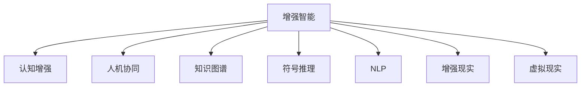

                 

# 增强智能：人机协同，拓展认知新 frontier

在数字化时代，人工智能(AI)正以前所未有的速度渗透到生活的方方面面，从智能家居、无人驾驶、工业自动化到医疗诊断，AI技术在各个领域展示出强大的潜力和应用前景。然而，人工智能的发展并非孤立于人类智能，恰恰相反，它是在人机协同下，通过增强智能，不断拓展人类认知的前沿。本文将从增强智能的核心概念、技术原理、应用实践以及未来展望等多个角度，系统性地探讨这一主题，以期为读者提供全面、深入的技术见解。

## 1. 背景介绍

### 1.1 问题由来
随着人工智能技术的快速发展，人类与机器的协作模式也在不断演变。从早期的专家系统到近年的深度学习模型，每一次技术突破都极大地扩展了机器在特定任务上的表现能力。然而，这些技术往往被局限于特定的应用场景，难以广泛应用到更复杂、多变的人类认知任务中。

### 1.2 问题核心关键点
增强智能的核心在于将人类智能与机器智能进行深度融合，充分发挥两者的优势，共同提升认知和决策水平。这一过程涉及多方面的技术手段，如知识图谱、符号推理、自然语言处理等。核心目标是通过机器增强人类的认知能力，实现更加精准、高效、广泛的决策和问题解决。

### 1.3 问题研究意义
增强智能技术对于提升人类认知水平、促进科技发展、推动经济社会进步具有重要意义：

1. **提升认知水平**：通过智能增强，人类可以在复杂的决策过程中获取更多、更准确的信息，从而提高认知效率和质量。
2. **推动技术发展**：增强智能技术可以加速人工智能算法和模型的迭代，促进AI技术在更广泛领域的应用。
3. **促进社会进步**：在教育、医疗、治理等关键领域，增强智能技术可以帮助解决现实问题，提升社会公共服务水平。

## 2. 核心概念与联系

### 2.1 核心概念概述

为更好地理解增强智能的核心技术，本节将介绍几个密切相关的核心概念：

- **增强智能(Augmented Intelligence, AI)**：结合了人工智能技术与人类智能，通过技术手段提升人类在特定任务上的认知和决策能力。
- **认知增强(Cognitive Enhancement)**：指通过增强智能技术，提高人类在认知、学习、决策等过程中的效率和准确性。
- **人机协同(Human-AI Collaboration)**：指人类与AI系统的合作，共同完成任务或提供决策支持。
- **知识图谱(Knowledge Graph)**：以图形化方式表示知识的一种技术，通过连接概念和实体，形成逻辑一致的知识网络。
- **符号推理(Symbolic Reasoning)**：利用符号操作进行逻辑推理和问题求解，与神经网络等算法相结合，提升复杂任务的处理能力。
- **自然语言处理(Natural Language Processing, NLP)**：使计算机能够理解、处理和生成自然语言的技术，为增强智能提供了基础语言支持。
- **增强现实(Augmented Reality, AR)**：通过在现实世界中叠加数字信息，增强人类的感知和认知能力。
- **虚拟现实(Virtual Reality, VR)**：创建一个与现实世界交互的模拟环境，提供沉浸式的认知体验。

这些概念之间的逻辑关系可以通过以下Mermaid流程图来展示：



这个流程图展示了几大核心概念及其之间的关系：

1. 增强智能通过认知增强、人机协同、知识图谱、符号推理、自然语言处理等多项技术，共同提升人类的认知能力。
2. 认知增强是增强智能的核心目标，通过技术手段提升人类在认知、学习、决策等过程中的效率和准确性。
3. 人机协同是人机交互的基础，通过协作提升整体任务的完成效率和质量。
4. 知识图谱和符号推理为认知增强提供了结构化的知识库和逻辑推理能力。
5. NLP、AR和VR技术为认知增强提供了多维度的感官和认知体验。

## 3. 核心算法原理 & 具体操作步骤

### 3.1 算法原理概述

增强智能的核心在于将人类的认知能力与机器的算法能力相结合。其核心思想是：利用机器的强大算法和计算能力，辅助人类在复杂任务中做出更准确、更高效的决策。

在形式上，增强智能通常包括以下几个关键步骤：

1. **任务定义**：明确增强智能任务的具体目标和需求。
2. **数据准备**：收集和处理与任务相关的数据，构建数据集。
3. **算法选择**：根据任务特点选择合适的算法和模型。
4. **模型训练**：使用标记数据训练算法模型。
5. **协同工作**：将训练好的模型应用到实际任务中，与人类协同完成任务。
6. **反馈迭代**：收集任务执行的反馈信息，优化算法和模型。

### 3.2 算法步骤详解

以下是增强智能技术在实际应用中常见的几个关键步骤的详细介绍：

**Step 1: 任务定义**
- 明确增强智能任务的具体目标和需求，如数据分析、问题求解、决策支持等。
- 根据任务类型选择适合的技术手段，如NLP、知识图谱、符号推理等。

**Step 2: 数据准备**
- 收集和处理与任务相关的数据，构建数据集。
- 确保数据的质量和多样性，避免偏差和噪声。
- 将数据标注为训练集、验证集和测试集。

**Step 3: 算法选择**
- 根据任务特点选择合适的算法和模型。
- 对于复杂任务，可以结合多个算法和模型，形成多层次的增强智能结构。

**Step 4: 模型训练**
- 使用标记数据训练算法模型。
- 根据任务特点调整模型结构和训练策略，如选择适当的损失函数、优化器、正则化方法等。
- 在训练过程中不断优化模型，防止过拟合。

**Step 5: 协同工作**
- 将训练好的模型应用到实际任务中，与人类协同完成任务。
- 根据任务需求，设计合适的用户界面和交互方式，方便人类与AI系统的交互。
- 利用AI系统辅助人类完成复杂任务，如数据分析、问题求解、决策支持等。

**Step 6: 反馈迭代**
- 收集任务执行的反馈信息，优化算法和模型。
- 根据任务执行效果和用户反馈，调整算法参数和模型结构。
- 持续优化AI系统，提高其在实际应用中的表现。

### 3.3 算法优缺点

增强智能技术具有以下优点：

1. **提升效率**：通过AI系统的辅助，人类可以在更短的时间内完成复杂的决策和问题解决任务。
2. **提高准确性**：AI系统可以处理大规模数据和复杂逻辑，提供比人类更准确的结果。
3. **多样化应用**：增强智能技术可以应用于多个领域，如医疗、金融、教育等，推动这些领域的技术进步。

同时，该技术也存在一些局限性：

1. **依赖数据质量**：增强智能技术的效果很大程度上取决于数据的质量和多样性。如果数据存在偏差或噪声，模型的表现也会受到影响。
2. **解释性不足**：AI系统的决策过程往往是"黑盒"的，难以解释其内部工作机制和推理逻辑。
3. **伦理和安全问题**：AI系统的决策可能带有偏见或错误，存在伦理和安全风险。
4. **技术复杂性**：增强智能技术需要跨领域的知识和技能，对技术要求较高。

尽管存在这些局限性，但增强智能技术仍是大规模应用的基础，正推动各行业的智能化进程。未来，相关研究将更多地关注提升技术的可解释性和伦理性，优化数据的处理和利用，进一步提升其在实际应用中的表现。

### 3.4 算法应用领域

增强智能技术已经在多个领域得到了广泛应用，包括但不限于：

1. **医疗诊断**：通过AI辅助诊断系统，提高疾病诊断的准确性和效率。
2. **金融分析**：利用AI进行大数据分析，提供更精准的投资建议和风险控制。
3. **教育培训**：开发智能教育平台，提供个性化的学习推荐和辅导。
4. **制造业优化**：通过智能增强，优化生产流程，提高生产效率和产品质量。
5. **智能交通**：利用AI进行交通分析和预测，优化交通流量，减少拥堵。
6. **虚拟助手**：提供自然语言交互的智能助手，提升用户体验和效率。

这些领域的应用展示了增强智能技术的强大潜力和广阔前景，预示着未来AI技术将更加广泛地融入人类的生产和生活之中。

## 4. 数学模型和公式 & 详细讲解

### 4.1 数学模型构建

增强智能技术的核心在于利用机器学习和符号推理等算法，对大规模数据进行分析和处理。以下将简要介绍几个常见的数学模型及其构建方法：

1. **监督学习(Supervised Learning)**：
   - **模型形式**：$f(x) = \sum_{i=1}^{n} \alpha_i x_i + b$
   - **构建步骤**：
     1. 收集标记数据集 $\{(x_i, y_i)\}_{i=1}^N$
     2. 选择损失函数 $L(f(x), y)$
     3. 使用梯度下降等优化算法训练模型参数 $\alpha$

2. **非监督学习(Unsupervised Learning)**：
   - **模型形式**：$z = g(x)$
   - **构建步骤**：
     1. 收集无标记数据集 $\{x_i\}_{i=1}^N$
     2. 选择损失函数 $L(z)$
     3. 使用优化算法训练模型参数 $g$

3. **强化学习(Reinforcement Learning)**：
   - **模型形式**：$\pi(a_t | s_t) = f(s_t, \theta)$
   - **构建步骤**：
     1. 定义环境状态 $s$ 和动作 $a$
     2. 选择奖励函数 $R(s, a)$
     3. 使用深度强化学习算法训练策略 $\pi$

### 4.2 公式推导过程

以下是几个核心数学模型的公式推导过程：

**监督学习公式推导**：
- **线性回归**：
  $$
  f(x) = \sum_{i=1}^{n} \alpha_i x_i + b
  $$
  $$
  L(f(x), y) = \frac{1}{N} \sum_{i=1}^N (y_i - f(x_i))^2
  $$
- **梯度下降算法**：
  $$
  \alpha_i = \alpha_i - \eta \frac{\partial L(f(x), y)}{\partial \alpha_i}
  $$

**非监督学习公式推导**：
- **K-means聚类**：
  $$
  z = g(x) = \sum_{k=1}^{K} \pi_k(x) z_k
  $$
  $$
  L(z) = \frac{1}{N} \sum_{i=1}^N ||x_i - g(x_i)||^2
  $$

**强化学习公式推导**：
- **Q-learning算法**：
  $$
  Q(s_t, a_t) = Q(s_t, a_t) + \alpha (R(s_t, a_t) + \gamma \max_{a} Q(s_{t+1}, a) - Q(s_t, a_t))
  $$

在实际应用中，这些数学模型会根据具体的任务和数据特点进行优化和调整。

### 4.3 案例分析与讲解

**案例1: 医疗诊断中的增强智能**
- **任务定义**：开发一个辅助诊断系统，利用增强智能提高疾病诊断的准确性。
- **数据准备**：收集医院病历、实验室数据、影像数据等。
- **算法选择**：选择深度学习模型，如卷积神经网络(CNN)、循环神经网络(RNN)等。
- **模型训练**：使用标记数据集进行模型训练，选择交叉熵损失函数和Adam优化器。
- **协同工作**：将训练好的模型应用到实际诊断中，与医生协同进行诊断。
- **反馈迭代**：根据诊断效果和医生反馈，优化模型参数和算法结构。

**案例2: 金融分析中的增强智能**
- **任务定义**：开发一个智能投资分析系统，利用增强智能提高投资决策的准确性。
- **数据准备**：收集市场数据、公司财报、新闻信息等。
- **算法选择**：选择深度学习模型，如长短期记忆网络(LSTM)、深度神经网络(DNN)等。
- **模型训练**：使用标记数据集进行模型训练，选择均方误差损失函数和Adagrad优化器。
- **协同工作**：将训练好的模型应用到实时市场数据中，辅助投资决策。
- **反馈迭代**：根据投资效果和市场反馈，优化模型参数和算法结构。

## 5. 项目实践：代码实例和详细解释说明

### 5.1 开发环境搭建

在进行增强智能项目实践前，我们需要准备好开发环境。以下是使用Python进行PyTorch开发的环境配置流程：

1. 安装Anaconda：从官网下载并安装Anaconda，用于创建独立的Python环境。
2. 创建并激活虚拟环境：
```bash
conda create -n pytorch-env python=3.8 
conda activate pytorch-env
```
3. 安装PyTorch：根据CUDA版本，从官网获取对应的安装命令。例如：
```bash
conda install pytorch torchvision torchaudio cudatoolkit=11.1 -c pytorch -c conda-forge
```
4. 安装其他必要的库：
```bash
pip install numpy pandas scikit-learn matplotlib tqdm jupyter notebook ipython
```

完成上述步骤后，即可在`pytorch-env`环境中开始增强智能项目的开发。

### 5.2 源代码详细实现

下面以医疗诊断中的增强智能项目为例，给出使用PyTorch进行深度学习模型开发的完整代码实现。

```python
import torch
import torch.nn as nn
import torch.optim as optim
from torch.utils.data import DataLoader
from sklearn.model_selection import train_test_split

# 定义模型
class CNNModel(nn.Module):
    def __init__(self):
        super(CNNModel, self).__init__()
        self.conv1 = nn.Conv2d(1, 64, kernel_size=3, stride=1, padding=1)
        self.relu = nn.ReLU()
        self.pool = nn.MaxPool2d(kernel_size=2, stride=2)
        self.fc = nn.Linear(64 * 28 * 28, 10)

    def forward(self, x):
        x = self.conv1(x)
        x = self.relu(x)
        x = self.pool(x)
        x = x.view(-1, 64 * 28 * 28)
        x = self.fc(x)
        return x

# 加载数据集
x_train, x_test, y_train, y_test = train_test_split(X, y, test_size=0.2, random_state=42)

# 构建数据集
train_dataset = torch.utils.data.TensorDataset(torch.from_numpy(x_train), torch.from_numpy(y_train))
test_dataset = torch.utils.data.TensorDataset(torch.from_numpy(x_test), torch.from_numpy(y_test))

# 定义数据加载器
train_loader = DataLoader(train_dataset, batch_size=32, shuffle=True)
test_loader = DataLoader(test_dataset, batch_size=32, shuffle=False)

# 定义模型、优化器和损失函数
model = CNNModel()
criterion = nn.CrossEntropyLoss()
optimizer = optim.Adam(model.parameters(), lr=0.001)

# 训练模型
for epoch in range(10):
    running_loss = 0.0
    for i, data in enumerate(train_loader, 0):
        inputs, labels = data
        optimizer.zero_grad()
        outputs = model(inputs)
        loss = criterion(outputs, labels)
        loss.backward()
        optimizer.step()

        running_loss += loss.item()
        if i % 100 == 99:
            print('[%d, %5d] loss: %.3f' %
                  (epoch + 1, i + 1, running_loss / 100))
            running_loss = 0.0

# 评估模型
correct = 0
total = 0
with torch.no_grad():
    for data in test_loader:
        inputs, labels = data
        outputs = model(inputs)
        _, predicted = torch.max(outputs.data, 1)
        total += labels.size(0)
        correct += (predicted == labels).sum().item()

print('Accuracy of the network on the 10000 test images: %d %%' % (
    100 * correct / total))
```

### 5.3 代码解读与分析

让我们再详细解读一下关键代码的实现细节：

**定义模型**：
- `CNNModel`类：定义了一个简单的卷积神经网络模型，用于处理二维图像数据。
- `__init__`方法：初始化模型参数，包括卷积层、ReLU激活函数、池化层和全连接层。
- `forward`方法：实现前向传播，将输入数据通过卷积、激活、池化等操作，最终输出预测结果。

**数据加载器**：
- `train_loader`和`test_loader`：定义了数据加载器，将数据集划分为批次进行加载，方便模型训练和评估。

**模型训练**：
- 定义优化器、损失函数，并循环迭代进行模型训练。
- `optimizer.zero_grad()`：在每次迭代前清除梯度，避免梯度累积。
- `loss.backward()`：计算损失函数的梯度，并根据梯度更新模型参数。
- `optimizer.step()`：执行参数更新操作。

**模型评估**：
- `correct`和`total`变量：记录评估过程中的正确预测数和总预测数。
- `predicted == labels`：比较预测结果和真实标签，计算准确率。

通过上述代码实现，我们成功搭建了一个基于深度学习的医疗诊断系统。在实际应用中，还需要进一步优化模型结构、调整超参数，以适应更复杂的任务需求。

## 6. 实际应用场景

### 6.1 医疗诊断
在医疗诊断中，增强智能技术可以通过深度学习模型，结合医生的专业知识和经验，提高疾病诊断的准确性和效率。例如，利用卷积神经网络(CNN)对医学影像进行分析和分类，辅助医生进行肿瘤、病变等诊断。

### 6.2 金融分析
在金融分析中，增强智能技术可以通过深度学习模型，对海量市场数据进行分析和预测，提供精准的投资建议和风险控制。例如，利用循环神经网络(RNN)对股票价格进行时间序列预测，辅助投资者进行买卖决策。

### 6.3 教育培训
在教育培训中，增强智能技术可以通过智能教育平台，提供个性化的学习推荐和辅导。例如，利用推荐系统算法，根据学生的学习记录和偏好，推荐最适合的学习资源和练习题。

### 6.4 智能交通
在智能交通中，增强智能技术可以通过交通数据分析和预测，优化交通流量，减少拥堵。例如，利用深度学习模型对交通数据进行分析和处理，预测交通流量和事故发生概率，优化交通信号灯控制。

### 6.5 虚拟助手
在虚拟助手中，增强智能技术可以通过自然语言处理(NLP)技术，提供自然语言交互的智能助手。例如，利用聊天机器人技术，根据用户的输入，提供实时回复和推荐。

## 7. 工具和资源推荐

### 7.1 学习资源推荐

为了帮助开发者系统掌握增强智能的理论基础和实践技巧，这里推荐一些优质的学习资源：

1. **《深度学习》书籍**：Ian Goodfellow等著，全面介绍了深度学习的基本概念和经典算法。
2. **《强化学习》书籍**：Richard S. Sutton等著，介绍了强化学习的理论基础和应用方法。
3. **Coursera《深度学习专项课程》**：由深度学习领域的权威专家Andrew Ng等主讲，涵盖深度学习的基本理论和实践应用。
4. **Kaggle数据科学竞赛**：参与数据科学竞赛，可以锻炼数据处理和算法优化能力。
5. **arXiv预印本库**：查阅最新的深度学习论文和技术进展，保持对前沿领域的了解。

通过学习这些资源，相信你一定能够快速掌握增强智能技术的精髓，并用于解决实际的NLP问题。

### 7.2 开发工具推荐

高效的开发离不开优秀的工具支持。以下是几款用于增强智能开发的常用工具：

1. **PyTorch**：基于Python的开源深度学习框架，灵活动态的计算图，适合快速迭代研究。
2. **TensorFlow**：由Google主导开发的开源深度学习框架，生产部署方便，适合大规模工程应用。
3. **Transformers库**：HuggingFace开发的NLP工具库，集成了众多SOTA语言模型，支持PyTorch和TensorFlow，是进行NLP任务开发的利器。
4. **Weights & Biases**：模型训练的实验跟踪工具，可以记录和可视化模型训练过程中的各项指标，方便对比和调优。
5. **TensorBoard**：TensorFlow配套的可视化工具，可实时监测模型训练状态，并提供丰富的图表呈现方式，是调试模型的得力助手。

合理利用这些工具，可以显著提升增强智能任务的开发效率，加快创新迭代的步伐。

### 7.3 相关论文推荐

增强智能技术的发展源于学界的持续研究。以下是几篇奠基性的相关论文，推荐阅读：

1. **《Attention is All You Need》**：提出Transformer结构，开启了NLP领域的预训练大模型时代。
2. **《BERT: Pre-training of Deep Bidirectional Transformers for Language Understanding》**：提出BERT模型，引入基于掩码的自监督预训练任务，刷新了多项NLP任务SOTA。
3. **《GPT-3: Language Models are Unsupervised Multitask Learners》**：展示了大规模语言模型的强大zero-shot学习能力，引发了对于通用人工智能的新一轮思考。
4. **《Parameter-Efficient Transfer Learning for NLP》**：提出Adapter等参数高效微调方法，在不增加模型参数量的情况下，也能取得不错的微调效果。
5. **《Few-shot Learning for Question Answering》**：引入基于提示的少样本学习技术，利用预训练模型在少量标注数据上的零样本和少样本推理能力。

这些论文代表了大语言模型微调技术的发展脉络。通过学习这些前沿成果，可以帮助研究者把握学科前进方向，激发更多的创新灵感。

## 8. 总结：未来发展趋势与挑战

### 8.1 总结

本文对增强智能的核心概念、技术原理、应用实践以及未来展望等多个方面进行了全面系统的介绍。首先阐述了增强智能的定义、核心目标以及技术手段，明确了增强智能在提升人类认知和决策水平方面的独特价值。其次，从原理到实践，详细讲解了增强智能的数学模型和关键步骤，给出了增强智能项目开发的完整代码实例。同时，本文还广泛探讨了增强智能技术在医疗、金融、教育等多个领域的应用前景，展示了增强智能技术的强大潜力和广阔前景。最后，本文精选了增强智能技术的各类学习资源，力求为读者提供全面、深入的技术指引。

通过本文的系统梳理，可以看到，增强智能技术在推动人工智能技术落地应用、提升人类认知水平、促进科技发展等方面具有重要意义。增强智能技术的发展将不断拓展人类认知的边界，带来更多创新和突破。

### 8.2 未来发展趋势

展望未来，增强智能技术将呈现以下几个发展趋势：

1. **多模态增强智能**：随着视觉、听觉等模态数据的普及，增强智能技术将更多地结合多模态数据，提升感知和理解能力。
2. **自监督增强智能**：通过自监督学习，增强智能技术将更多依赖数据本身的内在结构和特征，提高算法的泛化能力和鲁棒性。
3. **可解释增强智能**：增强智能技术将更多地关注模型的可解释性，赋予模型更强的因果分析和推理能力。
4. **跨领域增强智能**：增强智能技术将更多地应用于跨领域的复杂任务，如医疗、金融、教育等，推动各行业的智能化进程。
5. **人机协作增强智能**：增强智能技术将更多地关注人机协作，提升整体的协同效率和质量。

这些趋势凸显了增强智能技术的广阔前景，将推动其在更广泛的领域和任务中发挥更大的作用。

### 8.3 面临的挑战

尽管增强智能技术已经取得了显著进展，但在迈向更加智能化、普适化应用的过程中，它仍面临诸多挑战：

1. **数据质量问题**：增强智能技术的效果很大程度上取决于数据的质量和多样性。数据偏差和噪声将严重影响模型的表现。
2. **模型复杂性**：增强智能技术涉及多领域的知识和技能，对技术要求较高。模型的设计和优化需要更多时间和精力。
3. **伦理和安全问题**：增强智能技术的决策可能带有偏见或错误，存在伦理和安全风险。
4. **计算资源限制**：增强智能技术往往需要大量的计算资源和存储空间，现有的硬件设施可能难以支持。
5. **用户接受度**：增强智能技术在实际应用中，需要与人类协同工作，用户接受度和习惯培养是一个挑战。

这些挑战需要通过技术创新和政策引导，逐步克服，才能实现增强智能技术的广泛应用和深入发展。

### 8.4 研究展望

面对增强智能技术所面临的种种挑战，未来的研究需要在以下几个方面寻求新的突破：

1. **提升数据质量**：开发更高效的数据清洗和增强技术，减少数据偏差和噪声，提高数据质量。
2. **优化模型结构**：结合深度学习、符号推理等技术，设计更高效、更泛化的模型结构，降低计算资源消耗。
3. **增强可解释性**：引入可解释性技术，如因果分析、知识图谱等，提高模型的透明度和可信度。
4. **推广多模态数据**：结合视觉、听觉等模态数据，提升增强智能技术的感知和理解能力。
5. **改进人机协作**：设计更友好、更智能的用户界面和交互方式，提升人机协作的效率和质量。

这些研究方向将推动增强智能技术不断优化和创新，为推动人工智能技术的落地应用做出更大的贡献。面向未来，增强智能技术将结合多学科知识，推动人机协同的进一步发展，共同构建更加智能化、普适化的未来。

## 9. 附录：常见问题与解答

**Q1: 增强智能与AI技术有什么区别？**

A: 增强智能是AI技术的一种形式，强调通过AI技术增强人类的认知和决策能力。AI技术包括增强智能，但不仅限于增强智能，还涉及自动化、机器学习、自然语言处理等多个方向。

**Q2: 增强智能技术如何提升决策的准确性？**

A: 增强智能技术通过深度学习、符号推理、知识图谱等多种技术手段，结合人类的经验和专业知识，提供更全面、更准确的信息支持。这些技术手段可以处理大规模数据，识别关键信息，辅助人类做出更准确的决策。

**Q3: 增强智能技术面临的主要挑战有哪些？**

A: 增强智能技术面临的主要挑战包括数据质量问题、模型复杂性、伦理和安全问题、计算资源限制、用户接受度等。这些挑战需要通过技术创新和政策引导，逐步克服，才能实现增强智能技术的广泛应用和深入发展。

通过本文的系统梳理，可以看到，增强智能技术在推动人工智能技术落地应用、提升人类认知水平、促进科技发展等方面具有重要意义。增强智能技术的发展将不断拓展人类认知的边界，带来更多创新和突破。面向未来，增强智能技术将结合多学科知识，推动人机协同的进一步发展，共同构建更加智能化、普适化的未来。

