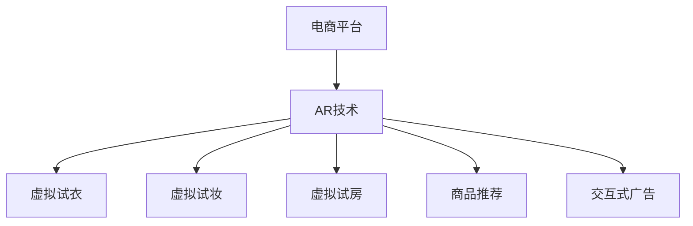

                 

# 增强现实技术在电商领域的应用：案例分析与展望

> 关键词：增强现实(AR)技术,电商领域,虚拟试衣,商品推荐,虚拟试妆,交互式广告,案例分析,应用展望

## 1. 背景介绍

### 1.1 问题由来
随着互联网的普及和技术的进步，电子商务已成为人们生活中不可或缺的一部分。传统的电商平台虽然提供了丰富的商品展示和购物体验，但仍然存在一些不足：商品展示的单一性、用户购物体验的局限性、购物决策的难度等问题逐渐显现。为了解决这些问题，增强现实(AR)技术应运而生，为电商领域带来了全新的发展方向。

### 1.2 问题核心关键点
增强现实技术是一种将计算机生成的虚拟图像叠加到用户现实环境中的技术，使得用户可以通过虚拟环境体验商品或服务。其关键在于：

- AR技术如何与电商平台结合，提供沉浸式购物体验？
- AR技术在电商领域中具体应用场景有哪些？
- AR技术如何优化用户购物决策过程？
- AR技术在电商领域的未来发展趋势是什么？

## 2. 核心概念与联系

### 2.1 核心概念概述

增强现实技术（AR）是虚拟现实（VR）技术的延伸，它将虚拟信息与现实世界相结合，使用户可以通过设备看到叠加在现实世界中的虚拟图像。AR技术在电商领域的应用可以分为以下几类：

- **虚拟试衣**：用户可以通过AR技术体验到虚拟试衣的效果，无需实际试穿就能选择心仪的服饰。
- **虚拟试妆**：用户可以通过AR技术在虚拟环境中尝试不同的妆容，了解不同妆容效果。
- **虚拟试房**：用户可以在虚拟环境中体验不同的家居风格和装修方案。
- **商品推荐**：AR技术可以根据用户的兴趣和需求，推荐最合适的商品。
- **交互式广告**：通过AR技术，广告形式更加生动、互动，吸引用户注意。

### 2.2 核心概念原理和架构的 Mermaid 流程图



### 2.3 核心概念之间的逻辑关系

增强现实技术在电商领域的应用，依托于计算机视觉、图像处理、3D建模、机器学习等技术，通过将虚拟信息叠加到现实世界中，实现用户沉浸式购物体验。这些技术的融合，使得电商平台能够提供更加个性化、互动性强的购物服务。

## 3. 核心算法原理 & 具体操作步骤

### 3.1 算法原理概述

增强现实技术在电商领域的应用主要依赖于以下几个核心算法：

- **计算机视觉**：用于识别和跟踪用户实时的面部、身体动作等信息，为AR体验提供基础。
- **图像处理**：对虚拟图像进行渲染和处理，使其与现实环境无缝融合。
- **3D建模**：构建商品的3D模型，用于虚拟试穿、试妆等体验。
- **机器学习**：通过用户行为数据和历史购物记录，推荐最适合的商品或服务。

### 3.2 算法步骤详解

增强现实技术在电商领域的应用，通常包括以下几个关键步骤：

1. **数据采集**：使用摄像头、传感器等设备采集用户的实时数据。
2. **用户识别**：通过面部、身体动作等特征，识别用户身份和意图。
3. **虚拟图像渲染**：根据用户行为和需求，渲染虚拟图像。
4. **虚拟与现实融合**：将虚拟图像叠加到用户实时环境中，实现AR体验。
5. **交互反馈**：用户可以通过手势、语音等方式与虚拟图像进行互动，获取反馈信息。

### 3.3 算法优缺点

增强现实技术在电商领域的应用具有以下优点：

- **提升用户体验**：通过虚拟试衣、试妆等体验，使用户能够更直观地了解商品效果，提升购物满意度。
- **增加互动性**：通过交互式广告和虚拟试穿等互动体验，提升用户参与度和购买意愿。
- **优化决策过程**：通过个性化推荐，帮助用户更快速、准确地做出购物决策。

同时，增强现实技术在电商领域的应用也存在一些不足：

- **技术门槛高**：AR技术的实现需要复杂的软件和硬件设备，对技术要求较高。
- **用户接受度低**：部分用户对AR技术仍存在陌生感，需要进一步的推广和教育。
- **设备成本高**：AR设备如智能眼镜、手机等，价格较高，限制了其普及应用。

### 3.4 算法应用领域

增强现实技术在电商领域的应用领域非常广泛，包括但不限于：

- **服装行业**：虚拟试衣、试妆、试穿等。
- **家居行业**：虚拟试房、虚拟家具摆放等。
- **美妆行业**：虚拟试妆、妆容效果展示等。
- **汽车行业**：虚拟试驾、车内配置展示等。
- **家具行业**：虚拟家具摆放、室内装修设计等。

## 4. 数学模型和公式 & 详细讲解 & 举例说明

### 4.1 数学模型构建

增强现实技术在电商领域的应用，可以建模为以下数学公式：

- **用户位置和动作识别**：$P_{user}(t) = f_{pose}(x, y, z, \theta)$，其中 $x, y, z$ 为用户的位置坐标，$\theta$ 为用户动作角度。
- **虚拟图像渲染**：$I_{virtual}(t) = g_{render}(D_{3D}, P_{user}, C_{style})$，其中 $D_{3D}$ 为商品的3D模型数据，$P_{user}$ 为用户位置和动作，$C_{style}$ 为用户的风格偏好。
- **虚拟图像与现实融合**：$A_{merged}(t) = h_{fusion}(I_{virtual}, P_{real})$，其中 $P_{real}$ 为用户的现实环境信息，$I_{virtual}$ 为渲染后的虚拟图像。
- **用户反馈和交互**：$F(t) = n_{feedback}(A_{merged}, U_{input})$，其中 $U_{input}$ 为用户的操作输入，$F(t)$ 为系统反馈结果。

### 4.2 公式推导过程

- **用户位置和动作识别**：
  - 使用计算机视觉技术，对摄像头采集的图像进行特征提取，如人脸检测、姿态估计等。
  - 将提取的特征输入机器学习模型，如深度神经网络，预测用户的位置和动作。
  
- **虚拟图像渲染**：
  - 使用3D建模技术，将商品的模型数据与用户的偏好结合，生成虚拟图像。
  - 使用图像处理技术，对虚拟图像进行渲染，使其与现实环境相匹配。
  
- **虚拟图像与现实融合**：
  - 使用图像处理技术，将虚拟图像与用户的现实环境信息进行融合，形成叠加效果。
  - 使用增强现实技术，将融合后的图像展示给用户，实现AR体验。
  
- **用户反馈和交互**：
  - 使用自然语言处理技术，对用户的操作输入进行解析和理解。
  - 根据用户的操作和反馈，调整虚拟图像和推荐算法，优化用户体验。

### 4.3 案例分析与讲解

以下是一个具体的AR应用案例：虚拟试衣。

1. **数据采集**：用户使用手机摄像头拍摄全身图像。
2. **用户识别**：通过图像处理技术，识别用户的面部和身体特征。
3. **虚拟图像渲染**：使用3D建模技术，生成与用户身体比例相匹配的虚拟服装模型。
4. **虚拟与现实融合**：将虚拟服装模型叠加到用户的全身图像中，形成试衣效果。
5. **用户反馈和交互**：用户可以通过手势或语音操作，查看不同款式和颜色的效果，选择最合适的服饰。

## 5. 项目实践：代码实例和详细解释说明

### 5.1 开发环境搭建

要进行AR技术在电商领域的项目开发，首先需要搭建开发环境。以下是具体的步骤：

1. **安装Python**：确保计算机上安装了Python 3.x版本。
2. **安装Pip**：使用命令 `python -m pip install pip` 安装pip。
3. **安装OpenCV**：使用命令 `pip install opencv-python` 安装OpenCV库。
4. **安装Pygame**：使用命令 `pip install pygame` 安装Pygame库。
5. **安装深度学习框架**：选择TensorFlow或PyTorch作为深度学习框架，安装相应版本。

### 5.2 源代码详细实现

以下是一个使用OpenCV和Pygame实现虚拟试衣的Python代码示例：

```python
import cv2
import pygame

# 加载商品3D模型
model = cv2.imread('clothes_3d_model.jpg')

# 加载用户拍摄的全身图像
user_image = cv2.imread('user_image.jpg')

# 加载虚拟试衣图像
virtual_image = cv2.imread('virtual_clothes.jpg')

# 创建虚拟试衣窗口
pygame.init()
screen = pygame.display.set_mode((800, 600))
clock = pygame.time.Clock()

# 实时渲染虚拟试衣效果
while True:
    # 采集摄像头图像
    camera_image = cv2.imread('camera_image.jpg')
    
    # 检测用户动作
    user_pose = detect_user_pose(camera_image)
    
    # 生成虚拟试衣效果
    virtual_image = generate_virtual_image(model, user_pose)
    
    # 将虚拟试衣效果叠加到用户图像上
    merged_image = cv2.addWeighted(user_image, 0.5, virtual_image, 0.5, 0)
    
    # 显示效果
    pygame.image.load_from_memory(merged_image)
    pygame.display.flip()
    
    # 用户操作反馈
    if pygame.key.get_pressed()[pygame.K_SPACE]:
        break

pygame.quit()
```

### 5.3 代码解读与分析

以上代码示例中，主要使用了OpenCV和Pygame库实现虚拟试衣的效果。具体实现步骤如下：

1. **加载商品3D模型**：使用OpenCV库读取商品的3D模型图像，生成虚拟试衣模型。
2. **加载用户拍摄的全身图像**：使用OpenCV库读取用户拍摄的全身图像，作为虚拟试衣的基底。
3. **加载虚拟试衣图像**：使用OpenCV库读取虚拟试衣的图像，准备叠加到用户图像上。
4. **实时渲染虚拟试衣效果**：通过摄像头采集用户实时动作信息，生成虚拟试衣效果，并实时叠加到用户图像上。
5. **用户操作反馈**：通过按键等方式获取用户的操作反馈，结束试衣体验。

## 6. 实际应用场景

### 6.1 智能服装店

智能服装店可以通过增强现实技术，为顾客提供虚拟试衣、试妆等体验。顾客可以使用智能终端或手机摄像头拍摄全身图像，通过AR技术虚拟试穿不同款式的服饰，直观地了解效果。同时，智能服装店还可以根据顾客的购物记录和偏好，推荐最合适的商品。

### 6.2 家居电商

家居电商可以通过增强现实技术，为顾客提供虚拟试房、虚拟家具摆放等体验。顾客可以使用手机摄像头拍摄家居环境，通过AR技术虚拟摆放不同风格的家具，直观地了解效果。同时，家居电商还可以根据顾客的购物记录和偏好，推荐最合适的家居用品。

### 6.3 美妆电商

美妆电商可以通过增强现实技术，为顾客提供虚拟试妆、妆容效果展示等体验。顾客可以使用手机摄像头拍摄面部，通过AR技术虚拟试妆不同妆容，直观地了解效果。同时，美妆电商还可以根据顾客的购物记录和偏好，推荐最合适的化妆品。

### 6.4 未来应用展望

增强现实技术在电商领域的应用前景广阔，未来可能的发展方向包括：

- **多模态交互**：结合语音、手势等多种交互方式，提升用户体验。
- **个性化推荐**：通过机器学习算法，实现更精准的商品推荐。
- **虚拟现实与增强现实结合**：将虚拟现实技术与增强现实技术结合，提供更加沉浸式的购物体验。
- **实时反馈优化**：根据用户的操作反馈，实时调整虚拟图像和推荐算法，优化用户体验。

## 7. 工具和资源推荐

### 7.1 学习资源推荐

要进行增强现实技术在电商领域的开发，需要掌握以下几个方面的知识：

1. **计算机视觉**：可以参考《计算机视觉：基础与实践》等书籍，学习基础的计算机视觉算法。
2. **3D建模**：可以参考《3D游戏开发实战》等书籍，学习3D建模和渲染技术。
3. **机器学习**：可以参考《深度学习》等书籍，学习机器学习算法和应用。
4. **自然语言处理**：可以参考《自然语言处理综论》等书籍，学习自然语言处理技术。

### 7.2 开发工具推荐

要进行增强现实技术在电商领域的开发，需要选择合适的开发工具：

1. **深度学习框架**：TensorFlow和PyTorch是目前最流行的深度学习框架，提供了丰富的算法和工具。
2. **计算机视觉库**：OpenCV和Pillow库提供了强大的图像处理功能。
3. **3D建模工具**：Blender和Maya等工具可以用于创建和管理3D模型。
4. **虚拟现实和增强现实工具**：Unity和Unreal Engine等引擎提供了强大的虚拟现实和增强现实开发能力。

### 7.3 相关论文推荐

增强现实技术在电商领域的研究涉及多个领域，以下是几篇具有代表性的论文：

1. **《基于增强现实技术的智能服装店设计》**：介绍了如何通过增强现实技术实现虚拟试衣、试妆等体验，提升用户购物体验。
2. **《虚拟试妆技术研究》**：研究了虚拟试妆技术的实现方法，提出了基于深度学习的图像处理算法。
3. **《增强现实技术在家居电商中的应用》**：介绍了增强现实技术在虚拟试房、虚拟家具摆放等场景中的应用。
4. **《机器学习在电商推荐系统中的应用》**：研究了机器学习算法在电商推荐系统中的应用，提出了多种推荐算法和优化策略。

## 8. 总结：未来发展趋势与挑战

### 8.1 总结

增强现实技术在电商领域的应用，为消费者提供了沉浸式、互动式的购物体验，显著提升了用户购物满意度和转化率。然而，该技术在实际应用中也面临一些挑战，需要进一步探索和优化。

### 8.2 未来发展趋势

未来，增强现实技术在电商领域的应用将呈现以下几个趋势：

- **技术融合**：结合虚拟现实、人工智能、物联网等技术，提供更加全面、丰富的购物体验。
- **个性化推荐**：通过深度学习和人工智能算法，实现更精准的商品推荐。
- **实时反馈优化**：根据用户的操作反馈，实时调整虚拟图像和推荐算法，优化用户体验。
- **多模态交互**：结合语音、手势等多种交互方式，提升用户体验。

### 8.3 面临的挑战

增强现实技术在电商领域的应用仍面临一些挑战，包括：

- **技术复杂度高**：增强现实技术的实现需要复杂的算法和设备，对技术要求较高。
- **用户接受度低**：部分用户对增强现实技术仍存在陌生感，需要进一步的推广和教育。
- **设备成本高**：AR设备如智能眼镜、手机等，价格较高，限制了其普及应用。

### 8.4 研究展望

未来的研究需要在以下几个方面进行探索：

- **用户行为分析**：通过分析用户的行为数据，优化虚拟试衣、试妆等体验。
- **跨模态交互**：结合语音、手势等多种交互方式，提升用户体验。
- **个性化推荐算法**：通过深度学习和人工智能算法，实现更精准的商品推荐。
- **实时反馈优化**：根据用户的操作反馈，实时调整虚拟图像和推荐算法，优化用户体验。

## 9. 附录：常见问题与解答

**Q1：增强现实技术在电商领域的主要应用场景有哪些？**

A: 增强现实技术在电商领域的主要应用场景包括虚拟试衣、试妆、试房、商品推荐和交互式广告等。

**Q2：增强现实技术在电商领域的应用面临哪些挑战？**

A: 增强现实技术在电商领域的应用面临技术复杂度高、用户接受度低和设备成本高等挑战。

**Q3：增强现实技术在电商领域的主要优势是什么？**

A: 增强现实技术在电商领域的主要优势是提升用户体验、增加互动性和优化购物决策过程。

**Q4：增强现实技术在电商领域的前景如何？**

A: 增强现实技术在电商领域的前景广阔，未来将与虚拟现实、人工智能等技术深度融合，提供更加全面、丰富的购物体验。

**Q5：增强现实技术在电商领域的应用如何影响消费者的购物体验？**

A: 增强现实技术在电商领域的应用显著提升了消费者的购物体验，通过虚拟试衣、试妆等体验，使消费者能够更直观地了解商品效果，提升购物满意度。

作者：禅与计算机程序设计艺术 / Zen and the Art of Computer Programming

