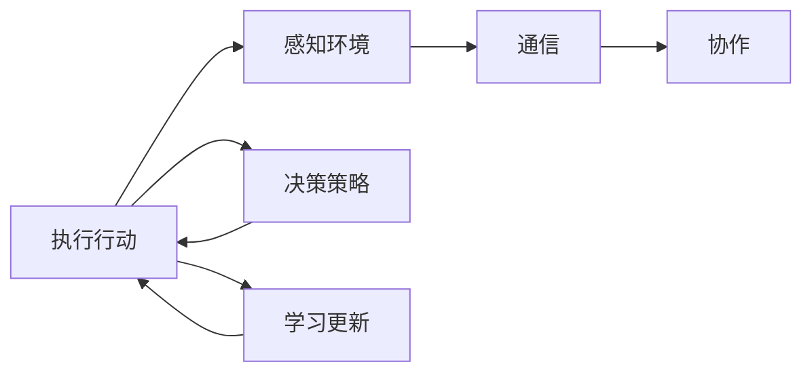

                 

## 1. 背景介绍

在现代人工智能领域，智能体的协同工作（Multi-Agent System, MAS）已成为解决复杂问题的关键技术之一。智能体是能够自主决策和交互的个体，而多智能体系统则是由多个智能体组成的协同工作体系，它们可以自主学习和协作，共同完成更复杂的任务。智能体学习（Agent Learning），是指智能体在特定环境或任务中，通过与环境互动，不断优化自身决策策略和行为以提高性能。

随着人工智能技术的进步，多智能体协同机制被广泛应用于多个领域，如机器人协作、自动驾驶、网络安全、供应链管理等。这些系统中的智能体不仅需要具备一定的自主学习能力，还需要与其他智能体协同工作，通过信息共享和任务分配，实现更高的整体性能和效率。

在学术界和工业界，研究人员和工程师们不断探索和实践智能体协同学习的方法，希望能够在复杂环境中更好地利用智能体的多样性和协作能力，以实现更优的决策和行为。本文将深入探讨多智能体协同机制在智能体学习中的应用，通过介绍核心概念、算法原理、项目实践以及实际应用场景，展示这一技术如何推动人工智能技术的发展和应用。

## 2. 核心概念与联系

### 2.1 核心概念概述

在探讨多智能体协同机制之前，我们先简要介绍几个关键概念：

- **智能体**：一个独立决策单元，可以在环境中进行自主的行动和感知，同时具备学习能力。
- **多智能体系统（MAS）**：由多个智能体组成的体系，智能体之间通过通信和协作实现共同的目标。
- **协同机制**：智能体之间的通信协议和决策策略，用于协调和优化各智能体的行为。
- **学习和适应**：智能体通过与环境交互，不断更新自身的决策策略和行为，以适应新的情况。

### 2.2 核心概念原理和架构的 Mermaid 流程图



该流程图展示了智能体学习中的核心过程：智能体感知环境，根据当前状态和目标制定决策策略，执行行动，并通过通信和协作与环境中的其他智能体交互。同时，智能体通过学习不断更新自身的决策策略，以适应新的环境变化。

## 3. 核心算法原理 & 具体操作步骤

### 3.1 算法原理概述

多智能体协同学习算法旨在优化多个智能体在分布式环境中的决策策略，使得系统整体能够实现更高的性能和效率。该算法通常包括以下几个步骤：

1. **感知环境**：智能体通过传感器或通信网络获取环境状态信息。
2. **决策策略**：基于当前状态，智能体选择或生成一个行动策略。
3. **执行行动**：智能体根据决策策略执行相应的行动。
4. **通信和协作**：智能体之间交换信息，共享经验或知识。
5. **学习和更新**：智能体通过与环境交互和学习，更新自身的决策策略，以提高系统性能。

### 3.2 算法步骤详解

#### 3.2.1 感知环境

智能体通过传感器获取环境状态信息，例如通过摄像头获取视觉信息，通过雷达获取定位信息等。这些信息经过处理后，可以作为智能体的决策依据。

#### 3.2.2 决策策略

智能体根据感知到的环境状态，选择或生成一个行动策略。决策策略的制定通常涉及算法设计，如Q-learning、强化学习等，这些算法通过与环境的交互，逐步优化决策策略。

#### 3.2.3 执行行动

智能体根据决策策略执行相应的行动。执行行动时，智能体可能需要与其他智能体协作，以实现共同的目标。

#### 3.2.4 通信和协作

智能体之间通过通信网络交换信息，共享经验或知识。通信和协作是实现智能体协同的关键步骤，通过共享信息，智能体可以更好地理解环境，优化自身的决策策略。

#### 3.2.5 学习和更新

智能体通过与环境交互，不断更新自身的决策策略。学习通常涉及模型训练，如神经网络、决策树等，这些模型通过收集和分析交互数据，优化智能体的决策策略。

### 3.3 算法优缺点

多智能体协同学习算法具有以下优点：

- **高效性**：通过智能体之间的协作和通信，可以优化资源分配和任务执行，提高整体性能。
- **鲁棒性**：系统通过多智能体的协作，可以容忍单个智能体的故障或失效，提高系统的鲁棒性。
- **可扩展性**：智能体可以通过添加新成员，扩展系统的功能和规模。

同时，该算法也存在以下缺点：

- **复杂性**：多智能体系统的设计和实现复杂，需要考虑智能体之间的通信和协作。
- **数据隐私**：智能体之间需要共享数据，可能涉及数据隐私和安全问题。
- **模型复杂性**：多智能体系统通常需要复杂的模型来优化决策策略，模型设计和训练难度较大。

### 3.4 算法应用领域

多智能体协同学习算法在多个领域有广泛应用，如：

- **机器人协作**：多机器人系统中的智能体通过协作完成任务，如搬运、装配等。
- **自动驾驶**：车辆通过与其他车辆和基础设施的通信，实现安全高效驾驶。
- **网络安全**：网络中的多个智能体协同工作，检测和防御入侵行为。
- **供应链管理**：供应链中的各个环节通过协同学习和协作，提高整体效率。

## 4. 数学模型和公式 & 详细讲解

### 4.1 数学模型构建

在多智能体系统中，每个智能体的决策策略可以通过数学模型表示。例如，使用Markov决策过程（MDP）来描述智能体的状态和决策策略。

设智能体的状态空间为 $S$，行动空间为 $A$，状态转移概率为 $P(s'|s,a)$，奖励函数为 $R(s,a)$，智能体的决策策略为 $\pi(a|s)$。智能体的目标是通过学习，最大化未来奖励的期望值。

### 4.2 公式推导过程

在MDP模型中，智能体的目标可以表示为：

$$
\max_{\pi} \mathbb{E}_{s \sim P_0, a \sim \pi} \sum_{t=0}^{\infty} \gamma^t R(s_t,a_t)
$$

其中 $\gamma$ 为折扣因子，$P_0$ 为初始状态分布。智能体的决策策略可以通过求解贝尔曼方程来优化：

$$
V^{\pi}(s) = \max_a \mathbb{E}[R(s,a) + \gamma \sum_{s'} P(s'|s,a)V^{\pi}(s')]
$$

智能体的最优策略可以通过求解价值函数 $V^{\pi^*}$ 来得到：

$$
\pi^*(a|s) = \frac{\pi(a|s)}{\sum_{a'} \pi(a'|s)}
$$

在实际应用中，智能体的决策策略通常通过强化学习算法（如Q-learning、策略梯度等）进行优化，使得智能体在多智能体系统中，能够最大化整体奖励。

### 4.3 案例分析与讲解

以下是一个简单的多智能体系统案例：假设两个智能体在一个带有障碍物的环境中协同导航。智能体的目标是到达目标位置，同时避免障碍物。

- 智能体通过摄像头和雷达感知环境状态。
- 智能体根据当前位置和目标位置，选择行动策略（如直行、转弯）。
- 智能体之间通过通信交换位置信息，避免碰撞。
- 智能体通过学习不断优化决策策略，提高导航效率。

该案例展示了智能体协同学习的基本流程，智能体通过感知、决策、执行、通信和学习的迭代，逐步优化自身的决策策略，从而实现协同导航。

## 5. 项目实践：代码实例和详细解释说明

### 5.1 开发环境搭建

为了实现多智能体协同学习，我们需要准备相应的开发环境：

- **Python 环境**：安装Python 3.x，建议使用Anaconda。
- **强化学习库**：安装gym、stable-baselines3等库，用于构建和模拟多智能体环境。
- **通信库**：安装gym-duckies3d等库，用于智能体之间的通信和协作。
- **可视化工具**：安装matplotlib等库，用于可视化和分析实验结果。

### 5.2 源代码详细实现

以下是一个简单的多智能体协同导航的Python代码实现，使用gym和stable-baselines3库：

```python
from stable_baselines3 import PPO
from stable_baselines3.common.env_util import make_vec_env
from gym_duckies3d.envs import Duckies3dEnv
from tensorboardX import SummaryWriter

# 创建环境
env = make_vec_env("Duckies3dEnv-v0", n_envs=2)

# 创建模型
model = PPO.load("ppo")
obs = env.reset()

# 训练过程
total_reward = 0
for t in range(1000):
    # 智能体1和智能体2的决策
    obs1, obs2 = obs[0], obs[1]
    action1 = model.predict(obs1)[0]
    action2 = model.predict(obs2)[0]
    
    # 执行行动
    obs1_, obs2_, rewards1, rewards2, _, _ = env.step([action1, action2])
    
    # 通信和协作
    obs1_, obs2_, _, _ = env.step([action1, action2])
    
    # 学习和更新
    total_reward += rewards1 + rewards2
    
    # 输出结果
    print(f"Step {t+1}, Reward {total_reward:.2f}")
```

### 5.3 代码解读与分析

这段代码实现了两个智能体在gym-duckies3d环境中协同导航的简单案例。通过观察和分析，我们得到以下关键点：

- 使用PPO算法构建智能体模型。
- 通过观测状态 `obs` 获取环境信息。
- 智能体1和智能体2独立决策行动 `action1` 和 `action2`。
- 智能体之间通过通信交换行动信息。
- 智能体通过学习不断优化决策策略，逐步提高导航效率。

## 6. 实际应用场景

### 6.1 机器人协作

在机器人协作场景中，多智能体协同学习可以显著提高机器人之间的协调性和任务完成效率。例如，在一个装配线上，多个机器人协同工作，通过学习优化装配策略，提高装配效率和准确性。

### 6.2 自动驾驶

在自动驾驶领域，多个车辆和基础设施通过通信协作，共同维护道路交通秩序。通过多智能体协同学习，车辆可以避免碰撞，提高安全性和通行效率。

### 6.3 网络安全

在网络安全中，多个安全设备协同工作，共同检测和防御入侵行为。智能体之间通过共享信息和协同学习，可以提高系统的检测能力和防御效率。

### 6.4 供应链管理

在供应链管理中，多个环节的智能体通过协同学习和协作，优化资源分配和物流安排，提高整体效率和响应速度。

## 7. 工具和资源推荐

### 7.1 学习资源推荐

- **Reinforcement Learning: An Introduction**：由Sutton和Barto合著的经典书籍，全面介绍了强化学习的基本概念和算法。
- **Deep Reinforcement Learning Handbook**：深度学习领域权威专家编写的书籍，涵盖了多智能体强化学习的最新研究成果和实际应用。
- **OpenAI Gym**：用于构建和模拟多智能体环境的库，提供了丰富的环境和算法实现。
- **Multi-Agent Deep Reinforcement Learning**：由Lam等人合著的书籍，详细介绍了多智能体强化学习的理论和算法。

### 7.2 开发工具推荐

- **TensorFlow和PyTorch**：常用的深度学习框架，支持多智能体强化学习的实现。
- **Gym**：构建和模拟多智能体环境的库，提供了丰富的环境和算法实现。
- **Ray**：用于分布式训练和协作学习的环境，支持多智能体系统的实现。
- **TorchCraft**：用于可视化多智能体系统交互的工具，支持动态展示和分析。

### 7.3 相关论文推荐

- **Multi-Agent Deep Reinforcement Learning**：由Lam等人合著的综述论文，介绍了多智能体强化学习的最新进展。
- **Learning in Dynamic Environments**：由Lenski等人合著的综述论文，介绍了多智能体学习在动态环境中的应用。
- **Distributed Multi-Agent Deep Reinforcement Learning**：由Germain等人合著的论文，介绍了多智能体深度强化学习的分布式实现方法。

## 8. 总结：未来发展趋势与挑战

### 8.1 研究成果总结

本文通过介绍多智能体协同学习的基本原理和应用场景，展示了这一技术在实际应用中的潜力。多智能体协同学习已经成为解决复杂问题的关键技术之一，广泛应用于机器人协作、自动驾驶、网络安全、供应链管理等多个领域。

### 8.2 未来发展趋势

未来，多智能体协同学习将呈现以下几个发展趋势：

1. **增强学习**：多智能体系统将更多地采用增强学习算法，优化决策策略和行为。
2. **复杂系统**：多智能体系统将变得更加复杂，涉及更多维度和层次的协作和优化。
3. **分布式训练**：分布式训练和协作学习将成为主流，提高系统的效率和可扩展性。
4. **跨领域应用**：多智能体学习将拓展到更多领域，如金融、医疗、物流等。

### 8.3 面临的挑战

尽管多智能体协同学习已经取得了重要进展，但仍面临诸多挑战：

1. **系统复杂性**：多智能体系统的设计和实现复杂，需要考虑通信和协作的多个层面。
2. **数据隐私和安全**：智能体之间需要共享数据，可能涉及数据隐私和安全问题。
3. **模型复杂性**：多智能体系统通常需要复杂的模型来优化决策策略，模型设计和训练难度较大。
4. **稳定性**：多智能体系统需要在复杂和动态环境中保持稳定性和可靠性。

### 8.4 研究展望

未来，多智能体协同学习需要从以下几个方面寻求新的突破：

1. **优化算法**：设计更高效、更稳定的优化算法，提高系统的学习能力和适应性。
2. **多层次协同**：实现多智能体系统在多层次的协同工作，提高系统的整体效率和鲁棒性。
3. **数据隐私保护**：开发保护数据隐私的技术，确保智能体之间数据共享的安全性。
4. **跨领域应用**：拓展多智能体学习在更多领域的应用，提升系统的通用性和实用性。

通过不断探索和优化，多智能体协同学习有望在更多领域发挥更大的作用，推动人工智能技术的发展和应用。

## 9. 附录：常见问题与解答

**Q1: 多智能体系统中的智能体如何实现通信和协作？**

A: 智能体之间的通信通常通过网络协议和共享数据实现。智能体可以通过消息队列、共享内存等机制交换信息。协作通常通过共同的目标和决策策略实现，例如任务分配和策略同步。

**Q2: 多智能体系统中的智能体如何学习？**

A: 智能体通常通过强化学习算法学习优化决策策略。智能体通过与环境交互，收集和分析交互数据，不断更新自身的决策策略，以提高系统性能。

**Q3: 多智能体系统中存在信息不对称问题，如何解决？**

A: 信息不对称问题可以通过共享信息、同步策略等方法解决。例如，智能体之间可以定期交换状态和观测结果，同步决策策略，以提高系统性能和鲁棒性。

**Q4: 多智能体系统中的智能体如何处理不确定性？**

A: 不确定性可以通过强化学习算法中的探索与利用策略解决。例如，智能体可以通过随机行动或探索新策略，增加系统的适应性。

**Q5: 多智能体系统中存在竞争问题，如何解决？**

A: 竞争问题可以通过任务分配和优先级管理解决。例如，智能体可以通过任务优先级和协作策略，避免资源冲突和竞争。

通过不断探索和优化，多智能体协同学习有望在更多领域发挥更大的作用，推动人工智能技术的发展和应用。

