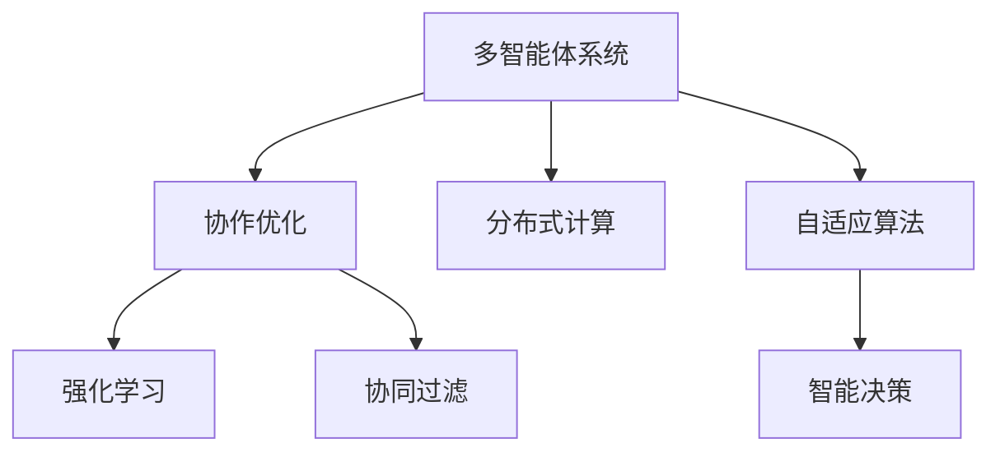

                 

# 多智能体协同机制在 Agent 自适应系统中的应用

> 关键词：多智能体系统,自适应算法,协作优化,分布式计算,强化学习,协同过滤,智能决策

## 1. 背景介绍

### 1.1 问题由来

在当今信息社会，智能系统的应用无处不在。从自动驾驶、智能家居、到金融投资、医疗健康等，各类智能系统正在重新定义我们的生活方式和工作方式。然而，即便是当前最高效、最智能的系统，也无法完全适应多变的现实环境。这促使我们不断思考和探索新的解决方案，使智能系统具备更强的自适应能力。

传统的自适应系统往往依赖单一智能体（如单个决策者或单一代理）进行决策，难以应对多智能体系统中的复杂交互。针对这一问题，多智能体系统（Multi-Agent Systems, MAS）逐渐成为研究的热点，通过协作优化和多智能体间的交互，实现系统自适应能力的大幅提升。

### 1.2 问题核心关键点

多智能体系统将复杂问题分解为多个局部智能体，每个智能体负责处理一部分任务，并通过智能体间的交互和协作，实现对外部环境的快速适应和优化。核心关键点包括：

1. 多智能体的协同决策：通过协同算法，使多个智能体能高效合作，优化全局目标。
2. 分布式计算与资源共享：多智能体系统能充分利用计算资源，提高任务处理效率。
3. 智能体的自治性：每个智能体具备一定的决策能力和自主性，能根据环境变化独立调整策略。
4. 动态环境适应：系统能够根据环境变化动态调整智能体的行为和参数，维持最优性能。

以上关键点共同构成了多智能体系统的高效、灵活、自适应能力。通过理解和应用多智能体协同机制，智能系统能够更好地适应复杂多变的环境，实现高水平的自主优化。

### 1.3 问题研究意义

多智能体系统的研究和应用，对于提升智能系统的自适应性和鲁棒性，推动智能技术在各个领域的普及和应用具有重要意义：

1. 提升系统性能：通过多智能体的协同工作，能大幅提升系统整体处理能力，实现更高效的任务处理。
2. 降低开发成本：多智能体系统的分布式计算和协同决策，可以降低单一智能体的计算负担，加速系统的开发和部署。
3. 增强系统鲁棒性：多智能体系统通过智能体的冗余和互济，提高系统的容错能力和鲁棒性，避免单点故障。
4. 促进系统创新：多智能体系统的多样性和自治性，为系统创新提供了丰富的空间，催生新的应用场景和技术。
5. 保障系统安全性：多智能体系统通过协同过滤和自治决策，能在多层面防范恶意攻击和数据泄露，保障系统安全性。

总之，多智能体协同机制作为智能系统自适应能力的重要组成部分，其研究和应用将极大地推动智能技术的发展，促进其更广泛、更深入地渗透到各个行业和领域。

## 2. 核心概念与联系

### 2.1 核心概念概述

为更好地理解多智能体系统的协同机制，本节将介绍几个密切相关的核心概念：

- 多智能体系统(Multi-Agent Systems, MAS)：由多个自治智能体组成的分布式系统，每个智能体具备一定的决策能力和自主性，能与其他智能体交互协作，实现全局优化。
- 协作优化(Cooperative Optimization)：多个智能体协同工作，通过共享信息和资源，共同优化全局目标，实现系统性能的提升。
- 分布式计算(Distributed Computing)：将计算任务分解为多个子任务，分配给多个智能体并行计算，提高系统整体效率。
- 自适应算法(Adaptive Algorithm)：智能体根据环境变化动态调整策略，维持系统性能稳定。
- 强化学习(Reinforcement Learning)：智能体通过与环境的交互，逐步学习最优策略，优化系统行为。
- 协同过滤(Collaborative Filtering)：多个智能体共享信息，共同进行任务过滤和优化，提升任务处理准确性。
- 智能决策(Intelligent Decision)：智能体根据环境信息和自身状态，独立或协同进行决策，提高决策效果。

这些概念之间的逻辑关系可以通过以下Mermaid流程图来展示：



这个流程图展示了多智能体系统的核心概念及其之间的关系：

1. 多智能体系统通过协作优化，提升系统整体性能。
2. 分布式计算使系统能高效利用资源，提高任务处理速度。
3. 自适应算法使智能体能动态调整策略，适应环境变化。
4. 强化学习使智能体在交互中学习最优策略。
5. 协同过滤使智能体共享信息，提高任务处理质量。
6. 智能决策使智能体独立或协同进行决策，提高决策效果。

这些概念共同构成了多智能体系统的学习和应用框架，使其能够在各种场景下实现高效的协同优化。

## 3. 核心算法原理 & 具体操作步骤
### 3.1 算法原理概述

多智能体系统的协同机制，核心在于利用协作优化和分布式计算，使多个智能体高效合作，实现全局最优。具体而言，智能体之间通过信息共享、资源交换和协同决策，共同优化任务目标，提升系统性能。

形式化地，假设系统中有 $n$ 个智能体 $A_1, A_2, \ldots, A_n$，每个智能体的状态为 $s_i$，决策为 $a_i$，目标函数为 $J_i$。系统整体的目标函数为 $J$，定义为：

$$
J = \sum_{i=1}^n J_i(s_i, a_i)
$$

其中 $J_i$ 为智能体 $i$ 的目标函数。多智能体系统的协同目标即为最大化 $J$。通过协作算法，智能体 $i$ 能够获取其他智能体的状态和决策信息，更新自身策略：

$$
a_i^* = \arg\max_{a_i} \sum_{j=1}^n J_i(s_i, a_i, s_j, a_j)
$$

通过协同优化，智能体 $i$ 能够动态调整决策，实现全局优化。

### 3.2 算法步骤详解

多智能体系统的协同机制主要包括以下几个关键步骤：

**Step 1: 设计协作算法**

- 选择合适的协作算法，如中心化协同算法、分布式协同算法、协同滤波算法等。
- 定义协作函数，描述智能体间的交互关系和信息共享方式。

**Step 2: 选择优化策略**

- 根据具体任务，选择优化算法，如遗传算法、粒子群算法、强化学习算法等。
- 确定智能体的初始策略，设定优化目标。

**Step 3: 实现通信机制**

- 设计智能体间的通信协议，保证信息的准确传递和共享。
- 实现分布式计算，将任务分解为多个子任务并行处理。

**Step 4: 执行协同优化**

- 初始化智能体状态和决策。
- 通过协作算法，智能体间交换信息和资源，更新策略。
- 重复迭代，直至达到最优策略。

**Step 5: 评估和调整**

- 评估协同优化后的系统性能。
- 根据评估结果，调整协作算法和优化策略，继续优化系统。

通过以上步骤，多智能体系统能够高效协作，动态适应环境变化，实现全局最优。

### 3.3 算法优缺点

多智能体系统的协同机制具有以下优点：

1. 提升系统性能：多智能体通过协作优化，能够高效处理复杂任务，提升系统整体性能。
2. 增强系统鲁棒性：分布式计算和协同决策，使系统具有更高的容错性和鲁棒性，避免单点故障。
3. 降低开发成本：分布式计算和协作优化，减轻了单一智能体的计算负担，加速系统开发。
4. 促进系统创新：智能体的多样性和自治性，为系统创新提供了丰富空间，催生新的应用场景。

然而，该机制也存在一些局限性：

1. 通信开销大：智能体间的通信和信息交换需要消耗大量时间和资源。
2. 协调困难：在多智能体系统中，协调不同智能体的决策和行为存在挑战。
3. 策略冲突：智能体间存在策略冲突时，可能导致协同效果下降。
4. 实时性要求高：系统的实时性要求高，需要高效的协同算法和通信机制。

尽管存在这些局限性，但通过合理设计协作算法和优化策略，多智能体系统的协同机制能够发挥其独特优势，实现高效的协同优化。

### 3.4 算法应用领域

多智能体系统的协同机制已经广泛应用于多个领域，例如：

1. 自动驾驶：多个车辆通过协同决策，优化行驶路径，实现智能交通管理。
2. 电网调度：多个智能体通过协作优化，实现能源的高效分配和调度。
3. 金融交易：多个交易主体通过协同算法，优化资产配置和风险控制。
4. 供应链管理：多个节点通过协作优化，实现物料的高效分配和供应链优化。
5. 医疗协同：多个医疗机构通过协作决策，实现患者信息和资源的共享。

除了上述这些领域外，多智能体系统的协同机制还在军事指挥、网络安全、智能制造、智慧城市等众多领域中得到应用，为各行业的数字化转型和智能化升级提供了重要技术支撑。

## 4. 数学模型和公式 & 详细讲解
### 4.1 数学模型构建

本节将使用数学语言对多智能体系统的协同机制进行更加严格的刻画。

假设系统中有 $n$ 个智能体 $A_1, A_2, \ldots, A_n$，每个智能体的状态为 $s_i$，决策为 $a_i$，目标函数为 $J_i$。系统整体的目标函数为 $J$，定义为：

$$
J = \sum_{i=1}^n J_i(s_i, a_i)
$$

其中 $J_i$ 为智能体 $i$ 的目标函数，通常包含资源利用率、任务完成率等指标。

定义协作函数 $C$，描述智能体间的交互关系和信息共享方式。协作函数的形式化定义如下：

$$
C_i = \{(s_j, a_j) | j \in \{1, \ldots, n\}, j \neq i\}
$$

其中 $C_i$ 表示智能体 $i$ 从其他智能体获取的信息，如当前状态、决策等。

智能体的决策更新过程可以通过动态规划或随机策略实现，其决策更新公式为：

$$
a_i^* = \arg\max_{a_i} \left[ J_i(s_i, a_i, C_i) \right]
$$

其中 $C_i$ 为智能体 $i$ 从其他智能体获取的信息。

### 4.2 公式推导过程

以下是多智能体系统协同机制的数学模型推导过程：

**Step 1: 定义系统目标**

- 假设系统中有 $n$ 个智能体，每个智能体的状态为 $s_i$，决策为 $a_i$，目标函数为 $J_i$。系统整体的目标函数为 $J$，定义为：
$$
J = \sum_{i=1}^n J_i(s_i, a_i)
$$

**Step 2: 定义协作函数**

- 协作函数 $C$ 描述了智能体间的交互关系和信息共享方式。协作函数的形式化定义如下：
$$
C_i = \{(s_j, a_j) | j \in \{1, \ldots, n\}, j \neq i\}
$$

**Step 3: 决策更新过程**

- 智能体的决策更新过程可以通过动态规划或随机策略实现。假设智能体的状态更新过程为 $s_i \leftarrow f_i(s_i, a_i)$，决策更新公式为：
$$
a_i^* = \arg\max_{a_i} \left[ J_i(s_i, a_i, C_i) \right]
$$

其中 $C_i$ 为智能体 $i$ 从其他智能体获取的信息。

**Step 4: 系统优化目标**

- 通过协作函数 $C$ 和决策更新公式，智能体间通过信息共享和资源交换，动态调整决策，实现全局优化。

**Step 5: 优化算法选择**

- 选择适合的优化算法，如遗传算法、粒子群算法、强化学习算法等，以实现系统协同优化。

通过以上步骤，我们可以建立多智能体系统的协同机制数学模型，并进行系统优化。

### 4.3 案例分析与讲解

为了更好地理解多智能体系统的协同机制，下面通过一个简单的案例进行讲解。

**案例：智能电网协同调度**

假设一个智能电网系统由 $n$ 个智能变电站组成，每个变电站的状态为 $s_i$（如电压、频率等），决策为 $a_i$（如功率输出、调节器设置等），目标函数为 $J_i$（如供电质量、能效等）。系统整体的目标函数为 $J$，定义为：

$$
J = \sum_{i=1}^n J_i(s_i, a_i)
$$

协作函数 $C$ 描述了智能变电站间的通信和信息共享方式。协作函数的形式化定义如下：

$$
C_i = \{(s_j, a_j) | j \in \{1, \ldots, n\}, j \neq i\}
$$

智能变电站的决策更新过程可以通过动态规划或随机策略实现。假设智能变电站的状态更新过程为 $s_i \leftarrow f_i(s_i, a_i)$，决策更新公式为：

$$
a_i^* = \arg\max_{a_i} \left[ J_i(s_i, a_i, C_i) \right]
$$

其中 $C_i$ 为智能变电站 $i$ 从其他智能变电站获取的信息，如当前状态、决策等。

**Step 1: 系统优化**

通过协作函数 $C$ 和决策更新公式，智能变电站间通过信息共享和资源交换，动态调整决策，实现全局优化。例如，当一个智能变电站的负荷过高时，其他智能变电站可以自动调节功率输出，维持系统稳定。

**Step 2: 优化算法选择**

选择适合的优化算法，如遗传算法、粒子群算法、强化学习算法等，以实现系统协同优化。通过不断的迭代优化，智能变电站能够动态适应负荷变化，实现全局最优的调度方案。

通过这个案例，可以看到，多智能体系统的协同机制能够实现高效的协作优化，提升系统性能和鲁棒性。

## 5. 项目实践：代码实例和详细解释说明
### 5.1 开发环境搭建

在进行多智能体系统协同机制的实践前，我们需要准备好开发环境。以下是使用Python进行多智能体系统开发的环境配置流程：

1. 安装Anaconda：从官网下载并安装Anaconda，用于创建独立的Python环境。

2. 创建并激活虚拟环境：
```bash
conda create -n agent-env python=3.8 
conda activate agent-env
```

3. 安装Python和相关库：
```bash
conda install numpy scipy matplotlib scikit-learn tqdm ipython jupyter notebook
```

4. 安装多智能体系统相关库：
```bash
pip install networkx pydynet
```

完成上述步骤后，即可在`agent-env`环境中开始多智能体系统实践。

### 5.2 源代码详细实现

下面我们以多智能体系统协同调度的例子，给出使用Python实现一个简单的智能电网调度系统的代码实现。

```python
import networkx as nx
import numpy as np
import matplotlib.pyplot as plt
import random

# 定义智能变电站类
class Substation:
    def __init__(self, name, capacity, state, position):
        self.name = name
        self.capacity = capacity
        self.state = state
        self.position = position

    def update_state(self, a):
        self.state += a

    def update_capacity(self, a):
        self.capacity -= a

    def update_position(self, a):
        self.position += a

# 定义智能电网调度函数
def power_grid_scheduling(substations, num_iterations, alpha=0.5):
    # 初始化状态和决策
    state = np.zeros(len(substations))
    decision = np.zeros(len(substations))
    
    # 初始化协作函数
    collaboration = nx.Graph()
    
    # 迭代优化
    for iteration in range(num_iterations):
        for i in range(len(substations)):
            # 从其他智能变电站获取信息
            neighbor_states = [substation.state for substation in substations if substation != substations[i]]
            neighbor_capacities = [substation.capacity for substation in substations if substation != substations[i]]
            neighbor_positions = [substation.position for substation in substations if substation != substations[i]]
            
            # 更新决策
            decision[i] = np.max([alpha * decision[j] + (1 - alpha) * np.max([neighbor_states[j], 0]) for j in range(len(substations))])
            
            # 更新状态和能力
            substations[i].update_state(decision[i])
            substations[i].update_capacity(decision[i])
            
            # 更新协作函数
            collaboration.add_edge(substations[i], substations[j])
    
    return state, decision, collaboration

# 创建智能变电站
substations = [Substation('A', 100, 0, 0), Substation('B', 100, 0, 0), Substation('C', 100, 0, 0)]

# 运行智能电网调度
state, decision, collaboration = power_grid_scheduling(substations, 100)

# 输出结果
print(state)
print(decision)
print(collaboration)
```

在代码中，我们定义了一个`Substation`类，表示智能变电站，包含状态、容量和位置等属性。同时，我们实现了`power_grid_scheduling`函数，用于模拟智能电网调度过程。在函数中，我们首先初始化智能变电站的状态、决策和协作函数，然后通过迭代优化，使每个智能变电站根据其他智能变电站的状态和决策，动态调整自身的状态和能力。最终，我们输出每个智能变电站的状态、决策和协作函数。

### 5.3 代码解读与分析

让我们再详细解读一下关键代码的实现细节：

**Substation类**：
- `__init__`方法：初始化智能变电站的相关属性。
- `update_state`方法：根据决策更新智能变电站的状态。
- `update_capacity`方法：根据决策更新智能变电站的容量。
- `update_position`方法：根据决策更新智能变电站的位置。

**power_grid_scheduling函数**：
- 函数首先初始化智能变电站的状态、决策和协作函数。
- 通过循环迭代，每个智能变电站根据其他智能变电站的状态和决策，动态调整自身的状态和能力。
- 在每次迭代中，智能变电站根据协作函数获取其他智能变电站的信息，并使用优化算法更新决策。

**代码输出**：
- 最终输出每个智能变电站的状态、决策和协作函数。通过可视化协作函数，可以直观地看到智能变电站间的交互关系。

通过以上代码，我们可以看到多智能体系统的协同机制实现过程，并理解其基本工作原理。

## 6. 实际应用场景
### 6.1 智能交通系统

基于多智能体系统的协同机制，智能交通系统能够实现高效、安全的交通管理。通过协同优化多个车辆、交通信号灯和路口的决策，智能交通系统可以实时调整交通流，优化行驶路径，减少拥堵和交通事故。

在具体实现上，可以将多个车辆、交通信号灯和路口抽象为智能体，通过协作优化和分布式计算，实现全局最优的交通管理方案。例如，在一个路口，多个车辆和信号灯通过协作优化，可以自动调整通行顺序，避免堵车和事故。

### 6.2 机器人协作系统

多智能体系统的协同机制在机器人协作系统中也得到了广泛应用。多个机器人通过协作优化，可以高效完成复杂任务，如自动生产线装配、仓库管理等。

在实际应用中，机器人协作系统可以将多个机器人抽象为智能体，通过协作算法实现任务分配、路径规划和协调决策。例如，在自动化生产线上，多个机器人通过协作优化，可以高效完成零部件装配和质量检测。

### 6.3 医疗协同系统

多智能体系统的协同机制在医疗协同中也具有重要应用。通过协作优化多个医疗机构的资源和信息，可以实现高效的医疗资源配置和协同诊疗。

在具体实现上，可以将多个医疗机构抽象为智能体，通过协作算法实现患者信息的共享和协同诊疗。例如，在一个医疗协同系统中，多个医院通过协作优化，可以实现患者信息的共享和协同诊疗，提升医疗服务质量和效率。

### 6.4 未来应用展望

随着多智能体系统的持续发展，其应用领域将不断扩展，为各个行业带来新的创新和发展机遇。

在智能制造领域，多智能体系统可以实现设备的协同维护、生产调度和管理优化，提升生产效率和质量。

在智慧城市治理中，多智能体系统可以实现交通管理、环境监测和应急响应，提高城市管理的自动化和智能化水平。

在社会治理中，多智能体系统可以实现公共安全、公共卫生和公共服务协同，提升社会治理的效率和效果。

此外，在智能金融、智能物流、智能医疗等众多领域，多智能体系统的协同机制也将得到广泛应用，推动各行业的数字化转型和智能化升级。

## 7. 工具和资源推荐
### 7.1 学习资源推荐

为了帮助开发者系统掌握多智能体系统的协同机制，这里推荐一些优质的学习资源：

1. 《多智能体系统理论与应用》系列书籍：系统介绍了多智能体系统的基本概念和应用场景，适合初学者入门。
2. 《分布式算法与网络系统》课程：斯坦福大学开设的分布式算法课程，讲解了多智能体系统的优化算法和协作机制。
3. 《强化学习理论与实践》书籍：全面介绍了强化学习的基本原理和应用场景，适合多智能体系统的优化算法设计。
4. 《协同过滤与推荐系统》课程：北京大学开设的推荐系统课程，讲解了协同过滤算法和多智能体系统的推荐应用。
5. 《多智能体系统设计与实现》书籍：系统介绍了多智能体系统的设计方法和实现技巧，适合中高级开发者参考。

通过对这些资源的学习实践，相信你一定能够快速掌握多智能体系统的协同机制，并用于解决实际的智能系统问题。

### 7.2 开发工具推荐

高效的开发离不开优秀的工具支持。以下是几款用于多智能体系统开发的工具：

1. NetworkX：用于构建和分析复杂网络的工具，适合多智能体系统的建模和协作优化。
2. PyDynet：用于动态网络分析的工具，适合多智能体系统的协同优化和演化过程分析。
3. TensorFlow和PyTorch：用于深度学习和优化算法的框架，适合多智能体系统的优化和训练。
4. MPI：用于分布式计算的通信库，适合多智能体系统的分布式协作优化。
5. Jupyter Notebook：用于数据科学和算法开发的交互式平台，适合多智能体系统的迭代优化和实验分析。

合理利用这些工具，可以显著提升多智能体系统的开发效率，加快创新迭代的步伐。

### 7.3 相关论文推荐

多智能体系统的协同机制的研究源于学界的持续探索。以下是几篇奠基性的相关论文，推荐阅读：

1. Decentralized Optimization in Multi-Agent Systems：总结了多智能体系统的优化算法和协作机制，为多智能体系统的优化提供了理论基础。
2. A Survey of Multi-Agent System Architectures for Intelligent Transportation Systems：系统介绍了多智能体系统在智能交通中的应用，展示了其优化效果和实际效果。
3. A Survey of Collaborative Filtering Techniques：总结了协同过滤算法和多智能体系统的推荐应用，为多智能体系统的推荐提供了理论基础。
4. Multi-Agent Systems: Classification and Taxonomy：总结了多智能体系统的分类和应用场景，为多智能体系统的设计与实现提供了重要参考。
5. Cooperation in Multi-Agent Systems：总结了多智能体系统的协作机制和协同算法，为多智能体系统的协作提供了理论基础。

这些论文代表了大智能体系统协同机制的发展脉络。通过学习这些前沿成果，可以帮助研究者把握学科前进方向，激发更多的创新灵感。

## 8. 总结：未来发展趋势与挑战
### 8.1 总结

本文对多智能体系统的协同机制进行了全面系统的介绍。首先阐述了多智能体系统的研究背景和意义，明确了协同机制在智能系统自适应能力提升中的重要价值。其次，从原理到实践，详细讲解了协同机制的数学模型和实现步骤，给出了多智能体系统开发的完整代码实例。同时，本文还广泛探讨了协同机制在智能交通、机器人协作、医疗协同等多个领域的应用前景，展示了协同机制的巨大潜力。此外，本文精选了协同机制的学习资源，力求为开发者提供全方位的技术指引。

通过本文的系统梳理，可以看到，多智能体系统的协同机制正在成为智能系统自适应能力的重要组成部分，其研究和应用将极大地推动智能技术的发展，促进其更广泛、更深入地渗透到各个行业和领域。

### 8.2 未来发展趋势

多智能体系统的协同机制具有广阔的发展前景，未来将呈现以下几个趋势：

1. 模型复杂度提升：随着算力成本的下降和计算资源的丰富，多智能体模型的复杂度将进一步提升，系统性能也将大幅提升。
2. 算法多样性增强：未来将涌现更多协同优化算法，如强化学习、进化算法等，增强系统的自适应能力和鲁棒性。
3. 跨领域应用拓展：多智能体系统的协同机制将进一步拓展到更多的应用领域，如智能制造、智慧城市、医疗健康等。
4. 联邦学习应用：通过联邦学习技术，多智能体系统能够实现分布式协同优化，提升数据安全性和隐私保护。
5. 自主决策增强：未来多智能体系统将具备更高的自治性和自主决策能力，提升系统的灵活性和自适应性。

以上趋势凸显了多智能体系统协同机制的广阔前景。这些方向的探索发展，必将进一步提升多智能体系统的性能和应用范围，为智能技术的发展提供重要支持。

### 8.3 面临的挑战

尽管多智能体系统的协同机制已经取得了显著成果，但在迈向更广泛、更深层次的应用过程中，它仍面临诸多挑战：

1. 通信开销大：多智能体系统需要频繁的通信和信息交换，带来较高的通信开销和延迟。
2. 协作难度高：在多智能体系统中，协调不同智能体的决策和行为存在挑战，容易产生协作失败。
3. 数据隐私保护：多智能体系统涉及大量数据交换，如何保护数据隐私和安全，是系统设计的重要考虑。
4. 实时性要求高：多智能体系统需要实时协同优化，系统响应速度和效率必须满足实际需求。
5. 优化算法复杂：多智能体系统涉及复杂的优化算法，算法设计和调优难度较大。

尽管存在这些挑战，但通过合理设计协作算法和优化策略，多智能体系统的协同机制能够发挥其独特优势，实现高效的协同优化。

### 8.4 研究展望

未来，在多智能体系统的协同机制研究上，还需要在以下几个方面寻求新的突破：

1. 联邦学习：通过联邦学习技术，实现多智能体系统的分布式协同优化，保护数据隐私的同时提升系统性能。
2. 跨领域协同：多智能体系统的协同机制将进一步拓展到更多跨领域的应用场景，如智能制造、智慧城市等。
3. 自适应算法：开发更多高效、鲁棒的自适应算法，提升多智能体系统的自适应能力和鲁棒性。
4. 联邦协同：通过联邦协同技术，实现多智能体系统的高效协作优化，提升系统性能。
5. 自主决策：增强多智能体系统的自治性和自主决策能力，提升系统的灵活性和自适应性。

这些研究方向将进一步推动多智能体系统的发展，为智能技术的普及和应用提供重要支持。总之，多智能体系统的协同机制正在迎来新的发展机遇，未来必将发挥更大的作用，推动智能技术的进步和发展。

## 9. 附录：常见问题与解答

**Q1：多智能体系统如何保证协作的公平性和一致性？**

A: 在多智能体系统中，协作的公平性和一致性是通过协作函数和优化算法实现的。协作函数描述了智能体间的交互关系和信息共享方式，优化算法则通过协同决策和资源分配，实现系统性能的提升。为了保证公平性和一致性，需要合理设计协作函数和优化算法，使得每个智能体都能够参与到协作中，并能够根据自身状态和环境信息独立调整决策。

**Q2：多智能体系统如何处理动态环境？**

A: 多智能体系统通过动态优化算法，可以处理动态环境。例如，通过遗传算法、粒子群算法等进化算法，智能体可以根据环境变化动态调整决策，维持系统性能稳定。此外，通过协适应算法，智能体能够根据环境变化动态调整自身参数，适应新的环境需求。

**Q3：多智能体系统的通信开销如何控制？**

A: 在多智能体系统中，通信开销是一个重要的挑战。为了控制通信开销，可以采用分布式计算和异步通信机制，减少通信频率和数据量。此外，通过优化协作函数和决策算法，可以减少通信开销，提升系统效率。

**Q4：多智能体系统的实时性要求如何满足？**

A: 多智能体系统的实时性要求较高，需要优化协作算法和通信机制。例如，采用异步通信和分布式计算，可以提升系统的响应速度。同时，通过优化协作函数和决策算法，减少通信开销，提升系统效率。

**Q5：多智能体系统的可扩展性如何保证？**

A: 多智能体系统的可扩展性可以通过合理设计协作函数和优化算法实现。例如，通过分布式计算和异步通信，可以轻松扩展系统的规模和复杂度。同时，通过优化协作函数和决策算法，可以减少通信开销和计算资源消耗，提升系统的可扩展性。

这些问题的回答，将帮助开发者更好地理解多智能体系统的协同机制，并为实际应用提供指导。

---

作者：禅与计算机程序设计艺术 / Zen and the Art of Computer Programming

