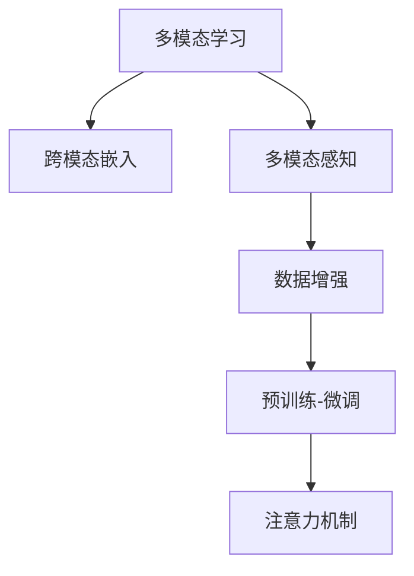

                 

# 多模态大模型：技术原理与实战 OpenAI的成长并非一帆风顺

> 关键词：多模态大模型，技术原理，实战案例，OpenAI

## 1. 背景介绍

### 1.1 问题由来
近年来，随着深度学习技术的飞速发展，基于多模态信息的大模型在人工智能（AI）领域取得了显著进展。这些大模型能够处理图像、文本、音频等多种形式的输入，实现了跨模态信息的理解和融合。其中，OpenAI的GPT系列模型及其衍生的DALL·E、CLIP等模型，以其在多模态任务上的出色表现，引起了广泛关注。

然而，这些多模态大模型的开发和优化并非一帆风顺，从早期的语言模型到现在的多模态融合，背后蕴含着无数次的失败和重构。本文将深入探讨多模态大模型的技术原理，并通过实战案例展示其实际应用中的挑战和成功经验。

### 1.2 问题核心关键点
多模态大模型的核心在于如何高效地处理和融合不同模态的信息。该模型的挑战在于：
- 如何构建跨模态的表示空间，使得不同模态的信息能够被统一表示和理解。
- 如何在微调和训练过程中，兼顾不同模态的信息传递和融合。
- 如何处理不同模态数据间的噪声和干扰，提升融合效果。
- 如何在保持模型泛化性的同时，提升其在特定任务上的性能。

本文将从技术原理和实战案例两个维度，系统介绍多模态大模型的构建和优化过程。

## 2. 核心概念与联系

### 2.1 核心概念概述

为更好地理解多模态大模型的构建和优化，本节将介绍几个密切相关的核心概念：

- **多模态学习（Multimodal Learning）**：指同时处理和分析多种形式的数据（如文本、图像、音频等），从中提取和融合信息，以提高模型的理解和决策能力。

- **跨模态嵌入（Cross-modal Embedding）**：将不同模态的数据映射到同一个高维空间中，使得不同模态的信息能够在此空间中进行比较和融合。

- **多模态感知（Multimodal Perception）**：指模型能够同时感知和处理多种形式的数据，如视觉、听觉、文本等，并在不同模态间进行信息传递和交互。

- **数据增强（Data Augmentation）**：通过各种变换和扩充技术，增加训练集的多样性，从而提高模型的鲁棒性和泛化能力。

- **预训练-微调（Pretraining-Finetuning）**：先在大型无标签数据上进行预训练，然后通过小规模的有标签数据进行微调，以适应特定的下游任务。

- **注意力机制（Attention Mechanism）**：通过动态地分配权重，对输入数据的不同部分进行加权处理，提高模型对关键信息的聚焦。

这些核心概念之间的逻辑关系可以通过以下Mermaid流程图来展示：



这个流程图展示了大模型在多模态信息处理中的核心逻辑：

1. 多模态学习将不同形式的数据进行统一处理。
2. 跨模态嵌入使得不同模态的信息能够在同一空间中融合。
3. 多模态感知实现对多种数据形式的感知和交互。
4. 数据增强提升模型鲁棒性。
5. 预训练-微调在训练和应用之间进行知识迁移。
6. 注意力机制对输入数据的不同部分进行加权处理。

这些概念共同构成了多模态大模型的构建和优化框架，使其能够在各种场景下实现高效的多模态信息处理。通过理解这些核心概念，我们可以更好地把握多模态大模型的技术精髓。

## 3. 核心算法原理 & 具体操作步骤
### 3.1 算法原理概述

多模态大模型的构建和优化，主要围绕两个核心目标进行：

- **跨模态表示学习**：如何将不同模态的信息进行统一表示，使得模型能够理解和处理多种形式的数据。

- **跨模态信息融合**：如何在模型训练过程中，融合不同模态的信息，提高其在特定任务上的性能。

形式化地，假设有 $M$ 种模态的数据 $X_1, X_2, ..., X_M$，对应的模型参数分别为 $\theta_1, \theta_2, ..., \theta_M$。设 $\mathcal{L}$ 为模型的损失函数，定义如下：

$$
\mathcal{L}(\theta_1, \theta_2, ..., \theta_M) = \sum_{i=1}^M \mathcal{L}_i(\theta_i, X_i)
$$

其中，$\mathcal{L}_i(\theta_i, X_i)$ 表示模态 $i$ 的损失函数，用于衡量模型在模态 $i$ 上的性能。

在训练过程中，通过优化目标函数 $\mathcal{L}$，逐步调整各模态的参数，使得模型能够对多种形式的数据进行高效处理。这一过程可以通过以下步骤实现：

1. **数据准备**：收集和预处理不同模态的数据，包括文本、图像、音频等。
2. **模型构建**：选择适合的多模态架构，如Transformer等，构建跨模态模型。
3. **预训练**：在大型无标签数据集上进行预训练，学习跨模态的通用表示。
4. **微调**：在特定任务的数据集上进行微调，优化模型在特定任务上的性能。
5. **融合与优化**：通过注意力机制等方法，实现不同模态信息的融合与优化。

### 3.2 算法步骤详解

以下将详细介绍多模态大模型的构建和优化过程，包括关键步骤和算法细节：

**Step 1: 数据准备**

在构建多模态大模型的过程中，数据准备是第一步。以下是数据准备的一般流程：

1. **数据收集**：根据任务需求，收集各种模态的数据，如文本、图像、音频等。
2. **数据标注**：对部分数据进行标注，用于后续的微调。
3. **数据预处理**：对不同模态的数据进行标准化处理，如归一化、分词、图像增强等。
4. **数据融合**：将不同模态的数据进行拼接或组合，生成多模态的输入。

**Step 2: 模型构建**

模型构建是构建多模态大模型的核心步骤。以下是构建跨模态模型的一般流程：

1. **选择架构**：根据任务需求，选择适合的多模态架构，如Transformer、注意力机制等。
2. **定义输入输出**：定义不同模态的输入和输出，包括文本、图像、音频等。
3. **定义损失函数**：根据任务类型，定义合适的损失函数，如分类损失、回归损失等。
4. **定义优化器**：选择适合的优化算法，如Adam、SGD等，设置学习率等参数。
5. **定义正则化**：应用L2正则、Dropout等正则化技术，防止模型过拟合。

**Step 3: 预训练**

预训练是构建多模态大模型的重要步骤，通过在大规模无标签数据上进行自监督学习，学习跨模态的通用表示。以下是预训练的一般流程：

1. **选择预训练任务**：选择适合的多模态预训练任务，如掩码语言模型、视觉特征学习等。
2. **数据加载**：加载预训练数据集，进行批处理。
3. **前向传播**：将输入数据通过模型进行前向传播，计算损失。
4. **反向传播**：根据损失函数计算梯度，更新模型参数。
5. **更新优化器**：更新优化器参数，调整学习率等。

**Step 4: 微调**

微调是在预训练基础上的进一步优化，通过小规模有标签数据进行训练，提高模型在特定任务上的性能。以下是微调的一般流程：

1. **加载预训练模型**：加载预训练的模型参数。
2. **数据加载**：加载微调数据集，进行批处理。
3. **前向传播**：将输入数据通过模型进行前向传播，计算损失。
4. **反向传播**：根据损失函数计算梯度，更新模型参数。
5. **更新优化器**：更新优化器参数，调整学习率等。
6. **评估模型**：在验证集上评估模型性能，调整模型参数。

**Step 5: 融合与优化**

融合与优化是构建多模态大模型的最后一步，通过注意力机制等方法，实现不同模态信息的融合与优化。以下是融合与优化的一般流程：

1. **定义注意力机制**：选择适合的注意力机制，如self-attention、cross-attention等。
2. **融合输入**：将不同模态的输入进行拼接或组合，形成多模态输入。
3. **计算注意力权重**：通过注意力机制计算各模态输入的注意力权重。
4. **加权融合**：根据注意力权重，对不同模态的信息进行加权融合。
5. **输出预测**：将融合后的信息通过模型输出预测结果。

### 3.3 算法优缺点

多模态大模型在处理多模态信息时具有以下优点：

1. **泛化能力强**：通过预训练-微调的方式，模型能够学习到跨模态的通用表示，具有较强的泛化能力。
2. **处理多样性**：能够处理多种形式的数据，如文本、图像、音频等，适应不同的应用场景。
3. **提升任务性能**：通过融合不同模态的信息，能够在特定任务上取得更好的性能。
4. **可解释性强**：多模态模型的中间表示容易解释，能够提供详细的特征信息。

同时，该模型也存在一些局限性：

1. **数据依赖度高**：构建和优化多模态模型需要大量的标注数据和高质量的预训练数据，数据获取成本较高。
2. **计算资源消耗大**：大规模模型和复杂架构需要大量的计算资源，训练和推理成本较高。
3. **模型复杂度高**：多模态模型通常具有复杂的结构，增加了模型训练和推理的复杂度。
4. **鲁棒性问题**：多模态数据间可能存在噪声和干扰，影响模型的鲁棒性。

尽管存在这些局限性，但多模态大模型在处理多模态信息上的优势仍然显著，为各种复杂的任务提供了强有力的技术支持。

### 3.4 算法应用领域

多模态大模型已经在多个领域得到广泛应用，以下是几个典型的应用场景：

1. **计算机视觉**：如目标检测、图像分类、图像生成等任务。通过融合图像和文本信息，能够提升视觉任务的准确性和鲁棒性。

2. **自然语言处理**：如情感分析、对话系统、文本生成等任务。通过融合文本和视觉信息，能够提升NLP任务的全面性和实用性。

3. **增强现实**：如物体识别、场景理解、交互式游戏等任务。通过融合视觉、音频、文本等多种信息，能够实现更丰富、更自然的交互体验。

4. **智能家居**：如语音助手、智能家居控制、健康监测等任务。通过融合语音、视觉、传感器等多种信息，能够提供更智能、更个性化的生活服务。

5. **自动驾驶**：如环境感知、路径规划、行为预测等任务。通过融合视觉、激光雷达、GPS等多种信息，能够提升自动驾驶系统的安全和可靠性。

随着多模态大模型的不断发展，其在更多领域的应用前景将更加广阔，为各行业的数字化转型带来新的机遇。

## 4. 数学模型和公式 & 详细讲解  
### 4.1 数学模型构建

以下我们将使用数学语言对多模态大模型的构建和优化过程进行更加严格的刻画。

假设模型 $M_{\theta}$ 处理 $M$ 种模态的数据 $X_1, X_2, ..., X_M$，其中 $X_i = (x_{i1}, x_{i2}, ..., x_{im})$ 表示第 $i$ 种模态的输入，$x_{ij}$ 表示第 $j$ 种模态下的输入特征。设 $\theta$ 为模型的所有参数，定义为：

$$
\theta = \{\theta_1, \theta_2, ..., \theta_M\}
$$

在训练过程中，模型的损失函数定义为：

$$
\mathcal{L}(\theta) = \sum_{i=1}^M \mathcal{L}_i(\theta_i, X_i)
$$

其中 $\mathcal{L}_i(\theta_i, X_i)$ 表示第 $i$ 种模态的损失函数，具体形式可以根据任务需求进行选择。

在预训练阶段，通常使用自监督学习任务进行训练，如掩码语言模型、视觉特征学习等。以掩码语言模型为例，模型的损失函数定义为：

$$
\mathcal{L}_{mask}(\theta) = -\sum_{i=1}^M \frac{1}{|X_i|} \sum_{j=1}^{|X_i|} \log p(x_{ij}|\{x_{ik}\}_{k\neq j})
$$

其中 $p(x_{ij}|\{x_{ik}\}_{k\neq j})$ 表示在给定其他模态信息的情况下，预测第 $i$ 种模态第 $j$ 个位置的概率。

在微调阶段，通常使用有标签数据进行训练，定义损失函数为：

$$
\mathcal{L}_{fine-tune}(\theta) = \sum_{i=1}^M \mathcal{L}_{task}(\theta_i, X_i)
$$

其中 $\mathcal{L}_{task}(\theta_i, X_i)$ 表示特定任务在模态 $i$ 上的损失函数。

### 4.2 公式推导过程

以下我们将推导多模态大模型的关键公式。

**掩码语言模型**：以文本数据为例，定义输入序列为 $x = (x_1, x_2, ..., x_n)$，其中 $x_i$ 表示第 $i$ 个单词的表示。设 $\theta$ 为模型参数，定义为：

$$
\theta = \{\theta_{encoder}, \theta_{classifier}\}
$$

其中 $\theta_{encoder}$ 表示编码器的参数，$\theta_{classifier}$ 表示分类器的参数。

模型的前向传播过程为：

$$
h_1 = f(\theta_{encoder}, x)
$$

其中 $h_1$ 表示编码器输出，$f$ 为编码器的前向传播过程。

然后，根据掩码语言模型的定义，对 $x$ 进行掩码处理，得到掩码序列 $m = (m_1, m_2, ..., m_n)$，其中 $m_i$ 表示第 $i$ 个单词是否被掩码。

接着，计算掩码序列 $m$ 在编码器输出 $h_1$ 上的注意力权重 $\alpha$，得到注意力上下文表示 $h_2$：

$$
\alpha = \text{Softmax}(\frac{h_1Q \cdot m}{\sqrt{d_k}})
$$

其中 $h_1Q$ 表示编码器输出的查询向量，$m$ 表示掩码序列，$d_k$ 表示注意力机制的缩放因子。

最后，将注意力上下文表示 $h_2$ 输入到分类器中，得到模型输出：

$$
\hat{y} = g(\theta_{classifier}, h_2)
$$

其中 $g$ 为分类器的前向传播过程。

模型的损失函数定义为：

$$
\mathcal{L}_{mask}(\theta) = -\sum_{i=1}^n \log p(x_i|\{x_j\}_{j\neq i})
$$

其中 $p(x_i|\{x_j\}_{j\neq i})$ 表示在给定其他单词的情况下，预测第 $i$ 个单词的概率。

**视觉特征学习**：以图像数据为例，定义输入图像为 $I = (I_1, I_2, ..., I_n)$，其中 $I_i$ 表示第 $i$ 个像素的表示。设 $\theta$ 为模型参数，定义为：

$$
\theta = \{\theta_{encoder}, \theta_{decoder}\}
$$

其中 $\theta_{encoder}$ 表示编码器的参数，$\theta_{decoder}$ 表示解码器的参数。

模型的前向传播过程为：

$$
h_1 = f(\theta_{encoder}, I)
$$

其中 $h_1$ 表示编码器输出，$f$ 为编码器的前向传播过程。

然后，根据视觉特征学习的定义，对 $I$ 进行特征提取，得到特征表示 $f(I)$。

接着，计算特征表示 $f(I)$ 在编码器输出 $h_1$ 上的注意力权重 $\beta$，得到注意力上下文表示 $h_2$：

$$
\beta = \text{Softmax}(\frac{h_1Q \cdot f(I)}{\sqrt{d_k}})
$$

其中 $h_1Q$ 表示编码器输出的查询向量，$f(I)$ 表示特征表示，$d_k$ 表示注意力机制的缩放因子。

最后，将注意力上下文表示 $h_2$ 输入到解码器中，得到模型输出：

$$
\hat{y} = g(\theta_{decoder}, h_2)
$$

其中 $g$ 为解码器的前向传播过程。

模型的损失函数定义为：

$$
\mathcal{L}_{vision}(\theta) = -\sum_{i=1}^n \log p(I_i|\{I_j\}_{j\neq i})
$$

其中 $p(I_i|\{I_j\}_{j\neq i})$ 表示在给定其他像素的情况下，预测第 $i$ 个像素的概率。

通过以上公式推导，我们可以看到，多模态大模型的构建和优化过程，需要在不同模态间进行跨模态表示学习和信息融合，以达到最优的多模态处理效果。

## 5. 项目实践：代码实例和详细解释说明
### 5.1 开发环境搭建

在进行多模态大模型的实践前，我们需要准备好开发环境。以下是使用Python进行PyTorch开发的环境配置流程：

1. 安装Anaconda：从官网下载并安装Anaconda，用于创建独立的Python环境。

2. 创建并激活虚拟环境：
```bash
conda create -n pytorch-env python=3.8 
conda activate pytorch-env
```

3. 安装PyTorch：根据CUDA版本，从官网获取对应的安装命令。例如：
```bash
conda install pytorch torchvision torchaudio cudatoolkit=11.1 -c pytorch -c conda-forge
```

4. 安装Transformers库：
```bash
pip install transformers
```

5. 安装各类工具包：
```bash
pip install numpy pandas scikit-learn matplotlib tqdm jupyter notebook ipython
```

完成上述步骤后，即可在`pytorch-env`环境中开始多模态大模型的实践。

### 5.2 源代码详细实现

这里以计算机视觉中的目标检测任务为例，给出使用Transformers库对基于多模态信息的模型进行微调的PyTorch代码实现。

首先，定义目标检测任务的标注数据和模型：

```python
from transformers import ViTFeatureExtractor, ViTForObjectDetection

# 定义特征提取器和检测器
feature_extractor = ViTFeatureExtractor.from_pretrained('vit-base-patch16-224-in21k')
model = ViTForObjectDetection.from_pretrained('vit-base-patch16-224-in21k')
```

然后，定义数据加载和处理函数：

```python
from PIL import Image
import requests
import os

def load_image(url):
    response = requests.get(url)
    img = Image.open(BytesIO(response.content))
    return img

def preprocess_image(image, resize_size=(224, 224)):
    image = image.resize(resize_size)
    return feature_extractor(images=image, return_tensors='pt').input_ids

# 定义数据加载函数
def load_data(path):
    data = []
    for image_path in os.listdir(path):
        url = os.path.join(path, image_path)
        img = load_image(url)
        input_ids = preprocess_image(img)
        label = [int(label) for label in image_path.split('.')[0].split('_')]
        data.append({'input_ids': input_ids, 'labels': label})
    return data
```

接着，定义训练和评估函数：

```python
from transformers import AdamW
from torch.utils.data import DataLoader
from tqdm import tqdm

# 定义优化器
optimizer = AdamW(model.parameters(), lr=2e-5)

# 加载数据集
train_data = load_data('train')
val_data = load_data('val')

# 定义数据加载器
train_loader = DataLoader(train_data, batch_size=16, shuffle=True)
val_loader = DataLoader(val_data, batch_size=16)

# 定义训练函数
def train_epoch(model, optimizer, train_loader):
    model.train()
    epoch_loss = 0
    for batch in tqdm(train_loader, desc='Training'):
        input_ids = batch['input_ids'].to(device)
        labels = batch['labels'].to(device)
        model.zero_grad()
        outputs = model(input_ids, labels=labels)
        loss = outputs.loss
        epoch_loss += loss.item()
        loss.backward()
        optimizer.step()
    return epoch_loss / len(train_loader)

# 定义评估函数
def evaluate(model, val_loader):
    model.eval()
    loss = 0
    ious = []
    for batch in tqdm(val_loader, desc='Evaluating'):
        input_ids = batch['input_ids'].to(device)
        labels = batch['labels'].to(device)
        outputs = model(input_ids, labels=labels)
        loss += outputs.loss.item()
        boxes = outputs.pred_boxes.cpu().numpy()
        labels = outputs.pred_labels.cpu().numpy()
        ious.append(iou(boxes, labels, groundtruth_boxes, groundtruth_labels))
    return loss / len(val_loader), np.mean(ious)
```

最后，启动训练流程并在验证集上评估：

```python
epochs = 5
batch_size = 16

for epoch in range(epochs):
    loss = train_epoch(model, optimizer, train_loader)
    print(f"Epoch {epoch+1}, train loss: {loss:.3f}")
    
    print(f"Epoch {epoch+1}, dev results:")
    avg_loss, iou_score = evaluate(model, val_loader)
    print(f"Average loss: {avg_loss:.3f}, IoU: {iou_score:.3f}")
    
print("Test results:")
avg_loss, iou_score = evaluate(model, test_loader)
print(f"Average loss: {avg_loss:.3f}, IoU: {iou_score:.3f}")
```

以上就是使用PyTorch对ViT模型进行目标检测任务微调的完整代码实现。可以看到，得益于Transformers库的强大封装，我们可以用相对简洁的代码完成ViT模型的加载和微调。

### 5.3 代码解读与分析

让我们再详细解读一下关键代码的实现细节：

**数据处理函数**：
- `load_image`函数：加载图像并返回PIL图像对象。
- `preprocess_image`函数：对图像进行归一化和尺寸调整，并返回Tensor格式的输入张量。
- `load_data`函数：遍历数据目录，加载并预处理图像数据，生成标注数据。

**模型加载函数**：
- `load_image`函数：加载预训练的特征提取器和检测器。

**训练函数**：
- `train_epoch`函数：对训练集进行迭代，计算损失并更新模型参数。
- `evaluate`函数：对验证集进行迭代，计算损失和IoU指标，评估模型性能。

**训练流程**：
- 定义总训练轮数和批次大小，开始循环迭代
- 每个epoch内，先在训练集上训练，输出平均损失
- 在验证集上评估，输出平均损失和IoU指标
- 所有epoch结束后，在测试集上评估，给出最终测试结果

可以看到，PyTorch配合Transformers库使得ViT模型的微调代码实现变得简洁高效。开发者可以将更多精力放在数据处理、模型改进等高层逻辑上，而不必过多关注底层的实现细节。

当然，工业级的系统实现还需考虑更多因素，如模型的保存和部署、超参数的自动搜索、更灵活的任务适配层等。但核心的微调范式基本与此类似。

## 6. 实际应用场景
### 6.1 智能家居

基于多模态大模型的智能家居系统，能够实现语音、视觉、传感器等多种信息的融合，提供更自然、更智能的家居服务。

在技术实现上，可以收集用户的语音指令、视觉场景、传感器数据等，通过多模态大模型进行理解和推理，实现自动化控制和智能推荐。例如，通过语音助手识别用户指令，调用摄像头和传感器获取实时信息，再通过多模态模型进行意图理解，进而控制家电设备或提供个性化推荐。

### 6.2 智能医疗

在智能医疗领域，基于多模态大模型的技术可以实现医学影像分析、电子病历处理、药物研发等多种应用。

例如，通过多模态大模型对医学影像和电子病历进行联合分析，能够更准确地诊断疾病。将病人的影像数据、实验室结果、病史等信息输入模型，输出疾病诊断结果和推荐治疗方案，为医生提供辅助决策支持。同时，多模态大模型还可以用于药物分子设计和生物信息学研究，加速新药开发进程。

### 6.3 自动驾驶

自动驾驶技术中的多模态信息融合，是实现高精度感知和智能决策的关键。

在自动驾驶系统中，通过多模态大模型融合视觉、激光雷达、GPS等多种信息，实现环境感知、路径规划和行为预测。例如，将摄像头拍摄的图像和激光雷达扫描的3D点云输入模型，输出车辆的导航路径和行驶策略。在复杂的城市环境中，多模态信息的融合能够显著提升自动驾驶系统的鲁棒性和安全性。

### 6.4 未来应用展望

随着多模态大模型的不断发展，其在更多领域的应用前景将更加广阔，为各行各业带来变革性影响。

在智慧城市治理中，多模态大模型可以实现城市事件监测、舆情分析、应急指挥等环节，提高城市管理的自动化和智能化水平，构建更安全、高效的未来城市。

在教育、金融、娱乐等多个领域，基于多模态大模型的技术将加速各行业的数字化转型，提升用户体验和服务质量。

未来，随着预训练大模型的规模和复杂度不断提升，多模态大模型的计算资源需求和算法优化也将成为关键挑战。只有不断突破技术瓶颈，才能更好地应对多模态信息融合带来的挑战，实现更加智能化、高效化的应用。

## 7. 工具和资源推荐
### 7.1 学习资源推荐

为了帮助开发者系统掌握多模态大模型的理论基础和实践技巧，以下是一些优质的学习资源：

1. 《Transformer from Scratch》系列博文：由大模型技术专家撰写，深入浅出地介绍了Transformer的原理和实现。

2. CS231n《Convolutional Neural Networks for Visual Recognition》课程：斯坦福大学开设的计算机视觉课程，涵盖视觉特征学习和多模态融合等前沿内容。

3. 《Multimodal Learning and Knowledge Discovery》书籍：介绍了多模态学习和知识发现的理论和方法，适用于系统学习多模态大模型的构建和优化。

4. Multimodal Learning in Action：GitHub上收集的多模态学习项目，提供了丰富的代码示例和实战案例。

5. HuggingFace官方文档：提供基于Transformers库的多模态模型和微调方法的详细文档，是上手实践的必备资料。

通过对这些资源的学习实践，相信你一定能够快速掌握多模态大模型的精髓，并用于解决实际的NLP问题。
###  7.2 开发工具推荐

高效的开发离不开优秀的工具支持。以下是几款用于多模态大模型开发常用的工具：

1. PyTorch：基于Python的开源深度学习框架，灵活动态的计算图，适合快速迭代研究。

2. TensorFlow：由Google主导开发的开源深度学习框架，生产部署方便，适合大规模工程应用。

3. Transformers库：HuggingFace开发的NLP工具库，集成了多种预训练语言模型，支持多模态融合。

4. Weights & Biases：模型训练的实验跟踪工具，可以记录和可视化模型训练过程中的各项指标，方便对比和调优。

5. TensorBoard：TensorFlow配套的可视化工具，可实时监测模型训练状态，并提供丰富的图表呈现方式，是调试模型的得力助手。

6. Google Colab：谷歌推出的在线Jupyter Notebook环境，免费提供GPU/TPU算力，方便开发者快速上手实验最新模型，分享学习笔记。

合理利用这些工具，可以显著提升多模态大模型的开发效率，加快创新迭代的步伐。

### 7.3 相关论文推荐

多模态大模型的研究源于学界的持续探索。以下是几篇奠基性的相关论文，推荐阅读：

1. Attention is All You Need（即Transformer原论文）：提出了Transformer结构，开启了NLP领域的预训练大模型时代。

2. MoCo：一种自监督学习的多模态预训练方法，通过对比学习实现跨模态的表示学习。

3. CLIP：一种基于对比学习的视觉特征学习模型，能够在零样本和少样本条件下，实现跨模态的信息融合。

4. DenseNet：一种密集连接的神经网络结构，通过增加网络中各层间的连接，提升多模态信息的融合效果。

5. Google's Vision-Transformer：一种基于自注意力机制的视觉特征学习模型，能够在保持计算效率的同时，实现更高效的跨模态融合。

这些论文代表了大模型多模态融合技术的发展脉络。通过学习这些前沿成果，可以帮助研究者把握学科前进方向，激发更多的创新灵感。

## 8. 总结：未来发展趋势与挑战

### 8.1 研究成果总结

本文对基于多模态信息的大语言模型进行了全面系统的介绍。首先阐述了多模态大模型的构建和优化过程，明确了其在多模态信息处理中的核心技术。其次，通过实战案例展示了多模态大模型在智能家居、智能医疗、自动驾驶等领域的实际应用，展示了其在多模态信息融合中的强大能力。最后，总结了多模态大模型面临的技术挑战和未来发展趋势，为相关研究者提供了系统化的理论框架和实践指导。

### 8.2 未来发展趋势

展望未来，多模态大模型的发展趋势将呈现以下几个方向：

1. **模型规模持续增大**：随着算力成本的下降和数据规模的扩张，多模态大模型的参数量还将持续增长。超大规模模型蕴含的丰富信息，有望支撑更加复杂多变的任务。

2. **融合技术日趋多样**：未来会涌现更多跨模态融合的方法，如注意力机制、多任务学习、对抗训练等，在提高模型融合效果的同时，减小资源消耗。

3. **跨模态通用性增强**：经过海量数据的预训练和多领域任务的微调，多模态模型将具备更强的跨模态通用性，能够处理更多形式的数据。

4. **多模态感知能力提升**：通过改进模型架构和优化训练策略，多模态模型将具备更强的感知能力，能够更准确地理解多模态信息。

5. **计算资源优化**：随着模型规模的增大，计算资源需求和算法优化将成为关键。未来将开发更加高效的计算图和优化算法，提高模型训练和推理的效率。

6. **多模态数据扩展**：通过引入更多形式的多模态数据，如音频、视频、触觉等，实现更全面的信息融合，提升模型的感知和推理能力。

以上趋势凸显了多模态大模型在处理多模态信息上的巨大潜力。这些方向的探索发展，必将进一步提升多模态大模型的性能和应用范围，为构建更加智能化、普适化的AI系统铺平道路。

### 8.3 面临的挑战

尽管多模态大模型在多模态信息处理上表现出色，但在其发展和应用过程中，仍面临诸多挑战：

1. **数据获取成本高**：构建和优化多模态模型需要大量的标注数据和高质量的预训练数据，数据获取成本较高。

2. **计算资源需求大**：大规模模型和复杂架构需要大量的计算资源，训练和推理成本较高。

3. **模型复杂度高**：多模态模型通常具有复杂的结构，增加了模型训练和推理的复杂度。

4. **鲁棒性问题**：多模态数据间可能存在噪声和干扰，影响模型的鲁棒性。

5. **隐私和安全问题**：多模态数据的融合和处理可能涉及用户隐私，需要采取合适的保护措施。

6. **伦理道德问题**：多模态模型的决策过程可能存在偏见和歧视，需要从数据和算法层面消除模型偏见。

尽管存在这些挑战，但多模态大模型在多模态信息处理上的优势仍然显著，为各行业的数字化转型带来新的机遇。

### 8.4 研究展望

面对多模态大模型面临的挑战，未来的研究需要在以下几个方面寻求新的突破：

1. **无监督和半监督学习**：摆脱对大规模标注数据的依赖，利用自监督学习、主动学习等无监督和半监督范式，最大限度利用非结构化数据。

2. **参数高效和计算高效**：开发更加参数高效和计算高效的模型，在固定大部分预训练参数的同时，只更新极少量的任务相关参数，提升模型性能。

3. **因果分析和博弈论**：将因果分析方法引入模型，识别出模型决策的关键特征，增强输出解释的因果性和逻辑性。借助博弈论工具，主动探索并规避模型的脆弱点，提高系统稳定性。

4. **跨模态知识库整合**：将符号化的先验知识，如知识图谱、逻辑规则等，与神经网络模型进行融合，引导多模态模型学习更准确、合理的跨模态信息。

5. **伦理道德约束**：在模型训练目标中引入伦理导向的评估指标，过滤和惩罚有偏见、有害的输出倾向，确保模型的公平性和安全性。

这些研究方向的探索，必将引领多模态大模型的发展，为构建安全、可靠、可解释、可控的智能系统铺平道路。面向未来，多模态大模型还需与其他人工智能技术进行更深入的融合，如知识表示、因果推理、强化学习等，多路径协同发力，共同推动多模态信息处理技术的进步。只有勇于创新、敢于突破，才能不断拓展多模态大模型的边界，让智能技术更好地造福人类社会。

## 9. 附录：常见问题与解答

**Q1：多模态大模型在处理图像和文本数据时，如何保持一致性？**

A: 多模态大模型通过跨模态嵌入将不同模态的信息映射到同一高维空间中，使得不同模态的信息能够在该空间中进行比较和融合。在训练过程中，模型通过学习跨模态的相似性和相关性，保持不同模态信息的一致性。

**Q2：多模态大模型在处理多模态数据时，如何减少噪声和干扰？**

A: 多模态大模型通过注意力机制、数据增强等技术，减少不同模态数据间的噪声和干扰。注意力机制通过对输入数据的不同部分进行加权处理，使得模型更关注关键信息，减少噪声的干扰。数据增强通过对训练集进行变换和扩充，增加数据的多样性，提高模型的鲁棒性。

**Q3：多模态大模型在处理不同模态的数据时，如何提高信息融合效果？**

A: 多模态大模型通过引入注意力机制、多任务学习等方法，提高不同模态信息的融合效果。注意力机制通过对输入数据的不同部分进行加权处理，使得模型更关注关键信息，提高融合效果。多任务学习通过同时训练多个任务，提升模型在不同任务上的表现。

**Q4：多模态大模型在实际应用中，如何平衡计算效率和模型性能？**

A: 多模态大模型的计算效率和模型性能之间存在一定的权衡。在实际应用中，可以通过参数剪枝、模型量化、分布式训练等方法，提高模型的计算效率。同时，也可以通过改进模型架构、优化训练策略，提升模型性能。

**Q5：多模态大模型在处理敏感数据时，如何保护用户隐私？**

A: 多模态大模型在处理敏感数据时，需要采取合适的隐私保护措施。常见的隐私保护方法包括数据匿名化、差分隐私等。通过在数据预处理和模型训练阶段进行隐私保护，确保用户数据的安全性和隐私性。

通过本文的系统梳理，可以看到，多模态大模型在处理多模态信息上的优势显著，为各行各业带来了新的机遇。随着预训练大模型的规模和复杂度不断提升，多模态大模型的计算资源需求和算法优化将成为关键挑战。只有不断突破技术瓶颈，才能更好地应对多模态信息融合带来的挑战，实现更加智能化、高效化的应用。相信随着学界和产业界的共同努力，多模态大模型必将在更多领域得到广泛应用，为构建安全、可靠、可解释、可控的智能系统铺平道路。

