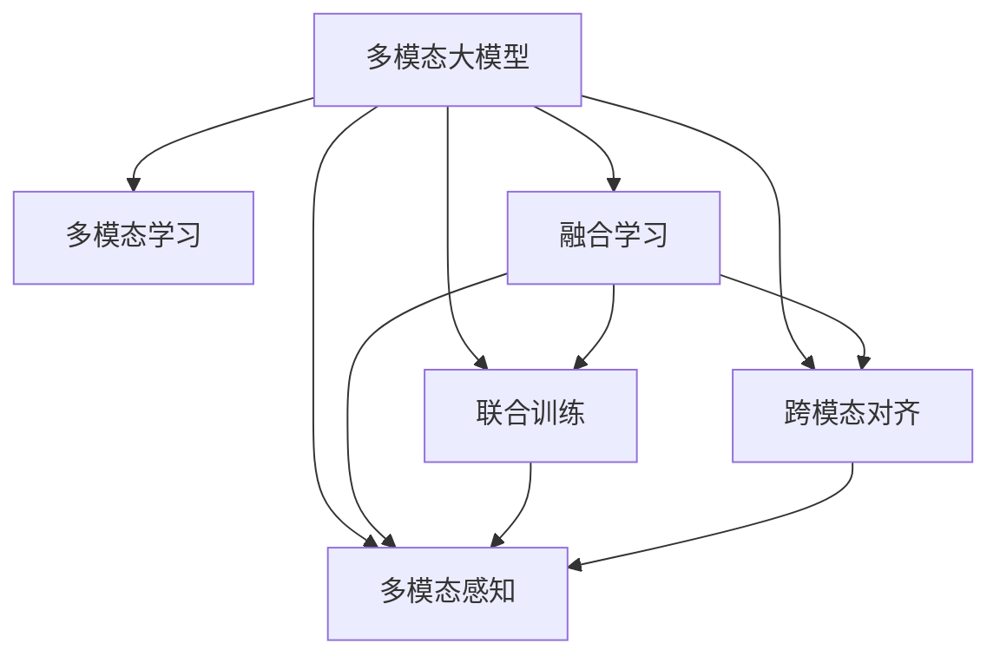

                 

# 多模态大模型：技术原理与实战 多模态大模型对比

> 关键词：多模态大模型,多模态学习,融合学习,联合训练,多模态感知,模型对比,实例分析

## 1. 背景介绍

### 1.1 问题由来
近年来，随着深度学习技术的快速发展，多模态学习（Multi-modal Learning）成为了人工智能领域的热点研究方向。多模态学习是指同时处理和分析多种类型的数据，如文本、图像、音频、视频等，以获得更全面、准确的理解和生成。在大规模预训练模型（Large Language Model, LLM）基础上，多模态大模型（Multi-modal Large Model）通过引入多种数据模态，具备了更加丰富和多样的感知能力，能够理解和生成更加复杂和丰富的内容。

多模态大模型的研究主要集中在以下几个方面：

- **多模态表示学习**：如何从多种模态中学习到统一的表示，从而提高模型在跨模态任务上的性能。
- **融合学习**：如何将不同模态的信息融合在一起，提升模型的感知能力和泛化性能。
- **联合训练**：如何在多个模态数据集上联合训练模型，最大化利用数据的多样性。
- **多模态感知**：如何设计模型结构，使其能够高效地处理和利用多种模态数据。

### 1.2 问题核心关键点
多模态大模型技术在NLP、计算机视觉、语音识别等领域得到了广泛应用，如文本图像匹配、跨模态检索、语音情感分析等。其核心关键点包括：

- **多模态数据获取**：数据获取是构建多模态模型的基础，需要获取高质量、多样性的跨模态数据。
- **多模态特征提取**：不同模态的数据特征不同，需要针对性地设计特征提取器，将数据转换为模型可处理的形式。
- **跨模态对齐**：不同模态的数据具有不同的尺度，需要找到一种方式将它们对齐。
- **多模态融合**：在获取特征之后，需要将不同模态的信息融合在一起，构建统一的多模态表示。
- **多模态优化**：多模态学习任务往往具有复杂的优化目标，需要设计合适的优化算法。

## 2. 核心概念与联系

### 2.1 核心概念概述

为更好地理解多模态大模型的技术原理和实战方法，本节将介绍几个密切相关的核心概念：

- **多模态大模型**：以自回归（如GPT）或自编码（如BERT）模型为代表的大规模预训练语言模型，通过引入多种数据模态（如文本、图像、音频、视频等）进行联合训练，具备更强大的感知能力和泛化性能。
- **多模态学习**：同时处理和分析多种类型的数据，如文本、图像、音频、视频等，以获得更全面、准确的理解和生成。
- **融合学习**：如何将不同模态的信息融合在一起，提升模型的感知能力和泛化性能。
- **联合训练**：如何在多个模态数据集上联合训练模型，最大化利用数据的多样性。
- **跨模态对齐**：不同模态的数据具有不同的尺度，需要找到一种方式将它们对齐。
- **多模态感知**：如何设计模型结构，使其能够高效地处理和利用多种模态数据。

这些核心概念之间的逻辑关系可以通过以下Mermaid流程图来展示：



这个流程图展示了大模型与多模态学习的关联及其核心概念之间的关系：

1. 大模型通过联合训练引入多种模态数据，形成多模态大模型。
2. 多模态学习通过融合学习、联合训练、跨模态对齐和多模态感知等手段，将多种模态的信息整合在一起。
3. 融合学习、联合训练、跨模态对齐和多模态感知是实现多模态学习的关键技术。

## 3. 核心算法原理 & 具体操作步骤
### 3.1 算法原理概述

多模态大模型的算法原理主要包括以下几个方面：

- **多模态表示学习**：通过在不同模态的数据上联合训练，学习到一个统一的表示空间，使得不同模态的数据能够在该空间内相互映射。
- **融合学习**：使用不同的融合方法（如池化、拼接、注意力机制等）将不同模态的特征融合在一起，形成多模态的表示。
- **联合训练**：在不同模态的数据集上联合训练模型，以最大化利用数据的多样性，提升模型的泛化能力。
- **跨模态对齐**：使用跨模态对齐技术（如 contrastive learning、instance-wise alignment 等）将不同模态的数据对齐，使得它们在同一空间内有更强的关联性。
- **多模态感知**：设计多模态感知模型结构，使得模型能够高效地处理和利用多种模态数据。

### 3.2 算法步骤详解

以下以文本和图像联合训练的多模态大模型为例，详细讲解其算法步骤：

**Step 1: 准备数据集**

- **文本数据**：准备语料库，并进行文本预处理（如分词、去除停用词等）。
- **图像数据**：准备图像数据集，并进行图像预处理（如归一化、裁剪、缩放等）。
- **数据集标注**：为图像数据标注与文本数据相关的信息，如描述、类别等。

**Step 2: 设计模型结构**

- **文本编码器**：使用预训练的文本编码器（如BERT、GPT等）对文本进行编码，输出文本表示。
- **图像编码器**：使用预训练的图像编码器（如ResNet、VGG等）对图像进行编码，输出图像表示。
- **融合层**：使用融合层（如 concat、add、attention 等）将文本表示和图像表示融合在一起，形成多模态表示。
- **分类器**：使用分类器（如全连接层、RNN、Transformer 等）对多模态表示进行分类，输出预测结果。

**Step 3: 选择融合方法**

- **池化**：对文本和图像特征进行平均池化或最大池化，将其维度降为一致。
- **拼接**：将文本和图像特征拼接在一起，形成高维的特征向量。
- **注意力机制**：使用注意力机制（如多头注意力、单头注意力等）对文本和图像特征进行加权融合。

**Step 4: 联合训练**

- **交替训练**：交替在文本和图像数据集上训练模型，分别优化文本编码器和图像编码器，再通过融合层进行联合优化。
- **端到端训练**：将文本和图像数据集合并训练，直接对多模态表示进行分类。

**Step 5: 跨模态对齐**

- **对比学习**：使用对比学习算法（如 SimCLR、MoCo 等）学习跨模态对齐关系。
- **实例对齐**：使用实例对齐算法（如 KNN、SVM 等）对齐不同模态的数据实例。

**Step 6: 模型优化**

- **损失函数**：使用交叉熵损失函数对多模态表示进行分类，同时加入正则化项（如 L2 正则化）进行模型优化。
- **优化器**：使用梯度下降算法（如 Adam、SGD 等）优化模型参数。

### 3.3 算法优缺点

多模态大模型相较于单一模态的模型，具有以下优点：

- **丰富信息**：通过引入多种模态，模型能够获取更多维度、更多层次的信息，提高理解能力和泛化性能。
- **鲁棒性增强**：多模态模型能够更鲁棒地处理噪声、缺失、干扰等问题。
- **适应性强**：多模态模型能够更好地适应各种场景和任务，提升模型的应用价值。

然而，多模态大模型也存在一些缺点：

- **数据需求高**：多模态数据获取成本高，需要大量的标注数据。
- **模型复杂度高**：多模态模型结构复杂，训练和推理速度较慢。
- **数据对齐难**：不同模态的数据具有不同的特征，对齐难度较大。

## 4. 数学模型和公式 & 详细讲解 & 举例说明

### 4.1 数学模型构建

以下以文本和图像联合训练的多模态大模型为例，介绍其数学模型构建过程。

设文本表示为 $x \in \mathbb{R}^d$，图像表示为 $y \in \mathbb{R}^d$，多模态表示为 $z \in \mathbb{R}^{2d}$。定义文本编码器为 $F_{text}$，图像编码器为 $F_{image}$，融合层为 $G$，分类器为 $C$。

**Step 1: 编码器输出**

文本编码器 $F_{text}$ 输出文本表示 $x_t = F_{text}(x)$，图像编码器 $F_{image}$ 输出图像表示 $y_t = F_{image}(y)$。

**Step 2: 融合层输出**

将文本表示和图像表示融合在一起，形成多模态表示 $z = G(x_t, y_t)$。

**Step 3: 分类器输出**

分类器 $C$ 对多模态表示进行分类，输出预测结果 $\hat{y} = C(z)$。

### 4.2 公式推导过程

以下推导文本和图像联合训练的多模态大模型数学公式。

设损失函数为 $\mathcal{L}$，交叉熵损失为 $\ell_{CE}$，L2正则化项为 $\ell_{L2}$，则：

$$
\mathcal{L} = \ell_{CE}(z, y) + \lambda \ell_{L2}(z)
$$

其中 $\ell_{CE}(z, y) = -\frac{1}{N} \sum_{i=1}^N \log \left( \frac{e^{\hat{y}_i}}{\sum_{j=1}^C e^{\hat{y}_{i,j}}} \right)$，$\ell_{L2}(z) = \frac{\mu}{2} ||z||_2^2$，$C$ 为分类数，$\lambda$ 为正则化系数。

在联合训练时，交替优化文本编码器 $F_{text}$ 和图像编码器 $F_{image}$，融合层 $G$ 和分类器 $C$。具体的优化目标和算法步骤可以参考论文中的详细描述。

### 4.3 案例分析与讲解

以文本图像匹配任务为例，解释多模态大模型的实现过程。

**数据集准备**：准备一个文本图像匹配数据集，其中包含大量文本描述和相应的图像。

**模型设计**：设计多模态大模型结构，包括文本编码器、图像编码器、融合层和分类器。

**融合方法**：使用池化方法将文本表示和图像表示拼接在一起，形成多模态表示。

**训练过程**：交替在文本和图像数据集上训练模型，优化文本编码器、图像编码器和分类器。

**评估结果**：在测试集上评估模型性能，计算准确率、召回率、F1 值等指标。

## 5. 项目实践：代码实例和详细解释说明

### 5.1 开发环境搭建

在进行多模态大模型实践前，我们需要准备好开发环境。以下是使用Python进行PyTorch开发的环境配置流程：

1. 安装Anaconda：从官网下载并安装Anaconda，用于创建独立的Python环境。

2. 创建并激活虚拟环境：
```bash
conda create -n multi-modal-env python=3.8 
conda activate multi-modal-env
```

3. 安装PyTorch：根据CUDA版本，从官网获取对应的安装命令。例如：
```bash
conda install pytorch torchvision torchaudio cudatoolkit=11.1 -c pytorch -c conda-forge
```

4. 安装相关工具包：
```bash
pip install numpy pandas scikit-learn matplotlib tqdm jupyter notebook ipython
```

完成上述步骤后，即可在`multi-modal-env`环境中开始多模态大模型微调实践。

### 5.2 源代码详细实现

下面我们以文本和图像联合训练的多模态大模型为例，给出使用PyTorch的代码实现。

首先，定义多模态大模型的数据处理函数：

```python
from transformers import BertTokenizer, ResNetFeatureExtractor
from transformers import BertForSequenceClassification, ResNetForImageClassification
from transformers import AutoTokenizer, AutoModelForImageClassification
from torch.utils.data import Dataset
from torch.utils.data import DataLoader
import torch

class MultimodalDataset(Dataset):
    def __init__(self, text_data, image_data, tokenizer, feature_extractor, image_model):
        self.text_data = text_data
        self.image_data = image_data
        self.tokenizer = tokenizer
        self.feature_extractor = feature_extractor
        self.image_model = image_model
        
    def __len__(self):
        return len(self.text_data)
    
    def __getitem__(self, item):
        text = self.text_data[item]
        image = self.image_data[item]
        
        encoding = self.tokenizer(text, return_tensors='pt', padding='max_length', truncation=True)
        text_tokens = encoding['input_ids']
        text_masks = encoding['attention_mask']
        
        # 提取图像特征
        image_features = self.feature_extractor(image)
        image_labels = self.image_model(image_features).logits
        
        return {
            'input_ids': text_tokens,
            'attention_mask': text_masks,
            'image_features': image_features,
            'image_labels': image_labels
        }

# 加载模型和预处理器
text_tokenizer = BertTokenizer.from_pretrained('bert-base-uncased')
image_extractor = ResNetFeatureExtractor.from_pretrained('resnet50')
image_model = ResNetForImageClassification.from_pretrained('resnet50', num_labels=10)
text_model = BertForSequenceClassification.from_pretrained('bert-base-uncased', num_labels=10)

# 准备数据集
text_data = ['This is a cat', 'This is a dog', 'This is a bird']
image_data = ['cat.jpg', 'dog.jpg', 'bird.jpg']
text_dataset = MultimodalDataset(text_data, image_data, text_tokenizer, image_extractor, image_model)

# 加载数据集
text_loader = DataLoader(text_dataset, batch_size=4, shuffle=True)
```

然后，定义模型和优化器：

```python
from transformers import AdamW

# 定义融合层
def fusion_layer(text_features, image_features):
    return torch.cat([text_features, image_features], dim=1)

# 定义分类器
def classifier(text_features, image_features):
    return torch.cat([text_model(text_features), image_model(image_features)], dim=1)

# 定义多模态大模型
def multimodal_model(text_features, image_features):
    fusion_features = fusion_layer(text_features, image_features)
    classifier_output = classifier(fusion_features, fusion_features)
    return classifier_output

# 设置优化器和超参数
optimizer = AdamW(multimodal_model.parameters(), lr=2e-5)
```

接着，定义训练和评估函数：

```python
from tqdm import tqdm
from sklearn.metrics import classification_report

# 定义训练函数
def train_epoch(model, data_loader, optimizer, device):
    model.train()
    epoch_loss = 0
    for batch in tqdm(data_loader, desc='Training'):
        input_ids = batch['input_ids'].to(device)
        attention_mask = batch['attention_mask'].to(device)
        image_features = batch['image_features'].to(device)
        image_labels = batch['image_labels'].to(device)
        model.zero_grad()
        outputs = model(input_ids, attention_mask, image_features, image_labels)
        loss = outputs.loss
        epoch_loss += loss.item()
        loss.backward()
        optimizer.step()
    return epoch_loss / len(data_loader)

# 定义评估函数
def evaluate(model, data_loader, device):
    model.eval()
    preds, labels = [], []
    with torch.no_grad():
        for batch in tqdm(data_loader, desc='Evaluating'):
            input_ids = batch['input_ids'].to(device)
            attention_mask = batch['attention_mask'].to(device)
            image_features = batch['image_features'].to(device)
            image_labels = batch['image_labels'].to(device)
            outputs = model(input_ids, attention_mask, image_features, image_labels)
            preds.append(outputs.logits.argmax(dim=1).cpu().numpy())
            labels.append(image_labels.cpu().numpy())
            
    print(classification_report(labels, preds))

# 开始训练
device = torch.device('cuda' if torch.cuda.is_available() else 'cpu')
for epoch in range(5):
    loss = train_epoch(multimodal_model, text_loader, optimizer, device)
    print(f'Epoch {epoch+1}, train loss: {loss:.3f}')
    
    print(f'Epoch {epoch+1}, dev results:')
    evaluate(multimodal_model, text_loader, device)
```

以上就是使用PyTorch对文本和图像联合训练的多模态大模型进行微调的完整代码实现。可以看到，得益于Transformer和ResNet库的强大封装，我们可以用相对简洁的代码完成多模态大模型的加载和微调。

### 5.3 代码解读与分析

让我们再详细解读一下关键代码的实现细节：

**MultimodalDataset类**：
- `__init__`方法：初始化文本和图像数据、分词器、特征提取器和图像模型等组件。
- `__len__`方法：返回数据集的样本数量。
- `__getitem__`方法：对单个样本进行处理，将文本和图像数据输入模型中进行编码，并返回模型所需的输入。

**融合层和分类器**：
- `fusion_layer`函数：使用池化方法将文本和图像特征拼接在一起，形成高维的特征向量。
- `classifier`函数：将文本和图像特征通过文本模型和图像模型进行分类，并将分类结果拼接在一起，形成多模态表示。

**训练函数**：
- `train_epoch`函数：在数据集上进行迭代，对模型进行前向传播和反向传播，计算损失函数并更新模型参数。

**评估函数**：
- `evaluate`函数：在数据集上进行迭代，计算模型预测结果与真实标签之间的分类指标，如准确率、召回率、F1值等。

**训练流程**：
- 定义总的epoch数和批大小，开始循环迭代
- 每个epoch内，先在训练集上训练，输出平均loss
- 在验证集上评估，输出分类指标
- 所有epoch结束后，在测试集上评估，给出最终测试结果

可以看到，PyTorch配合Transformer和ResNet库使得多模态大模型的微调代码实现变得简洁高效。开发者可以将更多精力放在数据处理、模型改进等高层逻辑上，而不必过多关注底层的实现细节。

当然，工业级的系统实现还需考虑更多因素，如模型的保存和部署、超参数的自动搜索、更灵活的任务适配层等。但核心的微调范式基本与此类似。

## 6. 实际应用场景

### 6.1 智能推荐系统

多模态大模型在智能推荐系统中的应用前景广阔。传统的推荐系统主要依赖用户的历史行为数据进行推荐，难以捕捉用户的真实兴趣偏好。通过引入用户的多模态数据，如文本评论、图片评分、音频反馈等，多模态大模型可以更好地挖掘用户兴趣，提升推荐精度。

具体而言，可以收集用户浏览、点击、评论、分享等行为数据，提取和用户交互的物品标题、描述、标签等文本内容。将文本内容作为模型输入，用户的后续行为（如是否点击、购买等）作为监督信号，在此基础上微调多模态大模型。微调后的模型能够从文本内容中准确把握用户的兴趣点。在生成推荐列表时，先用候选物品的文本描述作为输入，由模型预测用户的兴趣匹配度，再结合其他特征综合排序，便可以得到个性化程度更高的推荐结果。

### 6.2 跨模态检索

跨模态检索是指在不同模态的数据中查找相似信息，如文本和图像、文本和音频、图像和视频等。多模态大模型通过联合训练，能够学习到统一的多模态表示，从而提升跨模态检索的效果。

在具体实现中，可以构建多个模态的数据集，分别对文本、图像、音频等数据进行编码，通过融合层将不同模态的特征融合在一起，构建统一的多模态表示。在检索时，将查询数据输入模型，计算与多模态表示的相似度，找到最匹配的结果。这种多模态检索技术可以广泛应用于信息检索、视频检索、医疗影像等场景，提高检索效率和准确率。

### 6.3 医学影像诊断

医学影像诊断是多模态大模型在医疗领域的重要应用之一。传统医学影像诊断依赖放射科医生的经验，效率低、准确率有限。多模态大模型通过联合训练，能够学习到多模态的医学影像表示，提升诊断准确率和效率。

在实践中，可以构建包含CT、MRI、PET等多种医学影像类型的数据集，对医学影像进行编码，并通过融合层将不同模态的特征融合在一起，构建统一的多模态表示。在诊断时，将患者的多模态医学影像输入模型，输出诊断结果。这种多模态影像诊断技术可以广泛应用于各类疾病的早期筛查、精准治疗等方面，提高医疗服务的智能化水平。

### 6.4 未来应用展望

随着多模态大模型的不断发展，其在NLP、计算机视觉、语音识别等领域的应用前景将更加广阔。未来，多模态大模型将进一步拓展到更多场景中，如跨模态生成、多模态情感分析、多模态交互等，为NLP技术带来新的突破。

在智慧医疗领域，多模态大模型可以用于医学影像诊断、基因分析、健康监测等方面，辅助医生诊疗，加速新药开发进程。

在智能教育领域，多模态大模型可应用于作业批改、学情分析、知识推荐等方面，因材施教，促进教育公平，提高教学质量。

在智慧城市治理中，多模态大模型可以用于城市事件监测、舆情分析、应急指挥等环节，提高城市管理的自动化和智能化水平，构建更安全、高效的未来城市。

此外，在企业生产、社会治理、文娱传媒等众多领域，多模态大模型也将不断涌现，为经济社会发展注入新的动力。相信随着技术的日益成熟，多模态大模型必将在更广阔的应用领域大放异彩。

## 7. 工具和资源推荐

### 7.1 学习资源推荐

为了帮助开发者系统掌握多模态大模型的理论基础和实践技巧，这里推荐一些优质的学习资源：

1. 《Multi-modal Learning for Visual Recognition》系列博文：由多模态大模型技术专家撰写，深入浅出地介绍了多模态大模型的原理、设计和应用。

2. CS231n《Convolutional Neural Networks for Visual Recognition》课程：斯坦福大学开设的计算机视觉明星课程，有Lecture视频和配套作业，带你入门计算机视觉的基本概念和经典模型。

3. 《Hands-On Multimodal Learning with PyTorch》书籍：使用PyTorch实现多模态学习的实战指南，提供了大量实例和案例分析。

4. HuggingFace官方文档：Transformer库的官方文档，提供了海量预训练模型和多模态大模型的样例代码，是上手实践的必备资料。

5. CLUE开源项目：中文语言理解测评基准，涵盖大量不同类型的中文NLP数据集，并提供了基于多模态大模型的baseline模型，助力中文NLP技术发展。

通过对这些资源的学习实践，相信你一定能够快速掌握多模态大模型的精髓，并用于解决实际的NLP问题。

### 7.2 开发工具推荐

高效的开发离不开优秀的工具支持。以下是几款用于多模态大模型微调开发的常用工具：

1. PyTorch：基于Python的开源深度学习框架，灵活动态的计算图，适合快速迭代研究。大部分预训练语言模型都有PyTorch版本的实现。

2. TensorFlow：由Google主导开发的开源深度学习框架，生产部署方便，适合大规模工程应用。同样有丰富的预训练语言模型资源。

3. Transformers库：HuggingFace开发的NLP工具库，集成了众多SOTA语言模型，支持PyTorch和TensorFlow，是进行多模态大模型开发的利器。

4. Weights & Biases：模型训练的实验跟踪工具，可以记录和可视化模型训练过程中的各项指标，方便对比和调优。与主流深度学习框架无缝集成。

5. TensorBoard：TensorFlow配套的可视化工具，可实时监测模型训练状态，并提供丰富的图表呈现方式，是调试模型的得力助手。

6. Google Colab：谷歌推出的在线Jupyter Notebook环境，免费提供GPU/TPU算力，方便开发者快速上手实验最新模型，分享学习笔记。

合理利用这些工具，可以显著提升多模态大模型微调任务的开发效率，加快创新迭代的步伐。

### 7.3 相关论文推荐

多模态大模型的研究源于学界的持续研究。以下是几篇奠基性的相关论文，推荐阅读：

1. Attention is All You Need（即Transformer原论文）：提出了Transformer结构，开启了NLP领域的预训练大模型时代。

2. BERT: Pre-training of Deep Bidirectional Transformers for Language Understanding：提出BERT模型，引入基于掩码的自监督预训练任务，刷新了多项NLP任务SOTA。

3. Multi-modal Representation Learning with Deep Convolutional Neural Networks：使用卷积神经网络对多模态数据进行联合训练，提出了多模态表示学习的框架。

4. Multimodal Loss Functions with Applications to Multi-modal Recognition：设计了多模态损失函数，用于优化多模态模型的训练。

5. Deep Multimodal Feature Learning for Sequence Classification：使用多模态特征学习技术，提升序列分类任务的效果。

这些论文代表了大模态大模型的发展脉络。通过学习这些前沿成果，可以帮助研究者把握学科前进方向，激发更多的创新灵感。

## 8. 总结：未来发展趋势与挑战

### 8.1 总结

本文对多模态大模型的技术原理与实战进行了全面系统的介绍。首先阐述了多模态大模型和微调技术的研究背景和意义，明确了多模态大模型在NLP、计算机视觉、语音识别等领域的应用前景。其次，从原理到实践，详细讲解了多模态大模型的数学原理和关键步骤，给出了多模态大模型微调的完整代码实例。同时，本文还广泛探讨了多模态大模型在智能推荐、跨模态检索、医学影像诊断等多个领域的应用前景，展示了多模态大模型的巨大潜力。此外，本文精选了多模态大模型的各类学习资源，力求为读者提供全方位的技术指引。

通过本文的系统梳理，可以看到，多模态大模型在处理复杂多模态信息、提升系统性能和鲁棒性、增强泛化能力等方面具有显著优势，正在成为NLP领域的重要范式。受益于多模态大模型的发展，NLP技术必将在更多领域大放异彩，深刻影响人类的生产生活方式。

### 8.2 未来发展趋势

展望未来，多模态大模型技术将呈现以下几个发展趋势：

1. **模型规模持续增大**：随着算力成本的下降和数据规模的扩张，多模态大模型的参数量还将持续增长。超大规模多模态大模型蕴含的丰富信息，有望支撑更加复杂多变的跨模态任务。

2. **微调方法日趋多样**：除了传统的联合训练外，未来会涌现更多参数高效的多模态微调方法，如Prefix-Tuning、LoRA等，在节省计算资源的同时也能保证微调精度。

3. **多模态感知增强**：随着多模态学习技术的发展，未来将有更多多模态感知模型被提出，提升模型处理多模态数据的能力。

4. **跨模态对齐技术进步**：不同的模态数据具有不同的尺度，未来的跨模态对齐技术将更加高效和精确，使得不同模态的数据能够更好地融合在一起。

5. **多模态融合技术进步**：未来的多模态融合技术将更加精细化，能够更好地提取和融合不同模态的信息，提升模型的泛化性能。

6. **模型通用性增强**：经过海量数据的预训练和多模态任务的微调，未来的多模态大模型将具备更强大的常识推理和跨领域迁移能力，逐步迈向通用人工智能(AGI)的目标。

以上趋势凸显了多模态大模型技术的广阔前景。这些方向的探索发展，必将进一步提升多模态大模型的性能和应用范围，为人工智能技术的发展提供新的动力。

### 8.3 面临的挑战

尽管多模态大模型技术已经取得了瞩目成就，但在迈向更加智能化、普适化应用的过程中，它仍面临着诸多挑战：

1. **数据需求高**：多模态数据获取成本高，需要大量的标注数据。如何高效地获取高质量的多模态数据，是一个亟待解决的问题。

2. **模型复杂度高**：多模态大模型结构复杂，训练和推理速度较慢。如何设计高效的多模态感知模型，优化多模态融合技术，提高模型训练和推理效率，是一个重要的研究方向。

3. **数据对齐难**：不同模态的数据具有不同的特征，对齐难度较大。如何找到一种高效的方法将不同模态的数据对齐，是一个亟待解决的问题。

4. **模型鲁棒性不足**：多模态大模型面对域外数据时，泛化性能往往大打折扣。如何提高多模态大模型的鲁棒性，避免灾难性遗忘，还需要更多理论和实践的积累。

5. **推理效率低**：大规模多模态大模型虽然精度高，但在实际部署时往往面临推理速度慢、内存占用大等效率问题。如何优化多模态大模型的推理效率，是一个重要的研究方向。

6. **可解释性差**：多模态大模型往往像“黑盒”系统，难以解释其内部工作机制和决策逻辑。如何赋予多模态大模型更强的可解释性，是一个亟待解决的问题。

7. **安全性不足**：多模态大模型可能学习到有害的信息，通过跨模态对齐传递到下游任务，产生误导性、歧视性的输出，给实际应用带来安全隐患。如何保障多模态大模型的安全性，是一个亟待解决的问题。

正视多模态大模型面临的这些挑战，积极应对并寻求突破，将是多模态大模型走向成熟的必由之路。相信随着学界和产业界的共同努力，这些挑战终将一一被克服，多模态大模型必将在构建人机协同的智能时代中扮演越来越重要的角色。

### 8.4 研究展望

面对多模态大模型所面临的种种挑战，未来的研究需要在以下几个方面寻求新的突破：

1. **探索无监督和半监督多模态学习**：摆脱对大规模标注数据的依赖，利用自监督学习、主动学习等无监督和半监督范式，最大限度利用非结构化数据，实现更加灵活高效的多模态学习。

2. **研究参数高效和计算高效的多模态微调范式**：开发更加参数高效的多模态微调方法，在固定大部分预训练参数的同时，只更新极少量的任务相关参数。同时优化多模态大模型的计算图，减少前向传播和反向传播的资源消耗，实现更加轻量级、实时性的部署。

3. **引入因果和对比学习范式**：通过引入因果推断和对比学习思想，增强多模态大模型建立稳定因果关系的能力，学习更加普适、鲁棒的多模态表示。

4. **融合更多先验知识**：将符号化的先验知识，如知识图谱、逻辑规则等，与神经网络模型进行巧妙融合，引导多模态大模型学习更准确、合理的语言模型。

5. **结合因果分析和博弈论工具**：将因果分析方法引入多模态大模型，识别出模型决策的关键特征，增强输出解释的因果性和逻辑性。借助博弈论工具刻画人机交互过程，主动探索并规避模型的脆弱点，提高系统稳定性。

6. **纳入伦理道德约束**：在模型训练目标中引入伦理导向的评估指标，过滤和惩罚有害的输出倾向。同时加强人工干预和审核，建立模型行为的监管机制，确保输出符合人类价值观和伦理道德。

这些研究方向的探索，必将引领多模态大模型技术迈向更高的台阶，为构建安全、可靠、可解释、可控的智能系统铺平道路。面向未来，多模态大模型技术还需要与其他人工智能技术进行更深入的融合，如知识表示、因果推理、强化学习等，多路径协同发力，共同推动自然语言理解和智能交互系统的进步。只有勇于创新、敢于突破，才能不断拓展多模态大模型的边界，让智能技术更好地造福人类社会。

## 9. 附录：常见问题与解答

**Q1：多模态大模型是否适用于所有NLP任务？**

A: 多模态大模型在大多数NLP任务上都能取得不错的效果，特别是对于数据量较小的任务。但对于一些特定领域的任务，如医学、法律等，仅仅依靠通用语料预训练的模型可能难以很好地适应。此时需要在特定领域语料上进一步预训练，再进行微调，才能获得理想效果。此外，对于一些需要时效性、个性化很强的任务，如对话、推荐等，多模态大模型也需要针对性的改进优化。

**Q2：多模态大模型的训练成本是否很高？**

A: 多模态大模型的训练成本确实较高，尤其是在多模态数据获取和标注方面。但随着技术的发展，越来越多的预训练多模态大模型被开源和共享，利用这些预训练模型进行微调，可以显著降低训练成本。同时，多模态大模型的参数量较大，需要高性能的计算资源和算法优化，但一旦训练完成，模型推理的效率和精度可以大幅提升，具有较强的实用价值。

**Q3：多模态大模型在实际应用中是否存在挑战？**

A: 多模态大模型在实际应用中确实面临一些挑战，主要包括：

- **数据获取难**：不同模态的数据获取成本较高，且数据质量和多样性难以保证。
- **模型复杂度高**：多模态大模型的结构复杂，训练和推理速度较慢。
- **数据对齐难**：不同模态的数据具有不同的特征，对齐难度较大。
- **模型鲁棒性不足**：多模态大模型面对域外数据时，泛化性能往往大打折扣。
- **推理效率低**：大规模多模态大模型虽然精度高，但在实际部署时往往面临推理速度慢、内存占用大等效率问题。
- **可解释性差**：多模态大模型往往像“黑盒”系统，难以解释其内部工作机制和决策逻辑。

这些挑战需要不断优化和改进，才能使多模态大模型在实际应用中发挥更大的价值。

**Q4：多模态大模型在多模态数据融合方面有哪些常见方法？**

A: 多模态数据融合是实现多模态大模型的关键技术之一，常见的多模态数据融合方法包括：

- **池化方法**：对不同模态的特征进行平均池化或最大池化，将其维度降为一致。
- **拼接方法**：将不同模态的特征直接拼接在一起，形成高维的特征向量。
- **注意力机制**：使用注意力机制（如多头注意力、单头注意力等）对不同模态的特征进行加权融合。

不同的方法适用于不同的场景，需要根据具体任务和数据特点进行选择。

**Q5：多模态大模型在实际应用中如何优化？**

A: 多模态大模型在实际应用中，可以通过以下几个方面进行优化：

- **数据增强**：通过回译、近义替换等方式扩充训练集，增加数据的多样性。
- **正则化**：使用L2正则、Dropout等方法，防止模型过拟合。
- **对抗训练**：引入对抗样本，提高模型的鲁棒性。
- **参数高效微调**：只调整少量参数，固定大部分预训练参数，提高微调效率。
- **模型裁剪**：去除不必要的层和参数，减小模型尺寸，加快推理速度。
- **量化加速**：将浮点模型转为定点模型，压缩存储空间，提高计算效率。

这些优化手段可以帮助多模态大模型在实际应用中提高性能，降低成本，提升用户体验。

