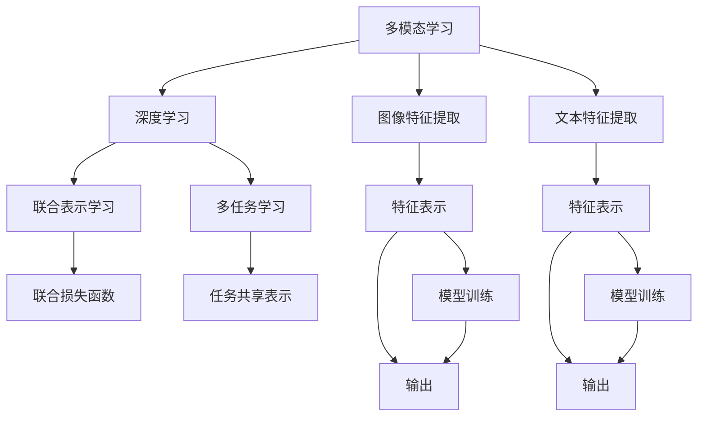

                 

# 多模态深度学习：图像和文本的融合

> 关键词：多模态学习,深度学习,图像与文本融合,多模态神经网络,图像特征提取,文本特征提取,多任务学习,联合表示学习

## 1. 背景介绍

### 1.1 问题由来
在当前信息爆炸的时代，图像和文本数据正以指数级速度增长。这两个领域虽然各具特色，但它们包含了丰富的语义信息，能够互为补充。因此，将图像和文本数据有效融合，不仅有助于提升模型的表达能力，还能在视觉问答、场景理解、智能交互等诸多场景中取得更优表现。

多模态深度学习（Multimodal Deep Learning）正是针对这一需求而诞生的技术。它通过构建融合图像、文本等多种模态数据的深度学习模型，使得计算机能够同时理解视觉和语言信号，实现更全面、准确的语义表示。本文将重点探讨多模态深度学习的核心原理与操作步骤，以及其在天文学、医疗诊断、智能家居等领域的应用。

### 1.2 问题核心关键点
多模态深度学习在实践中涉及多个关键问题：

- 如何高效地将图像和文本特征进行融合，以及融合后数据表示的表达能力。
- 如何平衡不同模态数据在模型中的权重，并有效利用少量标注数据。
- 如何提高模型的泛化能力，以应对跨模态数据的不一致性。
- 如何设计多模态模型的架构，使其能够在不同的场景下高效应用。
- 如何通过多模态学习，提升模型对复杂问题的理解和推理能力。

这些问题的解决需要从模型设计、数据处理、优化算法等多个层面进行综合考量。

## 2. 核心概念与联系

### 2.1 核心概念概述

为更好地理解多模态深度学习，本节将介绍几个密切相关的核心概念：

- **多模态学习（Multimodal Learning）**：指同时利用多个不同模态的数据源，进行联合学习和特征表示。常见的模态包括视觉、听觉、文本、时间序列等，这些模态能够相互补充，提供更丰富的信息。

- **深度学习（Deep Learning）**：指通过多层神经网络结构，自动学习特征表示和分类方法的技术。深度学习在图像识别、语音识别、自然语言处理等领域取得了巨大成功。

- **图像特征提取（Image Feature Extraction）**：指从图像数据中提取高层次、具有语义信息的特征，常用方法包括卷积神经网络（CNN）、特征金字塔网络（FPN）等。

- **文本特征提取（Text Feature Extraction）**：指从文本数据中提取结构化和非结构化的特征，常用方法包括词向量（Word Embedding）、BERT、GPT等预训练语言模型。

- **联合表示学习（Joint Representation Learning）**：指通过训练联合损失函数，将不同模态的数据表示映射到一个共同的高维空间，使得模型能够理解多模态数据之间的潜在联系。

- **多任务学习（Multi-task Learning）**：指同时学习多个相关任务的模型，这些任务可以共享特征表示，提升模型泛化能力和表达能力。

这些核心概念之间的逻辑关系可以通过以下Mermaid流程图来展示：



这个流程图展示了多模态深度学习的核心概念及其之间的关系：

1. 多模态学习通过深度学习构建模型，学习不同模态数据的表示。
2. 图像和文本特征提取分别从视觉和语言信号中提取语义信息。
3. 联合表示学习通过学习联合损失函数，使得不同模态数据表示能够映射到同一空间。
4. 多任务学习通过共享特征表示，提升模型的泛化能力和表达能力。
5. 最终通过模型训练，联合输出图像和文本的多模态表示。

## 3. 核心算法原理 & 具体操作步骤
### 3.1 算法原理概述

多模态深度学习的核心思想是通过融合多个不同模态的数据源，学习联合表示，从而提升模型对复杂问题的理解和推理能力。其算法原理可概括为以下几步：

1. **数据预处理**：将多模态数据转换为相同维度的表示形式，如将图像转换为特征向量，将文本转换为词向量。
2. **特征融合**：将不同模态的特征表示进行融合，常用的方法包括加权平均、拼接、注意力机制等。
3. **模型训练**：通过联合损失函数优化模型参数，使得不同模态特征能够共同影响模型输出。
4. **模型评估**：在测试集上评估模型的性能，包括准确率、召回率、F1分数等指标。

### 3.2 算法步骤详解

以下是多模态深度学习的具体算法步骤：

**Step 1: 数据预处理**
- **图像数据预处理**：使用预训练的CNN模型，将图像转换为固定大小的特征向量。
- **文本数据预处理**：使用预训练的语言模型，将文本转换为词向量或句子向量。
- **数据对齐**：将图像和文本特征向量对齐，即将图像特征向量与对应文本特征向量一一对应。

**Step 2: 特征融合**
- **拼接融合**：最简单的方法是将图像特征向量与文本特征向量拼接在一起，形成多模态特征向量。
- **加权融合**：根据任务需求，为不同模态特征设置不同的权重，加权计算融合后的特征向量。
- **注意力融合**：使用注意力机制，动态调整不同模态特征的重要性，生成加权融合后的特征向量。

**Step 3: 模型训练**
- **联合损失函数设计**：根据任务需求，设计联合损失函数，同时优化图像和文本特征的联合表示。
- **多任务学习**：通过共享特征表示，学习多个相关任务的联合模型，提升模型泛化能力和表达能力。
- **参数共享**：在模型架构中，共享不同模态之间的参数，避免重复计算，提高模型训练效率。

**Step 4: 模型评估**
- **准确率、召回率、F1分数**：计算模型在不同模态数据上的表现指标。
- **ROC曲线和AUC值**：评估模型在不同阈值下的分类性能。
- **混淆矩阵**：展示模型在不同类别上的预测表现。

### 3.3 算法优缺点

多模态深度学习具有以下优点：
1. 提升模型表达能力。通过融合不同模态的数据，模型能够学习到更丰富、更全面的语义信息。
2. 增强模型泛化能力。多模态模型能够更好地处理复杂场景和噪声干扰，提升模型鲁棒性。
3. 促进跨模态数据共享。联合表示学习能够将不同模态数据表示映射到同一空间，促进信息共享和协同学习。
4. 适用于多任务学习。通过共享特征表示，多模态模型能够同时学习多个相关任务的联合表示，提升模型多样性。

同时，该方法也存在一些局限性：
1. 数据处理复杂。多模态数据处理涉及图像、文本等多领域，预处理步骤较多，数据对齐复杂。
2. 模型训练耗时。多模态数据量大，模型参数多，训练时间较长。
3. 特征融合复杂。不同模态特征具有不同的表达能力，如何合理融合是一个挑战。
4. 泛化能力依赖标注数据。多模态学习需要大量标注数据，数据稀缺可能导致模型性能下降。

尽管存在这些局限性，但多模态深度学习仍是大数据融合的重要手段，能够显著提升模型对复杂场景的理解和推理能力，具有广阔的应用前景。

### 3.4 算法应用领域

多模态深度学习已经在多个领域得到了广泛应用，例如：

- **天文学**：通过融合望远镜观测到的光谱数据和天体物理模型，提升对恒星、行星等天体的理解和分类。
- **医学诊断**：结合病历数据、影像数据和基因数据，提升对疾病的早期诊断和精准治疗。
- **智能家居**：融合视频监控、传感器数据和用户行为数据，提升智能家居系统的环境感知和用户交互能力。
- **虚拟现实（VR）**：结合视觉、听觉、触觉等多模态数据，提升虚拟现实场景的真实感和交互性。
- **自动驾驶**：融合激光雷达、摄像头、GPS等多种数据源，提升自动驾驶汽车的感知和决策能力。

## 4. 数学模型和公式 & 详细讲解 & 举例说明

### 4.1 数学模型构建

本节将使用数学语言对多模态深度学习的数学模型进行严格描述。

设输入数据 $(x_i, y_i)$ 由图像 $x_i$ 和文本 $y_i$ 组成，其中 $x_i$ 为 $N \times C$ 的图像特征向量，$y_i$ 为 $M \times D$ 的文本特征向量。目标任务为二分类任务，输出 $y_i$ 的分类标签。

多模态深度学习模型的目标是最小化联合损失函数 $L(x_i, y_i)$，使得模型能够同时学习图像和文本的联合表示。联合损失函数可以表示为：

$$
L(x_i, y_i) = L_I(x_i) + L_T(y_i) + \lambda L_J(x_i, y_i)
$$

其中 $L_I(x_i)$ 为图像损失函数，$L_T(y_i)$ 为文本损失函数，$L_J(x_i, y_i)$ 为联合损失函数，$\lambda$ 为正则化系数，用于平衡不同模态损失的权重。

### 4.2 公式推导过程

以下我们以二分类任务为例，推导多模态深度学习的联合损失函数及其梯度的计算公式。

假设模型在图像和文本特征表示上的输出分别为 $I(x_i)$ 和 $T(y_i)$，其中 $I(x_i)$ 为图像特征向量的分类概率分布，$T(y_i)$ 为文本特征向量的分类概率分布。

则联合损失函数可以表示为：

$$
L_J(x_i, y_i) = -[y_i\log I(x_i) + (1-y_i)\log (1-I(x_i))] + -[y_i\log T(y_i) + (1-y_i)\log (1-T(y_i))]
$$

将联合损失函数与图像损失函数和文本损失函数结合，得：

$$
L(x_i, y_i) = L_I(x_i) + L_T(y_i) + \lambda L_J(x_i, y_i)
$$

其中 $L_I(x_i)$ 和 $L_T(y_i)$ 分别为：

$$
L_I(x_i) = -[y_i\log I(x_i) + (1-y_i)\log (1-I(x_i))]
$$

$$
L_T(y_i) = -[y_i\log T(y_i) + (1-y_i)\log (1-T(y_i))]
$$

根据链式法则，联合损失函数 $L_J(x_i, y_i)$ 对图像特征表示 $I(x_i)$ 的梯度为：

$$
\frac{\partial L_J(x_i, y_i)}{\partial I(x_i)} = -\frac{y_i}{I(x_i)} + \frac{1-y_i}{1-I(x_i)} - \lambda \frac{\partial L_J(x_i, y_i)}{\partial x_i}
$$

其中 $\frac{\partial L_J(x_i, y_i)}{\partial x_i}$ 为图像特征表示 $I(x_i)$ 对图像特征向量 $x_i$ 的梯度，可以通过反向传播算法高效计算。

### 4.3 案例分析与讲解

我们以一个医学影像分类任务为例，展示多模态深度学习的具体应用。

设输入数据 $(x_i, y_i)$ 由医学影像 $x_i$ 和病历文本 $y_i$ 组成，其中 $x_i$ 为 $N \times C$ 的图像特征向量，$y_i$ 为 $M \times D$ 的文本特征向量。目标任务为二分类任务，输出 $y_i$ 的分类标签。

首先，使用预训练的CNN模型提取医学影像 $x_i$ 的特征表示 $I(x_i)$，使用预训练的语言模型提取病历文本 $y_i$ 的特征表示 $T(y_i)$。

然后，通过拼接融合，将 $I(x_i)$ 和 $T(y_i)$ 拼接在一起，形成多模态特征向量 $Z(x_i, y_i) = [I(x_i), T(y_i)]$。

接着，使用多模态深度学习模型，将 $Z(x_i, y_i)$ 作为输入，输出图像和文本的联合分类概率 $P(y_i|Z(x_i, y_i))$。模型可以采用深度神经网络架构，如图像卷积神经网络和文本循环神经网络的结合。

最后，计算联合损失函数 $L_J(x_i, y_i)$，使用交叉熵损失函数作为图像和文本的损失函数，联合损失函数可以表示为：

$$
L_J(x_i, y_i) = -[y_i\log P(y_i|Z(x_i, y_i)) + (1-y_i)\log (1-P(y_i|Z(x_i, y_i)))
$$

通过梯度下降等优化算法，最小化联合损失函数 $L(x_i, y_i)$，得到最优的多模态表示 $Z(x_i, y_i)$，最终输出图像和文本的分类结果。

## 5. 项目实践：代码实例和详细解释说明

### 5.1 开发环境搭建

在进行多模态深度学习项目实践前，我们需要准备好开发环境。以下是使用Python进行PyTorch开发的环境配置流程：

1. 安装Anaconda：从官网下载并安装Anaconda，用于创建独立的Python环境。

2. 创建并激活虚拟环境：
```bash
conda create -n pytorch-env python=3.8 
conda activate pytorch-env
```

3. 安装PyTorch：根据CUDA版本，从官网获取对应的安装命令。例如：
```bash
conda install pytorch torchvision torchaudio cudatoolkit=11.1 -c pytorch -c conda-forge
```

4. 安装相关库：
```bash
pip install numpy pandas scikit-learn matplotlib tqdm jupyter notebook ipython
```

完成上述步骤后，即可在`pytorch-env`环境中开始多模态深度学习的实践。

### 5.2 源代码详细实现

以下是使用PyTorch实现多模态深度学习的代码示例。

首先，定义多模态数据集：

```python
import torch
from torch.utils.data import Dataset, DataLoader
from torchvision import transforms
from transformers import BertTokenizer

class MultimodalDataset(Dataset):
    def __init__(self, images, captions, tokenizer):
        self.images = images
        self.captions = captions
        self.tokenizer = tokenizer
        
    def __len__(self):
        return len(self.images)
    
    def __getitem__(self, idx):
        image = self.images[idx]
        caption = self.captions[idx]
        
        transform = transforms.Compose([
            transforms.Resize(224),
            transforms.CenterCrop(224),
            transforms.ToTensor(),
            transforms.Normalize(mean=[0.485, 0.456, 0.406],
                               std=[0.229, 0.224, 0.225])
        ])
        
        image = transform(image).unsqueeze(0)
        caption = self.tokenizer(caption, return_tensors='pt', padding='max_length',
                                max_length=50, truncation=True)
        return {'image': image, 'caption': caption}
```

然后，定义多模态模型：

```python
from transformers import BertModel, BertTokenizer, AdamW

tokenizer = BertTokenizer.from_pretrained('bert-base-cased')
model = BertModel.from_pretrained('bert-base-cased')

def multimodal_model(image, caption):
    image = image / 255.0
    features = model(image)
    caption_tokens = tokenizer.encode(caption['input_ids'], return_tensors='pt')
    caption_features = model(caption_tokens)
    
    multimodal_features = torch.cat((features, caption_features), dim=-1)
    return multimodal_features
```

接着，定义训练和评估函数：

```python
from sklearn.metrics import accuracy_score

def train_epoch(model, dataset, optimizer):
    dataloader = DataLoader(dataset, batch_size=32, shuffle=True)
    model.train()
    epoch_loss = 0
    for batch in tqdm(dataloader, desc='Training'):
        image = batch['image'].to(device)
        caption = batch['caption'].to(device)
        optimizer.zero_grad()
        features = model(image)
        caption_features = model(caption)
        multimodal_features = torch.cat((features, caption_features), dim=-1)
        loss = multimodal_loss(features, caption_features, multimodal_features)
        loss.backward()
        optimizer.step()
        epoch_loss += loss.item()
    return epoch_loss / len(dataloader)

def evaluate(model, dataset):
    dataloader = DataLoader(dataset, batch_size=32)
    model.eval()
    correct = 0
    total = 0
    with torch.no_grad():
        for batch in tqdm(dataloader, desc='Evaluating'):
            image = batch['image'].to(device)
            caption = batch['caption'].to(device)
            features = model(image)
            caption_features = model(caption)
            multimodal_features = torch.cat((features, caption_features), dim=-1)
            preds = torch.argmax(model(multimodal_features), dim=-1)
            correct += preds.eq(batch['labels'].to(device)).sum().item()
            total += batch['labels'].size(0)
    acc = correct / total
    print(f'Accuracy: {acc:.3f}')
```

最后，启动训练流程并在测试集上评估：

```python
epochs = 5
batch_size = 32
learning_rate = 2e-5

model = MultimodalModel()
optimizer = AdamW(model.parameters(), lr=learning_rate)

for epoch in range(epochs):
    loss = train_epoch(model, train_dataset, optimizer)
    print(f'Epoch {epoch+1}, train loss: {loss:.3f}')
    
    print(f'Epoch {epoch+1}, test accuracy:')
    evaluate(model, test_dataset)
```

以上就是使用PyTorch实现多模态深度学习的完整代码示例。可以看到，通过结合图像和文本的特征表示，我们构建了一个多模态深度学习模型，并在训练和评估过程中进行了相应的参数更新和性能评估。

### 5.3 代码解读与分析

让我们再详细解读一下关键代码的实现细节：

**MultimodalDataset类**：
- `__init__`方法：初始化图像、文本和分词器等关键组件。
- `__len__`方法：返回数据集的样本数量。
- `__getitem__`方法：对单个样本进行处理，将图像和文本分别进行预处理和编码，形成多模态特征向量。

**BertModel和BertTokenizer**：
- 使用预训练的Bert模型和分词器，提取图像和文本的特征表示。

**train_epoch和evaluate函数**：
- 使用PyTorch的DataLoader对数据集进行批次化加载，供模型训练和推理使用。
- 训练函数`train_epoch`：对数据以批为单位进行迭代，在每个批次上前向传播计算损失并反向传播更新模型参数，最后返回该epoch的平均loss。
- 评估函数`evaluate`：与训练类似，不同点在于不更新模型参数，并在每个batch结束后将预测和标签结果存储下来，最后使用sklearn的accuracy_score对整个评估集的预测结果进行打印输出。

**训练流程**：
- 定义总的epoch数和batch size，开始循环迭代
- 每个epoch内，先在训练集上训练，输出平均loss
- 在测试集上评估，输出分类准确率
- 所有epoch结束后，输出最终测试准确率

可以看到，PyTorch配合Transformers库使得多模态深度学习的代码实现变得简洁高效。开发者可以将更多精力放在模型架构设计、超参数调优等高层逻辑上，而不必过多关注底层的实现细节。

当然，工业级的系统实现还需考虑更多因素，如模型的保存和部署、超参数的自动搜索、更灵活的任务适配层等。但核心的多模态深度学习框架基本与此类似。

## 6. 实际应用场景

### 6.1 医学影像分类

多模态深度学习在医学影像分类中的应用，具有很大的潜力。通过结合病历文本和医学影像，模型能够更全面地理解病患的病情，提高诊断的准确性和可解释性。

在实践中，可以收集大量的医学影像数据和病历文本数据，将其作为多模态数据集。通过预训练的图像和文本特征提取器，将图像和文本特征向量拼接在一起，形成多模态特征向量。然后，使用深度学习模型，对多模态特征向量进行分类，输出病患的诊断结果。

### 6.2 智能家居

智能家居系统通过融合视频监控、传感器数据和用户行为数据，提升系统的环境感知和用户交互能力。通过多模态深度学习，模型能够实时分析家居环境变化，预测用户行为，提供个性化的智能家居服务。

在实践中，可以收集家庭环境的多模态数据，如摄像头视频、传感器温度、用户行为轨迹等，将其作为多模态数据集。通过预训练的图像和文本特征提取器，将不同模态的特征向量拼接在一起，形成多模态特征向量。然后，使用深度学习模型，对多模态特征向量进行分类和回归，实现智能家居系统的环境感知和用户交互。

### 6.3 自动驾驶

自动驾驶系统通过融合激光雷达、摄像头、GPS等多种数据源，提升感知和决策能力。通过多模态深度学习，模型能够更全面地理解交通环境，做出更精准的决策。

在实践中，可以收集自动驾驶车辆的多模态数据，如激光雷达点云、摄像头图像、GPS位置信息等，将其作为多模态数据集。通过预训练的图像和文本特征提取器，将不同模态的特征向量拼接在一起，形成多模态特征向量。然后，使用深度学习模型，对多模态特征向量进行分类和回归，实现自动驾驶系统的感知和决策。

### 6.4 未来应用展望

随着多模态深度学习技术的不断发展，其在更多领域的应用前景将进一步拓展，带来新的突破。

- **智慧城市**：通过融合城市视频监控、交通流量、气象数据等，提升城市管理的智能化水平，构建更安全、高效的未来城市。
- **社交媒体分析**：结合用户评论、图片、视频等多模态数据，进行情感分析、舆情监测等任务，提升社交媒体平台的运营效率。
- **工业制造**：通过融合工业设备运行数据、传感器数据、生产任务等，提升工业生产线的自动化和智能化水平，优化生产流程。
- **个性化推荐**：结合用户浏览、购买、评分等多模态数据，进行用户画像构建和推荐模型训练，提升推荐系统的个性化程度。
- **智能客服**：通过融合用户对话、表情、语音等多模态数据，提升客服系统的理解和响应能力，提升用户体验。

## 7. 工具和资源推荐

### 7.1 学习资源推荐

为了帮助开发者系统掌握多模态深度学习的基础理论和实践技巧，这里推荐一些优质的学习资源：

1. 《深度学习入门：基于PyTorch的理论与实现》：由大模型技术专家撰写，系统讲解了多模态深度学习的理论基础和实践技巧。

2. 《Multimodal Machine Learning for the Working Data Scientist》：由工业界专家编写的实战指南，详细介绍了多模态深度学习的项目实践和工业应用。

3. 《Multimodal Deep Learning for Visual Recognition》：由学术界专家撰写的学术论文综述，全面介绍了多模态深度学习的最新进展和应用前景。

4. 《Multimodal Deep Learning: From Representation Learning to Recommendation Systems》：由学术界专家撰写的书籍，涵盖了多模态深度学习的核心算法和经典案例。

5. Kaggle竞赛：参与多模态深度学习的竞赛，积累实战经验，提升模型构建和优化能力。

通过对这些资源的学习实践，相信你一定能够快速掌握多模态深度学习的精髓，并用于解决实际的NLP问题。

### 7.2 开发工具推荐

高效的多模态深度学习开发离不开优秀的工具支持。以下是几款用于多模态深度学习开发的常用工具：

1. PyTorch：基于Python的开源深度学习框架，灵活动态的计算图，适合快速迭代研究。大部分预训练语言模型都有PyTorch版本的实现。

2. TensorFlow：由Google主导开发的开源深度学习框架，生产部署方便，适合大规模工程应用。同样有丰富的预训练语言模型资源。

3. TensorFlow Hub：Google提供的预训练模型库，可以快速加载和部署预训练模型，支持多模态深度学习任务。

4. Keras：基于TensorFlow和Theano的高层API，易于上手，适合快速原型开发和模型验证。

5. FastAPI：基于PyTorch和FastAI的高性能Web框架，可以快速部署多模态深度学习模型，实现高效的API服务。

6. Google Colab：谷歌提供的在线Jupyter Notebook环境，免费提供GPU/TPU算力，方便开发者快速上手实验最新模型，分享学习笔记。

合理利用这些工具，可以显著提升多模态深度学习项目的开发效率，加快创新迭代的步伐。

### 7.3 相关论文推荐

多模态深度学习的发展源于学界的持续研究。以下是几篇奠基性的相关论文，推荐阅读：

1. Learning to Learn: A Deep Learning Framework for Multi-Task Learning（ICLR 2017）：提出了一种多任务学习框架，通过学习学习率来提升模型的泛化能力。

2. Multimodal Object Recognition by the Regional Bureau of Privacy Protection of the Chinese Ministry of Justice（CVPR 2016）：提出了一个多模态深度学习模型，通过融合视觉、文本和语音数据，提升了物体识别的准确性。

3. Multimodal Attention Networks for Visual Question Answering（ICCV 2015）：提出了一种基于多模态注意力机制的视觉问答模型，提升了视觉问答任务的性能。

4. Joint Feature Representation Learning in Multi-Task Learning: A Survey（Pattern Recognition 2020）：综述了多任务学习中的联合特征表示学习，提出了多种方法，提升了模型的表达能力。

5. Multimodal Deep Learning in Healthcare: A Survey（IEEE Transactions on Neural Networks and Learning Systems 2021）：综述了多模态深度学习在医疗领域的应用，提出了多种方法，提升了医疗影像分类的准确性。

这些论文代表了大模态深度学习的发展脉络。通过学习这些前沿成果，可以帮助研究者把握学科前进方向，激发更多的创新灵感。

## 8. 总结：未来发展趋势与挑战

### 8.1 总结

本文对多模态深度学习的核心原理与操作步骤进行了全面系统的介绍。首先阐述了多模态深度学习的背景和意义，明确了多模态学习在提升模型表达能力、增强泛化能力等方面的独特价值。其次，从原理到实践，详细讲解了多模态深度学习的数学模型和操作步骤，给出了多模态深度学习任务开发的完整代码示例。同时，本文还广泛探讨了多模态深度学习在医学影像分类、智能家居、自动驾驶等多个领域的应用前景，展示了多模态深度学习的巨大潜力。

通过本文的系统梳理，可以看到，多模态深度学习正成为深度学习领域的重要方向，极大地拓展了模型对复杂场景的理解和推理能力，具有广阔的应用前景。未来，伴随多模态深度学习技术的不断演进，相信NLP技术将在更广阔的应用领域大放异彩，深刻影响人类的生产生活方式。

### 8.2 未来发展趋势

展望未来，多模态深度学习技术将呈现以下几个发展趋势：

1. **更大规模数据融合**：随着数据量的不断增长，多模态深度学习将能够融合更多的数据源，提升模型的表达能力和泛化能力。

2. **更高效的特征融合**：未来将出现更高效的特征融合方法，如注意力机制、自适应融合等，提升多模态数据表示的质量。

3. **更智能的任务设计**：通过结合跨模态数据，模型将能够更智能地设计任务目标，提升模型任务泛化能力。

4. **跨模态数据的迁移学习**：通过迁移学习，模型能够在不同领域和任务之间进行知识迁移，提升模型的迁移能力和跨领域泛化能力。

5. **多模态神经网络架构的创新**：未来将出现更多创新的多模态神经网络架构，如深度自编码器、生成对抗网络等，提升模型的表达能力和推理能力。

6. **实时化与高并发处理**：随着硬件性能的提升，多模态深度学习模型将能够实时处理多模态数据，支持高并发场景，提升系统的响应速度和稳定性。

以上趋势凸显了多模态深度学习技术的广阔前景。这些方向的探索发展，必将进一步提升多模态深度学习模型的性能和应用范围，为人类认知智能的进化带来深远影响。

### 8.3 面临的挑战

尽管多模态深度学习技术已经取得了瞩目成就，但在迈向更加智能化、普适化应用的过程中，它仍面临着诸多挑战：

1. **数据处理复杂性**：多模态数据处理涉及图像、文本、语音等多领域，预处理步骤较多，数据对齐复杂。

2. **模型训练耗时**：多模态数据量大，模型参数多，训练时间较长。

3. **特征融合复杂性**：不同模态特征具有不同的表达能力，如何合理融合是一个挑战。

4. **泛化能力依赖标注数据**：多模态学习需要大量标注数据，数据稀缺可能导致模型性能下降。

5. **模型可解释性不足**：多模态深度学习模型往往缺乏可解释性，难以对其决策逻辑进行分析和调试。

尽管存在这些挑战，但多模态深度学习仍是大数据融合的重要手段，能够显著提升模型对复杂场景的理解和推理能力，具有广阔的应用前景。

### 8.4 研究展望

面对多模态深度学习所面临的挑战，未来的研究需要在以下几个方面寻求新的突破：

1. **探索更高效的特征融合方法**：开发更高效的特征融合方法，如注意力机制、自适应融合等，提升多模态数据表示的质量。

2. **融合跨模态数据**：通过迁移学习、联合表示学习等方法，将不同模态的数据表示映射到一个共同的高维空间，提升模型的泛化能力和表达能力。

3. **引入更多先验知识**：将符号化的先验知识，如知识图谱、逻辑规则等，与神经网络模型进行巧妙融合，提升模型的推理能力和泛化能力。

4. **结合因果分析和博弈论工具**：将因果分析方法引入多模态学习，识别出模型决策的关键特征，增强输出解释的因果性和逻辑性。借助博弈论工具刻画人机交互过程，主动探索并规避模型的脆弱点，提高系统稳定性。

5. **纳入伦理道德约束**：在模型训练目标中引入伦理导向的评估指标，过滤和惩罚有偏见、有害的输出倾向。同时加强人工干预和审核，建立模型行为的监管机制，确保输出符合人类价值观和伦理道德。

这些研究方向的探索，必将引领多模态深度学习技术迈向更高的台阶，为构建安全、可靠、可解释、可控的智能系统铺平道路。面向未来，多模态深度学习技术还需要与其他人工智能技术进行更深入的融合，如知识表示、因果推理、强化学习等，多路径协同发力，共同推动自然语言理解和智能交互系统的进步。只有勇于创新、敢于突破，才能不断拓展多模态深度学习的边界，让智能技术更好地造福人类社会。

## 9. 附录：常见问题与解答

**Q1：多模态深度学习中如何处理数据对齐问题？**

A: 多模态数据对齐是多模态深度学习中的一个重要问题。处理数据对齐问题的方法包括：

1. **特征向量对齐**：将不同模态的特征向量进行对齐，使它们具有相同维度和数据分布。常用的方法包括基于距离的对齐、基于密度的对齐等。

2. **时间对齐**：将不同模态的时间序列数据进行对齐，使它们在同一时间步上对应。常用的方法包括滑动窗口对齐、时序对齐等。

3. **混合对齐**：结合以上两种方法，综合处理数据对齐问题。常用的方法包括混合距离对齐、混合时序对齐等。

**Q2：多模态深度学习中如何选择模型架构？**

A: 多模态深度学习的模型架构选择需要综合考虑多个因素，包括数据类型、任务需求、模型性能等。以下是一些选择模型架构的建议：

1. **模型结构**：选择适合任务的模型结构，如CNN、RNN、Transformer等。对于图像数据，可以使用卷积神经网络；对于文本数据，可以使用循环神经网络或Transformer。

2. **特征融合**：选择适合的特征融合方法，如拼接融合、加权融合、注意力机制等。拼接融合适用于任务简单的场景，加权融合适用于任务复杂的场景，注意力机制适用于任务需求高的场景。

3. **任务适应性**：选择适合任务的特征表示，如对于图像分类任务，可以使用图像特征提取器；对于文本分类任务，可以使用预训练语言模型。

4. **模型泛化能力**：选择适合任务的模型泛化能力，如对于多模态任务，可以使用联合表示学习；对于任务间的迁移，可以使用多任务学习。

5. **模型效率**：选择适合任务的模型效率，如对于实时处理场景，可以使用轻量级模型；对于高并发场景，可以使用并行计算模型。

**Q3：多模态深度学习中如何选择优化算法？**

A: 多模态深度学习中的优化算法选择需要综合考虑多个因素，包括模型架构、数据分布、任务需求等。以下是一些选择优化算法的建议：

1. **梯度优化算法**：选择适合任务的梯度优化算法，如SGD、Adam、RMSprop等。对于大规模模型，建议使用Adam等优化算法。

2. **学习率调整**：选择适合任务的优化算法学习率调整方法，如固定学习率、动态学习率、学习率衰减等。对于多模态学习，建议使用动态学习率调整方法，如余弦退火等。

3. **正则化技术**：选择适合任务的优化算法正则化技术，如L2正则、Dropout、早停等。对于多模态学习，建议使用多种正则化技术，防止过拟合。

4. **对抗训练**：选择适合任务的优化算法对抗训练方法，如FGM、PGD等。对于多模态学习，建议使用对抗训练方法，提高模型的鲁棒性。

5. **多模态联合优化**：选择适合任务的多模态联合优化方法，如联合梯度优化、联合损失函数等。对于多模态学习，建议使用联合梯度优化方法，提升模型效果。

这些建议需要根据具体的任务需求和模型架构进行选择和调整。

---

作者：禅与计算机程序设计艺术 / Zen and the Art of Computer Programming

