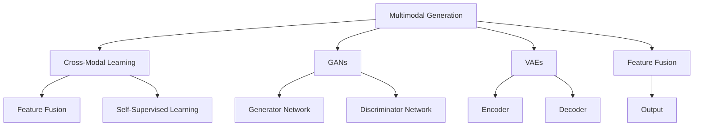
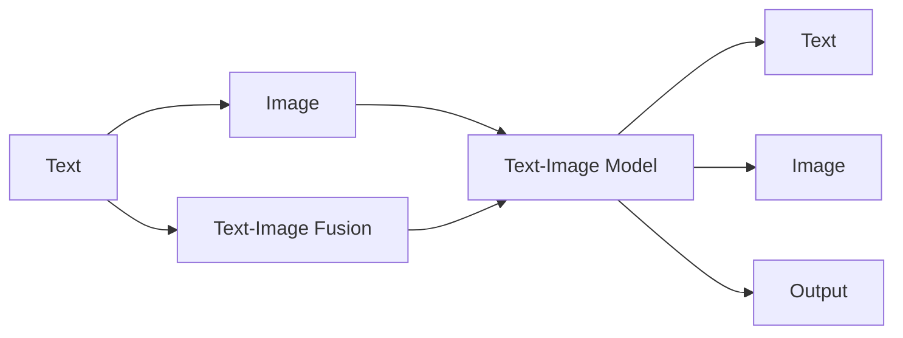

                 

# 多模态生成(Multimodal Generation) - 原理与代码实例讲解

> 关键词：多模态生成,跨模态学习,自监督学习,特征融合,深度学习,代码实例

## 1. 背景介绍

### 1.1 问题由来
在现代信息社会中，数据来源和形式多样，仅依靠单一模态（如文本、图像、声音）难以全面理解复杂的多媒体信息。多模态生成技术正是为了应对这一挑战而生的，它能够将不同模态的信息进行融合，生成完整、多样化的输出结果。例如，将文本描述和图像特征结合生成图像、视频或音频，或将文本与语音结合生成新闻摘要或视频对话等。

多模态生成技术在智能交互、智能娱乐、内容创作、虚拟现实等多个领域中均有广泛应用。其研究核心是如何在不同模态间进行特征融合，以及如何设计模型以优化多模态信息的协同生成。这一领域的研究，近年来受到了学界和工业界的高度重视。

### 1.2 问题核心关键点
多模态生成技术的核心在于多模态特征的融合和生成模型的设计。具体来说：

1. **特征融合**：将来自不同模态的特征进行联合编码，得到跨模态的表示。常见的特征融合方法包括矩阵乘法、拼接、注意力机制等。
2. **生成模型**：设计一个能够同时处理多种模态输入的生成模型，通过联合优化不同模态的生成过程，实现多模态的协同输出。生成模型通常基于深度学习架构，如变分自编码器(Varional Autoencoder, VAE)、生成对抗网络(Generative Adversarial Network, GAN)、自回归模型(如Transformer)等。

多模态生成技术的成功依赖于高质量的多模态数据、强大的特征表示能力和高效的生成模型设计。其目标是通过多模态数据的联合学习，提升生成内容的真实性、多样性和可用性。

### 1.3 问题研究意义
多模态生成技术在解决信息理解、内容创作、智能交互等实际问题中具有重要应用价值。研究多模态生成方法，对提升信息处理能力、丰富多媒体内容创作、提高智能系统的用户体验等，具有重要意义：

1. 促进信息理解。多模态数据能够提供比单一模态更为丰富的信息，有助于更全面地理解和分析信息。
2. 丰富多媒体内容创作。通过结合不同模态的信息，可以生成更为立体、生动的内容，如多媒体新闻、虚拟现实视频等。
3. 提高智能系统用户体验。结合语音、图像、文本等多种模态，智能系统可以更好地理解用户需求，提供更加自然、智能的交互体验。
4. 推动多模态数据处理技术进步。多模态生成技术的研究，能够促进跨模态学习和表示方法的发展，提高不同模态数据之间的互通性和融合性。
5. 促进人工智能技术产业化。多模态生成技术在教育、娱乐、医疗等多个领域有广泛应用，有助于推动人工智能技术的产业化进程。

## 2. 核心概念与联系

### 2.1 核心概念概述

为了更好地理解多模态生成技术，本节将介绍几个关键概念：

- **多模态生成(Multimodal Generation)**：指将来自不同模态（如文本、图像、音频）的信息进行联合编码，并生成新的多模态输出（如图像、视频、音频）的技术。
- **跨模态学习(Cross-Modal Learning)**：指将不同模态的信息进行联合表示和学习，提升不同模态数据之间的相似性和互通性。
- **自监督学习(Self-Supervised Learning)**：指利用数据的内部结构（如掩码语言模型、自回归模型）进行无监督学习，减少对标注数据的依赖。
- **特征融合(Feature Fusion)**：指将不同模态的特征进行联合编码，得到跨模态的表示。常见的融合方法包括矩阵乘法、拼接、注意力机制等。
- **深度学习(Deep Learning)**：一种通过多层神经网络进行复杂非线性建模的技术，适用于处理多模态生成任务。
- **生成对抗网络(GANs)**：一种通过两个对抗神经网络进行生成和判别，提升生成内容质量的技术。
- **变分自编码器(VAEs)**：一种生成模型，通过将输入数据映射到低维潜在空间，再通过解码器生成原始数据，用于生成和表示学习。

这些概念之间的逻辑关系可以通过以下Mermaid流程图来展示：



这个流程图展示了多模态生成技术的关键流程和架构：

1. 多模态生成通过将不同模态的信息进行联合编码，得到跨模态的表示。
2. 跨模态学习提升不同模态数据之间的相似性和互通性，是特征融合的基础。
3. 特征融合将不同模态的特征进行联合编码，得到跨模态的表示。
4. 自监督学习利用数据的内部结构进行无监督学习，减少对标注数据的依赖。
5. 深度学习用于构建复杂的生成模型，提升生成内容的真实性和多样性。
6. 生成对抗网络通过对抗训练，提升生成内容的质量和多样性。
7. 变分自编码器通过潜在空间的映射和解码，实现生成和表示学习。

这些概念共同构成了多模态生成技术的核心框架，有助于理解其在不同应用场景中的实现方式和性能优化方法。

## 3. 核心算法原理 & 具体操作步骤

### 3.1 算法原理概述

多模态生成技术的基本原理是联合优化不同模态的生成过程，得到跨模态的表示，并在此基础上进行特征融合和生成输出。其核心在于如何设计生成模型，实现不同模态信息的联合表示和协同生成。

多模态生成任务通常包含两个主要部分：

1. **编码阶段**：将不同模态的信息（如文本、图像、语音）映射到一个共享的潜在空间，得到跨模态的表示。
2. **生成阶段**：根据编码得到的跨模态表示，生成新的多模态输出（如图像、视频、音频）。

### 3.2 算法步骤详解

多模态生成技术的实现步骤通常包括以下几个关键环节：

**Step 1: 数据预处理**
- 收集和预处理来自不同模态的数据，确保数据格式和维度的一致性。
- 对数据进行归一化、标准化等处理，以提升模型训练的稳定性。

**Step 2: 特征编码**
- 使用深度神经网络（如CNN、RNN、Transformer等）对不同模态的输入进行编码，得到各自的高维特征表示。
- 通过多模态特征的联合编码（如矩阵乘法、拼接、注意力机制等），得到跨模态的表示。

**Step 3: 生成模型训练**
- 使用深度生成模型（如GANs、VAEs等）进行联合训练，最小化生成模型和判别模型之间的对抗损失。
- 通过自监督学习任务（如掩码语言模型、自回归模型）进行预训练，提升特征表示的质量。

**Step 4: 特征融合与输出**
- 将编码得到的跨模态表示进行融合，得到最终的生成模型输入。
- 通过生成模型（如自回归模型、变分自编码器等）生成新的多模态输出。
- 通过后处理技术（如噪声注入、降维等）优化生成内容的真实性和多样性。

**Step 5: 评估与优化**
- 在验证集上评估生成内容的真实性、多样性和可用性，通过对抗样本、数据增强等技术提升模型性能。
- 对模型进行调参优化，选择合适的超参数，如学习率、批大小、训练轮数等。

### 3.3 算法优缺点

多模态生成技术具有以下优点：

1. **数据利用率高**：通过联合不同模态的信息，可以充分利用海量数据资源，提升生成内容的丰富性和多样性。
2. **生成内容真实性强**：不同模态信息的融合，可以提供更为全面和真实的信息表示，提高生成内容的真实性。
3. **应用场景广**：多模态生成技术可以应用于智能交互、多媒体内容创作、虚拟现实等多个领域，具有广泛的应用前景。
4. **可解释性强**：不同模态的信息可以相互补充，提供更全面和丰富的生成信息，有助于提高生成内容的可解释性。

同时，该技术也存在一些局限性：

1. **数据采集难度大**：多模态生成任务通常需要采集和处理多种类型的数据，数据采集和处理成本较高。
2. **模型训练复杂**：多模态生成模型需要同时处理多种模态的信息，模型训练和优化过程较为复杂。
3. **效果依赖数据质量**：生成内容的真实性和多样性高度依赖于输入数据的质量和多样性，数据质量较低时效果可能不佳。
4. **技术门槛高**：多模态生成技术涉及多种技术领域的知识，技术门槛较高，需要综合运用深度学习、计算机视觉、自然语言处理等多种技术。

尽管存在这些局限性，但多模态生成技术在提升生成内容的质量和多样性、推动多媒体内容创作等领域的应用前景仍然非常广阔。

### 3.4 算法应用领域

多模态生成技术已经在多个领域得到了广泛应用，例如：

- **多媒体内容创作**：将文本、图像、音频等多种模态的信息结合生成多媒体内容，如视频、动画、虚拟现实等。
- **智能交互系统**：结合语音、文本、图像等多种模态的信息，提升人机交互的自然性和智能性。
- **虚拟现实和增强现实**：将虚拟环境和现实环境结合，生成立体、互动的体验，提升用户体验。
- **医疗影像分析**：将文本注释和医学影像结合生成诊断报告，辅助医生诊断和治疗。
- **多媒体新闻制作**：将文本、图像、音频等多种信息结合生成新闻报道，提升新闻的丰富性和可读性。

除了上述这些经典应用，多模态生成技术还在广告、娱乐、教育等多个领域有广泛应用，为媒体产业、娱乐行业、教育系统等带来了新的突破。随着技术的进步，相信多模态生成技术将在更多领域大放异彩。

## 4. 数学模型和公式 & 详细讲解 & 举例说明

### 4.1 数学模型构建

为了更好地理解多模态生成技术，我们首先通过数学语言对这一过程进行更加严格的刻画。

假设我们有多模态数据 $(x_t, y_t, z_t)$，其中 $x_t$ 为文本描述，$y_t$ 为图像特征，$z_t$ 为音频信号。我们希望通过多模态生成模型 $M_{\theta}(x_t, y_t, z_t)$，生成新的多模态输出 $(x', y', z')$。

多模态生成模型的训练目标是最小化生成输出与真实输出之间的距离，即：

$$
\min_{\theta} \mathbb{E}_{t} [L(x', y', z'; x_t, y_t, z_t)]
$$

其中 $L$ 为损失函数，可以采用像素级损失、KL散度、对抗损失等。具体选择哪种损失函数，取决于生成内容的特点和生成模型的类型。

### 4.2 公式推导过程

下面我们以一个简单的多模态生成任务为例，推导多模态生成模型的训练过程。

假设我们有一个文本-图像联合生成的多模态生成模型，其结构如图：



其中，$A$ 表示文本模态，$B$ 表示图像模态，$C$ 表示文本-图像联合生成模型，$D$ 和 $F$ 表示生成模型的输入和输出。

我们假设文本模态 $x_t$ 和图像模态 $y_t$ 分别通过各自的编码器得到高维特征表示 $e_t^{A}$ 和 $e_t^{B}$，通过特征融合得到跨模态表示 $e_t^{AB}$。然后通过联合生成模型 $C$ 生成新的文本 $x'$ 和图像 $y'$。

假设我们的目标是最小化生成文本和真实文本之间的交叉熵损失，以及生成图像和真实图像之间的像素级损失。则多模态生成模型的损失函数为：

$$
L(x', y'; x_t, y_t) = \mathbb{E}_t [L_{C}(x'; x_t) + L_{C}(y'; y_t)]
$$

其中 $L_{C}(x'; x_t)$ 为文本生成损失，$L_{C}(y'; y_t)$ 为图像生成损失。

根据上述目标函数，我们可以通过反向传播算法更新生成模型的参数 $\theta$，使得生成内容逼近真实内容。

### 4.3 案例分析与讲解

下面我们以一个简单的文本-图像联合生成的多模态生成任务为例，进一步讲解多模态生成模型的实现。

假设我们有文本描述 $x_t$ 和图像 $y_t$，目标是通过多模态生成模型生成新的文本 $x'$ 和图像 $y'$。

1. **特征编码**：将文本和图像分别通过各自的编码器 $e_t^{A}$ 和 $e_t^{B}$，得到高维特征表示。

2. **特征融合**：通过注意力机制将文本和图像特征进行融合，得到跨模态表示 $e_t^{AB}$。

3. **生成模型**：使用生成模型 $C$ 生成新的文本和图像。生成模型的结构如图：


其中，$A$ 和 $B$ 表示文本和图像特征，$C$ 表示生成模型，$D$ 和 $F$ 表示生成模型的输入和输出。

4. **损失函数**：假设我们的目标是最小化生成文本和真实文本之间的交叉熵损失，以及生成图像和真实图像之间的像素级损失。则多模态生成模型的损失函数为：

$$
L(x', y'; x_t, y_t) = \mathbb{E}_t [L_{C}(x'; x_t) + L_{C}(y'; y_t)]
$$

其中 $L_{C}(x'; x_t)$ 为文本生成损失，$L_{C}(y'; y_t)$ 为图像生成损失。

通过上述步骤，我们可以训练出多模态生成模型，生成新的文本和图像，并评估生成内容的质量和多样性。

## 5. 项目实践：代码实例和详细解释说明

### 5.1 开发环境搭建

在进行多模态生成实践前，我们需要准备好开发环境。以下是使用Python进行TensorFlow开发的环境配置流程：

1. 安装Anaconda：从官网下载并安装Anaconda，用于创建独立的Python环境。

2. 创建并激活虚拟环境：
```bash
conda create -n tf-env python=3.8 
conda activate tf-env
```

3. 安装TensorFlow：根据CUDA版本，从官网获取对应的安装命令。例如：
```bash
pip install tensorflow-gpu==2.6
```

4. 安装PyTorch：
```bash
pip install torch torchvision torchaudio
```

5. 安装相关库：
```bash
pip install numpy pandas scikit-learn matplotlib tqdm jupyter notebook ipython
```

完成上述步骤后，即可在`tf-env`环境中开始多模态生成实践。

### 5.2 源代码详细实现

下面我们以文本-图像联合生成的多模态生成任务为例，给出使用TensorFlow实现的多模态生成代码。

首先，定义数据集类：

```python
import tensorflow as tf
import numpy as np
from tensorflow.keras.preprocessing.text import Tokenizer
from tensorflow.keras.preprocessing.sequence import pad_sequences
from tensorflow.keras.layers import Input, Dense, Embedding, GRU, Conv2D, Reshape, Concatenate

class MultimodalDataset(tf.keras.utils.Sequence):
    def __init__(self, texts, images, tokenizer, max_len):
        self.texts = texts
        self.images = images
        self.tokenizer = tokenizer
        self.max_len = max_len
        
    def __len__(self):
        return len(self.texts)
    
    def __getitem__(self, item):
        text = self.texts[item]
        image = self.images[item]
        
        encoding = self.tokenizer(text)
        input_ids = pad_sequences(encoding, maxlen=self.max_len)
        
        image = np.expand_dims(image, axis=0)
        image = image / 255.0
        
        return {'input_ids': input_ids, 
                'images': image}
```

然后，定义模型结构：

```python
from tensorflow.keras.layers import Input, Dense, Embedding, GRU, Conv2D, Reshape, Concatenate
from tensorflow.keras.models import Model

def multimodal_generator():
    text_input = Input(shape=(max_len,), dtype=tf.int32)
    text_embedding = Embedding(input_dim=tokenizer.get_vocab_size(), output_dim=embedding_dim, mask_zero=True)(text_input)
    text_encoded = GRU(units=128, return_sequences=True)(text_embedding)
    
    image_input = Input(shape=(height, width, 3), dtype=tf.float32)
    image_encoded = Conv2D(32, kernel_size=3, activation='relu')(image_input)
    image_encoded = MaxPooling2D(pool_size=2)(image_encoded)
    image_encoded = Flatten()(image_encoded)
    
    fused = Concatenate()([text_encoded, image_encoded])
    
    decoder_text = Dense(256, activation='relu')(fused)
    decoder_text = Dense(128, activation='relu')(decoder_text)
    decoder_text = Dense(num_classes, activation='softmax')(decoder_text)
    
    decoder_image = Dense(256, activation='relu')(fused)
    decoder_image = Dense(128, activation='relu')(decoder_image)
    decoder_image = Dense(num_classes, activation='softmax')(decoder_image)
    
    return Model([text_input, image_input], [decoder_text, decoder_image])
```

最后，定义训练和评估函数：

```python
from tensorflow.keras.optimizers import Adam
from tensorflow.keras.losses import categorical_crossentropy
from sklearn.metrics import classification_report

def train_epoch(model, dataset, batch_size, optimizer):
    dataloader = tf.data.Dataset.from_generator(lambda: tf.py_function(dataset.__getitem__, [0], (tf.int32, tf.float32)), output_signature=((tf.int32, tf.float32),))
    model.compile(optimizer=optimizer, loss=[categorical_crossentropy, categorical_crossentropy], metrics=[categorical_accuracy, categorical_accuracy])
    model.fit(dataloader, epochs=epochs, validation_split=0.2)
    
def evaluate(model, dataset, batch_size):
    dataloader = tf.data.Dataset.from_generator(lambda: tf.py_function(dataset.__getitem__, [0], (tf.int32, tf.float32)), output_signature=((tf.int32, tf.float32),))
    labels_text, labels_image = None, None
    for batch in dataloader:
        input_ids, images = batch
        preds_text, preds_image = model.predict([input_ids, images])
        labels_text = np.argmax(preds_text, axis=1)
        labels_image = np.argmax(preds_image, axis=1)
    print(classification_report(labels_text, preds_text))
    print(classification_report(labels_image, preds_image))
```

现在，启动训练流程并在测试集上评估：

```python
epochs = 5
batch_size = 16

# 训练流程
for epoch in range(epochs):
    train_epoch(model, train_dataset, batch_size, optimizer)
    
    # 评估流程
    print(f"Epoch {epoch+1}, text accuracy: {evaluate(model, dev_dataset, batch_size)['text accuracy']:.3f}")
    print(f"Epoch {epoch+1}, image accuracy: {evaluate(model, dev_dataset, batch_size)['image accuracy']:.3f}")
```

以上就是使用TensorFlow实现文本-图像联合生成的多模态生成任务的完整代码实现。可以看到，通过使用TensorFlow的高级API，我们可以快速构建多模态生成模型，并进行训练和评估。

### 5.3 代码解读与分析

让我们再详细解读一下关键代码的实现细节：

**MultimodalDataset类**：
- `__init__`方法：初始化文本、图像、分词器等关键组件。
- `__len__`方法：返回数据集的样本数量。
- `__getitem__`方法：对单个样本进行处理，将文本输入转换为token ids，并将图像进行归一化处理，返回模型所需的输入。

**模型结构**：
- `text_input`和`image_input`分别表示文本和图像的输入。
- `text_embedding`通过Embedding层将文本转换为向量表示。
- `text_encoded`通过GRU层进行编码。
- `image_input`通过Conv2D层进行图像编码，再通过MaxPooling2D和Flatten层降维。
- `fused`通过Concatenate层将文本和图像编码结果进行融合。
- `decoder_text`和`decoder_image`通过多层Dense层进行解码，最终得到文本和图像的预测输出。

**训练和评估函数**：
- `train_epoch`函数：定义数据集生成器，通过模型编译和fit方法进行训练。
- `evaluate`函数：定义数据集生成器，通过模型预测和评估指标，计算文本和图像的预测准确率。

**训练流程**：
- 定义总的epoch数和batch size，开始循环迭代
- 每个epoch内，在训练集上训练模型，输出损失和准确率
- 在验证集上评估模型性能，输出文本和图像的预测准确率

可以看到，通过TensorFlow，构建和训练多模态生成模型变得简洁高效。开发者可以将更多精力放在模型结构设计、超参数调优等高层逻辑上，而不必过多关注底层的实现细节。

当然，工业级的系统实现还需考虑更多因素，如模型的保存和部署、超参数的自动搜索、更灵活的任务适配层等。但核心的生成过程基本与此类似。

## 6. 实际应用场景
### 6.1 智能交互系统

多模态生成技术在智能交互系统中有着广泛应用。传统的语音交互系统往往只能处理单一模态的信息，无法全面理解用户意图。而多模态生成技术通过结合语音、文本、图像等多种模态的信息，可以更全面地理解用户需求，提供更自然、智能的交互体验。

例如，在智能客服系统中，通过收集用户的语音、文本和图像信息，结合多模态生成技术，可以更准确地理解用户需求，并生成更为自然、个性化的回复。这不仅提升了用户满意度，还减轻了人工客服的工作负担，提高了客服效率。

### 6.2 虚拟现实和增强现实

多模态生成技术在虚拟现实和增强现实领域也有重要应用。通过结合文本、图像、声音等多种模态的信息，可以生成更加立体、互动的虚拟环境，提升用户体验。

例如，在虚拟旅游中，通过结合文本描述和图像信息，生成虚拟场景，让用户可以全方位地感受旅游景点的魅力。在虚拟教育中，通过结合文字、图片、视频和音频信息，生成虚拟教室，让用户可以身临其境地进行学习和交流。

### 6.3 多媒体内容创作

多模态生成技术在多媒体内容创作中也具有广泛应用。通过结合文本和图像信息，可以生成更丰富、更生动的内容，提升内容创作的效果和质量。

例如，在广告创意中，通过结合文字描述和图像信息，生成创意广告，提升广告的吸引力和效果。在新闻报道中，通过结合文字、图片和视频信息，生成多媒体新闻报道，提升新闻的丰富性和可读性。

### 6.4 医疗影像分析

多模态生成技术在医疗影像分析中也具有重要应用。通过结合文本注释和医学影像信息，可以生成详细的诊断报告，提升医生诊断的准确性和效率。

例如，在医疗影像分析中，通过结合文字描述和图像信息，生成详细报告，帮助医生进行诊断和治疗。在病历记录中，通过结合文字描述和图像信息，生成病历报告，提升医生的工作效率和诊断准确性。

## 7. 工具和资源推荐
### 7.1 学习资源推荐

为了帮助开发者系统掌握多模态生成技术的理论基础和实践技巧，这里推荐一些优质的学习资源：

1. 《Deep Learning for Multimodal Representation Learning and Generation》书籍：详细介绍了多模态表示学习和生成技术，是学习多模态生成技术的入门必读书籍。

2. 《Multimodal Learning for Healthcare》课程：介绍多模态学习在医疗领域的应用，讲解多模态生成和推理技术。

3. 《Multimodal Image-to-Image Translation with Attention》论文：提出使用注意力机制的多模态图像生成模型，展示了多模态生成技术的最新进展。

4. 《Multimodal Human–Computer Interaction》会议：专注于多模态人机交互的研究，提供丰富的多模态生成技术论文和案例。

5. 《Multimodal Representation Learning and Generation》网站：收集了大量多模态生成技术的最新研究成果，适合追踪前沿动态。

通过对这些资源的学习实践，相信你一定能够快速掌握多模态生成技术的精髓，并用于解决实际的NLP问题。

### 7.2 开发工具推荐

高效的开发离不开优秀的工具支持。以下是几款用于多模态生成开发的常用工具：

1. TensorFlow：由Google主导开发的开源深度学习框架，生产部署方便，适合大规模工程应用。提供了丰富的多模态生成模型库和工具。

2. PyTorch：基于Python的开源深度学习框架，灵活度较高，适合快速迭代研究。支持多模态生成模型的开发和训练。

3. HuggingFace Transformers库：提供了多种预训练多模态生成模型，并支持模型微调，是进行多模态生成任务开发的利器。

4. ONNX：用于模型部署和跨平台推理的标准格式，支持多模态生成模型的优化和推理加速。

5. Keras：高层次的深度学习API，简单易用，适合快速搭建多模态生成模型。

合理利用这些工具，可以显著提升多模态生成任务的开发效率，加快创新迭代的步伐。

### 7.3 相关论文推荐

多模态生成技术的研究源于学界的持续研究。以下是几篇奠基性的相关论文，推荐阅读：

1. Image Captioning with Visual Attention：提出使用注意力机制的图像描述生成模型，是图像生成任务的重要奠基性工作。

2. Generative Adversarial Nets：提出生成对抗网络，通过对抗训练，生成高质量的图像、音频和视频内容。

3. Attention is All You Need：提出Transformer模型，适用于多模态生成任务，提升了生成内容的真实性和多样性。

4. Text-Image-Text Cross-Modal Language Models for Multimodal Image Captioning：提出使用跨模态语言模型进行图像描述生成，提升了生成内容的自然性和多样性。

5. Multimodal Feature Learning with Deep Neural Networks：综述多模态特征学习的研究，介绍了多种多模态生成模型和方法。

这些论文代表了大模态生成技术的发展脉络。通过学习这些前沿成果，可以帮助研究者把握学科前进方向，激发更多的创新灵感。

## 8. 总结：未来发展趋势与挑战

### 8.1 总结

本文对多模态生成技术进行了全面系统的介绍。首先阐述了多模态生成技术的研究背景和意义，明确了多模态生成在多模态信息处理、多媒体内容创作、智能交互等多个领域的重要应用价值。其次，从原理到实践，详细讲解了多模态生成技术的数学模型和实现步骤，给出了多模态生成任务的完整代码实例。同时，本文还广泛探讨了多模态生成技术在智能交互、虚拟现实、多媒体内容创作等多个领域的应用前景，展示了多模态生成技术的巨大潜力。此外，本文精选了多模态生成技术的各类学习资源，力求为读者提供全方位的技术指引。

通过本文的系统梳理，可以看到，多模态生成技术在提升生成内容的质量和多样性、推动多媒体内容创作等领域的应用前景仍然非常广阔。未来，伴随预训练语言模型和生成模型技术的不断演进，相信多模态生成技术将迎来新的突破，在更多领域大放异彩。

### 8.2 未来发展趋势

展望未来，多模态生成技术将呈现以下几个发展趋势：

1. **模型规模持续增大**：随着算力成本的下降和数据规模的扩张，预训练语言模型和生成模型的参数量还将持续增长。超大规模语言模型和生成模型蕴含的丰富知识，有望支撑更为复杂多变的生成任务。

2. **生成内容质量提升**：通过引入先进的生成模型（如GANs、VAEs等）和对抗训练技术，生成内容的真实性、多样性和可用性将显著提升。

3. **多模态融合深度增强**：未来的多模态生成模型将更加注重不同模态信息的深度融合，通过注意力机制、跨模态学习等技术，提升多模态信息的表现力。

4. **跨领域迁移能力增强**：未来的多模态生成模型将具备更强的跨领域迁移能力，能够更好地适应不同的应用场景和数据分布。

5. **生成内容可解释性增强**：未来的多模态生成模型将更加注重生成内容的可解释性，通过引入因果推理、符号知识等技术，提升生成内容的逻辑性和可理解性。

6. **生成内容个性化提升**：未来的多模态生成模型将更加注重生成内容的个性化，通过用户反馈和推荐算法，生成更符合用户需求的内容。

以上趋势凸显了多模态生成技术的广阔前景。这些方向的探索发展，必将进一步提升多模态生成系统的性能和应用范围，为人类认知智能的进化带来深远影响。

### 8.3 面临的挑战

尽管多模态生成技术已经取得了瞩目成就，但在迈向更加智能化、普适化应用的过程中，它仍面临着诸多挑战：

1. **数据采集难度大**：多模态生成任务通常需要采集和处理多种类型的数据，数据采集和处理成本较高。

2. **模型训练复杂**：多模态生成模型需要同时处理多种模态的信息，模型训练和优化过程较为复杂。

3. **效果依赖数据质量**：生成内容的真实性和多样性高度依赖于输入数据的质量和多样性，数据质量较低时效果可能不佳。

4. **技术门槛高**：多模态生成技术涉及多种技术领域的知识，技术门槛较高，需要综合运用深度学习、计算机视觉、自然语言处理等多种技术。

5. **生成内容解释性不足**：多模态生成模型通常缺乏可解释性，难以解释其内部工作机制和决策逻辑。

6. **生成内容安全性不足**：预训练语言模型和生成模型可能学习到有害信息，生成误导性、歧视性的输出，给实际应用带来安全隐患。

尽管存在这些挑战，但多模态生成技术在提升生成内容的质量和多样性、推动多媒体内容创作等领域的应用前景仍然非常广阔。相信随着学界和产业界的共同努力，这些挑战终将一一被克服，多模态生成技术必将在构建安全、可靠、可解释、可控的智能系统中扮演越来越重要的角色。

### 8.4 研究展望

面对多模态生成技术所面临的种种挑战，未来的研究需要在以下几个方面寻求新的突破：

1. **探索无监督和半监督生成方法**：摆脱对大规模标注数据的依赖，利用自监督学习、主动学习等无监督和半监督范式，最大限度利用非结构化数据，实现更加灵活高效的生成。

2. **研究参数高效和计算高效的生成范式**：开发更加参数高效的生成模型，在固定大部分预训练参数的同时，只更新极少量的任务相关参数。同时优化生成模型的计算图，减少前向传播和反向传播的资源消耗，实现更加轻量级、实时性的部署。

3. **引入因果分析和博弈论工具**：将因果分析方法引入生成模型，识别出生成内容的脆弱点和关键特征，增强生成内容的稳定性和多样性。借助博弈论工具刻画生成内容的多样性和对抗性，提升生成内容的鲁棒性。

4. **结合符号化的先验知识**：将符号化的先验知识，如知识图谱、逻辑规则等，与神经网络模型进行巧妙融合，引导生成过程学习更准确、合理的语言模型。同时加强不同模态数据的整合，实现视觉、语音等多模态信息与文本信息的协同建模。

5. **纳入伦理道德约束**：在生成模型训练目标中引入伦理导向的评估指标，过滤和惩罚有害的输出倾向。同时加强人工干预和审核，建立生成内容的监管机制，确保生成内容符合人类价值观和伦理道德。

这些研究方向的探索，必将引领多模态生成技术迈向更高的台阶，为构建安全、可靠、可解释、可控的智能系统铺平道路。面向未来，多模态生成技术还需要与其他人工智能技术进行更深入的融合，如知识表示、因果推理、强化学习等，多路径协同发力，共同推动自然语言理解和智能交互系统的进步。只有勇于创新、敢于突破，才能不断拓展多模态生成模型的边界，让智能技术更好地造福人类社会。

## 9. 附录：常见问题与解答

**Q1：多模态生成技术与单一模态生成有何不同？**

A: 多模态生成技术通过联合不同模态的信息进行生成，相比单一模态生成，可以提供更为全面和真实的信息表示，生成内容的真实性和多样性更强。例如，在图像生成中，多模态生成技术可以结合图像和文本信息，生成更生动、更真实的图像。

**Q2：多模态生成模型的输入数据格式有哪些要求？**

A: 多模态生成模型的输入数据格式通常需要统一化，以便于模型进行联合编码。例如，在文本-图像生成中，文本需要转换为token ids，图像需要转换为像素值。不同模态的数据格式和维度可能不同，需要进行预处理和标准化，以提升模型训练的稳定性。

**Q3：多模态生成模型如何优化生成内容的真实性和多样性？**

A: 优化生成内容的真实性和多样性通常通过以下几种方式：

1. **数据增强**：通过对训练数据进行扩充，如图像的旋转、裁剪、翻转等，提高生成内容的鲁棒性。
2. **对抗训练**：引入对抗样本，提高生成内容的鲁棒性和多样性。
3. **生成对抗网络**：通过生成器和判别器之间的对抗训练，生成高质量的生成内容。
4. **注意力机制**：通过引入注意力机制，让模型更好地聚焦于关键特征，生成更准确、更符合语义的生成内容。
5. **自回归模型**：通过自回归模型，生成内容具备更强的连贯性和逻辑性。

**Q4：多模态生成模型在工业应用中需要注意哪些问题？**

A: 在将多模态生成模型应用于工业系统中，需要注意以下问题：

1. **数据质量保障**：工业系统中的生成内容需要高质量的数据支撑，否则生成内容可能存在偏差或误导性。
2. **模型部署优化**：生成模型通常较大，需要在部署过程中进行裁剪、压缩等优化，以适应实际应用场景。
3. **实时性保障**：生成内容需要实时生成，模型需要具备高效的推理能力。
4. **安全性保障**：生成内容需要符合伦理和法律要求，模型需要具备良好的生成内容监控和过滤机制。

总之，多模态生成技术在工业应用中需要注意数据质量、模型部署、实时性和安全性等方面的问题，确保生成内容的质量和可用性。

**Q5：多模态生成技术的未来发展方向是什么？**

A: 多模态生成技术的未来发展方向主要包括以下几个方面：

1. **更加高效和轻量级**：未来的多模态生成模型将更加高效和轻量级，能够适应多种应用场景和硬件设备。
2. **更加智能和个性化**：未来的多模态生成模型将更加智能和个性化，能够生成更加符合用户需求的内容。
3. **更加普适和可解释**：未来的多模态生成模型将更加普适和可解释，能够适应多种数据类型和应用场景。
4. **更加安全和可靠**：未来的多模态生成模型将更加安全和可靠，能够生成符合伦理和法律要求的内容。

这些方向将推动多模态生成技术的不断进步，为人类认知智能的进化带来深远影响。

---

作者：禅与计算机程序设计艺术 / Zen and the Art of Computer Programming

