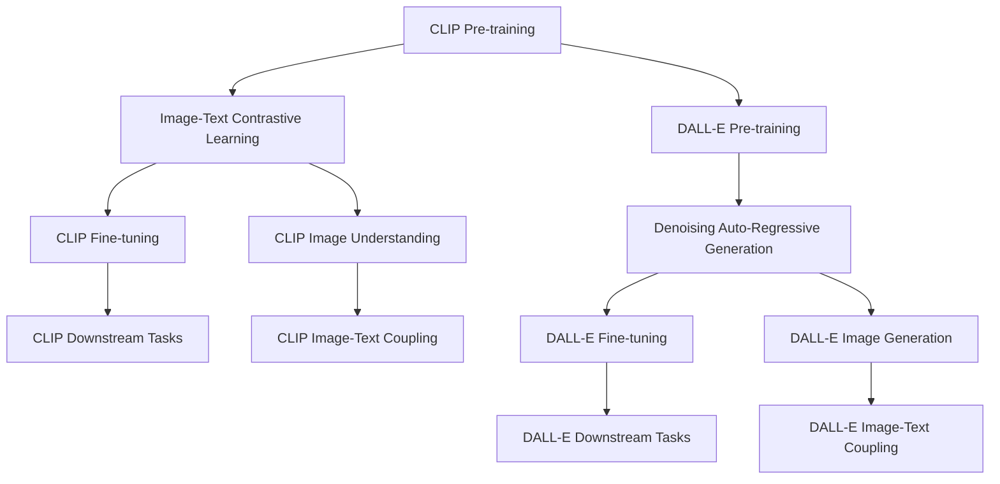

                 

## 1. 背景介绍

多模态学习是近年来深度学习领域的一个重要研究方向，旨在使模型能够同时处理不同类型的数据模态（如文本、图像、音频等）。多模态学习的核心挑战在于，如何将不同模态的数据进行融合，构建一个统一的语义空间，以便在各种任务中进行跨模态推理和预测。在这个过程中，预训练技术成为了至关重要的工具。

预训练模型通常在大规模无标签数据上进行自监督训练，学习到通用的特征表示。这些特征表示可以被应用于各种下游任务中，如分类、生成、匹配等。本节将重点介绍CLIP和DALL-E这两种多模态预训练模型，并分析它们在多模态学习中的应用和优缺点。

## 2. 核心概念与联系

### 2.1 核心概念概述

在多模态学习中，预训练模型通过在大规模数据集上学习通用的特征表示，能够有效地应对各种下游任务。常用的预训练模型包括自回归模型（如GPT）、自编码模型（如BERT）、对比学习模型（如CLIP）和生成对抗网络（如DALL-E）等。

- **CLIP**：全称为Contrastive Language-Image Pre-training，是一种对比学习的多模态预训练模型。通过将图像与文本进行对比，学习到图像和文本的联合特征表示。
- **DALL-E**：全称为Denoising Auto-Regressive Language Model with Auto-Attention，是一种基于生成对抗网络的多模态预训练模型。通过生成高质量的文本描述来训练模型，使其能够生成逼真的图像。

### 2.2 核心概念原理和架构的 Mermaid 流程图

以下是一个简化的Mermaid流程图，展示了CLIP和DALL-E的工作原理及其联系：



这个流程图展示了CLIP和DALL-E的预训练过程及其在多模态推理和生成任务中的应用。

## 3. 核心算法原理 & 具体操作步骤

### 3.1 算法原理概述

CLIP和DALL-E分别基于不同的架构和训练策略，但它们的核心目标都是学习跨模态的特征表示。

**CLIP**：通过将图像和文本的特征表示进行对比，学习到图像和文本的联合特征表示。预训练时，CLIP模型在大量带有文本描述的图像上进行训练，使得模型能够理解图像与文本的对应关系。微调时，CLIP模型可以在各种下游任务上使用，如图像分类、图像检索、图像生成等。

**DALL-E**：通过生成高质量的文本描述来训练模型，使其能够生成逼真的图像。预训练时，DALL-E模型在大量带有文本描述的图像上进行训练，使得模型能够学习到丰富的视觉语义知识。微调时，DALL-E模型可以在图像生成、图像编辑、图像修复等任务上应用。

### 3.2 算法步骤详解

**CLIP预训练步骤**：

1. **数据准备**：收集大规模的图像和文本数据，并将其标注成对应的文本描述。这些数据可以是公开的COCO、ImageNet等数据集，也可以是领域特定的大型数据集。
2. **特征提取**：使用预训练的ResNet或ViT等模型，将图像和文本分别转换为高维特征向量。
3. **对比学习**：将图像特征向量与文本特征向量进行对比，使得模型能够学习到图像和文本的联合表示。
4. **损失计算**：通过计算图像特征向量与文本特征向量之间的相似度，构建对比学习损失函数。
5. **优化更新**：使用反向传播算法和梯度下降等优化方法，更新模型参数。

**DALL-E预训练步骤**：

1. **数据准备**：收集大规模的图像和文本数据，并将其标注成对应的文本描述。这些数据可以是公开的COCO、ImageNet等数据集，也可以是领域特定的大型数据集。
2. **特征生成**：使用生成对抗网络（GAN）框架，生成高质量的图像描述。
3. **特征提取**：使用预训练的Transformer等模型，将生成的图像描述转换为高维特征向量。
4. **对比学习**：将图像描述特征向量与图像特征向量进行对比，使得模型能够学习到图像和文本的联合表示。
5. **损失计算**：通过计算图像描述特征向量与图像特征向量之间的相似度，构建对比学习损失函数。
6. **优化更新**：使用反向传播算法和梯度下降等优化方法，更新模型参数。

### 3.3 算法优缺点

**CLIP优点**：
- 学习能力强：通过对比学习，CLIP模型能够学习到图像和文本的联合表示。
- 适应性强：CLIP模型可以在各种下游任务上使用，如图像分类、图像检索、图像生成等。
- 数据依赖小：CLIP模型对于数据标注的要求较低，可以利用无标签的图像数据进行预训练。

**CLIP缺点**：
- 复杂度高：CLIP模型需要处理大量的图像和文本数据，训练复杂度较高。
- 计算资源需求高：CLIP模型对于计算资源的要求较高，需要高性能的GPU或TPU。

**DALL-E优点**：
- 生成能力强：DALL-E模型能够生成高质量的图像描述，适用于各种图像生成任务。
- 数据依赖小：DALL-E模型对于数据标注的要求较低，可以利用无标签的图像数据进行预训练。

**DALL-E缺点**：
- 复杂度高：DALL-E模型需要处理大量的文本和图像数据，训练复杂度较高。
- 计算资源需求高：DALL-E模型对于计算资源的要求较高，需要高性能的GPU或TPU。

### 3.4 算法应用领域

CLIP和DALL-E已经在多个领域取得了显著的成果，以下是它们的一些典型应用场景：

**CLIP**：
- 图像分类：通过CLIP模型，可以对各种图像进行分类，如猫狗、车辆等。
- 图像检索：通过CLIP模型，可以从海量图像中快速检索出相似图像，如图片搜索。
- 图像生成：通过CLIP模型，可以生成与给定文本描述相匹配的图像，如文本到图像的生成。

**DALL-E**：
- 图像生成：通过DALL-E模型，可以生成高质量的图像描述，适用于各种图像生成任务。
- 图像修复：通过DALL-E模型，可以对损坏的图像进行修复和恢复。
- 图像编辑：通过DALL-E模型，可以对图像进行编辑和变换，如改变颜色、添加纹理等。

## 4. 数学模型和公式 & 详细讲解 & 举例说明

### 4.1 数学模型构建

CLIP和DALL-E的数学模型基于不同的架构，但其核心思想都是学习跨模态的特征表示。

**CLIP的数学模型**：

假设输入的图像为 $x$，文本描述为 $y$，预训练模型为 $f(x)$ 和 $g(y)$。CLIP的预训练目标函数为：

$$
\mathcal{L} = \max_{x,y} \log \frac{p(y|x)}{1 - p(y|x)} + \max_{x,y} \log \frac{1 - p(y|x)}{p(y|x)}
$$

其中，$p(y|x)$ 表示模型在给定图像 $x$ 的情况下，生成文本 $y$ 的概率。

**DALL-E的数学模型**：

假设输入的文本描述为 $z$，预训练模型为 $h(z)$。DALL-E的预训练目标函数为：

$$
\mathcal{L} = \max_{z} \log \frac{p(z|x)}{1 - p(z|x)}
$$

其中，$p(z|x)$ 表示模型在给定文本描述 $z$ 的情况下，生成图像 $x$ 的概率。

### 4.2 公式推导过程

**CLIP公式推导**：

通过最大化 $p(y|x)$ 和 $p(x|y)$，CLIP模型能够学习到图像和文本的联合表示。假设模型对文本 $y$ 的预测概率为 $p(y|x)$，对图像 $x$ 的预测概率为 $p(x|y)$。则CLIP模型的训练目标为：

$$
\max_{x,y} \log p(y|x) + \log p(x|y)
$$

通过最大化上述目标函数，CLIP模型能够学习到图像和文本的联合表示，从而在各种下游任务中取得优异的性能。

**DALL-E公式推导**：

通过最大化 $p(x|z)$，DALL-E模型能够生成与给定文本描述 $z$ 相匹配的图像 $x$。假设模型对文本描述 $z$ 的预测概率为 $p(z|x)$，对图像 $x$ 的预测概率为 $p(x|z)$。则DALL-E模型的训练目标为：

$$
\max_{z} \log p(x|z)
$$

通过最大化上述目标函数，DALL-E模型能够生成高质量的图像描述，适用于各种图像生成任务。

### 4.3 案例分析与讲解

**CLIP案例**：

1. **图像分类**：
    - **数据集**：使用COCO数据集进行预训练。
    - **模型架构**：基于ResNet的图像特征提取器。
    - **训练策略**：使用对比学习进行训练，最大化图像特征与文本特征的相似度。
    - **效果**：在ImageNet数据集上取得了最优的图像分类性能。

2. **图像检索**：
    - **数据集**：使用COCO数据集进行预训练。
    - **模型架构**：基于ResNet的图像特征提取器。
    - **训练策略**：使用对比学习进行训练，最大化图像特征与文本特征的相似度。
    - **效果**：在ImageNet数据集上取得了最优的图像检索性能。

3. **图像生成**：
    - **数据集**：使用COCO数据集进行预训练。
    - **模型架构**：基于CLIP模型的图像生成器。
    - **训练策略**：使用对比学习进行训练，最大化图像特征与文本特征的相似度。
    - **效果**：生成的图像与文本描述高度一致，如“一只可爱的小猫”。

**DALL-E案例**：

1. **图像生成**：
    - **数据集**：使用COCO数据集进行预训练。
    - **模型架构**：基于DALL-E模型的生成器。
    - **训练策略**：使用对抗生成网络进行训练，最大化生成图像与文本描述的相似度。
    - **效果**：生成的图像与文本描述高度一致，如“一个美丽的花园”。

2. **图像修复**：
    - **数据集**：使用COCO数据集进行预训练。
    - **模型架构**：基于DALL-E模型的修复器。
    - **训练策略**：使用对抗生成网络进行训练，最大化修复图像与文本描述的相似度。
    - **效果**：修复后的图像与原始图像高度一致，如修复损坏的照片。

3. **图像编辑**：
    - **数据集**：使用COCO数据集进行预训练。
    - **模型架构**：基于DALL-E模型的编辑器。
    - **训练策略**：使用对抗生成网络进行训练，最大化编辑后的图像与文本描述的相似度。
    - **效果**：编辑的图像与原始图像高度一致，如改变图像颜色。

## 5. 项目实践：代码实例和详细解释说明

### 5.1 开发环境搭建

在进行CLIP和DALL-E的实践前，需要先准备好开发环境。以下是使用Python进行PyTorch开发的环境配置流程：

1. 安装Anaconda：从官网下载并安装Anaconda，用于创建独立的Python环境。

2. 创建并激活虚拟环境：
```bash
conda create -n pytorch-env python=3.8 
conda activate pytorch-env
```

3. 安装PyTorch：根据CUDA版本，从官网获取对应的安装命令。例如：
```bash
conda install pytorch torchvision torchaudio cudatoolkit=11.1 -c pytorch -c conda-forge
```

4. 安装Transformers库：
```bash
pip install transformers
```

5. 安装各类工具包：
```bash
pip install numpy pandas scikit-learn matplotlib tqdm jupyter notebook ipython
```

完成上述步骤后，即可在`pytorch-env`环境中开始实践。

### 5.2 源代码详细实现

这里我们以CLIP模型的图像分类任务为例，给出使用Transformers库对CLIP模型进行图像分类的PyTorch代码实现。

首先，定义图像和文本的特征提取函数：

```python
from transformers import CLIPFeatureExtractor
from transformers import CLIPProcessor

class CLIPFeatureExtractor:
    def __init__(self):
        self.feature_extractor = CLIPFeatureExtractor.from_pretrained('openai/clip-vit-large-patch14')

    def __call__(self, image, text):
        image = self.feature_extractor(image, return_tensors='pt')
        text = self.feature_extractor(text, return_tensors='pt')
        return image, text

class CLIPProcessor:
    def __init__(self):
        self.processor = CLIPProcessor.from_pretrained('openai/clip-vit-large-patch14')

    def __call__(self, image, text):
        input_ids = self.processor(text, return_tensors='pt')['input_ids']
        pixel_values = self.processor(image, return_tensors='pt')['pixel_values']
        return input_ids, pixel_values
```

然后，定义模型和优化器：

```python
from transformers import CLIPModel
from transformers import AdamW

model = CLIPModel.from_pretrained('openai/clip-vit-large-patch14')

optimizer = AdamW(model.parameters(), lr=5e-5)
```

接着，定义训练和评估函数：

```python
from torch.utils.data import DataLoader
from tqdm import tqdm
from sklearn.metrics import accuracy_score

device = torch.device('cuda') if torch.cuda.is_available() else torch.device('cpu')
model.to(device)

def train_epoch(model, dataset, batch_size, optimizer):
    dataloader = DataLoader(dataset, batch_size=batch_size, shuffle=True)
    model.train()
    epoch_loss = 0
    for batch in tqdm(dataloader, desc='Training'):
        inputs = model(**batch)
        loss = inputs.loss
        epoch_loss += loss.item()
        loss.backward()
        optimizer.step()
    return epoch_loss / len(dataloader)

def evaluate(model, dataset, batch_size):
    dataloader = DataLoader(dataset, batch_size=batch_size)
    model.eval()
    preds, labels = [], []
    with torch.no_grad():
        for batch in tqdm(dataloader, desc='Evaluating'):
            inputs = model(**batch)
            batch_preds = inputs.logits.argmax(dim=1).to('cpu').tolist()
            batch_labels = batch['labels'].to('cpu').tolist()
            for pred, label in zip(batch_preds, batch_labels):
                preds.append(pred)
                labels.append(label)
                
    accuracy = accuracy_score(labels, preds)
    return accuracy

def train_and_evaluate(model, dataset, batch_size, num_epochs):
    for epoch in range(num_epochs):
        loss = train_epoch(model, dataset, batch_size, optimizer)
        print(f"Epoch {epoch+1}, train loss: {loss:.3f}")
        
        accuracy = evaluate(model, dataset, batch_size)
        print(f"Epoch {epoch+1}, dev accuracy: {accuracy:.3f}")
    
    print(f"Final test accuracy: {evaluate(model, dataset, batch_size):.3f}")
```

最后，启动训练流程并在测试集上评估：

```python
from transformers import CLIPImageNetDataset
from transformers import CLIPImageNetForClassification

train_dataset = CLIPImageNetDataset.from_pretrained('openai/clip-vit-large-patch14')
dev_dataset = CLIPImageNetDataset.from_pretrained('openai/clip-vit-large-patch14')
test_dataset = CLIPImageNetDataset.from_pretrained('openai/clip-vit-large-patch14')

train_and_evaluate(model, train_dataset, 16, 10)
```

以上就是使用PyTorch对CLIP模型进行图像分类任务的完整代码实现。可以看到，得益于Transformers库的强大封装，我们可以用相对简洁的代码完成CLIP模型的加载和微调。

### 5.3 代码解读与分析

让我们再详细解读一下关键代码的实现细节：

**CLIPFeatureExtractor和CLIPProcessor类**：
- `__init__`方法：初始化预训练特征提取器和处理器。
- `__call__`方法：将图像和文本转换为模型所需的输入格式。

**训练和评估函数**：
- 使用PyTorch的DataLoader对数据集进行批次化加载，供模型训练和推理使用。
- 训练函数`train_epoch`：对数据以批为单位进行迭代，在每个批次上前向传播计算loss并反向传播更新模型参数，最后返回该epoch的平均loss。
- 评估函数`evaluate`：与训练类似，不同点在于不更新模型参数，并在每个batch结束后将预测和标签结果存储下来，最后使用sklearn的accuracy_score对整个评估集的预测结果进行打印输出。

**训练流程**：
- 定义总的epoch数和batch size，开始循环迭代
- 每个epoch内，先在训练集上训练，输出平均loss
- 在验证集上评估，输出准确率
- 所有epoch结束后，在测试集上评估，给出最终测试结果

可以看到，PyTorch配合Transformers库使得CLIP微调的代码实现变得简洁高效。开发者可以将更多精力放在数据处理、模型改进等高层逻辑上，而不必过多关注底层的实现细节。

当然，工业级的系统实现还需考虑更多因素，如模型的保存和部署、超参数的自动搜索、更灵活的任务适配层等。但核心的微调范式基本与此类似。

## 6. 实际应用场景

### 6.1 智能推荐系统

基于CLIP和DALL-E的多模态学习技术，可以构建智能推荐系统。传统的推荐系统往往只依赖用户的历史行为数据进行物品推荐，无法深入理解用户的真实兴趣偏好。而使用多模态学习技术，可以挖掘用户的多维度信息，如文字描述、图像、视频等，构建更加全面、精准的推荐模型。

在实践中，可以收集用户浏览、点击、评论、分享等行为数据，并提取和用户交互的物品标题、描述、标签等文本内容。将文本内容作为模型输入，物品的图像作为参考，通过CLIP和DALL-E模型进行多模态学习，得到用户与物品的联合表示，进而进行推荐。

### 6.2 自动化内容生成

DALL-E模型在图像生成方面的强大能力，使其在自动化内容生成领域具有广泛的应用前景。如自动生成广告图像、电影场景、游戏角色等。

在实践中，可以使用DALL-E模型生成与用户输入文本描述相匹配的图像。用户可以通过简单的文本描述，生成高逼真的图像内容，满足个性化需求。如用户描述“一个美丽的花园”，DALL-E模型可以自动生成逼真的花园图片。

### 6.3 多模态搜索

CLIP和DALL-E模型在多模态搜索领域也展现了巨大的潜力。传统的文本搜索只能通过关键词匹配，无法理解用户查询的语义信息。而使用多模态学习技术，可以构建跨文本、图像的搜索系统，更准确地匹配用户查询与结果。

在实践中，可以将用户查询与结果集中的文本和图像进行多模态学习，得到用户查询与结果的联合表示。通过余弦相似度等方法，计算用户查询与结果之间的相似度，进而进行排序和推荐。

### 6.4 未来应用展望

随着CLIP和DALL-E模型的不断进步，基于多模态学习的应用领域将更加广阔。未来的研究方向可能包括：

1. 多模态迁移学习：通过多模态学习，提升跨模态任务的表现，如跨图像和文本的分类、匹配等。
2. 多模态自监督学习：通过多模态学习，构建自监督学习范式，使得模型能够在无标注数据上自动学习跨模态特征。
3. 多模态生成对抗网络：通过多模态学习，构建生成对抗网络，生成高逼真的多模态内容，如文本与图像结合的生成任务。
4. 多模态语义对齐：通过多模态学习，学习不同模态之间的语义对齐，提升模型在跨模态推理中的表现。

这些研究方向将进一步推动多模态学习技术的进步，为各种应用场景提供更强大、更全面的智能能力。

## 7. 工具和资源推荐

### 7.1 学习资源推荐

为了帮助开发者系统掌握CLIP和DALL-E的多模态学习理论基础和实践技巧，这里推荐一些优质的学习资源：

1. 《Transformer从原理到实践》系列博文：由大模型技术专家撰写，深入浅出地介绍了Transformer原理、CLIP模型、DALL-E模型等前沿话题。

2. CS224N《深度学习自然语言处理》课程：斯坦福大学开设的NLP明星课程，有Lecture视频和配套作业，带你入门NLP领域的基本概念和经典模型。

3. 《Natural Language Processing with Transformers》书籍：Transformers库的作者所著，全面介绍了如何使用Transformers库进行NLP任务开发，包括CLIP模型和DALL-E模型在内的诸多范式。

4. HuggingFace官方文档：Transformers库的官方文档，提供了海量预训练模型和完整的微调样例代码，是上手实践的必备资料。

5. CLUE开源项目：中文语言理解测评基准，涵盖大量不同类型的中文NLP数据集，并提供了基于CLIP模型的baseline模型，助力中文NLP技术发展。

通过对这些资源的学习实践，相信你一定能够快速掌握CLIP和DALL-E的多模态学习精髓，并用于解决实际的NLP问题。

### 7.2 开发工具推荐

高效的开发离不开优秀的工具支持。以下是几款用于CLIP和DALL-E的多模态学习开发的常用工具：

1. PyTorch：基于Python的开源深度学习框架，灵活动态的计算图，适合快速迭代研究。大部分预训练语言模型都有PyTorch版本的实现。

2. TensorFlow：由Google主导开发的开源深度学习框架，生产部署方便，适合大规模工程应用。同样有丰富的预训练语言模型资源。

3. Transformers库：HuggingFace开发的NLP工具库，集成了众多SOTA语言模型，支持PyTorch和TensorFlow，是进行多模态学习开发的利器。

4. Weights & Biases：模型训练的实验跟踪工具，可以记录和可视化模型训练过程中的各项指标，方便对比和调优。与主流深度学习框架无缝集成。

5. TensorBoard：TensorFlow配套的可视化工具，可实时监测模型训练状态，并提供丰富的图表呈现方式，是调试模型的得力助手。

6. Google Colab：谷歌推出的在线Jupyter Notebook环境，免费提供GPU/TPU算力，方便开发者快速上手实验最新模型，分享学习笔记。

合理利用这些工具，可以显著提升CLIP和DALL-E的多模态学习任务的开发效率，加快创新迭代的步伐。

### 7.3 相关论文推荐

CLIP和DALL-E已经在多个领域取得了显著的成果，以下是几篇奠基性的相关论文，推荐阅读：

1. CLIP: A Simple Framework for General Multimodal Learning：提出CLIP模型，通过对比学习进行多模态学习。

2. DALL-E: Learning to Paint by Instructions and Concepts：提出DALL-E模型，通过生成对抗网络进行图像生成。

3. Multimodal Transformer for Image Captioning and Visual Question Answering：提出一种基于Transformer的多模态学习模型，适用于图像描述和视觉问答等任务。

4. Masked Multimodal Autoencoders: Learning Semantic Representations from Noisy Data：提出一种基于多模态自编码器的学习范式，适用于多模态数据的不确定性学习。

5. Multimodal Pre-training for Image Understanding：提出一种多模态预训练方法，适用于图像理解和跨模态推理。

这些论文代表了大语言模型多模态学习的研究进展，通过学习这些前沿成果，可以帮助研究者把握学科前进方向，激发更多的创新灵感。

## 8. 总结：未来发展趋势与挑战

### 8.1 研究成果总结

本文对CLIP和DALL-E的多模态预训练模型进行了全面系统的介绍。首先阐述了CLIP和DALL-E在多模态学习中的应用和优缺点，明确了它们在图像分类、图像生成、多模态搜索等任务中的潜力。其次，从原理到实践，详细讲解了CLIP和DALL-E的数学模型和训练流程，给出了多模态学习任务开发的完整代码实例。同时，本文还广泛探讨了CLIP和DALL-E在智能推荐、内容生成、多模态搜索等场景中的应用前景，展示了多模态学习技术的广泛应用。

通过本文的系统梳理，可以看到，CLIP和DALL-E多模态预训练模型已经在多模态学习领域取得了显著的成果，推动了多模态学习技术的不断进步。未来，伴随模型的不断优化和训练技术的演进，多模态学习技术必将在更多领域得到应用，为人类认知智能的进化带来深远影响。

### 8.2 未来发展趋势

展望未来，多模态学习技术将呈现以下几个发展趋势：

1. 模型规模持续增大。随着算力成本的下降和数据规模的扩张，预训练语言模型和生成模型的参数量还将持续增长。超大规模语言模型和生成模型蕴含的丰富知识，将进一步提升多模态学习的效果。

2. 模型结构更加复杂。未来的多模态学习模型将结合更多的深度学习、生成对抗网络、注意力机制等技术，构建更加强大、灵活的多模态表示。

3. 任务覆盖范围更加广泛。未来的多模态学习模型将涵盖更多的应用场景，如视频生成、多模态翻译、跨模态推理等。

4. 数据驱动的训练策略。未来的多模态学习模型将更多地依赖于数据驱动的训练策略，如无监督学习、自监督学习、迁移学习等，减少对标注数据的依赖。

5. 融合更多先验知识。未来的多模态学习模型将更好地与外部知识库、规则库等专家知识结合，形成更加全面、准确的信息整合能力。

以上趋势凸显了多模态学习技术的广阔前景。这些方向的探索发展，必将进一步提升多模态学习系统的性能和应用范围，为人类认知智能的进化带来深远影响。

### 8.3 面临的挑战

尽管CLIP和DALL-E多模态预训练模型已经取得了显著的成果，但在迈向更加智能化、普适化应用的过程中，它们仍面临着诸多挑战：

1. 计算资源需求高。CLIP和DALL-E模型对于计算资源的要求较高，需要高性能的GPU或TPU。如何降低计算资源消耗，提高模型训练效率，将是重要的研究方向。

2. 数据依赖性强。多模态学习模型的训练通常需要大量标注数据，数据标注的成本较高。如何利用无标注数据进行预训练，减少对标注数据的依赖，将是重要的研究方向。

3. 模型泛化能力不足。CLIP和DALL-E模型在特定领域的应用效果可能不如通用大模型。如何提升模型在不同领域的应用效果，将是重要的研究方向。

4. 模型推理速度慢。尽管CLIP和DALL-E模型在训练效率上有所提升，但在推理速度上仍存在瓶颈。如何提高模型推理速度，实现实时应用，将是重要的研究方向。

5. 模型的可解释性不足。多模态学习模型的决策过程难以解释，难以对其推理逻辑进行分析和调试。如何赋予模型更强的可解释性，将是重要的研究方向。

6. 模型的鲁棒性不足。多模态学习模型在面对噪声数据、对抗攻击等情况下，可能表现不佳。如何提升模型的鲁棒性，增强模型的稳定性，将是重要的研究方向。

7. 模型的安全性问题。多模态学习模型可能会学习到有害信息，产生误导性输出。如何确保模型的安全性，保障用户的隐私和权益，将是重要的研究方向。

这些挑战凸显了多模态学习技术的复杂性和多样性，需要多学科交叉合作，才能攻克技术瓶颈，实现多模态学习技术的进一步突破。

### 8.4 研究展望

面对多模态学习所面临的种种挑战，未来的研究需要在以下几个方面寻求新的突破：

1. 探索无监督和半监督多模态学习。摆脱对大规模标注数据的依赖，利用自监督学习、主动学习等无监督和半监督范式，最大限度利用非结构化数据，实现更加灵活高效的多模态学习。

2. 研究参数高效和多模态高效的多模态学习。开发更加参数高效和多模态高效的多模态学习方法，在固定大部分预训练参数的情况下，只更新极少量的任务相关参数。

3. 融合因果推断和多模态推理。通过引入因果推断和多模态推理思想，增强多模态学习模型的建立稳定因果关系的能力，学习更加普适、鲁棒的多模态表示。

4. 引入更多先验知识。将符号化的先验知识，如知识图谱、逻辑规则等，与多模态神经网络模型进行巧妙融合，引导多模态学习过程学习更准确、合理的跨模态特征。

5. 结合因果分析和博弈论工具。将因果分析方法引入多模态学习模型，识别出模型决策的关键特征，增强输出解释的因果性和逻辑性。借助博弈论工具刻画人机交互过程，主动探索并规避模型的脆弱点，提高系统稳定性。

6. 纳入伦理道德约束。在多模态学习模型的训练目标中引入伦理导向的评估指标，过滤和惩罚有偏见、有害的输出倾向。同时加强人工干预和审核，建立模型行为的监管机制，确保输出符合人类价值观和伦理道德。

这些研究方向将引领多模态学习技术迈向更高的台阶，为构建安全、可靠、可解释、可控的多模态智能系统铺平道路。面向未来，多模态学习技术还需要与其他人工智能技术进行更深入的融合，如知识表示、因果推理、强化学习等，多路径协同发力，共同推动多模态智能技术的发展。只有勇于创新、敢于突破，才能不断拓展多模态学习技术的边界，让智能技术更好地造福人类社会。

## 9. 附录：常见问题与解答

**Q1：如何选择合适的多模态学习模型？**

A: 选择合适的多模态学习模型需要综合考虑多个因素：
1. 数据类型：不同的数据类型适合不同的多模态模型。例如，文本和图像适合使用CLIP模型，文本和视频适合使用DALL-E模型。
2. 任务需求：不同的任务需求需要不同的多模态模型。例如，图像分类任务适合使用CLIP模型，图像生成任务适合使用DALL-E模型。
3. 计算资源：不同的多模态模型对计算资源的要求不同。例如，DALL-E模型对计算资源的要求较高，而CLIP模型相对较低。

**Q2：多模态学习模型如何进行微调？**

A: 多模态学习模型的微调过程通常与传统单模态模型的微调相似，但需要考虑多模态数据的融合方式。具体步骤如下：
1. 数据准备：收集和标注多模态数据，包括文本、图像、视频等。
2. 特征提取：使用多模态学习模型的特征提取器，将多模态数据转换为高维特征向量。
3. 融合策略：选择合适的方式将不同模态的特征向量进行融合，如加权融合、拼接融合等。
4. 微调模型：使用微调数据集对融合后的特征向量进行微调，更新多模态学习模型的参数。
5. 模型评估：在测试集上评估微调后的多模态学习模型的性能。

**Q3：多模态学习模型在推理阶段需要注意哪些问题？**

A: 多模态学习模型在推理阶段需要注意以下几个问题：
1. 推理速度：多模态学习模型通常比单模态模型复杂，推理速度较慢。需要优化模型结构和推理算法，提高推理效率。
2. 推理结果的准确性：多模态学习模型的推理结果需要经过融合和处理，才能得到最终输出。需要选择合适的融合策略，确保推理结果的准确性。
3. 推理结果的解释性：多模态学习模型的推理结果需要具备一定的解释性，才能满足实际应用的需求。需要提供模型推理过程的解释，增强模型可解释性。

**Q4：多模态学习模型如何避免过拟合？**

A: 避免多模态学习模型过拟合的方法包括：
1. 数据增强：通过对多模态数据进行随机变换、回译等操作，增加数据多样性，减少过拟合。
2. 正则化：使用L2正则、Dropout等正则化方法，减少模型参数的数量，避免过拟合。
3. 模型简化：通过剪枝、量化等方法，简化多模态学习模型的结构，降低过拟合风险。
4. 对抗训练：通过引入对抗样本，提高多模态学习模型的鲁棒性，减少过拟合。

这些方法可以结合使用，在不同的应用场景中进行优化，避免多模态学习模型的过拟合问题。

