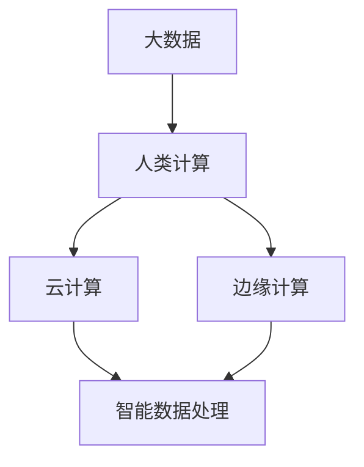

                 

# 大数据时代：人类计算的机遇与挑战

在21世纪，数据已成为全新的生产要素，其规模和重要性日益增长。大数据的兴起，不仅改变了各行各业的运作方式，也深刻影响了人们的生产生活方式。本文将深入探讨大数据时代的机遇与挑战，分析人类计算技术如何在这个数据驱动的时代中发挥关键作用，并展望其未来的发展趋势。

## 1. 背景介绍

### 1.1 数据驱动时代来临

随着互联网、物联网、移动通信等技术的快速发展，人们日常生活的各个方面都在不断产生和积累数据。这些数据不仅包括传统的文本、图像、视频等形式，还涵盖了各类传感器和设备收集的实时数据、行为数据等。数据量和种类的爆炸式增长，使得数据驱动成为各行各业发展的关键驱动力。

### 1.2 人类计算的崛起

人类计算（Human Computation）是指借助计算机进行数据处理、分析和决策的计算方式。与传统计算不同，人类计算强调利用人的认知能力，融合计算机的计算能力，以更高效、灵活、智能的方式处理数据。大数据时代，人类计算得以借助数据的巨大优势，得到前所未有的发展机遇。

## 2. 核心概念与联系

### 2.1 核心概念概述

- **大数据（Big Data）**：指数据量极其庞大，结构复杂，难以在合理时间内处理、管理和分析的数据集合。
- **人类计算（Human Computation）**：指结合人类认知能力和计算机计算能力，高效、智能地处理数据的计算方式。
- **云计算（Cloud Computing）**：指通过网络将数据、计算资源等分布在全球的计算中心中，提供按需使用的计算服务。
- **边缘计算（Edge Computing）**：指在数据产生源头附近，就近处理数据，以减少数据传输延迟和带宽压力，提高计算效率。
- **智能数据处理（Smart Data Processing）**：指利用人工智能技术，自动化、智能化地处理数据，提取数据中的知识和洞察力。

### 2.2 核心概念联系

大数据、人类计算、云计算、边缘计算和智能数据处理，这些概念之间相互联系，共同构成了大数据时代的计算生态系统。大数据提供了庞大的数据来源和处理对象，人类计算利用计算机和人的结合方式高效处理数据，云计算和边缘计算提供了灵活的计算资源管理方式，智能数据处理则通过人工智能技术，进一步提升数据处理的智能化和自动化水平。

以下是一个Mermaid流程图，展示了这些概念之间的关系：



## 3. 核心算法原理 & 具体操作步骤

### 3.1 算法原理概述

人类计算的核心在于通过算法和计算模型，将大数据转化为知识、洞察力和决策支持。常见的算法包括：

- **机器学习（Machine Learning）**：通过数据训练模型，使其能够自动学习和改进，从而进行预测和分类。
- **深度学习（Deep Learning）**：利用多层神经网络模型，通过多层非线性映射，从原始数据中提取更高层次的特征。
- **自然语言处理（NLP）**：使用算法和模型处理、分析和理解人类语言，提取语言中的信息。
- **图像处理（Image Processing）**：通过算法和模型，从图像中提取特征和信息。

### 3.2 算法步骤详解

人类计算的具体操作步骤包括：

1. **数据采集**：从各种数据源中采集数据，包括结构化数据（如数据库、表格）和非结构化数据（如文本、图像、视频）。
2. **数据清洗**：对采集的数据进行清洗和预处理，去除噪声和错误数据，保证数据的质量和一致性。
3. **数据存储**：将清洗后的数据存储在数据库、数据仓库或分布式存储系统中，以便后续处理。
4. **数据处理**：利用算法和模型对存储的数据进行计算和分析，提取有用的信息和知识。
5. **数据可视化**：将计算结果转化为图表、报表等可视化形式，便于理解和决策。
6. **决策支持**：根据分析结果，辅助决策制定，支持实际应用。

### 3.3 算法优缺点

人类计算的优点在于：

- **高效性**：通过自动化和智能化的计算方式，大幅提升数据处理的效率。
- **灵活性**：结合人类认知能力，可以处理更复杂、多样化的数据。
- **成本效益**：通过云计算等技术，按需使用计算资源，降低计算成本。

其缺点则包括：

- **隐私与安全**：数据处理和存储过程中存在隐私泄露和安全风险。
- **数据质量**：数据采集和清洗过程中可能存在数据不完整、不一致等问题。
- **计算资源**：大规模数据处理需要大量的计算资源和存储空间。

### 3.4 算法应用领域

人类计算在多个领域均有广泛应用：

- **医疗健康**：利用大数据和算法进行疾病预测、患者诊断、药物研发等。
- **金融服务**：通过数据分析和机器学习，进行风险评估、信用评分、金融欺诈检测等。
- **零售电商**：通过用户行为数据分析，进行商品推荐、销售预测、库存管理等。
- **交通物流**：利用传感器数据和算法，进行交通流量分析、路径规划、物流优化等。
- **智能制造**：通过设备数据和算法，进行设备监控、故障预测、生产优化等。

## 4. 数学模型和公式 & 详细讲解 & 举例说明

### 4.1 数学模型构建

人类计算的数学模型构建，通常包括以下几个步骤：

1. **定义问题**：明确需要解决的问题，如分类、回归、聚类等。
2. **数据准备**：收集和清洗数据，将数据转化为算法可处理的形式。
3. **模型选择**：选择合适的算法和模型，如线性回归、决策树、神经网络等。
4. **训练模型**：使用训练数据训练模型，优化模型参数。
5. **模型评估**：使用测试数据评估模型性能，进行模型选择和调整。
6. **应用模型**：将模型应用于实际问题，进行预测、分类等任务。

### 4.2 公式推导过程

以线性回归模型为例，其基本公式如下：

$$
y = \beta_0 + \beta_1 x_1 + \beta_2 x_2 + \cdots + \beta_n x_n + \epsilon
$$

其中，$y$ 为输出变量，$x_i$ 为输入变量，$\beta_i$ 为模型参数，$\epsilon$ 为误差项。模型的目标是最小化误差项，从而拟合出最佳模型。

### 4.3 案例分析与讲解

假设我们有一个房价预测问题，目标是预测给定房屋的销售价格。我们可以采集房屋的面积、位置、周边环境等数据，构建线性回归模型，通过训练数据对模型进行优化。在模型训练完成后，我们通过测试数据评估模型性能，选择最优模型。最终，将训练好的模型应用于实际预测，从而辅助房地产销售和定价决策。

## 5. 项目实践：代码实例和详细解释说明

### 5.1 开发环境搭建

在进行人类计算实践前，我们需要准备好开发环境。以下是使用Python进行Scikit-learn开发的Python环境配置流程：

1. 安装Anaconda：从官网下载并安装Anaconda，用于创建独立的Python环境。

2. 创建并激活虚拟环境：
```bash
conda create -n sklearn-env python=3.8 
conda activate sklearn-env
```

3. 安装Scikit-learn：
```bash
conda install scikit-learn
```

4. 安装各类工具包：
```bash
pip install numpy pandas matplotlib scikit-learn jupyter notebook
```

完成上述步骤后，即可在`sklearn-env`环境中开始人类计算实践。

### 5.2 源代码详细实现

下面我们以房价预测任务为例，给出使用Scikit-learn进行线性回归的Python代码实现。

首先，定义数据准备函数：

```python
import numpy as np
import pandas as pd

def load_data(path):
    data = pd.read_csv(path)
    features = data[['area', 'location', 'environment']]
    target = data['price']
    return features, target
```

然后，定义模型训练和评估函数：

```python
from sklearn.linear_model import LinearRegression
from sklearn.metrics import mean_squared_error

def train_model(X, y):
    model = LinearRegression()
    model.fit(X, y)
    return model

def evaluate_model(model, X_test, y_test):
    y_pred = model.predict(X_test)
    mse = mean_squared_error(y_test, y_pred)
    rmse = np.sqrt(mse)
    return rmse
```

接着，启动训练流程并在测试集上评估：

```python
X_train, y_train = load_data('train.csv')
X_test, y_test = load_data('test.csv')

model = train_model(X_train, y_train)
rmse = evaluate_model(model, X_test, y_test)
print(f'RMSE: {rmse:.3f}')
```

以上就是使用Scikit-learn进行房价预测的完整代码实现。可以看到，利用Scikit-learn库，代码实现变得简洁高效。

### 5.3 代码解读与分析

让我们再详细解读一下关键代码的实现细节：

**load_data函数**：
- `__init__`方法：初始化特征和标签数据。
- `__len__`方法：返回数据集的样本数量。
- `__getitem__`方法：对单个样本进行处理，将样本输入转换为特征向量。

**train_model函数**：
- 定义线性回归模型，并使用训练数据训练模型。
- 返回训练好的模型。

**evaluate_model函数**：
- 使用训练好的模型对测试数据进行预测，计算预测值与真实值之间的均方根误差。
- 返回模型的RMSE指标。

**训练流程**：
- 定义训练数据和测试数据，启动训练流程。
- 在训练数据上训练模型，并输出RMSE指标。
- 在测试数据上评估模型性能，输出最终结果。

可以看到，Scikit-learn库使得线性回归的代码实现变得简洁高效。开发者可以将更多精力放在数据处理、模型改进等高层逻辑上，而不必过多关注底层的实现细节。

当然，工业级的系统实现还需考虑更多因素，如模型的保存和部署、超参数的自动搜索、更灵活的任务适配层等。但核心的算法原理基本与此类似。

## 6. 实际应用场景

### 6.1 智慧城市交通管理

在智慧城市建设中，大数据和人类计算可以显著提升城市交通管理的效率和智能化水平。通过采集交通流量、车辆位置、道路状况等数据，利用算法和模型进行交通流量预测、拥堵分析、路径优化等，从而实现交通流量动态监控和调控。

### 6.2 工业互联网

在工业互联网领域，大数据和人类计算可以辅助企业进行生产流程优化、设备维护预测、供应链管理等。通过采集设备和传感器数据，利用算法和模型进行数据分析和预测，从而提升生产效率、降低维护成本、优化供应链。

### 6.3 环境监测

在环境监测领域，大数据和人类计算可以支持水质、空气、土壤等环境数据的实时监测和分析。通过采集各类环境数据，利用算法和模型进行数据分析和预测，从而实现环境状况的实时监测和预警。

### 6.4 未来应用展望

随着大数据和人类计算技术的不断发展，未来将呈现以下几个趋势：

1. **实时计算**：利用边缘计算和实时计算技术，实现数据的即时处理和分析，提升数据的时效性。
2. **自动化计算**：通过机器学习和自动化算法，进一步提升数据处理的自动化水平，减少人工干预。
3. **跨领域融合**：推动不同领域的数据和算法融合，实现跨领域的多模态智能计算。
4. **智能化决策支持**：利用人工智能技术，实现更高效、精准、智能的决策支持，提升决策的科学性和可靠性。
5. **隐私保护**：加强数据隐私保护，确保数据在处理和传输过程中的安全性和隐私性。

以上趋势凸显了大数据和人类计算技术的广阔前景。这些方向的探索发展，必将进一步提升数据处理的效率和智能化水平，为各行各业带来更多的创新机会和应用场景。

## 7. 工具和资源推荐

### 7.1 学习资源推荐

为了帮助开发者系统掌握大数据和人类计算的理论基础和实践技巧，这里推荐一些优质的学习资源：

1. **《大数据时代：人类计算的机遇与挑战》系列博文**：深入浅出地介绍了大数据、人类计算的原理、应用和挑战，为读者提供了全面的技术指引。

2. **CS229《机器学习》课程**：斯坦福大学开设的经典课程，涵盖了机器学习的基础理论、算法和应用，是学习大数据和人类计算的重要参考资料。

3. **《深度学习》书籍**：由深度学习领域的知名专家撰写，详细介绍了深度学习的基本概念、算法和应用，是理解人类计算技术的必读书籍。

4. **Scikit-learn官方文档**：Scikit-learn库的官方文档，提供了丰富的算法和模型实现，是学习和实践人类计算技术的强大工具。

5. **Kaggle竞赛平台**：Kaggle平台提供了大量的数据集和比赛，是学习和实践人类计算技术的实战平台，也是发现和解决问题的好地方。

通过对这些资源的学习实践，相信你一定能够快速掌握大数据和人类计算的精髓，并用于解决实际的数据处理问题。

### 7.2 开发工具推荐

高效的开发离不开优秀的工具支持。以下是几款用于大数据和人类计算开发的常用工具：

1. **Python**：作为目前最流行的编程语言之一，Python拥有强大的科学计算和数据处理能力，是数据科学和机器学习的首选语言。

2. **R语言**：R语言也是数据科学和统计分析的主流语言，拥有丰富的数据分析和可视化库。

3. **Jupyter Notebook**：用于数据科学和机器学习的交互式编程环境，支持Python、R等多种语言，便于快速迭代和分享。

4. **Hadoop**：用于大规模数据处理的分布式计算框架，可以处理海量数据，支持高并发的数据处理。

5. **Spark**：由Apache基金会开发的分布式计算框架，支持实时数据处理、机器学习等多种应用场景。

6. **TensorFlow**：由Google开发的深度学习框架，支持多种深度学习模型和算法，是数据科学和机器学习的强大工具。

合理利用这些工具，可以显著提升大数据和人类计算任务的开发效率，加快创新迭代的步伐。

### 7.3 相关论文推荐

大数据和人类计算的发展源于学界的持续研究。以下是几篇奠基性的相关论文，推荐阅读：

1. **《Big Data: A Revolution That Will Transform How We Live, Work, and Think》**：Tom Friedman的经典著作，详细介绍了大数据对人类社会各个方面的影响。

2. **《Human-Data Interaction》**：Bruno Toniolo等人的论文，探讨了人类计算的计算模型、用户交互和应用场景。

3. **《A Survey of Human-Data Interaction》**：Sriman Bhattacharya等人的综述论文，介绍了人类计算的各种技术和应用案例。

4. **《Human-in-the-Loop Machine Learning》**：Benjamin Bowling等人的论文，探讨了人类在机器学习中的角色和作用。

这些论文代表了大数据和人类计算的发展脉络。通过学习这些前沿成果，可以帮助研究者把握学科前进方向，激发更多的创新灵感。

## 8. 总结：未来发展趋势与挑战

### 8.1 总结

本文对大数据和人类计算进行了全面系统的介绍。首先阐述了大数据和人类计算的研究背景和意义，明确了大数据和人类计算在数据驱动时代中的关键作用。其次，从原理到实践，详细讲解了大数据和人类计算的数学模型和操作步骤，给出了实际应用场景下的代码实例和详细解释说明。同时，本文还探讨了大数据和人类计算的未来发展趋势和面临的挑战，提供了有价值的理论和实践指导。

通过本文的系统梳理，可以看到，大数据和人类计算技术的崛起，为各行各业带来了前所未有的机遇，也带来了诸多挑战。如何在数据爆炸和计算资源有限的情况下，高效、智能地处理大数据，是未来需要不断探索和解决的问题。

### 8.2 未来发展趋势

展望未来，大数据和人类计算技术将呈现以下几个发展趋势：

1. **实时计算**：利用边缘计算和实时计算技术，实现数据的即时处理和分析，提升数据的时效性。
2. **自动化计算**：通过机器学习和自动化算法，进一步提升数据处理的自动化水平，减少人工干预。
3. **跨领域融合**：推动不同领域的数据和算法融合，实现跨领域的多模态智能计算。
4. **智能化决策支持**：利用人工智能技术，实现更高效、精准、智能的决策支持，提升决策的科学性和可靠性。
5. **隐私保护**：加强数据隐私保护，确保数据在处理和传输过程中的安全性和隐私性。

以上趋势凸显了大数据和人类计算技术的广阔前景。这些方向的探索发展，必将进一步提升数据处理的效率和智能化水平，为各行各业带来更多的创新机会和应用场景。

### 8.3 面临的挑战

尽管大数据和人类计算技术已经取得了显著成就，但在迈向更加智能化、普适化应用的过程中，仍面临诸多挑战：

1. **数据质量**：数据采集和清洗过程中可能存在数据不完整、不一致等问题。
2. **计算资源**：大规模数据处理需要大量的计算资源和存储空间。
3. **隐私与安全**：数据处理和存储过程中存在隐私泄露和安全风险。
4. **算法复杂性**：机器学习和深度学习算法的复杂性，增加了模型调优和部署的难度。
5. **模型可解释性**：复杂模型（如深度神经网络）的输出缺乏可解释性，难以理解和调试。

### 8.4 研究展望

面对大数据和人类计算面临的挑战，未来的研究需要在以下几个方面寻求新的突破：

1. **数据预处理技术**：发展更高效、更智能的数据预处理技术，提高数据的质量和一致性。
2. **分布式计算框架**：探索更高效、更灵活的分布式计算框架，支持大规模数据处理。
3. **隐私保护技术**：开发更强的隐私保护技术，确保数据在处理和传输过程中的安全性和隐私性。
4. **模型压缩与优化**：研究模型压缩与优化技术，降低模型复杂度，提升模型可解释性和实用性。
5. **自动化算法设计**：发展自动化算法设计技术，提高模型调优和部署的效率和准确性。

这些研究方向将引领大数据和人类计算技术迈向更高的台阶，为各行各业提供更加高效、智能、安全的数据处理工具和方法。总之，大数据和人类计算技术的探索发展，必将为数据驱动时代带来更多的创新和突破，推动各行各业的数字化转型和智能化升级。

## 9. 附录：常见问题与解答

**Q1：什么是大数据？**

A: 大数据指数据量极其庞大，结构复杂，难以在合理时间内处理、管理和分析的数据集合。

**Q2：人类计算的优势是什么？**

A: 人类计算结合了人类的认知能力和计算机的计算能力，能够高效、智能地处理数据，具有高效性、灵活性和成本效益等优势。

**Q3：什么是边缘计算？**

A: 边缘计算指在数据产生源头附近，就近处理数据，以减少数据传输延迟和带宽压力，提高计算效率。

**Q4：如何提高数据处理的自动化水平？**

A: 通过机器学习和自动化算法，进一步提升数据处理的自动化水平，减少人工干预。

**Q5：如何在数据处理中保护隐私？**

A: 加强数据隐私保护，确保数据在处理和传输过程中的安全性和隐私性。

---

作者：禅与计算机程序设计艺术 / Zen and the Art of Computer Programming

