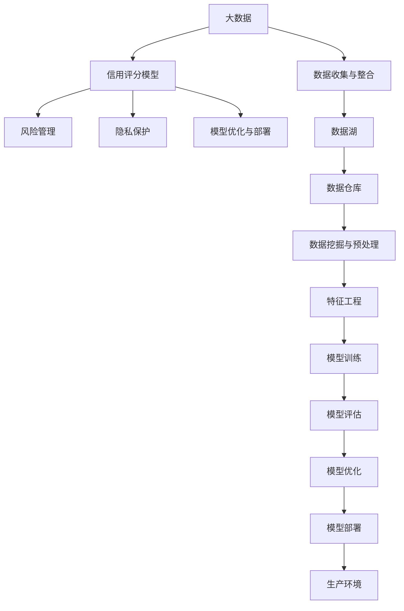

                 

# 大数据背景下的银行个人征信体系研究

> 关键词：大数据,银行,个人征信体系,信用评分模型,风险管理,人工智能,隐私保护

## 1. 背景介绍

### 1.1 问题由来
随着互联网技术的快速发展，个人信息数据的获取、处理和使用变得更加便利。银行作为与公众生活息息相关的金融机构，通过分析个人数据来评估客户的信用状况，成为了风险管理的重要手段。然而，传统的银行个人征信系统面临数据量庞大、数据质量参差不齐、计算复杂度高、用户隐私保护压力大等挑战，迫切需要借助大数据技术进行升级。

### 1.2 问题核心关键点
本文旨在探索如何在大数据背景下，通过数据挖掘、机器学习和人工智能技术，构建更加智能、高效、安全的银行个人征信体系。具体问题核心关键点如下：

- **数据收集与整合**：如何高效地获取、存储和整合银行内部的各类数据，包括客户基本信息、交易记录、消费习惯、社交网络信息等。
- **信用评分模型**：如何构建高效、准确的信用评分模型，评估客户的还款能力和还款意愿。
- **风险管理**：如何利用大数据技术，构建实时风险监控和预警系统，提升风险管理能力。
- **隐私保护**：如何在保障客户隐私的同时，实现对数据的有效利用和分析。
- **模型优化与部署**：如何将构建的模型进行优化，并部署到生产环境中，保证系统的稳定性和性能。

### 1.3 问题研究意义
构建基于大数据的银行个人征信体系，对于提升银行的业务效率、风险控制能力和客户满意度具有重要意义：

1. **提升业务效率**：通过自动化、智能化的数据处理和分析，大幅提升征信体系的运作效率，减少人工干预。
2. **增强风险管理**：利用大数据技术，进行实时信用评估和风险预警，帮助银行及时识别和化解潜在风险。
3. **提高客户满意度**：通过个性化服务，提升客户体验，增强客户粘性。
4. **推动业务创新**：利用大数据技术，探索新的业务模式和产品，拓展银行的服务范围。
5. **保障数据安全**：通过严格的数据管理和隐私保护措施，确保客户数据的安全和合规。

## 2. 核心概念与联系

### 2.1 核心概念概述

为更好地理解银行个人征信体系在大数据背景下的构建，本节将介绍几个密切相关的核心概念：

- **大数据（Big Data）**：指规模庞大、复杂多样、高速变化的各类数据，涵盖结构化、半结构化和非结构化数据。
- **个人征信体系（Credit Scoring System）**：通过分析客户的各类数据，评估其信用状况，作为银行信贷决策的重要依据。
- **信用评分模型（Credit Scoring Model）**：一种基于统计学和机器学习技术，用于评估客户信用风险的数学模型。
- **风险管理（Risk Management）**：通过识别、量化和控制风险，确保银行资产的安全性、流动性和盈利性。
- **隐私保护（Privacy Protection）**：确保客户个人信息不被非法获取、使用和泄露，保护客户隐私权利。
- **模型优化与部署（Model Optimization and Deployment）**：将构建的模型进行优化和部署，使其能够在生产环境中稳定运行。

这些核心概念之间的逻辑关系可以通过以下Mermaid流程图来展示：



这个流程图展示了大数据背景下银行个人征信体系的构建流程：

1. 从大数据中收集和整合各类数据。
2. 进行数据挖掘与预处理，提取有价值的信息。
3. 构建信用评分模型，评估客户信用风险。
4. 进行风险管理，识别和控制风险。
5. 保护客户隐私，确保数据安全。
6. 对模型进行优化，确保其在生产环境中的高效运行。

## 3. 核心算法原理 & 具体操作步骤
### 3.1 算法原理概述

银行个人征信体系构建的核心在于利用大数据技术，结合机器学习和人工智能算法，构建高效的信用评分模型，并进行实时风险监控和预警。具体来说，其算法原理如下：

1. **数据收集与整合**：通过API接口、ETL工具等方式，收集银行的各类数据，包括客户基本信息、交易记录、消费习惯、社交网络信息等，并将这些数据存储在一个数据湖中。

2. **数据挖掘与预处理**：利用大数据技术，对数据湖中的数据进行挖掘和预处理，提取有价值的信息，并进行特征工程，生成用于模型训练的数据集。

3. **信用评分模型**：基于统计学和机器学习技术，构建高效的信用评分模型，用于评估客户的还款能力和还款意愿。常见的信用评分模型包括Logistic回归、随机森林、神经网络等。

4. **风险管理**：利用信用评分模型，进行实时的信用评估和风险预警，及时识别和化解潜在风险。

5. **隐私保护**：在数据处理和分析过程中，采用差分隐私、联邦学习等技术，确保客户数据的安全和隐私保护。

6. **模型优化与部署**：对构建的模型进行优化，如超参数调优、模型压缩等，并部署到生产环境中，保证系统的稳定性和性能。

### 3.2 算法步骤详解

以下是大数据背景下银行个人征信体系的详细算法步骤：

**Step 1: 数据收集与整合**

1. **数据收集**：
   - 通过API接口，从银行内部系统（如网上银行、移动银行、ATM等）获取客户的交易记录、消费习惯、个人信息等数据。
   - 从第三方数据供应商获取社交网络信息、公共记录、人口统计数据等。
   - 使用爬虫技术，从公开渠道获取客户的互联网行为数据。

2. **数据整合**：
   - 将所有收集到的数据，按照一定的格式和标准进行整合，存储在数据湖（Data Lake）中。
   - 使用ETL工具（Extract, Transform, Load），将数据湖中的数据导入到数据仓库（Data Warehouse）中。

**Step 2: 数据挖掘与预处理**

1. **数据挖掘**：
   - 利用大数据技术，对数据仓库中的数据进行挖掘，提取有价值的信息。
   - 使用机器学习算法，进行聚类、分类、关联规则挖掘等，发现数据中的潜在模式和规律。

2. **数据预处理**：
   - 清洗数据，处理缺失值、异常值等问题。
   - 进行特征工程，生成用于模型训练的特征向量。

**Step 3: 信用评分模型构建**

1. **特征选择**：
   - 根据任务需求，选择对信用评估有重要影响的特征，构建特征向量。
   - 使用相关性分析、主成分分析等方法，优化特征选择过程。

2. **模型训练**：
   - 选择合适的算法，如Logistic回归、随机森林、神经网络等，构建信用评分模型。
   - 使用交叉验证、网格搜索等技术，优化模型参数。

3. **模型评估**：
   - 使用AUC、ROC曲线、Kappa系数等指标，评估模型的性能。
   - 进行模型调优，确保模型的准确性和稳定性。

**Step 4: 风险管理**

1. **实时监控**：
   - 利用实时数据流技术，对客户的信用状况进行实时监控。
   - 根据客户的实时交易数据、社交网络数据等，动态更新信用评分。

2. **风险预警**：
   - 根据预设的阈值和规则，识别出存在高风险的客户。
   - 通过邮件、短信、电话等方式，向客户进行风险预警。

**Step 5: 隐私保护**

1. **差分隐私**：
   - 在数据处理和分析过程中，采用差分隐私技术，确保客户数据不被非法获取和泄露。
   - 对敏感信息进行模糊化处理，保护客户隐私。

2. **联邦学习**：
   - 在多个数据源之间进行联邦学习，共享模型和数据，避免数据集中存储。
   - 保护客户数据在传输和存储过程中的安全。

**Step 6: 模型优化与部署**

1. **模型优化**：
   - 使用模型压缩、参数剪枝等技术，优化模型的结构和参数，提高模型的运行效率。
   - 进行超参数调优，确保模型在生产环境中的稳定性和性能。

2. **模型部署**：
   - 将优化后的模型部署到生产环境中。
   - 使用容器化技术，如Docker，确保模型的稳定性和可扩展性。

### 3.3 算法优缺点

大数据背景下的银行个人征信体系具有以下优点：

1. **高效性**：利用大数据技术，能够高效地处理和分析海量数据，提升征信体系的运作效率。
2. **准确性**：通过机器学习和人工智能算法，构建高效的信用评分模型，提高信用评估的准确性。
3. **实时性**：利用实时数据流技术，实现实时的信用监控和预警，提升风险管理能力。
4. **隐私保护**：采用差分隐私和联邦学习技术，确保客户数据的安全和隐私保护。

同时，该方法也存在以下缺点：

1. **数据质量参差不齐**：不同来源的数据质量不一，可能存在数据噪声和缺失问题。
2. **计算复杂度高**：处理海量数据需要强大的计算资源和复杂的技术手段。
3. **隐私保护压力大**：在数据收集和分析过程中，需要严格遵守隐私保护法规，防止数据泄露和滥用。
4. **模型复杂度高**：构建高效的信用评分模型，需要综合考虑多个因素，模型复杂度较高。

### 3.4 算法应用领域

基于大数据的银行个人征信体系，广泛应用于以下领域：

1. **个人贷款审批**：利用信用评分模型，评估客户的还款能力和还款意愿，作为贷款审批的重要依据。
2. **信用卡风险管理**：通过实时监控和预警，识别和化解信用卡交易中的潜在风险。
3. **反欺诈检测**：利用机器学习算法，检测和防范各种欺诈行为，保护客户的资金安全。
4. **信用预警系统**：根据客户的实时交易数据和社交网络数据，进行信用预警，帮助银行及时识别和化解风险。
5. **信用评估报告**：生成个性化的信用评估报告，帮助客户了解自己的信用状况，提升信用意识。

## 4. 数学模型和公式 & 详细讲解 & 举例说明

### 4.1 数学模型构建

假设银行的个人征信体系基于Logistic回归模型进行构建，其数学模型为：

$$
P(y_i=1|x_i;\theta) = \sigma(\theta^T x_i)
$$

其中，$x_i$ 表示客户$i$的特征向量，$\theta$ 表示模型参数，$\sigma(\cdot)$ 表示sigmoid函数，$y_i$ 表示客户$i$是否违约的标签（0或1）。

### 4.2 公式推导过程

假设训练数据集为 $D=\{(x_i,y_i)\}_{i=1}^N$，则Logistic回归模型的损失函数为：

$$
\mathcal{L}(\theta) = -\frac{1}{N}\sum_{i=1}^N [y_i \log P(y_i=1|x_i;\theta) + (1-y_i)\log P(y_i=0|x_i;\theta)]
$$

其中，$P(y_i=1|x_i;\theta)$ 表示模型预测客户$i$违约的概率。

根据梯度下降算法，求解最优参数 $\theta$，其更新公式为：

$$
\theta \leftarrow \theta - \eta \nabla_{\theta}\mathcal{L}(\theta)
$$

其中，$\eta$ 为学习率，$\nabla_{\theta}\mathcal{L}(\theta)$ 为损失函数对参数 $\theta$ 的梯度。

### 4.3 案例分析与讲解

以信用卡风险管理为例，介绍基于Logistic回归模型的信用评分模型的构建和应用：

1. **特征选择**：
   - 选择客户的信用卡交易记录、消费金额、收入水平、年龄、性别等特征，作为模型的输入。
   - 使用相关性分析、主成分分析等方法，选择对违约风险有重要影响的特征，构建特征向量。

2. **模型训练**：
   - 使用Logistic回归算法，构建信用评分模型。
   - 使用交叉验证、网格搜索等技术，优化模型参数。

3. **模型评估**：
   - 使用AUC、ROC曲线、Kappa系数等指标，评估模型的性能。
   - 进行模型调优，确保模型的准确性和稳定性。

4. **风险预警**：
   - 利用实时数据流技术，对客户的信用状况进行实时监控。
   - 根据预设的阈值和规则，识别出存在高风险的客户。
   - 通过邮件、短信、电话等方式，向客户进行风险预警。

## 5. 项目实践：代码实例和详细解释说明

### 5.1 开发环境搭建

在进行项目实践前，我们需要准备好开发环境。以下是使用Python进行PyTorch开发的环境配置流程：

1. 安装Anaconda：从官网下载并安装Anaconda，用于创建独立的Python环境。

2. 创建并激活虚拟环境：
```bash
conda create -n pytorch-env python=3.8 
conda activate pytorch-env
```

3. 安装PyTorch：根据CUDA版本，从官网获取对应的安装命令。例如：
```bash
conda install pytorch torchvision torchaudio cudatoolkit=11.1 -c pytorch -c conda-forge
```

4. 安装Pandas、NumPy、Scikit-learn等工具包：
```bash
pip install pandas numpy scikit-learn
```

5. 安装Dask库：使用Dask处理大规模数据集，确保数据处理效率。
```bash
pip install dask
```

完成上述步骤后，即可在`pytorch-env`环境中开始项目实践。

### 5.2 源代码详细实现

我们以信用卡风险管理为例，使用Logistic回归模型构建信用评分模型，并实现实时风险预警。

首先，定义Logistic回归模型类：

```python
import torch
import torch.nn as nn

class LogisticRegression(nn.Module):
    def __init__(self, input_dim):
        super(LogisticRegression, self).__init__()
        self.linear = nn.Linear(input_dim, 1)
        self.sigmoid = nn.Sigmoid()

    def forward(self, x):
        return self.sigmoid(self.linear(x))
```

然后，定义数据预处理函数：

```python
def load_data(path):
    data = pd.read_csv(path)
    return data.dropna()

def preprocess_data(data):
    X = data.drop(['y'], axis=1)
    y = data['y']
    return X, y
```

接着，定义训练函数：

```python
def train_model(model, X_train, y_train, X_test, y_test, epochs=100, batch_size=128, learning_rate=0.01):
    criterion = nn.BCELoss()
    optimizer = torch.optim.Adam(model.parameters(), lr=learning_rate)
    model.train()
    for epoch in range(epochs):
        for i in range(0, len(X_train), batch_size):
            x_batch = X_train[i:i+batch_size]
            y_batch = y_train[i:i+batch_size]
            optimizer.zero_grad()
            y_pred = model(x_batch)
            loss = criterion(y_pred, y_batch)
            loss.backward()
            optimizer.step()
            if i % 100 == 0:
                print(f'Epoch {epoch+1}, loss: {loss.item()}')
    model.eval()
    test_loss = criterion(model(X_test), y_test)
    print(f'Test loss: {test_loss.item()}')
```

最后，启动模型训练和风险预警：

```python
data = load_data('credit_data.csv')
X, y = preprocess_data(data)

model = LogisticRegression(input_dim=X.shape[1])
train_model(model, X, y, X, y)

# 实时风险预警
real_time_data = load_real_time_data()
y_pred = model(real_time_data)
if y_pred > 0.5:
    send_warning_email(customer_id)
```

以上就是使用PyTorch进行银行个人征信体系构建的完整代码实现。可以看到，通过简单几行代码，我们就构建了基本的Logistic回归模型，并在实时数据上进行了风险预警。

### 5.3 代码解读与分析

让我们再详细解读一下关键代码的实现细节：

**LogisticRegression类**：
- `__init__`方法：初始化模型参数，包括线性层和sigmoid激活函数。
- `forward`方法：定义前向传播过程，将输入数据经过线性层和sigmoid函数，输出概率。

**load_data和preprocess_data函数**：
- `load_data`方法：从CSV文件中加载数据集，并去除缺失值。
- `preprocess_data`方法：将数据集分为输入和标签，并进行特征工程，生成特征向量。

**train_model函数**：
- 使用PyTorch的Adam优化器进行模型训练。
- 在每个epoch内，对数据进行批量处理，进行前向传播、反向传播和参数更新。
- 在每个epoch结束时，输出模型在测试集上的损失，并保存模型参数。

**实时风险预警**：
- 加载实时数据集。
- 使用训练好的模型对实时数据进行预测，如果预测结果超过0.5，则发送风险预警邮件。

可以看到，通过这些关键代码，我们实现了从数据预处理、模型训练到实时风险预警的完整流程。合理利用这些代码，可以大大提升银行个人征信体系的构建效率和准确性。

当然，工业级的系统实现还需考虑更多因素，如模型的保存和部署、超参数的自动搜索、更灵活的任务适配层等。但核心的微调范式基本与此类似。

## 6. 实际应用场景

### 6.1 智能风控系统

基于大数据的银行个人征信体系，可以广泛应用于智能风控系统的构建。传统的风控系统依赖于人工审核，效率低下且容易出现误判。智能风控系统利用机器学习和人工智能算法，进行实时信用评估和风险预警，大幅提升风控效率和准确性。

在技术实现上，可以收集客户的各类交易记录、社交网络信息等，利用构建的信用评分模型进行实时监控和预警，帮助银行及时识别和化解风险。对于存在高风险的客户，系统将自动进行风险预警，并建议采取相应的风控措施。

### 6.2 个性化金融服务

利用大数据和信用评分模型，银行可以提供更加个性化的金融服务，提升客户体验和满意度。通过分析客户的消费行为、信用记录等信息，银行可以为客户提供定制化的信贷产品、利率优惠、积分奖励等，增强客户的忠诚度和粘性。

在技术实现上，银行可以利用客户的历史交易数据、社交网络数据等，构建客户画像，进行个性化推荐和服务推送。对于存在潜在风险的客户，系统将自动进行风险预警，并建议采取相应的风控措施。

### 6.3 金融产品创新

大数据和信用评分模型为金融产品的创新提供了新的思路和可能性。通过分析市场趋势、客户需求等信息，银行可以设计更加符合市场需求的产品，提升市场竞争力。

在技术实现上，银行可以利用市场数据、社交网络数据等，进行市场分析和用户行为预测，设计新的金融产品，并进行精准营销和推广。通过信用评分模型，评估产品的风险和收益，帮助银行做出更加明智的决策。

### 6.4 未来应用展望

随着大数据技术的持续发展和人工智能算法的不断演进，基于大数据的银行个人征信体系将在更多领域得到应用，为金融行业的数字化转型提供新的动力。

在智慧银行领域，基于大数据和信用评分模型的风控系统，可以构建更加智能、高效的银行服务体系，提升客户体验和满意度。在金融科技领域，大数据和信用评分模型可以推动金融服务的普惠化，促进金融包容性。

未来，基于大数据的银行个人征信体系还将与其他人工智能技术进行更深入的融合，如知识表示、因果推理、强化学习等，推动金融服务的智能化和自动化。只有勇于创新、敢于突破，才能不断拓展金融服务的边界，让智能技术更好地造福人类社会。

## 7. 工具和资源推荐

### 7.1 学习资源推荐

为了帮助开发者系统掌握银行个人征信体系的理论基础和实践技巧，这里推荐一些优质的学习资源：

1. **《机器学习实战》**：该书详细介绍了机器学习的基本概念和常用算法，是学习大数据和机器学习的经典入门书籍。

2. **《深度学习》**：由Ian Goodfellow等人编写，详细介绍了深度学习的基本原理和应用场景，是学习深度学习的权威教材。

3. **Coursera《机器学习》课程**：由斯坦福大学的Andrew Ng教授主讲，是机器学习领域的经典课程，涵盖从基础到高级的内容。

4. **Kaggle**：Kaggle是一个数据科学竞赛平台，提供了丰富的数据集和算法竞赛，帮助开发者提升实战能力。

5. **Google Cloud BigQuery**：Google提供的云数据仓库服务，支持海量数据的存储和分析，是构建大数据应用的重要工具。

通过对这些资源的学习实践，相信你一定能够快速掌握银行个人征信体系构建的理论基础和实践技巧，并应用于实际的金融场景中。

### 7.2 开发工具推荐

高效的开发离不开优秀的工具支持。以下是几款用于银行个人征信体系构建的常用工具：

1. **Python**：Python是数据科学和机器学习领域的主流编程语言，拥有丰富的数据处理和机器学习库。

2. **PyTorch**：基于Python的开源深度学习框架，灵活动态的计算图，适合快速迭代研究。

3. **TensorFlow**：由Google主导开发的开源深度学习框架，生产部署方便，适合大规模工程应用。

4. **Dask**：用于处理大规模数据集的Python库，支持分布式计算，确保数据处理效率。

5. **Jupyter Notebook**：开源的交互式计算平台，支持代码编写、数据可视化、结果展示等，是数据科学工作的常用工具。

6. **Docker**：用于容器化的开源平台，支持应用的无缝部署和扩展，是构建大数据应用的重要工具。

合理利用这些工具，可以显著提升银行个人征信体系的构建效率和准确性。

### 7.3 相关论文推荐

银行个人征信体系的研究源于学界的持续研究。以下是几篇奠基性的相关论文，推荐阅读：

1. **《A Survey of Credit Scoring Models and Techniques》**：该论文综述了信用评分模型的常见方法和技术，是学习信用评分模型的经典文献。

2. **《Credit Scoring Using Artificial Neural Networks: An Overview and Empirical Evaluation》**：该论文介绍了神经网络在信用评分中的应用，并进行了实验评估。

3. **《Large Scale Multi-Task Credit Scoring》**：该论文利用多任务学习技术，构建了更加准确的信用评分模型，是学习多任务学习的重要参考。

4. **《The Potential and Challenges of Big Data in Credit Scoring》**：该论文探讨了大数据在信用评分中的潜力和挑战，是学习大数据在信用评分中应用的重要文献。

5. **《Real-Time Credit Scoring Using Distributed Computing》**：该论文介绍了利用分布式计算进行实时信用评分的方法，是学习实时信用评分的经典文献。

这些论文代表了大数据背景下银行个人征信体系的研究方向。通过学习这些前沿成果，可以帮助研究者把握学科前进方向，激发更多的创新灵感。

## 8. 总结：未来发展趋势与挑战

### 8.1 总结

本文对大数据背景下的银行个人征信体系进行了全面系统的介绍。首先阐述了银行个人征信系统在大数据背景下面临的挑战和机会，明确了构建高效、智能、安全的征信体系的重要意义。其次，从原理到实践，详细讲解了基于大数据的银行个人征信体系的算法原理和操作步骤，给出了银行个人征信体系的完整代码实现。同时，本文还探讨了基于大数据的银行个人征信体系在智能风控、个性化服务、金融产品创新等领域的实际应用场景，展示了大数据技术的巨大潜力。最后，本文提供了一些学习资源、开发工具和相关论文推荐，帮助开发者深入理解银行个人征信体系构建的理论和实践。

通过本文的系统梳理，可以看到，基于大数据的银行个人征信体系正在成为金融领域的重要范式，极大地提升银行的风险管理能力和客户服务水平。未来，伴随着大数据技术和人工智能算法的不断演进，基于大数据的银行个人征信体系将会在更多领域得到应用，为金融行业的数字化转型提供新的动力。

### 8.2 未来发展趋势

展望未来，银行个人征信体系将在以下几个方面呈现发展趋势：

1. **数据量持续增大**：随着互联网技术的持续发展，大数据源源不断，银行个人征信体系的数据量将持续增大，数据质量也会得到显著提升。

2. **算法模型复杂化**：随着机器学习算法和深度学习模型的不断演进，基于大数据的银行个人征信体系将采用更加复杂、高效的算法模型，提升信用评分和风险管理的准确性和实时性。

3. **多任务学习普及化**：多任务学习技术将在大数据背景下得到广泛应用，构建多任务信用评分模型，提升模型的泛化能力和稳定性。

4. **联邦学习提升化**：联邦学习技术将提升数据的隐私保护能力，同时增强模型的泛化能力和稳定性。

5. **自动化优化**：自动化超参数优化技术将进一步提升模型训练的效率和效果，帮助银行构建更加高效、精准的信用评分体系。

6. **实时化**：基于大数据的银行个人征信体系将进一步实现实时化，能够快速响应市场和客户的变化，提升风控和服务的灵活性。

### 8.3 面临的挑战

尽管基于大数据的银行个人征信体系已经取得了一定的成果，但在迈向更加智能化、普适化应用的过程中，仍面临以下挑战：

1. **数据质量参差不齐**：不同来源的数据质量不一，可能存在数据噪声和缺失问题，需要进行有效的数据清洗和预处理。

2. **计算复杂度高**：处理海量数据需要强大的计算资源和复杂的技术手段，如何高效处理大规模数据集，仍是一大挑战。

3. **隐私保护压力大**：在数据收集和分析过程中，需要严格遵守隐私保护法规，防止数据泄露和滥用，保障客户隐私权利。

4. **模型复杂度高**：构建高效的信用评分模型，需要综合考虑多个因素，模型复杂度较高，需要进一步优化和简化。

5. **实时性要求高**：在实时信用评估和风险预警中，需要实时处理大量数据，如何提升系统的实时性和稳定性，仍是一大挑战。

6. **技术门槛高**：基于大数据和人工智能技术的银行个人征信体系，需要具备较高的技术门槛，对开发者的技术水平和经验要求较高。

### 8.4 研究展望

面向未来，银行个人征信体系的研究需要在以下几个方面寻求新的突破：

1. **数据清洗和预处理技术**：开发更加高效、鲁棒的数据清洗和预处理技术，确保数据的准确性和完整性。

2. **多任务学习和联邦学习技术**：利用多任务学习和联邦学习技术，构建更加高效、泛化能力更强的信用评分模型。

3. **自动化优化技术**：开发自动化超参数优化和模型压缩技术，提升模型训练的效率和效果。

4. **实时化技术**：进一步提升系统的实时处理能力，确保在实时信用评估和风险预警中，系统能够快速响应市场和客户的变化。

5. **隐私保护技术**：利用差分隐私和联邦学习技术，提升数据隐私保护能力，确保客户数据的安全和隐私。

6. **技术门槛降低**：开发易于使用的工具和平台，降低技术门槛，让更多银行和开发者能够利用大数据和人工智能技术，构建高效的银行个人征信体系。

这些研究方向将引领银行个人征信体系的持续演进，为银行提供更加智能、高效、安全的信用评估和风险管理服务，促进金融行业的数字化转型和创新发展。

## 9. 附录：常见问题与解答

**Q1：大数据背景下银行个人征信体系的构建需要哪些关键技术？**

A: 构建大数据背景下的银行个人征信体系，需要以下关键技术：

1. **数据收集与整合技术**：通过API接口、ETL工具等方式，高效地收集和整合银行内部的各类数据，包括客户基本信息、交易记录、消费习惯、社交网络信息等。

2. **数据挖掘与预处理技术**：利用大数据技术，对收集到的数据进行挖掘和预处理，提取有价值的信息，并进行特征工程，生成用于模型训练的数据集。

3. **信用评分模型技术**：基于统计学和机器学习技术，构建高效的信用评分模型，用于评估客户的还款能力和还款意愿。常见的信用评分模型包括Logistic回归、随机森林、神经网络等。

4. **风险管理技术**：利用信用评分模型，进行实时的信用评估和风险预警，及时识别和化解潜在风险。

5. **隐私保护技术**：在数据处理和分析过程中，采用差分隐私、联邦学习等技术，确保客户数据的安全和隐私保护。

6. **模型优化与部署技术**：将构建的模型进行优化，如超参数调优、模型压缩等，并部署到生产环境中，保证系统的稳定性和性能。

**Q2：大数据背景下银行个人征信体系如何实现实时信用评估？**

A: 实现实时信用评估，需要以下关键技术：

1. **实时数据流技术**：利用实时数据流技术，对客户的信用状况进行实时监控。通过数据管道，将实时交易数据、社交网络数据等传输到信用评分系统中，进行实时分析。

2. **分布式计算技术**：利用分布式计算技术，确保实时数据的高效处理。通过Hadoop、Spark等分布式计算框架，对实时数据进行分布式处理，提升处理效率。

3. **高效算法技术**：选择高效的算法模型，如实时机器学习算法，确保在实时处理中，模型的计算速度和准确性。

4. **多模型融合技术**：利用多模型融合技术，提升信用评分模型的实时性和准确性。通过融合多个模型的输出，综合判断客户的信用状况，提升风险预警的精度。

5. **数据缓存技术**：利用数据缓存技术，如Redis、Memcached等，存储高频数据，提升系统的响应速度。

**Q3：大数据背景下银行个人征信体系如何保护客户隐私？**

A: 保护客户隐私，需要以下关键技术：

1. **差分隐私技术**：在数据处理和分析过程中，采用差分隐私技术，确保客户数据不被非法获取和泄露。对敏感信息进行模糊化处理，保护客户隐私。

2. **联邦学习技术**：在多个数据源之间进行联邦学习，共享模型和数据，避免数据集中存储。通过加密通信，确保数据传输和存储过程中的安全。

3. **数据匿名化技术**：在数据处理过程中，采用数据匿名化技术，对客户的个人信息进行脱敏处理，确保数据在处理和分析过程中的安全。

4. **安全计算技术**：利用安全计算技术，如多方安全计算、同态加密等，确保在数据处理和分析过程中，客户数据的安全。

5. **隐私保护策略**：制定严格的数据隐私保护策略，确保在数据收集、存储、处理、传输等各个环节，都遵循隐私保护法规和标准。

这些技术手段将确保在大数据背景下，银行个人征信体系能够保护客户的隐私，同时实现高效的数据处理和分析。

**Q4：大数据背景下银行个人征信体系的构建面临哪些挑战？**

A: 大数据背景下银行个人征信体系的构建面临以下挑战：

1. **数据质量参差不齐**：不同来源的数据质量不一，可能存在数据噪声和缺失问题，需要进行有效的数据清洗和预处理。

2. **计算复杂度高**：处理海量数据需要强大的计算资源和复杂的技术手段，如何高效处理大规模数据集，仍是一大挑战。

3. **隐私保护压力大**：在数据收集和分析过程中，需要严格遵守隐私保护法规，防止数据泄露和滥用，保障客户隐私权利。

4. **模型复杂度高**：构建高效的信用评分模型，需要综合考虑多个因素，模型复杂度较高，需要进一步优化和简化。

5. **实时性要求高**：在实时信用评估和风险预警中，需要实时处理大量数据，如何提升系统的实时性和稳定性，仍是一大挑战。

6. **技术门槛高**：基于大数据和人工智能技术的银行个人征信体系，需要具备较高的技术门槛，对开发者的技术水平和经验要求较高。

**Q5：大数据背景下银行个人征信体系的构建需要哪些关键技术？**

A: 构建大数据背景下的银行个人征信体系，需要以下关键技术：

1. **数据收集与整合技术**：通过API接口、ETL工具等方式，高效地收集和整合银行内部的各类数据，包括客户基本信息、交易记录、消费习惯、社交网络信息等。

2. **数据挖掘与预处理技术**：利用大数据技术，对收集到的数据进行挖掘和预处理，提取有价值的信息，并进行特征工程，生成用于模型训练的数据集。

3. **信用评分模型技术**：基于统计学和机器学习技术，构建高效的信用评分模型，用于评估客户的还款能力和还款意愿。常见的信用评分模型包括Logistic回归、随机森林、神经网络等。

4. **风险管理技术**：利用信用评分模型，进行实时的信用评估和风险预警，及时识别和化解潜在风险。

5. **隐私保护技术**：在数据处理和分析过程中，采用差分隐私、联邦学习等技术，确保客户数据的安全和隐私保护。

6. **模型优化与部署技术**：将构建的模型进行优化，如超参数调优、模型压缩等，并部署到生产环境中，保证系统的稳定性和性能。

---

作者：禅与计算机程序设计艺术 / Zen and the Art of Computer Programming

