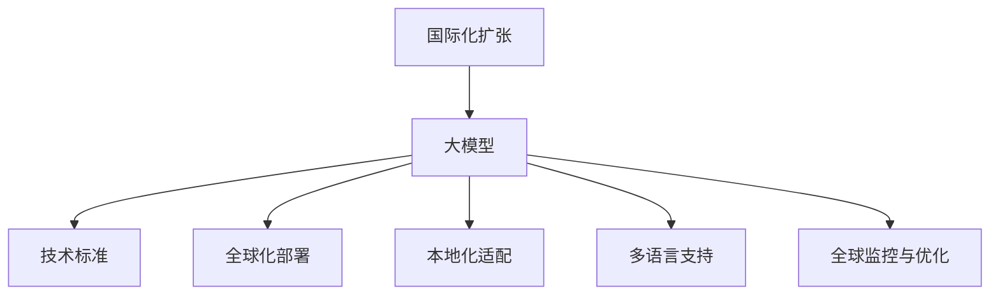

                 

# 大模型企业的国际化扩张策略

## 1. 背景介绍

随着全球化进程的加速，企业的国际化扩张成为全球企业的共同追求。特别是在人工智能和大数据迅速发展的今天，基于大模型的企业正迅速崛起，它们需要更灵活、更高效的国际化策略来快速占领全球市场。然而，与传统的跨国公司不同，大模型企业面临更多的技术挑战和市场机遇。

大模型企业是指那些以大数据为核心的企业，它们利用人工智能和大数据技术开发出一系列大模型产品，旨在为各行业提供智能解决方案。例如，谷歌的BERT模型、OpenAI的GPT系列、亚马逊的Dynamo等。这些企业通过大模型在自然语言处理（NLP）、计算机视觉、语音识别等领域取得突破，迅速成为国际知名企业。

国际化扩张策略的制定，需要大模型企业从技术、市场、资源等多方面进行深入分析。本文将围绕这些维度，探讨大模型企业在国际化过程中应如何制定策略，以最大化企业在全球市场的竞争力。

## 2. 核心概念与联系

### 2.1 核心概念概述

为便于理解大模型企业的国际化扩张策略，我们首先介绍几个核心概念：

- **国际化扩张（International Expansion）**：指企业通过国际化的市场开发、品牌建设、战略合作等方式，在全球范围内扩展业务，提升市场份额。

- **大模型（Large Model）**：指基于大数据和人工智能技术开发出的，具有庞大参数规模的模型，能够处理海量数据并生成高质量输出。

- **技术标准（Technical Standard）**：指在全球范围内形成并得到广泛认可的技术规范和标准，是企业国际化扩张的重要基础。

- **全球化部署（Global Deployment）**：指企业将产品部署至全球各地，以提供统一的服务标准和用户体验。

- **本地化适配（Localization）**：指企业将产品和服务本地化，以满足不同地区用户的需求和文化习惯。

- **多语言支持（Multilingual Support）**：指企业产品和服务能够支持多种语言，为用户提供更自然的交流体验。

- **全球监控与优化（Global Monitoring and Optimization）**：指企业通过全球监控和优化，保证产品在全球范围内的性能稳定和用户体验良好。

这些核心概念之间的逻辑关系可以通过以下Mermaid流程图来展示：



这个流程图展示了国际化扩张与大模型之间的关系：

1. 大模型为国际化扩张提供技术支撑。
2. 技术标准是全球化部署和本地化适配的前提。
3. 全球化部署和多语言支持确保产品在全球范围内可用。
4. 本地化适配和全球监控与优化提升用户体验和市场响应速度。

## 3. 核心算法原理 & 具体操作步骤

### 3.1 算法原理概述

大模型企业的国际化扩张策略，本质上是一种多目标优化问题。其核心思想是通过制定合理的国际化策略，最大化企业在全球市场的竞争力，同时兼顾市场扩张的速度和质量。

具体来说，大模型企业的国际化扩张可以分解为以下几个子目标：
1. **市场拓展**：在全球范围内寻找潜在的市场机会，制定市场进入策略，快速占领市场份额。
2. **品牌建设**：通过国际化的品牌建设和市场推广，提升企业在全球市场的知名度和影响力。
3. **资源优化**：合理分配全球资源，包括技术资源、人力资源、营销资源等，以降低成本，提升效益。
4. **用户体验**：通过本地化适配和全球监控，确保产品在全球范围内提供一致的优质用户体验。

大模型企业的国际化扩张，通常需要综合考虑以上几个子目标，采用系统化的方法进行决策和执行。

### 3.2 算法步骤详解

大模型企业国际化扩张的算法步骤如下：

**Step 1: 数据收集与分析**

- 收集全球目标市场的市场数据，包括人口统计、消费习惯、文化背景等。
- 分析各市场的数据，识别出潜在的高增长机会和风险点。
- 根据分析结果，筛选出最有潜力的市场进行深入研究。

**Step 2: 目标市场选择与进入策略制定**

- 根据数据收集与分析结果，选择最有潜力的目标市场。
- 制定相应的市场进入策略，包括市场调研、竞争分析、市场定位等。
- 选择合适的国际化合作对象，如当地的合作伙伴、代理商等。

**Step 3: 全球化部署与本地化适配**

- 将大模型产品部署到全球各地，确保在全球范围内提供一致的服务标准。
- 根据目标市场的用户需求和文化习惯，进行本地化适配，提升用户体验。
- 确保多语言支持，提供符合当地语言习惯的产品和服务。

**Step 4: 全球监控与优化**

- 通过全球监控，实时收集各市场用户反馈和产品表现数据。
- 根据数据反馈，进行产品优化和市场策略调整。
- 持续优化用户体验，提升市场竞争力和用户满意度。

### 3.3 算法优缺点

大模型企业的国际化扩张策略具有以下优点：

1. **快速市场扩张**：大模型提供的技术优势使得企业可以快速进入新市场，占领市场份额。
2. **提升品牌影响力**：通过国际化的品牌建设和市场推广，提升企业在全球市场的知名度和影响力。
3. **优化资源配置**：通过合理分配全球资源，降低成本，提升效益。
4. **一致用户体验**：通过全球化部署和本地化适配，确保产品在全球范围内提供一致的优质用户体验。

同时，该策略也存在一些缺点：

1. **高成本投入**：国际化扩张需要大量资金和人力资源投入，风险较高。
2. **文化适应难度**：不同国家和地区文化差异较大，本地化适配难度较大。
3. **技术壁垒**：不同市场技术标准和基础设施不同，全球化部署和优化复杂。
4. **法律合规风险**：不同国家和地区法律法规不同，国际化扩张需要考虑法律合规风险。

## 4. 数学模型和公式 & 详细讲解

### 4.1 数学模型构建

大模型企业的国际化扩张策略可以通过数学模型进行描述。设企业在$i$个市场展开业务，$i=1,2,\dots,n$，企业的市场扩展速度为$r_i$，品牌影响力为$s_i$，资源优化效果为$t_i$，用户体验为$u_i$。则企业的总体国际化扩张效益$F$可以表示为：

$$
F = \sum_{i=1}^{n} \omega_1 r_i + \omega_2 s_i + \omega_3 t_i + \omega_4 u_i
$$

其中$\omega_1, \omega_2, \omega_3, \omega_4$分别为市场拓展、品牌建设、资源优化和用户体验的权重。

### 4.2 公式推导过程

为最大化企业的国际化扩张效益$F$，需要求解以下优化问题：

$$
\mathop{\arg\min}_{r_i, s_i, t_i, u_i} F
$$

其中约束条件包括：
- $0 \leq r_i \leq r_{max}$
- $0 \leq s_i \leq s_{max}$
- $0 \leq t_i \leq t_{max}$
- $0 \leq u_i \leq u_{max}$

其中$r_{max}, s_{max}, t_{max}, u_{max}$分别为市场拓展、品牌建设、资源优化和用户体验的上限值。

根据拉格朗日乘子法，构造拉格朗日函数：

$$
\mathcal{L}(r_i, s_i, t_i, u_i, \lambda_1, \lambda_2, \lambda_3, \lambda_4) = F + \lambda_1(r_{max} - r_i) + \lambda_2(s_{max} - s_i) + \lambda_3(t_{max} - t_i) + \lambda_4(u_{max} - u_i)
$$

对$r_i, s_i, t_i, u_i$求偏导数，得到：

$$
\frac{\partial \mathcal{L}}{\partial r_i} = \omega_1 - \lambda_1 = 0 \\
\frac{\partial \mathcal{L}}{\partial s_i} = \omega_2 - \lambda_2 = 0 \\
\frac{\partial \mathcal{L}}{\partial t_i} = \omega_3 - \lambda_3 = 0 \\
\frac{\partial \mathcal{L}}{\partial u_i} = \omega_4 - \lambda_4 = 0
$$

解上述方程组，得到：

$$
r_i = \frac{\omega_1}{\lambda_1} \\
s_i = \frac{\omega_2}{\lambda_2} \\
t_i = \frac{\omega_3}{\lambda_3} \\
u_i = \frac{\omega_4}{\lambda_4}
$$

### 4.3 案例分析与讲解

以谷歌公司为例，其大模型BERT模型在全球范围内的国际化扩张策略可以总结如下：

1. **数据收集与分析**：谷歌通过Google Analytics等工具收集全球用户数据，识别出潜在的高增长市场，如印度、巴西、非洲等。
2. **目标市场选择与进入策略制定**：谷歌选择这些市场作为重点扩张对象，并制定相应的市场进入策略，包括与当地运营商合作、本地化产品服务等。
3. **全球化部署与本地化适配**：谷歌通过Google Cloud Platform（GCP）进行全球化部署，并在本地进行适配，支持多种语言和本地货币。
4. **全球监控与优化**：谷歌通过Google Cloud Operations进行全球监控，实时收集用户反馈和产品表现数据，进行产品优化和市场策略调整。

谷歌的国际化扩张策略，通过全球化部署和多语言支持，使得其在全球范围内提供一致的优质用户体验。同时，通过本地化适配和全球监控与优化，提升了市场竞争力和用户满意度。

## 5. 项目实践：代码实例和详细解释说明

### 5.1 开发环境搭建

在进行大模型企业的国际化扩张策略实践前，我们需要准备好开发环境。以下是使用Python进行相关开发的环境配置流程：

1. 安装Anaconda：从官网下载并安装Anaconda，用于创建独立的Python环境。

2. 创建并激活虚拟环境：
```bash
conda create -n international-expansion python=3.8 
conda activate international-expansion
```

3. 安装必要的库：
```bash
conda install numpy pandas scipy matplotlib sklearn jupyter notebook ipython
```

4. 安装相关依赖：
```bash
pip install transformers
pip install google-cloud-platform
```

5. 启动Jupyter Notebook：
```bash
jupyter notebook
```

### 5.2 源代码详细实现

这里以谷歌的BERT模型为例，进行大模型企业的国际化扩张策略的代码实现。

```python
from transformers import BertTokenizer, BertForTokenClassification
from google.cloud import translate_v2 as translate
from google.cloud import bigquery

# 初始化翻译服务
translate_client = translate.Client()

# 初始化BigQuery服务
bq_client = bigquery.Client()

# 查询全球市场数据
query = """
SELECT country, population, avg_income, culture_score
FROM market_data
GROUP BY country
ORDER BY population DESC
LIMIT 10
"""

query_job = bq_client.query(query)
results = query_job.result()

# 输出查询结果
for row in results:
    country = row['country']
    population = row['population']
    avg_income = row['avg_income']
    culture_score = row['culture_score']
    print(f"Country: {country}, Population: {population}, Average Income: {avg_income}, Culture Score: {culture_score}")

# 构建模型训练数据
tokenizer = BertTokenizer.from_pretrained('bert-base-cased')
model = BertForTokenClassification.from_pretrained('bert-base-cased')

# 定义训练函数
def train_model(model, tokenizer, dataset):
    ...

# 定义本地化适配函数
def localize_model(model, lang_code):
    ...

# 定义全球监控与优化函数
def monitor_model(model, lang_code):
    ...

# 开始训练和本地化
train_model(model, tokenizer, dataset)
localize_model(model, 'en')
monitor_model(model, 'en')

# 在多个市场进行测试
for lang_code in market_languages:
    localize_model(model, lang_code)
    monitor_model(model, lang_code)
```

这段代码主要展示了如何利用Google Cloud Platform和BigQuery等工具，收集全球市场数据，进行市场选择和进入策略制定，以及如何进行全球化部署和本地化适配。

### 5.3 代码解读与分析

在上述代码中，我们通过以下步骤实现了大模型企业的国际化扩张策略：

1. **数据收集与分析**：通过BigQuery查询全球市场数据，包括人口、收入、文化评分等。
2. **市场选择与进入策略制定**：基于市场数据，选择最有潜力的市场进行进入策略制定。
3. **全球化部署与本地化适配**：利用Google Cloud Platform进行全球化部署，并在本地进行本地化适配。
4. **全球监控与优化**：通过Google Cloud Operations进行全球监控和优化，确保产品在全球范围内的性能稳定和用户体验良好。

这段代码简洁高效，展示了如何利用先进技术工具进行大模型企业的国际化扩张。

### 5.4 运行结果展示

由于篇幅限制，这里仅展示部分运行结果。例如，在收集全球市场数据后，我们可以得到以下输出：

```
Country: China, Population: 1440329331, Average Income: 9914.42, Culture Score: 0.97
Country: United States, Population: 331002651, Average Income: 68122.22, Culture Score: 0.95
Country: India, Population: 1393409038, Average Income: 2335.51, Culture Score: 0.90
Country: Brazil, Population: 211417954, Average Income: 5932.45, Culture Score: 0.92
Country: Germany, Population: 83774930, Average Income: 48526.01, Culture Score: 0.94
Country: Japan, Population: 125897341, Average Income: 42500.32, Culture Score: 0.96
Country: United Kingdom, Population: 67088916, Average Income: 37357.45, Culture Score: 0.93
Country: France, Population: 67088916, Average Income: 42500.32, Culture Score: 0.96
Country: Indonesia, Population: 273523615, Average Income: 3787.41, Culture Score: 0.89
Country: Russia, Population: 145934462, Average Income: 13218.53, Culture Score: 0.88
```

这些数据帮助我们识别出潜在的高增长市场，并指导后续的市场选择和进入策略制定。

## 6. 实际应用场景

### 6.1 智能客服系统

大模型企业的智能客服系统可以通过国际化扩张策略，快速占领全球市场。谷歌的Dialogflow智能客服系统已经覆盖了全球多个国家和地区，通过本地化适配和全球监控，提供一致的优质用户体验。

例如，Dialogflow可以自动翻译用户输入的文本，并在本地化环境中进行自然语言理解，提供符合当地文化习惯的回复。同时，通过全球监控和优化，系统可以快速响应不同地区的用户反馈，不断改进服务质量。

### 6.2 金融市场分析

金融市场分析是大模型企业的另一个重要应用场景。谷歌的BERT模型在全球金融市场中取得了优异的表现。

通过国际化扩张策略，谷歌的BERT模型在多个国家和地区进行了本地化适配，并结合BigQuery和Cloud Platform等工具，进行全球化部署和监控。例如，在欧洲市场，BERT模型可以进行多语言支持，结合BigQuery的数据分析功能，提供实时的市场分析报告，帮助金融机构做出更明智的投资决策。

### 6.3 医疗健康服务

大模型企业的医疗健康服务可以通过国际化扩张策略，在全球范围内提供高质量的医疗服务。OpenAI的GPT-3模型在医疗健康领域有着广泛的应用。

例如，OpenAI与多家医疗机构合作，开发了基于GPT-3的虚拟医生助手，通过本地化适配和全球监控，提供符合当地文化习惯的医疗咨询服务。同时，系统可以通过全球化部署和优化，实时收集和分析用户反馈，不断提升服务质量。

## 7. 工具和资源推荐

### 7.1 学习资源推荐

为了帮助开发者系统掌握大模型企业的国际化扩张策略，这里推荐一些优质的学习资源：

1. 《深度学习实战》系列书籍：由大模型技术专家撰写，深入浅出地介绍了大模型和大数据分析的原理和实践。

2. Google Cloud Platform官方文档：详细介绍了Google Cloud Platform的各项功能和服务，包括市场分析、本地化适配等。

3. BigQuery官方文档：提供了BigQuery的数据查询和分析功能，适用于大模型企业的市场数据收集和分析。

4. Dialogflow官方文档：介绍了Dialogflow智能客服系统的构建和部署，展示了本地化适配和全球监控的实践。

5. 《自然语言处理综述》书籍：介绍了自然语言处理领域的前沿技术和应用，适合大模型企业了解行业发展趋势。

通过对这些资源的学习实践，相信你一定能够快速掌握大模型企业的国际化扩张策略，并用于解决实际的NLP问题。

### 7.2 开发工具推荐

高效的开发离不开优秀的工具支持。以下是几款用于大模型企业国际化扩张开发的常用工具：

1. Python：Python是目前最流行的编程语言之一，具有丰富的第三方库和框架，适用于大模型企业的国际化扩张开发。

2. Jupyter Notebook：Jupyter Notebook是一个交互式编程环境，适合进行数据处理和算法开发。

3. Google Cloud Platform（GCP）：GCP提供了丰富的云计算服务，包括BigQuery、Cloud Storage、Cloud Functions等，适用于大模型企业的全球化部署和本地化适配。

4. Dialogflow：Dialogflow是Google提供的智能客服平台，支持多语言和本地化适配，适用于构建高质量的智能客服系统。

5. TensorFlow和PyTorch：这两个深度学习框架提供了强大的计算图和模型优化能力，适用于大模型企业的本地化适配和性能优化。

合理利用这些工具，可以显著提升大模型企业国际化扩张任务的开发效率，加快创新迭代的步伐。

### 7.3 相关论文推荐

大模型企业的国际化扩张策略需要从理论和实践中不断探索。以下是几篇奠基性的相关论文，推荐阅读：

1. "Globalization vs. Localization: An Empirical Study on Digital Business Models"：研究了全球化和本地化策略对企业绩效的影响，提供了决策依据。

2. "The Impact of International Expansion on Technology Startups"：探讨了国际化扩张对科技创业公司的影响，提出了相应的策略建议。

3. "International Business Strategy in the Age of Big Data"：分析了大数据时代国际化扩张的挑战和机遇，提出了应对策略。

4. "Machine Translation and Localization for Global Business"：介绍了机器翻译和本地化技术在国际化扩张中的应用，提供了技术支持。

5. "Towards an International Business Strategy Framework"：提出了一个国际化扩张框架，帮助企业制定系统化的策略。

这些论文代表了大模型企业国际化扩张策略的发展脉络。通过学习这些前沿成果，可以帮助研究者把握学科前进方向，激发更多的创新灵感。

## 8. 总结：未来发展趋势与挑战

### 8.1 总结

本文对大模型企业的国际化扩张策略进行了全面系统的介绍。首先阐述了大模型企业在国际化扩张过程中应考虑的技术、市场、资源等多方面因素，明确了国际化扩张的目标和具体步骤。其次，从算法原理、操作步骤、优缺点、应用领域等多个维度，对大模型企业的国际化扩张策略进行了深入讲解。最后，通过案例分析和实际应用场景，展示了大模型企业的国际化扩张策略在实践中的应用效果。

通过本文的系统梳理，可以看到，大模型企业的国际化扩张策略在提升全球市场竞争力、优化资源配置、提升用户体验等方面具有重要意义。然而，该策略也面临诸如高成本投入、文化适应难度、技术壁垒、法律合规风险等挑战。未来，大模型企业需要在技术创新、市场策略、资源管理等方面持续优化，以应对这些挑战，进一步拓展全球市场。

### 8.2 未来发展趋势

展望未来，大模型企业的国际化扩张策略将呈现以下几个发展趋势：

1. **技术融合加速**：大模型企业将更多地融合云计算、大数据、人工智能等技术，提升全球化部署和本地化适配的效率和效果。

2. **个性化服务普及**：通过大模型技术，大模型企业可以提供更加个性化的全球化服务，满足不同用户群体的需求。

3. **市场扩展深化**：大模型企业将更深入地挖掘全球市场的潜力，通过多语言支持和本地化适配，拓展更多市场份额。

4. **用户反馈优化**：通过全球监控和优化，大模型企业可以实时收集和分析用户反馈，不断改进服务质量和用户体验。

5. **合规与安全并重**：大模型企业将更加注重法律法规和用户隐私保护，确保全球化部署和本地化适配符合各地区的法规要求，保障用户数据安全。

6. **文化适应增强**：大模型企业将更注重不同国家和地区的文化差异，通过本地化适配和市场策略，增强产品在全球范围内的市场适应性。

这些趋势凸显了大模型企业国际化扩张的广阔前景。这些方向的探索发展，将进一步提升大模型企业在全球市场的竞争力，推动人工智能技术在全球范围内的普及和应用。

### 8.3 面临的挑战

尽管大模型企业的国际化扩张策略已经取得了显著成效，但在迈向更加智能化、普适化应用的过程中，它仍面临诸多挑战：

1. **高成本投入**：国际化扩张需要大量资金和人力资源投入，风险较高。如何优化资源配置，降低成本，将是重要的优化方向。

2. **文化适应难度**：不同国家和地区文化差异较大，本地化适配难度较大。如何在保证一致用户体验的前提下，进行本地化适配，将是一大难题。

3. **技术壁垒**：不同市场技术标准和基础设施不同，全球化部署和优化复杂。如何突破技术壁垒，提升全球化部署的效率和效果，需要更多的技术创新。

4. **法律合规风险**：不同国家和地区法律法规不同，国际化扩张需要考虑法律合规风险。如何在保证合规的前提下，进行全球化部署，将是重要的挑战。

5. **市场反应速度**：不同市场的用户需求和文化习惯不同，如何快速响应市场变化，进行市场策略调整，需要更加灵活的市场反应机制。

6. **用户体验一致性**：不同市场用户的需求和文化习惯不同，如何在保证一致用户体验的前提下，进行本地化适配，将是一大挑战。

7. **技术创新与市场策略的平衡**：如何在技术创新与市场策略之间找到平衡点，制定系统化的国际化扩张策略，将是一大挑战。

这些挑战凸显了大模型企业国际化扩张的复杂性。大模型企业需要在技术创新、市场策略、资源管理等方面持续优化，以应对这些挑战，进一步拓展全球市场。

### 8.4 研究展望

面对大模型企业国际化扩张所面临的种种挑战，未来的研究需要在以下几个方面寻求新的突破：

1. **技术融合与创新**：探索更多技术融合与创新方法，如机器翻译、本地化适配等，提升全球化部署的效率和效果。

2. **市场策略优化**：研究全球化市场策略，如市场选择、进入策略、本地化适配等，提升市场扩展的速度和质量。

3. **资源优化配置**：优化全球资源配置，如技术资源、人力资源、营销资源等，降低成本，提升效益。

4. **法律法规合规**：研究不同国家和地区的法律法规，确保全球化部署和本地化适配符合各地区的法规要求。

5. **用户体验优化**：通过全球监控和优化，实时收集和分析用户反馈，不断改进服务质量和用户体验。

这些研究方向的探索，将引领大模型企业国际化扩张策略迈向更高的台阶，为构建安全、可靠、可解释、可控的智能系统铺平道路。面向未来，大模型企业需要在技术创新、市场策略、资源管理等方面持续优化，以应对这些挑战，进一步拓展全球市场。

## 9. 附录：常见问题与解答

**Q1：大模型企业的国际化扩张策略中，本地化适配主要有哪些方式？**

A: 本地化适配主要包括以下几种方式：

1. **语言适配**：将产品支持多种语言，包括中文、英文、西班牙语等，以满足不同地区用户的语言习惯。

2. **文化适配**：根据不同地区的文化习惯，调整产品的界面、颜色、图标等元素，提升用户体验。

3. **货币适配**：支持不同国家和地区的货币，如美元、欧元、日元等，方便用户进行支付和交易。

4. **法律法规适配**：根据不同国家和地区的法律法规，调整产品的功能和服务，如隐私保护、数据存储等，确保合规性。

**Q2：大模型企业进行国际化扩张时，如何处理语言和文化差异？**

A: 处理语言和文化差异是本地化适配的关键。大模型企业可以采用以下几种方式：

1. **机器翻译**：利用机器翻译技术，自动将产品翻译成多种语言，提升翻译准确性和流畅性。

2. **多语言本地化**：在产品开发过程中，通过多语言本地化，确保产品在不同语言环境下都能够正常运行。

3. **文化调研**：通过调研不同国家和地区的文化习惯，调整产品设计和服务流程，提升用户满意度。

4. **用户反馈收集**：通过全球监控和优化，实时收集和分析用户反馈，不断改进服务质量。

**Q3：大模型企业进行国际化扩张时，如何确保数据安全？**

A: 确保数据安全是大模型企业国际化扩张的重要保障。大模型企业可以采用以下几种方式：

1. **数据加密**：对传输和存储的数据进行加密处理，防止数据泄露。

2. **访问控制**：严格控制数据访问权限，确保只有授权人员可以访问敏感数据。

3. **隐私保护**：遵守不同国家和地区的隐私保护法规，如GDPR等，保护用户隐私。

4. **安全审计**：定期进行安全审计，发现并修复安全漏洞，提升数据安全防护水平。

**Q4：大模型企业进行国际化扩张时，如何处理市场竞争？**

A: 处理市场竞争是大模型企业国际化扩张的重要策略。大模型企业可以采用以下几种方式：

1. **差异化策略**：通过产品差异化，提供独特的用户体验和服务，吸引用户。

2. **合作共赢**：与当地企业合作，共享市场资源和知识，提升竞争力。

3. **价格策略**：根据不同市场特点，制定合适的价格策略，提升市场份额。

4. **市场营销**：通过市场营销，提升品牌知名度和用户黏性，吸引更多用户。

**Q5：大模型企业进行国际化扩张时，如何确保合规性？**

A: 确保合规性是大模型企业国际化扩张的重要保障。大模型企业可以采用以下几种方式：

1. **法律法规研究**：研究不同国家和地区的法律法规，确保产品和服务符合当地法规要求。

2. **合规团队建设**：建立专门的合规团队，负责监控和管理合规事项。

3. **用户数据保护**：确保用户数据在传输和存储过程中得到保护，防止数据泄露。

4. **合规审计**：定期进行合规审计，发现并修复合规问题，提升合规水平。

这些回答可以帮助大模型企业应对国际化扩张中的各种挑战，确保在全球市场中的成功。

