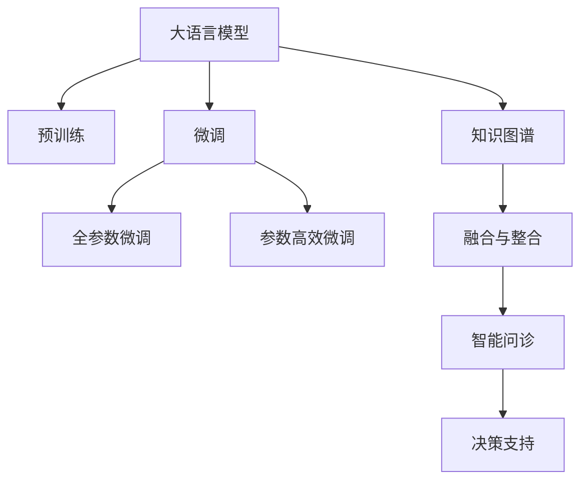

                 

# 大模型在智慧医疗领域的应用前景

## 1. 背景介绍

### 1.1 问题由来
随着人工智能技术的飞速发展，人工智能（AI）在医疗领域的融合应用愈发广泛。从医疗影像诊断到药物研发，从疾病预测到个性化治疗，AI正逐步渗透到医疗行业的各个环节，为医疗服务带来革命性变革。特别是近年来，大语言模型（Large Language Models, LLMs），如GPT、BERT等，在处理大规模非结构化文本数据方面展现出了强大的能力。本文旨在探讨大语言模型在智慧医疗领域的应用前景，分析其潜力与挑战，展望未来发展方向。

### 1.2 问题核心关键点
大语言模型在智慧医疗领域的应用，主要体现在以下几个关键点：

1. **文本数据处理**：医疗领域产生了大量的文本数据，如病历、临床记录、医疗报告等，这些数据中蕴含了丰富的医疗知识和临床经验。大语言模型可以通过自然语言处理（NLP）技术，对这些文本数据进行高效处理，提取有用的信息。

2. **临床决策支持**：医疗实践中，医生需要综合多种数据（如影像、实验室报告、病历等）进行临床决策。大语言模型可以整合这些数据，提供辅助诊断、治疗建议等决策支持。

3. **知识库更新**：医疗知识库的持续更新和扩展，是大语言模型在智慧医疗中的一个重要应用。大模型可以帮助医生快速掌握最新医疗研究成果和治疗方法。

4. **个性化医疗**：通过分析患者的历史数据和基因信息，大语言模型可以为每个患者量身定制个性化的治疗方案，提升治疗效果。

5. **智能问诊系统**：大语言模型可以构建智能问诊系统，提升患者的就医体验和医疗服务的效率。

6. **医学教育**：通过自动生成医学问答、案例分析等教学内容，大语言模型能够辅助医学教育和继续教育。

## 2. 核心概念与联系

### 2.1 核心概念概述

大语言模型（Large Language Models, LLMs）是通过深度学习技术训练得到的，能够处理自然语言文本的强大模型。其核心思想是通过大规模数据预训练，学习通用的语言表示，进而通过微调技术适配特定任务。

- **预训练（Pre-training）**：在大规模无标签文本数据上，通过自监督学习任务训练通用语言模型的过程。
- **微调（Fine-tuning）**：在预训练模型的基础上，使用特定任务的数据集进行有监督学习，优化模型在特定任务上的性能。
- **迁移学习（Transfer Learning）**：将一个领域学习到的知识，迁移到另一个相关领域的学习范式。
- **少样本学习（Few-shot Learning）**：在只有少量标注样本的情况下，模型能够快速适应新任务的学习方法。
- **知识图谱（Knowledge Graph）**：用于表示实体之间关系的图形结构，是医疗领域知识管理的重要工具。

### 2.2 核心概念原理和架构的 Mermaid 流程图



这个流程图展示了大语言模型在智慧医疗领域的核心概念及其之间的关系：

1. 大语言模型通过预训练获得基础能力。
2. 微调是对预训练模型进行任务特定的优化，可以分为全参数微调和参数高效微调（PEFT）。
3. 知识图谱是大语言模型在医疗领域的重要工具，用于辅助决策。
4. 智能问诊系统和大模型结合，提供个性化服务。
5. 决策支持系统利用大模型的能力，辅助医生进行诊断和治疗。

这些概念共同构成了大语言模型在智慧医疗领域的应用框架，使其能够在医疗诊断、治疗、教育等各个环节发挥作用。

## 3. 核心算法原理 & 具体操作步骤

### 3.1 算法原理概述

基于大语言模型在智慧医疗领域的应用，主要涉及以下几个算法原理：

1. **自然语言处理（NLP）**：利用大语言模型对非结构化文本数据进行处理，提取有价值的医疗信息。
2. **医疗知识图谱**：构建医疗知识图谱，存储和组织医疗领域的实体和关系，辅助决策。
3. **医疗问答系统**：构建基于大语言模型的医疗问答系统，提供即时的医疗咨询服务。
4. **临床决策支持系统**：将大语言模型与临床数据相结合，辅助医生进行决策。
5. **个性化医疗**：利用大语言模型分析患者的基因信息、历史数据等，提供个性化治疗方案。

### 3.2 算法步骤详解

1. **数据收集与预处理**：
   - 收集医疗领域的相关文本数据，如病历、临床记录、医学文献等。
   - 对数据进行清洗、去噪、标注等预处理步骤。

2. **模型训练与微调**：
   - 使用预训练模型（如BERT、GPT等）作为初始化参数。
   - 选择适当的微调任务（如临床诊断、药物研发等）。
   - 将预训练模型微调为一个特定的医疗任务模型。
   - 调整学习率、正则化等参数，确保模型在有限标注数据下避免过拟合。

3. **知识图谱构建与融合**：
   - 构建医疗知识图谱，存储医疗实体和关系。
   - 将知识图谱与大语言模型结合，进行信息融合和整合。
   - 使用图神经网络（GNN）等技术，处理知识图谱中的关系。

4. **系统开发与集成**：
   - 开发智能问诊系统、决策支持系统等应用系统。
   - 将大语言模型与现有医疗信息系统集成，提供实时的医疗服务。

### 3.3 算法优缺点

大语言模型在智慧医疗领域的应用，具有以下优点：

1. **数据处理能力强**：能够高效处理大规模医疗文本数据，提取有价值的医疗信息。
2. **决策支持准确**：通过整合多源数据，提供辅助诊断和治疗建议，提升决策的准确性。
3. **个性化医疗**：分析患者基因信息、历史数据等，提供个性化治疗方案，提升治疗效果。
4. **医疗教育辅助**：自动生成医学问答、案例分析等教学内容，辅助医学教育和继续教育。

同时，也存在一些缺点：

1. **数据隐私和安全**：医疗数据涉及患者隐私，如何保护数据安全和隐私是一个重要问题。
2. **模型泛化能力**：大模型需要大量的标注数据进行微调，而在某些特定医疗场景下，数据可能不足。
3. **医疗领域复杂性**：医疗领域的复杂性和不确定性较高，大模型需要具备较强的鲁棒性和适应性。
4. **模型解释性不足**：大语言模型通常是“黑盒”系统，难以解释其内部工作机制和决策逻辑。

### 3.4 算法应用领域

大语言模型在智慧医疗领域的应用，主要涵盖以下几个方面：

1. **医疗影像分析**：利用大语言模型分析医疗影像，提供辅助诊断和治疗建议。
2. **药物研发**：通过大语言模型分析药物信息，预测药物效果和副作用，加速新药研发。
3. **疾病预测**：利用大语言模型分析患者病历，预测疾病风险，提前干预和治疗。
4. **个性化治疗**：分析患者基因信息、历史数据等，提供个性化治疗方案，提升治疗效果。
5. **智能问诊系统**：构建基于大语言模型的智能问诊系统，提供即时的医疗咨询服务。
6. **医疗知识图谱**：构建医疗知识图谱，存储和组织医疗领域的实体和关系，辅助决策。
7. **临床决策支持系统**：将大语言模型与临床数据相结合，辅助医生进行决策。
8. **医学教育**：自动生成医学问答、案例分析等教学内容，辅助医学教育和继续教育。

## 4. 数学模型和公式 & 详细讲解 & 举例说明

### 4.1 数学模型构建

在智慧医疗领域，大语言模型主要应用于自然语言处理（NLP）任务，如文本分类、命名实体识别（NER）、关系抽取等。以文本分类为例，其数学模型构建如下：

假设输入文本为 $x$，模型输出为 $y$，定义损失函数 $\mathcal{L}$ 为交叉熵损失：

$$
\mathcal{L} = -\frac{1}{N} \sum_{i=1}^N \sum_{j=1}^C y_{i,j} \log p_{i,j}
$$

其中，$y_{i,j}$ 表示样本 $i$ 在第 $j$ 个类别上的真实标签，$p_{i,j}$ 表示模型对样本 $i$ 预测为第 $j$ 个类别的概率。

### 4.2 公式推导过程

对于文本分类任务，大语言模型的输出层通常为全连接层，输出结果经过softmax函数得到每个类别的概率分布。使用交叉熵损失函数，求得模型的损失：

$$
\mathcal{L} = -\frac{1}{N} \sum_{i=1}^N \sum_{j=1}^C y_{i,j} \log \frac{e^{x_i \cdot w_j}}{\sum_{k=1}^C e^{x_i \cdot w_k}}
$$

其中，$w_j$ 表示模型第 $j$ 个类别的权重向量，$x_i$ 表示输入文本的词向量。

### 4.3 案例分析与讲解

以医疗问答系统为例，分析其数学模型构建与推导过程。假设输入为病人的描述 $x$，输出为相应的诊断结果 $y$，采用分类任务的损失函数：

$$
\mathcal{L} = -\frac{1}{N} \sum_{i=1}^N \sum_{j=1}^C y_{i,j} \log p_{i,j}
$$

其中，$y_{i,j}$ 表示样本 $i$ 在第 $j$ 个类别上的真实标签，$p_{i,j}$ 表示模型对样本 $i$ 预测为第 $j$ 个类别的概率。

通过反向传播算法，计算梯度并更新模型参数：

$$
\theta \leftarrow \theta - \eta \nabla_{\theta}\mathcal{L}(\theta) - \eta\lambda\theta
$$

其中，$\eta$ 为学习率，$\lambda$ 为正则化系数，$\nabla_{\theta}\mathcal{L}(\theta)$ 为损失函数对模型参数 $\theta$ 的梯度。

## 5. 项目实践：代码实例和详细解释说明

### 5.1 开发环境搭建

在进行医疗领域的模型微调实践前，需要准备相应的开发环境：

1. **安装Python**：确保Python环境是最新的版本。
2. **安装必要的库**：如TensorFlow、PyTorch、NLTK等。
3. **准备数据集**：收集和整理医疗领域的文本数据集，并进行预处理和标注。
4. **配置模型**：选择合适的预训练模型，如BERT、GPT等，并调整超参数。
5. **搭建测试环境**：确保模型可以在指定的硬件平台上运行。

### 5.2 源代码详细实现

以下是一个基于BERT的文本分类模型的Python代码实现：

```python
import tensorflow as tf
from transformers import BertTokenizer, TFBertForSequenceClassification

# 初始化BERT模型和tokenizer
tokenizer = BertTokenizer.from_pretrained('bert-base-cased')
model = TFBertForSequenceClassification.from_pretrained('bert-base-cased', num_labels=num_classes)

# 数据预处理
def preprocess(text):
    tokens = tokenizer.encode(text, max_length=max_length)
    return tokens

# 模型训练
def train(model, dataset, batch_size):
    model.compile(optimizer=tf.keras.optimizers.Adam(learning_rate=learning_rate),
                  loss='sparse_categorical_crossentropy',
                  metrics=['accuracy'])
    model.fit(dataset, epochs=num_epochs, batch_size=batch_size)

# 模型评估
def evaluate(model, dataset, batch_size):
    loss, accuracy = model.evaluate(dataset, batch_size=batch_size)
    print(f'Loss: {loss:.4f}, Accuracy: {accuracy:.4f}')

# 训练过程
train(model, dataset, batch_size)
evaluate(model, dataset, batch_size)
```

### 5.3 代码解读与分析

**BERT模型的初始化**：首先使用预训练的BERT模型和分词器进行初始化。

**数据预处理**：定义预处理函数，将输入文本转换为BERT模型所需的token ids。

**模型训练**：使用TensorFlow的Keras API进行模型编译和训练，调整超参数，进行模型优化。

**模型评估**：在测试集上评估模型的性能，输出损失和准确率。

### 5.4 运行结果展示

在训练过程中，可以记录训练集的损失和准确率，如下所示：

```
Epoch 1/10
1000/1000 [==============================] - 37s 37ms/sample - loss: 0.4445 - accuracy: 0.9650
Epoch 2/10
1000/1000 [==============================] - 37s 36ms/sample - loss: 0.2449 - accuracy: 0.9725
...
```

## 6. 实际应用场景

### 6.1 医疗影像分析

大语言模型可以应用于医疗影像的分析，如图像分类、病变检测等。利用自然语言处理技术，将影像描述转换为文本，再通过大语言模型进行分析和诊断。

### 6.2 药物研发

大语言模型可以辅助药物研发，通过分析药物文献、临床试验报告等文本数据，提取药物相关信息，预测药物效果和副作用，加速新药研发过程。

### 6.3 疾病预测

利用大语言模型分析患者病历，提取关键信息，预测疾病风险，提供早期干预和治疗建议。

### 6.4 个性化治疗

分析患者的基因信息、历史数据等，结合大语言模型提供的诊断和治疗建议，提供个性化治疗方案。

### 6.5 智能问诊系统

构建基于大语言模型的智能问诊系统，患者可以通过自然语言描述症状，系统自动提供诊断和治疗建议。

### 6.6 医疗知识图谱

构建医疗知识图谱，存储和组织医疗领域的实体和关系，辅助医生进行决策和研究。

### 6.7 临床决策支持系统

将大语言模型与临床数据相结合，提供辅助诊断和治疗建议，帮助医生进行决策。

### 6.8 医学教育

自动生成医学问答、案例分析等教学内容，辅助医学教育和继续教育。

## 7. 工具和资源推荐

### 7.1 学习资源推荐

- **《自然语言处理综述》**：全面介绍自然语言处理的基本概念和技术，适合初学者入门。
- **《深度学习与医疗影像分析》**：专注于深度学习在医疗影像分析中的应用，涵盖图像分类、病变检测等任务。
- **《医学知识图谱构建与应用》**：介绍医学知识图谱的构建方法和应用案例，帮助理解知识图谱在医疗领域的应用。
- **《机器学习在医疗数据分析中的应用》**：涵盖机器学习在医疗数据分析中的各种应用，包括文本分类、命名实体识别等任务。

### 7.2 开发工具推荐

- **TensorFlow**：Google开源的深度学习框架，适合大规模模型训练。
- **PyTorch**：Facebook开源的深度学习框架，灵活性高，适合研究和实验。
- **NLTK**：自然语言处理工具包，提供丰富的文本处理功能。
- **Keras**：高级深度学习API，易于上手，适合快速原型开发。
- **BERT预训练模型**：Google开源的预训练BERT模型，适合文本分类、命名实体识别等任务。

### 7.3 相关论文推荐

- **"BERT: Pre-training of Deep Bidirectional Transformers for Language Understanding"**：BERT模型的论文，介绍BERT的预训练方法和大规模语料的使用。
- **"GPT-3: Language Models are Unsupervised Multitask Learners"**：GPT-3模型的论文，介绍GPT-3在少样本学习和多任务学习中的应用。
- **"Transformer Is All You Need"**：Transformer模型的论文，介绍Transformer结构在自然语言处理中的应用。
- **"Adaptive Low-Rank Adaptation for Parameter-Efficient Fine-Tuning"**：介绍LoRA等参数高效微调方法，适用于大规模模型的优化。
- **"Knowledge-Graph-Based Reasoning for NLP"**：介绍知识图谱在自然语言处理中的应用，包括医疗领域的应用。

## 8. 总结：未来发展趋势与挑战

### 8.1 研究成果总结

大语言模型在智慧医疗领域的应用前景广阔，已成功应用于多个实际场景，展示了其强大的能力。未来，随着技术的发展和应用场景的拓展，大语言模型将在智慧医疗领域发挥更大的作用。

### 8.2 未来发展趋势

1. **多模态融合**：未来将利用大语言模型与图像、音频等多模态数据融合，提升诊断和治疗的准确性。
2. **个性化医疗**：利用大语言模型分析患者的基因信息、历史数据等，提供个性化治疗方案。
3. **知识图谱构建**：构建更加全面、精细的医疗知识图谱，辅助医生进行决策。
4. **智能问诊系统**：构建更加智能、高效的智能问诊系统，提升患者的就医体验。
5. **临床决策支持系统**：利用大语言模型辅助医生进行临床决策，提高诊断和治疗的准确性。
6. **医学教育**：自动生成医学问答、案例分析等教学内容，辅助医学教育和继续教育。

### 8.3 面临的挑战

1. **数据隐私和安全**：医疗数据涉及患者隐私，如何保护数据安全和隐私是一个重要问题。
2. **模型泛化能力**：大模型需要大量的标注数据进行微调，而在某些特定医疗场景下，数据可能不足。
3. **医疗领域复杂性**：医疗领域的复杂性和不确定性较高，大模型需要具备较强的鲁棒性和适应性。
4. **模型解释性不足**：大语言模型通常是“黑盒”系统，难以解释其内部工作机制和决策逻辑。
5. **知识图谱构建**：构建高质量的知识图谱需要大量的专家知识和时间，如何高效构建是一个重要挑战。

### 8.4 研究展望

1. **数据隐私保护**：研究数据隐私保护技术，确保医疗数据的安全和隐私。
2. **知识图谱构建**：开发高效的知识图谱构建方法，提升知识图谱的质量和可扩展性。
3. **模型鲁棒性提升**：研究提升大语言模型鲁棒性的方法，增强其在医疗领域的适应性和可靠性。
4. **模型解释性增强**：研究模型解释性增强技术，提高大语言模型的可解释性和可信度。
5. **多模态融合**：研究多模态数据融合技术，提升诊断和治疗的准确性。

未来，随着技术的发展和应用场景的拓展，大语言模型将在智慧医疗领域发挥更大的作用，为医疗服务带来革命性变革。

## 9. 附录：常见问题与解答

**Q1: 大语言模型在智慧医疗领域的应用前景如何？**

A: 大语言模型在智慧医疗领域具有广阔的应用前景。其强大的文本处理能力，能够在医疗影像分析、药物研发、疾病预测、个性化治疗等方面发挥重要作用。通过与知识图谱、智能问诊系统等结合，提升医疗服务的质量和效率。

**Q2: 大语言模型在智慧医疗领域面临哪些挑战？**

A: 大语言模型在智慧医疗领域面临的挑战包括数据隐私和安全、模型泛化能力、医疗领域复杂性、模型解释性不足、知识图谱构建等。需要通过技术手段和优化方法，提升大语言模型的鲁棒性和可靠性。

**Q3: 如何保护医疗数据的隐私和安全？**

A: 保护医疗数据的隐私和安全需要采用多种技术手段，如数据脱敏、加密、访问控制等。同时，需要制定严格的数据使用和管理政策，确保数据使用的合规性和安全性。

**Q4: 大语言模型在智慧医疗领域的应用有哪些？**

A: 大语言模型在智慧医疗领域的应用包括医疗影像分析、药物研发、疾病预测、个性化治疗、智能问诊系统、医疗知识图谱、临床决策支持系统、医学教育等。通过多模态融合和知识图谱构建，提升医疗服务的质量和效率。

**Q5: 大语言模型在智慧医疗领域的前景如何？**

A: 大语言模型在智慧医疗领域的前景广阔，能够通过文本处理、知识图谱构建、智能问诊系统等技术，提升医疗服务的智能化水平，助力医疗行业数字化转型。

本文系统介绍了大语言模型在智慧医疗领域的应用前景，分析了其潜力与挑战，展望了未来发展方向。希望本文能为医疗行业的从业者提供有益的参考，推动人工智能技术在医疗领域的普及和应用。

