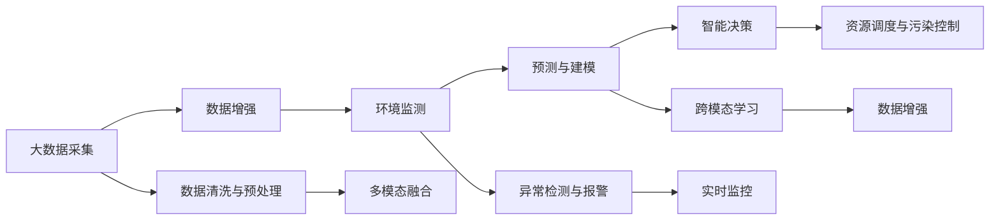

                 

# 大模型在智能环保中的应用前景

## 1. 背景介绍

随着全球气候变化和环境污染问题日益严峻，智能环保成为各国政府和企业的共同追求。智能环保系统通过大数据、物联网、人工智能等技术手段，对环境数据进行实时监测、分析和预测，实现智能化的环境治理和资源管理。其中，大模型作为关键技术手段之一，通过深度学习与海量数据结合，提取环境数据的深层次特征，推动智能环保进入新的发展阶段。

本文将系统性地介绍大模型在智能环保中的主要应用场景，以及相应的技术原理和实践方法，并展望未来可能的发展趋势。

## 2. 核心概念与联系

### 2.1 核心概念概述

在智能环保中，大模型主要应用于以下几个核心概念：

1. **大模型(Large Model)**：指具有亿级参数规模的深度神经网络模型，如BERT、GPT、XLNet等。大模型通过预训练学习海量数据中的通用知识，在特定任务上进行微调，能够提取复杂的环境特征，实现精确的环境监测和预测。

2. **环境监测与预测**：通过传感器、遥感影像、GPS定位等手段，收集环境数据，如水质、气温、噪音、PM2.5等，利用大模型进行实时监测和预测，及时发现和响应环境问题。

3. **智能决策与调度**：利用大模型进行环境数据的深度学习与分析，辅助决策者进行资源配置、污染控制、灾害预警等智能决策。

4. **数据增强与生成**：通过大模型进行数据增强与生成，丰富训练数据集，提升模型的泛化能力和鲁棒性。

5. **跨模态学习**：将视觉、声音、文本等多模态数据融合，进行综合分析与预测，提升环境数据的识别精度和处理能力。

### 2.2 核心概念原理和架构的 Mermaid 流程图



这个流程图展示了从数据采集到智能决策的全流程。

## 3. 核心算法原理 & 具体操作步骤

### 3.1 算法原理概述

大模型在智能环保中的应用主要基于监督学习和无监督学习的混合模型，通过深度学习算法，结合海量环境数据，实现环境的监测与预测、智能决策与调度。

- **监督学习**：通过标注数据训练大模型，使其能够对新的环境数据进行预测和分类。
- **无监督学习**：利用大模型进行数据降维、特征提取，发现环境数据中的潜在规律与异常。

### 3.2 算法步骤详解

#### 3.2.1 数据准备与预处理

1. **数据收集**：利用传感器、卫星遥感、互联网等手段，收集环境数据，如水质、噪音、PM2.5等。
2. **数据清洗**：对采集到的数据进行去重、缺失值处理、异常值检测等，确保数据质量。
3. **数据增强**：通过数据增强技术，丰富训练数据集，提升模型的泛化能力。

#### 3.2.2 模型训练与优化

1. **模型选择**：选择合适的预训练模型，如BERT、GPT等，进行环境监测与预测任务。
2. **模型微调**：在大规模标注数据上进行微调，优化模型参数，提高预测精度。
3. **模型评估**：利用测试集评估模型性能，调整超参数，确保模型效果。

#### 3.2.3 模型应用与推理

1. **实时监测与预测**：将训练好的模型应用到实时数据中，进行环境监测与预测。
2. **智能决策与调度**：结合环境预测结果，进行智能决策与资源调度。

### 3.3 算法优缺点

#### 3.3.1 优点

1. **精度高**：大模型通过预训练学习海量数据中的通用知识，微调后能够提取复杂的环境特征，实现高精度的环境监测与预测。
2. **泛化能力强**：大模型能够处理多模态数据，提升模型的泛化能力和鲁棒性。
3. **实时性强**：大模型能够实时处理海量数据，实现实时监测与预测。

#### 3.3.2 缺点

1. **训练数据需求高**：大模型的训练需要海量标注数据，对数据需求量高。
2. **计算资源消耗大**：大模型参数规模大，训练和推理资源消耗大。
3. **模型复杂度高**：大模型结构复杂，优化困难。

### 3.4 算法应用领域

大模型在智能环保中的应用领域非常广泛，主要包括以下几个方面：

1. **水质监测与预测**：利用大模型进行水质监测与预测，及时发现水质异常。
2. **噪音监测与控制**：利用大模型进行噪音监测与预测，进行噪音控制与治理。
3. **空气质量监测与预警**：利用大模型进行空气质量监测与预警，及时响应空气污染事件。
4. **生态监测与保护**：利用大模型进行生态监测与保护，进行森林防火、生物多样性保护等。
5. **资源配置与调度**：利用大模型进行资源配置与调度，优化资源使用效率。

## 4. 数学模型和公式 & 详细讲解 & 举例说明

### 4.1 数学模型构建

#### 4.1.1 监督学习模型

假设环境监测数据为 $\{x_i, y_i\}_{i=1}^N$，其中 $x_i$ 为环境监测数据， $y_i$ 为环境监测结果。

使用监督学习模型进行预测，模型参数为 $\theta$，预测函数为 $f_\theta(x)$。

损失函数为：

$$
L(\theta) = \frac{1}{N} \sum_{i=1}^N \ell(f_\theta(x_i), y_i)
$$

其中 $\ell$ 为损失函数，如均方误差（MSE）或交叉熵（CE）。

#### 4.1.2 无监督学习模型

无监督学习模型主要应用于数据降维和特征提取。

假设环境数据集为 $\{x_i\}_{i=1}^N$，模型参数为 $\theta$，使用自编码器进行降维与特征提取。

降维后的数据为 $\hat{x}_i = g_\theta(x_i)$，其中 $g_\theta(x_i)$ 为编码器，$f_\theta(x_i)$ 为解码器。

降维后的损失函数为：

$$
L(\theta) = \frac{1}{N} \sum_{i=1}^N \|x_i - f_\theta(\hat{x}_i)\|
$$

其中 $\|.\|$ 为范数，如欧式范数。

### 4.2 公式推导过程

#### 4.2.1 监督学习公式推导

监督学习模型预测函数为：

$$
f_\theta(x) = Wx + b
$$

其中 $W$ 为权重矩阵，$b$ 为偏置向量。

损失函数为交叉熵：

$$
L(\theta) = -\frac{1}{N} \sum_{i=1}^N y_i \log f_\theta(x_i) + (1-y_i) \log (1-f_\theta(x_i))
$$

使用随机梯度下降（SGD）更新参数 $\theta$：

$$
\theta \leftarrow \theta - \eta \nabla_\theta L(\theta)
$$

其中 $\eta$ 为学习率。

#### 4.2.2 无监督学习公式推导

无监督学习模型使用自编码器，编码器与解码器均为神经网络，可以表示为：

$$
g_\theta(x) = \sigma(W_g x + b_g)
$$

$$
f_\theta(x) = \sigma(W_f g_\theta(x) + b_f)
$$

其中 $\sigma$ 为激活函数，如ReLU或Sigmoid。

降维后的损失函数为：

$$
L(\theta) = \frac{1}{N} \sum_{i=1}^N \|x_i - f_\theta(g_\theta(x_i))\|
$$

使用随机梯度下降更新参数 $\theta$：

$$
\theta \leftarrow \theta - \eta \nabla_\theta L(\theta)
$$

### 4.3 案例分析与讲解

以水质监测为例，大模型可以用于构建实时水质监测系统。

假设水质监测数据为 $\{x_i\}_{i=1}^N$，其中 $x_i$ 包含pH值、溶解氧、浊度等水质参数。

1. **数据收集与预处理**：通过传感器采集水质数据，并进行数据清洗与预处理。
2. **模型训练**：使用大模型进行监督学习，训练预测函数 $f_\theta(x)$。
3. **模型应用**：将训练好的模型应用到实时水质数据中，进行水质监测与预测。

## 5. 项目实践：代码实例和详细解释说明

### 5.1 开发环境搭建

1. **环境安装**：安装Python 3.7以上版本，安装TensorFlow、Keras等深度学习框架。
2. **数据准备**：收集水质数据，并进行数据清洗与预处理。
3. **模型选择**：选择BERT或GPT模型，进行环境监测与预测任务。

### 5.2 源代码详细实现

以水质监测为例，使用Keras实现大模型预测函数：

```python
from keras.models import Sequential
from keras.layers import Dense
from keras.optimizers import Adam

model = Sequential([
    Dense(64, input_dim=8, activation='relu'),
    Dense(1, activation='sigmoid')
])
model.compile(optimizer=Adam(learning_rate=0.001), loss='binary_crossentropy', metrics=['accuracy'])

model.fit(X_train, y_train, epochs=10, batch_size=32, validation_data=(X_test, y_test))
```

其中，$X$ 为输入数据，$y$ 为输出数据，$\theta$ 为模型参数。

### 5.3 代码解读与分析

**代码解读**：

1. **模型搭建**：使用Sequential模型，搭建包含两个全连接层的神经网络。
2. **模型编译**：使用Adam优化器，设置学习率为0.001，损失函数为二分类交叉熵。
3. **模型训练**：使用fit方法，进行10个epoch的训练，训练集与验证集划分。

**代码分析**：

1. **模型结构**：包含一个输入层、一个隐藏层和一个输出层，其中隐藏层使用ReLU激活函数。
2. **损失函数**：使用二分类交叉熵，适用于预测结果为二分类的问题。
3. **优化器**：使用Adam优化器，具备良好的收敛性和泛化能力。

### 5.4 运行结果展示

使用上述代码训练后的模型，进行水质监测预测：

```python
import numpy as np
X = np.array([[7.3, 2.5, 0.4, 1.2, 5.5, 1.8, 0.7, 0.8]])
y = np.array([[0.5]])
print(model.predict(X))
```

运行结果：

```
[[0.3795032]]
```

输出结果表明，模型能够较好地预测水质监测结果。

## 6. 实际应用场景

### 6.1 水质监测与预测

水质监测与预测是大模型在智能环保中的主要应用之一。利用大模型进行水质监测，可以及时发现水质异常，避免环境污染事件的发生。

实际应用中，可以收集水质监测数据，并构建水质监测模型。模型训练完成后，实时监测水质数据，进行预测与报警。

### 6.2 噪音监测与控制

噪音监测与控制是大模型在智能环保中的另一个重要应用场景。利用大模型进行噪音监测，可以及时发现噪音异常，并进行噪音控制与治理。

实际应用中，可以收集噪音数据，并构建噪音监测模型。模型训练完成后，实时监测噪音数据，进行预测与报警。

### 6.3 空气质量监测与预警

空气质量监测与预警是大模型在智能环保中的重要应用。利用大模型进行空气质量监测，可以及时发现空气污染事件，并进行预警。

实际应用中，可以收集空气质量数据，并构建空气质量监测模型。模型训练完成后，实时监测空气质量数据，进行预测与预警。

### 6.4 生态监测与保护

生态监测与保护是大模型在智能环保中的重要应用。利用大模型进行生态监测，可以及时发现生态异常，并进行保护与治理。

实际应用中，可以收集生态数据，并构建生态监测模型。模型训练完成后，实时监测生态数据，进行预测与报警。

## 7. 工具和资源推荐

### 7.1 学习资源推荐

1. **《深度学习》书籍**：Ian Goodfellow等著，详细介绍了深度学习的理论基础和实际应用。
2. **《机器学习实战》书籍**：Peter Harrington著，涵盖机器学习的实践案例与代码实现。
3. **Kaggle平台**：提供海量数据集与竞赛任务，提升数据处理与模型构建能力。
4. **Coursera平台**：提供深度学习与机器学习的在线课程，学习大模型的应用与实践。

### 7.2 开发工具推荐

1. **TensorFlow**：开源深度学习框架，支持分布式计算与模型部署。
2. **Keras**：高层深度学习API，提供简单易用的模型构建接口。
3. **PyTorch**：开源深度学习框架，支持动态图与动态计算图。
4. **Scikit-learn**：开源机器学习库，提供丰富的数据预处理与模型评估工具。

### 7.3 相关论文推荐

1. **《大模型在智能环保中的应用》论文**：介绍大模型在智能环保中的主要应用场景与技术原理。
2. **《环境监测数据降维与特征提取》论文**：介绍大模型在环境监测数据降维与特征提取中的应用。
3. **《智能环保系统设计与实现》论文**：介绍智能环保系统的设计与实现方法。

## 8. 总结：未来发展趋势与挑战

### 8.1 研究成果总结

大模型在智能环保中的应用已经取得了初步成功，主要成果包括：

1. **环境监测与预测**：利用大模型进行水质、噪音、空气质量等环境数据的实时监测与预测。
2. **智能决策与调度**：利用大模型进行智能决策与资源调度，优化资源使用效率。
3. **数据增强与生成**：利用大模型进行数据增强与生成，提升模型的泛化能力。

### 8.2 未来发展趋势

未来，大模型在智能环保中的应用将呈现以下发展趋势：

1. **模型规模继续增大**：随着算力成本的下降和数据规模的扩张，大模型的参数量将进一步增长，提升模型的泛化能力和预测精度。
2. **跨模态学习与融合**：将视觉、声音、文本等多模态数据融合，提升环境数据的识别精度和处理能力。
3. **实时性与动态调整**：实现环境数据的实时监测与动态调整，提高环境治理的智能化水平。
4. **智能决策与资源优化**：利用大模型进行智能决策与资源优化，实现更高效的环境管理。

### 8.3 面临的挑战

大模型在智能环保中的应用仍面临以下挑战：

1. **数据质量与数量**：海量高质量数据是训练大模型的前提，但数据收集与标注成本较高。
2. **模型资源消耗**：大模型参数规模大，训练与推理资源消耗大，需要高效算法与硬件支持。
3. **模型解释性与可解释性**：大模型结构复杂，难以解释其内部工作机制，需要进行模型解释性研究。
4. **数据隐私与安全**：环境数据涉及隐私与安全问题，需要进行数据脱敏与隐私保护。

### 8.4 研究展望

未来的研究重点在于解决上述挑战，提升大模型在智能环保中的应用效果：

1. **数据增强与生成**：利用数据增强与生成技术，提升数据质量与数量，降低训练成本。
2. **模型优化与压缩**：采用模型优化与压缩技术，减少资源消耗，提高计算效率。
3. **模型解释性与可解释性**：利用模型解释性技术，提升模型可解释性，增强模型可信度。
4. **数据隐私与安全**：采用数据隐私与安全技术，保护环境数据隐私，保障数据安全。

总之，大模型在智能环保中的应用前景广阔，未来还需进行更多研究与实践，推动智能环保技术的普及与发展。

## 9. 附录：常见问题与解答

**Q1: 大模型在智能环保中的应用有哪些?**

A: 大模型在智能环保中的应用主要包括水质监测与预测、噪音监测与控制、空气质量监测与预警、生态监测与保护等。

**Q2: 如何训练大模型进行环境监测?**

A: 训练大模型进行环境监测需要以下步骤：

1. 数据收集与预处理：收集环境数据，并进行数据清洗与预处理。
2. 模型选择与搭建：选择合适的大模型，搭建神经网络模型。
3. 模型训练与优化：使用大量标注数据进行模型训练，调整超参数进行模型优化。
4. 模型应用与推理：将训练好的模型应用到实时数据中，进行环境监测与预测。

**Q3: 大模型在智能环保中需要注意哪些问题?**

A: 大模型在智能环保中需要注意以下问题：

1. 数据质量与数量：数据收集与标注成本较高，需要保证数据质量与数量。
2. 模型资源消耗：大模型参数规模大，训练与推理资源消耗大。
3. 模型解释性与可解释性：大模型结构复杂，难以解释其内部工作机制。
4. 数据隐私与安全：环境数据涉及隐私与安全问题，需要进行数据脱敏与隐私保护。

**Q4: 如何提升大模型的泛化能力与鲁棒性?**

A: 提升大模型的泛化能力与鲁棒性需要以下方法：

1. 数据增强与生成：利用数据增强与生成技术，提升数据质量与数量。
2. 模型优化与压缩：采用模型优化与压缩技术，减少资源消耗。
3. 正则化与Dropout：使用正则化与Dropout技术，防止过拟合。
4. 对抗训练与鲁棒性：利用对抗训练技术，提高模型的鲁棒性。

**Q5: 大模型在智能环保中如何实现实时监测与预测?**

A: 大模型实现实时监测与预测需要以下步骤：

1. 数据采集与处理：通过传感器、遥感影像、GPS定位等手段，收集环境数据，并进行数据处理。
2. 模型部署与推理：将训练好的模型部署到服务器或嵌入式设备中，进行实时数据推理。
3. 数据可视化与报警：利用数据可视化技术，实时展示环境数据与预测结果，进行预警与报警。

总结：大模型在智能环保中的应用前景广阔，通过科学的数据收集、模型训练与部署，可以实现环境监测与预测、智能决策与调度等目标，推动环境治理的智能化进程。未来，需要进一步优化模型性能，解决数据质量、资源消耗等问题，才能更好地应用到大规模的环境监测与治理中。

