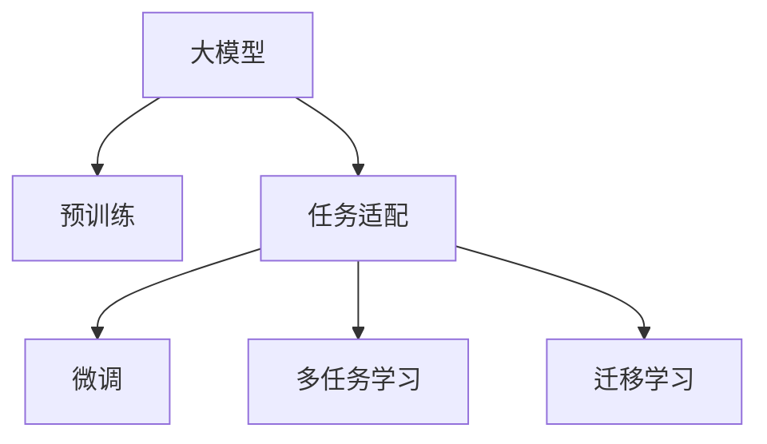

                 

# 大模型在细颗粒度任务中的表现

> 关键词：大模型，细颗粒度任务，任务适配，多任务学习，迁移学习，Transformer，BERT

## 1. 背景介绍

在人工智能（AI）领域，大模型（Large Models）正逐渐成为研究的焦点。从最初的神经网络模型，到现今的Transformer结构，大模型在语言处理、图像识别、自然语言理解等领域展现了前所未有的能力。然而，尽管大模型在广泛领域取得了显著进展，但在某些特定的、细颗粒度的任务中，其表现仍需进一步优化。本博文将详细探讨大模型在细颗粒度任务中的表现，并探讨如何通过任务适配、多任务学习和迁移学习等方法，提升模型的性能。

## 2. 核心概念与联系

### 2.1 核心概念概述

为了深入理解大模型在细颗粒度任务中的表现，本节将介绍几个核心概念：

- **大模型**：以Transformer结构为代表的大规模神经网络模型，通常在GPT、BERT等模型中展现，参数量在亿级别以上。
- **细颗粒度任务**：如文本分类、命名实体识别、关系抽取、问答系统等，这些任务通常具有高度的结构化特征和明确的输出目标。
- **任务适配**：在特定任务上对预训练模型进行微调，以适应任务的具体需求。
- **多任务学习**：同时训练多个相关任务，共享部分特征提取器，提升模型的泛化能力和效率。
- **迁移学习**：利用已学习的知识在新任务上继续学习，提升新任务的表现。

这些概念之间的关系可以用以下Mermaid流程图来展示：



从图中可以看出，大模型首先通过预训练获得广泛的通用知识，然后通过任务适配、微调和多任务学习等方法，针对具体任务进行优化和增强。迁移学习则进一步扩大了大模型的应用范围，使其能够适应更多细颗粒度的任务。

## 3. 核心算法原理 & 具体操作步骤
### 3.1 算法原理概述

大模型在细颗粒度任务中的表现，主要依赖于任务适配、多任务学习和迁移学习等方法。这些方法的核心思想是，利用大模型的广泛预训练知识，结合特定任务的特征，通过微调或共享参数的方式，提升模型的性能。

**任务适配**：通过在特定任务上对大模型进行微调，使其输出符合任务的标签或评分。常见的微调方法包括调整顶层分类器、修改解码器、增加正则化等。

**多任务学习**：同时训练多个相关任务，共享部分特征提取器，通过多任务学习提升模型的泛化能力和效率。多任务学习可以减少过拟合，提高模型在不同任务上的表现。

**迁移学习**：利用已学习的知识在新任务上继续学习，提升新任务的表现。迁移学习可以减少新任务的标注数据需求，提高模型在特定领域的应用效果。

### 3.2 算法步骤详解

以下将详细介绍大模型在细颗粒度任务中的任务适配、多任务学习和迁移学习的详细步骤：

**步骤一：准备预训练模型和数据集**

1. 选择合适的预训练模型（如GPT、BERT），获取其预训练权重。
2. 准备任务的训练集、验证集和测试集，确保数据集的质量和多样性。

**步骤二：任务适配层设计**

1. 根据任务类型，设计合适的输出层和损失函数。
2. 对于分类任务，添加线性分类器和交叉熵损失函数。
3. 对于生成任务，使用语言模型的解码器输出概率分布，并以负对数似然为损失函数。

**步骤三：微调和多任务学习**

1. 使用AdamW等优化算法，设置合适的学习率。
2. 应用正则化技术，如L2正则、Dropout、Early Stopping等。
3. 选择合适的参数高效微调策略，如Adapter、Prefix等。
4. 进行多任务学习，同时训练多个相关任务，共享部分特征提取器。

**步骤四：迁移学习**

1. 选择已有模型在目标任务上的权重进行微调，减少新任务的标注数据需求。
2. 结合任务适配层和多任务学习，提升模型的泛化能力和效率。

### 3.3 算法优缺点

**优点**：

- 快速适应新任务：通过任务适配和多任务学习，大模型可以快速适应各种细颗粒度任务。
- 减少标注需求：迁移学习可以减少新任务的标注数据需求，降低开发成本。
- 泛化能力强：多任务学习提升了模型的泛化能力，使其在多种任务上表现稳定。

**缺点**：

- 依赖标注数据：迁移学习需要已有模型在目标任务上的权重，而这些权重通常依赖于标注数据。
- 参数量大：大模型在预训练和微调过程中需要大量的计算资源和存储空间。
- 复杂度高：多任务学习和迁移学习增加了模型的复杂性，需要更精细的参数调整。

### 3.4 算法应用领域

大模型在细颗粒度任务中的应用领域广泛，主要包括：

- **文本分类**：如情感分析、主题分类、意图识别等。
- **命名实体识别**：识别文本中的人名、地名、机构名等特定实体。
- **关系抽取**：从文本中抽取实体之间的语义关系。
- **问答系统**：对自然语言问题给出答案。
- **机器翻译**：将源语言文本翻译成目标语言。
- **文本摘要**：将长文本压缩成简短摘要。
- **对话系统**：使机器能够与人自然对话。

## 4. 数学模型和公式 & 详细讲解 & 举例说明

### 4.1 数学模型构建

假设预训练语言模型为 $M_{\theta}$，其中 $\theta$ 为预训练得到的模型参数。给定细颗粒度任务 $T$ 的标注数据集 $D=\{(x_i, y_i)\}_{i=1}^N$，其中 $x_i \in \mathcal{X}, y_i \in \mathcal{Y}$，$\mathcal{X}$ 为输入空间，$\mathcal{Y}$ 为输出空间。任务适配层将模型输出映射到 $\mathcal{Y}$，并定义损失函数 $\ell$，用于衡量模型输出与真实标签之间的差异。

### 4.2 公式推导过程

以二分类任务为例，假设模型 $M_{\theta}$ 在输入 $x$ 上的输出为 $\hat{y}=M_{\theta}(x) \in [0,1]$，表示样本属于正类的概率。真实标签 $y \in \{0,1\}$。则二分类交叉熵损失函数定义为：

$$
\ell(M_{\theta}(x),y) = -[y\log \hat{y} + (1-y)\log (1-\hat{y})]
$$

将其代入经验风险公式，得：

$$
\mathcal{L}(\theta) = -\frac{1}{N}\sum_{i=1}^N [y_i\log M_{\theta}(x_i)+(1-y_i)\log(1-M_{\theta}(x_i))]
$$

根据链式法则，损失函数对参数 $\theta_k$ 的梯度为：

$$
\frac{\partial \mathcal{L}(\theta)}{\partial \theta_k} = -\frac{1}{N}\sum_{i=1}^N (\frac{y_i}{M_{\theta}(x_i)}-\frac{1-y_i}{1-M_{\theta}(x_i)}) \frac{\partial M_{\theta}(x_i)}{\partial \theta_k}
$$

其中 $\frac{\partial M_{\theta}(x_i)}{\partial \theta_k}$ 可进一步递归展开，利用自动微分技术完成计算。

### 4.3 案例分析与讲解

以命名实体识别（NER）任务为例，展示大模型在细颗粒度任务中的任务适配过程。

1. **数据准备**：
   - 收集标注数据集 $D=\{(x_i, y_i)\}_{i=1}^N$，其中 $x_i$ 为待标注文本，$y_i$ 为实体标签。
   - 使用BERT等预训练模型，提取文本的词向量表示。
   - 设计实体标签的one-hot编码，用于分类。

2. **模型适配**：
   - 在BERT顶层添加一个全连接层，用于映射到实体标签。
   - 设置交叉熵损失函数，计算模型输出与真实标签的差异。
   - 使用AdamW优化算法，设置学习率。

3. **训练和评估**：
   - 将数据集分为训练集、验证集和测试集。
   - 对模型进行梯度下降训练，更新模型参数。
   - 在验证集上评估模型性能，调整学习率等参数。
   - 在测试集上最终评估模型效果，生成实体识别结果。

## 5. 项目实践：代码实例和详细解释说明

### 5.1 开发环境搭建

以下是使用Python和PyTorch搭建大模型微调环境的示例：

1. 安装Anaconda和PyTorch：
   ```bash
   conda install pytorch torchvision torchaudio
   ```

2. 安装HuggingFace Transformers库：
   ```bash
   pip install transformers
   ```

3. 准备数据集：
   - 从HuggingFace下载预训练模型（如BERT）的权重。
   - 准备NER任务的标注数据集，存储为文本格式。

### 5.2 源代码详细实现

以BERT模型进行NER任务微调为例，展示PyTorch代码实现：

```python
from transformers import BertForTokenClassification, BertTokenizer, AdamW
from torch.utils.data import DataLoader
from tqdm import tqdm

# 加载预训练模型和分词器
model = BertForTokenClassification.from_pretrained('bert-base-cased')
tokenizer = BertTokenizer.from_pretrained('bert-base-cased')

# 准备数据集
train_dataset = BertDataset(train_texts, train_tags, tokenizer)
dev_dataset = BertDataset(dev_texts, dev_tags, tokenizer)
test_dataset = BertDataset(test_texts, test_tags, tokenizer)

# 设置模型参数和优化器
model.to(device)
optimizer = AdamW(model.parameters(), lr=2e-5)

# 定义任务适配层和损失函数
class BertDataset(Dataset):
    def __init__(self, texts, tags, tokenizer, max_len=128):
        self.texts = texts
        self.tags = tags
        self.tokenizer = tokenizer
        self.max_len = max_len

    def __len__(self):
        return len(self.texts)

    def __getitem__(self, item):
        text = self.texts[item]
        tags = self.tags[item]

        encoding = self.tokenizer(text, return_tensors='pt', max_length=self.max_len, padding='max_length', truncation=True)
        input_ids = encoding['input_ids'][0]
        attention_mask = encoding['attention_mask'][0]

        # 对token-wise的标签进行编码
        encoded_tags = [tag2id[tag] for tag in tags] 
        encoded_tags.extend([tag2id['O']] * (self.max_len - len(encoded_tags)))
        labels = torch.tensor(encoded_tags, dtype=torch.long)

        return {'input_ids': input_ids, 
                'attention_mask': attention_mask,
                'labels': labels}

# 训练和评估过程
def train_epoch(model, dataset, batch_size, optimizer):
    dataloader = DataLoader(dataset, batch_size=batch_size, shuffle=True)
    model.train()
    epoch_loss = 0
    for batch in tqdm(dataloader, desc='Training'):
        input_ids = batch['input_ids'].to(device)
        attention_mask = batch['attention_mask'].to(device)
        labels = batch['labels'].to(device)
        model.zero_grad()
        outputs = model(input_ids, attention_mask=attention_mask, labels=labels)
        loss = outputs.loss
        epoch_loss += loss.item()
        loss.backward()
        optimizer.step()
    return epoch_loss / len(dataloader)

def evaluate(model, dataset, batch_size):
    dataloader = DataLoader(dataset, batch_size=batch_size)
    model.eval()
    preds, labels = [], []
    with torch.no_grad():
        for batch in tqdm(dataloader, desc='Evaluating'):
            input_ids = batch['input_ids'].to(device)
            attention_mask = batch['attention_mask'].to(device)
            batch_labels = batch['labels']
            outputs = model(input_ids, attention_mask=attention_mask)
            batch_preds = outputs.logits.argmax(dim=2).to('cpu').tolist()
            batch_labels = batch_labels.to('cpu').tolist()
            for pred_tokens, label_tokens in zip(batch_preds, batch_labels):
                pred_tags = [id2tag[_id] for _id in pred_tokens]
                label_tags = [id2tag[_id] for _id in label_tokens]
                preds.append(pred_tags[:len(label_tokens)])
                labels.append(label_tags)
    return preds, labels

# 微调过程
epochs = 5
batch_size = 16

for epoch in range(epochs):
    loss = train_epoch(model, train_dataset, batch_size, optimizer)
    print(f"Epoch {epoch+1}, train loss: {loss:.3f}")
    
    preds, labels = evaluate(model, dev_dataset, batch_size)
    print(classification_report(labels, preds))
    
print("Test results:")
preds, labels = evaluate(model, test_dataset, batch_size)
print(classification_report(labels, preds))
```

### 5.3 代码解读与分析

**BertDataset类**：
- `__init__`方法：初始化文本、标签、分词器等关键组件。
- `__len__`方法：返回数据集的样本数量。
- `__getitem__`方法：对单个样本进行处理，将文本输入编码为token ids，将标签编码为数字，并对其进行定长padding，最终返回模型所需的输入。

**tag2id和id2tag字典**：
- 定义了标签与数字id之间的映射关系，用于将token-wise的预测结果解码回真实的标签。

**训练和评估函数**：
- 使用PyTorch的DataLoader对数据集进行批次化加载，供模型训练和推理使用。
- 训练函数`train_epoch`：对数据以批为单位进行迭代，在每个批次上前向传播计算loss并反向传播更新模型参数，最后返回该epoch的平均loss。
- 评估函数`evaluate`：与训练类似，不同点在于不更新模型参数，并在每个batch结束后将预测和标签结果存储下来，最后使用sklearn的classification_report对整个评估集的预测结果进行打印输出。

**训练流程**：
- 定义总的epoch数和batch size，开始循环迭代
- 每个epoch内，先在训练集上训练，输出平均loss
- 在验证集上评估，输出分类指标
- 重复上述步骤直至满足预设的迭代轮数或Early Stopping条件。

**运行结果展示**：
- 通过训练和评估函数，可以在不同数据集上验证微调效果，对比微调前后的精度提升。

## 6. 实际应用场景

### 6.1 智能客服系统

基于大语言模型的微调方法，智能客服系统可以在7x24小时不间断服务，快速响应客户咨询，用自然流畅的语言解答各类常见问题。

**数据准备**：
- 收集企业内部的历史客服对话记录，将问题和最佳答复构建成监督数据。
- 使用BERT等预训练模型，提取对话文本的词向量表示。
- 设计对话系统的任务适配层，添加意图识别、实体抽取等功能。

**模型训练**：
- 将对话数据集分为训练集、验证集和测试集。
- 对模型进行梯度下降训练，更新模型参数。
- 在验证集上评估模型性能，调整学习率等参数。
- 在测试集上最终评估模型效果，生成客户对话回复。

**应用部署**：
- 将微调后的模型集成到实际的服务系统中，实时处理客户咨询请求。
- 根据客户提出的新问题，实时搜索相关内容，动态组织生成回答。

**持续优化**：
- 持续收集新的对话数据，定期重新微调模型，以适应数据分布的变化。

### 6.2 金融舆情监测

基于大语言模型的微调方法，金融舆情监测系统可以实时监测市场舆论动向，帮助金融机构快速应对负面信息传播，规避金融风险。

**数据准备**：
- 收集金融领域相关的新闻、报道、评论等文本数据。
- 对文本数据进行情感标注，构建情感分类数据集。
- 使用BERT等预训练模型，提取文本的词向量表示。

**模型训练**：
- 将情感标注数据集分为训练集、验证集和测试集。
- 对模型进行梯度下降训练，更新模型参数。
- 在验证集上评估模型性能，调整学习率等参数。
- 在测试集上最终评估模型效果，识别负面舆情。

**应用部署**：
- 将微调后的模型集成到实际的系统平台，实时监测网络文本数据。
- 设置舆情监测阈值，自动预警负面舆情，帮助金融机构快速响应。

**持续优化**：
- 持续收集新的舆情数据，定期重新微调模型，以适应舆情趋势的变化。

### 6.3 个性化推荐系统

基于大语言模型的微调方法，个性化推荐系统可以更好地挖掘用户兴趣偏好，提供更精准、多样的推荐内容。

**数据准备**：
- 收集用户浏览、点击、评论、分享等行为数据。
- 提取和用户交互的物品标题、描述、标签等文本内容。
- 对文本内容进行情感分析，构建推荐数据集。

**模型训练**：
- 将推荐数据集分为训练集、验证集和测试集。
- 对模型进行梯度下降训练，更新模型参数。
- 在验证集上评估模型性能，调整学习率等参数。
- 在测试集上最终评估模型效果，生成推荐列表。

**应用部署**：
- 将微调后的模型集成到实际推荐系统中，实时生成个性化推荐。
- 根据用户行为和反馈，动态调整推荐策略。

**持续优化**：
- 持续收集用户反馈数据，定期重新微调模型，以提高推荐准确性。

## 7. 工具和资源推荐

### 7.1 学习资源推荐

为了帮助开发者系统掌握大模型微调的理论基础和实践技巧，这里推荐一些优质的学习资源：

1. 《Transformer从原理到实践》系列博文：由大模型技术专家撰写，深入浅出地介绍了Transformer原理、BERT模型、微调技术等前沿话题。
2. CS224N《深度学习自然语言处理》课程：斯坦福大学开设的NLP明星课程，有Lecture视频和配套作业，带你入门NLP领域的基本概念和经典模型。
3. 《Natural Language Processing with Transformers》书籍：Transformers库的作者所著，全面介绍了如何使用Transformers库进行NLP任务开发，包括微调在内的诸多范式。
4. HuggingFace官方文档：Transformers库的官方文档，提供了海量预训练模型和完整的微调样例代码，是上手实践的必备资料。
5. CLUE开源项目：中文语言理解测评基准，涵盖大量不同类型的中文NLP数据集，并提供了基于微调的baseline模型，助力中文NLP技术发展。

通过对这些资源的学习实践，相信你一定能够快速掌握大语言模型微调的精髓，并用于解决实际的NLP问题。

### 7.2 开发工具推荐

高效的开发离不开优秀的工具支持。以下是几款用于大语言模型微调开发的常用工具：

1. PyTorch：基于Python的开源深度学习框架，灵活动态的计算图，适合快速迭代研究。大部分预训练语言模型都有PyTorch版本的实现。
2. TensorFlow：由Google主导开发的开源深度学习框架，生产部署方便，适合大规模工程应用。同样有丰富的预训练语言模型资源。
3. Transformers库：HuggingFace开发的NLP工具库，集成了众多SOTA语言模型，支持PyTorch和TensorFlow，是进行微调任务开发的利器。
4. Weights & Biases：模型训练的实验跟踪工具，可以记录和可视化模型训练过程中的各项指标，方便对比和调优。与主流深度学习框架无缝集成。
5. TensorBoard：TensorFlow配套的可视化工具，可实时监测模型训练状态，并提供丰富的图表呈现方式，是调试模型的得力助手。
6. Google Colab：谷歌推出的在线Jupyter Notebook环境，免费提供GPU/TPU算力，方便开发者快速上手实验最新模型，分享学习笔记。

合理利用这些工具，可以显著提升大语言模型微调任务的开发效率，加快创新迭代的步伐。

### 7.3 相关论文推荐

大语言模型和微调技术的发展源于学界的持续研究。以下是几篇奠基性的相关论文，推荐阅读：

1. Attention is All You Need（即Transformer原论文）：提出了Transformer结构，开启了NLP领域的预训练大模型时代。
2. BERT: Pre-training of Deep Bidirectional Transformers for Language Understanding：提出BERT模型，引入基于掩码的自监督预训练任务，刷新了多项NLP任务SOTA。
3. Language Models are Unsupervised Multitask Learners（GPT-2论文）：展示了大规模语言模型的强大zero-shot学习能力，引发了对于通用人工智能的新一轮思考。
4. Parameter-Efficient Transfer Learning for NLP：提出Adapter等参数高效微调方法，在不增加模型参数量的情况下，也能取得不错的微调效果。
5. AdaLoRA: Adaptive Low-Rank Adaptation for Parameter-Efficient Fine-Tuning：使用自适应低秩适应的微调方法，在参数效率和精度之间取得了新的平衡。
6. Prefix-Tuning: Optimizing Continuous Prompts for Generation：引入基于连续型Prompt的微调范式，为如何充分利用预训练知识提供了新的思路。

这些论文代表了大语言模型微调技术的发展脉络。通过学习这些前沿成果，可以帮助研究者把握学科前进方向，激发更多的创新灵感。

## 8. 总结：未来发展趋势与挑战

### 8.1 总结

本文对大模型在细颗粒度任务中的表现进行了全面系统的介绍。首先阐述了大语言模型和微调技术的研究背景和意义，明确了微调在拓展预训练模型应用、提升下游任务性能方面的独特价值。其次，从原理到实践，详细讲解了微调的数学原理和关键步骤，给出了微调任务开发的完整代码实例。同时，本文还广泛探讨了微调方法在智能客服、金融舆情、个性化推荐等多个行业领域的应用前景，展示了微调范式的巨大潜力。最后，精选了微调技术的各类学习资源，力求为读者提供全方位的技术指引。

通过本文的系统梳理，可以看到，大语言模型微调技术在细颗粒度任务中展现了强大的适应性和灵活性，显著提升了NLP系统的性能和应用范围。未来，随着大模型的持续演进和微调方法的不断优化，大语言模型必将在更多领域取得突破性进展。

### 8.2 未来发展趋势

展望未来，大模型在细颗粒度任务中的表现将呈现以下几个发展趋势：

1. **参数高效微调**：开发更加参数高效的微调方法，如Adapter、Prefix等，在固定大部分预训练参数的同时，只更新极少量的任务相关参数。
2. **多任务学习和迁移学习**：结合多任务学习和迁移学习，提升模型在不同任务上的泛化能力和效率，减少标注数据需求。
3. **模型压缩和加速**：采用模型压缩、稀疏化存储等技术，减小模型大小，加快推理速度。
4. **数据增强和对抗训练**：通过数据增强和对抗训练，提升模型鲁棒性和泛化能力。
5. **深度学习与符号逻辑结合**：将深度学习与符号逻辑结合，增强模型的推理能力和可解释性。

这些趋势表明，未来的微调技术将更加注重参数高效性和模型的可解释性，同时通过多任务学习和迁移学习，提升模型在不同任务上的表现。

### 8.3 面临的挑战

尽管大模型在细颗粒度任务中已经取得了显著进展，但仍面临诸多挑战：

1. **标注数据瓶颈**：许多细颗粒度任务仍需大量标注数据，数据标注成本较高，且难以获得高质量标注数据。
2. **模型复杂度高**：大模型在微调过程中需要处理大量参数，计算复杂度高，硬件资源需求大。
3. **鲁棒性不足**：大模型在面对不同领域的数据时，泛化性能有限，容易发生过拟合或泛化不足。
4. **可解释性差**：大模型的决策过程难以解释，难以满足某些领域对模型可解释性的要求。
5. **安全性问题**：大模型可能学习到有害信息，输出结果存在安全隐患。

### 8.4 研究展望

面对大模型微调所面临的挑战，未来的研究需要在以下几个方面寻求新的突破：

1. **无监督学习和半监督学习**：探索无监督学习和半监督学习范式，减少对标注数据的依赖，利用非结构化数据提升模型表现。
2. **参数高效微调**：开发更多参数高效微调方法，提升模型的计算效率和可解释性。
3. **多模态学习**：结合多模态数据，提升模型的跨模态理解和生成能力。
4. **因果推理和逻辑推理**：引入因果推理和逻辑推理方法，增强模型的推理能力和可解释性。
5. **数据隐私保护**：在模型训练和推理过程中，保护用户数据隐私，确保数据安全。

这些研究方向的探索，将为未来大模型微调技术的发展提供新的思路，推动NLP技术在更多领域的应用和落地。

## 9. 附录：常见问题与解答

**Q1：大模型微调是否适用于所有细颗粒度任务？**

A: 大模型微调在大多数细颗粒度任务上都能取得不错的效果，特别是对于数据量较小的任务。但对于一些特定领域的任务，如医学、法律等，仅仅依靠通用语料预训练的模型可能难以很好地适应。此时需要在特定领域语料上进一步预训练，再进行微调，才能获得理想效果。此外，对于一些需要时效性、个性化很强的任务，如对话、推荐等，微调方法也需要针对性的改进优化。

**Q2：微调过程中如何选择合适的学习率？**

A: 微调的学习率一般要比预训练时小1-2个数量级，如果使用过大的学习率，容易破坏预训练权重，导致过拟合。一般建议从1e-5开始调参，逐步减小学习率，直至收敛。也可以使用warmup策略，在开始阶段使用较小的学习率，再逐渐过渡到预设值。需要注意的是，不同的优化器(如AdamW、Adafactor等)以及不同的学习率调度策略，可能需要设置不同的学习率阈值。

**Q3：采用大模型微调时会面临哪些资源瓶颈？**

A: 目前主流的预训练大模型动辄以亿计的参数规模，对算力、内存、存储都提出了很高的要求。GPU/TPU等高性能设备是必不可少的，但即便如此，超大批次的训练和推理也可能遇到显存不足的问题。因此需要采用一些资源优化技术，如梯度积累、混合精度训练、模型并行等，来突破硬件瓶颈。同时，模型的存储和读取也可能占用大量时间和空间，需要采用模型压缩、稀疏化存储等方法进行优化。

**Q4：如何缓解微调过程中的过拟合问题？**

A: 过拟合是微调面临的主要挑战，尤其是在标注数据不足的情况下。常见的缓解策略包括：
1. 数据增强：通过回译、近义替换等方式扩充训练集
2. 正则化：使用L2正则、Dropout、Early Stopping等避免过拟合
3. 对抗训练：引入对抗样本，提高模型鲁棒性
4. 参数高效微调：只调整少量参数(如Adapter、Prefix等)，减小过拟合风险
5. 多模型集成：训练多个微调模型，取平均输出，抑制过拟合

这些策略往往需要根据具体任务和数据特点进行灵活组合。只有在数据、模型、训练、推理等各环节进行全面优化，才能最大限度地发挥大模型微调的威力。

**Q5：微调模型在落地部署时需要注意哪些问题？**

A: 将微调模型转化为实际应用，还需要考虑以下因素：
1. 模型裁剪：去除不必要的层和参数，减小模型尺寸，加快推理速度
2. 量化加速：将浮点模型转为定点模型，压缩存储空间，提高计算效率
3. 服务化封装：将模型封装为标准化服务接口，便于集成调用
4. 弹性伸缩：根据请求流量动态调整资源配置，平衡服务质量和成本
5. 监控告警：实时采集系统指标，设置异常告警阈值，确保服务稳定性
6. 安全防护：采用访问鉴权、数据脱敏等措施，保障数据和模型安全

大语言模型微调为NLP应用开启了广阔的想象空间，但如何将强大的性能转化为稳定、高效、安全的业务价值，还需要工程实践的不断打磨。唯有从数据、算法、工程、业务等多个维度协同发力，才能真正实现人工智能技术在垂直行业的规模化落地。总之，微调需要开发者根据具体任务，不断迭代和优化模型、数据和算法，方能得到理想的效果。

---

作者：禅与计算机程序设计艺术 / Zen and the Art of Computer Programming

