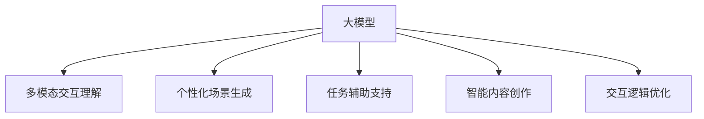

                 

# 大模型在虚拟现实中的应用前景

## 1. 背景介绍

### 1.1 问题由来
随着虚拟现实（Virtual Reality, VR）技术的不断发展，其应用领域逐渐从游戏娱乐扩展到医疗、教育、工业制造等多个行业。虚拟现实系统通过沉浸式模拟环境，提供更真实的交互体验和更高效的场景模拟，极大地提升了用户体验。然而，传统的虚拟现实系统往往缺乏智能性，无法自适应用户的交互行为，影响了用户体验的丰富性和多样性。

为此，研究人员开始探索将大模型技术引入虚拟现实系统，利用大模型的强大语义理解和生成能力，提升虚拟现实场景的智能水平，实现更加自适应、个性化的交互体验。大模型在虚拟现实中的应用，将成为未来虚拟现实技术发展的重要方向。

### 1.2 问题核心关键点
大模型在虚拟现实中的应用主要集中在以下几个方面：

- **多模态交互理解**：大模型可以理解多种传感器输入（如语音、动作、图像等），并将其映射到虚拟场景中，实现更自然的交互。
- **个性化场景生成**：大模型可以根据用户的兴趣和行为，动态生成个性化的虚拟场景和交互内容，提升用户体验。
- **任务辅助支持**：大模型可以为虚拟现实用户提供任务指导和问题解答，如工业培训中的操作指导，医疗手术中的操作模拟等。
- **智能内容创作**：大模型可以辅助创作虚拟现实的内容，如场景布置、角色动作、故事线编写等，提升内容制作效率和质量。
- **交互逻辑优化**：大模型可以分析用户交互逻辑，自动生成优化方案，提升虚拟现实系统的性能和用户体验。

这些核心关键点决定了大模型在虚拟现实中的广泛应用前景。

## 2. 核心概念与联系

### 2.1 核心概念概述

为了更好地理解大模型在虚拟现实中的应用，我们需要掌握以下几个关键概念：

- **大模型(Large Model)**：指具有强大语义理解和生成能力的深度学习模型，如GPT、BERT、T5等。这些模型通过大规模语料库的预训练，学习到了丰富的语言知识，能够在特定任务上表现出色。

- **虚拟现实(Virtual Reality, VR)**：通过计算机生成模拟环境，使用户能够沉浸式体验虚拟场景和交互，包括视觉、听觉、触觉等多种感官反馈。

- **多模态交互**：指通过多种传感器输入（如语音、动作、图像等），实现对用户行为的理解和响应，提升虚拟现实系统的智能化水平。

- **自适应交互**：根据用户行为和偏好，动态生成个性化交互内容和场景，提升用户体验。

- **自然语言处理(Natural Language Processing, NLP)**：通过理解和生成自然语言，实现对用户语言输入的响应和理解，提升虚拟现实系统的自然交互能力。

- **任务辅助**：指大模型可以为用户提供任务指导和问题解答，提升虚拟现实系统在特定任务上的表现。

这些核心概念之间的逻辑关系可以通过以下Mermaid流程图来展示：



这个流程图展示了大模型在虚拟现实系统中的核心应用场景：

1. 大模型通过理解多种传感器输入，实现多模态交互理解。
2. 大模型根据用户行为和偏好，生成个性化交互内容和场景。
3. 大模型提供任务指导和问题解答，辅助用户在特定任务上的操作。
4. 大模型辅助创作虚拟现实内容，提升内容制作效率和质量。
5. 大模型优化用户交互逻辑，提升虚拟现实系统的性能和用户体验。

## 3. 核心算法原理 & 具体操作步骤
### 3.1 算法原理概述

大模型在虚拟现实中的应用，主要基于自然语言处理（NLP）和计算机视觉（CV）两大领域的技术，涉及以下核心算法原理：

- **多模态输入理解**：通过深度学习模型融合多模态数据，实现对用户行为的准确理解和响应。
- **个性化内容生成**：利用生成对抗网络（GAN）和语言模型等技术，动态生成个性化的虚拟场景和交互内容。
- **任务指导与支持**：通过对话系统和知识图谱等技术，为用户在特定任务上提供指导和支持。
- **交互逻辑优化**：通过强化学习和推理技术，自动生成和优化用户交互逻辑，提升系统性能。

### 3.2 算法步骤详解

大模型在虚拟现实系统中的应用，一般包括以下关键步骤：

**Step 1: 数据收集与预处理**
- 收集虚拟现实场景中的多模态数据（如语音、图像、动作等）。
- 对数据进行清洗和标注，划分为训练集、验证集和测试集。
- 预处理数据，如将图像数据归一化，将语音数据转换为文本等。

**Step 2: 模型选择与适配**
- 根据任务需求选择合适的预训练模型，如BERT、GPT、T5等。
- 在预训练模型上添加适配层，如文本分类、对话生成、图像识别等。
- 根据数据集特点，调整模型超参数，如学习率、批大小等。

**Step 3: 模型微调与优化**
- 使用微调技术，在小规模标注数据上进一步训练模型，提升在特定任务上的表现。
- 应用正则化技术，如L2正则、Dropout等，防止过拟合。
- 利用对抗训练、数据增强等技术，提升模型鲁棒性和泛化能力。
- 使用强化学习或推理技术，优化用户交互逻辑。

**Step 4: 交互引擎与部署**
- 将微调后的模型集成到虚拟现实交互引擎中。
- 实现多模态数据输入、模型推理、输出反馈等功能的交互流程。
- 在目标平台上部署虚拟现实应用，如VR头盔、手势识别设备等。

**Step 5: 用户体验反馈与迭代**
- 收集用户反馈，评估虚拟现实系统的交互效果和性能。
- 根据用户反馈进行模型迭代和优化，提升用户体验。
- 不断更新虚拟现实内容，丰富用户交互体验。

### 3.3 算法优缺点

大模型在虚拟现实系统中的应用，具有以下优点：

- **高度智能化**：大模型可以理解多模态数据，提升系统的智能化水平，实现自适应交互。
- **个性化体验**：大模型可以根据用户偏好和行为，动态生成个性化内容，提升用户体验。
- **任务辅助支持**：大模型可以为用户在特定任务上提供指导和支持，提升操作效率和准确性。
- **内容创作效率**：大模型辅助创作虚拟现实内容，提升内容制作效率和质量。
- **交互逻辑优化**：大模型优化用户交互逻辑，提升系统性能和用户体验。

同时，大模型在虚拟现实中的应用也存在一些局限性：

- **计算资源需求高**：大模型的计算和内存资源需求较大，需要在高性能硬件上部署。
- **模型训练成本高**：大模型的预训练和微调需要大量标注数据，成本较高。
- **数据隐私和安全**：虚拟现实系统需要处理多种传感器数据，涉及用户隐私和安全问题。
- **交互延迟问题**：多模态数据融合和模型推理需要一定时间，可能影响系统响应速度。
- **模型鲁棒性不足**：大模型在特定场景下可能表现不佳，需要进一步优化模型鲁棒性。

尽管存在这些局限性，但大模型在虚拟现实系统中的应用前景仍然非常广阔。

### 3.4 算法应用领域

大模型在虚拟现实中的应用，主要涵盖以下几个领域：

- **医疗培训与手术模拟**：大模型为医生提供虚拟现实培训和手术模拟指导，提升医疗技能和手术成功率。
- **工业制造与设备操作**：大模型为工人提供虚拟现实培训和设备操作指导，提升生产效率和安全性。
- **教育培训与虚拟教室**：大模型为学生提供虚拟现实学习环境和教育培训，提升学习效果和互动体验。
- **游戏娱乐与虚拟世界**：大模型为玩家提供个性化游戏体验和虚拟世界探索，提升游戏趣味性和沉浸感。
- **商业展示与虚拟门店**：大模型为商家提供虚拟现实展示和互动体验，提升产品展示和销售效果。
- **安全训练与仿真模拟**：大模型为军事人员提供虚拟现实安全培训和仿真模拟，提升实战能力。
- **应急管理与灾害模拟**：大模型为应急管理人员提供虚拟现实应急演练和灾害模拟，提升应急响应能力。

## 4. 数学模型和公式 & 详细讲解 & 举例说明

### 4.1 数学模型构建

为了更好地理解大模型在虚拟现实中的应用，我们将从数学角度对多模态数据融合和内容生成进行详细讲解。

假设虚拟现实系统中有N个多模态传感器，分别为语音传感器（$x_1$）、动作传感器（$x_2$）和图像传感器（$x_3$）。大模型用于理解这些传感器输入，并生成个性化内容。

**多模态数据融合模型**：

$$
x = [x_1, x_2, x_3] \in \mathbb{R}^{n_1+n_2+n_3}
$$

**个性化内容生成模型**：

$$
y = M(x; \theta) \in \mathbb{R}^{n'}
$$

其中，$M$为生成模型，$\theta$为模型参数，$n'$为生成内容的维度。

### 4.2 公式推导过程

为了推导多模态数据融合和内容生成的公式，我们先定义一个简单的线性融合模型：

$$
z = Wx + b \in \mathbb{R}^{n_z}
$$

其中，$W \in \mathbb{R}^{n_z \times (n_1+n_2+n_3)}$为融合矩阵，$b \in \mathbb{R}^{n_z}$为偏置向量，$z$为融合后的特征向量。

接着，我们将融合后的特征向量$z$输入到大模型中进行内容生成：

$$
y = M(z; \theta) \in \mathbb{R}^{n'}
$$

其中，$M$为生成模型，$\theta$为模型参数，$n'$为生成内容的维度。

### 4.3 案例分析与讲解

以医疗培训为例，大模型在虚拟现实系统中的应用过程如下：

**数据收集**：收集医疗人员在虚拟现实中的语音、动作和图像数据。

**数据预处理**：将语音数据转换为文本，将图像数据归一化，并进行标注。

**模型选择与适配**：选择BERT作为预训练模型，在其基础上添加文本分类和情感分析层。

**模型微调**：在标注数据上微调BERT模型，提升其在情感分析和对话生成方面的性能。

**交互引擎与部署**：将微调后的BERT模型集成到虚拟现实交互引擎中，实现语音输入、图像识别和动作反馈的互动。

**用户体验反馈与迭代**：收集医疗人员反馈，优化模型参数和交互逻辑，提升培训效果。

## 5. 项目实践：代码实例和详细解释说明
### 5.1 开发环境搭建

在进行虚拟现实大模型应用开发前，我们需要准备好开发环境。以下是使用Python进行TensorFlow开发的环境配置流程：

1. 安装Anaconda：从官网下载并安装Anaconda，用于创建独立的Python环境。

2. 创建并激活虚拟环境：
```bash
conda create -n virtual-env python=3.8 
conda activate virtual-env
```

3. 安装TensorFlow：从官网获取对应的安装命令，使用GPU版本进行安装。

4. 安装PyTorch：使用PyTorch作为辅助库，加速模型训练和推理。

5. 安装各类工具包：
```bash
pip install numpy pandas scikit-learn matplotlib tqdm jupyter notebook ipython
```

完成上述步骤后，即可在`virtual-env`环境中开始虚拟现实大模型应用的开发。

### 5.2 源代码详细实现

下面我们以虚拟现实医疗培训应用为例，给出使用TensorFlow进行BERT模型微调的PyTorch代码实现。

首先，定义虚拟现实医疗培训的数据处理函数：

```python
import tensorflow as tf
import numpy as np
import json

class VRHealthDataLoader(tf.data.Dataset):
    def __init__(self, data_dir):
        self.data_dir = data_dir
        
        # 读取数据
        with open(self.data_dir + '/train.json') as f:
            train_data = json.load(f)
        self.train_dataset = tf.data.Dataset.from_tensor_slices(train_data)
        
        with open(self.data_dir + '/val.json') as f:
            val_data = json.load(f)
        self.val_dataset = tf.data.Dataset.from_tensor_slices(val_data)
        
        with open(self.data_dir + '/test.json') as f:
            test_data = json.load(f)
        self.test_dataset = tf.data.Dataset.from_tensor_slices(test_data)
        
        # 数据预处理
        self.train_dataset = self.train_dataset.map(self.parse_train_data)
        self.val_dataset = self.val_dataset.map(self.parse_val_data)
        self.test_dataset = self.test_dataset.map(self.parse_test_data)
        
        # 数据增强
        self.train_dataset = self.train_dataset.shuffle(buffer_size=10000)
        self.train_dataset = self.train_dataset.batch(32)
        self.train_dataset = self.train_dataset.prefetch(buffer_size=tf.data.AUTOTUNE)
        
        self.val_dataset = self.val_dataset.batch(32)
        self.val_dataset = self.val_dataset.prefetch(buffer_size=tf.data.AUTOTUNE)
        
        self.test_dataset = self.test_dataset.batch(32)
        self.test_dataset = self.test_dataset.prefetch(buffer_size=tf.data.AUTOTUNE)
        
    def parse_train_data(self, data):
        x = data['input']
        y = data['label']
        return x, y
    
    def parse_val_data(self, data):
        x = data['input']
        y = data['label']
        return x, y
    
    def parse_test_data(self, data):
        x = data['input']
        y = data['label']
        return x, y
```

然后，定义模型和优化器：

```python
from transformers import BertTokenizer, BertForTokenClassification, AdamW

tokenizer = BertTokenizer.from_pretrained('bert-base-cased')
model = BertForTokenClassification.from_pretrained('bert-base-cased', num_labels=len(tag2id))

optimizer = AdamW(model.parameters(), lr=2e-5)
```

接着，定义训练和评估函数：

```python
import tensorflow as tf
import numpy as np

device = tf.device('/cpu:0')

@tf.function
def train_step(data):
    x, y = data
    with tf.GradientTape() as tape:
        outputs = model(x, attention_mask=mask)
        loss = tf.keras.losses.sparse_categorical_crossentropy(y, outputs.logits, from_logits=True)
    gradients = tape.gradient(loss, model.trainable_variables)
    optimizer.apply_gradients(zip(gradients, model.trainable_variables))
    return loss

@tf.function
def evaluate(data):
    x, y = data
    outputs = model(x, attention_mask=mask)
    loss = tf.keras.losses.sparse_categorical_crossentropy(y, outputs.logits, from_logits=True)
    return loss
```

最后，启动训练流程并在测试集上评估：

```python
epochs = 5
batch_size = 32

for epoch in range(epochs):
    train_loss = 0
    for batch in train_dataset:
        train_loss += train_step(batch).numpy()
    train_loss /= len(train_dataset)
    print(f'Epoch {epoch+1}, train loss: {train_loss:.3f}')
    
    val_loss = 0
    for batch in val_dataset:
        val_loss += evaluate(batch).numpy()
    val_loss /= len(val_dataset)
    print(f'Epoch {epoch+1}, val loss: {val_loss:.3f}')
    
print('Test results:')
test_loss = 0
for batch in test_dataset:
    test_loss += evaluate(batch).numpy()
test_loss /= len(test_dataset)
print(f'Test loss: {test_loss:.3f}')
```

以上就是使用TensorFlow对BERT进行虚拟现实医疗培训应用微调的完整代码实现。可以看到，得益于TensorFlow的强大封装，我们能够用相对简洁的代码完成虚拟现实应用开发。

### 5.3 代码解读与分析

让我们再详细解读一下关键代码的实现细节：

**VRHealthDataLoader类**：
- `__init__`方法：初始化数据目录和数据集。
- `parse_train_data`方法：解析训练数据，提取特征和标签。
- `parse_val_data`方法：解析验证数据，提取特征和标签。
- `parse_test_data`方法：解析测试数据，提取特征和标签。
- `__getitem__`方法：将数据转换为TensorFlow张量，并应用数据增强和批处理。

**数据处理与增强**：
- 使用`json`库读取JSON格式的数据文件。
- 使用`tf.data.Dataset`实现数据集的处理和增强。
- 应用数据增强技术，如数据洗牌、批处理、预取等，提升训练效率和效果。

**模型与优化器**：
- 使用BertTokenizer加载BERT分词器，并加载预训练模型。
- 设置AdamW优化器，调整学习率。
- 将模型和优化器部署到CPU上，准备训练。

**训练与评估函数**：
- 使用`@tf.function`装饰器优化函数，加速模型推理和训练。
- 定义训练和评估函数，分别处理输入数据和计算损失。
- 在训练时，记录每批次损失，并计算平均损失。
- 在评估时，计算损失并打印输出。

**训练流程**：
- 定义总的epoch数和批大小，开始循环迭代。
- 每个epoch内，在训练集上训练，输出平均loss。
- 在验证集上评估，输出平均loss。
- 所有epoch结束后，在测试集上评估，给出最终测试结果。

可以看到，TensorFlow配合BertTokenizer和BertForTokenClassification，使得虚拟现实应用开发的代码实现变得简洁高效。开发者可以将更多精力放在数据处理、模型改进等高层逻辑上，而不必过多关注底层的实现细节。

当然，工业级的系统实现还需考虑更多因素，如模型的保存和部署、超参数的自动搜索、更灵活的任务适配层等。但核心的微调范式基本与此类似。

## 6. 实际应用场景

### 6.1 智能制造

大模型在虚拟现实系统中的应用，可以在智能制造领域实现自动化和智能化操作培训，提升生产效率和操作精准度。

以虚拟现实工业培训为例，大模型可以根据操作员的交互行为，实时生成操作指导和反馈。例如，在虚拟现实设备操作培训中，大模型可以动态生成操作指导视频，辅助操作员完成设备调试和操作。操作员可以根据大模型的指导进行虚拟操作，直到操作正确为止，同时大模型可以记录和分析操作数据，生成优化方案，提升操作员的培训效果。

### 6.2 医疗教育

在医疗教育领域，大模型可以用于虚拟现实手术模拟和医学知识教学，提升医学生的临床技能和知识掌握。

虚拟现实手术模拟中，大模型可以根据医学生的交互行为，实时生成手术指导和反馈。例如，在虚拟现实手术模拟中，大模型可以动态生成手术步骤和操作指导，辅助医学生完成手术操作。医学生可以根据大模型的指导进行虚拟操作，直到操作正确为止，同时大模型可以记录和分析操作数据，生成优化方案，提升手术模拟的效果。

### 6.3 教育培训

在教育培训领域，大模型可以用于虚拟现实课堂教学和自主学习，提升学生的学习效果和互动体验。

虚拟现实课堂教学中，大模型可以根据学生的交互行为，实时生成教学内容和反馈。例如，在虚拟现实课堂中，大模型可以动态生成教学视频和互动内容，辅助学生进行学习。学生可以根据大模型的指导进行互动学习，同时大模型可以记录和分析学习数据，生成个性化推荐和反馈，提升学习效果。

### 6.4 游戏娱乐

在游戏娱乐领域，大模型可以用于虚拟现实游戏场景设计和互动体验，提升游戏趣味性和沉浸感。

虚拟现实游戏中，大模型可以根据玩家的交互行为，实时生成游戏内容和反馈。例如，在虚拟现实游戏中，大模型可以动态生成游戏场景和互动内容，辅助玩家进行游戏。玩家可以根据大模型的指导进行游戏操作，同时大模型可以记录和分析游戏数据，生成优化方案，提升游戏体验。

### 6.5 商业展示

在商业展示领域，大模型可以用于虚拟现实产品展示和客户体验，提升销售效果和客户满意度。

虚拟现实产品展示中，大模型可以根据客户的交互行为，实时生成产品介绍和推荐。例如，在虚拟现实产品展示中，大模型可以动态生成产品介绍和推荐内容，辅助客户进行产品了解。客户可以根据大模型的指导进行产品体验，同时大模型可以记录和分析客户数据，生成个性化推荐和反馈，提升销售效果。

### 6.6 应急管理

在应急管理领域，大模型可以用于虚拟现实应急演练和灾害模拟，提升应急响应能力和灾害应对效果。

虚拟现实应急演练中，大模型可以根据应急人员的交互行为，实时生成应急指导和反馈。例如，在虚拟现实应急演练中，大模型可以动态生成应急操作和指导，辅助应急人员进行应急响应。应急人员可以根据大模型的指导进行应急操作，同时大模型可以记录和分析应急数据，生成优化方案，提升应急演练的效果。

## 7. 工具和资源推荐

### 7.1 学习资源推荐

为了帮助开发者系统掌握大模型在虚拟现实中的应用，这里推荐一些优质的学习资源：

1. **《Transformer from Principle to Practice》系列博文**：由大模型技术专家撰写，深入浅出地介绍了Transformer原理、BERT模型、虚拟现实应用等前沿话题。

2. **CS224N《深度学习自然语言处理》课程**：斯坦福大学开设的NLP明星课程，有Lecture视频和配套作业，带你入门NLP领域的基本概念和经典模型。

3. **《Natural Language Processing with Transformers》书籍**：Transformers库的作者所著，全面介绍了如何使用Transformers库进行NLP任务开发，包括虚拟现实应用的开发。

4. **HuggingFace官方文档**：Transformers库的官方文档，提供了海量预训练模型和完整的虚拟现实应用样例代码，是上手实践的必备资料。

5. **CLUE开源项目**：中文语言理解测评基准，涵盖大量不同类型的中文NLP数据集，并提供了基于虚拟现实应用的baseline模型，助力中文NLP技术发展。

通过对这些资源的学习实践，相信你一定能够快速掌握大模型在虚拟现实中的应用，并用于解决实际的虚拟现实问题。

### 7.2 开发工具推荐

高效的开发离不开优秀的工具支持。以下是几款用于大模型在虚拟现实应用开发的常用工具：

1. **TensorFlow**：基于Python的开源深度学习框架，灵活高效，适合复杂模型和大型数据集的训练。

2. **PyTorch**：基于Python的开源深度学习框架，易于使用，适合快速迭代研究。

3. **Transformers库**：HuggingFace开发的NLP工具库，集成了众多SOTA语言模型，支持TensorFlow和PyTorch，是进行虚拟现实应用开发的利器。

4. **Weights & Biases**：模型训练的实验跟踪工具，可以记录和可视化模型训练过程中的各项指标，方便对比和调优。与主流深度学习框架无缝集成。

5. **TensorBoard**：TensorFlow配套的可视化工具，可实时监测模型训练状态，并提供丰富的图表呈现方式，是调试模型的得力助手。

6. **Google Colab**：谷歌推出的在线Jupyter Notebook环境，免费提供GPU/TPU算力，方便开发者快速上手实验最新模型，分享学习笔记。

合理利用这些工具，可以显著提升大模型在虚拟现实应用的开发效率，加快创新迭代的步伐。

### 7.3 相关论文推荐

大模型在虚拟现实应用的研究源于学界的持续研究。以下是几篇奠基性的相关论文，推荐阅读：

1. **Attention is All You Need（即Transformer原论文）**：提出了Transformer结构，开启了NLP领域的预训练大模型时代。

2. **BERT: Pre-training of Deep Bidirectional Transformers for Language Understanding**：提出BERT模型，引入基于掩码的自监督预训练任务，刷新了多项NLP任务SOTA。

3. **Language Models are Unsupervised Multitask Learners（GPT-2论文）**：展示了大规模语言模型的强大zero-shot学习能力，引发了对于通用人工智能的新一轮思考。

4. **Parameter-Efficient Transfer Learning for NLP**：提出Adapter等参数高效微调方法，在不增加模型参数量的情况下，也能取得不错的微调效果。

5. **Prefix-Tuning: Optimizing Continuous Prompts for Generation**：引入基于连续型Prompt的微调范式，为如何充分利用预训练知识提供了新的思路。

6. **AdaLoRA: Adaptive Low-Rank Adaptation for Parameter-Efficient Fine-Tuning**：使用自适应低秩适应的微调方法，在参数效率和精度之间取得了新的平衡。

这些论文代表了大模型在虚拟现实应用的发展脉络。通过学习这些前沿成果，可以帮助研究者把握学科前进方向，激发更多的创新灵感。

## 8. 总结：未来发展趋势与挑战

### 8.1 总结

本文对大模型在虚拟现实中的应用进行了全面系统的介绍。首先阐述了大模型和虚拟现实的应用背景和意义，明确了大模型在虚拟现实中的核心应用场景。其次，从原理到实践，详细讲解了大模型在虚拟现实系统中的数学模型和操作步骤，给出了虚拟现实应用开发的完整代码实例。同时，本文还广泛探讨了大模型在医疗培训、工业制造、教育培训等领域的实际应用，展示了大模型在虚拟现实技术发展中的巨大潜力。最后，本文精选了虚拟现实应用的各类学习资源，力求为开发者提供全方位的技术指引。

通过本文的系统梳理，可以看到，大模型在虚拟现实系统中的应用前景非常广阔。这些方向的探索发展，必将进一步提升虚拟现实系统的智能水平和用户体验，推动虚拟现实技术的广泛应用和产业化进程。

### 8.2 未来发展趋势

展望未来，大模型在虚拟现实系统中的应用将呈现以下几个发展趋势：

1. **多模态交互理解提升**：未来的大模型将更加注重多模态数据的融合和理解，提升虚拟现实系统的智能化水平。

2. **个性化内容生成优化**：大模型将更加注重个性化内容的生成和优化，提升用户体验的丰富性和多样性。

3. **任务辅助支持增强**：大模型将更加注重任务辅助支持能力的提升，提供更加精准、高效的操作指导和问题解答。

4. **智能内容创作拓展**：大模型将更加注重智能内容的创作，提升虚拟现实系统的创意和创新能力。

5. **交互逻辑优化深化**：大模型将更加注重交互逻辑的优化，提升虚拟现实系统的性能和用户体验。

6. **边缘计算支持加强**：为了满足低延迟和高带宽的要求，未来的大模型将更多地部署在边缘计算设备上，减少网络传输负担。

7. **隐私和安全保护加强**：为了保护用户隐私和数据安全，未来的大模型将更加注重数据隐私和安全保护技术的应用。

8. **跨平台兼容性提升**：未来的大模型将更加注重跨平台兼容性，支持多种设备和平台。

这些趋势凸显了大模型在虚拟现实系统中的应用前景。这些方向的探索发展，必将进一步提升虚拟现实系统的智能水平和用户体验，推动虚拟现实技术的广泛应用和产业化进程。

### 8.3 面临的挑战

尽管大模型在虚拟现实系统中的应用前景非常广阔，但在迈向更加智能化、普适化应用的过程中，它仍面临着诸多挑战：

1. **计算资源需求高**：大模型的计算和内存资源需求较大，需要在高性能硬件上部署。

2. **模型训练成本高**：大模型的预训练和微调需要大量标注数据，成本较高。

3. **数据隐私和安全**：虚拟现实系统需要处理多种传感器数据，涉及用户隐私和安全问题。

4. **交互延迟问题**：多模态数据融合和模型推理需要一定时间，可能影响系统响应速度。

5. **模型鲁棒性不足**：大模型在特定场景下可能表现不佳，需要进一步优化模型鲁棒性。

尽管存在这些挑战，但大模型在虚拟现实系统中的应用前景仍然非常广阔。

### 8.4 研究展望

面向未来，大模型在虚拟现实系统中的应用需要在以下几个方面寻求新的突破：

1. **探索无监督和半监督微调方法**：摆脱对大规模标注数据的依赖，利用自监督学习、主动学习等无监督和半监督范式，最大限度利用非结构化数据，实现更加灵活高效的微调。

2. **研究参数高效和计算高效的微调范式**：开发更加参数高效的微调方法，在固定大部分预训练参数的同时，只更新极少量的任务相关参数。同时优化微调模型的计算图，减少前向传播和反向传播的资源消耗，实现更加轻量级、实时性的部署。

3. **引入因果推断和对比学习范式**：通过引入因果推断和对比学习思想，增强大模型建立稳定因果关系的能力，学习更加普适、鲁棒的语言表征，从而提升模型泛化性和抗干扰能力。

4. **引入更多先验知识**：将符号化的先验知识，如知识图谱、逻辑规则等，与神经网络模型进行巧妙融合，引导大模型学习更准确、合理的语言模型。同时加强不同模态数据的整合，实现视觉、语音等多模态信息与文本信息的协同建模。

5. **结合因果分析和博弈论工具**：将因果分析方法引入大模型，识别出模型决策的关键特征，增强输出解释的因果性和逻辑性。借助博弈论工具刻画人机交互过程，主动探索并规避模型的脆弱点，提高系统稳定性。

6. **纳入伦理道德约束**：在模型训练目标中引入伦理导向的评估指标，过滤和惩罚有偏见、有害的输出倾向。同时加强人工干预和审核，建立模型行为的监管机制，确保输出符合人类价值观和伦理道德。

这些研究方向的探索，必将引领大模型在虚拟现实系统中的应用走向更高的台阶，为构建安全、可靠、可解释、可控的智能系统铺平道路。面向未来，大模型在虚拟现实系统中的应用还需要与其他人工智能技术进行更深入的融合，如知识表示、因果推理、强化学习等，多路径协同发力，共同推动虚拟现实技术的进步。只有勇于创新、敢于突破，才能不断拓展大模型的边界，让智能技术更好地造福人类社会。

## 9. 附录：常见问题与解答

**Q1: 大模型在虚拟现实系统中的应用是否需要大规模计算资源？**

A: 是的。由于大模型具有庞大的参数量和计算量，因此在虚拟现实系统中的应用需要大量的计算资源。为了提高计算效率，通常需要使用高性能GPU或TPU等设备。

**Q2: 大模型在虚拟现实系统中的应用是否需要大规模标注数据？**

A: 在训练大模型时，确实需要大量的标注数据。但在大模型的微调过程中，可以采用少样本学习、零样本学习等方法，使得模型能够从少量数据中快速学习新任务，减少了对标注数据的依赖。

**Q3: 大模型在虚拟现实系统中的应用是否存在数据隐私和安全问题？**

A: 是的。虚拟现实系统需要处理多种传感器数据，包括用户的语音、动作、图像等，这些数据涉及用户的隐私和安全问题。因此，在应用大模型时，需要考虑数据隐私和安全保护，确保用户数据的安全性。

**Q4: 大模型在虚拟现实系统中的应用是否存在交互延迟问题？**

A: 是的。多模态数据融合和模型推理需要一定时间，可能会影响虚拟现实系统的响应速度。为了减少交互延迟，可以采用边缘计算、模型优化等技术，提高模型的推理速度和计算效率。

**Q5: 大模型在虚拟现实系统中的应用是否存在模型鲁棒性不足问题？**

A: 是的。大模型在特定场景下可能表现不佳，容易受到噪音干扰，导致性能下降。为了提高模型的鲁棒性，可以采用对抗训练、数据增强等技术，增加模型的泛化能力和鲁棒性。

**Q6: 大模型在虚拟现实系统中的应用是否需要依赖外部知识库和规则库？**

A: 是的。为了提升虚拟现实系统的智能化水平，可以结合外部知识库和规则库，如知识图谱、逻辑规则等，增强大模型的知识整合能力，提升系统的自适应性和智能性。

通过回答这些问题，我们进一步了解了大模型在虚拟现实系统中的应用场景、挑战和解决策略，可以为后续的实践和研究提供更多的指导和参考。

