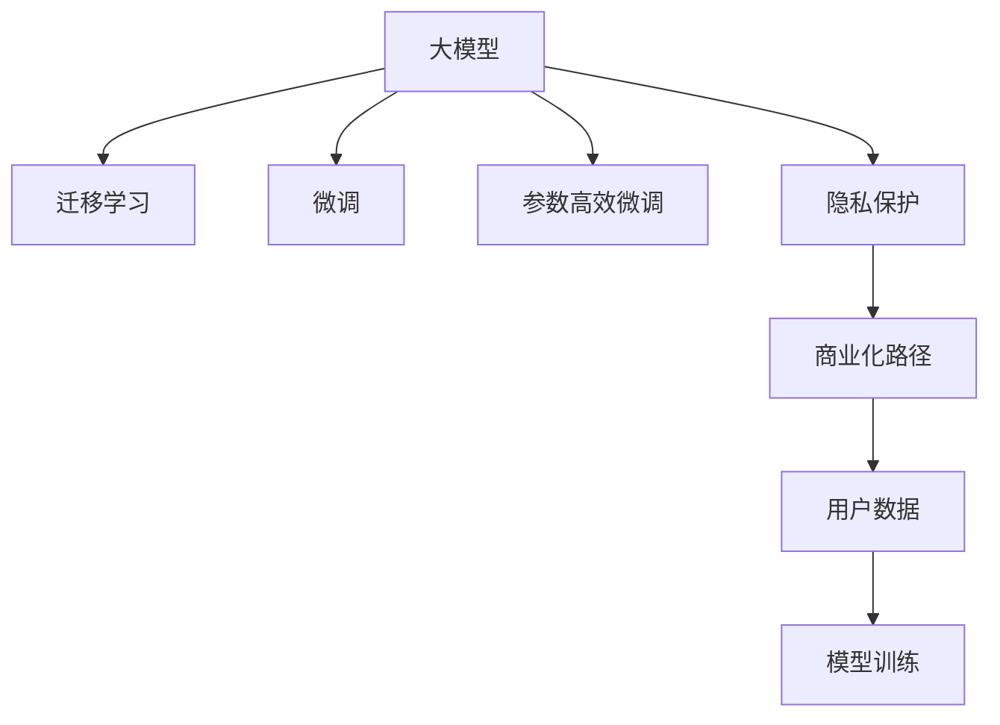

                 

# 大模型应用层的创业挑战

在人工智能领域，尤其是大模型应用层，创业公司面临着一系列独特的挑战。这些挑战不仅涉及到技术层面，还包括市场策略、团队建设、商业化转型等多个维度。本文将从这些方面进行详细分析，以期帮助创业者更好地理解大模型应用的创业路径和应对策略。

## 1. 背景介绍

### 1.1 问题由来
近年来，大模型在自然语言处理、计算机视觉、语音识别等领域的广泛应用，极大地推动了人工智能技术的发展。然而，大模型应用的创业公司在快速发展的同时，也面临着诸多挑战。这些挑战源自技术实现难度、市场竞争激烈、数据隐私安全等多个方面。深入理解这些挑战，并制定有效的应对策略，是确保大模型应用创业成功的关键。

### 1.2 问题核心关键点
大模型应用层的创业挑战主要包括以下几个方面：
1. 技术实现难度高。大模型通常需要高算力、大数据和复杂架构，技术门槛较高。
2. 数据隐私安全问题。大模型需要大量数据进行训练，数据隐私保护至关重要。
3. 市场竞争激烈。大模型领域竞争者众多，创业公司需不断创新以获得竞争优势。
4. 商业化转型难度大。技术研发与市场需求之间存在脱节，商业化路径需精心设计。
5. 团队建设挑战。大模型应用需要跨学科、高技能的团队，人才招募和培养难度大。

## 2. 核心概念与联系

### 2.1 核心概念概述

为更好地理解大模型应用层的创业挑战，本节将介绍几个密切相关的核心概念：

- **大模型(Large Model)**：指具有数百亿至数千亿参数的深度学习模型，如BERT、GPT-3、T5等。大模型在处理大规模数据集时表现出卓越的性能。

- **迁移学习(Transfer Learning)**：指在大规模预训练模型上，通过微调等方式，适应特定任务。大模型迁移学习在大规模数据集上预训练，并在特定任务上进行微调，能够有效提升模型效果。

- **微调(Fine-Tuning)**：在大模型上，通过特定任务的数据集进行有监督学习，优化模型参数，使其适应新任务。

- **参数高效微调(Parameter-Efficient Fine-Tuning, PEFT)**：只更新模型的少量参数，保留大部分预训练权重不变，以提高微调效率。

- **隐私保护(Portionate Privacy)**：指在模型训练和应用中，采取技术和管理措施，确保用户数据隐私安全。

- **商业化路径(Commercialization Path)**：将大模型应用从技术研究转化为实际产品或服务的策略和方法。

这些核心概念之间的逻辑关系可以通过以下Mermaid流程图来展示：



这个流程图展示了各个概念之间的关系：

1. 大模型通过迁移学习获得基础能力。
2. 微调使得大模型更好地适应特定任务。
3. 参数高效微调提高微调效率，保留预训练知识。
4. 隐私保护确保用户数据安全。
5. 商业化路径将模型应用转化为实际产品或服务。

## 3. 核心算法原理 & 具体操作步骤
### 3.1 算法原理概述

大模型应用层的创业挑战主要集中在以下几个方面：

- **技术实现难度**：大模型的训练和应用需要强大的算力支持，数据预处理、模型训练和推理过程复杂，技术门槛较高。
- **数据隐私保护**：大模型训练过程中，需要大量标注数据，数据隐私保护成为关键问题。
- **市场竞争激烈**：大模型应用领域竞争者众多，创业公司需不断创新以获取竞争优势。
- **商业化转型难度**：将技术研究成果转化为实际产品或服务，面临诸多挑战。
- **团队建设挑战**：大模型应用需要跨学科、高技能的团队，人才招募和培养难度大。

### 3.2 算法步骤详解

针对这些挑战，大模型应用层的创业公司需要采取以下步骤：

**Step 1: 技术选型与架构设计**
- 根据应用场景和技术栈，选择合适的预训练模型。如BERT、GPT等。
- 设计符合业务需求的模型架构，包括输入输出层、损失函数、优化器等。

**Step 2: 数据处理与隐私保护**
- 收集和预处理标注数据，确保数据质量。
- 采用差分隐私、联邦学习等技术，保护用户数据隐私。

**Step 3: 微调与优化**
- 在预训练模型基础上进行微调，适应特定任务。
- 使用参数高效微调、对抗训练、正则化等技术，优化模型性能。

**Step 4: 商业化策略**
- 设计合理的商业化路径，如API接口、云服务、订阅模式等。
- 进行市场调研，明确目标用户群体和需求，制定市场推广策略。

**Step 5: 团队建设与文化营造**
- 组建跨学科、高技能的团队，吸引顶尖人才。
- 营造开放、包容、创新的企业文化，激发团队创造力。

### 3.3 算法优缺点

大模型应用层的创业方法具有以下优点：

1. **高效性能**：大模型在处理大规模数据时表现出卓越的性能，能够快速适应新任务。
2. **广泛适用**：大模型在多个领域都有应用，能够满足多样化的市场需求。
3. **可扩展性强**：大模型的架构灵活，能够适应不同的应用场景和数据规模。

同时，该方法也存在以下局限性：

1. **高算力需求**：大模型训练和应用需要高算力支持，创业公司需投入大量资金。
2. **数据依赖性强**：大模型的性能依赖于标注数据的质量和数量，数据获取成本高。
3. **市场竞争激烈**：大模型领域竞争者众多，创业公司需不断创新以获取竞争优势。
4. **商业化挑战**：从技术研发到市场应用的转型，需进行复杂的管理和战略设计。
5. **人才需求高**：大模型应用需要跨学科、高技能的团队，人才招募和培养难度大。

尽管存在这些局限性，但大模型应用层仍是大数据时代的重要创新方向。通过不断优化技术实现、加强数据隐私保护、提升商业化能力，大模型应用有望成为人工智能产业的重要驱动力。

### 3.4 算法应用领域

大模型应用层在多个领域都有广泛应用，包括但不限于：

- **自然语言处理(NLP)**：机器翻译、文本分类、情感分析、问答系统等。
- **计算机视觉(CV)**：图像识别、目标检测、人脸识别、图像生成等。
- **语音识别(Speech Recognition)**：语音识别、文本转语音、情感识别等。
- **医疗健康**：疾病诊断、医学影像分析、健康预测等。
- **金融科技**：风险评估、欺诈检测、信用评分等。
- **智能制造**：设备监测、故障预测、质量控制等。

这些应用领域展示了大模型在实际场景中的巨大潜力，也为创业公司提供了广阔的发展空间。

## 4. 数学模型和公式 & 详细讲解  
### 4.1 数学模型构建

大模型应用层的创业挑战涉及多个方面的数学建模，本节将重点介绍其中的几个关键模型：

- **大模型预训练模型**：通常使用自回归或自编码模型进行预训练，学习通用的语言表示。如BERT、GPT等。
- **迁移学习模型**：在预训练模型基础上，通过微调适应特定任务。如使用BERT模型进行文本分类任务。
- **隐私保护模型**：采用差分隐私、联邦学习等技术，保护用户数据隐私。如联邦学习模型。

### 4.2 公式推导过程

以下是几个关键模型的公式推导过程：

**BERT预训练模型**：
$$
H_i = Attention(Q_i, K_i, V_i) + [0]
$$
其中 $H_i$ 为输入向量 $X_i$ 的表示，$Attention(Q_i, K_i, V_i)$ 为注意力机制计算出的表示。

**BERT微调模型**：
$$
\hat{Y}_i = Softmax(W^Ty_i + b) = \frac{\exp(a_i)}{\sum_{j=1}^N \exp(a_j)}
$$
其中 $y_i$ 为输入 $X_i$ 的真实标签，$W$ 和 $b$ 为模型参数，$softmax$ 函数用于将输出映射到标签空间。

**差分隐私**：
$$
\epsilon-DP: \mathbb{P}[D(X_i, Y_i) \leq \delta] \leq \exp(-\epsilon)
$$
其中 $\epsilon$ 为隐私保护参数，$\delta$ 为偏差概率。

**联邦学习**：
$$
\theta_{local} = \theta_{global} + f(X_i, y_i)
$$
其中 $\theta_{local}$ 为本地模型参数，$f$ 为本地训练函数，$y_i$ 为样本标签。

### 4.3 案例分析与讲解

以BERT模型在情感分析任务上的微调为例，详细讲解其数学模型和优化策略。

假设情感分析任务的数据集为 $D = \{(x_i, y_i)\}_{i=1}^N$，其中 $x_i$ 为输入文本，$y_i$ 为情感标签。定义BERT模型为 $M_{\theta}$，其中 $\theta$ 为模型参数。

定义情感分析任务的损失函数为交叉熵损失函数：
$$
\mathcal{L}(\theta) = -\frac{1}{N}\sum_{i=1}^N \log \hat{y}_i
$$

微调过程为：
1. 收集标注数据，划分训练集、验证集和测试集。
2. 加载预训练的BERT模型，添加输出层和交叉熵损失函数。
3. 设置微调超参数，包括学习率、优化器、正则化等。
4. 使用数据集进行微调，优化模型参数。
5. 在验证集上评估模型性能，调整超参数。
6. 在测试集上评估模型性能，输出最终结果。

通过上述过程，可以训练出适应情感分析任务的BERT模型，并在实际应用中取得良好的性能。

## 5. 项目实践：代码实例和详细解释说明
### 5.1 开发环境搭建

在进行大模型应用层创业项目开发前，需要准备好开发环境。以下是使用Python进行PyTorch开发的环境配置流程：

1. 安装Anaconda：从官网下载并安装Anaconda，用于创建独立的Python环境。

2. 创建并激活虚拟环境：
```bash
conda create -n pytorch-env python=3.8 
conda activate pytorch-env
```

3. 安装PyTorch：根据CUDA版本，从官网获取对应的安装命令。例如：
```bash
conda install pytorch torchvision torchaudio cudatoolkit=11.1 -c pytorch -c conda-forge
```

4. 安装Transformers库：
```bash
pip install transformers
```

5. 安装各类工具包：
```bash
pip install numpy pandas scikit-learn matplotlib tqdm jupyter notebook ipython
```

完成上述步骤后，即可在`pytorch-env`环境中开始项目开发。

### 5.2 源代码详细实现

下面我以BERT模型在情感分析任务上的微调为例，给出使用Transformers库进行大模型微调的PyTorch代码实现。

首先，定义情感分析任务的数据处理函数：

```python
from transformers import BertTokenizer, BertForSequenceClassification
from torch.utils.data import Dataset, DataLoader
import torch
import numpy as np

class SentimentDataset(Dataset):
    def __init__(self, texts, labels):
        self.texts = texts
        self.labels = labels
        self.tokenizer = BertTokenizer.from_pretrained('bert-base-uncased')

    def __len__(self):
        return len(self.texts)
    
    def __getitem__(self, item):
        text = self.texts[item]
        label = self.labels[item]
        
        encoding = self.tokenizer(text, return_tensors='pt', truncation=True)
        input_ids = encoding['input_ids'][0]
        attention_mask = encoding['attention_mask'][0]
        
        return {'input_ids': input_ids, 'attention_mask': attention_mask, 'labels': torch.tensor(label, dtype=torch.long)}

tokenizer = BertTokenizer.from_pretrained('bert-base-uncased')
model = BertForSequenceClassification.from_pretrained('bert-base-uncased', num_labels=2)
optimizer = AdamW(model.parameters(), lr=2e-5)

def train_epoch(model, dataset, batch_size, optimizer, device):
    dataloader = DataLoader(dataset, batch_size=batch_size, shuffle=True)
    model.train()
    epoch_loss = 0
    for batch in dataloader:
        input_ids = batch['input_ids'].to(device)
        attention_mask = batch['attention_mask'].to(device)
        labels = batch['labels'].to(device)
        model.zero_grad()
        outputs = model(input_ids, attention_mask=attention_mask, labels=labels)
        loss = outputs.loss
        epoch_loss += loss.item()
        loss.backward()
        optimizer.step()
    return epoch_loss / len(dataloader)

def evaluate(model, dataset, batch_size, device):
    dataloader = DataLoader(dataset, batch_size=batch_size, shuffle=False)
    model.eval()
    preds, labels = [], []
    with torch.no_grad():
        for batch in dataloader:
            input_ids = batch['input_ids'].to(device)
            attention_mask = batch['attention_mask'].to(device)
            labels = batch['labels'].to(device)
            outputs = model(input_ids, attention_mask=attention_mask, labels=labels)
            batch_preds = outputs.logits.argmax(dim=1).to('cpu').tolist()
            batch_labels = batch_labels.to('cpu').tolist()
            for pred, label in zip(batch_preds, batch_labels):
                preds.append(pred)
                labels.append(label)
                
    print(classification_report(labels, preds))
```

然后，定义训练和评估函数：

```python
from sklearn.metrics import classification_report
from transformers import AdamW

def train(model, train_dataset, validation_dataset, batch_size, num_epochs, optimizer, device):
    for epoch in range(num_epochs):
        train_loss = train_epoch(model, train_dataset, batch_size, optimizer, device)
        val_loss = evaluate(model, validation_dataset, batch_size, device)
        print(f'Epoch {epoch+1}/{num_epochs}, train loss: {train_loss:.3f}, validation loss: {val_loss:.3f}')
        if val_loss < best_loss:
            best_loss = val_loss
            best_model = model
    return best_model

def evaluate(model, test_dataset, batch_size, device):
    test_loss = evaluate(model, test_dataset, batch_size, device)
    print(f'Test loss: {test_loss:.3f}')
    return test_loss
```

最后，启动训练流程并在测试集上评估：

```python
train_dataset = SentimentDataset(train_texts, train_labels)
validation_dataset = SentimentDataset(validation_texts, validation_labels)
test_dataset = SentimentDataset(test_texts, test_labels)

device = torch.device('cuda') if torch.cuda.is_available() else torch.device('cpu')
best_model = train(model, train_dataset, validation_dataset, batch_size=16, num_epochs=5, optimizer=optimizer, device=device)
test_loss = evaluate(model, test_dataset, batch_size=16, device=device)

print(f'Best model test loss: {test_loss:.3f}')
```

以上就是使用PyTorch对BERT进行情感分析任务微调的完整代码实现。可以看到，得益于Transformers库的强大封装，我们可以用相对简洁的代码完成BERT模型的加载和微调。

### 5.3 代码解读与分析

让我们再详细解读一下关键代码的实现细节：

**SentimentDataset类**：
- `__init__`方法：初始化文本、标签和分词器等关键组件。
- `__len__`方法：返回数据集的样本数量。
- `__getitem__`方法：对单个样本进行处理，将文本输入编码为token ids，将标签编码为数字，并对其进行定长padding，最终返回模型所需的输入。

**模型训练和评估函数**：
- 使用PyTorch的DataLoader对数据集进行批次化加载，供模型训练和推理使用。
- 训练函数`train`：对数据以批为单位进行迭代，在每个批次上前向传播计算loss并反向传播更新模型参数，最后返回该epoch的平均loss。
- 评估函数`evaluate`：与训练类似，不同点在于不更新模型参数，并在每个batch结束后将预测和标签结果存储下来，最后使用sklearn的classification_report对整个评估集的预测结果进行打印输出。

**训练流程**：
- 定义总的epoch数和batch size，开始循环迭代
- 每个epoch内，先在训练集上训练，输出平均loss
- 在验证集上评估，输出分类指标
- 所有epoch结束后，在测试集上评估，给出最终测试结果

可以看到，PyTorch配合Transformers库使得BERT微调的代码实现变得简洁高效。开发者可以将更多精力放在数据处理、模型改进等高层逻辑上，而不必过多关注底层的实现细节。

当然，工业级的系统实现还需考虑更多因素，如模型的保存和部署、超参数的自动搜索、更灵活的任务适配层等。但核心的微调范式基本与此类似。

## 6. 实际应用场景
### 6.1 智能客服系统

基于大模型应用层的智能客服系统，可以广泛应用于智能客服系统的构建。传统客服往往需要配备大量人力，高峰期响应缓慢，且一致性和专业性难以保证。而使用微调后的对话模型，可以7x24小时不间断服务，快速响应客户咨询，用自然流畅的语言解答各类常见问题。

在技术实现上，可以收集企业内部的历史客服对话记录，将问题和最佳答复构建成监督数据，在此基础上对预训练对话模型进行微调。微调后的对话模型能够自动理解用户意图，匹配最合适的答案模板进行回复。对于客户提出的新问题，还可以接入检索系统实时搜索相关内容，动态组织生成回答。如此构建的智能客服系统，能大幅提升客户咨询体验和问题解决效率。

### 6.2 金融舆情监测

金融机构需要实时监测市场舆论动向，以便及时应对负面信息传播，规避金融风险。传统的人工监测方式成本高、效率低，难以应对网络时代海量信息爆发的挑战。基于大模型应用层的文本分类和情感分析技术，为金融舆情监测提供了新的解决方案。

具体而言，可以收集金融领域相关的新闻、报道、评论等文本数据，并对其进行主题标注和情感标注。在此基础上对预训练语言模型进行微调，使其能够自动判断文本属于何种主题，情感倾向是正面、中性还是负面。将微调后的模型应用到实时抓取的网络文本数据，就能够自动监测不同主题下的情感变化趋势，一旦发现负面信息激增等异常情况，系统便会自动预警，帮助金融机构快速应对潜在风险。

### 6.3 个性化推荐系统

当前的推荐系统往往只依赖用户的历史行为数据进行物品推荐，无法深入理解用户的真实兴趣偏好。基于大模型应用层的个性化推荐系统，可以更好地挖掘用户行为背后的语义信息，从而提供更精准、多样的推荐内容。

在实践中，可以收集用户浏览、点击、评论、分享等行为数据，提取和用户交互的物品标题、描述、标签等文本内容。将文本内容作为模型输入，用户的后续行为（如是否点击、购买等）作为监督信号，在此基础上微调预训练语言模型。微调后的模型能够从文本内容中准确把握用户的兴趣点。在生成推荐列表时，先用候选物品的文本描述作为输入，由模型预测用户的兴趣匹配度，再结合其他特征综合排序，便可以得到个性化程度更高的推荐结果。

### 6.4 未来应用展望

随着大模型应用层的不断发展，基于微调范式将在更多领域得到应用，为传统行业带来变革性影响。

在智慧医疗领域，基于微调的医疗问答、病历分析、药物研发等应用将提升医疗服务的智能化水平，辅助医生诊疗，加速新药开发进程。

在智能教育领域，微调技术可应用于作业批改、学情分析、知识推荐等方面，因材施教，促进教育公平，提高教学质量。

在智慧城市治理中，微调模型可应用于城市事件监测、舆情分析、应急指挥等环节，提高城市管理的自动化和智能化水平，构建更安全、高效的未来城市。

此外，在企业生产、社会治理、文娱传媒等众多领域，基于大模型应用层的人工智能应用也将不断涌现，为经济社会发展注入新的动力。相信随着预训练语言模型和微调方法的持续演进，大模型应用层必将在更广阔的应用领域大放异彩，深刻影响人类的生产生活方式。

## 7. 工具和资源推荐
### 7.1 学习资源推荐

为了帮助开发者系统掌握大模型应用层的理论基础和实践技巧，这里推荐一些优质的学习资源：

1. 《Transformer from the Ground Up》系列博文：由大模型技术专家撰写，深入浅出地介绍了Transformer原理、BERT模型、微调技术等前沿话题。

2. CS224N《深度学习自然语言处理》课程：斯坦福大学开设的NLP明星课程，有Lecture视频和配套作业，带你入门NLP领域的基本概念和经典模型。

3. 《Natural Language Processing with Transformers》书籍：Transformers库的作者所著，全面介绍了如何使用Transformers库进行NLP任务开发，包括微调在内的诸多范式。

4. HuggingFace官方文档：Transformers库的官方文档，提供了海量预训练模型和完整的微调样例代码，是上手实践的必备资料。

5. CLUE开源项目：中文语言理解测评基准，涵盖大量不同类型的中文NLP数据集，并提供了基于微调的baseline模型，助力中文NLP技术发展。

通过对这些资源的学习实践，相信你一定能够快速掌握大模型应用层的精髓，并用于解决实际的NLP问题。
###  7.2 开发工具推荐

高效的开发离不开优秀的工具支持。以下是几款用于大模型应用层开发的常用工具：

1. PyTorch：基于Python的开源深度学习框架，灵活动态的计算图，适合快速迭代研究。大部分预训练语言模型都有PyTorch版本的实现。

2. TensorFlow：由Google主导开发的开源深度学习框架，生产部署方便，适合大规模工程应用。同样有丰富的预训练语言模型资源。

3. Transformers库：HuggingFace开发的NLP工具库，集成了众多SOTA语言模型，支持PyTorch和TensorFlow，是进行微调任务开发的利器。

4. Weights & Biases：模型训练的实验跟踪工具，可以记录和可视化模型训练过程中的各项指标，方便对比和调优。与主流深度学习框架无缝集成。

5. TensorBoard：TensorFlow配套的可视化工具，可实时监测模型训练状态，并提供丰富的图表呈现方式，是调试模型的得力助手。

6. Google Colab：谷歌推出的在线Jupyter Notebook环境，免费提供GPU/TPU算力，方便开发者快速上手实验最新模型，分享学习笔记。

合理利用这些工具，可以显著提升大模型应用层的开发效率，加快创新迭代的步伐。

### 7.3 相关论文推荐

大模型应用层的创业挑战涉及多个方面的研究，以下是几篇奠基性的相关论文，推荐阅读：

1. Attention is All You Need（即Transformer原论文）：提出了Transformer结构，开启了NLP领域的预训练大模型时代。

2. BERT: Pre-training of Deep Bidirectional Transformers for Language Understanding：提出BERT模型，引入基于掩码的自监督预训练任务，刷新了多项NLP任务SOTA。

3. Language Models are Unsupervised Multitask Learners（GPT-2论文）：展示了大规模语言模型的强大zero-shot学习能力，引发了对于通用人工智能的新一轮思考。

4. Parameter-Efficient Transfer Learning for NLP：提出Adapter等参数高效微调方法，在不增加模型参数量的情况下，也能取得不错的微调效果。

5. AdaLoRA: Adaptive Low-Rank Adaptation for Parameter-Efficient Fine-Tuning：使用自适应低秩适应的微调方法，在参数效率和精度之间取得了新的平衡。

6. Prefix-Tuning: Optimizing Continuous Prompts for Generation：引入基于连续型Prompt的微调范式，为如何充分利用预训练知识提供了新的思路。

这些论文代表了大模型应用层的创业挑战的研究脉络。通过学习这些前沿成果，可以帮助研究者把握学科前进方向，激发更多的创新灵感。

## 8. 总结：未来发展趋势与挑战

### 8.1 总结

本文对大模型应用层的创业挑战进行了全面系统的介绍。首先阐述了大模型应用层的研究背景和意义，明确了微调在大模型应用中的重要地位。其次，从原理到实践，详细讲解了大模型应用层的数学模型和优化策略，给出了微调任务开发的完整代码实例。同时，本文还广泛探讨了微调方法在多个行业领域的应用前景，展示了微调范式的巨大潜力。最后，本文精选了微调技术的各类学习资源，力求为读者提供全方位的技术指引。

通过本文的系统梳理，可以看到，基于大模型应用层的微调方法在多个领域具有广泛应用，其高效性能、广泛适用性和灵活性使其成为大模型应用的重要驱动力。

### 8.2 未来发展趋势

展望未来，大模型应用层将呈现以下几个发展趋势：

1. **技术实现更加高效**：随着硬件算力的提升和模型架构的优化，大模型应用层的技术实现将更加高效，能够更好地适应各类复杂任务。

2. **数据隐私保护强化**：随着数据隐私保护法规的完善，大模型应用层将采用更多隐私保护技术，确保用户数据的安全。

3. **市场竞争更加激烈**：大模型应用层领域将吸引更多企业加入，市场竞争将更加激烈。

4. **商业化路径更加灵活**：根据不同行业和客户需求，设计多样化的商业化路径，实现更好的市场渗透和收益。

5. **跨领域融合更加紧密**：大模型应用层将与其他人工智能技术如知识图谱、自然语言推理等深度融合，提升系统的智能化水平。

6. **用户需求更加多样化**：随着用户需求的变化，大模型应用层将提供更加多样化的服务和产品，满足不同用户需求。

这些趋势凸显了大模型应用层的广阔前景。随着技术的不断进步和市场的持续拓展，大模型应用层必将成为人工智能产业的重要组成部分。

### 8.3 面临的挑战

尽管大模型应用层具有广阔的发展前景，但在迈向更加智能化、普适化应用的过程中，它仍面临着诸多挑战：

1. **技术实现难度高**：大模型应用层对算力、数据和架构的要求较高，技术实现难度较大。

2. **数据隐私保护问题**：大规模数据集训练需要大量用户数据，数据隐私保护成为关键问题。

3. **市场竞争激烈**：大模型应用层领域竞争者众多，创业公司需不断创新以获取竞争优势。

4. **商业化转型难度大**：从技术研发到市场应用的转型，需进行复杂的管理和战略设计。

5. **人才需求高**：大模型应用层需要跨学科、高技能的团队，人才招募和培养难度大。

尽管存在这些挑战，但通过不断优化技术实现、加强数据隐私保护、提升商业化能力，大模型应用层有望成为人工智能产业的重要驱动力。

### 8.4 研究展望

面对大模型应用层所面临的挑战，未来的研究需要在以下几个方面寻求新的突破：

1. **优化技术实现**：开发更加高效、灵活的模型架构，提升大模型应用层的性能和可用性。

2. **强化隐私保护**：研究更加先进的隐私保护技术，确保用户数据的安全。

3. **创新商业化路径**：根据不同行业和客户需求，设计多样化的商业化路径，实现更好的市场渗透和收益。

4. **提升跨领域融合能力**：与其他人工智能技术深度融合，提升系统的智能化水平。

5. **满足多样化用户需求**：提供更加多样化的服务和产品，满足不同用户需求。

这些研究方向将引领大模型应用层技术的不断进步，为构建安全、可靠、可解释、可控的智能系统铺平道路。面向未来，大模型应用层需要与其他人工智能技术进行更深入的融合，共同推动自然语言理解和智能交互系统的进步。

## 9. 附录：常见问题与解答

**Q1：大模型应用层的创业公司如何平衡技术研发和市场推广？**

A: 创业公司需要制定科学的市场调研和产品规划，将技术研发与市场需求紧密结合。可以通过与用户交流、参与行业展会等方式获取市场反馈，指导技术研发方向。同时，可以组建专门的市场推广团队，进行品牌建设、用户教育、销售转化等工作，提升市场渗透率。

**Q2：如何应对数据隐私保护法规的挑战？**

A: 创业公司应采用差分隐私、联邦学习等技术，确保用户数据的安全。可以采用差分隐私技术，对数据进行扰动，确保个人隐私不被泄露。同时，可以采用联邦学习技术，在本地进行模型训练，只传递模型参数，不传输原始数据，从而保护用户隐私。

**Q3：如何提高大模型应用层的算力利用效率？**

A: 可以通过梯度累积、混合精度训练、模型并行等技术，提高大模型应用层的算力利用效率。例如，使用梯度累积技术，在一定条件下将多个小批量梯度累加为一个大批量梯度，减少内存消耗，提高计算效率。

**Q4：大模型应用层如何优化商业化路径？**

A: 大模型应用层可以通过API接口、云服务、订阅模式等策略进行商业化。可以提供API接口，方便企业集成使用。可以推出云服务，提供弹性算力和灵活定价。可以采用订阅模式，按使用量计费，降低企业成本。

**Q5：大模型应用层如何培养跨学科团队？**

A: 创业公司可以通过吸引顶尖人才、合作高校院所、参加行业交流等方式，培养跨学科团队。可以设立专门的人才招聘渠道，吸引来自不同领域的高素质人才。可以与高校院所合作，开展联合研究项目，培养未来的技术人才。可以参加行业交流活动，了解行业最新动态和技术趋势。

通过以上问题的解答，希望能帮助大模型应用层的创业公司更好地理解创业挑战，并制定有效的应对策略。

---

作者：禅与计算机程序设计艺术 / Zen and the Art of Computer Programming

