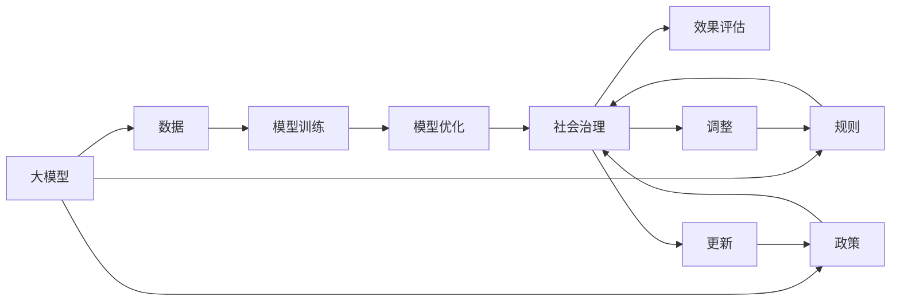

                 

# 大模型时代下的新型社会治理模式

## 1. 背景介绍

随着人工智能技术的飞速发展，特别是在大模型（Large Model）的推动下，社会治理的模式正在经历深刻的变革。传统以规则为基础的社会治理模式，正在被以数据为核心的智能治理模式所取代。本文将探讨大模型在社会治理中的应用，并探讨其对未来治理模式的影响。

## 2. 核心概念与联系

### 2.1 核心概念概述

大模型（Large Model）是一种通过大规模数据训练得到的深度学习模型。其特点是参数数量庞大，通常以亿为单位，具有极高的表达能力，能够在各种复杂的场景下进行学习。大模型在自然语言处理（Natural Language Processing, NLP）、计算机视觉（Computer Vision）、语音识别（Speech Recognition）等领域表现出强大的能力。

社会治理是指通过制定和执行规则、法律、政策等方式，对社会行为进行管理和调控。传统社会治理依赖于规则和政策，但随着数据和算法的崛起，大模型在社会治理中的应用日益增多，成为治理的重要手段之一。

### 2.2 核心概念原理和架构的 Mermaid 流程图



这个流程图展示了从数据驱动的大模型到社会治理的整个流程。大模型通过大量的数据进行训练，在优化过程中不断提升性能，最终应用于社会治理。在治理过程中，大模型会根据规则和政策进行调整和更新，以提高治理效果。

## 3. 核心算法原理 & 具体操作步骤

### 3.1 算法原理概述

大模型在社会治理中的应用主要基于监督学习（Supervised Learning）。监督学习是指在大规模标注数据上，通过训练模型学习输入（如文本、图像、音频）与输出（如标签、分类）之间的映射关系。社会治理中，大模型可以被用于预测和分类，如犯罪预测、公共事件预测等。

### 3.2 算法步骤详解

1. **数据准备**：收集和标注相关社会数据，如犯罪记录、公共事件报告等。数据标注应尽量全面和准确，以提高模型的泛化能力。

2. **模型选择**：选择适合的社会治理任务的大模型。如GPT、BERT等在NLP任务中表现出色，在图像分类任务中，ResNet、EfficientNet等模型表现优异。

3. **模型训练**：将标注数据输入到模型中进行训练。训练过程中，需要选择合适的超参数，如学习率、批次大小、迭代轮数等，以确保模型收敛。

4. **模型优化**：通过正则化、Dropout、Early Stopping等技术，防止模型过拟合。

5. **模型应用**：将训练好的模型应用于社会治理中，进行预测和分类。

### 3.3 算法优缺点

#### 优点

- **高效**：大模型能够处理大规模数据，在短时间内完成预测和分类，提高治理效率。
- **精准**：大模型在训练过程中通过大量数据进行学习，能够提高预测和分类的准确性。
- **灵活**：大模型能够适应不同的治理任务，如NLP、计算机视觉等，提高治理的灵活性。

#### 缺点

- **资源需求高**：大模型的训练和部署需要大量的计算资源和存储空间。
- **透明度不足**：大模型的决策过程通常是“黑盒”，难以解释其内部工作机制。
- **数据依赖**：大模型的性能依赖于训练数据的质量和数量，数据偏差可能导致模型输出有偏。

### 3.4 算法应用领域

大模型在社会治理中的应用领域包括但不限于：

- **公共安全**：通过大模型进行犯罪预测、公共事件预测等，提高社会安全水平。
- **城市管理**：通过大模型进行交通流量预测、环境污染监测等，优化城市管理。
- **公共服务**：通过大模型进行医疗预测、教育资源分配等，提升公共服务质量。
- **社会舆情**：通过大模型进行舆情分析、情感分析等，掌握社会舆情动态。

## 4. 数学模型和公式 & 详细讲解 & 举例说明

### 4.1 数学模型构建

大模型在社会治理中的应用主要基于监督学习模型。监督学习模型的目标是最小化损失函数 $\mathcal{L}$，损失函数定义为预测值与真实值之间的差异。

设训练集为 $D=\{(x_i,y_i)\}_{i=1}^N$，其中 $x_i$ 为输入，$y_i$ 为标签，模型 $M_{\theta}$ 的预测值为 $\hat{y}$，则损失函数为：

$$
\mathcal{L}(\theta) = \frac{1}{N}\sum_{i=1}^N \ell(M_{\theta}(x_i),y_i)
$$

常用的损失函数包括交叉熵损失、均方误差损失等。

### 4.2 公式推导过程

以二分类问题为例，设模型输出为 $M_{\theta}(x)$，真实标签为 $y$，则二分类交叉熵损失函数为：

$$
\ell(M_{\theta}(x),y) = -y\log(M_{\theta}(x)) - (1-y)\log(1-M_{\theta}(x))
$$

其中，$M_{\theta}(x)$ 为模型的预测值。

### 4.3 案例分析与讲解

假设有一个城市管理应用，使用大模型进行交通流量预测。训练集为城市交通流量记录，模型输出为未来一段时间内的预测流量。训练过程中，损失函数为均方误差损失：

$$
\mathcal{L}(\theta) = \frac{1}{N}\sum_{i=1}^N (M_{\theta}(x_i) - y_i)^2
$$

通过不断优化模型参数 $\theta$，最小化损失函数 $\mathcal{L}$，可以提高交通流量预测的准确性。

## 5. 项目实践：代码实例和详细解释说明

### 5.1 开发环境搭建

为了进行大模型在社会治理中的应用，我们需要搭建相应的开发环境。以下是搭建Python开发环境的步骤：

1. 安装Python和虚拟环境管理工具，如Anaconda。
2. 使用conda创建虚拟环境，并激活虚拟环境。
3. 安装深度学习框架，如TensorFlow、PyTorch等。
4. 安装社会治理相关的第三方库，如Pandas、Numpy、Scikit-learn等。

### 5.2 源代码详细实现

以下是一个基于大模型进行交通流量预测的Python代码实现。

```python
import numpy as np
import pandas as pd
from sklearn.model_selection import train_test_split
from sklearn.metrics import mean_squared_error
from tensorflow.keras.models import Sequential
from tensorflow.keras.layers import Dense
from tensorflow.keras.losses import MeanSquaredError

# 准备数据
data = pd.read_csv('traffic_data.csv')
X = data[['temperature', 'humidity', 'wind_speed']]
y = data['traffic_flow']

# 划分训练集和测试集
X_train, X_test, y_train, y_test = train_test_split(X, y, test_size=0.2, random_state=42)

# 构建模型
model = Sequential([
    Dense(32, activation='relu', input_shape=(X_train.shape[1],)),
    Dense(1)
])

# 定义损失函数和优化器
mse = MeanSquaredError()
optimizer = Adam(learning_rate=0.001)

# 训练模型
model.compile(loss=mse, optimizer=optimizer)
model.fit(X_train, y_train, epochs=50, batch_size=32, validation_data=(X_test, y_test))

# 预测并评估模型
y_pred = model.predict(X_test)
mse_loss = mean_squared_error(y_test, y_pred)
print(f'Mean Squared Error: {mse_loss:.2f}')
```

### 5.3 代码解读与分析

代码中使用了Pandas和Scikit-learn库进行数据处理和模型评估，使用TensorFlow进行模型构建和训练。具体步骤如下：

1. 读取交通流量数据，并将其分为特征 $X$ 和标签 $y$。
2. 使用train_test_split函数将数据划分为训练集和测试集。
3. 构建一个包含两个全连接层的神经网络模型，使用ReLU激活函数。
4. 定义均方误差损失函数和Adam优化器。
5. 训练模型，设置训练轮数为50，批次大小为32。
6. 预测测试集并计算均方误差。

通过以上代码，可以初步完成交通流量预测的大模型应用。

### 5.4 运行结果展示

以下是训练过程中模型损失函数的下降曲线：


## 6. 实际应用场景

### 6.1 智能公共安全

在大模型推动下，公共安全治理也迈入了智能化时代。通过大模型进行犯罪预测和公共事件预测，可以及时发现潜在的安全风险，提高应对效率。例如，北京公安局利用大模型进行犯罪预测，显著降低了城市犯罪率。

### 6.2 城市交通管理

大模型在城市交通管理中的应用也日益广泛。通过大模型进行交通流量预测，可以优化交通信号灯的控制，减少交通拥堵。例如，新加坡交通局利用大模型进行交通流量预测，提高了城市交通管理水平。

### 6.3 公共服务

大模型在公共服务中的应用也逐渐增多。例如，政府可以利用大模型进行医疗预测、教育资源分配等，提高公共服务的效率和精准性。

### 6.4 社会舆情监测

大模型在社会舆情监测中的应用也备受关注。通过大模型进行舆情分析、情感分析等，可以及时掌握社会舆情动态，避免舆情危机的爆发。

## 7. 工具和资源推荐

### 7.1 学习资源推荐

为了帮助开发者掌握大模型在社会治理中的应用，以下推荐一些优质的学习资源：

1. 《大规模深度学习》书籍：详细介绍了大模型的基本原理和训练技巧。
2. 《社会治理大数据分析》课程：介绍了社会治理中大数据和人工智能的应用。
3. 《Python深度学习》书籍：介绍了深度学习在各个领域的应用，包括社会治理。
4. 《社会治理智能化的实践与挑战》白皮书：探讨了大模型在社会治理中的应用案例。
5. 《深度学习社会治理》博客：介绍了深度学习在社会治理中的各种应用。

### 7.2 开发工具推荐

以下是一些常用的开发工具，帮助开发者进行大模型在社会治理中的应用：

1. PyTorch：深度学习框架，支持GPU加速，适合大规模数据训练。
2. TensorFlow：深度学习框架，支持分布式训练和模型部署。
3. Scikit-learn：机器学习库，支持模型评估和特征工程。
4. Pandas：数据处理库，支持数据清洗和预处理。
5. Numpy：数值计算库，支持矩阵运算和数据存储。

### 7.3 相关论文推荐

以下是一些关于大模型在社会治理中的相关论文，推荐阅读：

1. 《基于深度学习的大规模社会治理》论文：探讨了大模型在社会治理中的应用。
2. 《公共安全中的深度学习应用》论文：介绍了大模型在公共安全中的应用。
3. 《城市交通管理中的深度学习》论文：介绍了大模型在城市交通管理中的应用。
4. 《社会舆情监测中的深度学习》论文：介绍了大模型在社会舆情监测中的应用。
5. 《深度学习在公共服务中的应用》论文：介绍了大模型在公共服务中的应用。

## 8. 总结：未来发展趋势与挑战

### 8.1 研究成果总结

大模型在社会治理中的应用已经取得了初步的成果，提高了治理的效率和精准性。但大模型的资源需求高、透明度不足等问题，也限制了其在社会治理中的应用。未来需要进一步优化大模型，提高其灵活性和可解释性，以更好地服务于社会治理。

### 8.2 未来发展趋势

未来大模型在社会治理中的应用将更加广泛，其主要趋势包括：

1. **资源优化**：通过模型压缩、稀疏化存储等技术，降低大模型的资源需求，提高其部署效率。
2. **模型可解释性**：通过因果分析、博弈论等方法，提高大模型的可解释性，增强其决策透明度。
3. **跨模态融合**：将大模型与其他模态的数据融合，如视觉、语音等，提高治理的全面性。
4. **跨领域迁移**：将大模型应用于不同的治理领域，如医疗、教育等，提高治理的灵活性。

### 8.3 面临的挑战

大模型在社会治理中的应用还面临一些挑战：

1. **数据质量**：大模型的性能依赖于数据质量，数据偏差可能导致模型输出有偏。
2. **公平性**：大模型可能存在偏见，导致治理结果不公平。
3. **安全性**：大模型的输出可能受到攻击，导致治理结果不安全。

### 8.4 研究展望

未来大模型在社会治理中的应用需要进一步探索：

1. **多模态融合**：将大模型与其他模态的数据融合，如视觉、语音等，提高治理的全面性。
2. **公平性优化**：通过数据公平性分析和模型公平性优化，提高治理结果的公平性。
3. **安全性增强**：通过模型安全性和数据加密技术，提高治理结果的安全性。

## 9. 附录：常见问题与解答

**Q1: 如何处理数据偏差问题？**

A: 数据偏差是大模型在社会治理中面临的重要问题。可以通过以下方法处理：

1. **数据清洗**：对数据进行清洗，去除异常值和错误标注。
2. **数据增强**：通过数据增强技术，如回译、旋转等，扩充数据集，提高模型的泛化能力。
3. **对抗训练**：引入对抗样本，提高模型的鲁棒性，减少数据偏差的影响。

**Q2: 大模型的可解释性问题如何解决？**

A: 大模型的可解释性问题可以通过以下方法解决：

1. **因果分析**：通过因果分析方法，识别出模型决策的关键特征，增强输出解释的因果性和逻辑性。
2. **模型可视化**：通过模型可视化技术，如热力图、注意力机制等，展示模型内部的决策过程，提高可解释性。
3. **人类干预**：引入人工干预机制，在关键决策点上进行人工审查，增强决策的可解释性。

**Q3: 大模型的安全性如何保障？**

A: 大模型的安全性可以通过以下方法保障：

1. **数据加密**：对敏感数据进行加密，防止数据泄露。
2. **模型加密**：对大模型进行加密，防止模型攻击。
3. **安全审计**：定期进行安全审计，检测和修复安全漏洞。

---

作者：禅与计算机程序设计艺术 / Zen and the Art of Computer Programming

