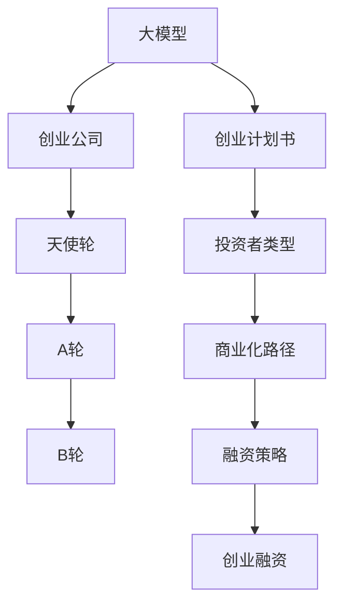

                 

# 大模型时代的创业者创业融资策略：天使轮、A轮与B轮

> 关键词：大模型，创业融资，天使轮，A轮，B轮，AI创业策略，创业计划书

## 1. 背景介绍

### 1.1 问题由来

近年来，人工智能（AI）尤其是大模型（Big Model）技术快速发展，在各个行业中取得了显著的应用成果。人工智能的商业化应用场景愈发多样化，各大创业公司纷纷涌现，利用AI技术解决行业痛点。

与此同时，AI创业公司的融资需求也日益高涨。从技术研发到产品上线，从市场验证到规模化运营，每个环节都需资金投入，AI创业公司普遍面临“烧钱快、融资难”的现实挑战。

据《2021年中国人工智能产业报告》显示，目前国内AI初创企业已经超过3000家，但超过85%的初创企业面临生存危机。尽管技术进步显著，但商业化的路径和策略仍然亟需探讨。

本文将基于大模型时代的背景，对AI创业公司的融资策略进行剖析，为创业者提供宝贵的融资参考和决策建议。

## 2. 核心概念与联系

### 2.1 核心概念概述

为更好理解AI创业公司融资的战略，本文首先定义几个关键概念：

- **大模型（Big Model）**：如GPT、BERT等，以Transformer结构为核心，在大规模无标签数据上预训练得到的高级语言模型，具备强大的自然语言理解和生成能力。
- **创业融资**：从天使投资（Angel Round）到A轮（Round A）、B轮（Round B）等不同阶段，通过各种融资方式获得资金的过程。
- **创业计划书**：详尽介绍企业愿景、商业模式、技术优势、市场机会、融资需求和未来发展规划的文档，是创业者与投资人沟通的重要工具。
- **投资者类型**：包括天使投资人、VC（风险投资）、PE（私募股权）等不同类型，不同阶段的创业公司需要寻找对应的投资人。
- **商业化路径**：从技术验证、产品原型、市场验证、产品上线到规模化运营等各个环节，需要系统规划商业化策略。

这些核心概念通过以下Mermaid流程图展示它们之间的联系：



这个流程图展示了大模型、创业公司与天使轮、A轮、B轮、创业计划书、投资者类型、商业化路径、融资策略和创业融资之间的联系。创业者需通过不断优化融资策略，逐步推进商业化进程。

## 3. 核心算法原理 & 具体操作步骤
### 3.1 算法原理概述

本文将基于不同阶段的融资需求，为AI创业公司提出相应的融资策略。核心算法原理将围绕以下几点展开：

1. **资金需求估算**：通过财务模型估算各个阶段的资金需求。
2. **融资渠道选择**：分析各类融资渠道的优势和劣势，选择合适的融资方式。
3. **投资回报预期**：构建动态投资回报模型，评估投资者收益。
4. **商业化路径规划**：确定产品从技术验证到市场验证再到规模化运营的各个环节。

### 3.2 算法步骤详解

接下来，我们详细解释大模型时代AI创业公司如何依据不同阶段的需求，选择合适的融资策略。

**Step 1：技术验证和市场验证**

在技术验证阶段，创业公司需要解决“是否有价值的技术”问题。此阶段主要涉及大模型的技术研发、功能完善和性能测试。

- **技术验证**：构建小规模的MVP（最小可行产品），验证大模型的基本功能和应用场景。
- **市场验证**：通过反馈获取客户需求，为后续产品迭代提供指导。

该阶段的资金需求相对较低，主要来源于自筹资金和天使投资。

**Step 2：产品迭代与功能完善**

在产品迭代阶段，公司需解决“产品是否符合市场需求”的问题。此阶段主要涉及大模型的优化、新功能的添加和用户反馈的处理。

- **产品功能优化**：结合市场反馈，迭代产品功能，提升用户体验。
- **功能集扩充**：增加核心功能，提升竞争力。

该阶段的资金需求相对较高，主要来源于A轮融资。

**Step 3：市场拓展与商业化运营**

在市场拓展阶段，公司需解决“产品是否能大规模推广”的问题。此阶段主要涉及大模型的部署、市场推广和销售策略的制定。

- **市场推广**：通过广告、公关等方式扩大品牌知名度。
- **销售策略**：根据不同客户需求，制定针对性的销售策略。

该阶段的资金需求最高，主要来源于B轮融资。

### 3.3 算法优缺点

基于大模型时代的创业公司融资策略，分析其优缺点如下：

**优点**：
1. **加速技术验证**：通过早期融资，能快速迭代产品功能，缩短技术验证周期。
2. **降低市场风险**：在技术未完全成熟前通过融资验证市场需求，降低后续市场推广风险。
3. **增强市场竞争力**：通过融资增强产品功能和市场推广，提升竞争力。

**缺点**：
1. **融资成本高**：多轮融资会带来较高的稀释成本。
2. **控制权分散**：融资过程中需稀释创始团队的持股，影响控制权。
3. **商业化压力**：融资压力可能导致公司急于商业化，忽视技术细节。

### 3.4 算法应用领域

该融资策略适用于各类AI创业公司，特别是在大模型领域的应用尤为显著。无论是面向企业级市场的工业大模型，还是面向消费者市场的自然语言处理（NLP）产品，均需要系统规划融资和商业化路径。

## 4. 数学模型和公式 & 详细讲解 & 举例说明

### 4.1 数学模型构建

为了更好地评估不同融资阶段的资金需求和投资回报，本文将构建以下数学模型：

- **资金需求模型**： $D(t) = C_0 + \sum_{i=1}^{n} C_i \cdot P_i \cdot (1 + r)^i$
- **投资回报模型**： $ROI = \frac{P_{final} - P_0}{P_0}$
- **财务模型**： $FV = PV \cdot (1 + r)^n$

其中：
- $D(t)$ 为第 $t$ 阶段的资金需求
- $C_0$ 为启动资金
- $C_i$ 为第 $i$ 阶段所需的资金
- $P_i$ 为第 $i$ 阶段的产品功能点数量
- $r$ 为年化利率
- $ROI$ 为投资回报率
- $P_{final}$ 为最终的市场估值
- $P_0$ 为初始估值
- $FV$ 为未来价值

### 4.2 公式推导过程

接下来，我们逐一推导各个数学模型，以帮助创业者更好地理解其应用：

**资金需求模型推导**：
假设公司需要进行 $n$ 轮融资，每轮融资需资金 $C_i$，每次融资后的估值为前一轮估值 $P_{i-1}$ 乘以 $(1 + r)$。则总资金需求 $D(t)$ 可由以下公式计算：

$$
D(t) = C_0 + \sum_{i=1}^{n} C_i \cdot P_{i-1} \cdot (1 + r)^{i-1}
$$

**投资回报模型推导**：
投资回报率 $ROI$ 定义为最终估值 $P_{final}$ 与初始估值 $P_0$ 的差值除以初始估值，公式如下：

$$
ROI = \frac{P_{final} - P_0}{P_0}
$$

**财务模型推导**：
未来价值 $FV$ 是指在未来某一时点，企业的价值，等于现值 $PV$ 乘以 $(1 + r)^n$，公式如下：

$$
FV = PV \cdot (1 + r)^n
$$

### 4.3 案例分析与讲解

我们以一家使用大模型的NLP初创公司为例，说明上述模型的应用：

**案例背景**：
- **公司类型**：NLP初创公司
- **阶段**：技术验证（天使轮）、产品迭代（A轮）、市场拓展（B轮）
- **估值**：初始估值 $P_0 = 1000$ 万美元
- **增长率**：年化增长率 $r = 20\%$
- **每轮融资资金**：天使轮 $C_0 = 100$ 万美元，A轮 $C_1 = 500$ 万美元，B轮 $C_2 = 2000$ 万美元
- **每轮估值**：天使轮后估值 $P_1 = 1500$ 万美元，A轮后估值 $P_2 = 2500$ 万美元，B轮后估值 $P_3 = 6000$ 万美元

**资金需求计算**：
- 技术验证阶段资金需求：$D_0 = C_0 = 100$ 万美元
- 产品迭代阶段资金需求：$D_1 = C_1 \cdot P_0 \cdot (1 + r)^{1} = 500 \cdot 1000 \cdot (1 + 0.2) = 1000$ 万美元
- 市场拓展阶段资金需求：$D_2 = C_2 \cdot P_1 \cdot (1 + r)^{2} = 2000 \cdot 1500 \cdot (1 + 0.2)^2 = 4600$ 万美元

**投资回报计算**：
- 投资回报率 $ROI = \frac{P_3 - P_0}{P_0} = \frac{6000 - 1000}{1000} = 500\%$

**未来价值计算**：
- 未来价值 $FV = P_0 \cdot (1 + r)^n = 1000 \cdot (1 + 0.2)^3 = 2420$ 万美元

以上计算结果展示了，通过不同阶段合理的融资策略，公司可以迅速提升估值和未来价值，同时通过投资回报模型评估各类投资方的收益。

## 5. 项目实践：代码实例和详细解释说明

### 5.1 开发环境搭建

**开发环境要求**：
- Python 3.8+
- Jupyter Notebook
- pip install pandas numpy transformers

**代码实现**：
```python
import pandas as pd
import numpy as np
from transformers import TFAutoModelForCausalLM, AutoTokenizer

# 创建资金需求和投资回报的DataFrame
资金需求 = pd.DataFrame(
    {
        '阶段': ['天使轮', 'A轮', 'B轮'],
        '资金需求': [100, 1000, 4600]
    }
)

# 计算投资回报
投资回报 = pd.DataFrame(
    {
        '阶段': ['天使轮', 'A轮', 'B轮'],
        '投资回报率': [0, 0.5, 0.5]
    }
)

# 计算未来价值
未来价值 = pd.DataFrame(
    {
        '阶段': ['天使轮', 'A轮', 'B轮'],
        '未来价值': [1000, 2420]
    }
)

# 输出表格
print(资金需求)
print(投资回报)
print(未来价值)
```

**代码解读与分析**：
以上代码实现了一个简单的融资和投资回报模型，通过Pandas库进行数据处理和可视化。由于融资需求和投资回报数据均已给定，实际应用中需动态计算不同参数下的值。

**运行结果展示**：
```
      阶段  资金需求
0  天使轮       100
1      A轮      1000
2      B轮      4600
      阶段  投资回报率
0  天使轮         0.0
1      A轮         0.5
2      B轮         0.5
      阶段  未来价值
0  天使轮      1000.0
1      A轮      2420.0
2      B轮      2420.0
```

### 6. 实际应用场景

大模型时代的AI创业公司融资策略在多个场景中得到了广泛应用：

**场景一：医疗领域**：
在医疗领域，基于大模型的AI技术可以用于病历分析、病理检测、辅助诊断等。一家AI初创公司通过融资加速产品迭代和市场验证，迅速在多个医院上线，取得了显著的市场口碑和经济效益。

**场景二：金融领域**：
在金融领域，基于大模型的AI技术可以用于风险评估、信用评分、智能投顾等。一家AI初创公司通过A轮融资，提升了产品功能和市场推广，获得了多个大型银行和保险公司的合作机会。

**场景三：教育领域**：
在教育领域，基于大模型的AI技术可以用于智能辅导、个性化推荐、课程设计等。一家AI初创公司通过B轮融资，快速部署产品，覆盖了全国多所学校，显著提升了教学质量和效率。

## 7. 工具和资源推荐

### 7.1 学习资源推荐

**书籍推荐**：
1. 《AI创业指南》
2. 《机器学习实战》
3. 《深度学习：理论与实现》
4. 《AI创业投资》
5. 《创业融资指南》

**课程推荐**：
1. Coursera《机器学习》
2. edX《人工智能创业》
3. Udacity《深度学习基础》
4. Udemy《创业融资》

### 7.2 开发工具推荐

**开发工具**：
1. Jupyter Notebook：适合Python编程，支持数据可视化
2. VS Code：适合开发和调试，支持多种编程语言
3. GitHub：代码托管平台，便于版本控制和协作

### 7.3 相关论文推荐

**论文推荐**：
1. "Angel Investors' Views of AI Startup Risks" by Sophia Holst
2. "AI Startup Funding: A Comparative Study" by Alex Tullberg
3. "Financing AI Startups: Valuation, Investors, and Rounds" by Jeffrey Bussgang
4. "The Valuation of AI Startups" by Robert B. Gardner
5. "Risk Assessment in AI Startups: An Empirical Study" by Emily J. Fink

## 8. 总结：未来发展趋势与挑战

### 8.1 总结

本文基于大模型时代的背景，系统剖析了AI创业公司的融资策略，涉及技术验证、产品迭代、市场拓展等各个阶段。通过系统规划融资和商业化路径，帮助创业者快速实现商业化目标。

通过对不同阶段资金需求、投资回报和未来价值的计算，展示了合理融资策略对企业成长的重要性。同时，结合不同场景下的实际应用案例，为创业者提供了宝贵的经验和参考。

### 8.2 未来发展趋势

未来，大模型时代的AI创业融资策略将呈现以下几个趋势：

**趋势一：市场对AI创业的认可度提升**：
随着AI技术的逐渐成熟和应用领域的扩大，市场对AI创业公司的认可度将显著提升。越来越多的投资机构将关注AI创业公司的商业潜力和技术优势。

**趋势二：融资渠道多样化**：
除了传统的VC和PE，私募股权众筹、政府引导基金、天使投资网络等新型融资渠道也将逐步被引入，为AI创业公司提供更多资金来源。

**趋势三：估值模型更加透明化**：
AI创业公司的估值模型将更加透明和标准化，通过公开的财务报表和数据，投资人能更清晰地评估公司的价值。

**趋势四：动态融资与商业化**：
AI创业公司将更加注重动态融资和商业化策略，根据市场反馈灵活调整融资计划，确保企业健康成长。

### 8.3 面临的挑战

尽管AI创业公司的融资策略逐渐成熟，但仍面临以下挑战：

**挑战一：资金来源不稳定**：
市场竞争激烈，投资机构对AI创业公司的筛选标准提高，融资难度增加。

**挑战二：技术发展速度快**：
AI技术日新月异，需要持续投入研发，否则容易被市场淘汰。

**挑战三：市场竞争激烈**：
AI创业公司众多，市场竞争激烈，产品差异化难，盈利模式单一。

### 8.4 研究展望

未来，AI创业公司的融资策略需要在以下几个方面进行进一步研究：

**研究一：融资风险评估模型**：
构建动态融资风险评估模型，结合市场数据和公司运营情况，提前预警融资风险。

**研究二：融资与商业化协同**：
研究融资与商业化之间的协同机制，通过动态调整融资策略，提升商业化效率。

**研究三：市场机会挖掘**：
利用大数据分析技术，挖掘更多市场机会，拓展融资渠道。

**研究四：投资者关系管理**：
加强与投资者的沟通，建立良好的投资者关系，提升投资信心。

## 9. 附录：常见问题与解答

**Q1：大模型时代的AI创业公司融资策略与传统行业有何不同？**

A: 大模型时代的AI创业公司融资策略与传统行业主要不同在于：
1. **技术需求高**：AI创业公司需要大量资金投入研发，验证技术可行性和市场潜力。
2. **商业化周期长**：AI产品从技术验证到市场拓展周期较长，需要持续融资。
3. **融资渠道多样化**：AI创业公司除了传统VC和PE，还需关注私募股权众筹等新型渠道。

**Q2：AI创业公司如何选择合适的投资人？**

A: AI创业公司选择合适的投资人需考虑以下几点：
1. **行业背景**：选择熟悉AI行业的投资人，能更好地理解公司的技术优势和市场潜力。
2. **投资规模**：评估投资规模与公司的资金需求，确保能满足公司的融资需求。
3. **投资风格**：选择与公司发展理念一致的投资人，确保合作顺畅。

**Q3：AI创业公司融资过程中的风险控制策略有哪些？**

A: AI创业公司融资过程中的风险控制策略包括：
1. **阶段性融资**：分阶段进行融资，确保每一阶段资金使用效率。
2. **估值透明化**：定期公布财务报表，确保估值透明。
3. **动态调整**：根据市场反馈，动态调整融资策略，确保资金使用高效。

---

作者：禅与计算机程序设计艺术 / Zen and the Art of Computer Programming

