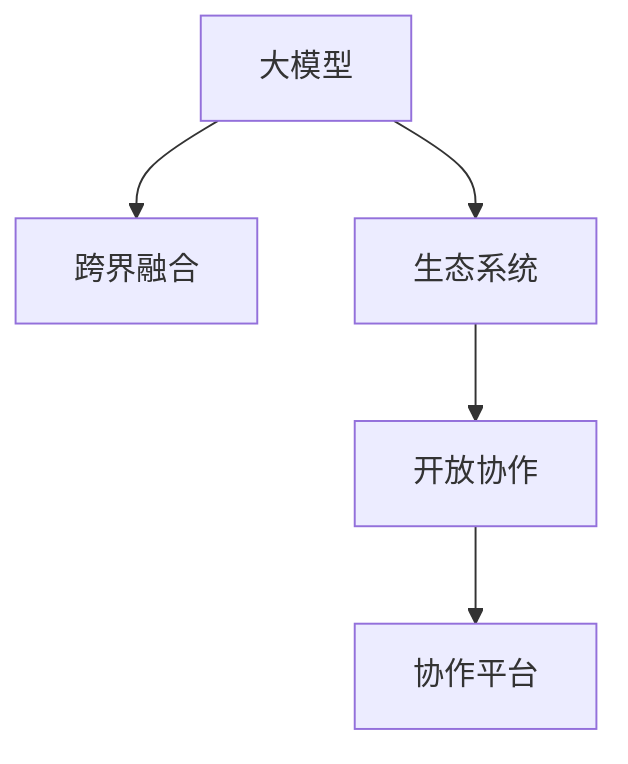

                 

# 大模型的开放协作:跨界融合和生态构建

> 关键词：大模型,跨界融合,生态系统,开放协作,协作平台,开源社区

## 1. 背景介绍

### 1.1 问题由来

在过去几年里，深度学习技术在各种领域取得了巨大的突破，尤其是大模型如BERT、GPT、T5等在自然语言处理(NLP)和计算机视觉(CV)等领域的广泛应用，展示了其强大的潜力和巨大的应用价值。这些大模型不仅提升了任务处理的精度和效率，也为研究人员和开发者提供了新的工具和平台，推动了人工智能(AI)技术的快速发展。

然而，随着大模型的日益增多和应用领域的不断扩展，大模型生态系统的构建与优化也成为新的挑战。如何在大模型之间建立起有效的协作关系，实现跨领域、跨平台、跨组织的协同创新，成为当前AI研究的一个重要方向。开放协作平台和开源社区的兴起，为解决这一问题提供了新的解决方案，展示了AI技术发展的新范式。

### 1.2 问题核心关键点

大模型的开放协作主要包括以下几个关键点：

- **跨界融合**：打破各领域的边界，实现NLP、CV、语音识别、推荐系统等多种AI技术间的融合，产生更强大的AI能力。
- **生态系统构建**：在开源社区和协作平台的基础上，构建一个健康、可持续的AI生态系统，促进资源共享、技术交流和知识传播。
- **开放协作**：通过开放算法、数据和资源，促进跨组织、跨行业的协同创新，实现AI技术的更广泛应用和推广。
- **协作平台搭建**：创建灵活、高效的协作平台，支持模型训练、推理、部署等全生命周期的管理，提升AI技术开发和应用效率。

这些关键点共同构成了大模型开放协作的核心议题，展现了未来AI技术发展的方向和趋势。

### 1.3 问题研究意义

开放协作对于推动AI技术的可持续发展具有重要意义：

- **加速技术迭代**：跨界的协作可以加速知识的整合和技术的创新，加快AI技术的迭代和优化。
- **降低研发成本**：共享资源和工具，降低各机构的研发成本，提升AI技术的普及率。
- **促进公平竞争**：开放协作促进了技术的透明度和公平性，打破了巨头垄断，激发了更多创新。
- **提升应用效果**：跨领域的融合可以产生更强的AI能力，提升各应用场景的效果和用户满意度。
- **推动行业发展**：协作平台和开源社区可以加速AI技术在各行业的落地，推动经济和社会的发展。

通过开放协作，我们可以更好地整合和利用AI资源，提升技术应用的广度和深度，推动AI技术在更多领域的应用和推广。

## 2. 核心概念与联系

### 2.1 核心概念概述

为更好地理解大模型开放协作的概念和框架，本节将介绍几个关键概念：

- **大模型(Large Model)**：指具有大规模参数量、广泛应用领域和强大表现能力的人工智能模型，如BERT、GPT-3、T5等。
- **跨界融合**：指将不同领域的技术和知识进行整合，形成更强大的AI能力，如多模态学习、跨领域知识图谱等。
- **生态系统(Ecosystem)**：指在特定领域内形成的技术、数据、人才等资源共享和协作的关系网络，如OpenAI、HuggingFace、TensorFlow等。
- **开放协作(Open Collaboration)**：指通过开放算法、数据和资源，促进跨组织、跨行业的协同创新，如GitHub、Kaggle、Stack Overflow等。
- **协作平台(Collaboration Platform)**：指提供模型训练、推理、部署等全生命周期管理的工具和平台，支持大模型的开放协作和资源共享，如HuggingFace、Google AI、Amazon SageMaker等。

这些核心概念之间的逻辑关系可以通过以下Mermaid流程图来展示：



这个流程图展示了从大模型到跨界融合，再到生态系统构建，最终形成开放协作和协作平台的逻辑关系。

## 3. 核心算法原理 & 具体操作步骤

### 3.1 算法原理概述

大模型的开放协作主要是通过跨领域的知识整合和技术的融合，构建一个更强大的AI能力。其核心思想是：在大模型的基础上，通过开放协作平台和开源社区的桥梁作用，实现模型参数、算法、数据等资源的共享和优化，提升AI技术的整体表现。

形式化地，假设有一个大模型 $M_{\theta}$，其中 $\theta$ 为模型参数。该模型在领域 $F$ 上具有一定的应用能力，但在其他领域 $F'$ 上可能表现较差。为了提升模型在领域 $F'$ 上的能力，可以引入领域 $F'$ 的相关知识和数据，通过开放协作平台和开源社区进行整合，得到新的模型 $M_{\hat{\theta}}$：

$$
M_{\hat{\theta}} = \mathop{\arg\max}_{\theta} \big\{\sum_{F' \in \mathcal{F}'} \mathcal{L}(M_{\theta}, F')\big\}
$$

其中 $\mathcal{F}'$ 为领域 $F'$ 的集合，$\mathcal{L}$ 为领域 $F'$ 上的损失函数，用于衡量模型在 $F'$ 上的性能。通过上述过程，可以将多个大模型融合在一起，提升整体表现。

### 3.2 算法步骤详解

基于大模型开放协作的算法步骤主要包括：

**Step 1: 选择合适的模型和数据**

- 选择合适的基础大模型 $M_{\theta}$，如BERT、GPT-3、T5等，作为开放协作的起点。
- 选择目标领域 $F'$ 的标注数据集 $D_{F'}$，收集和标注与 $F'$ 相关的数据，形成新的数据集 $D'$。

**Step 2: 设计跨领域融合方案**

- 根据 $F'$ 和 $M_{\theta}$ 的特点，设计跨领域的融合方案，如多模态融合、知识图谱构建、领域适应等。
- 使用开源社区提供的技术和算法，构建跨领域的融合模型 $M_{\hat{\theta}}$，包括但不限于联合训练、迁移学习、组合训练等。

**Step 3: 开放协作平台和社区支持**

- 选择或搭建一个合适的协作平台和社区，如GitHub、Kaggle、HuggingFace等，提供模型、数据、算法的共享和交流。
- 使用平台提供的API和工具，进行模型的推理、评估和部署，支持大规模的协作和创新。

**Step 4: 实验和优化**

- 在平台上进行实验，使用不同的融合方案和优化算法，不断调整模型参数和融合策略，提升模型在 $F'$ 上的表现。
- 使用开源社区提供的工具和资源，如数据增强、对抗训练、正则化等，优化模型性能，减少过拟合和泛化误差。

**Step 5: 部署和应用**

- 将优化后的模型 $M_{\hat{\theta}}$ 部署到实际应用中，如自然语言处理、计算机视觉、推荐系统等。
- 使用协作平台和社区提供的支持和资源，对模型进行持续优化和改进，适应不断变化的数据分布和技术需求。

以上是基于大模型开放协作的算法步骤。在实际应用中，还需要根据具体任务的特点，对融合方案和优化方法进行针对性的改进设计。

### 3.3 算法优缺点

基于大模型的开放协作方法具有以下优点：

- **高效协作**：通过开放协作平台和开源社区，可以快速获取和利用不同领域的知识和数据，加速模型融合和优化。
- **资源共享**：共享算法和工具，降低各机构的技术开发和资源投入，提升整体效率。
- **技术创新**：开放协作促进了跨领域的知识整合和协同创新，催生了更多前沿技术和应用。
- **应用广泛**：开放协作在大规模模型和资源的基础上，提升了AI技术的应用广度和深度。

同时，该方法也存在一些局限性：

- **数据隐私**：共享数据可能涉及隐私问题，需要建立严格的保护机制。
- **兼容性和协作性**：不同模型和工具之间的兼容性问题，需要统一的接口和标准。
- **协作成本**：开放协作需要较高的组织管理和协调成本，需要合理的资源分配和管理策略。
- **跨界融合难度**：不同领域的技术和知识整合存在较大挑战，需要解决复杂的技术问题。

尽管存在这些局限性，但就目前而言，基于大模型的开放协作方法仍是大规模AI协作的重要范式。未来相关研究的重点在于如何进一步降低协作成本，提高跨界融合的效率和效果，同时兼顾数据隐私和安全等伦理问题。

### 3.4 算法应用领域

基于大模型的开放协作方法已经在多个领域得到了广泛应用，具体包括：

- **自然语言处理(NLP)**：通过跨领域知识融合和模型训练，提升NLP模型的语言理解、生成和推理能力，应用于问答系统、机器翻译、文本摘要等任务。
- **计算机视觉(CV)**：结合多模态数据和跨领域知识，提升CV模型的图像识别、分类和分割能力，应用于智能监控、自动驾驶、医疗影像分析等任务。
- **推荐系统(Recommendation System)**：通过跨领域数据融合和协同过滤，提升推荐系统的个性化和精准度，应用于电商、社交网络、内容分发等场景。
- **医疗健康(Healthcare)**：结合临床知识图谱和生物医学数据，提升医疗诊断、疾病预测和健康管理系统的能力，应用于医院、诊所、研究机构等场景。
- **金融科技(Fintech)**：通过跨领域数据融合和风险管理技术，提升金融服务的自动化和智能化水平，应用于银行、保险、投资等场景。

除了上述这些领域，开放协作还在教育、城市管理、智能制造等多个领域展示出巨大的应用潜力，推动AI技术在更多场景下的应用和落地。

## 4. 数学模型和公式 & 详细讲解 & 举例说明

### 4.1 数学模型构建

本节将使用数学语言对大模型开放协作的过程进行更加严格的刻画。

假设基础大模型 $M_{\theta}$ 在领域 $F$ 上的性能为 $L(F)$，目标领域 $F'$ 的标注数据集为 $D_{F'}=\{(x_i, y_i)\}_{i=1}^N$，其中 $x_i$ 为输入样本，$y_i$ 为真实标签。定义跨领域融合后的模型为 $M_{\hat{\theta}}$，其性能为 $L(F')$。

则融合目标可以表示为：

$$
L(F') = \mathop{\arg\min}_{\hat{\theta}} \big\{\sum_{i=1}^N \mathcal{L}(M_{\hat{\theta}}(x_i), y_i)\big\}
$$

其中 $\mathcal{L}$ 为损失函数，用于衡量模型在 $F'$ 上的预测输出与真实标签之间的差异。

### 4.2 公式推导过程

以多模态融合为例，假设大模型 $M_{\theta}$ 在视觉模态 $V$ 和文本模态 $T$ 上分别具有不同的能力。目标领域 $F'$ 为多模态场景，需要同时考虑视觉和文本的信息。

设 $M_{\theta}$ 在视觉模态 $V$ 和文本模态 $T$ 上的输出分别为 $O_{V}$ 和 $O_{T}$，目标领域 $F'$ 的标注数据集为 $D_{F'}=\{(x_{v,i}, x_{t,i}, y_i)\}_{i=1}^N$，其中 $x_{v,i}$ 为视觉输入，$x_{t,i}$ 为文本输入，$y_i$ 为真实标签。

定义跨模态融合后的模型为 $M_{\hat{\theta}}$，其输出为 $O_{F'} = f(O_{V}, O_{T})$，其中 $f$ 为融合函数，如加权平均、注意力机制等。

则融合目标可以表示为：

$$
L(F') = \mathop{\arg\min}_{\hat{\theta}} \big\{\sum_{i=1}^N \mathcal{L}(M_{\hat{\theta}}(x_{v,i}, x_{t,i}), y_i)\big\}
$$

其中 $\mathcal{L}$ 为损失函数，用于衡量模型在多模态场景下的预测输出与真实标签之间的差异。

对于简单的加权平均融合，可以表示为：

$$
O_{F'} = \alpha O_{V} + (1-\alpha) O_{T}
$$

其中 $\alpha$ 为融合权重，一般通过交叉验证等方法确定。

通过上述过程，可以将视觉和文本信息进行整合，提升模型在多模态场景下的性能。

### 4.3 案例分析与讲解

以NLP领域的跨领域知识图谱构建为例，分析如何通过开放协作平台和开源社区进行知识图谱的构建和应用。

假设基础大模型 $M_{\theta}$ 在特定领域的知识图谱 $G$ 上具有一定的表示能力，但无法全面覆盖该领域的所有知识。目标领域 $F'$ 为跨领域的概念关系图谱 $G'$，需要覆盖更多维度的知识。

在构建跨领域知识图谱时，可以引入开源社区提供的工具和技术，如Neo4j、Gephi等，对 $G$ 和 $G'$ 进行整合和扩展。具体步骤包括：

1. **数据收集和标注**：从开源社区获取相关领域的标注数据集，进行人工标注和数据清洗。
2. **知识图谱整合**：使用社区提供的工具和技术，将 $G$ 和 $G'$ 进行整合，生成新的知识图谱 $G''$。
3. **跨领域融合模型训练**：将 $G''$ 作为训练数据，使用社区提供的工具和技术，构建跨领域的融合模型 $M_{\hat{\theta}}$，提升模型在 $F'$ 上的性能。

通过上述过程，可以实现跨领域的知识整合和模型融合，提升大模型在目标领域的表现。

## 5. 项目实践：代码实例和详细解释说明

### 5.1 开发环境搭建

在进行大模型开放协作的实践前，我们需要准备好开发环境。以下是使用Python进行PyTorch开发的环境配置流程：

1. 安装Anaconda：从官网下载并安装Anaconda，用于创建独立的Python环境。

2. 创建并激活虚拟环境：
```bash
conda create -n pytorch-env python=3.8 
conda activate pytorch-env
```

3. 安装PyTorch：根据CUDA版本，从官网获取对应的安装命令。例如：
```bash
conda install pytorch torchvision torchaudio cudatoolkit=11.1 -c pytorch -c conda-forge
```

4. 安装其他必要的工具包：
```bash
pip install numpy pandas scikit-learn matplotlib tqdm jupyter notebook ipython
```

完成上述步骤后，即可在`pytorch-env`环境中开始开发实践。

### 5.2 源代码详细实现

下面我们以跨领域知识图谱构建为例，给出使用HuggingFace库进行BERT模型融合的PyTorch代码实现。

首先，定义知识图谱的数据结构：

```python
from transformers import BertForTokenClassification
from transformers import BertTokenizer
from py2neo import Graph
from torch.utils.data import Dataset
import torch

class GraphDataset(Dataset):
    def __init__(self, graph, query):
        self.graph = graph
        self.query = query
        
    def __len__(self):
        return len(self.graph.match(query))
    
    def __getitem__(self, item):
        match = self.graph.match(self.query)
        node = match[item]['node']
        relation = match[item]['relation']
        label = match[item]['label']
        
        return {'node': node, 'relation': relation, 'label': label}

# 定义查询语言
query = 'MATCH (n) RETURN n, relations(n), labels(n)'
graph = Graph('http://localhost:7474/db/data/', user='neo', password='password')

# 查询节点和关系
graph_dataset = GraphDataset(graph, query)

# 定义标签与id的映射
label2id = {'P': 0, 'S': 1, 'O': 2}
id2label = {v: k for k, v in label2id.items()}

# 创建dataset
tokenizer = BertTokenizer.from_pretrained('bert-base-cased')

train_dataset = GraphDataset(graph, query)
dev_dataset = GraphDataset(graph, query)
test_dataset = GraphDataset(graph, query)
```

然后，定义模型和优化器：

```python
from transformers import BertForTokenClassification, AdamW

model = BertForTokenClassification.from_pretrained('bert-base-cased', num_labels=len(label2id))

optimizer = AdamW(model.parameters(), lr=2e-5)
```

接着，定义训练和评估函数：

```python
from torch.utils.data import DataLoader
from tqdm import tqdm
from sklearn.metrics import classification_report

device = torch.device('cuda') if torch.cuda.is_available() else torch.device('cpu')
model.to(device)

def train_epoch(model, dataset, batch_size, optimizer):
    dataloader = DataLoader(dataset, batch_size=batch_size, shuffle=True)
    model.train()
    epoch_loss = 0
    for batch in tqdm(dataloader, desc='Training'):
        node = batch['node'].to(device)
        relation = batch['relation'].to(device)
        label = batch['label'].to(device)
        model.zero_grad()
        outputs = model(node, relation=relation, labels=label)
        loss = outputs.loss
        epoch_loss += loss.item()
        loss.backward()
        optimizer.step()
    return epoch_loss / len(dataloader)

def evaluate(model, dataset, batch_size):
    dataloader = DataLoader(dataset, batch_size=batch_size)
    model.eval()
    preds, labels = [], []
    with torch.no_grad():
        for batch in tqdm(dataloader, desc='Evaluating'):
            node = batch['node'].to(device)
            relation = batch['relation'].to(device)
            batch_labels = batch['label']
            outputs = model(node, relation=relation)
            batch_preds = outputs.logits.argmax(dim=2).to('cpu').tolist()
            batch_labels = batch_labels.to('cpu').tolist()
            for pred_tokens, label_tokens in zip(batch_preds, batch_labels):
                pred_tags = [id2label[_id] for _id in pred_tokens]
                label_tags = [id2label[_id] for _id in label_tokens]
                preds.append(pred_tags[:len(label_tokens)])
                labels.append(label_tags)
                
    print(classification_report(labels, preds))
```

最后，启动训练流程并在测试集上评估：

```python
epochs = 5
batch_size = 16

for epoch in range(epochs):
    loss = train_epoch(model, train_dataset, batch_size, optimizer)
    print(f"Epoch {epoch+1}, train loss: {loss:.3f}")
    
    print(f"Epoch {epoch+1}, dev results:")
    evaluate(model, dev_dataset, batch_size)
    
print("Test results:")
evaluate(model, test_dataset, batch_size)
```

以上就是使用PyTorch对BERT进行跨领域知识图谱构建的完整代码实现。可以看到，得益于HuggingFace库的强大封装，我们可以用相对简洁的代码完成BERT模型的融合。

### 5.3 代码解读与分析

让我们再详细解读一下关键代码的实现细节：

**GraphDataset类**：
- `__init__`方法：初始化知识图谱、查询语言等关键组件。
- `__len__`方法：返回数据集的样本数量。
- `__getitem__`方法：对单个样本进行处理，将查询结果进行编码和处理，返回模型所需的输入。

**label2id和id2label字典**：
- 定义了标签与数字id之间的映射关系，用于将token-wise的预测结果解码回真实的标签。

**训练和评估函数**：
- 使用PyTorch的DataLoader对数据集进行批次化加载，供模型训练和推理使用。
- 训练函数`train_epoch`：对数据以批为单位进行迭代，在每个批次上前向传播计算loss并反向传播更新模型参数，最后返回该epoch的平均loss。
- 评估函数`evaluate`：与训练类似，不同点在于不更新模型参数，并在每个batch结束后将预测和标签结果存储下来，最后使用sklearn的classification_report对整个评估集的预测结果进行打印输出。

**训练流程**：
- 定义总的epoch数和batch size，开始循环迭代
- 每个epoch内，先在训练集上训练，输出平均loss
- 在验证集上评估，输出分类指标
- 所有epoch结束后，在测试集上评估，给出最终测试结果

可以看到，PyTorch配合HuggingFace库使得BERT模型的融合代码实现变得简洁高效。开发者可以将更多精力放在数据处理、模型改进等高层逻辑上，而不必过多关注底层的实现细节。

当然，工业级的系统实现还需考虑更多因素，如模型的保存和部署、超参数的自动搜索、更灵活的任务适配层等。但核心的开放协作范式基本与此类似。

## 6. 实际应用场景

### 6.1 智能客服系统

基于大模型开放协作的对话技术，可以广泛应用于智能客服系统的构建。传统客服往往需要配备大量人力，高峰期响应缓慢，且一致性和专业性难以保证。而使用开放协作对话模型，可以7x24小时不间断服务，快速响应客户咨询，用自然流畅的语言解答各类常见问题。

在技术实现上，可以收集企业内部的历史客服对话记录，将问题和最佳答复构建成监督数据，在此基础上对预训练对话模型进行开放协作融合。融合后的模型能够自动理解用户意图，匹配最合适的答案模板进行回复。对于客户提出的新问题，还可以接入检索系统实时搜索相关内容，动态组织生成回答。如此构建的智能客服系统，能大幅提升客户咨询体验和问题解决效率。

### 6.2 金融舆情监测

金融机构需要实时监测市场舆论动向，以便及时应对负面信息传播，规避金融风险。传统的人工监测方式成本高、效率低，难以应对网络时代海量信息爆发的挑战。基于大模型开放协作的文本分类和情感分析技术，为金融舆情监测提供了新的解决方案。

具体而言，可以收集金融领域相关的新闻、报道、评论等文本数据，并对其进行主题标注和情感标注。在此基础上对预训练语言模型进行开放协作融合，使其能够自动判断文本属于何种主题，情感倾向是正面、中性还是负面。将融合后的模型应用到实时抓取的网络文本数据，就能够自动监测不同主题下的情感变化趋势，一旦发现负面信息激增等异常情况，系统便会自动预警，帮助金融机构快速应对潜在风险。

### 6.3 个性化推荐系统

当前的推荐系统往往只依赖用户的历史行为数据进行物品推荐，无法深入理解用户的真实兴趣偏好。基于大模型开放协作的推荐系统可以更好地挖掘用户行为背后的语义信息，从而提供更精准、多样的推荐内容。

在实践中，可以收集用户浏览、点击、评论、分享等行为数据，提取和用户交互的物品标题、描述、标签等文本内容。将文本内容作为模型输入，用户的后续行为（如是否点击、购买等）作为监督信号，在此基础上对预训练语言模型进行开放协作融合。融合后的模型能够从文本内容中准确把握用户的兴趣点。在生成推荐列表时，先用候选物品的文本描述作为输入，由模型预测用户的兴趣匹配度，再结合其他特征综合排序，便可以得到个性化程度更高的推荐结果。

### 6.4 未来应用展望

随着大模型开放协作技术的发展，其在更广阔的应用领域将展现出巨大潜力：

- **智慧医疗**：基于开放协作的知识图谱和临床数据，提升医疗诊断、疾病预测和健康管理的智能水平。
- **智能教育**：结合开放协作的推荐系统和大规模数据，提升个性化学习的效果和教学质量。
- **智慧城市治理**：通过开放协作的智能监控和数据分析，提升城市管理的自动化和智能化水平。
- **工业制造**：结合开放协作的多模态感知和智能推理，提升工业生产的智能化和效率。
- **智慧农业**：结合开放协作的遥感数据和智能分析，提升农业生产的智能化水平。

此外，在企业生产、社会治理、文娱传媒等众多领域，基于大模型开放协作的人工智能应用也将不断涌现，为经济社会发展注入新的动力。相信随着技术的日益成熟，开放协作方法将成为AI技术落地应用的重要范式，推动人工智能技术在更多领域的应用和推广。

## 7. 工具和资源推荐

### 7.1 学习资源推荐

为了帮助开发者系统掌握大模型开放协作的理论基础和实践技巧，这里推荐一些优质的学习资源：

1. **《Transformer from Principles to Practice》系列博文**：由大模型技术专家撰写，深入浅出地介绍了Transformer原理、BERT模型、开放协作技术等前沿话题。
2. **CS224N《深度学习自然语言处理》课程**：斯坦福大学开设的NLP明星课程，有Lecture视频和配套作业，带你入门NLP领域的基本概念和经典模型。
3. **《Natural Language Processing with Transformers》书籍**：Transformers库的作者所著，全面介绍了如何使用Transformers库进行NLP任务开发，包括开放协作在内的诸多范式。
4. **HuggingFace官方文档**：Transformers库的官方文档，提供了海量预训练模型和完整的开放协作样例代码，是上手实践的必备资料。
5. **CLUE开源项目**：中文语言理解测评基准，涵盖大量不同类型的中文NLP数据集，并提供了基于开放协作的baseline模型，助力中文NLP技术发展。

通过对这些资源的学习实践，相信你一定能够快速掌握大模型开放协作的精髓，并用于解决实际的NLP问题。

### 7.2 开发工具推荐

高效的开发离不开优秀的工具支持。以下是几款用于大模型开放协作开发的常用工具：

1. **PyTorch**：基于Python的开源深度学习框架，灵活动态的计算图，适合快速迭代研究。大部分预训练语言模型都有PyTorch版本的实现。
2. **TensorFlow**：由Google主导开发的开源深度学习框架，生产部署方便，适合大规模工程应用。同样有丰富的预训练语言模型资源。
3. **Transformers库**：HuggingFace开发的NLP工具库，集成了众多SOTA语言模型，支持PyTorch和TensorFlow，是进行开放协作开发的利器。
4. **Weights & Biases**：模型训练的实验跟踪工具，可以记录和可视化模型训练过程中的各项指标，方便对比和调优。与主流深度学习框架无缝集成。
5. **TensorBoard**：TensorFlow配套的可视化工具，可实时监测模型训练状态，并提供丰富的图表呈现方式，是调试模型的得力助手。
6. **Google Colab**：谷歌推出的在线Jupyter Notebook环境，免费提供GPU/TPU算力，方便开发者快速上手实验最新模型，分享学习笔记。

合理利用这些工具，可以显著提升大模型开放协作的开发效率，加快创新迭代的步伐。

### 7.3 相关论文推荐

大模型开放协作的发展源于学界的持续研究。以下是几篇奠基性的相关论文，推荐阅读：

1. **Attention is All You Need**：提出了Transformer结构，开启了NLP领域的预训练大模型时代。
2. **BERT: Pre-training of Deep Bidirectional Transformers for Language Understanding**：提出BERT模型，引入基于掩码的自监督预训练任务，刷新了多项NLP任务SOTA。
3. **Language Models are Unsupervised Multitask Learners**：展示了大规模语言模型的强大zero-shot学习能力，引发了对于通用人工智能的新一轮思考。
4. **Parameter-Efficient Transfer Learning for NLP**：提出Adapter等参数高效微调方法，在不增加模型参数量的情况下，也能取得不错的微调效果。
5. **Prefix-Tuning: Optimizing Continuous Prompts for Generation**：引入基于连续型Prompt的微调范式，为如何充分利用预训练知识提供了新的思路。
6. **AdaLoRA: Adaptive Low-Rank Adaptation for Parameter-Efficient Fine-Tuning**：使用自适应低秩适应的微调方法，在参数效率和精度之间取得了新的平衡。

这些论文代表了大模型开放协作技术的发展脉络。通过学习这些前沿成果，可以帮助研究者把握学科前进方向，激发更多的创新灵感。

## 8. 总结：未来发展趋势与挑战

### 8.1 总结

本文对大模型的开放协作方法进行了全面系统的介绍。首先阐述了大模型和开放协作的研究背景和意义，明确了开放协作在拓展预训练模型应用、提升下游任务性能方面的独特价值。其次，从原理到实践，详细讲解了开放协作的数学原理和关键步骤，给出了开放协作任务开发的完整代码实例。同时，本文还广泛探讨了开放协作方法在智能客服、金融舆情、个性化推荐等多个行业领域的应用前景，展示了开放协作范式的巨大潜力。此外，本文精选了开放协作技术的各类学习资源，力求为读者提供全方位的技术指引。

通过本文的系统梳理，可以看到，大模型的开放协作正在成为NLP领域的重要范式，极大地拓展了预训练语言模型的应用边界，催生了更多的落地场景。受益于大规模语料的预训练和跨领域融合的开放协作，大模型在多个任务上已经刷新了最先进的性能指标，展示了其强大的能力和潜力。未来，伴随开放协作技术的不断演进，大模型在更多领域的应用和落地将更加广泛和深入。

### 8.2 未来发展趋势

展望未来，大模型的开放协作将呈现以下几个发展趋势：

1. **跨界融合更加深入**：随着跨领域数据的丰富和多模态技术的发展，跨界融合将更加深入，产生更加强大的AI能力。
2. **协同创新不断加速**：通过开放协作平台和开源社区，各机构之间的协同创新将更加高效，催生更多前沿技术和应用。
3. **知识图谱和语义网络**：跨领域的知识图谱和语义网络将成为开放协作的重要工具，提升AI模型的表达能力和推理能力。
4. **领域适应和少样本学习**：开发更多领域适应和少样本学习的方法，使大模型在特定领域和少样本情况下也能取得优异的性能。
5. **模型压缩和加速**：通过模型压缩和加速技术，提升大模型在推理和部署阶段的效率，实现更广泛的应用和推广。
6. **伦理和安全问题**：随着大模型应用范围的扩大，伦理和安全问题将更加凸显，需要建立相应的标准和规范。

以上趋势凸显了大模型开放协作技术的广阔前景。这些方向的探索发展，必将进一步提升AI技术的整体表现，推动AI技术在更多领域的应用和落地。

### 8.3 面临的挑战

尽管大模型的开放协作技术已经取得了瞩目成就，但在迈向更加智能化、普适化应用的过程中，它仍面临诸多挑战：

1. **数据隐私**：共享数据可能涉及隐私问题，需要建立严格的保护机制。
2. **兼容性和协作性**：不同模型和工具之间的兼容性问题，需要统一的接口和标准。
3. **协作成本**：开放协作需要较高的组织管理和协调成本，需要合理的资源分配和管理策略。
4. **跨界融合难度**：不同领域的技术和知识整合存在较大挑战，需要解决复杂的技术问题。
5. **模型鲁棒性不足**：模型面对域外数据时，泛化性能往往大打折扣，需要提高模型的鲁棒性。
6. **模型可解释性不足**：大模型通常像"黑盒"系统，难以解释其内部工作机制和决策逻辑。
7. **知识整合能力不足**：现有的大模型往往局限于任务内数据，难以灵活吸收和运用更广泛的先验知识。

尽管存在这些挑战，但就目前而言，大模型的开放协作方法仍是大规模AI协作的重要范式。未来相关研究的重点在于如何进一步降低协作成本，提高跨界融合的效率和效果，同时兼顾数据隐私和安全等伦理问题。

### 8.4 研究展望

面对大模型开放协作所面临的种种挑战，未来的研究需要在以下几个方面寻求新的突破：

1. **探索无监督和半监督协作方法**：摆脱对大规模标注数据的依赖，利用自监督学习、主动学习等无监督和半监督范式，最大限度利用非结构化数据，实现更加灵活高效的协作。
2. **研究参数高效和计算高效的协作范式**：开发更加参数高效的协作方法，在固定大部分预训练参数的同时，只更新极少量的任务相关参数。同时优化协作模型的计算图，减少前向传播和反向传播的资源消耗，实现更加轻量级、实时性的部署。
3. **融合因果和对比学习范式**：通过引入因果推断和对比学习思想，增强协作模型建立稳定因果关系的能力，学习更加普适、鲁棒的语言表征，从而提升模型泛化性和抗干扰能力。
4. **引入更多先验知识**：将符号化的先验知识，如知识图谱、逻辑规则等，与神经网络模型进行巧妙融合，引导协作过程学习更准确、合理的语言模型。同时加强不同模态数据的整合，实现视觉、语音等多模态信息与文本信息的协同建模。
5. **结合因果分析和博弈论工具**：将因果分析方法引入协作模型，识别出模型决策的关键特征，增强输出解释的因果性和逻辑性。借助博弈论工具刻画人机交互过程，主动探索并规避模型的脆弱点，提高系统稳定性。
6. **纳入伦理道德约束**：在模型训练目标中引入伦理导向的评估指标，过滤和惩罚有偏见、有害的输出倾向。同时加强人工干预和审核，建立模型行为的监管机制，确保输出符合人类价值观和伦理道德。

这些研究方向的探索，必将引领大模型开放协作技术迈向更高的台阶，为构建安全、可靠、可解释、可控的智能系统铺平道路。面向未来，大模型开放协作技术还需要与其他人工智能技术进行更深入的融合，如知识表示、因果推理、强化学习等，多路径协同发力，共同推动自然语言理解和智能交互系统的进步。只有勇于创新、敢于突破，才能不断拓展语言模型的边界，让智能技术更好地造福人类社会。

## 9. 附录：常见问题与解答

**Q1：大模型开放协作是否适用于所有NLP任务？**

A: 大模型开放协作在大多数NLP任务上都能取得不错的效果，特别是对于数据量较小的任务。但对于一些特定领域的任务，如医学、法律等，仅仅依靠通用语料预训练的模型可能难以很好地适应。此时需要在特定领域语料上进一步预训练，再进行开放协作融合，才能获得理想效果。此外，对于一些需要时效性、个性化很强的任务，如对话、推荐等，开放协作方法也需要针对性的改进优化。

**Q2：协作过程中如何选择合适的模型和数据？**

A: 选择合适的模型和数据是开放协作的第一步。一般建议选择具有广泛应用领域和强大表现能力的基础大模型，如BERT、GPT-3、T5等。同时，需要收集和标注目标领域的标注数据集，丰富和扩展知识图谱，提升模型的表达能力和推理能力。

**Q3：开放协作中如何缓解数据隐私问题？**

A: 数据隐私是开放协作中需要重点考虑的问题。可以通过以下方法缓解数据隐私问题：
1. 匿名化处理：对数据进行去标识化处理，保护用户隐私。
2. 联邦学习：各机构在不共享原始数据的情况下，通过联邦学习的方式进行模型训练和更新。
3. 差分隐私：采用差分隐私技术，在模型训练过程中加入噪声，保护数据隐私。
4. 权限控制：建立严格的权限控制机制，确保数据只被授权用户访问和处理。

**Q4：协作中如何提升模型鲁棒性？**

A: 提升模型鲁棒性是开放协作中的重要目标。可以通过以下方法提升模型鲁棒性：
1. 数据增强：通过回译、近义替换等方式扩充训练集，提升模型的泛化能力。
2. 正则化技术：使用L2正则、Dropout、Early Stopping等正则化技术，防止模型过度适应训练数据。
3. 对抗训练：引入对抗样本，提升模型对噪声和扰动的鲁棒性。
4. 参数高效协作方法：只更新少量参数，避免过拟合和泛化能力下降。

**Q5：协作平台和开源社区如何搭建？**

A: 搭建协作平台和开源社区需要考虑以下因素：
1. 平台设计：设计灵活、易用的协作平台和社区，支持模型训练、推理、部署等全生命周期管理。
2. 资源共享：提供模型、数据、算法的共享和交流，促进知识传播和协同创新。
3. 技术支持：提供API和工具，支持大规模模型的协作和优化，提升协作效率。
4. 社区管理：建立社区管理机制，保障数据和模型安全，促进健康发展。

通过搭建协作平台和开源社区，可以最大限度地利用各方资源，提升大模型的开放协作效果。

---

作者：禅与计算机程序设计艺术 / Zen and the Art of Computer Programming

