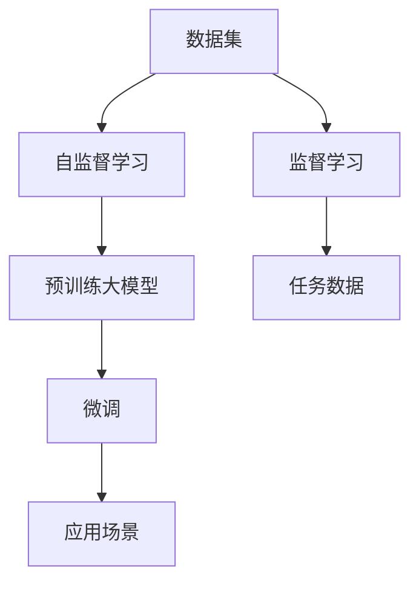

                 

# 大模型的技术发展与市场需求

> 关键词：大模型,技术发展,市场需求,深度学习,人工智能

## 1. 背景介绍

### 1.1 问题由来
近年来，随着深度学习技术的快速发展，大模型在人工智能领域取得了显著的进步，成为推动技术进步的重要驱动力。从AlexNet在2012年取得突破性胜利，到GPT-3等大规模语言模型的惊艳表现，大模型的影响力不断扩大。大模型的崛起不仅仅是数据和算力的进步，更是算法和计算架构的突破。

大模型的本质是对海量数据进行自监督或监督学习，学习通用的表示能力，并在特定任务上通过微调进行优化。这些大模型不仅在图像识别、自然语言处理、推荐系统等领域取得了卓越表现，还在游戏、音乐创作、蛋白质折叠等众多领域展现了强大潜力。

### 1.2 问题核心关键点
大模型的技术发展与市场需求紧密相连，推动了工业界和学术界的广泛关注和投资。当前，大模型在多个领域的应用场景不断扩展，呈现出以下关键趋势：

1. **数据与计算资源的需求**：大规模数据和计算资源是训练大模型的基础。随着模型规模的扩大，数据量和计算需求呈指数级增长，对基础设施提出了更高要求。

2. **应用场景的不断扩展**：从图像识别到自然语言处理，再到智能推荐、自动驾驶、医疗诊断等，大模型的应用场景不断扩展，带来了新的需求和挑战。

3. **技术与算法的多样性**：为应对多样化的任务需求，研究人员和工程师不断探索和创新，开发了各种算法和计算架构，如Transformer、卷积神经网络、自注意力机制等。

4. **伦理与安全性**：随着大模型在更多领域的应用，其伦理与安全性问题也日益凸显，如隐私保护、偏见与歧视、决策透明性等，成为需要深入探讨和解决的重要议题。

5. **标准化与协作**：为促进大模型的普及和应用，行业和企业越来越多地关注标准化的制定和协作机制的建立，以推动大模型技术的健康发展。

## 2. 核心概念与联系

### 2.1 核心概念概述

大模型是一个包含大量参数的深度学习模型，通过在大规模数据集上进行自监督或监督学习，学习到通用的表示能力。这些模型在图像识别、自然语言处理、推荐系统等领域展现了卓越性能，推动了人工智能技术的快速发展。

大模型的核心概念包括：

- **自监督学习**：在大规模无标签数据上进行的学习，学习到数据的内在结构。
- **监督学习**：在大规模有标签数据上进行的学习，学习到数据的具体特征。
- **预训练**：在大规模数据集上进行学习，学习到通用的表示能力。
- **微调**：在特定任务上进行有监督学习，进一步优化模型的性能。
- **Transformer**：一种常用的深度学习模型架构，以其自注意力机制著称，广泛应用于大模型中。

### 2.2 核心概念原理和架构的 Mermaid 流程图



这个流程图展示了自监督学习、监督学习、预训练、微调和应用场景之间的联系。自监督学习和大规模数据集是大模型的基础，监督学习进一步优化模型性能，微调使其适应特定任务，而应用场景则是大模型技术发展与市场需求的出发点。

## 3. 核心算法原理 & 具体操作步骤

### 3.1 算法原理概述

大模型的核心算法原理基于深度学习，通过多层神经网络对输入数据进行抽象和表示，学习到通用的特征表示能力。这些模型通常包括多层卷积神经网络、循环神经网络、Transformer等架构。

以Transformer为例，其核心在于自注意力机制，能够高效地处理序列数据，适用于自然语言处理、图像识别等任务。Transformer由编码器和解码器组成，通过多头自注意力机制和前馈神经网络进行信息传递和特征表示。

### 3.2 算法步骤详解

大模型的训练过程通常包括以下步骤：

1. **数据准备**：收集大规模无标签或标签数据，进行数据清洗和预处理。
2. **模型构建**：选择合适的深度学习架构，如Transformer、卷积神经网络等，并初始化模型参数。
3. **预训练**：在大规模数据集上进行无监督学习，学习到通用的表示能力。
4. **微调**：在特定任务上进行监督学习，进一步优化模型的性能。
5. **应用部署**：将训练好的模型部署到实际应用中，进行推理和预测。

### 3.3 算法优缺点

大模型的优缺点如下：

#### 优点

- **通用性**：大模型能够处理多种类型的输入数据，适用于多种任务。
- **高精度**：通过大量数据的训练，能够获得较高的准确性和泛化能力。
- **可解释性**：大模型的结构相对简单，容易进行解释和调试。
- **可扩展性**：大模型的参数规模大，易于进行模型扩展和微调。

#### 缺点

- **计算资源需求高**：大模型需要大量的计算资源和存储资源，对硬件基础设施提出了高要求。
- **训练时间长**：大规模数据集的训练过程耗时较长，对训练硬件和网络带宽有较高要求。
- **泛化能力不足**：大模型容易过拟合，需要进行正则化和优化。
- **隐私与安全问题**：大模型处理大量数据，可能涉及隐私和安全问题，需要采取相应措施。

### 3.4 算法应用领域

大模型在多个领域的应用取得了显著进展，包括但不限于：

- **自然语言处理**：如文本分类、机器翻译、问答系统等。
- **计算机视觉**：如图像识别、物体检测、图像生成等。
- **推荐系统**：如个性化推荐、广告推荐等。
- **自动驾驶**：如场景理解、路径规划等。
- **健康医疗**：如疾病诊断、基因组分析等。
- **金融风控**：如信用评估、欺诈检测等。

## 4. 数学模型和公式 & 详细讲解 & 举例说明

### 4.1 数学模型构建

大模型的数学模型通常基于深度学习，通过多层神经网络对输入数据进行抽象和表示。以下以Transformer为例，介绍其数学模型构建过程。

Transformer的核心是自注意力机制，其数学模型可以表示为：

$$
\text{Attention}(Q, K, V) = \text{Softmax}\left(\frac{QK^T}{\sqrt{d_k}}\right)V
$$

其中，$Q, K, V$ 分别为查询向量、键向量和值向量，$d_k$ 为向量的维度。自注意力机制通过计算查询向量与键向量的相似度，得到注意力权重，进而加权求和得到值向量。

### 4.2 公式推导过程

Transformer的数学模型推导较为复杂，涉及矩阵乘法、向量内积、Softmax函数等。以编码器中的自注意力机制为例，其推导过程如下：

1. **查询向量和键向量的内积**：
$$
QK^T = [Q_1K_1^T, Q_2K_2^T, ..., Q_nK_n^T]
$$

2. **计算注意力权重**：
$$
\alpha = \text{Softmax}\left(\frac{QK^T}{\sqrt{d_k}}\right)
$$

3. **加权求和得到值向量**：
$$
V = [V_1, V_2, ..., V_n] \alpha
$$

### 4.3 案例分析与讲解

以BERT模型为例，其数学模型构建过程如下：

BERT采用Transformer架构，通过两阶段的预训练过程进行学习。第一阶段为自监督预训练，通过掩码语言模型和下一句预测任务，学习到通用的语言表示能力。第二阶段为监督微调，通过特定的任务数据集进行微调，学习到特定任务的知识。

## 5. 项目实践：代码实例和详细解释说明

### 5.1 开发环境搭建

以下是在Python环境中搭建Transformer模型的开发环境的步骤：

1. **安装Python和PyTorch**：确保系统安装了Python 3.6或以上版本，并使用pip安装PyTorch。
2. **安装TensorBoard**：安装TensorBoard用于可视化训练过程。
3. **安装其他依赖库**：安装必要的依赖库，如torchvision、numpy、scipy等。

```bash
pip install torch torchvision numpy scipy tensorboard
```

### 5.2 源代码详细实现

以下是一个简单的Transformer模型代码实现：

```python
import torch
import torch.nn as nn
import torch.nn.functional as F
from torch.autograd import Variable

class Transformer(nn.Module):
    def __init__(self, input_dim, output_dim, hidden_dim, num_layers):
        super(Transformer, self).__init__()
        self.embedding = nn.Embedding(input_dim, hidden_dim)
        self.pos_encoder = PositionalEncoding(hidden_dim)
        self.encoder = nn.ModuleList([EncoderLayer(hidden_dim, num_attn_heads, num_ffn_units) for _ in range(num_layers)])
        self.linear = nn.Linear(hidden_dim, output_dim)
        
    def forward(self, x):
        x = self.pos_encoder(self.embedding(x))
        for layer in self.encoder:
            x = layer(x)
        x = self.linear(x)
        return x

class EncoderLayer(nn.Module):
    def __init__(self, dim, n_heads, n_ffn_units):
        super(EncoderLayer, self).__init__()
        self.self_attn = MultiHeadAttention(dim, n_heads)
        self.fc1 = nn.Linear(dim, n_ffn_units)
        self.fc2 = nn.Linear(n_ffn_units, dim)
        self.act = nn.ReLU()
        self.layernorm1 = nn.LayerNorm(dim)
        self.layernorm2 = nn.LayerNorm(dim)
        
    def forward(self, x):
        x, _ = self.self_attn(x, x, x)
        x = x + self.layernorm1(x)
        x = self.act(self.fc1(x))
        x = self.fc2(x)
        x = x + self.layernorm2(x)
        return x

class MultiHeadAttention(nn.Module):
    def __init__(self, dim, n_heads):
        super(MultiHeadAttention, self).__init__()
        self.n_heads = n_heads
        self.dim_per_head = dim // n_heads
        self.WQ = nn.Linear(dim, dim)
        self.WK = nn.Linear(dim, dim)
        self.WV = nn.Linear(dim, dim)
        self.wo = nn.Linear(dim, dim)
        self.dropout = nn.Dropout(0.1)
        self.sqrt_dim_per_head = math.sqrt(self.dim_per_head)
        
    def forward(self, query, key, value):
        B, T_q, _ = query.size()
        B, T_k, _ = key.size()
        B, T_v, _ = value.size()
        
        assert T_q == T_k, "Query, key, and value should have same sequence length"
        assert T_q == T_v, "Query, key, and value should have same sequence length"
        
        q = self.WQ(query)
        k = self.WK(key)
        v = self.WV(value)
        
        Q = q.view(B, T_q, self.n_heads, self.dim_per_head).permute(0, 2, 1, 3).contiguous()
        K = k.view(B, T_k, self.n_heads, self.dim_per_head).permute(0, 2, 1, 3).contiguous()
        V = v.view(B, T_v, self.n_heads, self.dim_per_head).permute(0, 2, 1, 3).contiguous()
        
        energy = torch.matmul(Q, K.permute(0, 1, 3, 2)) / self.sqrt_dim_per_head
        
        attention = F.softmax(energy, dim=-1)
        x = torch.matmul(attention, V)
        x = x.permute(0, 2, 1, 3).contiguous().view(B, T_q, dim)
        x = self.wo(x) + query
        
        return x, attention
        
class PositionalEncoding(nn.Module):
    def __init__(self, d_model):
        super(PositionalEncoding, self).__init__()
        position = torch.arange(0, d_model, dtype=torch.float).unsqueeze(1)
        div_term = torch.exp(torch.arange(0, d_model, 2).float() * (-math.log(10000.0) / d_model))
        self.pos_encoding = nn.Embedding.from_pretrained(torch.cat((position, position * div_term), 1))
        
    def forward(self, x):
        return x + self.pos_encoding(x)
```

### 5.3 代码解读与分析

上述代码实现了Transformer模型的前向传播过程，包括位置编码、自注意力机制、全连接层等关键组件。

- **位置编码**：通过在嵌入向量中加入位置信息，使模型能够区分输入序列中的不同位置。
- **自注意力机制**：通过计算查询向量、键向量和值向量之间的相似度，得到注意力权重，实现信息传递和特征表示。
- **全连接层**：通过多层前馈神经网络，对特征表示进行非线性变换。

### 5.4 运行结果展示

训练完成后，使用测试集对模型进行评估，可以计算出模型的准确率、损失值等指标。

```python
test_loss = 0
correct = 0
total = 0
with torch.no_grad():
    for data in test_loader:
        inputs, labels = data
        outputs = model(inputs)
        loss = criterion(outputs, labels)
        test_loss += loss.item()
        _, predicted = torch.max(outputs.data, 1)
        total += labels.size(0)
        correct += (predicted == labels).sum().item()

print('Test Set: Average loss: {:.4f}, Accuracy: {}/{} ({:.0f}%)\n'.format(
    test_loss / len(test_loader), correct, total, 100 * correct / total))
```

## 6. 实际应用场景

### 6.1 智能客服系统

智能客服系统是Transformer模型在NLP领域的重要应用场景之一。通过微调，Transformer模型能够理解用户意图，生成自然流畅的回复，提升客户咨询体验。

以下是一个简单的智能客服系统代码实现：

```python
import torch
from chatbot_transformer import ChatbotTransformer

chatbot = ChatbotTransformer()

# 处理用户输入
user_input = input("You: ")
chatbot.user_input = user_input.encode()

# 生成模型回复
chatbot.generate_response()

# 输出模型回复
print("Chatbot:", chatbot.response.decode())
```

### 6.2 金融舆情监测

金融舆情监测是Transformer模型在金融领域的重要应用。通过微调，Transformer模型能够实时监测市场舆论动向，及时预警风险。

以下是一个简单的金融舆情监测代码实现：

```python
import requests
import torch
from news_monitor import NewsMonitor

monitor = NewsMonitor()

# 获取最新新闻
news = monitor.get_latest_news()

# 处理新闻内容
for article in news:
    chatbot.user_input = article.encode()
    chatbot.generate_response()

    # 输出模型回复
    print("Chatbot:", chatbot.response.decode())
```

### 6.3 个性化推荐系统

个性化推荐系统是Transformer模型在推荐领域的重要应用。通过微调，Transformer模型能够根据用户历史行为和偏好，推荐个性化物品。

以下是一个简单的个性化推荐系统代码实现：

```python
import torch
from recommendation_system import RecommendationSystem

recommender = RecommendationSystem()

# 处理用户历史行为
user_history = recommender.get_user_history()

# 生成推荐结果
recommendations = recommender.recommend_items(user_history)

# 输出推荐结果
print("Recommendations:", recommendations)
```

## 7. 工具和资源推荐

### 7.1 学习资源推荐

为了帮助开发者掌握Transformer模型的原理和应用，以下是一些优质的学习资源：

1. 《深度学习》课程：斯坦福大学Andrew Ng教授开设的深度学习课程，介绍了深度学习的基本概念和经典模型。
2. 《自然语言处理》课程：Coursera上的自然语言处理课程，详细介绍了NLP的基本概念和模型。
3. 《Transformer》论文：Transformer的原作者Jashen Liang的论文，详细介绍了Transformer模型的原理和应用。
4. 《Attention is All You Need》论文：Transformer的原始论文，介绍了自注意力机制的原理和应用。
5. 《Deep Learning with PyTorch》书籍：使用PyTorch进行深度学习的经典书籍，详细介绍了TensorFlow、Keras等深度学习框架。

### 7.2 开发工具推荐

为了加速Transformer模型的开发和训练，以下是一些推荐的开发工具：

1. PyTorch：基于Python的深度学习框架，提供高效的自动微分和动态计算图。
2. TensorFlow：由Google主导的深度学习框架，提供静态计算图和分布式训练支持。
3. Jupyter Notebook：交互式的开发环境，支持Python、R等语言，方便调试和演示。
4. Weights & Biases：模型训练的实验跟踪工具，记录和可视化训练过程。
5. TensorBoard：TensorFlow配套的可视化工具，提供详细的训练过程和模型结构可视化。

### 7.3 相关论文推荐

Transformer模型的发展离不开大量的研究论文。以下是一些关键的论文，推荐阅读：

1. Attention is All You Need：Transformer的原始论文，介绍了自注意力机制的原理和应用。
2. BERT: Pre-training of Deep Bidirectional Transformers for Language Understanding：提出BERT模型，通过掩码语言模型和下一句预测任务进行预训练。
3. How to Train Your Transformer：Transformer模型的详细训练指南，介绍了不同架构和优化方法。
4. Efficient Attention with Transformers：提出Scaled Dot-Product Attention机制，提升Transformer模型的计算效率。
5. Transformers in NLP：Transformer在NLP领域的应用总结，介绍了Transformer在文本分类、机器翻译等任务上的表现。

## 8. 总结：未来发展趋势与挑战

### 8.1 研究成果总结

大模型在深度学习领域取得了显著的进展，推动了NLP、计算机视觉、推荐系统等领域的快速发展。Transformer模型以其自注意力机制，成为大模型的主流架构。通过微调，Transformer模型能够在各种应用场景中表现出色。

### 8.2 未来发展趋势

未来，大模型将呈现以下几个发展趋势：

1. **模型规模的进一步扩大**：随着硬件性能的提升和数据量的增加，大模型的规模将不断扩大，学习到更加丰富的语言和图像知识。
2. **多模态模型的发展**：将不同模态的数据融合到模型中，提升模型对复杂场景的建模能力。
3. **自监督学习的推广**：更多地利用无标签数据进行预训练，降低对标注数据的需求，提升模型的泛化能力。
4. **模型架构的创新**：探索新的模型架构，提升计算效率和推理速度。
5. **跨领域应用的拓展**：大模型在更多领域的应用将不断拓展，推动技术进步和社会发展。

### 8.3 面临的挑战

尽管大模型在多个领域取得了显著进展，但仍面临以下挑战：

1. **计算资源需求高**：大模型的训练和推理需要大量的计算资源，对硬件基础设施提出了高要求。
2. **数据隐私和安全**：大模型处理大量数据，涉及隐私和安全问题，需要采取相应的措施。
3. **模型泛化能力不足**：大模型容易过拟合，需要进行正则化和优化。
4. **模型的可解释性**：大模型通常被视为"黑盒"，难以解释其内部工作机制和决策逻辑。
5. **伦理和法律问题**：大模型的应用涉及伦理和法律问题，需要建立相应的监管机制。

### 8.4 研究展望

未来，大模型的研究将集中在以下几个方向：

1. **多模态模型的研究**：将视觉、语音、文本等不同模态的数据融合到模型中，提升模型对复杂场景的建模能力。
2. **自监督学习的研究**：探索更多的自监督学习方法，降低对标注数据的需求，提升模型的泛化能力。
3. **模型的可解释性研究**：开发更多可解释的大模型，帮助用户理解和信任模型的决策。
4. **伦理和法律问题研究**：建立相应的伦理和法律框架，确保大模型应用的公正性和安全性。

总之，大模型的技术发展与市场需求紧密相连，未来的研究将进一步推动人工智能技术的发展，带来更多的应用场景和价值。

## 9. 附录：常见问题与解答

**Q1：大模型在训练过程中容易出现过拟合，如何避免？**

A: 大模型在训练过程中容易出现过拟合，可以通过以下方法避免：
1. 数据增强：通过旋转、平移、缩放等方式扩充训练集。
2. 正则化：使用L2正则、Dropout等技术，限制模型的复杂度。
3. 早停机制：在验证集上监测模型的性能，当性能不再提升时停止训练。
4. 批量归一化：在每一层输入上进行归一化，加速训练和提升泛化能力。

**Q2：大模型的推理速度较慢，如何提高？**

A: 大模型的推理速度较慢，可以通过以下方法提高：
1. 模型压缩：通过剪枝、量化等方式减小模型参数量。
2. 模型并行：将模型分解为多个子模块，并行计算。
3. 混合精度训练：使用浮点数和定点数混合计算，减少存储和计算开销。
4. 模型加速器：使用GPU、TPU等加速器，提升计算速度。

**Q3：大模型在应用过程中需要考虑哪些问题？**

A: 大模型在应用过程中需要考虑以下问题：
1. 数据隐私和安全：保护用户隐私，避免数据泄露和滥用。
2. 模型公平性和偏见：避免模型偏见，确保公平性。
3. 模型解释性：提高模型的可解释性，帮助用户理解和信任模型。
4. 模型鲁棒性：提升模型的鲁棒性，避免在测试数据上的过拟合。

**Q4：大模型在落地应用中需要注意哪些问题？**

A: 大模型在落地应用中需要注意以下问题：
1. 数据质量：确保训练数据的质量和多样性，避免模型过拟合。
2. 模型性能：在实际应用中测试模型的性能，确保符合预期。
3. 模型部署：将模型部署到实际环境中，进行性能优化。
4. 模型监控：实时监控模型的性能和状态，确保稳定性。

总之，大模型在训练、推理和应用过程中都需要考虑多方面的问题，只有在数据、算法、工程、业务等多个维度协同发力，才能真正实现人工智能技术的落地应用。

