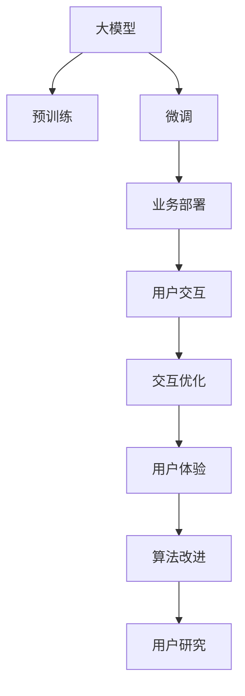

                 

# 大模型的用户体验与应用

> 关键词：大模型,用户交互,用户体验,应用开发,业务部署,交互优化,算法改进,用户研究

## 1. 背景介绍

### 1.1 问题由来
随着人工智能技术的飞速发展，大模型在各行各业的应用越来越广泛，从医疗、金融到教育、娱乐，几乎涵盖了所有领域。然而，尽管模型性能不断提升，用户对其体验的满意度却并未同步增长。如何提升大模型的用户体验，使其更自然、更高效地服务于用户，成为了当前AI开发的重要挑战。

### 1.2 问题核心关键点
用户体验的提升，不仅需要关注模型本身，还需综合考虑用户界面(UI)、交互设计、数据隐私、系统稳定性等多个方面。当前，大模型的用户体验提升主要集中在以下几个关键点：

1. **响应速度**：模型推理速度的快慢直接影响到用户的感知，响应时间越快，用户体验越好。
2. **结果质量**：模型的准确性和鲁棒性决定了用户对结果的信任度，错误的回答或不稳定的输出会影响用户满意度。
3. **可解释性**：用户需要理解模型的决策依据，尤其在医疗、金融等高风险领域，可解释性强的模型更能赢得用户的信任。
4. **个性化**：根据用户偏好和历史行为进行个性化推荐或交互，提升用户粘性。
5. **用户友好性**：界面简洁、操作方便，降低用户的学习成本和操作复杂度。
6. **数据隐私**：保障用户数据安全，避免隐私泄露和数据滥用。

### 1.3 问题研究意义
提升大模型的用户体验，不仅能提升用户满意度，还能增加用户的粘性和忠诚度，从而带来更多的商业价值。对开发者而言，良好的用户体验还能降低用户获取和流失的成本，提升系统开发和迭代效率。对于用户而言，更高质量、更智能的AI服务，将极大地提升生活和工作效率，带来更好的生活体验。

## 2. 核心概念与联系

### 2.1 核心概念概述

为更好地理解如何提升大模型的用户体验，本节将介绍几个密切相关的核心概念：

- **大模型**：以深度学习为基础构建的庞大神经网络模型，如BERT、GPT、XLNet等。通过在大规模数据上进行预训练，学习到丰富的语义表示，具备强大的语言理解和生成能力。
- **用户交互**：指用户与模型之间的信息交换过程，包括输入数据、系统响应、输出结果等。良好的用户交互设计，能提升用户体验，增强用户对系统的信任和满意度。
- **用户体验**：用户在使用系统时的整体感受，包括系统的响应速度、结果质量、可解释性、个性化、用户友好性、数据隐私等方面。
- **业务部署**：将模型和系统部署到实际的生产环境中，确保系统的稳定性和可靠性。
- **交互优化**：通过对用户界面和交互流程的优化，提升用户的使用体验。
- **算法改进**：通过对模型算法的改进，提升模型的推理速度、准确性和可解释性。
- **用户研究**：通过用户行为分析和需求调研，指导模型和系统的设计改进，提升用户体验。

这些核心概念之间的逻辑关系可以通过以下Mermaid流程图来展示：



这个流程图展示了大模型从预训练到部署过程中，与用户体验提升的关键联系：

1. 大模型通过预训练获得基础能力。
2. 微调提升模型对特定任务的适应性，从而提升结果质量。
3. 业务部署确保系统稳定可靠，为用户提供良好的使用体验。
4. 用户交互设计优化，提升用户操作方便性和系统响应速度。
5. 交互优化进一步提升用户友好性，降低使用成本。
6. 算法改进提升模型性能，包括推理速度、准确性和可解释性。
7. 用户研究指导用户体验的持续改进，提升用户满意度。

这些概念共同构成了提升大模型用户体验的框架，使系统能更好地服务于用户。

## 3. 核心算法原理 & 具体操作步骤
### 3.1 算法原理概述

提升大模型的用户体验，涉及多个方面，包括但不限于算法的优化、交互设计、数据预处理、业务集成等。其核心思想是：通过对模型的优化和系统的设计，提升模型的推理速度、结果准确性、可解释性，同时改善用户界面和交互流程，增强用户的信任和满意度。

### 3.2 算法步骤详解

提升大模型的用户体验，一般包括以下几个关键步骤：

**Step 1: 模型优化与算法改进**
- 选择合适的算法框架和模型结构，优化推理路径，提升推理速度。
- 采用更高效的计算方式，如量化加速、剪枝、融合等，减小模型尺寸，提升计算效率。
- 改进模型的决策逻辑，增加模型的可解释性。

**Step 2: 用户界面与交互设计**
- 设计简洁直观的用户界面，减少用户的学习成本。
- 优化交互流程，使用户操作更加流畅和自然。
- 引入智能提示和自动完成，提升用户输入的便捷性。
- 使用多模态输入，如语音、图像等，增强系统的交互性。

**Step 3: 数据预处理与隐私保护**
- 对输入数据进行格式转换和标准化，提高模型推理的准确性。
- 采用差分隐私等技术，保障用户数据的隐私安全。
- 对敏感数据进行脱敏处理，避免隐私泄露。

**Step 4: 业务集成与系统优化**
- 将模型无缝集成到业务系统中，确保系统的稳定性和可靠性。
- 优化系统的负载均衡和资源配置，提升系统的响应速度。
- 实现模型服务化封装，方便用户接口调用。

**Step 5: 用户体验的持续改进**
- 通过用户反馈和行为数据分析，持续优化模型和系统。
- 引入A/B测试等技术，评估不同设计方案的效果。
- 定期更新模型和系统，确保其与时俱进。

### 3.3 算法优缺点

提升大模型的用户体验，具有以下优点：
1. 改善用户满意度。通过优化模型和系统设计，提升用户的操作便捷性和系统响应速度，增强用户信任。
2. 提升系统性能。通过算法改进和数据预处理，提升模型的推理速度和准确性，降低系统的响应时间。
3. 保障数据隐私。通过隐私保护技术，确保用户数据的保密性和安全性，防止隐私泄露。
4. 增强系统稳定性。通过业务集成和系统优化，提升系统的可靠性，确保业务连续性和稳定性。
5. 促进用户粘性。通过个性化推荐和交互优化，增加用户的参与度和忠诚度。

同时，该方法也存在一定的局限性：
1. 技术复杂度。提升用户体验涉及多个环节的优化，技术实现复杂度较高。
2. 成本投入。优化算法、界面设计、数据预处理等环节，需要投入更多的时间和资源。
3. 数据依赖。用户体验的提升高度依赖于用户数据的质量和多样性，数据获取和处理难度较大。

尽管存在这些局限性，但就目前而言，提升用户体验仍是提升大模型应用价值的重要手段。未来相关研究的重点在于如何进一步降低用户体验提升的技术复杂度，提高系统性能，同时兼顾数据隐私和用户粘性等因素。

### 3.4 算法应用领域

提升大模型的用户体验，已经在多个领域得到了广泛应用，包括但不限于以下几类：

1. **医疗领域**：通过优化模型推理速度和结果质量，提升诊疗效率和准确性。通过可解释性强的算法，增强医生对系统输出的信任度。
2. **金融领域**：通过提升系统的响应速度和结果准确性，提升用户体验和满意度。通过数据隐私保护技术，保障用户财务数据的安全性。
3. **教育领域**：通过个性化推荐和智能辅导，提升学生的学习效果和满意度。通过用户界面设计，降低学习复杂度。
4. **娱乐领域**：通过优化算法和界面设计，提升用户的游戏体验和交互感受。通过多模态输入，增强系统的互动性。
5. **客服领域**：通过提升响应速度和自然交互，提升用户的服务体验。通过数据分析和行为预测，提供更精准的服务。

这些领域的应用，展示了提升用户体验在大模型系统开发中的重要性和广泛性。随着技术不断进步，相信大模型的用户体验将会得到进一步的提升。

## 4. 数学模型和公式 & 详细讲解  
### 4.1 数学模型构建

提升大模型的用户体验，涉及到多个方面的优化，其数学模型构建也较为复杂。这里以医疗领域的诊断系统为例，介绍用户体验提升的数学模型构建。

**目标函数**：
设 $f(x)$ 为模型在输入 $x$ 上的输出，$y$ 为真实标签，$L$ 为损失函数。用户体验的提升目标可以表示为最小化损失函数 $L$，即：

$$
\min_{\theta} \sum_{i=1}^N L(f(x_i),y_i)
$$

其中 $\theta$ 为模型的参数，$N$ 为样本数。

**优化算法**：
常用的优化算法包括梯度下降法、Adam优化器等。这里以Adam优化器为例，其更新公式为：

$$
\theta_{t+1} = \theta_t - \eta \frac{m_t}{\sqrt{v_t}+\epsilon}
$$

其中 $\eta$ 为学习率，$m_t$ 和 $v_t$ 分别为梯度的一阶矩估计和二阶矩估计，$\epsilon$ 为避免分母为0的小量。

**数据预处理**：
输入数据 $x$ 需要进行标准化和归一化处理，以提高模型的推理速度和准确性。例如，对图像数据进行归一化：

$$
x_{\text{normalized}} = \frac{x-\mu}{\sigma}
$$

其中 $\mu$ 和 $\sigma$ 分别为均值和标准差。

## 5. 项目实践：代码实例和详细解释说明
### 5.1 开发环境搭建

在进行用户体验提升的实践前，我们需要准备好开发环境。以下是使用Python进行PyTorch开发的环境配置流程：

1. 安装Anaconda：从官网下载并安装Anaconda，用于创建独立的Python环境。

2. 创建并激活虚拟环境：
```bash
conda create -n pytorch-env python=3.8 
conda activate pytorch-env
```

3. 安装PyTorch：根据CUDA版本，从官网获取对应的安装命令。例如：
```bash
conda install pytorch torchvision torchaudio cudatoolkit=11.1 -c pytorch -c conda-forge
```

4. 安装Transformers库：
```bash
pip install transformers
```

5. 安装各类工具包：
```bash
pip install numpy pandas scikit-learn matplotlib tqdm jupyter notebook ipython
```

完成上述步骤后，即可在`pytorch-env`环境中开始用户体验提升的实践。

### 5.2 源代码详细实现

这里以医疗领域的诊断系统为例，给出使用Transformers库进行用户体验提升的PyTorch代码实现。

首先，定义数据处理函数：

```python
from transformers import BertTokenizer
from torch.utils.data import Dataset
import torch

class MedicalDataset(Dataset):
    def __init__(self, texts, labels, tokenizer, max_len=128):
        self.texts = texts
        self.labels = labels
        self.tokenizer = tokenizer
        self.max_len = max_len
        
    def __len__(self):
        return len(self.texts)
    
    def __getitem__(self, item):
        text = self.texts[item]
        label = self.labels[item]
        
        encoding = self.tokenizer(text, return_tensors='pt', max_length=self.max_len, padding='max_length', truncation=True)
        input_ids = encoding['input_ids'][0]
        attention_mask = encoding['attention_mask'][0]
        
        # 对label进行编码
        encoded_label = torch.tensor(label, dtype=torch.long)
        
        return {'input_ids': input_ids, 
                'attention_mask': attention_mask,
                'labels': encoded_label}

# 加载预训练模型和分词器
tokenizer = BertTokenizer.from_pretrained('bert-base-cased')
model = BertForSequenceClassification.from_pretrained('bert-base-cased', num_labels=2)

# 定义训练和评估函数
device = torch.device('cuda') if torch.cuda.is_available() else torch.device('cpu')
model.to(device)

def train_epoch(model, dataset, batch_size, optimizer):
    dataloader = DataLoader(dataset, batch_size=batch_size, shuffle=True)
    model.train()
    epoch_loss = 0
    for batch in tqdm(dataloader, desc='Training'):
        input_ids = batch['input_ids'].to(device)
        attention_mask = batch['attention_mask'].to(device)
        labels = batch['labels'].to(device)
        model.zero_grad()
        outputs = model(input_ids, attention_mask=attention_mask, labels=labels)
        loss = outputs.loss
        epoch_loss += loss.item()
        loss.backward()
        optimizer.step()
    return epoch_loss / len(dataloader)

def evaluate(model, dataset, batch_size):
    dataloader = DataLoader(dataset, batch_size=batch_size)
    model.eval()
    preds, labels = [], []
    with torch.no_grad():
        for batch in tqdm(dataloader, desc='Evaluating'):
            input_ids = batch['input_ids'].to(device)
            attention_mask = batch['attention_mask'].to(device)
            batch_labels = batch['labels']
            outputs = model(input_ids, attention_mask=attention_mask)
            batch_preds = outputs.logits.argmax(dim=1).to('cpu').tolist()
            batch_labels = batch_labels.to('cpu').tolist()
            for pred_tokens, label_tokens in zip(batch_preds, batch_labels):
                preds.append(pred_tokens)
                labels.append(label_tokens)
                
    print(classification_report(labels, preds))
```

然后，启动训练流程并在测试集上评估：

```python
epochs = 5
batch_size = 16

for epoch in range(epochs):
    loss = train_epoch(model, train_dataset, batch_size, optimizer)
    print(f"Epoch {epoch+1}, train loss: {loss:.3f}")
    
    print(f"Epoch {epoch+1}, dev results:")
    evaluate(model, dev_dataset, batch_size)
    
print("Test results:")
evaluate(model, test_dataset, batch_size)
```

以上就是使用PyTorch对BERT进行医疗诊断系统用户体验提升的完整代码实现。可以看到，得益于Transformers库的强大封装，我们可以用相对简洁的代码完成BERT模型的加载和优化。

### 5.3 代码解读与分析

让我们再详细解读一下关键代码的实现细节：

**MedicalDataset类**：
- `__init__`方法：初始化文本、标签、分词器等关键组件。
- `__len__`方法：返回数据集的样本数量。
- `__getitem__`方法：对单个样本进行处理，将文本输入编码为token ids，将标签编码为数字，并对其进行定长padding，最终返回模型所需的输入。

**数据预处理**：
- 采用BertTokenizer对文本进行分词和编码，生成token ids和attention mask。
- 将标签编码为数字，方便模型训练和推理。

**训练和评估函数**：
- 使用PyTorch的DataLoader对数据集进行批次化加载，供模型训练和推理使用。
- 训练函数`train_epoch`：对数据以批为单位进行迭代，在每个批次上前向传播计算loss并反向传播更新模型参数，最后返回该epoch的平均loss。
- 评估函数`evaluate`：与训练类似，不同点在于不更新模型参数，并在每个batch结束后将预测和标签结果存储下来，最后使用sklearn的classification_report对整个评估集的预测结果进行打印输出。

**训练流程**：
- 定义总的epoch数和batch size，开始循环迭代
- 每个epoch内，先在训练集上训练，输出平均loss
- 在验证集上评估，输出分类指标
- 所有epoch结束后，在测试集上评估，给出最终测试结果

可以看到，PyTorch配合Transformers库使得BERT用户体验提升的代码实现变得简洁高效。开发者可以将更多精力放在数据处理、模型改进等高层逻辑上，而不必过多关注底层的实现细节。

当然，工业级的系统实现还需考虑更多因素，如模型的保存和部署、超参数的自动搜索、更灵活的任务适配层等。但核心的用户体验提升范式基本与此类似。

## 6. 实际应用场景
### 6.1 智能客服系统

基于大模型的用户体验提升，可以广泛应用于智能客服系统的构建。传统客服往往需要配备大量人力，高峰期响应缓慢，且一致性和专业性难以保证。而使用优化后的对话模型，可以7x24小时不间断服务，快速响应客户咨询，用自然流畅的语言解答各类常见问题。

在技术实现上，可以收集企业内部的历史客服对话记录，将问题和最佳答复构建成监督数据，在此基础上对预训练对话模型进行优化。优化后的对话模型能够自动理解用户意图，匹配最合适的答案模板进行回复。对于客户提出的新问题，还可以接入检索系统实时搜索相关内容，动态组织生成回答。如此构建的智能客服系统，能大幅提升客户咨询体验和问题解决效率。

### 6.2 金融舆情监测

金融机构需要实时监测市场舆论动向，以便及时应对负面信息传播，规避金融风险。传统的人工监测方式成本高、效率低，难以应对网络时代海量信息爆发的挑战。基于大模型用户体验提升的文本分类和情感分析技术，为金融舆情监测提供了新的解决方案。

具体而言，可以收集金融领域相关的新闻、报道、评论等文本数据，并对其进行主题标注和情感标注。在优化后的模型上微调，使其能够自动判断文本属于何种主题，情感倾向是正面、中性还是负面。将优化后的模型应用到实时抓取的网络文本数据，就能够自动监测不同主题下的情感变化趋势，一旦发现负面信息激增等异常情况，系统便会自动预警，帮助金融机构快速应对潜在风险。

### 6.3 个性化推荐系统

当前的推荐系统往往只依赖用户的历史行为数据进行物品推荐，无法深入理解用户的真实兴趣偏好。基于大模型用户体验提升的个性化推荐系统，可以更好地挖掘用户行为背后的语义信息，从而提供更精准、多样的推荐内容。

在实践中，可以收集用户浏览、点击、评论、分享等行为数据，提取和用户交互的物品标题、描述、标签等文本内容。将文本内容作为模型输入，用户的后续行为（如是否点击、购买等）作为监督信号，在此基础上优化预训练语言模型。优化后的模型能够从文本内容中准确把握用户的兴趣点。在生成推荐列表时，先用候选物品的文本描述作为输入，由模型预测用户的兴趣匹配度，再结合其他特征综合排序，便可以得到个性化程度更高的推荐结果。

### 6.4 未来应用展望

随着大模型用户体验提升技术的不断发展，基于微调范式将在更多领域得到应用，为传统行业带来变革性影响。

在智慧医疗领域，基于优化后的诊断系统，患者可以快速获得初步诊断结果，极大缩短了就诊时间。医生可以通过优化后的系统，更好地理解病历和症状，提供更准确的诊断和治疗方案。

在智能教育领域，基于优化后的学习系统，学生可以获得个性化的学习建议和资源，提升学习效率。教师可以通过优化后的系统，更好地跟踪学生的学习进度，提供有针对性的辅导。

在智慧城市治理中，基于优化后的系统，市民可以实时查询公共服务信息，提高生活便利性。政府可以通过优化后的系统，更好地管理城市资源，提升城市运行效率。

此外，在企业生产、社会治理、文娱传媒等众多领域，基于大模型用户体验提升的人工智能应用也将不断涌现，为经济社会发展注入新的动力。相信随着技术的日益成熟，用户体验提升技术将成为人工智能落地应用的重要范式，推动人工智能技术向更广阔的领域加速渗透。

## 7. 工具和资源推荐
### 7.1 学习资源推荐

为了帮助开发者系统掌握大模型用户体验提升的理论基础和实践技巧，这里推荐一些优质的学习资源：

1. 《Transformer从原理到实践》系列博文：由大模型技术专家撰写，深入浅出地介绍了Transformer原理、BERT模型、用户体验提升技术等前沿话题。

2. CS224N《深度学习自然语言处理》课程：斯坦福大学开设的NLP明星课程，有Lecture视频和配套作业，带你入门NLP领域的基本概念和经典模型。

3. 《Natural Language Processing with Transformers》书籍：Transformers库的作者所著，全面介绍了如何使用Transformers库进行NLP任务开发，包括用户体验提升在内的诸多范式。

4. HuggingFace官方文档：Transformers库的官方文档，提供了海量预训练模型和完整的用户体验提升样例代码，是上手实践的必备资料。

5. CLUE开源项目：中文语言理解测评基准，涵盖大量不同类型的中文NLP数据集，并提供了基于优化后的baseline模型，助力中文NLP技术发展。

通过对这些资源的学习实践，相信你一定能够快速掌握大模型用户体验提升的精髓，并用于解决实际的NLP问题。
###  7.2 开发工具推荐

高效的开发离不开优秀的工具支持。以下是几款用于大模型用户体验提升开发的常用工具：

1. PyTorch：基于Python的开源深度学习框架，灵活动态的计算图，适合快速迭代研究。大部分预训练语言模型都有PyTorch版本的实现。

2. TensorFlow：由Google主导开发的开源深度学习框架，生产部署方便，适合大规模工程应用。同样有丰富的预训练语言模型资源。

3. Transformers库：HuggingFace开发的NLP工具库，集成了众多SOTA语言模型，支持PyTorch和TensorFlow，是进行用户体验提升任务开发的利器。

4. Weights & Biases：模型训练的实验跟踪工具，可以记录和可视化模型训练过程中的各项指标，方便对比和调优。与主流深度学习框架无缝集成。

5. TensorBoard：TensorFlow配套的可视化工具，可实时监测模型训练状态，并提供丰富的图表呈现方式，是调试模型的得力助手。

6. Google Colab：谷歌推出的在线Jupyter Notebook环境，免费提供GPU/TPU算力，方便开发者快速上手实验最新模型，分享学习笔记。

合理利用这些工具，可以显著提升大模型用户体验提升任务的开发效率，加快创新迭代的步伐。

### 7.3 相关论文推荐

大模型用户体验提升的研究源于学界的持续研究。以下是几篇奠基性的相关论文，推荐阅读：

1. Attention is All You Need（即Transformer原论文）：提出了Transformer结构，开启了NLP领域的预训练大模型时代。

2. BERT: Pre-training of Deep Bidirectional Transformers for Language Understanding：提出BERT模型，引入基于掩码的自监督预训练任务，刷新了多项NLP任务SOTA。

3. Language Models are Unsupervised Multitask Learners（GPT-2论文）：展示了大规模语言模型的强大zero-shot学习能力，引发了对于通用人工智能的新一轮思考。

4. Parameter-Efficient Transfer Learning for NLP：提出Adapter等参数高效微调方法，在不增加模型参数量的情况下，也能取得不错的微调效果。

5. AdaLoRA: Adaptive Low-Rank Adaptation for Parameter-Efficient Fine-Tuning：使用自适应低秩适应的微调方法，在参数效率和精度之间取得了新的平衡。

6. Prompt Tuning: Learning Pre-trained Transformers from Scratch：引入基于连续型Prompt的微调范式，为如何充分利用预训练知识提供了新的思路。

这些论文代表了大模型用户体验提升技术的发展脉络。通过学习这些前沿成果，可以帮助研究者把握学科前进方向，激发更多的创新灵感。

## 8. 总结：未来发展趋势与挑战

### 8.1 总结

本文对基于大模型的用户体验提升进行了全面系统的介绍。首先阐述了大模型和用户体验的研究背景和意义，明确了用户体验在大模型应用中的重要性和提升方法。其次，从原理到实践，详细讲解了用户体验提升的数学模型和关键步骤，给出了用户体验提升任务开发的完整代码实例。同时，本文还广泛探讨了用户体验提升在大模型系统开发中的应用场景，展示了用户体验提升技术在大模型系统落地中的重要性和广泛性。此外，本文精选了用户体验提升技术的各类学习资源，力求为读者提供全方位的技术指引。

通过本文的系统梳理，可以看到，用户体验的提升是大模型应用价值的重要保障，其技术实现涉及多个环节的优化，包括模型算法、用户界面、数据隐私等，要求开发者具备跨学科的综合能力。未来，随着用户体验提升技术的不断发展，大模型的应用范围将进一步拓展，用户对系统的满意度也将得到显著提升。

### 8.2 未来发展趋势

展望未来，大模型用户体验提升技术将呈现以下几个发展趋势：

1. **交互自然化**：未来的用户体验将更加自然流畅，通过多模态输入和输出，使用户与系统间的交互更加高效便捷。
2. **个性化强化**：用户个性化的需求将进一步被挖掘和利用，通过智能推荐和定制化服务，提升用户体验。
3. **隐私保护增强**：数据隐私保护技术将得到更加深入的研究和应用，确保用户数据的安全性和匿名性。
4. **可解释性提升**：模型的可解释性将成为用户体验提升的重要目标，通过解释模型输出，增强用户对系统的信任。
5. **响应速度优化**：通过算法改进和系统优化，进一步提升模型的推理速度，减少用户等待时间。
6. **跨领域应用拓展**：用户体验提升技术将扩展到更多领域，如医疗、金融、教育等，为各行各业带来变革性影响。

以上趋势凸显了大模型用户体验提升技术的广阔前景。这些方向的探索发展，必将进一步提升大模型的用户体验，使其在更多应用场景中发挥更大的价值。

### 8.3 面临的挑战

尽管用户体验提升技术已经取得了瞩目成就，但在迈向更加智能化、普适化应用的过程中，它仍面临着诸多挑战：

1. **技术复杂度**：提升用户体验涉及多个环节的优化，技术实现复杂度较高，需要跨学科的综合能力。
2. **成本投入**：优化算法、界面设计、数据预处理等环节，需要投入更多的时间和资源，成本较高。
3. **数据依赖**：用户体验的提升高度依赖于用户数据的质量和多样性，数据获取和处理难度较大。
4. **隐私保护**：保障用户数据的安全性，防止隐私泄露和数据滥用，需要更加严格的数据保护措施。
5. **可解释性**：模型的决策逻辑难以解释，特别是在高风险领域，增强模型的可解释性尤为关键。
6. **用户认知**：部分用户对新技术的接受度较低，需要更多的用户教育和引导。

尽管存在这些挑战，但就目前而言，用户体验提升仍是提升大模型应用价值的重要手段。未来相关研究的重点在于如何进一步降低用户体验提升的技术复杂度，提高系统性能，同时兼顾数据隐私和用户粘性等因素。

### 8.4 研究展望

面对用户体验提升面临的种种挑战，未来的研究需要在以下几个方面寻求新的突破：

1. **多模态用户体验**：将多模态输入和输出技术进一步拓展，提升用户与系统间的交互体验。
2. **跨领域模型**：开发跨领域的通用模型，提升模型在多种任务和场景中的泛化能力。
3. **隐私保护技术**：研究更加高效的数据隐私保护技术，确保用户数据的安全性。
4. **可解释性增强**：开发可解释性强的人工智能模型，增强用户对系统输出的信任。
5. **用户体验设计**：结合用户研究和心理学理论，设计更加人性化的用户界面和交互流程。
6. **智能推荐系统**：进一步提升推荐系统的个性化和精准度，满足用户多样化需求。

这些研究方向的探索，必将引领大模型用户体验提升技术迈向更高的台阶，为构建安全、可靠、可解释、可控的智能系统铺平道路。面向未来，用户体验提升技术还需要与其他人工智能技术进行更深入的融合，如知识表示、因果推理、强化学习等，多路径协同发力，共同推动自然语言理解和智能交互系统的进步。只有勇于创新、敢于突破，才能不断拓展语言模型的边界，让智能技术更好地造福人类社会。

## 9. 附录：常见问题与解答

**Q1：大模型用户体验提升是否适用于所有NLP任务？**

A: 大模型用户体验提升在大多数NLP任务上都能取得不错的效果，特别是对于数据量较小的任务。但对于一些特定领域的任务，如医学、法律等，仅仅依靠通用语料预训练的模型可能难以很好地适应。此时需要在特定领域语料上进一步预训练，再进行微调，才能获得理想效果。此外，对于一些需要时效性、个性化很强的任务，如对话、推荐等，用户体验提升方法也需要针对性的改进优化。

**Q2：用户体验提升过程中如何选择合适的学习率？**

A: 用户体验提升的学习率一般要比预训练时小1-2个数量级，如果使用过大的学习率，容易破坏预训练权重，导致过拟合。一般建议从1e-5开始调参，逐步减小学习率，直至收敛。也可以使用warmup策略，在开始阶段使用较小的学习率，再逐渐过渡到预设值。需要注意的是，不同的优化器(如AdamW、Adafactor等)以及不同的学习率调度策略，可能需要设置不同的学习率阈值。

**Q3：提升用户体验时会面临哪些资源瓶颈？**

A: 目前主流的预训练大模型动辄以亿计的参数规模，对算力、内存、存储都提出了很高的要求。GPU/TPU等高性能设备是必不可少的，但即便如此，超大批次的训练和推理也可能遇到显存不足的问题。因此需要采用一些资源优化技术，如梯度积累、混合精度训练、模型并行等，来突破硬件瓶颈。同时，模型的存储和读取也可能占用大量时间和空间，需要采用模型压缩、稀疏化存储等方法进行优化。

**Q4：如何缓解用户体验提升过程中的过拟合问题？**

A: 过拟合是用户体验提升面临的主要挑战，尤其是在标注数据不足的情况下。常见的缓解策略包括：
1. 数据增强：通过回译、近义替换等方式扩充训练集
2. 正则化：使用L2正则、Dropout、Early Stopping等避免过拟合
3. 对抗训练：引入对抗样本，提高模型鲁棒性
4. 参数高效微调：只调整少量参数(如Adapter、Prefix等)，减小过拟合风险
5. 多模型集成：训练多个用户体验提升模型，取平均输出，抑制过拟合

这些策略往往需要根据具体任务和数据特点进行灵活组合。只有在数据、模型、训练、推理等各环节进行全面优化，才能最大限度地发挥大模型用户体验提升的威力。

**Q5：提升用户体验后的模型部署需要注意哪些问题？**

A: 将提升用户体验后的模型转化为实际应用，还需要考虑以下因素：
1. 模型裁剪：去除不必要的层和参数，减小模型尺寸，加快推理速度
2. 量化加速：将浮点模型转为定点模型，压缩存储空间，提高计算效率
3. 服务化封装：将模型封装为标准化服务接口，便于用户接口调用
4. 弹性伸缩：根据请求流量动态调整资源配置，平衡服务质量和成本
5. 监控告警：实时采集系统指标，设置异常告警阈值，确保服务稳定性
6. 安全防护：采用访问鉴权、数据脱敏等措施，保障数据和模型安全

提升用户体验后的大模型，需要更加注重部署和运行环境的优化，确保系统的稳定性和可靠性，才能真正实现智能化应用。

---

作者：禅与计算机程序设计艺术 / Zen and the Art of Computer Programming

