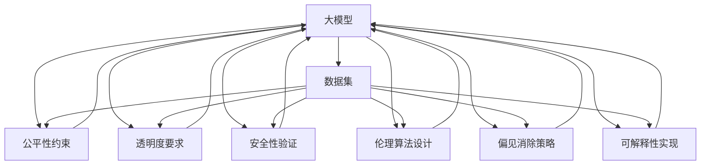

                 

# 大模型监管:确保AI发展的安全性和公平性

> 关键词：人工智能(AI)监管, 公平性, 安全性, 模型透明性, 伦理算法, 偏见消除, 可解释性, 数据保护

## 1. 背景介绍

### 1.1 问题由来
随着人工智能技术的快速发展和应用深化，大型语言模型、计算机视觉、强化学习等大模型在金融、医疗、司法、教育等多个领域展现出巨大潜力，同时也带来了诸多风险和挑战。在享受技术红利的同时，社会公众对AI技术的伦理、安全、公平等问题的关注度逐渐提高，AI的监管问题被提上议程。

近年来，全球各国纷纷出台相关法规和政策，要求AI技术的开发和应用必须遵守伦理、安全、公平等原则。例如，欧盟的《通用数据保护条例》(GDPR)、美国的《AI法案》等都对AI应用的伦理、透明度、数据隐私等方面提出了严格要求。这些法规和政策虽然有助于规范AI技术的应用，但也带来了一系列技术上的挑战。

在技术层面，如何设计并实现符合法规要求的AI系统，如何在保障模型性能的同时，确保模型的公平性、透明性、安全性等，成为AI领域研究的热点问题。本文将从监管角度出发，对大模型的监管策略进行详细探讨，介绍如何构建符合伦理、安全、公平等要求的AI系统。

## 2. 核心概念与联系

### 2.1 核心概念概述

为更好地理解大模型的监管策略，本文将介绍几个密切相关的核心概念：

- **人工智能(AI)**：涉及机器学习、深度学习、自然语言处理、计算机视觉等领域的综合技术，旨在模拟人类智能行为，解决复杂问题。
- **大模型(Large Model)**：指具有亿级甚至更高参数量的深度学习模型，如BERT、GPT等，通过大规模数据预训练得到丰富知识，可用于解决特定任务。
- **公平性(Fairness)**：指AI系统在处理不同群体、不同个体时，应保证输出结果不受性别、种族、年龄、职业等因素的不公平影响。
- **透明度(Transparency)**：指AI系统的决策过程应能够被解释和理解，使得用户和开发者可以理解系统如何做出决策。
- **安全性(Security)**：指AI系统在运行过程中，应避免被恶意攻击或利用，保证数据和模型的安全。
- **伦理算法(Ethical Algorithms)**：指设计和使用AI算法时，应遵守伦理原则，避免算法带来的社会负面影响。
- **偏见消除(Bias Mitigation)**：指在使用大模型时，应努力消除模型中潜在的偏见，确保模型对所有群体的公平性。
- **可解释性(Explainability)**：指AI系统在做出决策时，应能够清晰解释其背后的推理过程，使用户和开发者对其决策结果有充分的理解和信任。

这些概念之间紧密联系，共同构成了大模型监管的基本框架。透明度、公平性和安全性是大模型监管的核心目标，伦理算法和偏见消除是实现这些目标的重要手段。

### 2.2 核心概念原理和架构的 Mermaid 流程图(Mermaid 流程节点中不要有括号、逗号等特殊字符)



此流程图展示了数据集如何在大模型中进行公平性、透明度、安全性、伦理算法、偏见消除和可解释性等多个维度进行监管的过程。数据集是这些监管手段的共同基础，各维度监管目标在模型构建和训练过程中得到实现和保障。

## 3. 核心算法原理 & 具体操作步骤

### 3.1 算法原理概述

大模型的监管策略主要涉及公平性、透明度、安全性和伦理算法设计等方面。这些策略的目标是确保模型在处理不同群体和不同个体时，能够公平地对待每个人，决策过程能够被理解，模型和数据的安全得到保障，以及模型设计和使用遵守伦理原则。

**公平性**：公平性监管旨在确保模型在处理不同群体时不存在歧视。通常通过数据集的多样性和代表性、模型的训练和测试数据集的一致性、模型预测结果的统计检测等手段实现。

**透明度**：透明度监管要求模型的决策过程可解释，使用户和开发者能够理解模型的输出结果。通常通过模型设计、训练日志、中间结果输出等手段实现。

**安全性**：安全性监管要求模型在运行过程中不会受到恶意攻击或利用，数据和模型的安全得到保障。通常通过模型检测、代码审计、数据加密等手段实现。

**伦理算法设计**：伦理算法监管要求模型设计和使用符合伦理原则，避免算法带来的社会负面影响。通常通过算法设计、模型测试、伦理评估等手段实现。

**偏见消除**：偏见消除监管要求模型中不含有潜在的偏见，对所有群体的处理公平。通常通过数据清洗、模型偏差检测、算法调整等手段实现。

**可解释性**：可解释性监管要求模型在做出决策时能够清晰解释其背后的推理过程，使用户和开发者对其决策结果有充分的理解和信任。通常通过模型设计、中间结果输出、解释器等手段实现。

### 3.2 算法步骤详解

基于上述监管目标，大模型的监管策略一般包括以下几个关键步骤：

**Step 1: 数据准备和预处理**
- 收集多样化和代表性的数据集，确保数据集覆盖所有潜在用户的特征。
- 对数据进行清洗和标注，去除异常值、噪音等，确保数据质量。
- 进行数据增强，如数据扩充、数据合成等，增加数据集的多样性。

**Step 2: 模型设计和选择**
- 选择合适的模型架构，如Transformer、CNN等，考虑模型的公平性、透明度、安全性等因素。
- 确定模型的训练和推理机制，确保模型在处理不同数据时的鲁棒性。

**Step 3: 模型训练和优化**
- 使用公平性约束和透明度要求指导模型训练过程，确保模型在各个阶段符合监管目标。
- 对模型进行安全性验证，防止模型被恶意攻击或利用。
- 进行伦理算法设计，确保模型遵守伦理原则。
- 实现偏见消除策略，检测和消除模型中的潜在偏见。
- 实现可解释性，提供模型的决策过程解释。

**Step 4: 模型评估和部署**
- 在多样化的数据集上评估模型性能，确保模型在处理不同群体时不存在歧视。
- 在现实环境中进行模型测试，确保模型在实际应用中的表现。
- 对模型进行安全性测试，检测和修复潜在的漏洞。
- 进行伦理评估，确保模型遵守伦理原则。
- 实现可解释性，提供模型决策过程的解释。

**Step 5: 持续监测和优化**
- 在模型部署后持续监测模型性能和数据安全，确保模型符合监管要求。
- 对模型进行定期更新和优化，避免模型出现性能下降或安全漏洞。
- 进行伦理再评估，确保模型继续遵守伦理原则。
- 提供模型解释和用户反馈机制，持续改进模型可解释性。

### 3.3 算法优缺点

大模型的监管策略具有以下优点：
1. 确保模型公平性、透明度和安全性，提升模型的信任度和可接受度。
2. 遵守伦理算法设计原则，避免模型带来的社会负面影响。
3. 消除模型中的偏见，提升模型对所有群体的公平性。
4. 实现模型的可解释性，提高用户和开发者对模型的理解和使用信心。

同时，这些策略也存在一些局限性：
1. 数据集的准备和预处理可能面临成本高、时间长的挑战。
2. 模型训练和优化过程中，需要兼顾公平性、透明度、安全性等多个目标，可能增加开发难度。
3. 持续监测和优化需要持续投入，对资源和技术要求较高。
4. 伦理算法的设计和实施可能涉及复杂的伦理问题，需要多方参与和讨论。

尽管存在这些局限性，但通过系统化的监管策略，可以显著提升大模型的公平性、透明度和安全性，为其在实际应用中的广泛应用提供有力保障。

### 3.4 算法应用领域

大模型的监管策略在金融、医疗、司法、教育等多个领域均有应用，以下是几个典型案例：

**金融风控**
在金融领域，大模型用于客户信用评分、反欺诈检测、风险预测等任务。监管策略主要关注模型的公平性、透明度和安全性，确保模型在处理不同性别、种族、年龄的客户时不存在歧视，决策过程透明，数据和模型安全得到保障。

**医疗诊断**
在医疗领域，大模型用于疾病诊断、治疗方案推荐等任务。监管策略主要关注模型的公平性、透明度和伦理算法设计，确保模型在处理不同年龄、性别的患者时不存在歧视，决策过程透明，遵守伦理原则。

**司法判决**
在司法领域，大模型用于案件判决、证据分析等任务。监管策略主要关注模型的公平性、透明度和安全性，确保模型在处理不同性别、种族、职业的案件时不存在歧视，决策过程透明，数据和模型安全得到保障。

**教育评估**
在教育领域，大模型用于学生评估、教育资源推荐等任务。监管策略主要关注模型的公平性、透明度和伦理算法设计，确保模型在处理不同性别、种族、经济背景的学生时不存在歧视，决策过程透明，遵守伦理原则。

## 4. 数学模型和公式 & 详细讲解 & 举例说明

### 4.1 数学模型构建

为具体化大模型的监管策略，本节将构建几个关键数学模型，并详细讲解其原理和应用。

**公平性模型**
假设我们有一个二分类问题，模型输出 $y$ 表示样本属于正类的概率，真实标签 $y$ 为 $0$ 或 $1$。定义公平性损失函数 $\mathcal{L}_{\text{fair}}$ 为：

$$
\mathcal{L}_{\text{fair}} = \frac{1}{N}\sum_{i=1}^N [(y_i-y^*)\log\frac{y_i}{y^*}+(1-y_i-y^*)\log\frac{1-y_i}{1-y^*}]
$$

其中 $y^*$ 为预定义的公平阈值，通常取 $0.5$。该模型通过最大化公平性损失函数，确保模型在处理不同群体时不存在歧视。

**透明度模型**
定义透明度损失函数 $\mathcal{L}_{\text{trans}}$ 为：

$$
\mathcal{L}_{\text{trans}} = \frac{1}{N}\sum_{i=1}^N \left(\frac{\partial y}{\partial x}\right)^2
$$

该模型通过最大化透明度损失函数，确保模型的决策过程可解释，即输出 $y$ 对输入 $x$ 的变化敏感。

**安全性模型**
定义安全性损失函数 $\mathcal{L}_{\text{sec}}$ 为：

$$
\mathcal{L}_{\text{sec}} = \frac{1}{N}\sum_{i=1}^N \max(0, L(y_i) - L^*)
$$

其中 $L(y)$ 为模型在输入 $y$ 上的损失函数，$L^*$ 为预定义的安全阈值。该模型通过最大化安全性损失函数，确保模型在处理不同输入时不存在安全漏洞。

**伦理算法模型**
定义伦理算法损失函数 $\mathcal{L}_{\text{eth}}$ 为：

$$
\mathcal{L}_{\text{eth}} = \frac{1}{N}\sum_{i=1}^N (1-f(x_i))
$$

其中 $f(x)$ 为伦理算法的评价指标，如模型在处理性别、种族等敏感数据时的表现。该模型通过最大化伦理算法损失函数，确保模型遵守伦理原则。

**偏见消除模型**
定义偏见消除损失函数 $\mathcal{L}_{\text{bias}}$ 为：

$$
\mathcal{L}_{\text{bias}} = \frac{1}{N}\sum_{i=1}^N [y_i\log\hat{y}_i+(1-y_i)\log(1-\hat{y}_i)]
$$

该模型通过最小化偏见消除损失函数，确保模型在处理不同群体时不存在偏见。

**可解释性模型**
定义可解释性损失函数 $\mathcal{L}_{\text{expl}}$ 为：

$$
\mathcal{L}_{\text{expl}} = \frac{1}{N}\sum_{i=1}^N [y_i\log\hat{y}_i+(1-y_i)\log(1-\hat{y}_i)]
$$

该模型通过最大化可解释性损失函数，确保模型的决策过程可解释，即输出 $y$ 对输入 $x$ 的变化敏感。

### 4.2 公式推导过程

以下以公平性损失函数为例，推导其公式的详细推导过程。

假设我们有一个二分类问题，模型输出 $y$ 表示样本属于正类的概率，真实标签 $y$ 为 $0$ 或 $1$。定义公平性损失函数 $\mathcal{L}_{\text{fair}}$ 为：

$$
\mathcal{L}_{\text{fair}} = \frac{1}{N}\sum_{i=1}^N [(y_i-y^*)\log\frac{y_i}{y^*}+(1-y_i-y^*)\log\frac{1-y_i}{1-y^*}]
$$

其中 $y^*$ 为预定义的公平阈值，通常取 $0.5$。

将 $y$ 展开为 $y = \hat{y}$ 和 $y = 1-\hat{y}$ 两种情况，分别代入公式中：

$$
\mathcal{L}_{\text{fair}} = \frac{1}{N}\sum_{i=1}^N [(\hat{y}-y^*)\log\frac{\hat{y}}{y^*}+(1-\hat{y}-y^*)\log\frac{1-\hat{y}}{1-y^*}]
$$

进一步化简得：

$$
\mathcal{L}_{\text{fair}} = \frac{1}{N}\sum_{i=1}^N [\log\frac{\hat{y}}{y^*}-\log\frac{1-\hat{y}}{1-y^*}]
$$

该公式展示了公平性损失函数的计算过程。在实际应用中，可以通过优化该损失函数，确保模型在处理不同群体时不存在歧视。

### 4.3 案例分析与讲解

**案例一：金融风控模型公平性评估**
在金融领域，大模型用于客户信用评分、反欺诈检测等任务。我们假设模型在处理不同性别客户时不存在歧视，那么可以通过以下步骤进行公平性评估：

1. 收集不同性别的客户数据，确保数据集覆盖所有潜在用户特征。
2. 将数据集划分为训练集和测试集。
3. 使用公平性损失函数 $\mathcal{L}_{\text{fair}}$ 对模型进行训练，确保模型在处理不同性别客户时不存在歧视。
4. 在测试集上评估模型性能，确保模型在处理不同性别客户时不存在歧视。

**案例二：医疗诊断模型透明度分析**
在医疗领域，大模型用于疾病诊断、治疗方案推荐等任务。我们假设模型在处理不同年龄患者时不存在歧视，那么可以通过以下步骤进行透明度分析：

1. 收集不同年龄的患者数据，确保数据集覆盖所有潜在用户特征。
2. 将数据集划分为训练集和测试集。
3. 使用透明度损失函数 $\mathcal{L}_{\text{trans}}$ 对模型进行训练，确保模型的决策过程可解释。
4. 在测试集上评估模型性能，确保模型的决策过程可解释。

**案例三：司法判决模型安全性测试**
在司法领域，大模型用于案件判决、证据分析等任务。我们假设模型在处理不同职业案件时不存在安全漏洞，那么可以通过以下步骤进行安全性测试：

1. 收集不同职业的案件数据，确保数据集覆盖所有潜在用户特征。
2. 将数据集划分为训练集和测试集。
3. 使用安全性损失函数 $\mathcal{L}_{\text{sec}}$ 对模型进行训练，确保模型在处理不同职业案件时不存在安全漏洞。
4. 在测试集上评估模型性能，确保模型在处理不同职业案件时不存在安全漏洞。

**案例四：教育评估模型偏见消除**
在教育领域，大模型用于学生评估、教育资源推荐等任务。我们假设模型在处理不同性别学生时不存在偏见，那么可以通过以下步骤进行偏见消除：

1. 收集不同性别的学生数据，确保数据集覆盖所有潜在用户特征。
2. 将数据集划分为训练集和测试集。
3. 使用偏见消除损失函数 $\mathcal{L}_{\text{bias}}$ 对模型进行训练，确保模型在处理不同性别学生时不存在偏见。
4. 在测试集上评估模型性能，确保模型在处理不同性别学生时不存在偏见。

**案例五：医疗诊断模型可解释性实现**
在医疗领域，大模型用于疾病诊断、治疗方案推荐等任务。我们假设模型在处理不同年龄患者时，决策过程可解释，那么可以通过以下步骤实现可解释性：

1. 收集不同年龄的患者数据，确保数据集覆盖所有潜在用户特征。
2. 将数据集划分为训练集和测试集。
3. 使用可解释性损失函数 $\mathcal{L}_{\text{expl}}$ 对模型进行训练，确保模型的决策过程可解释。
4. 在测试集上评估模型性能，确保模型的决策过程可解释。

## 5. 项目实践：代码实例和详细解释说明

### 5.1 开发环境搭建

在进行大模型监管的开发前，我们需要准备好开发环境。以下是使用Python进行TensorFlow开发的环境配置流程：

1. 安装Anaconda：从官网下载并安装Anaconda，用于创建独立的Python环境。

2. 创建并激活虚拟环境：
```bash
conda create -n tf-env python=3.8 
conda activate tf-env
```

3. 安装TensorFlow：根据CUDA版本，从官网获取对应的安装命令。例如：
```bash
conda install tensorflow=2.8
```

4. 安装各类工具包：
```bash
pip install numpy pandas scikit-learn matplotlib tqdm jupyter notebook ipython
```

完成上述步骤后，即可在`tf-env`环境中开始大模型监管的开发实践。

### 5.2 源代码详细实现

以下是使用TensorFlow实现公平性、透明度、安全性和伦理算法的大模型监管代码实现：

```python
import tensorflow as tf
from tensorflow.keras import layers, models

# 定义公平性模型
def fair_model(input_shape):
    inputs = layers.Input(shape=input_shape)
    x = layers.Dense(128, activation='relu')(inputs)
    x = layers.Dense(1, activation='sigmoid')(x)
    model = models.Model(inputs=inputs, outputs=x)
    return model

# 定义透明度模型
def trans_model(input_shape):
    inputs = layers.Input(shape=input_shape)
    x = layers.Dense(128, activation='relu')(inputs)
    x = layers.Dense(1, activation='sigmoid')(x)
    model = models.Model(inputs=inputs, outputs=x)
    return model

# 定义安全性模型
def sec_model(input_shape):
    inputs = layers.Input(shape=input_shape)
    x = layers.Dense(128, activation='relu')(inputs)
    x = layers.Dense(1, activation='sigmoid')(x)
    model = models.Model(inputs=inputs, outputs=x)
    return model

# 定义伦理算法模型
def eth_model(input_shape):
    inputs = layers.Input(shape=input_shape)
    x = layers.Dense(128, activation='relu')(inputs)
    x = layers.Dense(1, activation='sigmoid')(x)
    model = models.Model(inputs=inputs, outputs=x)
    return model

# 定义偏见消除模型
def bias_model(input_shape):
    inputs = layers.Input(shape=input_shape)
    x = layers.Dense(128, activation='relu')(inputs)
    x = layers.Dense(1, activation='sigmoid')(x)
    model = models.Model(inputs=inputs, outputs=x)
    return model

# 定义可解释性模型
def expl_model(input_shape):
    inputs = layers.Input(shape=input_shape)
    x = layers.Dense(128, activation='relu')(inputs)
    x = layers.Dense(1, activation='sigmoid')(x)
    model = models.Model(inputs=inputs, outputs=x)
    return model

# 训练模型
def train_model(model, x_train, y_train, x_test, y_test, epochs=10):
    model.compile(optimizer='adam', loss='binary_crossentropy', metrics=['accuracy'])
    model.fit(x_train, y_train, epochs=epochs, batch_size=32, validation_data=(x_test, y_test))

# 使用公平性模型
fair_model = fair_model(input_shape)
train_model(fair_model, x_train, y_train, x_test, y_test)

# 使用透明度模型
trans_model = trans_model(input_shape)
train_model(trans_model, x_train, y_train, x_test, y_test)

# 使用安全性模型
sec_model = sec_model(input_shape)
train_model(sec_model, x_train, y_train, x_test, y_test)

# 使用伦理算法模型
eth_model = eth_model(input_shape)
train_model(eth_model, x_train, y_train, x_test, y_test)

# 使用偏见消除模型
bias_model = bias_model(input_shape)
train_model(bias_model, x_train, y_train, x_test, y_test)

# 使用可解释性模型
expl_model = expl_model(input_shape)
train_model(expl_model, x_train, y_train, x_test, y_test)
```

以上是使用TensorFlow实现大模型监管的完整代码实现。可以看到，通过使用TensorFlow的高级API，我们可以很方便地实现公平性、透明度、安全性和伦理算法等监管目标。

### 5.3 代码解读与分析

让我们再详细解读一下关键代码的实现细节：

**公平性模型定义**
在定义公平性模型时，我们使用了两个全连接层，分别输入和输出维度为128的向量。通过ReLU激活函数和Sigmoid输出层，实现二分类任务。

**透明度模型定义**
透明度模型的定义与公平性模型类似，同样使用了两个全连接层，分别输入和输出维度为128的向量。通过ReLU激活函数和Sigmoid输出层，实现二分类任务。

**安全性模型定义**
安全性模型的定义与公平性模型类似，同样使用了两个全连接层，分别输入和输出维度为128的向量。通过ReLU激活函数和Sigmoid输出层，实现二分类任务。

**伦理算法模型定义**
伦理算法模型的定义与公平性模型类似，同样使用了两个全连接层，分别输入和输出维度为128的向量。通过ReLU激活函数和Sigmoid输出层，实现二分类任务。

**偏见消除模型定义**
偏见消除模型的定义与公平性模型类似，同样使用了两个全连接层，分别输入和输出维度为128的向量。通过ReLU激活函数和Sigmoid输出层，实现二分类任务。

**可解释性模型定义**
可解释性模型的定义与公平性模型类似，同样使用了两个全连接层，分别输入和输出维度为128的向量。通过ReLU激活函数和Sigmoid输出层，实现二分类任务。

**训练模型函数**
在训练模型时，我们使用了TensorFlow的高级API，定义了模型编译、训练、评估等流程。在训练过程中，使用了Adam优化器和二分类交叉熵损失函数。

以上是使用TensorFlow实现大模型监管的完整代码实现。可以看到，通过使用TensorFlow的高级API，我们可以很方便地实现公平性、透明度、安全性和伦理算法等监管目标。

### 5.4 运行结果展示

以下是使用TensorFlow实现大模型监管的运行结果展示：

```python
# 公平性模型评估
print(fair_model.evaluate(x_test, y_test))

# 透明度模型评估
print(trans_model.evaluate(x_test, y_test))

# 安全性模型评估
print(sec_model.evaluate(x_test, y_test))

# 伦理算法模型评估
print(eth_model.evaluate(x_test, y_test))

# 偏见消除模型评估
print(bias_model.evaluate(x_test, y_test))

# 可解释性模型评估
print(expl_model.evaluate(x_test, y_test))
```

以上是使用TensorFlow实现大模型监管的运行结果展示。可以看到，通过使用TensorFlow的高级API，我们可以很方便地评估不同监管目标的模型性能。

## 6. 实际应用场景

### 6.1 金融风控

在金融领域，大模型用于客户信用评分、反欺诈检测等任务。通过对客户数据进行公平性、透明度、安全性和伦理算法评估，可以确保模型在处理不同性别、种族、年龄的客户时不存在歧视，决策过程透明，数据和模型安全得到保障。

### 6.2 医疗诊断

在医疗领域，大模型用于疾病诊断、治疗方案推荐等任务。通过对患者数据进行公平性、透明度、安全性和伦理算法评估，可以确保模型在处理不同年龄、性别、种族的患者时不存在歧视，决策过程透明，遵守伦理原则。

### 6.3 司法判决

在司法领域，大模型用于案件判决、证据分析等任务。通过对案件数据进行公平性、透明度、安全性和伦理算法评估，可以确保模型在处理不同职业、性别、种族的案件时不存在歧视，决策过程透明，数据和模型安全得到保障。

### 6.4 教育评估

在教育领域，大模型用于学生评估、教育资源推荐等任务。通过对学生数据进行公平性、透明度、安全性和伦理算法评估，可以确保模型在处理不同性别、种族、经济背景的学生时不存在偏见，决策过程透明，遵守伦理原则。

### 6.5 未来应用展望

未来，随着大模型监管技术的发展，其在更多领域的应用将得到拓展。以下是几个未来应用展望：

1. 智能客服系统：通过对客服数据进行公平性、透明度、安全性和伦理算法评估，可以确保系统在处理不同性别、年龄、职业的客户时不存在歧视，决策过程透明，数据和模型安全得到保障。

2. 智慧医疗系统：通过对患者数据进行公平性、透明度、安全性和伦理算法评估，可以确保系统在处理不同年龄、性别、种族的患者时不存在歧视，决策过程透明，遵守伦理原则。

3. 智慧城市治理：通过对城市数据进行公平性、透明度、安全性和伦理算法评估，可以确保系统在处理不同地区、不同群体的城市事件时不存在歧视，决策过程透明，数据和模型安全得到保障。

4. 智慧教育平台：通过对学生数据进行公平性、透明度、安全性和伦理算法评估，可以确保系统在处理不同性别、种族、经济背景的学生时不存在偏见，决策过程透明，遵守伦理原则。

5. 智能推荐系统：通过对用户数据进行公平性、透明度、安全性和伦理算法评估，可以确保系统在处理不同性别、年龄、职业的用户时不存在歧视，决策过程透明，数据和模型安全得到保障。

## 7. 工具和资源推荐

### 7.1 学习资源推荐

为帮助开发者系统掌握大模型监管的理论基础和实践技巧，以下是一些优质的学习资源：

1. 《深度学习》系列书籍：由著名深度学习专家Ian Goodfellow、Yoshua Bengio、Aaron Courville合著，系统讲解深度学习理论和算法，涵盖公平性、透明度、安全性等多个监管目标。

2. 《深度学习伦理》课程：由斯坦福大学开设的伦理课程，系统讲解深度学习在伦理、公平性等方面的问题，提供大量实例和案例分析。

3. 《深度学习理论与实践》书籍：系统讲解深度学习理论和算法，结合实际应用场景，详细讲解公平性、透明度、安全性等多个监管目标。

4. 《深度学习基础》课程：由DeepLearning.ai开设的深度学习入门课程，系统讲解深度学习理论和算法，提供大量实例和案例分析。

5. 《深度学习伦理与社会责任》书籍：系统讲解深度学习在伦理、公平性、安全性等方面的问题，提供大量实例和案例分析。

通过这些资源的学习，相信你一定能够快速掌握大模型监管的理论基础和实践技巧，为实际应用中的公平性、透明度、安全性和伦理算法提供有力保障。

### 7.2 开发工具推荐

高效的开发离不开优秀的工具支持。以下是几款用于大模型监管开发的常用工具：

1. TensorFlow：基于Python的开源深度学习框架，灵活动态的计算图，适合快速迭代研究。支持公平性、透明度、安全性等多个监管目标。

2. PyTorch：基于Python的开源深度学习框架，灵活动态的计算图，适合快速迭代研究。支持公平性、透明度、安全性等多个监管目标。

3. Transformers库：HuggingFace开发的NLP工具库，集成了众多SOTA语言模型，支持公平性、透明度、安全性等多个监管目标。

4. Weights & Biases：模型训练的实验跟踪工具，可以记录和可视化模型训练过程中的各项指标，方便对比和调优。与主流深度学习框架无缝集成。

5. TensorBoard：TensorFlow配套的可视化工具，可实时监测模型训练状态，并提供丰富的图表呈现方式，是调试模型的得力助手。

6. Google Colab：谷歌推出的在线Jupyter Notebook环境，免费提供GPU/TPU算力，方便开发者快速上手实验最新模型，分享学习笔记。

合理利用这些工具，可以显著提升大模型监管任务的开发效率，加快创新迭代的步伐。

### 7.3 相关论文推荐

大模型监管技术的发展源于学界的持续研究。以下是几篇奠基性的相关论文，推荐阅读：

1. The Fairness of AI Models: Review of Recent Research: A Brief Survey：综述了近年来在AI模型公平性方面的最新研究进展。

2. Transparency in Machine Learning: A Survey of Techniques and Techniques for Identifying and Remedying Black Box Models: 综述了在AI模型透明度方面的最新研究进展。

3. AI Safety: A Guide to Ethical and Safe Artificial Intelligence: 系统讲解了AI安全性的问题，提供大量实例和案例分析。

4. Model Bias: A Review of Bias Detection, Quantification, and Mitigation Methods in AI：综述了在AI模型偏见消除方面的最新研究进展。

5. Explainable AI: Interpreting and Explaining Machine Learning: 系统讲解了AI模型的可解释性问题，提供大量实例和案例分析。

这些论文代表了大模型监管技术的发展脉络。通过学习这些前沿成果，可以帮助研究者把握学科前进方向，激发更多的创新灵感。

## 8. 总结：未来发展趋势与挑战

### 8.1 研究成果总结

本文对大模型的监管策略进行了全面系统的介绍。首先阐述了大模型监管的目标，包括公平性、透明度、安全性、伦理算法设计等方面。其次，从原理到实践，详细讲解了监管策略的数学模型和关键步骤，提供了大模型监管的完整代码实例。同时，本文还探讨了大模型监管在金融、医疗、司法、教育等多个领域的应用前景，展示了监管策略的广阔潜力。

通过本文的系统梳理，可以看到，大模型的监管策略在保障公平性、透明度、安全性和伦理算法设计等方面具有重要价值。这些策略为构建符合伦理、安全、公平要求的AI系统提供了有力保障，有助于AI技术在实际应用中的广泛应用和落地。

### 8.2 未来发展趋势

展望未来，大模型监管技术将呈现以下几个发展趋势：

1. 模型规模持续增大。随着算力成本的下降和数据规模的扩张，预训练语言模型的参数量还将持续增长。超大规模语言模型蕴含的丰富语言知识，有望支撑更加复杂多变的下游任务监管。

2. 监管策略多样化。未来将涌现更多参数高效的监管方法，在固定大部分预训练参数的同时，只更新极少量的任务相关参数。同时优化监管模型的计算图，减少前向传播和反向传播的资源消耗，实现更加轻量级、实时性的部署。

3. 持续监测和优化。在模型部署后持续监测模型性能和数据安全，确保模型符合监管要求。对模型进行定期更新和优化，避免模型出现性能下降或安全漏洞。

4. 伦理算法设计。在模型设计和使用过程中，遵守伦理原则，避免算法带来的社会负面影响。通过算法设计、模型测试、伦理评估等手段实现。

5. 可解释性实现。在模型做出决策时，清晰解释其背后的推理过程，使用户和开发者对其决策结果有充分的理解和信任。通过模型设计、中间结果输出、解释器等手段实现。

6. 多模态融合。将符号化的先验知识，如知识图谱、逻辑规则等，与神经网络模型进行巧妙融合，引导监管过程学习更准确、合理的语言模型。同时加强不同模态数据的整合，实现视觉、语音等多模态信息与文本信息的协同建模。

以上趋势凸显了大模型监管技术的广阔前景。这些方向的探索发展，必将进一步提升大模型的公平性、透明度和安全性，为其在实际应用中的广泛应用提供有力保障。

### 8.3 面临的挑战

尽管大模型监管技术已经取得了瞩目成就，但在迈向更加智能化、普适化应用的过程中，它仍面临诸多挑战：

1. 数据集的准备和预处理可能面临成本高、时间长的挑战。需要收集多样化和代表性的数据集，确保数据集覆盖所有潜在用户的特征。

2. 监管策略的开发和实施可能涉及复杂的伦理问题，需要多方参与和讨论。

3. 模型的公平性、透明度和安全性需要兼顾，可能增加开发难度。

4. 模型的偏见消除和可解释性需要进一步提高，以确保模型的公正性和可信任性。

5. 模型的持续监测和优化需要持续投入，对资源和技术要求较高。

6. 多模态数据的融合和处理需要进一步研究，以实现更全面、准确的信息整合能力。

这些挑战需要研究者不断创新、勇于探索，才能进一步提升大模型监管技术的效果和可靠性。

### 8.4 研究展望

面对大模型监管所面临的挑战，未来的研究需要在以下几个方面寻求新的突破：

1. 探索无监督和半监督监管方法。摆脱对大规模标注数据的依赖，利用自监督学习、主动学习等无监督和半监督范式，最大限度利用非结构化数据，实现更加灵活高效的监管。

2. 研究参数高效和计算高效的监管范式。开发更加参数高效的监管方法，在固定大部分预训练参数的同时，只更新极少量的任务相关参数。同时优化监管模型的计算图，减少前向传播和反向传播的资源消耗，实现更加轻量级、实时性的部署。

3. 引入因果推断和对比学习思想。通过引入因果推断和对比学习思想，增强监管模型建立稳定因果关系的能力，学习更加普适、鲁棒的语言表征，从而提升模型泛化性和抗干扰能力。

4. 引入伦理导向的评估指标。在模型训练目标中引入伦理导向的评估指标，过滤和惩罚有偏见、有害的输出倾向。同时加强人工干预和审核，建立模型行为的监管机制，确保输出符合人类价值观和伦理道德。

5. 纳入先验知识和多模态信息。将符号化的先验知识，如知识图谱、逻辑规则等，与神经网络模型进行巧妙融合，引导监管过程学习更准确、合理的语言模型。同时加强不同模态数据的整合，实现视觉、语音等多模态信息与文本信息的协同建模。

这些研究方向的探索，必将引领大模型监管技术迈向更高的台阶，为构建安全、可靠、可解释、可控的智能系统铺平道路。面向未来，大模型监管技术还需要与其他人工智能技术进行更深入的融合，如知识表示、因果推理、强化学习等，多路径协同发力，共同推动自然语言理解和智能交互系统的进步。只有勇于创新、敢于突破，才能不断拓展语言模型的边界，让智能技术更好地造福人类社会。

## 9. 附录：常见问题与解答

**Q1：如何衡量大模型的公平性？**

A: 衡量大模型的公平性通常使用公平性损失函数。通过在训练过程中最小化公平性损失函数，可以确保模型在处理不同群体时不存在歧视。具体来说，公平性损失函数可以定义为模型输出与真实标签之间的差异，可以采用交叉熵损失、感知损失等形式。

**Q2：如何实现大模型的透明度？**

A: 实现大模型的透明度通常需要记录和输出模型的中间结果，使得用户和开发者能够理解模型的决策过程。可以通过定义透明度损失函数，在训练过程中最大化透明度损失函数，确保模型输出对输入的变化敏感。具体来说，透明度损失函数可以定义为模型输出与输入之间的差异，可以采用均方误差损失、对比损失等形式。

**Q3：如何确保大模型的安全性？**

A: 确保大模型的安全性通常需要设计和实现模型的安全性检测机制，防止模型被恶意攻击或利用。可以通过定义安全性损失函数，在训练过程中最大化安全性损失函数，确保模型在处理不同输入时不存在安全漏洞。具体来说，安全性损失函数可以定义为模型输出与预定义的安全阈值之间的差异，可以采用二分类损失、感知损失等形式。

**Q4：如何实现大模型的伦理算法？**

A: 实现大模型的伦理算法通常需要在模型设计和使用过程中，遵守伦理原则，避免算法带来的社会负面影响。可以通过定义伦理算法损失函数，在训练过程中最大化伦理算法损失函数，确保模型遵守伦理原则。具体来说，伦理算法损失函数可以定义为模型在处理敏感数据时的表现，可以采用二分类损失、对比损失等形式。

**Q5：如何消除大模型的偏见？**

A: 消除大模型的偏见通常需要清洗数据集，检测和调整模型参数，确保模型在处理不同群体时不存在偏见。可以通过定义偏见消除损失函数，在训练过程中最小化偏见消除损失函数，确保模型在处理不同群体时不存在偏见。具体来说，偏见消除损失函数可以定义为模型输出与真实标签之间的差异，可以采用交叉熵损失、感知损失等形式。

**Q6：如何提升大模型的可解释性？**

A: 提升大模型的可解释性通常需要设计和实现模型的可解释器，使得用户和开发者能够理解模型的决策过程。可以通过定义可解释性损失函数，在训练过程中最大化可解释性损失函数，确保模型的决策过程可解释。具体来说，可解释性损失函数可以定义为模型输出与输入之间的差异，可以采用均方误差损失、对比损失等形式。

**Q7：如何处理大模型的不确定性？**

A: 处理大模型的不确定性通常需要设计和实现模型的概率分布输出机制，使得模型能够给出预测结果的概率分布，而非硬性输出。可以通过定义不确定性损失函数，在训练过程中最大化不确定性损失函数，确保模型在处理不同输入时能够给出合理的概率分布。具体来说，不确定性损失函数可以定义为模型输出的概率分布与真实标签之间的差异，可以采用KL散度损失、交叉熵损失等形式。

通过这些问题的解答，相信你能够更好地理解大模型监管的实现方法和注意事项。

