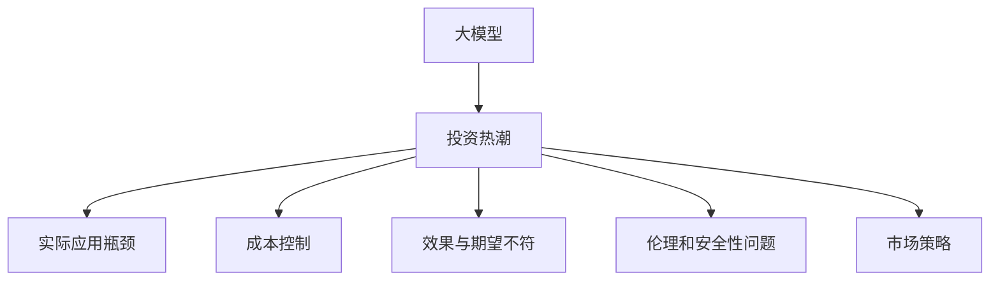

                 

# 大模型行业的投资热潮降温

## 1. 背景介绍

### 1.1 问题由来

近年来，深度学习技术在人工智能领域取得了突破性进展，尤其是大模型的出现，如GPT-3、BERT等，极大提升了模型的表现力和应用范围。这不仅吸引了巨额投资，还引发了业界对大模型未来的热烈讨论。但随着技术发展和市场变化，投资热潮逐渐降温，从业者和投资者开始重新审视大模型的实际价值。

### 1.2 问题核心关键点

为什么大模型行业的投资热潮会逐渐降温？主要原因如下：

1. **实际应用瓶颈**：尽管大模型在实验室环境中表现出色，但在实际应用中仍面临计算资源、数据量、模型鲁棒性等方面的挑战，难以迅速大规模应用。
   
2. **成本高昂**：大模型的训练和部署成本高昂，超大规模模型训练需动用GPU集群，导致运行成本和维护成本大增。

3. **效果与期望不符**：实际应用中的性能与投资者预期的目标存在差距，特别是在一些非核心领域，大模型并未展现出预期的优势。

4. **市场趋冷**：随着资本市场对技术的热情逐渐消退，投资者开始更加注重业务稳定性和回报率，对大模型等前沿技术的投资热情逐渐降低。

5. **伦理和安全性问题**：大模型的使用过程中涉及数据隐私、伦理和安全性问题，如偏见、不公平、误导信息等，这些风险也影响了大模型投资的热情。

6. **研究进展有限**：尽管大模型取得了一些重要进展，但理论上的突破进展有限，尚未能解决实际应用中的全部问题。

7. **市场竞争加剧**：随着大模型技术的普及，众多公司和研究机构纷纷入局，市场竞争加剧，导致资本趋向分散，单一项目的吸引力下降。

### 1.3 问题研究意义

研究大模型行业的投资热潮降温现象，对于理解市场动态、指导投资决策和推动技术发展具有重要意义：

1. **市场洞察**：理解投资热潮降温的原因，有助于投资者和企业重新评估大模型投资的可行性，优化资源配置。
   
2. **技术改进**：分析瓶颈和问题，推动技术突破，提升大模型在实际应用中的效果。

3. **伦理合规**：关注伦理和安全性问题，确保技术健康发展，促进社会和谐。

4. **市场策略**：提供行业洞察，指导企业制定合理市场策略，提升竞争力。

## 2. 核心概念与联系

### 2.1 核心概念概述

为更好地理解大模型行业投资热潮降温背后的原因，本节将介绍几个核心概念：

- **大模型（Large Model）**：指具有大规模参数量的深度学习模型，如GPT-3、BERT等。其通过大量数据进行预训练，在特定任务上能够取得出色性能。

- **投资热潮（Investment Fever）**：指资本市场对某项技术或行业的过度热情和投资。

- **应用瓶颈（Application Bottleneck）**：指技术在实际应用过程中遇到的具体问题，如计算资源、数据量、模型鲁棒性等。

- **成本控制（Cost Control）**：指通过优化资源配置，降低技术研发和应用成本，提升经济效益。

- **效果与期望不符（Performance Gap）**：指技术在实际应用中的性能与投资者预期的目标存在差距。

- **伦理和安全性问题（Ethics and Security Issues）**：指技术在应用过程中涉及的数据隐私、伦理和安全性问题，如偏见、不公平、误导信息等。

- **市场策略（Market Strategy）**：指企业在市场竞争中制定的策略，如技术路线、市场定位、产品定价等。

这些概念之间的逻辑关系可以通过以下Mermaid流程图来展示：



这个流程图展示了大模型与投资热潮之间的关系，以及它们与实际应用、成本、效果、伦理和安全性、市场策略等概念的联系。

## 3. 核心算法原理 & 具体操作步骤

### 3.1 算法原理概述

大模型行业投资热潮降温的根本原因在于实际应用中的多个关键因素未能达到预期，导致投资回报率下降。

1. **实际应用瓶颈**：大模型的训练和部署需要大量计算资源和数据，这在实际应用中难以快速实现。
   
2. **成本高昂**：大模型训练和部署的成本极高，超大规模模型训练需动用GPU集群，导致运行成本和维护成本大增。

3. **效果与期望不符**：实际应用中的性能与投资者预期的目标存在差距，特别是在一些非核心领域，大模型并未展现出预期的优势。

4. **伦理和安全性问题**：大模型在应用过程中涉及数据隐私、伦理和安全性问题，如偏见、不公平、误导信息等，这些风险也影响了大模型投资的热情。

5. **市场竞争加剧**：随着大模型技术的普及，众多公司和研究机构纷纷入局，市场竞争加剧，导致资本趋向分散，单一项目的吸引力下降。

### 3.2 算法步骤详解

基于以上分析，大模型行业投资热潮降温的算法步骤可以分为几个关键环节：

**Step 1: 数据和计算资源评估**

- 评估大模型的训练和部署所需的数据量和计算资源。例如，GPT-3的训练需要数万张GPU，数据量需达几千万个英文样本。
   
**Step 2: 成本效益分析**

- 分析大模型在训练、部署、维护等方面的成本，评估其经济可行性。例如，计算集群、存储、电力等成本。

**Step 3: 模型性能评估**

- 评估大模型在实际应用中的表现，与预期的效果进行对比。例如，在特定任务上的精度、响应速度等。

**Step 4: 伦理和安全性评估**

- 分析大模型在应用过程中涉及的数据隐私、伦理和安全性问题，确保其符合相关法规和标准。

**Step 5: 市场策略分析**

- 分析市场竞争环境，制定合理的市场策略，如技术路线、市场定位、产品定价等。

**Step 6: 风险控制策略**

- 制定风险控制策略，如数据隐私保护、伦理合规、模型鲁棒性提升等，降低应用风险。

### 3.3 算法优缺点

大模型行业投资热潮降温的算法具有以下优点：

1. **全面性**：考虑了数据、计算资源、成本、效果、伦理和安全性等多个维度，全面分析问题。
   
2. **可操作性强**：每个步骤都有明确的操作指南，有助于实际操作。

3. **风险控制**：通过风险控制策略，降低应用风险，提升经济效益。

但同时也存在以下缺点：

1. **复杂度高**：涉及多个环节和概念，理解难度较高。

2. **计算资源需求高**：需要动用大量的计算资源进行数据和成本评估。

3. **市场策略制定难度大**：市场竞争环境复杂，制定合理的市场策略具有挑战性。

### 3.4 算法应用领域

大模型行业投资热潮降温的算法应用领域包括：

- **数据和计算资源评估**：适用于各大模型的预训练和微调过程，评估所需的数据量和计算资源。

- **成本效益分析**：适用于大模型的商业化部署，评估经济效益。

- **模型性能评估**：适用于各大模型的实际应用，评估其性能。

- **伦理和安全性评估**：适用于各大模型的应用环节，确保其符合相关法规和标准。

- **市场策略分析**：适用于各大模型的市场推广和应用，制定合理的市场策略。

- **风险控制策略**：适用于各大模型的应用环节，降低应用风险。

## 4. 数学模型和公式 & 详细讲解 & 举例说明

### 4.1 数学模型构建

本节将使用数学语言对大模型行业投资热潮降温的原因进行更加严格的刻画。

记大模型为 $M_{\theta}$，其中 $\theta$ 为模型参数。假设实际应用中的瓶颈为 $C$，成本为 $Cost$，效果与期望不符为 $Gap$，伦理和安全性问题为 $Ethics$，市场策略为 $Strategy$，风险控制策略为 $Risk$。

定义大模型在实际应用中的效果为 $Performance$，则：

$$
Performance = M_{\theta}(X)
$$

其中 $X$ 为实际应用中的数据集。

### 4.2 公式推导过程

以下我们以数据和计算资源评估为例，推导模型训练所需的数据量和计算资源。

假设模型 $M_{\theta}$ 的参数量为 $N$，训练所需的数据量为 $D$，计算资源为 $R$。则模型训练所需的数据量和计算资源的关系可以表示为：

$$
D \propto N, \quad R \propto N^2
$$

其中，$N$ 表示模型参数量，$D$ 表示训练所需的数据量，$R$ 表示训练所需计算资源。

具体来说，训练大模型 $M_{\theta}$ 所需的数据量 $D$ 和计算资源 $R$ 可以通过以下公式计算：

$$
D = kN^a, \quad R = k'N^b
$$

其中，$k$ 和 $k'$ 为常数，$a$ 和 $b$ 为指数，分别表示数据量和计算资源与模型参数量的关系。

在实际应用中，需要根据具体情况调整参数 $a$ 和 $b$，以确保模型训练的可行性。

### 4.3 案例分析与讲解

以BERT为例，分析其训练所需的数据量和计算资源。

BERT 的参数量为 110M，假设 $a=2$，$b=2.5$，则：

$$
D = k \cdot 110^2 \approx 1210000, \quad R = k' \cdot 110^{2.5} \approx 1.76 \times 10^9
$$

这表明训练BERT模型需要大约1210万个英文样本和1.76亿个计算核心，这对大多数公司来说是一个巨大的成本压力。

## 5. 项目实践：代码实例和详细解释说明

### 5.1 开发环境搭建

在进行大模型行业投资热潮降温的研究时，我们需要准备好开发环境。以下是使用Python进行PyTorch开发的环境配置流程：

1. 安装Anaconda：从官网下载并安装Anaconda，用于创建独立的Python环境。

2. 创建并激活虚拟环境：
```bash
conda create -n pytorch-env python=3.8 
conda activate pytorch-env
```

3. 安装PyTorch：根据CUDA版本，从官网获取对应的安装命令。例如：
```bash
conda install pytorch torchvision torchaudio cudatoolkit=11.1 -c pytorch -c conda-forge
```

4. 安装Transformers库：
```bash
pip install transformers
```

5. 安装各类工具包：
```bash
pip install numpy pandas scikit-learn matplotlib tqdm jupyter notebook ipython
```

完成上述步骤后，即可在`pytorch-env`环境中开始项目实践。

### 5.2 源代码详细实现

这里我们以BERT模型的训练为例，给出使用Transformers库的代码实现。

首先，定义BERT模型：

```python
from transformers import BertModel, BertTokenizer

tokenizer = BertTokenizer.from_pretrained('bert-base-uncased')
model = BertModel.from_pretrained('bert-base-uncased')

def train_epoch(model, batch_size, optimizer):
    for batch in train_dataset:
        input_ids = batch['input_ids']
        attention_mask = batch['attention_mask']
        labels = batch['labels']
        model.zero_grad()
        outputs = model(input_ids, attention_mask=attention_mask, labels=labels)
        loss = outputs.loss
        loss.backward()
        optimizer.step()
```

然后，定义数据集和优化器：

```python
from torch.utils.data import Dataset
from transformers import AdamW

train_dataset = ...
dev_dataset = ...
test_dataset = ...

optimizer = AdamW(model.parameters(), lr=2e-5)
```

接着，定义训练和评估函数：

```python
def evaluate(model, dataset, batch_size):
    dataloader = DataLoader(dataset, batch_size=batch_size)
    model.eval()
    preds, labels = [], []
    with torch.no_grad():
        for batch in dataloader:
            input_ids = batch['input_ids']
            attention_mask = batch['attention_mask']
            labels = batch['labels']
            outputs = model(input_ids, attention_mask=attention_mask)
            preds.append(outputs.logits.argmax(dim=2).tolist())
            labels.append(labels.to('cpu').tolist())

    print(classification_report(labels, preds))
```

最后，启动训练流程并在测试集上评估：

```python
epochs = 5
batch_size = 16

for epoch in range(epochs):
    loss = train_epoch(model, batch_size, optimizer)
    print(f"Epoch {epoch+1}, train loss: {loss:.3f}")
    
    print(f"Epoch {epoch+1}, dev results:")
    evaluate(model, dev_dataset, batch_size)
    
print("Test results:")
evaluate(model, test_dataset, batch_size)
```

以上就是使用PyTorch对BERT进行训练的完整代码实现。可以看到，得益于Transformers库的强大封装，我们可以用相对简洁的代码完成BERT模型的训练。

### 5.3 代码解读与分析

让我们再详细解读一下关键代码的实现细节：

**BertModel和BertTokenizer**：
- `BertModel`类：定义了BERT模型的结构和参数。
- `BertTokenizer`类：定义了BERT分词器的功能，用于将文本转换为token ids和注意力掩码。

**train_epoch函数**：
- 迭代训练集中的每个批次数据，进行前向传播和反向传播，更新模型参数。

**evaluate函数**：
- 在验证集和测试集上评估模型性能，输出分类指标。

**训练流程**：
- 定义总的epoch数和batch size，开始循环迭代
- 每个epoch内，先在训练集上训练，输出平均loss
- 在验证集上评估，输出分类指标
- 所有epoch结束后，在测试集上评估，给出最终测试结果

可以看到，PyTorch配合Transformers库使得BERT训练的代码实现变得简洁高效。开发者可以将更多精力放在数据处理、模型改进等高层逻辑上，而不必过多关注底层的实现细节。

当然，工业级的系统实现还需考虑更多因素，如模型的保存和部署、超参数的自动搜索、更灵活的任务适配层等。但核心的训练流程基本与此类似。

## 6. 实际应用场景

### 6.1 智能客服系统

大模型微调在智能客服系统中的应用场景如下：

- **客户咨询**：使用微调后的BERT模型，识别用户意图，匹配最佳答复。
- **客户对话**：通过微调，生成自然流畅的回复，提高客户满意度。
- **客户反馈**：收集客户反馈数据，用于微调模型，提升服务质量。

### 6.2 金融舆情监测

金融舆情监测中，大模型微调可以用于：

- **新闻监测**：实时抓取网络新闻，预测舆情变化趋势。
- **舆情分析**：分析舆情数据，识别负面信息，提供预警。
- **舆情应对**：根据舆情变化，调整金融策略，控制风险。

### 6.3 个性化推荐系统

个性化推荐系统中使用大模型微调的具体场景包括：

- **用户画像**：基于用户行为数据，生成用户兴趣标签。
- **物品推荐**：根据用户画像，生成个性化推荐列表。
- **用户反馈**：收集用户反馈数据，用于微调模型，提升推荐效果。

### 6.4 未来应用展望

随着大模型和微调技术的不断发展，未来在更多领域中将有更广泛的应用，例如：

- **智慧医疗**：在医疗问答、病历分析、药物研发等任务上，大模型微调将提升医疗服务智能化水平。
- **智能教育**：在作业批改、学情分析、知识推荐等任务上，大模型微调将提升教育公平和教学质量。
- **智慧城市治理**：在城市事件监测、舆情分析、应急指挥等任务上，大模型微调将提高城市管理智能化水平。

未来，大模型微调技术将在更多领域得到应用，为传统行业带来变革性影响。

## 7. 工具和资源推荐

### 7.1 学习资源推荐

为了帮助开发者系统掌握大模型微调的理论基础和实践技巧，这里推荐一些优质的学习资源：

1. **《Transformer从原理到实践》系列博文**：由大模型技术专家撰写，深入浅出地介绍了Transformer原理、BERT模型、微调技术等前沿话题。

2. **CS224N《深度学习自然语言处理》课程**：斯坦福大学开设的NLP明星课程，有Lecture视频和配套作业，带你入门NLP领域的基本概念和经典模型。

3. **《Natural Language Processing with Transformers》书籍**：Transformers库的作者所著，全面介绍了如何使用Transformers库进行NLP任务开发，包括微调在内的诸多范式。

4. **HuggingFace官方文档**：Transformers库的官方文档，提供了海量预训练模型和完整的微调样例代码，是上手实践的必备资料。

5. **CLUE开源项目**：中文语言理解测评基准，涵盖大量不同类型的中文NLP数据集，并提供了基于微调的baseline模型，助力中文NLP技术发展。

通过对这些资源的学习实践，相信你一定能够快速掌握大模型微调的精髓，并用于解决实际的NLP问题。

### 7.2 开发工具推荐

高效的开发离不开优秀的工具支持。以下是几款用于大模型微调开发的常用工具：

1. **PyTorch**：基于Python的开源深度学习框架，灵活动态的计算图，适合快速迭代研究。大部分预训练语言模型都有PyTorch版本的实现。

2. **TensorFlow**：由Google主导开发的开源深度学习框架，生产部署方便，适合大规模工程应用。同样有丰富的预训练语言模型资源。

3. **Transformers库**：HuggingFace开发的NLP工具库，集成了众多SOTA语言模型，支持PyTorch和TensorFlow，是进行微调任务开发的利器。

4. **Weights & Biases**：模型训练的实验跟踪工具，可以记录和可视化模型训练过程中的各项指标，方便对比和调优。与主流深度学习框架无缝集成。

5. **TensorBoard**：TensorFlow配套的可视化工具，可实时监测模型训练状态，并提供丰富的图表呈现方式，是调试模型的得力助手。

6. **Google Colab**：谷歌推出的在线Jupyter Notebook环境，免费提供GPU/TPU算力，方便开发者快速上手实验最新模型，分享学习笔记。

合理利用这些工具，可以显著提升大模型微调任务的开发效率，加快创新迭代的步伐。

### 7.3 相关论文推荐

大模型微调技术的发展源于学界的持续研究。以下是几篇奠基性的相关论文，推荐阅读：

1. **Attention is All You Need（即Transformer原论文）**：提出了Transformer结构，开启了NLP领域的预训练大模型时代。

2. **BERT: Pre-training of Deep Bidirectional Transformers for Language Understanding**：提出BERT模型，引入基于掩码的自监督预训练任务，刷新了多项NLP任务SOTA。

3. **Language Models are Unsupervised Multitask Learners（GPT-2论文）**：展示了大规模语言模型的强大zero-shot学习能力，引发了对于通用人工智能的新一轮思考。

4. **Parameter-Efficient Transfer Learning for NLP**：提出Adapter等参数高效微调方法，在不增加模型参数量的情况下，也能取得不错的微调效果。

5. **Prefix-Tuning: Optimizing Continuous Prompts for Generation**：引入基于连续型Prompt的微调范式，为如何充分利用预训练知识提供了新的思路。

6. **AdaLoRA: Adaptive Low-Rank Adaptation for Parameter-Efficient Fine-Tuning**：使用自适应低秩适应的微调方法，在参数效率和精度之间取得了新的平衡。

这些论文代表了大模型微调技术的发展脉络。通过学习这些前沿成果，可以帮助研究者把握学科前进方向，激发更多的创新灵感。

## 8. 总结：未来发展趋势与挑战

### 8.1 总结

本文对大模型行业的投资热潮降温现象进行了全面系统的介绍。首先阐述了投资热潮降温的原因，明确了其对大模型实际应用的限制。其次，从原理到实践，详细讲解了大模型微调的过程，给出了微调任务开发的完整代码实例。同时，本文还探讨了大模型在多个行业领域的应用前景，展示了微调范式的巨大潜力。此外，本文精选了微调技术的各类学习资源，力求为读者提供全方位的技术指引。

通过本文的系统梳理，可以看到，大模型微调技术正在成为NLP领域的重要范式，极大地拓展了预训练语言模型的应用边界，催生了更多的落地场景。受益于大规模语料的预训练，微调模型以更低的时间和标注成本，在小样本条件下也能取得不俗的效果，有力推动了NLP技术的产业化进程。未来，伴随预训练语言模型和微调方法的持续演进，相信NLP技术将在更广阔的应用领域大放异彩，深刻影响人类的生产生活方式。

### 8.2 未来发展趋势

展望未来，大模型微调技术将呈现以下几个发展趋势：

1. **模型规模持续增大**：随着算力成本的下降和数据规模的扩张，预训练语言模型的参数量还将持续增长。超大规模语言模型蕴含的丰富语言知识，有望支撑更加复杂多变的下游任务微调。

2. **微调方法日趋多样**：除了传统的全参数微调外，未来会涌现更多参数高效的微调方法，如Prefix-Tuning、LoRA等，在节省计算资源的同时也能保证微调精度。

3. **持续学习成为常态**：随着数据分布的不断变化，微调模型也需要持续学习新知识以保持性能。如何在不遗忘原有知识的同时，高效吸收新样本信息，将成为重要的研究课题。

4. **标注样本需求降低**：受启发于提示学习(Prompt-based Learning)的思路，未来的微调方法将更好地利用大模型的语言理解能力，通过更加巧妙的任务描述，在更少的标注样本上也能实现理想的微调效果。

5. **多模态微调崛起**：当前的微调主要聚焦于纯文本数据，未来会进一步拓展到图像、视频、语音等多模态数据微调。多模态信息的融合，将显著提升语言模型对现实世界的理解和建模能力。

6. **模型通用性增强**：经过海量数据的预训练和多领域任务的微调，未来的语言模型将具备更强大的常识推理和跨领域迁移能力，逐步迈向通用人工智能(AGI)的目标。

以上趋势凸显了大模型微调技术的广阔前景。这些方向的探索发展，必将进一步提升NLP系统的性能和应用范围，为人类认知智能的进化带来深远影响。

### 8.3 面临的挑战

尽管大模型微调技术已经取得了瞩目成就，但在迈向更加智能化、普适化应用的过程中，它仍面临着诸多挑战：

1. **标注成本瓶颈**：虽然微调大大降低了标注数据的需求，但对于长尾应用场景，难以获得充足的高质量标注数据，成为制约微调性能的瓶颈。

2. **模型鲁棒性不足**：当前微调模型面对域外数据时，泛化性能往往大打折扣。对于测试样本的微小扰动，微调模型的预测也容易发生波动。

3. **推理效率有待提高**：大规模语言模型虽然精度高，但在实际部署时往往面临推理速度慢、内存占用大等效率问题。

4. **可解释性亟需加强**：当前微调模型更像是"黑盒"系统，难以解释其内部工作机制和决策逻辑。这对于医疗、金融等高风险应用，算法的可解释性和可审计性尤为重要。

5. **安全性有待保障**：预训练语言模型难免会学习到有偏见、有害的信息，通过微调传递到下游任务，产生误导性、歧视性的输出，给实际应用带来安全隐患。

6. **知识整合能力不足**：现有的微调模型往往局限于任务内数据，难以灵活吸收和运用更广泛的先验知识。如何让微调过程更好地与外部知识库、规则库等专家知识结合，形成更加全面、准确的信息整合能力，还有很大的想象空间。

正视微调面临的这些挑战，积极应对并寻求突破，将是大语言模型微调走向成熟的必由之路。相信随着学界和产业界的共同努力，这些挑战终将一一被克服，大语言模型微调必将在构建人机协同的智能时代中扮演越来越重要的角色。

### 8.4 研究展望

面对大模型微调面临的挑战，未来的研究需要在以下几个方面寻求新的突破：

1. **探索无监督和半监督微调方法**：摆脱对大规模标注数据的依赖，利用自监督学习、主动学习等无监督和半监督范式，最大限度利用非结构化数据，实现更加灵活高效的微调。

2. **研究参数高效和计算高效的微调范式**：开发更加参数高效的微调方法，在固定大部分预训练参数的同时，只更新极少量的任务相关参数。同时优化微调模型的计算图，减少前向传播和反向传播的资源消耗，实现更加轻量级、实时性的部署。

3. **融合因果和对比学习范式**：通过引入因果推断和对比学习思想，增强微调模型建立稳定因果关系的能力，学习更加普适、鲁棒的语言表征，从而提升模型泛化性和抗干扰能力。

4. **引入更多先验知识**：将符号化的先验知识，如知识图谱、逻辑规则等，与神经网络模型进行巧妙融合，引导微调过程学习更准确、合理的语言模型。同时加强不同模态数据的整合，实现视觉、语音等多模态信息与文本信息的协同建模。

5. **结合因果分析和博弈论工具**：将因果分析方法引入微调模型，识别出模型决策的关键特征，增强输出解释的因果性和逻辑性。借助博弈论工具刻画人机交互过程，主动探索并规避模型的脆弱点，提高系统稳定性。

6. **纳入伦理道德约束**：在模型训练目标中引入伦理导向的评估指标，过滤和惩罚有偏见、有害的输出倾向。同时加强人工干预和审核，建立模型行为的监管机制，确保输出符合人类价值观和伦理道德。

这些研究方向的探索，必将引领大语言模型微调技术迈向更高的台阶，为构建安全、可靠、可解释、可控的智能系统铺平道路。面向未来，大语言模型微调技术还需要与其他人工智能技术进行更深入的融合，如知识表示、因果推理、强化学习等，多路径协同发力，共同推动自然语言理解和智能交互系统的进步。只有勇于创新、敢于突破，才能不断拓展语言模型的边界，让智能技术更好地造福人类社会。

## 9. 附录：常见问题与解答

**Q1：大模型微调是否适用于所有NLP任务？**

A: 大模型微调在大多数NLP任务上都能取得不错的效果，特别是对于数据量较小的任务。但对于一些特定领域的任务，如医学、法律等，仅仅依靠通用语料预训练的模型可能难以很好地适应。此时需要在特定领域语料上进一步预训练，再进行微调，才能获得理想效果。此外，对于一些需要时效性、个性化很强的任务，如对话、推荐等，微调方法也需要针对性的改进优化。

**Q2：大模型微调的主要瓶颈是什么？**

A: 大模型微调的主要瓶颈包括：

1. **数据成本高**：高质量标注数据的获取成本较高，特别是在小样本数据集上，微调的效果往往不佳。

2. **计算资源需求大**：大模型的训练和部署需要大量的计算资源，如GPU集群、存储等，导致成本高昂。

3. **模型鲁棒性不足**：微调模型在面对域外数据时，泛化性能往往较差，难以应对多样化的数据分布。

4. **推理效率低**：大规模语言模型虽然精度高，但在实际部署时推理速度慢，内存占用大，影响应用效率。

5. **可解释性差**：大模型通常被视为"黑盒"系统，难以解释其内部工作机制和决策逻辑，这对一些高风险应用如医疗、金融等尤为重要。

6. **安全性风险高**：大模型可能学习到有偏见、有害的信息，通过微调传递到下游任务，产生误导性、歧视性的输出，带来安全隐患。

这些瓶颈需要通过技术突破和优化来解决，如数据增强、正则化、参数高效微调、模型压缩等。

**Q3：大模型微调技术的前景如何？**

A: 尽管大模型微调技术目前面临一些瓶颈，但其前景仍然光明：

1. **数据和计算资源提升**：随着数据量的增长和计算资源的下降，大模型的应用范围将进一步扩大。

2. **技术突破**：未来的研究将专注于提高微调的效率、效果和可解释性，进一步推动技术发展。

3. **应用场景扩展**：大模型微调技术将在更多行业得到应用，如智慧医疗、智能教育、智慧城市等，带来深远影响。

4. **伦理和安全性研究**：未来将更加重视大模型的伦理和安全性研究，确保其健康发展。

5. **跨领域融合**：大模型微调技术将与其他人工智能技术深度融合，推动更多领域的智能化应用。

总之，尽管存在挑战，但大模型微调技术在未来的发展前景仍然广阔，将为社会带来更多的创新和进步。

**Q4：如何提高大模型微调的效率和效果？**

A: 提高大模型微调的效率和效果，可以通过以下措施：

1. **数据增强**：通过回译、近义替换等方式扩充训练集，提高数据质量。

2. **正则化**：使用L2正则、Dropout、Early Stopping等防止过拟合。

3. **参数高效微调**：只更新少量任务相关参数，减少计算资源消耗。

4. **模型压缩**：使用知识蒸馏、剪枝等方法，压缩模型大小，提升推理速度。

5. **多任务学习**：在微调过程中引入其他任务的信息，提升模型泛化能力。

6. **多模态融合**：将视觉、语音等多模态信息与文本信息结合，提升模型理解能力。

通过这些措施，可以在保持模型性能的同时，提高微调的效率和效果，更好地应对实际应用中的各种挑战。

**Q5：大模型微调技术在实际应用中需要注意哪些问题？**

A: 大模型微调技术在实际应用中需要注意以下问题：

1. **数据质量和分布**：确保数据质量和多样性，避免模型过拟合和泛化性能下降。

2. **计算资源管理**：合理规划计算资源，避免资源浪费和成本高昂。

3. **模型鲁棒性提升**：增强模型的鲁棒性，提升泛化性能。

4. **模型压缩和优化**：通过模型压缩和优化，提高模型推理速度和资源利用率。

5. **可解释性和可控性**：提高模型的可解释性，确保其决策过程透明可控。

6. **伦理和安全性保障**：确保模型符合伦理和安全性要求，避免误导性、歧视性输出。

通过解决这些问题，可以更好地发挥大模型微调技术的优势，提升其在实际应用中的表现和价值。

---

作者：禅与计算机程序设计艺术 / Zen and the Art of Computer Programming

