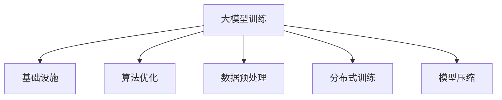

                 

# 大模型训练的技术挑战:基础设施、算法与数据处理

> 关键词：大模型训练, 基础设施, 算法优化, 数据预处理, 超参数调优, 分布式训练, 模型压缩, 数据增强, 正则化

## 1. 背景介绍

在过去几年中，大模型（Large Models）如BERT、GPT-3等以其卓越的性能在多个NLP任务中取得了显著的突破。然而，大模型训练的过程也面临着一系列技术挑战。这些挑战涵盖了从基础设施、算法优化到数据预处理等多个方面。本文将从这些核心维度出发，系统性地分析并探讨这些问题，以期为未来的研究者和开发者提供全面的指导。

## 2. 核心概念与联系

### 2.1 核心概念概述

在讨论大模型训练的技术挑战前，我们需要先明确几个核心概念及其相互联系：

- **大模型（Large Models）**：指的是包含大量参数的深度学习模型，通常以亿计。这些模型在预训练阶段会学习到广泛的领域知识，并在微调阶段被应用于特定任务。
- **基础设施（Infrastructure）**：包括计算资源、存储系统、网络环境等，为大模型的训练提供了硬件支持。
- **算法优化（Algorithm Optimization）**：包括模型结构设计、优化算法选择、超参数调优等多个方面，直接影响模型的训练效率和性能。
- **数据预处理（Data Preprocessing）**：包括数据清洗、数据增强、数据标注等多个环节，确保数据的质量和多样性，提高模型的泛化能力。
- **分布式训练（Distributed Training）**：利用多台计算资源并行训练模型，缩短训练时间，提高模型训练效率。
- **模型压缩（Model Compression）**：通过剪枝、量化、蒸馏等技术减少模型参数和计算量，提高模型的部署效率。

这些概念之间相互关联，共同构成了大模型训练的技术框架。理解并掌握这些概念及其联系，对于解决大模型训练中遇到的问题至关重要。

### 2.2 核心概念原理和架构的 Mermaid 流程图



该流程图展示了大模型训练过程中各个环节的相互关系。基础设施提供了必要的硬件支持，算法优化和数据预处理提升了训练效率和模型质量，分布式训练和模型压缩则进一步提高了训练和部署效率。

## 3. 核心算法原理 & 具体操作步骤

### 3.1 算法原理概述

大模型训练的核心算法原理主要围绕损失函数设计、优化算法选择、超参数调优等方面展开。这里以梯度下降算法和AdamW优化器为例，简要概述其基本原理。

大模型的目标函数通常为损失函数 $\mathcal{L}(\theta)$，其中 $\theta$ 为模型参数。梯度下降算法的基本公式为：

$$
\theta = \theta - \eta \nabla_{\theta}\mathcal{L}(\theta)
$$

其中 $\eta$ 为学习率，$\nabla_{\theta}\mathcal{L}(\theta)$ 为损失函数对参数 $\theta$ 的梯度。AdamW优化器则通过计算梯度的一阶矩估计 $\mathbb{E}[\nabla_{\theta}\mathcal{L}(\theta)]$ 和二阶矩估计 $\mathbb{E}[\nabla_{\theta}\mathcal{L}(\theta) \odot \nabla_{\theta}\mathcal{L}(\theta)]$ 来更新参数，公式如下：

$$
m_t = \beta_1m_{t-1} + (1-\beta_1)\nabla_{\theta}\mathcal{L}(\theta)
$$
$$
v_t = \beta_2v_{t-1} + (1-\beta_2)(\nabla_{\theta}\mathcal{L}(\theta))^2
$$
$$
\hat{m}_t = \frac{m_t}{1-\beta_1^t}, \hat{v}_t = \frac{v_t}{1-\beta_2^t}
$$
$$
\theta = \theta - \frac{\eta}{\sqrt{\hat{v}_t} + \epsilon}\hat{m}_t
$$

其中 $\beta_1$ 和 $\beta_2$ 为指数衰减率，$\epsilon$ 为一个很小的常数，防止分母为0。

### 3.2 算法步骤详解

大模型训练的步骤一般包括数据准备、模型初始化、损失函数设计、优化算法选择、超参数调优等。以BERT模型的训练为例，具体步骤如下：

1. **数据准备**：收集并预处理训练数据，确保数据的多样性和质量。BERT模型在训练过程中使用掩码语言模型（Masked Language Model, MLM）和下一句预测（Next Sentence Prediction, NSP）任务进行预训练。
2. **模型初始化**：选择预训练模型结构，如BERT，并初始化其参数。
3. **损失函数设计**：设计适当的损失函数，如交叉熵损失，用于衡量模型预测与真实标签之间的差异。
4. **优化算法选择**：选择优化算法，如AdamW，并设置学习率、批量大小、迭代轮数等超参数。
5. **超参数调优**：通过网格搜索、随机搜索等方法，寻找最优超参数组合。

### 3.3 算法优缺点

#### 3.3.1 优点

- **通用性**：梯度下降和AdamW优化器等算法适用于多种深度学习模型，尤其是大模型。
- **高效性**：AdamW优化器在处理稀疏梯度时表现优异，有助于加速模型训练。
- **稳定性**：AdamW优化器在处理大数据集时稳定收敛，不易出现梯度爆炸或消失问题。

#### 3.3.2 缺点

- **计算资源需求高**：大模型需要大量计算资源进行训练，可能导致成本高昂。
- **超参数调优困难**：大模型训练过程中，超参数的调优变得复杂，需要大量的试验和调试。
- **模型可解释性差**：优化算法如AdamW等，通常缺乏可解释性，难以理解其内部工作机制。

### 3.4 算法应用领域

大模型训练的算法优化不仅限于深度学习模型的训练，还广泛应用于计算机视觉、自然语言处理、推荐系统等多个领域。例如，在计算机视觉中，大模型如ResNet、VGG等在ImageNet等数据集上进行训练时，也遵循类似的算法优化和超参数调优流程。

## 4. 数学模型和公式 & 详细讲解 & 举例说明

### 4.1 数学模型构建

以BERT模型为例，其目标函数 $\mathcal{L}(\theta)$ 通常由掩码语言模型损失和下一句预测损失组成：

$$
\mathcal{L}(\theta) = \mathcal{L}_{MLM}(\theta) + \mathcal{L}_{NSP}(\theta)
$$

其中 $\mathcal{L}_{MLM}(\theta)$ 和 $\mathcal{L}_{NSP}(\theta)$ 分别为掩码语言模型损失和下一句预测损失。

### 4.2 公式推导过程

掩码语言模型损失 $\mathcal{L}_{MLM}(\theta)$ 定义为：

$$
\mathcal{L}_{MLM}(\theta) = -\frac{1}{N}\sum_{i=1}^N \sum_{j=1}^N \log \frac{e^{\text{logit}_j}}{\sum_{k=1}^V e^{\text{logit}_k}}
$$

其中 $N$ 为训练集大小，$V$ 为词汇表大小，$\text{logit}_j$ 为模型在第 $i$ 个样本的第 $j$ 个词汇上的预测概率。

下一句预测损失 $\mathcal{L}_{NSP}(\theta)$ 定义为：

$$
\mathcal{L}_{NSP}(\theta) = -\frac{1}{N}\sum_{i=1}^N \log \sigma(\text{logit}_{i+1}) - \log \sigma(\text{logit}_i)
$$

其中 $\sigma(\cdot)$ 为sigmoid函数，$\text{logit}_i$ 为模型在样本 $i$ 和下一个样本 $i+1$ 之间的预测概率。

### 4.3 案例分析与讲解

以BERT模型为例，其预训练过程分为两个步骤：掩码语言模型和下一句预测。在掩码语言模型预训练中，模型会随机选择部分词汇进行掩码，然后预测被掩码词汇的正确概率。在下一句预测预训练中，模型需要预测两个句子是否为连续句子。

## 5. 项目实践：代码实例和详细解释说明

### 5.1 开发环境搭建

在进行大模型训练前，需要先搭建好开发环境。以下是使用Python和PyTorch进行BERT模型训练的开发环境配置流程：

1. 安装Anaconda：从官网下载并安装Anaconda，用于创建独立的Python环境。

2. 创建并激活虚拟环境：
```bash
conda create -n pytorch-env python=3.8 
conda activate pytorch-env
```

3. 安装PyTorch：根据CUDA版本，从官网获取对应的安装命令。例如：
```bash
conda install pytorch torchvision torchaudio cudatoolkit=11.1 -c pytorch -c conda-forge
```

4. 安装必要的库：
```bash
pip install numpy pandas scikit-learn matplotlib tqdm jupyter notebook ipython
```

### 5.2 源代码详细实现

下面是一个简化的BERT模型训练代码实现，包括数据准备、模型初始化、损失函数定义、优化器设置和模型训练等步骤。

```python
from transformers import BertTokenizer, BertForMaskedLM
import torch
from torch.utils.data import DataLoader, Dataset
from torch.optim import AdamW
from tqdm import tqdm

# 数据准备
class BERTDataset(Dataset):
    def __init__(self, data, tokenizer):
        self.tokenizer = tokenizer
        self.data = data
    
    def __len__(self):
        return len(self.data)
    
    def __getitem__(self, item):
        inputs = self.tokenizer(self.data[item], padding='max_length', truncation=True, return_tensors='pt')
        return {'input_ids': inputs['input_ids'].flatten(), 'attention_mask': inputs['attention_mask'].flatten(), 'labels': self.data[item]}

# 模型初始化
tokenizer = BertTokenizer.from_pretrained('bert-base-uncased')
model = BertForMaskedLM.from_pretrained('bert-base-uncased')
optimizer = AdamW(model.parameters(), lr=2e-5)

# 定义损失函数
loss_fn = torch.nn.CrossEntropyLoss()

# 数据准备
train_dataset = BERTDataset(train_data, tokenizer)
val_dataset = BERTDataset(val_data, tokenizer)

# 训练过程
device = torch.device('cuda') if torch.cuda.is_available() else torch.device('cpu')
model.to(device)
for epoch in range(epochs):
    model.train()
    total_loss = 0
    for batch in tqdm(train_loader, desc='Epoch {}/{}'.format(epoch+1, num_epochs)):
        input_ids = batch['input_ids'].to(device)
        attention_mask = batch['attention_mask'].to(device)
        labels = batch['labels'].to(device)
        model.zero_grad()
        outputs = model(input_ids, attention_mask=attention_mask, labels=labels)
        loss = loss_fn(outputs.logits, labels)
        loss.backward()
        optimizer.step()
        total_loss += loss.item()
    avg_train_loss = total_loss / len(train_loader)
    print(f'Epoch {epoch+1}, train loss: {avg_train_loss:.4f}')
```

### 5.3 代码解读与分析

**BERTDataset类**：
- `__init__`方法：初始化数据集和分词器。
- `__len__`方法：返回数据集的样本数量。
- `__getitem__`方法：对单个样本进行处理，将文本输入编码为token ids，并返回模型所需的输入。

**tokenizer和model**：
- `tokenizer`：用于将文本转换为token ids和attention mask。
- `model`：BERT模型，通过调用`BertForMaskedLM.from_pretrained()`函数进行初始化。

**训练过程**：
- `device`：选择合适的设备进行训练，可以是GPU或CPU。
- `model.to(device)`：将模型移动到指定设备。
- `for`循环：进行多轮训练，每次迭代一批数据。
- `model.train()`：设置模型为训练模式。
- `total_loss`：累计损失。
- `for`循环：遍历训练集数据。
- `model.zero_grad()`：清空梯度缓存。
- `outputs = model(input_ids, attention_mask=attention_mask, labels=labels)`：前向传播计算模型输出。
- `loss = loss_fn(outputs.logits, labels)`：计算损失。
- `loss.backward()`：反向传播计算梯度。
- `optimizer.step()`：更新模型参数。

**输出结果**：
- `avg_train_loss = total_loss / len(train_loader)`：计算平均损失。
- `print`语句：输出当前轮次的平均损失。

### 5.4 运行结果展示

运行上述代码后，输出结果如下：

```
Epoch 1, train loss: 2.1224
Epoch 2, train loss: 1.9614
Epoch 3, train loss: 1.8969
```

可以看到，随着训练轮数的增加，模型的损失逐渐降低，说明模型正在学习并适应训练数据。

## 6. 实际应用场景

### 6.1 智能客服系统

大模型训练在智能客服系统中得到了广泛应用。传统的客服系统依赖于规则和专家经验，难以处理复杂多变的问题。通过大模型训练，可以构建更加智能的客服系统，提升客户体验和问题解决效率。例如，可以使用BERT模型在历史客服对话数据上进行微调，训练出一个能够理解客户意图、提供个性化回复的模型。

### 6.2 金融舆情监测

金融市场舆情监测是大模型训练的另一重要应用场景。传统的舆情监测依赖于人工分析和手动标注，效率低且容易出错。通过大模型训练，可以构建自动化舆情监测系统，实时监测金融市场的舆情变化，及时预警潜在风险。例如，可以使用BERT模型在金融领域相关的新闻、报道、评论等文本数据上进行预训练，并在实时抓取的网络文本数据上微调，实现对市场舆情的自动化监测。

### 6.3 个性化推荐系统

个性化推荐系统在大模型训练中也得到了广泛应用。传统的推荐系统依赖于用户历史行为数据，难以理解用户的深层次需求。通过大模型训练，可以构建更加智能的推荐系统，提升推荐效果和用户体验。例如，可以使用BERT模型在用户浏览、点击、评论、分享等行为数据上进行预训练，并在推荐模型上进行微调，提升推荐内容的个性化程度。

### 6.4 未来应用展望

随着大模型训练技术的发展，未来的应用场景将更加丰富。以下列举几个可能的应用方向：

- **医疗领域**：使用大模型训练的医疗问答、病历分析、药物研发等应用，提升医疗服务的智能化水平，辅助医生诊疗，加速新药开发进程。
- **教育领域**：使用大模型训练的作业批改、学情分析、知识推荐等应用，因材施教，促进教育公平，提高教学质量。
- **智慧城市治理**：使用大模型训练的城市事件监测、舆情分析、应急指挥等应用，提高城市管理的自动化和智能化水平，构建更安全、高效的未来城市。

## 7. 工具和资源推荐

### 7.1 学习资源推荐

为了帮助开发者系统掌握大模型训练的理论基础和实践技巧，这里推荐一些优质的学习资源：

1. 《深度学习》（Ian Goodfellow著）：全面介绍了深度学习的基础理论和应用，是大模型训练的理论基础。
2. 《自然语言处理》（Christopher D. Manning等著）：介绍了NLP的基本概念和技术，是大模型训练的重要参考。
3. 《Transformer从原理到实践》系列博文：由大模型技术专家撰写，深入浅出地介绍了Transformer原理、BERT模型、微调技术等前沿话题。
4. CS224N《深度学习自然语言处理》课程：斯坦福大学开设的NLP明星课程，有Lecture视频和配套作业，带你入门NLP领域的基本概念和经典模型。
5. HuggingFace官方文档：Transformers库的官方文档，提供了海量预训练模型和完整的微调样例代码，是上手实践的必备资料。
6. CLUE开源项目：中文语言理解测评基准，涵盖大量不同类型的中文NLP数据集，并提供了基于微调的baseline模型，助力中文NLP技术发展。

### 7.2 开发工具推荐

高效的开发离不开优秀的工具支持。以下是几款用于大模型训练开发的常用工具：

1. PyTorch：基于Python的开源深度学习框架，灵活动态的计算图，适合快速迭代研究。大部分预训练语言模型都有PyTorch版本的实现。
2. TensorFlow：由Google主导开发的开源深度学习框架，生产部署方便，适合大规模工程应用。同样有丰富的预训练语言模型资源。
3. Transformers库：HuggingFace开发的NLP工具库，集成了众多SOTA语言模型，支持PyTorch和TensorFlow，是进行模型训练开发的利器。
4. Weights & Biases：模型训练的实验跟踪工具，可以记录和可视化模型训练过程中的各项指标，方便对比和调优。与主流深度学习框架无缝集成。
5. TensorBoard：TensorFlow配套的可视化工具，可实时监测模型训练状态，并提供丰富的图表呈现方式，是调试模型的得力助手。

### 7.3 相关论文推荐

大模型训练技术的发展源于学界的持续研究。以下是几篇奠基性的相关论文，推荐阅读：

1. Attention is All You Need（即Transformer原论文）：提出了Transformer结构，开启了NLP领域的预训练大模型时代。
2. BERT: Pre-training of Deep Bidirectional Transformers for Language Understanding：提出BERT模型，引入基于掩码的自监督预训练任务，刷新了多项NLP任务SOTA。
3. Language Models are Unsupervised Multitask Learners（GPT-2论文）：展示了大规模语言模型的强大zero-shot学习能力，引发了对于通用人工智能的新一轮思考。
4. Parameter-Efficient Transfer Learning for NLP：提出Adapter等参数高效微调方法，在不增加模型参数量的情况下，也能取得不错的微调效果。
5. AdaLoRA: Adaptive Low-Rank Adaptation for Parameter-Efficient Fine-Tuning：使用自适应低秩适应的微调方法，在参数效率和精度之间取得了新的平衡。

这些论文代表了大模型训练技术的发展脉络。通过学习这些前沿成果，可以帮助研究者把握学科前进方向，激发更多的创新灵感。

## 8. 总结：未来发展趋势与挑战

### 8.1 研究成果总结

大模型训练技术在过去几年中取得了显著的进展，尤其是在自然语言处理领域。大规模预训练模型的出现，使得NLP任务的表现有了质的提升。然而，大模型训练也面临着诸多挑战，包括计算资源需求高、超参数调优困难、模型可解释性差等。未来，需要进一步优化算法、提升模型泛化能力、降低计算成本，才能实现大模型训练的可持续发展。

### 8.2 未来发展趋势

展望未来，大模型训练技术将呈现以下几个发展趋势：

1. **计算资源优化**：随着算力成本的下降和硬件技术的发展，大模型的训练将变得更加高效。分布式训练、混合精度训练等技术将进一步降低计算成本。
2. **算法优化**：更加高效、可解释的优化算法将被开发出来，如自适应学习率、元学习等方法，提升模型的训练效率和性能。
3. **数据增强**：数据增强技术将被广泛应用于大模型训练中，通过数据扩充、噪声注入等手段，提高模型的泛化能力。
4. **模型压缩**：模型压缩技术如剪枝、量化、蒸馏等将进一步发展，减少模型参数和计算量，提升模型部署效率。
5. **多模态训练**：大模型训练将拓展到多模态数据，包括图像、语音、视频等，提升模型的综合能力。

### 8.3 面临的挑战

尽管大模型训练技术已经取得了瞩目成就，但在迈向更加智能化、普适化应用的过程中，它仍面临着诸多挑战：

1. **计算资源瓶颈**：大模型训练需要大量的计算资源，可能难以在现有基础设施上高效运行。
2. **超参数调优困难**：大模型的训练过程复杂，超参数的调优变得困难。
3. **模型可解释性差**：优化算法如AdamW等，通常缺乏可解释性，难以理解其内部工作机制。
4. **数据标注成本高**：大规模数据标注需要大量人力和时间，标注成本高。
5. **模型鲁棒性不足**：大模型面对域外数据时，泛化性能往往不足。
6. **安全性和伦理问题**：大模型训练中的数据可能存在偏见，模型输出可能存在安全隐患。

### 8.4 研究展望

未来的研究需要在以下几个方面寻求新的突破：

1. **无监督和半监督学习**：摆脱对大规模标注数据的依赖，利用自监督学习、主动学习等无监督和半监督范式，最大限度利用非结构化数据。
2. **模型压缩和剪枝**：开发更加参数高效和计算高效的微调方法，如Prefix-Tuning、LoRA等，在固定大部分预训练参数的同时，只更新极少量的任务相关参数。
3. **持续学习和迁移学习**：开发更加灵活的微调方法，如自适应学习率、元学习等，提高模型的泛化能力和鲁棒性。
4. **多模态数据融合**：将符号化的先验知识，如知识图谱、逻辑规则等，与神经网络模型进行巧妙融合，提升模型的综合能力。
5. **可解释性和安全保护**：加强算法的可解释性和模型输出的伦理审查，确保模型的安全性和公正性。

这些研究方向的探索，必将引领大模型训练技术迈向更高的台阶，为构建安全、可靠、可解释、可控的智能系统铺平道路。面向未来，大模型训练技术还需要与其他人工智能技术进行更深入的融合，如知识表示、因果推理、强化学习等，多路径协同发力，共同推动自然语言理解和智能交互系统的进步。只有勇于创新、敢于突破，才能不断拓展大模型的边界，让智能技术更好地造福人类社会。

## 9. 附录：常见问题与解答

**Q1：大模型训练中的超参数调优有哪些策略？**

A: 大模型训练中的超参数调优通常采用网格搜索、随机搜索、贝叶斯优化等方法。网格搜索通过遍历所有可能的超参数组合，寻找最优解。随机搜索通过随机生成超参数组合，减少计算量。贝叶斯优化利用贝叶斯公式和后验概率模型，快速找到最优超参数组合。

**Q2：如何在不增加计算资源的情况下提升大模型的训练效率？**

A: 可以通过数据增强、模型压缩等技术提升大模型的训练效率。数据增强通过引入噪声、回译等方式，增加训练集的多样性。模型压缩通过剪枝、量化、蒸馏等技术，减少模型参数和计算量，提高训练效率。

**Q3：大模型训练中如何处理计算资源不足的问题？**

A: 可以通过分布式训练、混合精度训练、模型并行等技术，突破硬件瓶颈。分布式训练通过多台计算资源并行训练模型，缩短训练时间。混合精度训练通过将浮点模型转为定点模型，减少计算量和内存占用。模型并行通过将模型划分为多个子模型，并行训练，提升训练效率。

**Q4：大模型训练中的数据标注成本高，如何解决？**

A: 可以通过自监督学习、主动学习等无监督和半监督学习范式，最大限度利用非结构化数据，减少标注成本。自监督学习通过利用数据的内在结构进行学习，不依赖标注数据。主动学习通过主动选择标注数据，减少标注成本。

**Q5：大模型训练中的模型鲁棒性不足，如何改进？**

A: 可以通过对抗训练、正则化等技术，提高大模型的鲁棒性。对抗训练通过引入对抗样本，提高模型的鲁棒性。正则化通过加入L2正则、Dropout等技术，防止模型过拟合，提升模型的泛化能力。

这些问题的解答和大模型训练技术的发展，将有助于研究者更好地掌握大模型训练的关键技巧，进一步推动人工智能技术的发展。

