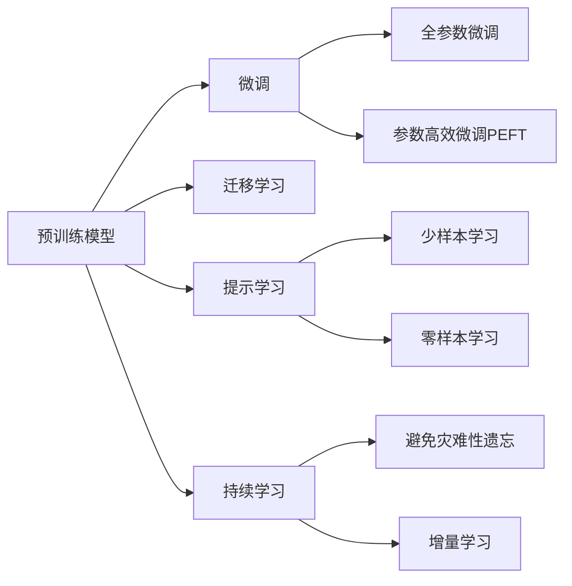

                 

## 1. 背景介绍

### 1.1 问题由来

人工智能（AI）技术在过去十年取得了显著进展，其中深度学习（Deep Learning）特别是大规模神经网络模型的发展尤为引人注目。深度学习模型的崛起主要得益于两个关键因素：一是硬件性能的不断提升，二是大量无标签数据的涌现。大规模神经网络模型（如BERT、GPT等）得益于在无标签数据上的预训练，从而获得了对语言的深刻理解。这些模型通过语言模型、掩码语言模型等自监督任务进行预训练，学习到了丰富的语言知识和常识。

然而，尽管预训练模型在语言理解方面表现优异，但在特定领域的应用中，通常需要进一步微调（Fine-tuning）以适应特定任务。微调是指在预训练模型的基础上，利用下游任务的标注数据进行有监督学习，以优化模型在该任务上的性能。这一过程通常需要较少的训练样本和较低的计算成本，成为从实验室到市场的关键步骤。

### 1.2 问题核心关键点

微调的核心在于如何在保留预训练模型泛化能力的同时，进一步适应下游任务。以下是微调中的几个关键点：

- **数据准备**：选择高质量的标注数据，并确保其与预训练数据分布一致。
- **模型选择**：选择合适的预训练模型作为初始化参数。
- **任务适配层**：设计适合下游任务的输出层和损失函数。
- **优化策略**：选择合适的优化器、学习率、正则化技术等。
- **性能评估**：在验证集和测试集上评估模型性能，确保模型泛化能力。

### 1.3 问题研究意义

微调方法不仅能够降低开发成本，提升模型性能，还为NLP技术在更多实际应用中的落地提供了可能。例如，在智能客服、金融舆情监测、个性化推荐等领域，微调技术可以显著提高系统的智能化水平和服务质量。

微调方法的广泛应用推动了NLP技术的产业化进程，加速了AI技术的商业化应用。微调方法在未来，有望在更多领域得到应用，推动人工智能技术的普及和落地。

## 2. 核心概念与联系

### 2.1 核心概念概述

为更好地理解微调技术，首先需要明确几个核心概念：

- **预训练模型（Pre-trained Model）**：在大量无标签数据上进行自监督学习，学习语言表示的模型。如BERT、GPT等。
- **微调（Fine-tuning）**：利用下游任务的标注数据，在有监督的情况下，优化模型以适应特定任务。
- **迁移学习（Transfer Learning）**：将一个领域学习到的知识，迁移应用到另一个相关领域的学习方法。
- **参数高效微调（Parameter-Efficient Fine-tuning, PEFT）**：在微调过程中，只更新少量模型参数，以提高微调效率和泛化能力。
- **提示学习（Prompt Learning）**：通过精心设计输入文本的格式，引导模型按期望方式输出，减少微调参数。

### 2.2 核心概念原理和架构的 Mermaid 流程图



这个流程图展示了预训练模型、微调、迁移学习等概念之间的联系，以及它们在微调中的角色。

## 3. 核心算法原理 & 具体操作步骤

### 3.1 算法原理概述

微调的核心思想是在预训练模型的基础上，利用下游任务的标注数据，进行有监督学习，以优化模型在该任务上的性能。微调的目标是最小化经验风险，即：

$$
\theta^* = \mathop{\arg\min}_{\theta} \mathcal{L}(M_{\theta},D)
$$

其中，$\theta$ 为模型参数，$M_{\theta}$ 为微调后的模型，$D$ 为下游任务的标注数据集，$\mathcal{L}$ 为损失函数。

微调的常用损失函数包括交叉熵损失、均方误差损失等。通过梯度下降等优化算法，微调过程不断更新模型参数 $\theta$，最小化损失函数 $\mathcal{L}$。

### 3.2 算法步骤详解

微调的基本步骤如下：

1. **数据准备**：收集下游任务的标注数据集，将其划分为训练集、验证集和测试集。
2. **任务适配层设计**：根据任务类型，设计合适的输出层和损失函数。
3. **选择预训练模型**：选择合适的预训练模型作为初始化参数。
4. **设置超参数**：选择优化器、学习率、正则化技术等超参数。
5. **训练模型**：使用训练集数据进行有监督学习，更新模型参数。
6. **验证和测试**：在验证集和测试集上评估模型性能，防止过拟合。

### 3.3 算法优缺点

微调的主要优点包括：

- **效率高**：微调通常需要较少的训练样本和计算资源，可以在较短时间内完成。
- **泛化能力强**：微调模型通常能够更好地适应特定任务。
- **参数高效**：部分参数可以保持不变，减少微调过程中的计算量和内存占用。

主要缺点包括：

- **依赖标注数据**：微调效果很大程度上取决于标注数据的质量和数量。
- **迁移能力有限**：当任务与预训练数据分布差异较大时，微调效果可能不理想。
- **模型鲁棒性不足**：微调模型可能对输入数据的微小扰动敏感。

### 3.4 算法应用领域

微调技术广泛应用于各种NLP任务，例如：

- **文本分类**：如情感分析、主题分类、意图识别等。
- **命名实体识别**：识别文本中的人名、地名、机构名等特定实体。
- **关系抽取**：从文本中抽取实体之间的语义关系。
- **问答系统**：对自然语言问题给出答案。
- **机器翻译**：将源语言文本翻译成目标语言。
- **文本摘要**：将长文本压缩成简短摘要。
- **对话系统**：使机器能够与人自然对话。

这些任务都需要模型在特定语境下进行推理和生成，微调技术能够有效地提升模型在这些任务上的表现。

## 4. 数学模型和公式 & 详细讲解 & 举例说明

### 4.1 数学模型构建

考虑一个二分类任务，假设预训练模型的输出为 $M_{\theta}(x) \in [0,1]$，表示样本属于正类的概率。真实标签 $y \in \{0,1\}$。

定义模型 $M_{\theta}$ 在输入 $x$ 上的损失函数为：

$$
\ell(M_{\theta}(x),y) = -[y\log \hat{y} + (1-y)\log (1-\hat{y})]
$$

将损失函数代入经验风险公式：

$$
\mathcal{L}(\theta) = -\frac{1}{N}\sum_{i=1}^N [y_i\log M_{\theta}(x_i)+(1-y_i)\log(1-M_{\theta}(x_i))]
$$

通过梯度下降等优化算法，微调过程不断更新模型参数 $\theta$，最小化损失函数 $\mathcal{L}$。

### 4.2 公式推导过程

以下是二分类任务的损失函数和梯度公式：

$$
\ell(M_{\theta}(x),y) = -[y\log \hat{y} + (1-y)\log (1-\hat{y})]
$$

求导得到梯度：

$$
\frac{\partial \ell}{\partial \hat{y}} = -\frac{y}{\hat{y}} + \frac{1-y}{1-\hat{y}}
$$

将梯度代入微调公式：

$$
\theta \leftarrow \theta - \eta \nabla_{\theta}\mathcal{L}(\theta) - \eta\lambda\theta
$$

其中 $\eta$ 为学习率，$\lambda$ 为正则化系数。

### 4.3 案例分析与讲解

以命名实体识别（NER）任务为例，假设模型输出为实体类别概率分布 $p(y|x)$，损失函数为交叉熵损失：

$$
\mathcal{L}(p(y|x),y) = -\sum_{i=1}^n y_i \log p(y_i|x)
$$

其中 $n$ 为词数，$y$ 为标签，$p$ 为模型预测的概率分布。梯度公式为：

$$
\frac{\partial \mathcal{L}}{\partial p} = -y \frac{p}{1-p} + (1-y)
$$

将梯度代入微调公式，得到：

$$
p \leftarrow p - \eta \nabla_{p}\mathcal{L}(p) - \eta\lambda p
$$

## 5. 项目实践：代码实例和详细解释说明

### 5.1 开发环境搭建

1. **安装Anaconda**：
   ```bash
   wget https://repo.anaconda.com/miniconda/Miniconda3-latest-Linux-x86_64.sh
   bash Miniconda3-latest-Linux-x86_64.sh
   source ~/.bashrc
   conda init
   ```

2. **创建虚拟环境**：
   ```bash
   conda create -n pytorch-env python=3.8
   conda activate pytorch-env
   ```

3. **安装依赖**：
   ```bash
   conda install pytorch torchvision torchaudio cudatoolkit=11.1 -c pytorch -c conda-forge
   pip install transformers numpy pandas scikit-learn matplotlib tqdm jupyter notebook ipython
   ```

### 5.2 源代码详细实现

以下是一个基于BERT模型的命名实体识别（NER）任务微调的Python代码实现：

```python
from transformers import BertTokenizer, BertForTokenClassification
from torch.utils.data import Dataset, DataLoader
from torch import nn, optim

# 数据处理函数
class NERDataset(Dataset):
    def __init__(self, texts, tags, tokenizer, max_len=128):
        self.texts = texts
        self.tags = tags
        self.tokenizer = tokenizer
        self.max_len = max_len

    def __len__(self):
        return len(self.texts)

    def __getitem__(self, item):
        text = self.texts[item]
        tags = self.tags[item]

        encoding = self.tokenizer(text, return_tensors='pt', max_length=self.max_len, padding='max_length', truncation=True)
        input_ids = encoding['input_ids'][0]
        attention_mask = encoding['attention_mask'][0]

        # 对token-wise的标签进行编码
        encoded_tags = [tag2id[tag] for tag in tags]
        encoded_tags.extend([tag2id['O']] * (self.max_len - len(encoded_tags)))
        labels = torch.tensor(encoded_tags, dtype=torch.long)

        return {'input_ids': input_ids, 
                'attention_mask': attention_mask,
                'labels': labels}

# 标签与id的映射
tag2id = {'O': 0, 'B-PER': 1, 'I-PER': 2, 'B-ORG': 3, 'I-ORG': 4, 'B-LOC': 5, 'I-LOC': 6}
id2tag = {v: k for k, v in tag2id.items()}

# 创建dataset
tokenizer = BertTokenizer.from_pretrained('bert-base-cased')

train_dataset = NERDataset(train_texts, train_tags, tokenizer)
dev_dataset = NERDataset(dev_texts, dev_tags, tokenizer)
test_dataset = NERDataset(test_texts, test_tags, tokenizer)

# 模型和优化器
model = BertForTokenClassification.from_pretrained('bert-base-cased', num_labels=len(tag2id))
optimizer = optim.AdamW(model.parameters(), lr=2e-5)

# 训练和评估函数
device = torch.device('cuda') if torch.cuda.is_available() else torch.device('cpu')
model.to(device)

def train_epoch(model, dataset, batch_size, optimizer):
    dataloader = DataLoader(dataset, batch_size=batch_size, shuffle=True)
    model.train()
    epoch_loss = 0
    for batch in dataloader:
        input_ids = batch['input_ids'].to(device)
        attention_mask = batch['attention_mask'].to(device)
        labels = batch['labels'].to(device)
        model.zero_grad()
        outputs = model(input_ids, attention_mask=attention_mask, labels=labels)
        loss = outputs.loss
        epoch_loss += loss.item()
        loss.backward()
        optimizer.step()
    return epoch_loss / len(dataloader)

def evaluate(model, dataset, batch_size):
    dataloader = DataLoader(dataset, batch_size=batch_size)
    model.eval()
    preds, labels = [], []
    with torch.no_grad():
        for batch in dataloader:
            input_ids = batch['input_ids'].to(device)
            attention_mask = batch['attention_mask'].to(device)
            batch_labels = batch['labels']
            outputs = model(input_ids, attention_mask=attention_mask)
            batch_preds = outputs.logits.argmax(dim=2).to('cpu').tolist()
            batch_labels = batch_labels.to('cpu').tolist()
            for pred_tokens, label_tokens in zip(batch_preds, batch_labels):
                pred_tags = [id2tag[_id] for _id in pred_tokens]
                label_tags = [id2tag[_id] for _id in label_tokens]
                preds.append(pred_tags[:len(label_tags)])
                labels.append(label_tags)

    print(classification_report(labels, preds))

# 训练流程
epochs = 5
batch_size = 16

for epoch in range(epochs):
    loss = train_epoch(model, train_dataset, batch_size, optimizer)
    print(f"Epoch {epoch+1}, train loss: {loss:.3f}")

    print(f"Epoch {epoch+1}, dev results:")
    evaluate(model, dev_dataset, batch_size)

print("Test results:")
evaluate(model, test_dataset, batch_size)
```

### 5.3 代码解读与分析

1. **数据处理函数**：
   - `__init__`方法：初始化文本、标签、分词器等组件。
   - `__len__`方法：返回数据集的样本数量。
   - `__getitem__`方法：对单个样本进行处理，将文本输入编码为token ids，将标签编码为数字，并对其进行定长padding。

2. **标签与id的映射**：
   - 定义了标签与数字id之间的映射关系，用于将token-wise的预测结果解码回真实的标签。

3. **训练和评估函数**：
   - `train_epoch`函数：对数据以批为单位进行迭代，在每个批次上前向传播计算loss并反向传播更新模型参数。
   - `evaluate`函数：与训练类似，不同点在于不更新模型参数，并在每个batch结束后将预测和标签结果存储下来。

4. **训练流程**：
   - 定义总的epoch数和batch size，开始循环迭代。
   - 每个epoch内，先在训练集上训练，输出平均loss。
   - 在验证集上评估，输出分类指标。
   - 所有epoch结束后，在测试集上评估，给出最终测试结果。

## 6. 实际应用场景

### 6.1 智能客服系统

智能客服系统通过微调语言模型，可以实时响应客户咨询，提供自然流畅的客服服务。例如，使用微调后的BERT模型进行对话生成，将用户问题和历史聊天记录作为上下文输入，生成适当的回复。

### 6.2 金融舆情监测

金融机构利用微调后的模型进行情感分析和主题分类，实时监测金融舆情，及时发现负面消息，规避金融风险。例如，将金融新闻和社交媒体评论作为输入，训练模型进行情感倾向分析。

### 6.3 个性化推荐系统

推荐系统利用微调后的模型进行用户兴趣分析，推荐个性化内容。例如，将用户浏览、点击、评论等行为数据作为输入，训练模型进行用户兴趣预测，推荐相关商品或服务。

## 7. 工具和资源推荐

### 7.1 学习资源推荐

1. **《Transformer从原理到实践》系列博文**：详细介绍了Transformer原理、BERT模型、微调技术等。
2. **CS224N《深度学习自然语言处理》课程**：斯坦福大学开设的NLP明星课程，提供Lecture视频和配套作业。
3. **《Natural Language Processing with Transformers》书籍**：介绍使用Transformers库进行NLP任务开发的多种范式。
4. **HuggingFace官方文档**：提供丰富的预训练语言模型和微调样例。
5. **CLUE开源项目**：提供各种类型的中文NLP数据集和微调baseline模型。

### 7.2 开发工具推荐

1. **PyTorch**：基于Python的开源深度学习框架。
2. **TensorFlow**：由Google主导开发的开源深度学习框架。
3. **Transformers库**：HuggingFace开发的NLP工具库。
4. **Weights & Biases**：模型训练的实验跟踪工具。
5. **TensorBoard**：TensorFlow配套的可视化工具。
6. **Google Colab**：谷歌提供的在线Jupyter Notebook环境。

### 7.3 相关论文推荐

1. **Attention is All You Need**：Transformer原论文。
2. **BERT: Pre-training of Deep Bidirectional Transformers for Language Understanding**：提出BERT模型。
3. **Language Models are Unsupervised Multitask Learners（GPT-2论文）**：展示大模型的zero-shot学习能力。
4. **Parameter-Efficient Transfer Learning for NLP**：提出Adapter等参数高效微调方法。
5. **Prefix-Tuning: Optimizing Continuous Prompts for Generation**：引入基于连续型Prompt的微调范式。
6. **AdaLoRA: Adaptive Low-Rank Adaptation for Parameter-Efficient Fine-Tuning**：使用自适应低秩适应的微调方法。

## 8. 总结：未来发展趋势与挑战

### 8.1 总结

本文对大语言模型从实验室到市场的落地进行了全面系统的介绍。详细讲解了大语言模型微调的背景、核心概念、算法原理和具体操作步骤，并给出了代码实例和详细解释。文章还探讨了微调在多个实际应用场景中的应用前景，并推荐了相关的学习资源、开发工具和研究论文。

### 8.2 未来发展趋势

未来，大语言模型微调技术将呈现以下几个发展趋势：

1. **模型规模持续增大**：超大规模语言模型蕴含的丰富语言知识，有望支撑更加复杂多变的下游任务微调。
2. **微调方法日趋多样**：出现更多参数高效和计算高效的微调方法，提高微调效率和泛化能力。
3. **持续学习成为常态**：微调模型需要持续学习新知识以保持性能。
4. **少样本学习和跨领域迁移能力增强**：通过提示学习、对抗训练等技术，提升模型泛化能力和鲁棒性。
5. **多模态微调崛起**：将视觉、语音等多模态数据与文本信息进行协同建模。
6. **通用性增强**：增强模型的常识推理和跨领域迁移能力。

### 8.3 面临的挑战

尽管微调技术取得了显著进展，但在实际应用中仍面临诸多挑战：

1. **标注成本瓶颈**：高质量标注数据获取成本较高。
2. **模型鲁棒性不足**：面对域外数据时泛化性能有限。
3. **推理效率有待提高**：大模型推理速度慢，内存占用大。
4. **可解释性亟需加强**：模型决策过程缺乏可解释性。
5. **安全性有待保障**：模型输出可能包含有害信息。
6. **知识整合能力不足**：模型无法灵活吸收外部知识。

### 8.4 研究展望

未来研究需要在以下几个方面寻求新的突破：

1. **探索无监督和半监督微调方法**：降低对标注数据的依赖。
2. **研究参数高效和计算高效的微调范式**：提高微调效率和泛化能力。
3. **引入因果和对比学习范式**：增强模型泛化能力和鲁棒性。
4. **融合更多先验知识**：结合外部知识进行微调。
5. **结合因果分析和博弈论工具**：增强模型稳定性和鲁棒性。
6. **纳入伦理道德约束**：确保模型输出符合伦理道德。

## 9. 附录：常见问题与解答

### Q1: 大语言模型微调是否适用于所有NLP任务？

A: 微调在大多数NLP任务上都能取得不错的效果，但对于某些特定领域的任务，可能需要在特定领域语料上进一步预训练。

### Q2: 如何选择合适的学习率？

A: 微调的学习率一般要比预训练时小1-2个数量级，建议从1e-5开始调参，逐步减小学习率。

### Q3: 微调过程中如何缓解过拟合问题？

A: 常见缓解策略包括数据增强、正则化、对抗训练、参数高效微调等。

### Q4: 微调模型在落地部署时需要注意哪些问题？

A: 模型裁剪、量化加速、服务化封装、弹性伸缩、监控告警和安全防护都是需要注意的。

### Q5: 如何降低微调对标注数据的依赖？

A: 通过引入无监督和半监督学习范式，利用自监督学习、主动学习等技术。

---
作者：禅与计算机程序设计艺术 / Zen and the Art of Computer Programming

