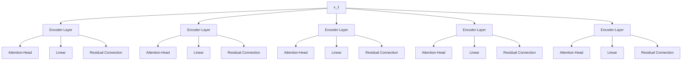

                 

## 1. 背景介绍

### 1.1 问题由来
大规模语言模型（Large Language Models, LLMs）在自然语言处理（Natural Language Processing, NLP）领域的兴起，带来了人工智能研究与应用的重大突破。从GPT-1到GPT-3，再到最新的GPT-4，这些模型在文本生成、理解、翻译等多个领域取得了前所未有的成就。这些大模型的训练与优化需要巨量的数据支持，数据质量和多样性直接影响了模型的性能与泛化能力。本文将深入探讨大规模语言模型数据来源与构建，从理论与实践两个层面阐释其重要性，并提出未来数据利用的发展趋势。

### 1.2 问题核心关键点
数据是构建大规模语言模型的基石，其来源与质量对模型的训练、性能与泛化能力有着至关重要的影响。在深度学习背景下，数据的重要性愈发凸显，尤其是在训练复杂模型时，数据的充足性、多样性与质量会直接决定模型的成功与否。此外，数据隐私、数据标注与数据公平性等伦理问题也亟需引起关注。

本文将深入探讨大规模语言模型数据来源的多样性、数据标注的重要性、数据隐私保护措施及数据公平性，旨在为模型开发者提供全面的数据指导与建议。

## 2. 核心概念与联系

### 2.1 核心概念概述

为理解大规模语言模型的数据构建，首先需要清晰地界定以下关键概念：

- **大规模语言模型（Large Language Models, LLMs）**：以自回归（如GPT）或自编码（如BERT）模型为代表的深度学习模型，通过在海量无标签文本数据上进行预训练，学习丰富的语言知识与表示，具备强大的语言理解和生成能力。

- **预训练（Pre-training）**：在大规模无标签文本数据上，通过自监督学习任务训练通用语言模型的过程。常见的预训练任务包括言语建模、掩码语言模型等。预训练使得模型学习到通用的语言表示。

- **微调（Fine-tuning）**：在预训练模型的基础上，使用下游任务的少量标注数据，通过有监督学习优化模型在特定任务上的性能。通常只需调整顶层分类器或解码器，并以较小的学习率更新全部或部分模型参数。

- **数据来源（Data Source）**：大规模语言模型所需数据的来源，可以是开放数据集、网络爬取数据、专业领域数据等，数据来源的多样性与质量对模型的性能有着重要影响。

- **数据标注（Data Labeling）**：对模型训练数据进行标记的过程，标注数据的质量直接影响模型性能，尤其是少样本学习与小数据集上的微调。

- **数据隐私（Data Privacy）**：保护数据不被非法访问与利用的过程，尤其在敏感信息处理与大数据分析中，数据隐私保护尤为重要。

- **数据公平性（Data Fairness）**：确保数据来源与标注过程的公平性与多样性，避免模型偏见与歧视。

### 2.2 核心概念原理和架构的 Mermaid 流程图

```mermaid
graph TB
    A[大规模语言模型 (LLMs)] --> B[预训练]
    A --> C[微调]
    C --> D[数据来源]
    D --> E[数据标注]
    E --> F[数据隐私]
    F --> G[数据公平性]
```

此流程图展示了大规模语言模型构建的全过程，从预训练到微调，再到数据来源、标注、隐私与公平性，各个环节相互关联，共同影响模型的性能与质量。

## 3. 核心算法原理 & 具体操作步骤

### 3.1 算法原理概述

大规模语言模型的构建与优化过程，离不开高质量的数据支持。数据来源的多样性与质量，直接决定了模型的训练效果与泛化能力。数据构建包括以下几个关键步骤：

- **数据收集**：通过网络爬虫、开放数据集等手段，收集海量无标签文本数据。
- **数据清洗**：对收集到的数据进行去重、格式化与标准化处理，去除噪声与无用信息。
- **数据标注**：为特定任务标注数据集，如命名实体识别、情感分析等，提供有监督学习信号。
- **数据隐私保护**：对敏感数据进行脱敏处理，确保数据不被非法访问与利用。
- **数据公平性**：确保数据来源与标注过程的公平性与多样性，避免模型偏见与歧视。

### 3.2 算法步骤详解

大规模语言模型的构建与优化步骤如下：

1. **数据收集**：
   - 利用网络爬虫技术，从公开的Web页面、社交媒体、新闻网站等获取数据。
   - 下载开源数据集，如Common Crawl、Reddit Corpus等，进行初步处理。

2. **数据清洗**：
   - 使用正则表达式与分词工具，去除HTML标签、特殊符号等无用信息。
   - 将文本数据转换为统一格式，如统一编码、标准化日期时间格式等。

3. **数据标注**：
   - 手动标注或使用众包平台（如Amazon Mechanical Turk）进行数据标注。
   - 利用现有预训练模型的预测结果，进行半自动标注。

4. **数据隐私保护**：
   - 使用数据匿名化技术，如数据屏蔽、数据扰动等，确保敏感信息不被泄露。
   - 实施数据访问控制，仅允许授权人员访问敏感数据。

5. **数据公平性**：
   - 确保数据集的多样性与代表性，避免因数据偏见导致的模型偏见。
   - 定期监控与更新数据集，确保其与时俱进。

### 3.3 算法优缺点

大规模语言模型的数据构建与优化，有以下优缺点：

**优点**：
- 数据来源多样，便于构建多样性丰富的模型。
- 数据标注过程可以引入大量有经验的标注人员，保证标注质量。
- 数据隐私保护措施，确保数据安全与合规性。
- 数据公平性策略，避免模型偏见与歧视。

**缺点**：
- 数据收集与清洗工作量大，耗时耗力。
- 数据标注成本高，尤其是在大规模数据集上。
- 数据隐私保护可能面临技术挑战，尤其是在大规模数据集上。
- 数据公平性策略需要不断调整与更新，确保模型公平性。

### 3.4 算法应用领域

大规模语言模型的数据构建与优化方法，在NLP领域得到广泛应用，包括但不限于：

- 文本分类：如情感分析、主题分类、意图识别等，通过数据标注提升模型效果。
- 命名实体识别：识别文本中的人名、地名、机构名等特定实体，需要高质量的标注数据。
- 关系抽取：从文本中抽取实体之间的语义关系，数据标注对模型效果至关重要。
- 问答系统：对自然语言问题给出答案，需要大量的Q&A数据。
- 机器翻译：将源语言文本翻译成目标语言，需要大量的平行语料。
- 文本摘要：将长文本压缩成简短摘要，需要大量的摘要-文本对数据。
- 对话系统：使机器能够与人自然对话，需要多轮对话历史数据。

## 4. 数学模型和公式 & 详细讲解 & 举例说明

### 4.1 数学模型构建

在构建大规模语言模型时，数学模型构建是至关重要的环节。本文以Transformer模型为例，介绍其数学模型的构建方法。

Transformer模型是一种基于自注意力机制的神经网络结构，其数学模型包括编码器-解码器结构、自注意力机制、多头注意力机制等。假设输入序列为 $x=\{x_1, x_2, \dots, x_n\}$，输出序列为 $y=\{y_1, y_2, \dots, y_n\}$。

### 4.2 公式推导过程

Transformer模型的编码器-解码器结构如下图所示：



Transformer模型的自注意力机制可以通过矩阵乘法实现，公式如下：

$$
\text{Attention}(Q, K, V) = \text{Softmax}(\frac{QK^T}{\sqrt{d_k}})V
$$

其中，$Q$ 表示查询矩阵，$K$ 表示键矩阵，$V$ 表示值矩阵，$d_k$ 表示键矩阵的维度。

Transformer模型的多头注意力机制通过堆叠多个自注意力层实现，公式如下：

$$
\text{Multi-Head Attention}(Q, K, V) = \text{Concat}(\text{Attention}(QW^Q, KW^K, VW^V))
$$

### 4.3 案例分析与讲解

以BERT模型为例，其数学模型包括语言模型预训练与任务特定的微调。BERT模型利用掩码语言模型（Masked Language Model, MLM）进行预训练，公式如下：

$$
L_{MLM}(X, Y) = \sum_{i=1}^{n} log\,P(Y_i|X_{1:i-1}, X_{i+1:n})
$$

其中，$X$ 表示输入序列，$Y$ 表示目标序列，$P(Y_i|X_{1:i-1}, X_{i+1:n})$ 表示在给定上下文条件下，目标序列中第 $i$ 个位置的概率。

在任务特定的微调中，假设任务为命名实体识别（NER），其数学模型可以表示为：

$$
L_{NER}(X, Y) = \sum_{i=1}^{n} log\,P(Y_i|X_{1:i-1}, X_{i+1:n})
$$

其中，$X$ 表示输入序列，$Y$ 表示标注序列，$P(Y_i|X_{1:i-1}, X_{i+1:n})$ 表示在给定上下文条件下，目标序列中第 $i$ 个位置的概率。

## 5. 项目实践：代码实例和详细解释说明

### 5.1 开发环境搭建

在搭建开发环境时，需要选择合适的编程语言与深度学习框架。Python是NLP领域的通用编程语言，而TensorFlow与PyTorch是最流行的深度学习框架。本文以TensorFlow为例，介绍其环境搭建流程。

```bash
pip install tensorflow
```

### 5.2 源代码详细实现

以下是一个使用TensorFlow进行BERT微调的代码实现：

```python
import tensorflow as tf
from transformers import BertTokenizer, TFBertModel, TFBertForTokenClassification

# 初始化数据与模型
tokenizer = BertTokenizer.from_pretrained('bert-base-cased')
model = TFBertModel.from_pretrained('bert-base-cased')
classifier = TFBertForTokenClassification.from_pretrained('bert-base-cased', num_labels=3)

# 数据准备
# 假设数据已经存在，这里直接使用预处理后的数据
input_ids = tf.constant([...])
attention_masks = tf.constant([...])
labels = tf.constant([...])

# 模型训练
# 训练步骤与损失函数等略

# 模型评估
# 评估步骤与指标等略

# 模型保存
# 将训练好的模型保存为tf.saved_model，便于部署

# 模型加载与推理
# 加载保存的模型，并进行推理预测
```

### 5.3 代码解读与分析

在上述代码中，我们首先导入TensorFlow与Transformers库，并初始化BERT模型与数据。然后，在训练阶段，我们使用模型在标注数据上进行有监督学习，优化模型参数。在评估阶段，我们使用评估指标对模型进行测试，确保其性能符合预期。最后，将训练好的模型保存为tf.saved_model，便于后续部署与推理。

## 6. 实际应用场景

### 6.4 未来应用展望

大规模语言模型的数据构建与优化，在NLP领域具有广泛的应用前景，未来发展趋势如下：

1. **数据源多样化**：未来将利用更多元化的数据源，如社交媒体、专业文献、开源项目等，提升模型多样性与泛化能力。
2. **数据标注自动化**：利用半自动标注、弱监督学习等技术，降低人工标注成本，提升标注效率。
3. **数据隐私保护**：采用更先进的数据匿名化与隐私保护技术，确保敏感数据的安全性与合规性。
4. **数据公平性**：确保数据集的多样性与代表性，避免因数据偏见导致的模型偏见。
5. **数据利用智能化**：利用智能数据标注与增强技术，提升数据质量与利用效率。

## 7. 工具和资源推荐

### 7.1 学习资源推荐

- **自然语言处理综述**：学习NLP领域的经典理论、技术与方法。
- **深度学习框架教程**：掌握TensorFlow、PyTorch等深度学习框架的用法。
- **BERT模型教程**：深入理解BERT模型的构建与优化方法。
- **NLP数据集**：如Common Crawl、Reddit Corpus等，获取多样化的数据资源。

### 7.2 开发工具推荐

- **网络爬虫工具**：如Scrapy、BeautifulSoup等，用于数据收集与预处理。
- **数据处理库**：如Pandas、NumPy等，用于数据清洗与标注。
- **深度学习框架**：如TensorFlow、PyTorch等，用于模型构建与训练。
- **数据隐私保护工具**：如Keras-Preprocessing等，用于数据隐私保护。

### 7.3 相关论文推荐

- **Transformer架构**：Attention is All You Need。
- **BERT预训练方法**：BERT: Pre-training of Deep Bidirectional Transformers for Language Understanding。
- **BERT微调技术**：BERT Fine-Tuning in Natural Language Processing Tasks。

## 8. 总结：未来发展趋势与挑战

### 8.1 总结

本文从理论与实践两个层面，全面介绍了大规模语言模型数据构建的方法与策略。数据构建是构建高质量模型的基石，其来源、标注、隐私与公平性等方面对模型的性能与泛化能力有着重要影响。未来，随着数据标注与隐私保护技术的不断进步，大规模语言模型的数据构建将更加高效与智能，为NLP技术的发展与应用提供坚实基础。

### 8.2 未来发展趋势

未来，大规模语言模型数据构建将呈现以下发展趋势：

1. **数据源多样化**：利用更多元化的数据源，提升模型多样性与泛化能力。
2. **数据标注自动化**：利用半自动标注与弱监督学习等技术，降低人工标注成本。
3. **数据隐私保护**：采用更先进的数据匿名化与隐私保护技术，确保敏感数据的安全性与合规性。
4. **数据公平性**：确保数据集的多样性与代表性，避免模型偏见与歧视。
5. **数据利用智能化**：利用智能数据标注与增强技术，提升数据质量与利用效率。

### 8.3 面临的挑战

尽管数据构建技术取得了长足进步，但未来仍面临诸多挑战：

1. **数据源稀缺**：对于某些特定领域，高质量的数据源难以获取，影响模型训练与优化。
2. **数据标注困难**：某些复杂任务的数据标注难度高，需要大量人工参与，成本高昂。
3. **数据隐私风险**：数据隐私保护技术需要不断改进，确保敏感数据不被非法访问与利用。
4. **数据公平性问题**：数据集的公平性需要不断监控与调整，避免模型偏见与歧视。
5. **数据利用效率**：如何高效利用多样化的数据源，提升模型性能，仍需深入研究。

### 8.4 研究展望

未来，需要深入探索以下研究方向：

1. **数据自动标注技术**：利用自然语言处理技术与深度学习模型，自动标注数据，降低人工标注成本。
2. **数据隐私保护技术**：采用更先进的数据匿名化与隐私保护技术，确保敏感数据的安全性与合规性。
3. **数据公平性策略**：确保数据集的多样性与代表性，避免因数据偏见导致的模型偏见。
4. **数据利用智能化**：利用智能数据标注与增强技术，提升数据质量与利用效率。

这些研究方向将为大规模语言模型的构建与优化提供新的思路与方法，进一步提升NLP技术的性能与应用范围。

## 9. 附录：常见问题与解答

### Q1: 如何保证大规模语言模型数据的公平性？

**A1:** 确保数据集的多样性与代表性是保证模型公平性的关键。可以通过以下方式：
1. 数据采集与标注过程中的多样化采样，确保样本来源广泛。
2. 定期监控数据集的多样性与代表性，及时更新与调整。
3. 引入数据增强技术，生成多样化的训练样本。

### Q2: 大规模语言模型数据的隐私保护有哪些措施？

**A2:** 大规模语言模型数据的隐私保护可以通过以下措施实现：
1. 数据匿名化：去除敏感信息，如个人身份信息、地理位置等。
2. 数据扰动：对数据进行扰动处理，增加噪音，防止信息泄露。
3. 数据访问控制：实施严格的访问控制，仅允许授权人员访问敏感数据。
4. 加密技术：对敏感数据进行加密存储与传输，确保数据安全。

### Q3: 大规模语言模型数据的标注工作如何自动化？

**A3:** 大规模语言模型数据的标注工作可以通过以下自动化方式实现：
1. 半自动标注：利用预训练模型的预测结果，进行半自动标注。
2. 弱监督学习：利用少量标注数据，训练弱监督模型，辅助标注过程。
3. 基于规则的标注：定义标注规则，利用规则进行自动标注。
4. 人工智能辅助标注：利用自然语言处理技术与深度学习模型，自动标注数据。

### Q4: 大规模语言模型数据构建过程中如何处理数据多样性与噪声问题？

**A4:** 大规模语言模型数据构建过程中，处理数据多样性与噪声问题可以通过以下方式实现：
1. 数据清洗：去除噪声与无用信息，确保数据质量。
2. 数据增强：通过数据增强技术，生成多样化的训练样本，提升模型泛化能力。
3. 数据平衡：对数据集进行平衡处理，避免某些类别数据过少的问题。
4. 数据采样：采用多样化的数据采样策略，确保数据多样性。

### Q5: 大规模语言模型数据的收集与处理过程需要哪些工具与技术？

**A5:** 大规模语言模型数据的收集与处理过程需要以下工具与技术：
1. 网络爬虫：如Scrapy、BeautifulSoup等，用于数据收集与预处理。
2. 数据处理库：如Pandas、NumPy等，用于数据清洗与标注。
3. 深度学习框架：如TensorFlow、PyTorch等，用于模型构建与训练。
4. 数据隐私保护工具：如Keras-Preprocessing等，用于数据隐私保护。

---

作者：禅与计算机程序设计艺术 / Zen and the Art of Computer Programming

