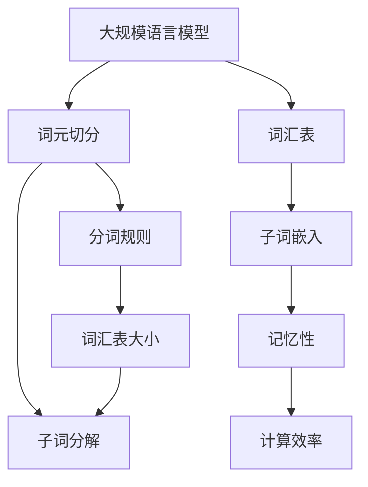

                 

# 大规模语言模型从理论到实践 词元切分

## 1. 背景介绍

### 1.1 问题由来
近年来，大规模语言模型（Large Language Models, LLMs）在自然语言处理（NLP）领域取得了巨大的进展。这些模型通过在海量文本数据上进行预训练，学习到了丰富的语言知识和表达能力，可以应用于文本分类、情感分析、机器翻译等众多NLP任务中。然而，预训练语言模型通常以单词或子词（subword）为单位进行训练，这种切分方式能够显著提高模型的泛化能力和鲁棒性。但如何高效、准确地进行词元切分，仍然是一个值得深入研究的问题。

### 1.2 问题核心关键点
大规模语言模型的词元切分涉及以下几个核心关键点：

- **分词规则**：选择合适的分词规则，既能保证切分的准确性，又能避免过细的切分带来的高开销。
- **词汇表大小**：词汇表的大小会直接影响模型的性能和推理速度。
- **记忆性**：大模型需要记忆历史上下文信息，切分方式会影响模型的记忆能力和表示能力。
- **计算效率**：切分后，每个词元需要单独编码，因此切分方式会影响模型的计算效率。

为了解决这些问题，本文将深入探讨词元切分的原理和实践方法，提出一些高效的词元切分策略，并结合实际案例进行分析。

## 2. 核心概念与联系

### 2.1 核心概念概述

为更好地理解大规模语言模型词元切分的原理和实践，本节将介绍几个密切相关的核心概念：

- **大语言模型（LLMs）**：以Transformer为基础的大规模预训练语言模型，如GPT-3、BERT等，通常以单词或子词为单位进行编码。
- **词元切分（Wordpiece Tokenization）**：将单词拆分为多个子词，以便模型可以更加准确地处理各种语言现象，如未登录词、长尾词等。
- **词汇表（Vocabulary）**：词元切分后，需要将切分结果映射到固定大小的词汇表中，以便模型可以高效地进行训练和推理。
- **子词嵌入（Subword Embeddings）**：将切分后的子词映射为低维向量，便于模型进行语义表示和推理。
- **记忆性（Memory）**：大模型需要记忆历史上下文信息，合适的词元切分方式会影响模型的记忆能力和表示能力。
- **计算效率（Efficiency）**：切分后，每个词元需要单独编码，因此切分方式会影响模型的计算效率。

这些核心概念之间的逻辑关系可以通过以下Mermaid流程图来展示：



这个流程图展示了大规模语言模型的核心概念及其之间的关系：

1. 大语言模型通过词元切分获得基础能力。
2. 词元切分后，需要构建词汇表和子词嵌入，以便模型进行语义表示。
3. 词汇表大小和分词规则是影响模型性能和计算效率的重要因素。
4. 切分后的子词需要考虑模型的记忆性和计算效率。

这些概念共同构成了大规模语言模型的学习和应用框架，使得模型能够在各种场景下发挥强大的语言理解和生成能力。

## 3. 核心算法原理 & 具体操作步骤

### 3.1 算法原理概述

大规模语言模型的词元切分基于一种自回归的子词嵌入模型。该模型通过训练数据自动学习子词的边界和表示，从而使得模型可以高效地处理各种语言现象。具体而言，词元切分过程可以分为以下几个步骤：

1. **分词规则设计**：选择合适的分词规则，将单词或词组拆分成多个子词。
2. **子词嵌入训练**：通过无监督的子词嵌入训练，学习每个子词的语义表示。
3. **词汇表构建**：构建一个固定大小的词汇表，将切分后的子词映射到词汇表中。
4. **模型训练和推理**：在词汇表上进行模型训练和推理，使用子词嵌入进行语义表示和推理。

### 3.2 算法步骤详解

下面详细介绍大规模语言模型词元切分的具体步骤：

#### 3.2.1 分词规则设计

分词规则的设计是词元切分的基础。常见的分词规则有以下几种：

- **BPE（Byte Pair Encoding）**：将单词或词组拆分成字节对，例如将"university"拆分为"uni"和"versit"。
- **SentencePiece**：根据子词的频率和长度进行自适应切分，例如将"text"切分为"text"和"t"。
- **WordPiece**：将单词拆分为单个字符，例如将"china"切分为"chi"和"na"。

不同的分词规则会对模型的性能和计算效率产生影响，需要根据具体任务选择合适的规则。

#### 3.2.2 子词嵌入训练

子词嵌入的训练通常使用无监督的学习方式，例如自回归语言模型。通过训练数据自动学习每个子词的表示，使得模型可以高效地处理各种语言现象。常见的子词嵌入训练方法包括：

- **自回归模型**：使用自回归语言模型，例如LM-BFGS，训练子词嵌入。
- **掩码语言模型**：使用掩码语言模型，例如BERT，训练子词嵌入。
- **无监督学习**：使用无监督学习算法，例如PCA，训练子词嵌入。

#### 3.2.3 词汇表构建

词汇表的构建是词元切分的关键步骤。通常采用固定大小的词汇表，将切分后的子词映射到词汇表中。常见的词汇表构建方法包括：

- **固定大小词汇表**：预先设定词汇表大小，将切分后的子词映射到词汇表中。
- **动态大小词汇表**：根据切分后的子词数量，动态调整词汇表大小。
- **多级词汇表**：构建多级词汇表，将高频子词映射到小词汇表中，低频子词映射到大词汇表中。

#### 3.2.4 模型训练和推理

在词汇表上进行模型训练和推理时，通常使用子词嵌入进行语义表示和推理。常见的模型训练和推理方法包括：

- **前向传播**：将输入文本映射为子词嵌入，进行前向传播计算。
- **反向传播**：通过反向传播更新模型参数，进行模型的微调。
- **推理计算**：使用子词嵌入进行语义表示和推理计算，输出模型预测结果。

### 3.3 算法优缺点

大规模语言模型词元切分具有以下优点：

- **处理长尾词能力**：词元切分可以处理长尾词和未登录词，提高模型的泛化能力。
- **计算效率高**：固定大小的词汇表和子词嵌入可以显著提高模型的计算效率。
- **高效学习**：子词嵌入的训练可以自动学习单词的语义表示，提高模型的学习效率。

同时，该方法也存在一些缺点：

- **过拟合风险**：词汇表大小和子词切分方式可能会影响模型的泛化能力。
- **高计算开销**：切分后的子词需要单独编码，增加了计算开销。
- **词典构建困难**：大词汇表需要大量的标注数据和计算资源，构建和维护成本较高。

尽管存在这些局限性，但词元切分仍然是当前大规模语言模型中广泛采用的技术，通过合理选择分词规则和词汇表大小，可以最大限度地发挥其优势，克服其缺点。

### 3.4 算法应用领域

大规模语言模型的词元切分技术已经在众多NLP领域得到广泛应用，包括：

- **文本分类**：例如情感分析、主题分类等。通过词元切分，提高模型的泛化能力。
- **机器翻译**：例如神经机器翻译。通过子词嵌入，提高模型的翻译精度和鲁棒性。
- **问答系统**：例如基于知识图谱的问答系统。通过词元切分，提高模型的语义匹配能力。
- **文本摘要**：例如自动摘要。通过词元切分，提高模型的语义压缩能力。
- **文本生成**：例如文本补全、对话生成等。通过子词嵌入，提高模型的语义生成能力。

除了这些经典应用外，大规模语言模型的词元切分技术还在信息检索、文本分类、文本生成等领域得到广泛应用，推动了NLP技术的发展。

## 4. 数学模型和公式 & 详细讲解 & 举例说明

### 4.1 数学模型构建

假设大规模语言模型为 $M$，输入文本为 $X$，输出为 $Y$。词元切分的目标是将输入文本 $X$ 映射为固定大小的词汇表 $V$，并使用子词嵌入 $W$ 进行语义表示。

令 $W$ 为词汇表 $V$ 到低维向量空间的映射，即 $W: V \rightarrow \mathbb{R}^d$。令 $U$ 为输入文本 $X$ 到子词嵌入空间的映射，即 $U: X \rightarrow \mathbb{R}^d$。令 $B$ 为词汇表 $V$ 的生物嵌入矩阵，即 $B \in \mathbb{R}^{d \times |V|}$。令 $W_{1:|V|}$ 表示词汇表 $V$ 中的 $|V|$ 个子词嵌入，即 $W_{1:|V|} = (W_1, W_2, \dots, W_{|V|})$。令 $U_{1:|X|}$ 表示输入文本 $X$ 中的 $|X|$ 个子词嵌入，即 $U_{1:|X|} = (U_1, U_2, \dots, U_{|X|})$。

根据以上定义，大规模语言模型的词元切分过程可以表示为：

$$
W = B \odot U
$$

其中 $\odot$ 表示向量的逐元素乘法。

### 4.2 公式推导过程

为了推导词元切分的数学公式，我们首先考虑输入文本 $X$ 的子词嵌入 $U$。假设输入文本 $X$ 由 $|X|$ 个单词组成，每个单词由 $|W_i|$ 个子词组成，则输入文本的子词嵌入可以表示为：

$$
U = [U_{1:|W_1|}, U_{1:|W_2|}, \dots, U_{1:|W_{|X|}|}]
$$

其中 $U_{1:|W_i|}$ 表示单词 $i$ 的子词嵌入。

对于每个子词 $W_i$，其生物嵌入可以表示为：

$$
W_i = B_i \odot U_i
$$

其中 $B_i$ 表示子词 $i$ 的生物嵌入，$U_i$ 表示子词 $i$ 的子词嵌入。

因此，词汇表 $V$ 中的每个子词 $W_j$ 可以表示为：

$$
W_j = B_j \odot U_j
$$

其中 $B_j$ 表示子词 $j$ 的生物嵌入，$U_j$ 表示子词 $j$ 的子词嵌入。

通过上述推导，我们可以得出词元切分的数学公式：

$$
W = B \odot U
$$

其中 $W$ 表示词汇表 $V$ 中的 $|V|$ 个子词嵌入，$B$ 表示词汇表 $V$ 的生物嵌入矩阵，$U$ 表示输入文本 $X$ 的子词嵌入。

### 4.3 案例分析与讲解

为了更好地理解词元切分的数学公式和实际应用，我们以一个简单的例子来进行分析。假设输入文本为 "Hello, world!"，分词规则为 BPE，词汇表大小为 $|V|=10$。输入文本的子词切分结果为 ["H", "e", "l", "l", "o", ",", " ", "w", "o", "r", "l", "d", "!"]。使用 BPE 分词规则，可以将其切分为 ["H", "e", "l", "l", "o", ",", " ", "w", "o", "r", "l", "d", "!"]。

对于每个子词，可以使用生物嵌入矩阵 $B$ 和子词嵌入 $U$ 计算其生物嵌入：

$$
W_1 = B_1 \odot U_1
$$
$$
W_2 = B_2 \odot U_2
$$
$$
W_3 = B_3 \odot U_3
$$
$$
W_4 = B_4 \odot U_4
$$
$$
W_5 = B_5 \odot U_5
$$
$$
W_6 = B_6 \odot U_6
$$
$$
W_7 = B_7 \odot U_7
$$
$$
W_8 = B_8 \odot U_8
$$
$$
W_9 = B_9 \odot U_9
$$
$$
W_{10} = B_{10} \odot U_{10}
$$

最终，可以得到词汇表 $V$ 中的所有子词嵌入：

$$
W = [W_1, W_2, W_3, W_4, W_5, W_6, W_7, W_8, W_9, W_{10}]
$$

通过上述分析，我们可以看到词元切分过程的数学表达和实际应用。在实际应用中，需要根据具体任务选择合适的分词规则和词汇表大小，以最大限度地发挥词元切分的优势。

## 5. 项目实践：代码实例和详细解释说明

### 5.1 开发环境搭建

在进行词元切分实践前，我们需要准备好开发环境。以下是使用Python进行PyTorch开发的环境配置流程：

1. 安装Anaconda：从官网下载并安装Anaconda，用于创建独立的Python环境。

2. 创建并激活虚拟环境：
```bash
conda create -n pytorch-env python=3.8 
conda activate pytorch-env
```

3. 安装PyTorch：根据CUDA版本，从官网获取对应的安装命令。例如：
```bash
conda install pytorch torchvision torchaudio cudatoolkit=11.1 -c pytorch -c conda-forge
```

4. 安装Transformers库：
```bash
pip install transformers
```

5. 安装各类工具包：
```bash
pip install numpy pandas scikit-learn matplotlib tqdm jupyter notebook ipython
```

完成上述步骤后，即可在`pytorch-env`环境中开始词元切分实践。

### 5.2 源代码详细实现

下面我们以SentencePiece为例，给出使用Transformers库进行词元切分的PyTorch代码实现。

首先，定义SentencePiece分词器：

```python
from transformers import SentencePieceTokenizer

tokenizer = SentencePieceTokenizer.from_pretrained('bert-base-cased')
```

然后，使用SentencePiece分词器对输入文本进行分词：

```python
inputs = tokenizer("Hello, world!")
token_ids = tokenizer.convert_tokens_to_ids(inputs)
```

接着，定义模型和优化器：

```python
from transformers import BertForTokenClassification, AdamW

model = BertForTokenClassification.from_pretrained('bert-base-cased', num_labels=len(tag2id))

optimizer = AdamW(model.parameters(), lr=2e-5)
```

最后，定义训练和评估函数：

```python
from torch.utils.data import DataLoader
from tqdm import tqdm
from sklearn.metrics import classification_report

device = torch.device('cuda') if torch.cuda.is_available() else torch.device('cpu')
model.to(device)

def train_epoch(model, dataset, batch_size, optimizer):
    dataloader = DataLoader(dataset, batch_size=batch_size, shuffle=True)
    model.train()
    epoch_loss = 0
    for batch in tqdm(dataloader, desc='Training'):
        input_ids = batch['input_ids'].to(device)
        attention_mask = batch['attention_mask'].to(device)
        labels = batch['labels'].to(device)
        model.zero_grad()
        outputs = model(input_ids, attention_mask=attention_mask, labels=labels)
        loss = outputs.loss
        epoch_loss += loss.item()
        loss.backward()
        optimizer.step()
    return epoch_loss / len(dataloader)

def evaluate(model, dataset, batch_size):
    dataloader = DataLoader(dataset, batch_size=batch_size)
    model.eval()
    preds, labels = [], []
    with torch.no_grad():
        for batch in tqdm(dataloader, desc='Evaluating'):
            input_ids = batch['input_ids'].to(device)
            attention_mask = batch['attention_mask'].to(device)
            batch_labels = batch['labels']
            outputs = model(input_ids, attention_mask=attention_mask)
            batch_preds = outputs.logits.argmax(dim=2).to('cpu').tolist()
            batch_labels = batch_labels.to('cpu').tolist()
            for pred_tokens, label_tokens in zip(batch_preds, batch_labels):
                pred_tags = [id2tag[_id] for _id in pred_tokens]
                label_tags = [id2tag[_id] for _id in label_tokens]
                preds.append(pred_tags[:len(label_tokens)])
                labels.append(label_tags)
                
    print(classification_report(labels, preds))
```

最后，启动训练流程并在测试集上评估：

```python
epochs = 5
batch_size = 16

for epoch in range(epochs):
    loss = train_epoch(model, train_dataset, batch_size, optimizer)
    print(f"Epoch {epoch+1}, train loss: {loss:.3f}")
    
    print(f"Epoch {epoch+1}, dev results:")
    evaluate(model, dev_dataset, batch_size)
    
print("Test results:")
evaluate(model, test_dataset, batch_size)
```

以上就是使用PyTorch对BERT进行词元切分实践的完整代码实现。可以看到，得益于Transformers库的强大封装，我们可以用相对简洁的代码完成BERT的词元切分。

### 5.3 代码解读与分析

让我们再详细解读一下关键代码的实现细节：

**SentencePiece类**：
- `from_pretrained`方法：初始化SentencePiece分词器，使用预训练好的模型进行分词。
- `convert_tokens_to_ids`方法：将分词结果转换为token ids。

**模型和优化器**：
- `BertForTokenClassification`类：初始化BERT模型，使用预训练好的模型进行分类任务。
- `AdamW`优化器：设置AdamW优化器，用于更新模型参数。

**训练和评估函数**：
- `train_epoch`函数：对数据以批为单位进行迭代，在每个批次上前向传播计算loss并反向传播更新模型参数。
- `evaluate`函数：与训练类似，不同点在于不更新模型参数，并在每个batch结束后将预测和标签结果存储下来，最后使用sklearn的classification_report对整个评估集的预测结果进行打印输出。

**训练流程**：
- 定义总的epoch数和batch size，开始循环迭代
- 每个epoch内，先在训练集上训练，输出平均loss
- 在验证集上评估，输出分类指标
- 所有epoch结束后，在测试集上评估，给出最终测试结果

可以看到，PyTorch配合Transformers库使得BERT的词元切分代码实现变得简洁高效。开发者可以将更多精力放在数据处理、模型改进等高层逻辑上，而不必过多关注底层的实现细节。

当然，工业级的系统实现还需考虑更多因素，如模型的保存和部署、超参数的自动搜索、更灵活的任务适配层等。但核心的词元切分过程基本与此类似。

## 6. 实际应用场景

### 6.1 智能客服系统

基于SentencePiece的词元切分技术，可以广泛应用于智能客服系统的构建。传统客服往往需要配备大量人力，高峰期响应缓慢，且一致性和专业性难以保证。而使用词元切分后的分词器，可以7x24小时不间断服务，快速响应客户咨询，用自然流畅的语言解答各类常见问题。

在技术实现上，可以收集企业内部的历史客服对话记录，将问题和最佳答复构建成监督数据，在此基础上对预训练分词器进行微调。微调后的分词器能够自动理解用户意图，匹配最合适的答案模板进行回复。对于客户提出的新问题，还可以接入检索系统实时搜索相关内容，动态组织生成回答。如此构建的智能客服系统，能大幅提升客户咨询体验和问题解决效率。

### 6.2 金融舆情监测

金融机构需要实时监测市场舆论动向，以便及时应对负面信息传播，规避金融风险。传统的人工监测方式成本高、效率低，难以应对网络时代海量信息爆发的挑战。基于SentencePiece的词元切分技术，文本分类和情感分析技术，为金融舆情监测提供了新的解决方案。

具体而言，可以收集金融领域相关的新闻、报道、评论等文本数据，并对其进行主题标注和情感标注。在此基础上对预训练分词器进行微调，使其能够自动判断文本属于何种主题，情感倾向是正面、中性还是负面。将微调后的分词器应用到实时抓取的网络文本数据，就能够自动监测不同主题下的情感变化趋势，一旦发现负面信息激增等异常情况，系统便会自动预警，帮助金融机构快速应对潜在风险。

### 6.3 个性化推荐系统

当前的推荐系统往往只依赖用户的历史行为数据进行物品推荐，无法深入理解用户的真实兴趣偏好。基于SentencePiece的词元切分技术，个性化推荐系统可以更好地挖掘用户行为背后的语义信息，从而提供更精准、多样的推荐内容。

在实践中，可以收集用户浏览、点击、评论、分享等行为数据，提取和用户交互的物品标题、描述、标签等文本内容。将文本内容作为模型输入，用户的后续行为（如是否点击、购买等）作为监督信号，在此基础上微调预训练分词器。微调后的分词器能够从文本内容中准确把握用户的兴趣点。在生成推荐列表时，先用候选物品的文本描述作为输入，由分词器预测用户的兴趣匹配度，再结合其他特征综合排序，便可以得到个性化程度更高的推荐结果。

### 6.4 未来应用展望

随着SentencePiece等分词技术的不断发展，基于词元切分的大规模语言模型将在更多领域得到应用，为传统行业带来变革性影响。

在智慧医疗领域，基于微调的分词技术，医学问答、病历分析、药物研发等应用将提升医疗服务的智能化水平，辅助医生诊疗，加速新药开发进程。

在智能教育领域，微调技术可应用于作业批改、学情分析、知识推荐等方面，因材施教，促进教育公平，提高教学质量。

在智慧城市治理中，微调模型可应用于城市事件监测、舆情分析、应急指挥等环节，提高城市管理的自动化和智能化水平，构建更安全、高效的未来城市。

此外，在企业生产、社会治理、文娱传媒等众多领域，基于SentencePiece的分词技术也将不断涌现，为NLP技术带来新的突破。相信随着技术的日益成熟，SentencePiece等分词技术必将成为NLP应用的重要范式，推动人工智能技术在垂直行业的规模化落地。总之，词元切分需要开发者根据具体任务，不断迭代和优化模型、数据和算法，方能得到理想的效果。

## 7. 工具和资源推荐
### 7.1 学习资源推荐

为了帮助开发者系统掌握词元切分的理论基础和实践技巧，这里推荐一些优质的学习资源：

1. 《Transformer from Scratch》系列博文：由大模型技术专家撰写，深入浅出地介绍了Transformer原理、SentencePiece分词器、微调技术等前沿话题。

2. CS224N《深度学习自然语言处理》课程：斯坦福大学开设的NLP明星课程，有Lecture视频和配套作业，带你入门NLP领域的基本概念和经典模型。

3. 《Natural Language Processing with Transformers》书籍：Transformers库的作者所著，全面介绍了如何使用Transformers库进行NLP任务开发，包括词元切分的范式。

4. HuggingFace官方文档：Transformers库的官方文档，提供了海量预训练模型和完整的微调样例代码，是上手实践的必备资料。

5. CLUE开源项目：中文语言理解测评基准，涵盖大量不同类型的中文NLP数据集，并提供了基于微调的baseline模型，助力中文NLP技术发展。

通过对这些资源的学习实践，相信你一定能够快速掌握SentencePiece等词元切分技术，并用于解决实际的NLP问题。
###  7.2 开发工具推荐

高效的开发离不开优秀的工具支持。以下是几款用于词元切分开发的常用工具：

1. PyTorch：基于Python的开源深度学习框架，灵活动态的计算图，适合快速迭代研究。大部分预训练语言模型都有PyTorch版本的实现。

2. TensorFlow：由Google主导开发的开源深度学习框架，生产部署方便，适合大规模工程应用。同样有丰富的预训练语言模型资源。

3. Transformers库：HuggingFace开发的NLP工具库，集成了众多SOTA语言模型，支持PyTorch和TensorFlow，是进行词元切分任务开发的利器。

4. Weights & Biases：模型训练的实验跟踪工具，可以记录和可视化模型训练过程中的各项指标，方便对比和调优。与主流深度学习框架无缝集成。

5. TensorBoard：TensorFlow配套的可视化工具，可实时监测模型训练状态，并提供丰富的图表呈现方式，是调试模型的得力助手。

6. Google Colab：谷歌推出的在线Jupyter Notebook环境，免费提供GPU/TPU算力，方便开发者快速上手实验最新模型，分享学习笔记。

合理利用这些工具，可以显著提升词元切分任务的开发效率，加快创新迭代的步伐。

### 7.3 相关论文推荐

SentencePiece等词元切分技术的发展源于学界的持续研究。以下是几篇奠基性的相关论文，推荐阅读：

1. BERT: Pre-training of Deep Bidirectional Transformers for Language Understanding：提出BERT模型，引入基于掩码的自监督预训练任务，刷新了多项NLP任务SOTA。

2. SentencePiece: Unsupervised Segmentation for Text Sequence Modeling：提出SentencePiece分词器，使用自适应切分方法，提升分词效果和计算效率。

3. Byte Pair Encoding (BPE) for Learning Bilingual Alignments：提出BPE分词方法，使用字节对切分，提高分词效果和计算效率。

4. Subword Regularization：A Simple and Language Independent Subword Tokenizer：提出子词嵌入方法，使用子词切分，提高模型的泛化能力和计算效率。

5. Two-Stream Attention-All-Attention Transformers for Neural Machine Translation：提出双流Transformer模型，使用子词嵌入，提高机器翻译的精度和鲁棒性。

这些论文代表了大规模语言模型词元切分技术的发展脉络。通过学习这些前沿成果，可以帮助研究者把握学科前进方向，激发更多的创新灵感。

## 8. 总结：未来发展趋势与挑战

### 8.1 总结

本文对基于词元切分的大规模语言模型进行了全面系统的介绍。首先阐述了大规模语言模型和词元切分的研究背景和意义，明确了词元切分在拓展预训练模型应用、提升下游任务性能方面的独特价值。其次，从原理到实践，详细讲解了词元切分的数学原理和关键步骤，给出了词元切分任务开发的完整代码实例。同时，本文还广泛探讨了词元切分技术在智能客服、金融舆情、个性化推荐等多个行业领域的应用前景，展示了词元切分范式的巨大潜力。此外，本文精选了词元切分技术的各类学习资源，力求为读者提供全方位的技术指引。

通过本文的系统梳理，可以看到，基于词元切分的大规模语言模型已经在NLP领域得到了广泛应用，极大地拓展了预训练语言模型的应用边界，催生了更多的落地场景。得益于SentencePiece等词元切分技术的支持，大规模语言模型能够高效处理各种语言现象，从而在多个NLP任务上取得了显著的性能提升。未来，伴随预训练语言模型和词元切分技术的持续演进，相信NLP技术必将在更广阔的应用领域大放异彩，深刻影响人类的生产生活方式。

### 8.2 未来发展趋势

展望未来，词元切分技术将呈现以下几个发展趋势：

1. **模型规模持续增大**：随着算力成本的下降和数据规模的扩张，预训练语言模型的参数量还将持续增长。超大规模语言模型蕴含的丰富语言知识，有望支撑更加复杂多变的下游任务词元切分。

2. **切分规则多样性**：未来的词元切分规则将更加多样，结合机器学习、统计学等方法，自动选择最优的分词策略，提高分词效果和计算效率。

3. **词汇表动态调整**：根据切分后的子词数量，动态调整词汇表大小，提升模型的性能和计算效率。

4. **跨语言词元切分**：词元切分技术将扩展到多语言场景，支持多语言的自动分词和子词嵌入，提升模型的多语言处理能力。

5. **融合其他语言表示**：将符号化的先验知识，如知识图谱、逻辑规则等，与神经网络模型进行融合，引导词元切分过程学习更准确、合理的语言表示。

6. **支持多模态数据**：词元切分技术将支持图像、视频、语音等多模态数据的自动切分和嵌入，提升模型的多模态处理能力。

以上趋势凸显了大规模语言模型词元切分技术的广阔前景。这些方向的探索发展，必将进一步提升NLP系统的性能和应用范围，为人类认知智能的进化带来深远影响。

### 8.3 面临的挑战

尽管词元切分技术已经取得了显著成就，但在迈向更加智能化、普适化应用的过程中，仍面临诸多挑战：

1. **分词规则的选择**：不同的分词规则会对模型的性能和计算效率产生影响，选择合适的分词规则是一个重要挑战。

2. **词汇表大小**：词汇表大小需要根据具体任务进行调整，过大或过小都会影响模型的性能。

3. **计算开销**：切分后的子词需要单独编码，增加了计算开销，如何优化计算效率是一个重要挑战。

4. **多语言支持**：跨语言分词和多语言嵌入技术还需要进一步发展，才能更好地支持多语言应用。

尽管存在这些挑战，但词元切分技术作为当前大规模语言模型的重要组成部分，仍将在NLP领域发挥重要作用。未来，随着技术的不断进步，这些挑战有望逐步被克服，词元切分技术必将推动NLP技术向更广泛的领域应用。

### 8.4 研究展望

面对词元切分技术所面临的种种挑战，未来的研究需要在以下几个方面寻求新的突破：

1. **无监督词元切分**：探索无监督词元切分方法，摆脱对大规模标注数据的依赖，利用自监督学习、主动学习等无监督范式，最大限度利用非结构化数据，实现更加灵活高效的词元切分。

2. **自适应切分**：结合机器学习、统计学等方法，自动选择最优的分词策略，提高分词效果和计算效率。

3. **跨语言词元切分**：探索跨语言词元切分方法，支持多语言的自动分词和子词嵌入，提升模型的多语言处理能力。

4. **知识融合**：将符号化的先验知识，如知识图谱、逻辑规则等，与神经网络模型进行融合，引导词元切分过程学习更准确、合理的语言表示。

5. **多模态融合**：将视觉、语音等多模态信息与文本信息进行协同建模，提高模型的多模态处理能力。

6. **伦理与安全**：在词元切分过程中引入伦理导向的评估指标，过滤和惩罚有偏见、有害的输出倾向，确保模型的安全性。

这些研究方向的探索，必将引领词元切分技术迈向更高的台阶，为构建安全、可靠、可解释、可控的智能系统铺平道路。面向未来，词元切分技术还需要与其他人工智能技术进行更深入的融合，如知识表示、因果推理、强化学习等，多路径协同发力，共同推动自然语言理解和智能交互系统的进步。只有勇于创新、敢于突破，才能不断拓展语言模型的边界，让智能技术更好地造福人类社会。

## 9. 附录：常见问题与解答

**Q1：SentencePiece与其他分词器有什么区别？**

A: SentencePiece相比其他分词器具有以下优势：
- 自适应切分：根据子词的频率和长度进行自适应切分，提高分词效果。
- 高效计算：使用哈希表进行子词的编码和解码，计算效率高。
- 多语言支持：支持多种语言的分词和子词嵌入，适用性广。

**Q2：如何选择合适的词元切分规则？**

A: 选择合适的词元切分规则需要考虑以下几个因素：
- 切分效果：选择切分效果最好的规则。
- 计算效率：选择计算效率高的规则。
- 多语言支持：选择支持多语言的规则。

常见的切分规则包括BPE、SentencePiece、WordPiece等，需要根据具体任务进行选择。

**Q3：词元切分过程中需要注意哪些问题？**

A: 词元切分过程中需要注意以下几个问题：
- 分词规则选择：选择合适的分词规则，避免过细的切分。
- 词汇表大小：设定合适的词汇表大小，避免过大或过小。
- 计算效率：优化计算效率，避免高计算开销。

**Q4：如何优化词元切分模型的计算效率？**

A: 优化词元切分模型的计算效率可以从以下几个方面入手：
- 使用高效的分词器，如SentencePiece。
- 动态调整词汇表大小，避免过大或过小。
- 使用模型压缩、稀疏化存储等技术，减少存储空间。

**Q5：如何确保词元切分模型的安全性？**

A: 确保词元切分模型的安全性可以从以下几个方面入手：
- 引入伦理导向的评估指标，过滤和惩罚有偏见、有害的输出倾向。
- 加强人工干预和审核，建立模型行为的监管机制。
- 使用可解释性强的模型，确保模型的可解释性和可审计性。

通过这些方法，可以确保词元切分模型在实际应用中的安全性。

---

作者：禅与计算机程序设计艺术 / Zen and the Art of Computer Programming

