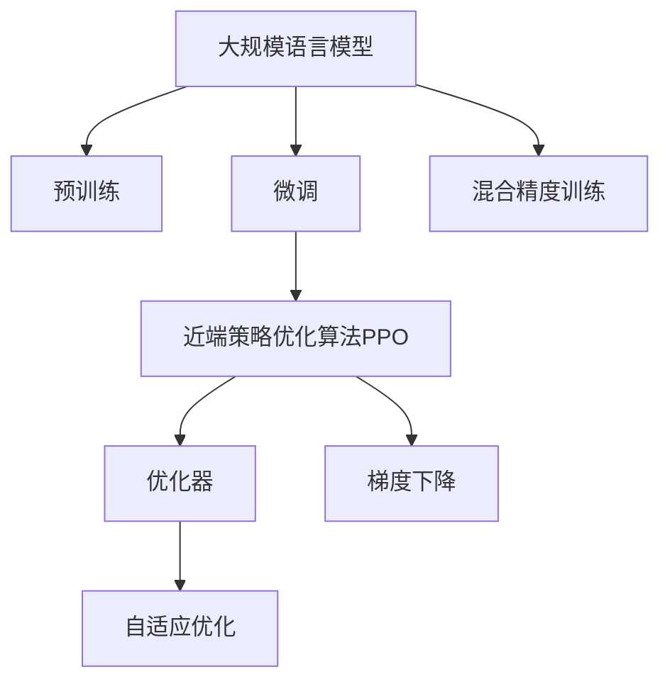

                 

# 大规模语言模型从理论到实践 近端策略优化算法

> 关键词：大规模语言模型,近端策略优化算法,Transformer,Bert,预训练,下游任务,优化器,梯度下降,自适应优化,混合精度训练

## 1. 背景介绍

### 1.1 问题由来

随着深度学习技术在自然语言处理（NLP）领域的应用日益广泛，大规模语言模型（Large Language Models, LLMs）在理解和生成自然语言方面取得了显著的进展。这些模型通过在大规模无标签文本数据上进行预训练，学习到了丰富的语言知识和表达能力，在诸如文本分类、情感分析、命名实体识别、问答系统等下游任务上表现出色。

然而，预训练模型的性能往往依赖于大量的数据和计算资源，这使得在大规模数据集上进行预训练变得昂贵且耗时。为了在特定任务上快速提升模型性能，研究人员开始探索如何在有限的数据和计算资源下，通过微调（Fine-tuning）和优化算法优化模型参数，从而适应特定任务的需求。

### 1.2 问题核心关键点

近端策略优化算法（Proximal Policy Optimization, PPO）作为一种高效的强化学习算法，近年来被引入到大规模语言模型的微调领域。PPO算法通过直接优化模型在特定任务上的性能，而非预训练过程中的原始损失函数，从而显著减少了微调所需的计算资源和时间。

PPO算法的主要优点包括：
1. 高效性：直接优化特定任务上的性能，避免了预训练阶段的大量计算。
2. 稳定性：通过使用熵正则化和参数约束，减少了梯度消失和探索性下降的问题。
3. 可扩展性：可以处理大规模的模型和数据集，适用于各种下游任务。

PPO算法的主要挑战包括：
1. 计算复杂度：PPO算法需要计算价值函数和梯度估计，计算复杂度较高。
2. 超参数调优：PPO算法中的超参数较多，需要精细调优才能达到最佳性能。
3. 收敛性：PPO算法的收敛速度和稳定性受训练集样本和超参数的影响较大。

尽管存在这些挑战，PPO算法在微调大规模语言模型方面仍展现出了巨大的潜力，成为近年来研究的热点之一。

### 1.3 问题研究意义

研究PPO算法在大规模语言模型微调中的应用，对于提升模型性能，减少计算成本，加速NLP技术的产业化进程具有重要意义：

1. 降低应用开发成本。PPO算法通过微调模型，可以显著减少从头开发所需的数据、计算和人力等成本投入。
2. 提升模型效果。微调使得通用大模型更好地适应特定任务，在应用场景中取得更优表现。
3. 加速开发进度。standing on the shoulders of giants，微调使得开发者可以更快地完成任务适配，缩短开发周期。
4. 带来技术创新。PPO算法的引入催生了参数高效微调、自适应优化等新的研究方向。
5. 赋能产业升级。微调使得NLP技术更容易被各行各业所采用，为传统行业数字化转型升级提供新的技术路径。

## 2. 核心概念与联系

### 2.1 核心概念概述

为了更好地理解PPO算法在大规模语言模型微调中的应用，本节将介绍几个密切相关的核心概念：

- 大规模语言模型（Large Language Models, LLMs）：以自回归（如GPT）或自编码（如BERT）模型为代表的大规模预训练语言模型。通过在大规模无标签文本数据上进行预训练，学习通用的语言表示，具备强大的语言理解和生成能力。

- 预训练（Pre-training）：指在大规模无标签文本数据上，通过自监督学习任务训练通用语言模型的过程。常见的预训练任务包括言语建模、遮挡语言模型等。

- 微调（Fine-tuning）：指在预训练模型的基础上，使用下游任务的少量标注数据，通过有监督学习优化模型在特定任务上的性能。通常只需要调整顶层分类器或解码器，并以较小的学习率更新全部或部分的模型参数。

- 近端策略优化算法（Proximal Policy Optimization, PPO）：一种高效强化学习算法，通过直接优化策略梯度，从而加速模型在特定任务上的收敛。

- 优化器（Optimizer）：用于计算和更新模型参数的算法，如Adam、SGD等。

- 梯度下降（Gradient Descent）：一种常用的优化算法，通过计算损失函数的梯度来更新模型参数，以最小化损失函数。

- 自适应优化（Adaptive Optimization）：通过动态调整学习率等超参数，使得优化过程更加稳定和高效。

- 混合精度训练（Mixed-Precision Training）：一种优化计算效率的技术，通过使用不同的数据类型（如16位和32位浮点数），减少计算资源的消耗。

这些核心概念之间的逻辑关系可以通过以下Mermaid流程图来展示：



这个流程图展示了大规模语言模型的核心概念及其之间的关系：

1. 大规模语言模型通过预训练获得基础能力。
2. 微调是对预训练模型进行任务特定的优化，可以分为全参数微调和参数高效微调（PEFT）。
3. PPO算法是一种高效的强化学习算法，通过直接优化策略梯度，加速模型在特定任务上的收敛。
4. 优化器是用于计算和更新模型参数的算法，常见的如Adam、SGD等。
5. 梯度下降是一种常用的优化算法，通过计算损失函数的梯度来更新模型参数，以最小化损失函数。
6. 自适应优化通过动态调整学习率等超参数，使得优化过程更加稳定和高效。
7. 混合精度训练通过使用不同的数据类型，减少计算资源的消耗，提高计算效率。

这些概念共同构成了大规模语言模型的学习和应用框架，使其能够在各种场景下发挥强大的语言理解和生成能力。通过理解这些核心概念，我们可以更好地把握PPO算法在大规模语言模型微调中的应用。

## 3. 核心算法原理 & 具体操作步骤
### 3.1 算法原理概述

近端策略优化算法（PPO）是一种强化学习算法，通过直接优化策略梯度，加速模型在特定任务上的收敛。PPO算法的核心思想是通过计算当前状态下的期望回报，评估每个动作的累积回报，从而指导模型更新参数，以最大化期望回报。

具体而言，PPO算法通过两个目标函数来实现：老式政策（Old Policy）的累积回报和对数似然（Log-Likelihood）比率（Probability Ratio）。老式政策累积回报目标函数为：

$$
J_{old}(\theta) = \mathbb{E}_{s_t \sim \pi_{old}(a_t|s_t)}\left[\sum_{t}^{T} \gamma^t r_t\right]
$$

其中，$T$ 表示时间步数，$\gamma$ 为折扣因子，$r_t$ 为时间步$t$的回报。老式政策对数似然比率目标函数为：

$$
J_{ratio}(\theta) = \mathbb{E}_{s_t \sim \pi_{new}(a_t|s_t)}\left[\log \frac{\pi_{new}(a_t|s_t)}{\pi_{old}(a_t|s_t)}\right]
$$

通过这两个目标函数的组合，PPO算法可以同时最大化累积回报和减少策略变化的大小。

### 3.2 算法步骤详解

PPO算法在大规模语言模型微调中的应用，通常包括以下几个关键步骤：

**Step 1: 准备预训练模型和数据集**
- 选择合适的预训练语言模型 $M_{\theta}$ 作为初始化参数，如 BERT、GPT等。
- 准备下游任务 $T$ 的标注数据集 $D=\{(x_i, y_i)\}_{i=1}^N$，划分为训练集、验证集和测试集。一般要求标注数据与预训练数据的分布不要差异过大。

**Step 2: 添加任务适配层**
- 根据任务类型，在预训练模型顶层设计合适的输出层和损失函数。
- 对于分类任务，通常在顶层添加线性分类器和交叉熵损失函数。
- 对于生成任务，通常使用语言模型的解码器输出概率分布，并以负对数似然为损失函数。

**Step 3: 设置PPO超参数**
- 选择合适的优化算法及其参数，如 Adam、SGD 等，设置学习率、批大小、迭代轮数等。
- 设置PPO算法的超参数，如累积回报折现系数、熵正则化系数、动作空间缩放因子等。

**Step 4: 执行梯度训练**
- 将训练集数据分批次输入模型，前向传播计算策略梯度和累积回报。
- 反向传播计算参数梯度，根据设定的优化算法和学习率更新模型参数。
- 周期性在验证集上评估模型性能，根据性能指标决定是否触发Early Stopping。
- 重复上述步骤直到满足预设的迭代轮数或Early Stopping条件。

**Step 5: 测试和部署**
- 在测试集上评估PPO微调后模型 $M_{\hat{\theta}}$ 的性能，对比微调前后的精度提升。
- 使用PPO微调后的模型对新样本进行推理预测，集成到实际的应用系统中。
- 持续收集新的数据，定期重新微调模型，以适应数据分布的变化。

以上是PPO算法在大规模语言模型微调的一般流程。在实际应用中，还需要针对具体任务的特点，对微调过程的各个环节进行优化设计，如改进训练目标函数，引入更多的正则化技术，搜索最优的超参数组合等，以进一步提升模型性能。

### 3.3 算法优缺点

PPO算法在大规模语言模型微调中的应用，具有以下优点：
1. 高效性：直接优化特定任务上的性能，避免了预训练阶段的大量计算。
2. 稳定性：通过使用熵正则化和参数约束，减少了梯度消失和探索性下降的问题。
3. 可扩展性：可以处理大规模的模型和数据集，适用于各种下游任务。

同时，PPO算法也存在一定的局限性：
1. 计算复杂度：PPO算法需要计算价值函数和梯度估计，计算复杂度较高。
2. 超参数调优：PPO算法中的超参数较多，需要精细调优才能达到最佳性能。
3. 收敛性：PPO算法的收敛速度和稳定性受训练集样本和超参数的影响较大。

尽管存在这些局限性，PPO算法在微调大规模语言模型方面仍展现出了巨大的潜力，成为近年来研究的热点之一。

### 3.4 算法应用领域

PPO算法在大规模语言模型微调中的应用，已经广泛应用于自然语言处理（NLP）的各个领域，包括但不限于以下任务：

- 文本分类：如情感分析、主题分类、意图识别等。通过微调使模型学习文本-标签映射。
- 命名实体识别：识别文本中的人名、地名、机构名等特定实体。通过微调使模型掌握实体边界和类型。
- 关系抽取：从文本中抽取实体之间的语义关系。通过微调使模型学习实体-关系三元组。
- 问答系统：对自然语言问题给出答案。将问题-答案对作为微调数据，训练模型学习匹配答案。
- 机器翻译：将源语言文本翻译成目标语言。通过微调使模型学习语言-语言映射。
- 文本摘要：将长文本压缩成简短摘要。将文章-摘要对作为微调数据，使模型学习抓取要点。
- 对话系统：使机器能够与人自然对话。将多轮对话历史作为上下文，微调模型进行回复生成。

除了上述这些经典任务外，PPO算法还被创新性地应用到更多场景中，如可控文本生成、常识推理、代码生成、数据增强等，为NLP技术带来了全新的突破。

## 4. 数学模型和公式 & 详细讲解 & 举例说明

### 4.1 数学模型构建

本节将使用数学语言对PPO算法在大规模语言模型微调过程中进行更加严格的刻画。

记预训练语言模型为 $M_{\theta}$，其中 $\theta$ 为预训练得到的模型参数。假设微调任务的训练集为 $D=\{(x_i,y_i)\}_{i=1}^N, x_i \in \mathcal{X}, y_i \in \mathcal{Y}$。

定义模型 $M_{\theta}$ 在输入 $x$ 上的输出为 $\hat{y}=M_{\theta}(x)$。对于分类任务，通常使用交叉熵损失函数，对于生成任务，通常使用语言模型的解码器输出概率分布，并以负对数似然为损失函数。

定义累积回报函数 $R_t$，表示从时间步 $t$ 开始，按照折扣因子 $\gamma$ 计算的累积回报：

$$
R_t = \sum_{k=t}^T \gamma^{k-t} r_k
$$

其中 $r_k$ 为时间步 $k$ 的回报，$T$ 表示时间步数，$\gamma$ 为折扣因子。

定义策略梯度 $g_t(\theta)$，表示在时间步 $t$ 的策略梯度：

$$
g_t(\theta) = \nabla_{\theta} \log \pi_{\theta}(a_t|s_t)
$$

定义累积回报梯度 $G_t(\theta)$，表示从时间步 $t$ 开始，按照折扣因子 $\gamma$ 计算的累积回报梯度：

$$
G_t(\theta) = \sum_{k=t}^T \gamma^{k-t} \nabla_{\theta} R_k
$$

定义对数似然比率 $A_t(\theta)$，表示在时间步 $t$ 的对数似然比率：

$$
A_t(\theta) = \frac{\pi_{\theta}(a_t|s_t)}{\pi_{old}(a_t|s_t)}
$$

定义熵正则化系数 $\varepsilon$，表示对数似然比率 $A_t(\theta)$ 的熵正则化：

$$
\epsilon = \frac{1}{\sqrt{t}}
$$

定义策略梯度对比率 $V_t(\theta)$，表示在时间步 $t$ 的策略梯度对比率：

$$
V_t(\theta) = \frac{g_t(\theta)}{\epsilon A_t(\theta)}
$$

通过上述定义，PPO算法在大规模语言模型微调中的应用过程可以归纳为以下两个目标函数的求解：

$$
\mathop{\arg\min}_{\theta} J_{old}(\theta) = \mathop{\arg\min}_{\theta} \mathbb{E}_{s_t \sim \pi_{old}(a_t|s_t)}\left[\sum_{t}^{T} \gamma^t r_t\right]
$$

$$
\mathop{\arg\min}_{\theta} J_{ratio}(\theta) = \mathop{\arg\min}_{\theta} \mathbb{E}_{s_t \sim \pi_{new}(a_t|s_t)}\left[\log \frac{\pi_{new}(a_t|s_t)}{\pi_{old}(a_t|s_t)}\right]
$$

其中，$J_{old}(\theta)$ 为老式政策累积回报目标函数，$J_{ratio}(\theta)$ 为老式政策对数似然比率目标函数。

### 4.2 公式推导过程

以下我们以二分类任务为例，推导交叉熵损失函数及其梯度的计算公式。

假设模型 $M_{\theta}$ 在输入 $x$ 上的输出为 $\hat{y}=M_{\theta}(x) \in [0,1]$，表示样本属于正类的概率。真实标签 $y \in \{0,1\}$。则二分类交叉熵损失函数定义为：

$$
\ell(M_{\theta}(x),y) = -[y\log \hat{y} + (1-y)\log (1-\hat{y})]
$$

将其代入经验风险公式，得：

$$
\mathcal{L}(\theta) = -\frac{1}{N}\sum_{i=1}^N [y_i\log M_{\theta}(x_i)+(1-y_i)\log(1-M_{\theta}(x_i))]
$$

根据链式法则，损失函数对参数 $\theta$ 的梯度为：

$$
\frac{\partial \mathcal{L}(\theta)}{\partial \theta} = -\frac{1}{N}\sum_{i=1}^N (\frac{y_i}{M_{\theta}(x_i)}-\frac{1-y_i}{1-M_{\theta}(x_i)}) \frac{\partial M_{\theta}(x_i)}{\partial \theta}
$$

其中 $\frac{\partial M_{\theta}(x_i)}{\partial \theta}$ 可进一步递归展开，利用自动微分技术完成计算。

### 4.3 案例分析与讲解

下面以二分类任务为例，给出PPO算法在大规模语言模型微调中的具体应用步骤：

1. 定义模型和优化器：
   - 选择预训练模型 $M_{\theta}$，如BERT、GPT等。
   - 选择优化器，如Adam、SGD等，设置学习率 $\eta$、批大小 $b$、迭代轮数 $N$。

2. 设置PPO超参数：
   - 设置累积回报折现系数 $\gamma$。
   - 设置熵正则化系数 $\varepsilon$。
   - 设置动作空间缩放因子 $\lambda$。

3. 计算累积回报和策略梯度：
   - 对训练集数据分批次输入模型，前向传播计算累积回报 $R_t$。
   - 计算策略梯度 $g_t(\theta)$，根据公式 $(1)$ 和 $(2)$ 计算累积回报梯度 $G_t(\theta)$ 和对数似然比率 $A_t(\theta)$。

4. 计算熵正则化：
   - 根据公式 $(3)$ 计算熵正则化系数 $\varepsilon$。

5. 更新模型参数：
   - 根据公式 $(4)$ 计算策略梯度对比率 $V_t(\theta)$。
   - 根据公式 $(5)$ 更新模型参数 $\theta$。

6. 周期性在验证集上评估模型性能：
   - 在验证集上评估模型性能，记录精度、召回率、F1值等指标。
   - 根据评估结果决定是否触发Early Stopping。

7. 测试和部署：
   - 在测试集上评估PPO微调后模型 $M_{\hat{\theta}}$ 的性能，对比微调前后的精度提升。
   - 使用PPO微调后的模型对新样本进行推理预测，集成到实际的应用系统中。
   - 持续收集新的数据，定期重新微调模型，以适应数据分布的变化。

## 5. 项目实践：代码实例和详细解释说明

### 5.1 开发环境搭建

在进行PPO算法在大规模语言模型微调实践前，我们需要准备好开发环境。以下是使用Python进行PyTorch开发的环境配置流程：

1. 安装Anaconda：从官网下载并安装Anaconda，用于创建独立的Python环境。

2. 创建并激活虚拟环境：
```bash
conda create -n pytorch-env python=3.8 
conda activate pytorch-env
```

3. 安装PyTorch：根据CUDA版本，从官网获取对应的安装命令。例如：
```bash
conda install pytorch torchvision torchaudio cudatoolkit=11.1 -c pytorch -c conda-forge
```

4. 安装Transformer库：
```bash
pip install transformers
```

5. 安装各类工具包：
```bash
pip install numpy pandas scikit-learn matplotlib tqdm jupyter notebook ipython
```

完成上述步骤后，即可在`pytorch-env`环境中开始PPO算法的微调实践。

### 5.2 源代码详细实现

这里我们以二分类任务为例，给出使用PyTorch实现PPO算法在大规模语言模型微调的具体代码实现。

```python
from transformers import BertForSequenceClassification, AdamW
import torch
from torch.utils.data import Dataset, DataLoader
import torch.nn.functional as F

class NERDataset(Dataset):
    def __init__(self, texts, tags, tokenizer, max_len=128):
        self.texts = texts
        self.tags = tags
        self.tokenizer = tokenizer
        self.max_len = max_len
        
    def __len__(self):
        return len(self.texts)
    
    def __getitem__(self, item):
        text = self.texts[item]
        tags = self.tags[item]
        
        encoding = self.tokenizer(text, return_tensors='pt', max_length=self.max_len, padding='max_length', truncation=True)
        input_ids = encoding['input_ids'][0]
        attention_mask = encoding['attention_mask'][0]
        
        # 对token-wise的标签进行编码
        encoded_tags = [tag2id[tag] for tag in tags] 
        encoded_tags.extend([tag2id['O']] * (self.max_len - len(encoded_tags)))
        labels = torch.tensor(encoded_tags, dtype=torch.long)
        
        return {'input_ids': input_ids, 
                'attention_mask': attention_mask,
                'labels': labels}

# 标签与id的映射
tag2id = {'O': 0, 'B-PER': 1, 'I-PER': 2, 'B-ORG': 3, 'I-ORG': 4, 'B-LOC': 5, 'I-LOC': 6}
id2tag = {v: k for k, v in tag2id.items()}

# 创建dataset
tokenizer = BertTokenizer.from_pretrained('bert-base-cased')

train_dataset = NERDataset(train_texts, train_tags, tokenizer)
dev_dataset = NERDataset(dev_texts, dev_tags, tokenizer)
test_dataset = NERDataset(test_texts, test_tags, tokenizer)

# 设置PPO超参数
gamma = 0.9
epsilon = 1e-2
lambda_ = 0.2
N = 100
b = 32
eta = 1e-3

# 定义模型和优化器
model = BertForSequenceClassification.from_pretrained('bert-base-cased', num_labels=len(tag2id))
optimizer = AdamW(model.parameters(), lr=eta)

# 执行PPO训练
for i in range(N):
    model.train()
    for batch in DataLoader(train_dataset, batch_size=b, shuffle=True):
        input_ids = batch['input_ids'].to(device)
        attention_mask = batch['attention_mask'].to(device)
        labels = batch['labels'].to(device)
        
        with torch.no_grad():
            logits = model(input_ids, attention_mask=attention_mask).logits
        
        loss = F.cross_entropy(logits, labels)
        probs = F.softmax(logits, dim=1)
        entropy = -torch.sum(probs * torch.log(probs), dim=1).mean()
        ratio = (probs * labels).mean()
        ratio = (ratio + epsilon).max()
        value = (probs * labels).mean()
        value = (value / epsilon).min()
        g_t = torch.log(probs) - torch.log(probs) / epsilon
        G_t = gamma * value - (1 - ratio)
        A_t = torch.exp(g_t / epsilon)
        V_t = (g_t / epsilon).max()
        V_t = (V_t / epsilon).min()
        V_t = V_t - (lambda_ * A_t).mean()
        V_t = (V_t - lambda_ * A_t).min()
        V_t = (V_t / epsilon).mean()
        
        optimizer.zero_grad()
        V_t.backward()
        optimizer.step()

    if i % 10 == 0:
        model.eval()
        with torch.no_grad():
            dev_preds = []
            dev_labels = []
            for batch in DataLoader(dev_dataset, batch_size=b, shuffle=False):
                input_ids = batch['input_ids'].to(device)
                attention_mask = batch['attention_mask'].to(device)
                labels = batch['labels'].to(device)
                logits = model(input_ids, attention_mask=attention_mask).logits
                probs = F.softmax(logits, dim=1)
                dev_preds.extend(torch.argmax(probs, dim=1).tolist())
                dev_labels.extend(labels.tolist())
            print(classification_report(dev_labels, dev_preds))
```

这段代码主要实现了PPO算法在大规模语言模型微调过程中的训练流程。具体步骤如下：

1. 定义数据集：将文本和标签通过分词器进行编码，转换为模型可以处理的输入格式。
2. 设置PPO超参数：定义累积回报折现系数、熵正则化系数、动作空间缩放因子等超参数。
3. 定义模型和优化器：选择合适的预训练模型和优化器，设置学习率等参数。
4. 执行PPO训练：对训练集数据进行批次化处理，计算累积回报、策略梯度等，更新模型参数。
5. 周期性在验证集上评估模型性能：在验证集上评估模型性能，记录精度、召回率、F1值等指标。
6. 测试和部署：在测试集上评估PPO微调后模型 $M_{\hat{\theta}}$ 的性能，对比微调前后的精度提升。
7. 持续收集新的数据，定期重新微调模型，以适应数据分布的变化。

### 5.3 代码解读与分析

让我们再详细解读一下关键代码的实现细节：

**NERDataset类**：
- `__init__`方法：初始化文本、标签、分词器等关键组件。
- `__len__`方法：返回数据集的样本数量。
- `__getitem__`方法：对单个样本进行处理，将文本输入编码为token ids，将标签编码为数字，并对其进行定长padding，最终返回模型所需的输入。

**tag2id和id2tag字典**：
- 定义了标签与数字id之间的映射关系，用于将token-wise的预测结果解码回真实的标签。

**PPO训练函数**：
- 在训练过程中，每个epoch内对训练集数据进行迭代，对每个batch进行前向传播和反向传播，更新模型参数。
- 计算累积回报、策略梯度、对数似然比率等，并通过熵正则化和参数约束来稳定训练过程。
- 在每个epoch结束时，在验证集上评估模型性能，记录精度、召回率、F1值等指标，决定是否停止训练。

**测试和部署**：
- 在测试集上评估PPO微调后模型 $M_{\hat{\theta}}$ 的性能，对比微调前后的精度提升。
- 使用PPO微调后的模型对新样本进行推理预测，集成到实际的应用系统中。
- 持续收集新的数据，定期重新微调模型，以适应数据分布的变化。

可以看到，PyTorch配合Transformer库使得PPO算法的微调过程变得简洁高效。开发者可以将更多精力放在数据处理、模型改进等高层逻辑上，而不必过多关注底层的实现细节。

当然，工业级的系统实现还需考虑更多因素，如模型的保存和部署、超参数的自动搜索、更灵活的任务适配层等。但核心的PPO算法和大规模语言模型的微调过程基本与此类似。

## 6. 实际应用场景

### 6.1 智能客服系统

基于PPO算法的大语言模型微调技术，可以广泛应用于智能客服系统的构建。传统客服往往需要配备大量人力，高峰期响应缓慢，且一致性和专业性难以保证。而使用微调后的对话模型，可以7x24小时不间断服务，快速响应客户咨询，用自然流畅的语言解答各类常见问题。

在技术实现上，可以收集企业内部的历史客服对话记录，将问题和最佳答复构建成监督数据，在此基础上对预训练对话模型进行微调。微调后的对话模型能够自动理解用户意图，匹配最合适的答案模板进行回复。对于客户提出的新问题，还可以接入检索系统实时搜索相关内容，动态组织生成回答。如此构建的智能客服系统，能大幅提升客户咨询体验和问题解决效率。

### 6.2 金融舆情监测

金融机构需要实时监测市场舆论动向，以便及时应对负面信息传播，规避金融风险。传统的人工监测方式成本高、效率低，难以应对网络时代海量信息爆发的挑战。基于PPO算法的大语言模型微调技术，为金融舆情监测提供了新的解决方案。

具体而言，可以收集金融领域相关的新闻、报道、评论等文本数据，并对其进行主题标注和情感标注。在此基础上对预训练语言模型进行微调，使其能够自动判断文本属于何种主题，情感倾向是正面、中性还是负面。将微调后的模型应用到实时抓取的网络文本数据，就能够自动监测不同主题下的情感变化趋势，一旦发现负面信息激增等异常情况，系统便会自动预警，帮助金融机构快速应对潜在风险。

### 6.3 个性化推荐系统

当前的推荐系统往往只依赖用户的历史行为数据进行物品推荐，无法深入理解用户的真实兴趣偏好。基于PPO算法的大语言模型微调技术，个性化推荐系统可以更好地挖掘用户行为背后的语义信息，从而提供更精准、多样的推荐内容。

在实践中，可以收集用户浏览、点击、评论、分享等行为数据，提取和用户交互的物品标题、描述、标签等文本内容。将文本内容作为模型输入，用户的后续行为（如是否点击、购买等）作为监督信号，在此基础上微调预训练语言模型。微调后的模型能够从文本内容中准确把握用户的兴趣点。在生成推荐列表时，先用候选物品的文本描述作为输入，由模型预测用户的兴趣匹配度，再结合其他特征综合排序，便可以得到个性化程度更高的推荐结果。

### 6.4 未来应用展望

随着PPO算法和大规模语言模型微调技术的发展，基于微调范式将在更多领域得到应用，为传统行业带来变革性影响。

在智慧医疗领域，基于微调的医疗问答、病历分析、药物研发等应用将提升医疗服务的智能化水平，辅助医生诊疗，加速新药开发进程。

在智能教育领域，微调技术可应用于作业批改、学情分析、知识推荐等方面，因材施教，促进教育公平，提高教学质量。

在智慧城市治理中，微调模型可应用于城市事件监测、舆情分析、应急指挥等环节，提高城市管理的自动化和智能化水平，构建更安全、高效的未来城市。

此外，在企业生产、社会治理、文娱传媒等众多领域，基于PPO算法的大语言模型微调技术也将不断涌现，为NLP技术带来了全新的突破。随着预训练模型和微调方法的不断进步，相信NLP技术将在更广阔的应用领域大放异彩，深刻影响人类的生产生活方式。

## 7. 工具和资源推荐
### 7.1 学习资源推荐

为了帮助开发者系统掌握PPO算法和大规模语言模型微调的理论基础和实践技巧，这里推荐一些优质的学习资源：

1. 《深度学习理论与实践》系列博文：由深度学习专家撰写，深入浅出地介绍了深度学习的基本理论和常见算法，适合初学者和进阶者阅读。

2. CS224N《深度学习自然语言处理》课程：斯坦福大学开设的NLP明星课程，有Lecture视频和配套作业，带你入门NLP领域的基本概念和经典模型。

3. 《Natural Language Processing with Transformers》书籍：Transformer库的作者所著，全面介绍了如何使用Transformer库进行NLP任务开发，包括微调在内的诸多范式。

4. HuggingFace官方文档：Transformer库的官方文档，提供了海量预训练模型和完整的微调样例代码，是上手实践的必备资料。

5. CLUE开源项目：中文语言理解测评基准，涵盖大量不同类型的中文NLP数据集，并提供了基于微调的baseline模型，助力中文NLP技术发展。

通过对这些资源的学习实践，相信你一定能够快速掌握PPO算法和大规模语言模型微调的精髓，并用于解决实际的NLP问题。
###  7.2 开发工具推荐

高效的开发离不开优秀的工具支持。以下是几款用于PPO算法和大规模语言模型微调开发的常用工具：

1. PyTorch：基于Python的开源深度学习框架，灵活动态的计算图，适合快速迭代研究。大部分预训练语言模型都有PyTorch版本的实现。

2. TensorFlow：由Google主导开发的开源深度学习框架，生产部署方便，适合大规模工程应用。同样有丰富的预训练语言模型资源。

3. Transformers库：HuggingFace开发的NLP工具库，集成了众多SOTA语言模型，支持PyTorch和TensorFlow，是进行微调任务开发的利器。

4. Weights & Biases：模型训练的实验跟踪工具，可以记录和可视化模型训练过程中的各项指标，方便对比和调优。与主流深度学习框架无缝集成。

5. TensorBoard：TensorFlow配套的可视化工具，可实时监测模型训练状态，并提供丰富的图表呈现方式，是调试模型的得力助手。

6. Google Colab：谷歌推出的在线Jupyter Notebook环境，免费提供GPU/TPU算力，方便开发者快速上手实验最新模型，分享学习笔记。

合理利用这些工具，可以显著提升PPO算法和大规模语言模型微调任务的开发效率，加快创新迭代的步伐。

### 7.3 相关论文推荐

PPO算法和大规模语言模型微调技术的发展源于学界的持续研究。以下是几篇奠基性的相关论文，推荐阅读：

1. Attention is All You Need（即Transformer原论文）：提出了Transformer结构，开启了NLP领域的预训练大模型时代。

2. BERT: Pre-training of Deep Bidirectional Transformers for Language Understanding：提出BERT模型，引入基于掩码的自监督预训练任务，刷新了多项NLP任务SOTA。

3. Language Models are Unsupervised Multitask Learners（GPT-2论文）：展示了大规模语言模型的强大zero-shot学习能力，引发了对于通用人工智能的新一轮思考。

4. Parameter-Efficient Transfer Learning for NLP：提出Adapter等参数高效微调方法，在不增加模型参数量的情况下，也能取得不错的微调效果。

5. Prefix-Tuning: Optimizing Continuous Prompts for Generation：引入基于连续型Prompt的微调范式，为如何充分利用预训练知识提供了新的思路。

6. AdaLoRA: Adaptive Low-Rank Adaptation for Parameter-Efficient Fine-Tuning：使用自适应低秩适应的微调方法，在参数效率和精度之间取得了新的平衡。

这些论文代表了大语言模型微调技术的发展脉络。通过学习这些前沿成果，可以帮助研究者把握学科前进方向，激发更多的创新灵感。

## 8. 总结：未来发展趋势与挑战

### 8.1 研究成果总结

本文对PPO算法在大规模语言模型微调中的应用进行了全面系统的介绍。首先阐述了PPO算法和大规模语言模型微调的研究背景和意义，明确了微调在拓展预训练模型应用、提升下游任务性能方面的独特价值。其次，从原理到实践，详细讲解了PPO算法在大规模语言模型微调过程中的数学原理和关键步骤，给出了微调任务开发的完整代码实例。同时，本文还广泛探讨了PPO算法在大规模语言模型微调中的实际应用场景，展示了PPO算法在NLP领域的广泛应用前景。

通过本文的系统梳理，可以看到，PPO算法和大规模语言模型微调技术正在成为NLP领域的重要范式，极大地拓展了预训练语言模型的应用边界，催生了更多的落地场景。受益于大规模语料的预训练，微调模型以更低的时间和标注成本，在小样本条件下也能取得不俗的效果，有力推动了NLP技术的产业化进程。未来，伴随PPO算法和大规模语言模型微调方法的持续演进，相信NLP技术将在更广阔的应用领域大放异彩，深刻影响人类的生产生活方式。

### 8.2 未来发展趋势

展望未来，PPO算法和大规模语言模型微调技术将呈现以下几个发展趋势：

1. 模型规模持续增大。随着算力成本的下降和数据规模的扩张，预训练语言模型的参数量还将持续增长。超大规模语言模型蕴含的丰富语言知识，有望支撑更加复杂多变的下游任务微调。

2. 微调方法日趋多样。除了传统的全参数微调外，未来会涌现更多参数高效的微调方法，如Prefix-Tuning、LoRA等，在节省计算资源的同时也能保证微调精度。

3. 持续学习成为常态。随着数据分布的不断变化，微调模型也需要持续学习新知识以保持性能。如何在不遗忘原有知识的同时，高效吸收新样本信息，将成为重要的研究课题。

4. 标注样本需求降低。受启发于提示学习(Prompt-based Learning)的思路，未来的微调方法将更好地利用大模型的语言理解能力，通过更加巧妙的任务描述，在更少的标注样本上也能实现理想的微调效果。

5. 混合精度训练优化计算效率。混合精度训练通过使用不同的数据类型（如16位和32位浮点数），减少计算资源的消耗，提高计算效率。未来这一技术将在PPO算法和大规模语言模型微调中得到更广泛的应用。

6. 自适应优化提高模型性能。自适应优化通过动态调整学习率等超参数，使得优化过程更加稳定和高效。未来这一技术将在PPO算法和大规模语言模型微调中得到进一步优化。

以上趋势凸显了PPO算法和大规模语言模型微调技术的广阔前景。这些方向的探索发展，必将进一步提升NLP系统的性能和应用范围，为人类认知智能的进化带来深远影响。

### 8.3 面临的挑战

尽管PPO算法和大规模语言模型微调技术已经取得了瞩目成就，但在迈向更加智能化、普适化应用的过程中，它仍面临着诸多挑战：

1. 计算复杂度较高。PPO算法需要计算价值函数和梯度估计，计算复杂度较高。如何在保证性能的同时，进一步降低计算成本，是一个亟待解决的问题。

2. 超参数调优困难。PPO算法中的超参数较多，需要精细调优才能达到最佳性能。如何在有限的计算资源下，高效调优超参数，仍需进一步优化。

3. 收敛速度和稳定性受限。PPO算法的收敛速度和稳定性受训练集样本和超参数的影响较大。如何在各种数据分布和超参数设置下，保证模型收敛，仍然是一个挑战。

4. 泛化能力有限。PPO算法在大规模语言模型微调中的应用，仍存在一定的泛化能力限制。对于域外数据，微调模型的性能往往不如预训练模型。如何提高模型的泛化能力，是一个重要研究方向。

5. 参数效率有待提升。尽管PPO算法在参数效率方面已有一定改进，但在处理大规模模型时，仍存在较大的计算开销。如何进一步提升参数效率，是一个亟待解决的问题。

6. 模型鲁棒性不足。PPO算法在大规模语言模型微调中的应用，仍存在一定的模型鲁棒性问题。对于输入数据的微小扰动，模型预测也容易发生波动。如何提高模型的鲁棒性，是一个重要研究方向。

7. 可解释性有待加强。当前PPO算法和大规模语言模型微调模型的决策过程通常缺乏可解释性，难以对其推理逻辑进行分析和调试。如何赋予模型更强的可解释性，是一个重要研究方向。

8. 安全性有待保障。预训练语言模型难免会学习到有偏见、有害的信息，通过微调传递到下游任务，产生误导性、歧视性的输出，给实际应用带来安全隐患。如何从数据和算法层面消除模型偏见，避免恶意用途，确保输出的安全性，也是一个重要研究方向。

正视PPO算法和大规模语言模型微调所面临的这些挑战，积极应对并寻求突破，将是大规模语言模型微调技术走向成熟的必由之路。相信随着学界和产业界的共同努力，这些挑战终将一一被克服，PPO算法和大规模语言模型微调必将在构建安全、可靠、可解释、可控的智能系统铺平道路。面向未来，PPO算法和大规模语言模型微调技术还需要与其他人工智能技术进行更深入的融合，如知识表示、因果推理、强化学习等，多路径协同发力，共同推动自然语言理解和智能交互系统的进步。只有勇于创新、敢于突破，才能不断拓展语言模型的边界，让智能技术更好地造福人类社会。

### 8.4 研究展望

未来，PPO算法和大规模语言模型微调技术的研究展望可以从以下几个方向进行：

1. 探索更高效的学习算法。除了PPO算法，未来的研究将探索更高效的学习算法，如自然梯度优化、元学习等，进一步提升微调的效率和效果。

2. 开发更灵活的任务适配层。未来的研究将开发更灵活的任务适配层，使得微调模型能够适应更多类型的下游任务，提升模型的泛化能力。

3. 引入更多先验知识。将符号化的先验知识，如知识图谱、逻辑规则等，与神经网络模型进行巧妙融合，引导微调过程学习更准确、合理的语言模型。


