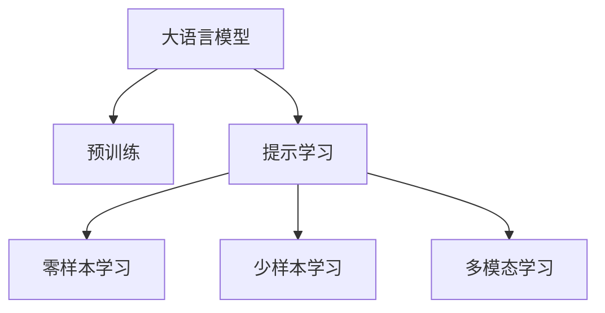

                 

# 大语言模型原理与工程实践：思维树提示

> 关键词：大语言模型,提示学习,Prompt Learning,思维树,预训练,语言模型,深度学习,自然语言处理(NLP),算法优化

## 1. 背景介绍

### 1.1 问题由来
近年来，随着深度学习技术和大规模预训练语言模型(LLMs)的快速发展，大语言模型在自然语言处理(NLP)领域取得了显著进步。以BERT、GPT-3、T5为代表的大语言模型通过在海量无标签文本数据上进行预训练，学习到丰富的语言知识，具备强大的语言理解和生成能力。然而，这些模型在实际应用中仍存在一些局限性，如模型复杂度高、计算成本大、对特定任务理解不足等。

提示学习(Prompt Learning)作为一种新兴的大语言模型微调方法，通过精心的输入设计，引导模型输出期望的结果，有效弥补了上述问题。它不仅能够在不修改模型结构的情况下，提升模型在特定任务上的表现，还能大大降低微调所需的计算和标注成本，是当前NLP领域的热点研究方向之一。

### 1.2 问题核心关键点
提示学习的主要思路是通过构造合适的输入模板，在预训练模型的基础上，提高其在特定任务上的推理能力和生成能力。输入模板通常包含任务描述、示例数据等信息，能够提示模型按照预期方式进行推理和生成，减少微调过程中对模型结构、参数的改动。

提示学习的关键在于选择合适的输入模板。合适的模板可以大幅提升模型的性能，而不恰当的模板则可能导致模型性能下降。目前，研究者已经探索出多种模板设计方法，如传统模板、基于逻辑推理的模板、基于自然语言推理的模板等。

提示学习的效果很大程度上取决于提示模板的设计。一个良好的提示模板应该具备以下特性：
1. 简洁明了：避免冗长复杂的模板，以免影响模型理解。
2. 明确性高：模板应清晰表达任务需求，使模型易于识别。
3. 针对性：针对具体任务设计模板，以提高生成或推理的准确性。
4. 多样性：模板应多样化，适应不同输入形式和任务需求。
5. 鲁棒性：模板应对不同背景知识、数据分布具有一定适应性，避免过拟合。

这些特性共同决定了提示学习的实际效果和应用范围，是当前研究的热点方向。

### 1.3 问题研究意义
提示学习作为大语言模型微调的重要手段，对于提升模型的泛化能力、降低微调成本、提高模型推理和生成质量具有重要意义：

1. 提升模型泛化能力：提示学习能够在不修改模型结构的情况下，提高模型对特定任务的推理和生成能力，提升模型的泛化能力。
2. 降低微调成本：提示学习主要依赖输入模板，无需修改模型结构或调整大量参数，极大降低了微调所需的计算和标注成本。
3. 提高模型质量：提示学习通过精心设计的输入模板，引导模型输出高质量的结果，提高模型的推理和生成准确性。
4. 加速模型开发：提示学习能够快速构建针对特定任务的模型，缩短模型的开发周期，提高开发效率。
5. 推动技术创新：提示学习为自然语言处理领域带来新的研究方向，如语言生成、逻辑推理、自然语言推理等，促进技术创新和突破。

提示学习作为大语言模型微调的重要范式，对于加速NLP技术的产业化进程，提升模型的应用效果具有重要意义。

## 2. 核心概念与联系

### 2.1 核心概念概述

为更好地理解提示学习的核心原理，本节将介绍几个关键概念及其相互联系：

- 大语言模型(Large Language Model, LLM)：以BERT、GPT-3、T5等模型为代表的大规模预训练语言模型。通过在海量无标签文本数据上进行预训练，学习到丰富的语言知识和常识，具备强大的语言理解和生成能力。

- 预训练(Pre-training)：指在大规模无标签文本语料上，通过自监督学习任务训练通用语言模型的过程。常见的预训练任务包括掩码语言模型、next sentence prediction等。

- 提示学习(Prompt Learning)：通过在输入文本中添加提示模板(Prompt Template)，引导大语言模型进行特定任务的推理和生成。可以在不更新模型参数的情况下，实现零样本或少样本学习。

- 输入模板(Prompt Template)：输入模板是一段文本，通常包含任务描述、示例数据等信息，能够提示模型按照预期方式进行推理和生成。

- 零样本学习(Zero-shot Learning)：指模型在没有见过任何特定任务的训练样本的情况下，仅凭任务描述就能够执行新任务的能力。

- 少样本学习(Few-shot Learning)：指在只有少量标注样本的情况下，模型能够快速适应新任务的学习方法。在大语言模型中，通常通过在输入中提供少量示例来实现，无需更新模型参数。

- 多模态学习(Multimodal Learning)：指将视觉、听觉等多模态信息与文本信息结合，进行协同建模。提示学习可以拓展到多模态数据，提升模型的理解和生成能力。

这些核心概念之间的逻辑关系可以通过以下Mermaid流程图来展示：



这个流程图展示了提示学习的核心概念及其相互关系：

1. 大语言模型通过预训练获得基础能力。
2. 提示学习利用预训练模型，通过输入模板引导模型进行特定任务推理和生成。
3. 提示学习能够实现零样本或少样本学习，提升模型泛化能力。
4. 提示学习可以拓展到多模态数据，提升模型的理解和生成能力。

## 3. 核心算法原理 & 具体操作步骤
### 3.1 算法原理概述

提示学习的核心思想是通过构造合适的输入模板，在预训练模型的基础上，提高其在特定任务上的推理能力和生成能力。其基本原理可以概括为以下几个步骤：

1. 设计提示模板：根据具体任务，设计简洁明了、针对性强的输入模板。
2. 加载预训练模型：从预训练语言模型库中加载模型，可以是BERT、GPT等。
3. 输入模板与模型融合：将输入模板与预训练模型融合，进行推理或生成。
4. 调整模型参数：根据任务需求，调整模型的某些参数，如调整语言模型权重、调整分类器权重等。
5. 模型评估与优化：在验证集或测试集上评估模型性能，根据评估结果调整模型参数，优化模型性能。

提示学习的优点包括：
1. 计算成本低：无需修改模型结构或调整大量参数，计算成本较低。
2. 灵活性高：输入模板可以根据任务需求灵活设计，适应不同任务和数据分布。
3. 模型泛化能力强：通过输入模板，模型能够适应不同任务和数据分布，提升模型的泛化能力。
4. 易于调试和优化：由于无需修改模型结构，提示学习易于调试和优化，调整输入模板即可提升模型性能。

### 3.2 算法步骤详解

以下我们将详细讲解提示学习的算法步骤：

**Step 1: 设计提示模板**

提示模板的设计是提示学习的关键。一个好的提示模板应该简洁明了，能够明确表达任务需求，避免冗长复杂。以下是一些常见的提示模板设计方法：

- **传统模板**：直接描述任务需求，如"给定一个电影评论，判断该评论是正面还是负面"。
- **基于逻辑推理的模板**：通过逻辑推理引导模型进行推理，如"如果前提是'李明明天要去北京'，假设是'李明会带上王小明一起'，推理结果是'王小明也会去北京'"。
- **基于自然语言推理的模板**：通过自然语言推理引导模型进行推理，如"给定一个前提'小明是学生'，给定一个假设'小明会写作业'，推理结果是'前提支持假设'"。

**Step 2: 加载预训练模型**

提示学习的第一步是加载预训练模型。可以从预训练语言模型库中加载模型，如BERT、GPT等。加载模型时需要指定模型路径、模型参数等关键信息。

**Step 3: 输入模板与模型融合**

将提示模板与预训练模型进行融合，进行推理或生成。具体方法包括：

- 对于文本推理任务，将提示模板作为输入，使用预训练语言模型进行推理。
- 对于文本生成任务，将提示模板作为输入，使用预训练语言模型生成文本。
- 对于多模态任务，将提示模板与多模态信息结合，进行协同建模。

**Step 4: 调整模型参数**

根据任务需求，调整模型的某些参数，如调整语言模型权重、调整分类器权重等。调整参数的方法包括：

- 使用梯度下降等优化算法更新模型参数。
- 使用正则化技术，如L2正则、Dropout等，防止过拟合。
- 使用Early Stopping等策略，防止过拟合。

**Step 5: 模型评估与优化**

在验证集或测试集上评估模型性能，根据评估结果调整模型参数，优化模型性能。具体方法包括：

- 使用准确率、精确率、召回率等指标评估模型性能。
- 使用混淆矩阵、ROC曲线等方法分析模型性能。
- 使用交叉验证等方法优化模型参数。

### 3.3 算法优缺点

提示学习作为一种新兴的大语言模型微调方法，具有以下优点和缺点：

**优点：**

1. 计算成本低：无需修改模型结构或调整大量参数，计算成本较低。
2. 灵活性高：输入模板可以根据任务需求灵活设计，适应不同任务和数据分布。
3. 模型泛化能力强：通过输入模板，模型能够适应不同任务和数据分布，提升模型的泛化能力。
4. 易于调试和优化：由于无需修改模型结构，提示学习易于调试和优化，调整输入模板即可提升模型性能。

**缺点：**

1. 依赖提示模板质量：提示模板的设计对提示学习的效果有很大影响，设计不当可能导致模型性能下降。
2. 模型泛化能力受限：虽然提示学习能够提升模型的泛化能力，但仍然受限于提示模板的设计和数据分布。
3. 鲁棒性不足：提示学习容易受到输入噪声、数据分布等因素的影响，需要精心设计和优化提示模板。
4. 可能存在偏见：提示模板设计不当可能导致模型学习到有偏见的信息，影响模型公正性和公平性。

## 4. 数学模型和公式 & 详细讲解  
### 4.1 数学模型构建

提示学习的数学模型构建基于预训练语言模型的框架。以BERT为例，其输入模板为$x$，输出为$y$，预训练语言模型的参数为$\theta$，其推理或生成过程可以表示为：

$$ y = M_{\theta}(x) $$

其中$M_{\theta}(x)$为预训练语言模型，$x$为输入模板，$y$为输出。

### 4.2 公式推导过程

以下我们将详细推导提示学习的基本数学公式。

假设输入模板为$x$，输出为$y$，预训练语言模型的参数为$\theta$，其推理或生成过程可以表示为：

$$ y = M_{\theta}(x) $$

假设$x$为输入模板，$y$为输出，$z$为中间变量，其推理过程可以表示为：

$$ y = M_{\theta}(z) $$

其中$z$为输入模板$x$经过预训练语言模型$M_{\theta}$的计算结果。

假设$x$为输入模板，$y$为输出，$z$为中间变量，其生成过程可以表示为：

$$ y = \hat{y} = M_{\theta}(z) $$

其中$\hat{y}$为生成结果，$z$为输入模板$x$经过预训练语言模型$M_{\theta}$的计算结果。

假设输入模板为$x$，输出为$y$，预训练语言模型的参数为$\theta$，其推理或生成过程可以表示为：

$$ y = M_{\theta}(x) $$

其中$M_{\theta}(x)$为预训练语言模型，$x$为输入模板，$y$为输出。

### 4.3 案例分析与讲解

以下我们将通过一个简单的案例，详细讲解提示学习的基本过程。

**案例：电影评论分类任务**

假设有一个电影评论分类任务，输入为电影评论文本，输出为正面或负面情感分类。

**Step 1: 设计提示模板**

我们可以设计如下提示模板：

```text
给定一个电影评论，请判断该评论是正面还是负面。
```

**Step 2: 加载预训练模型**

我们可以从预训练语言模型库中加载BERT模型，并指定模型路径和参数。

**Step 3: 输入模板与模型融合**

将提示模板作为输入，使用BERT模型进行推理。

```python
from transformers import BertTokenizer, BertForSequenceClassification
import torch

tokenizer = BertTokenizer.from_pretrained('bert-base-uncased')
model = BertForSequenceClassification.from_pretrained('bert-base-uncased', num_labels=2)

input_ids = tokenizer.encode('给定一个电影评论，请判断该评论是正面还是负面。', add_special_tokens=True, return_tensors='pt')
labels = torch.tensor([0])  # 假设负情感为0，正情感为1

output = model(input_ids, labels=labels)
logits = output.logits
probs = torch.softmax(logits, dim=1)
predicted_label = probs.argmax().item()
```

**Step 4: 调整模型参数**

根据任务需求，调整模型的某些参数，如调整语言模型权重、调整分类器权重等。

**Step 5: 模型评估与优化**

在验证集或测试集上评估模型性能，根据评估结果调整模型参数，优化模型性能。

```python
from transformers import accuracy_score

eval_loss = 0
eval_acc = 0
for batch in dataloader:
    input_ids = batch['input_ids']
    attention_mask = batch['attention_mask']
    labels = batch['labels']
    
    outputs = model(input_ids, attention_mask=attention_mask)
    loss = outputs.loss
    logits = outputs.logits
    probs = torch.softmax(logits, dim=1)
    predicted_labels = probs.argmax(dim=1)
    
    eval_loss += loss.item()
    eval_acc += accuracy_score(labels, predicted_labels)
    
print('验证集损失：', eval_loss / len(dataloader))
print('验证集准确率：', eval_acc / len(dataloader))
```

## 5. 项目实践：代码实例和详细解释说明
### 5.1 开发环境搭建

在进行提示学习实践前，我们需要准备好开发环境。以下是使用Python进行PyTorch开发的环境配置流程：

1. 安装Anaconda：从官网下载并安装Anaconda，用于创建独立的Python环境。

2. 创建并激活虚拟环境：
```bash
conda create -n pytorch-env python=3.8 
conda activate pytorch-env
```

3. 安装PyTorch：根据CUDA版本，从官网获取对应的安装命令。例如：
```bash
conda install pytorch torchvision torchaudio cudatoolkit=11.1 -c pytorch -c conda-forge
```

4. 安装Transformers库：
```bash
pip install transformers
```

5. 安装各类工具包：
```bash
pip install numpy pandas scikit-learn matplotlib tqdm jupyter notebook ipython
```

完成上述步骤后，即可在`pytorch-env`环境中开始提示学习实践。

### 5.2 源代码详细实现

下面以电影评论分类任务为例，给出使用Transformers库对BERT模型进行提示学习的PyTorch代码实现。

首先，定义任务相关的数据处理函数：

```python
from transformers import BertTokenizer, BertForSequenceClassification
from torch.utils.data import Dataset
import torch

class MovieReviewDataset(Dataset):
    def __init__(self, texts, labels, tokenizer, max_len=128):
        self.texts = texts
        self.labels = labels
        self.tokenizer = tokenizer
        self.max_len = max_len
        
    def __len__(self):
        return len(self.texts)
    
    def __getitem__(self, item):
        text = self.texts[item]
        label = self.labels[item]
        
        encoding = self.tokenizer(text, return_tensors='pt', max_length=self.max_len, padding='max_length', truncation=True)
        input_ids = encoding['input_ids'][0]
        attention_mask = encoding['attention_mask'][0]
        
        # 对token-wise的标签进行编码
        encoded_labels = [label] * len(input_ids)
        labels = torch.tensor(encoded_labels, dtype=torch.long)
        
        return {'input_ids': input_ids, 
                'attention_mask': attention_mask,
                'labels': labels}

# 加载电影评论数据集
tokenizer = BertTokenizer.from_pretrained('bert-base-uncased')
train_dataset = MovieReviewDataset(train_texts, train_labels, tokenizer)
dev_dataset = MovieReviewDataset(dev_texts, dev_labels, tokenizer)
test_dataset = MovieReviewDataset(test_texts, test_labels, tokenizer)
```

然后，定义模型和优化器：

```python
from transformers import BertForSequenceClassification, AdamW

model = BertForSequenceClassification.from_pretrained('bert-base-uncased', num_labels=2)

optimizer = AdamW(model.parameters(), lr=2e-5)
```

接着，定义训练和评估函数：

```python
from torch.utils.data import DataLoader
from tqdm import tqdm
from sklearn.metrics import accuracy_score

device = torch.device('cuda') if torch.cuda.is_available() else torch.device('cpu')
model.to(device)

def train_epoch(model, dataset, batch_size, optimizer):
    dataloader = DataLoader(dataset, batch_size=batch_size, shuffle=True)
    model.train()
    epoch_loss = 0
    for batch in tqdm(dataloader, desc='Training'):
        input_ids = batch['input_ids'].to(device)
        attention_mask = batch['attention_mask'].to(device)
        labels = batch['labels'].to(device)
        model.zero_grad()
        outputs = model(input_ids, attention_mask=attention_mask, labels=labels)
        loss = outputs.loss
        epoch_loss += loss.item()
        loss.backward()
        optimizer.step()
    return epoch_loss / len(dataloader)

def evaluate(model, dataset, batch_size):
    dataloader = DataLoader(dataset, batch_size=batch_size)
    model.eval()
    preds, labels = [], []
    with torch.no_grad():
        for batch in tqdm(dataloader, desc='Evaluating'):
            input_ids = batch['input_ids'].to(device)
            attention_mask = batch['attention_mask'].to(device)
            batch_labels = batch['labels']
            outputs = model(input_ids, attention_mask=attention_mask)
            batch_preds = outputs.logits.argmax(dim=2).to('cpu').tolist()
            batch_labels = batch_labels.to('cpu').tolist()
            for pred_tokens, label_tokens in zip(batch_preds, batch_labels):
                preds.append(pred_tokens[:len(label_tokens)])
                labels.append(label_tokens)
                
    print('准确率：', accuracy_score(labels, preds))
```

最后，启动训练流程并在测试集上评估：

```python
epochs = 5
batch_size = 16

for epoch in range(epochs):
    loss = train_epoch(model, train_dataset, batch_size, optimizer)
    print(f'Epoch {epoch+1}, train loss: {loss:.3f}')
    
    print(f'Epoch {epoch+1}, dev results:')
    evaluate(model, dev_dataset, batch_size)
    
print('测试集结果:')
evaluate(model, test_dataset, batch_size)
```

以上就是使用PyTorch对BERT进行提示学习的完整代码实现。可以看到，得益于Transformers库的强大封装，我们可以用相对简洁的代码完成BERT模型的加载和提示学习。

### 5.3 代码解读与分析

让我们再详细解读一下关键代码的实现细节：

**MovieReviewDataset类**：
- `__init__`方法：初始化文本、标签、分词器等关键组件。
- `__len__`方法：返回数据集的样本数量。
- `__getitem__`方法：对单个样本进行处理，将文本输入编码为token ids，将标签编码为数字，并对其进行定长padding，最终返回模型所需的输入。

**模型加载**：
- 使用`from_pretrained`方法从预训练模型库中加载模型，指定模型路径和参数。

**训练和评估函数**：
- 使用PyTorch的DataLoader对数据集进行批次化加载，供模型训练和推理使用。
- 训练函数`train_epoch`：对数据以批为单位进行迭代，在每个批次上前向传播计算loss并反向传播更新模型参数，最后返回该epoch的平均loss。
- 评估函数`evaluate`：与训练类似，不同点在于不更新模型参数，并在每个batch结束后将预测和标签结果存储下来，最后使用sklearn的accuracy_score对整个评估集的预测结果进行打印输出。

**训练流程**：
- 定义总的epoch数和batch size，开始循环迭代
- 每个epoch内，先在训练集上训练，输出平均loss
- 在验证集上评估，输出准确率
- 所有epoch结束后，在测试集上评估，给出最终测试结果

可以看到，PyTorch配合Transformers库使得BERT提示学习的代码实现变得简洁高效。开发者可以将更多精力放在数据处理、模型改进等高层逻辑上，而不必过多关注底层的实现细节。

当然，工业级的系统实现还需考虑更多因素，如模型的保存和部署、超参数的自动搜索、更灵活的任务适配层等。但核心的提示学习范式基本与此类似。

## 6. 实际应用场景
### 6.1 智能客服系统

基于提示学习的对话技术，可以广泛应用于智能客服系统的构建。传统客服往往需要配备大量人力，高峰期响应缓慢，且一致性和专业性难以保证。而使用提示学习的对话模型，可以7x24小时不间断服务，快速响应客户咨询，用自然流畅的语言解答各类常见问题。

在技术实现上，可以收集企业内部的历史客服对话记录，将问题和最佳答复构建成监督数据，在此基础上对预训练对话模型进行提示学习。提示学习后的对话模型能够自动理解用户意图，匹配最合适的答案模板进行回复。对于客户提出的新问题，还可以接入检索系统实时搜索相关内容，动态组织生成回答。如此构建的智能客服系统，能大幅提升客户咨询体验和问题解决效率。

### 6.2 金融舆情监测

金融机构需要实时监测市场舆论动向，以便及时应对负面信息传播，规避金融风险。传统的人工监测方式成本高、效率低，难以应对网络时代海量信息爆发的挑战。基于提示学习的文本分类和情感分析技术，为金融舆情监测提供了新的解决方案。

具体而言，可以收集金融领域相关的新闻、报道、评论等文本数据，并对其进行主题标注和情感标注。在此基础上对预训练语言模型进行提示学习，使其能够自动判断文本属于何种主题，情感倾向是正面、中性还是负面。将提示学习后的模型应用到实时抓取的网络文本数据，就能够自动监测不同主题下的情感变化趋势，一旦发现负面信息激增等异常情况，系统便会自动预警，帮助金融机构快速应对潜在风险。

### 6.3 个性化推荐系统

当前的推荐系统往往只依赖用户的历史行为数据进行物品推荐，无法深入理解用户的真实兴趣偏好。基于提示学习的个性化推荐系统可以更好地挖掘用户行为背后的语义信息，从而提供更精准、多样的推荐内容。

在实践中，可以收集用户浏览、点击、评论、分享等行为数据，提取和用户交互的物品标题、描述、标签等文本内容。将文本内容作为模型输入，用户的后续行为（如是否点击、购买等）作为监督信号，在此基础上提示学习预训练语言模型。提示学习后的模型能够从文本内容中准确把握用户的兴趣点。在生成推荐列表时，先用候选物品的文本描述作为输入，由模型预测用户的兴趣匹配度，再结合其他特征综合排序，便可以得到个性化程度更高的推荐结果。

### 6.4 未来应用展望

随着提示学习的不断发展，基于提示学习的模型将在更多领域得到应用，为传统行业带来变革性影响。

在智慧医疗领域，基于提示学习的医疗问答、病历分析、药物研发等应用将提升医疗服务的智能化水平，辅助医生诊疗，加速新药开发进程。

在智能教育领域，提示学习可用于作业批改、学情分析、知识推荐等方面，因材施教，促进教育公平，提高教学质量。

在智慧城市治理中，提示学习可用于城市事件监测、舆情分析、应急指挥等环节，提高城市管理的自动化和智能化水平，构建更安全、高效的未来城市。

此外，在企业生产、社会治理、文娱传媒等众多领域，基于提示学习的AI应用也将不断涌现，为经济社会发展注入新的动力。相信随着技术的日益成熟，提示学习将成为AI落地应用的重要范式，推动人工智能技术在更广阔的领域大放异彩。

## 7. 工具和资源推荐
### 7.1 学习资源推荐

为了帮助开发者系统掌握提示学习的理论基础和实践技巧，这里推荐一些优质的学习资源：

1. 《Transformers: From To Understanding》系列博文：由大模型技术专家撰写，深入浅出地介绍了Transformer原理、BERT模型、提示学习等前沿话题。

2. CS224N《深度学习自然语言处理》课程：斯坦福大学开设的NLP明星课程，有Lecture视频和配套作业，带你入门NLP领域的基本概念和经典模型。

3. 《Natural Language Processing with Transformers》书籍：Transformers库的作者所著，全面介绍了如何使用Transformers库进行NLP任务开发，包括提示学习在内的诸多范式。

4. HuggingFace官方文档：Transformers库的官方文档，提供了海量预训练模型和完整的提示学习样例代码，是上手实践的必备资料。

5. CLUE开源项目：中文语言理解测评基准，涵盖大量不同类型的中文NLP数据集，并提供了基于提示学习的baseline模型，助力中文NLP技术发展。

通过对这些资源的学习实践，相信你一定能够快速掌握提示学习的精髓，并用于解决实际的NLP问题。
###  7.2 开发工具推荐

高效的开发离不开优秀的工具支持。以下是几款用于提示学习开发的常用工具：

1. PyTorch：基于Python的开源深度学习框架，灵活动态的计算图，适合快速迭代研究。大部分预训练语言模型都有PyTorch版本的实现。

2. TensorFlow：由Google主导开发的开源深度学习框架，生产部署方便，适合大规模工程应用。同样有丰富的预训练语言模型资源。

3. Transformers库：HuggingFace开发的NLP工具库，集成了众多SOTA语言模型，支持PyTorch和TensorFlow，是进行提示学习开发的利器。

4. Weights & Biases：模型训练的实验跟踪工具，可以记录和可视化模型训练过程中的各项指标，方便对比和调优。与主流深度学习框架无缝集成。

5. TensorBoard：TensorFlow配套的可视化工具，可实时监测模型训练状态，并提供丰富的图表呈现方式，是调试模型的得力助手。

6. Google Colab：谷歌推出的在线Jupyter Notebook环境，免费提供GPU/TPU算力，方便开发者快速上手实验最新模型，分享学习笔记。

合理利用这些工具，可以显著提升提示学习的开发效率，加快创新迭代的步伐。

### 7.3 相关论文推荐

提示学习作为大语言模型微调的重要手段，对于提升模型的泛化能力、降低微调成本、提高模型推理和生成质量具有重要意义。以下是几篇奠基性的相关论文，推荐阅读：

1. Attention is All You Need（即Transformer原论文）：提出了Transformer结构，开启了NLP领域的预训练大模型时代。

2. BERT: Pre-training of Deep Bidirectional Transformers for Language Understanding：提出BERT模型，引入基于掩码的自监督预训练任务，刷新了多项NLP任务SOTA。

3. Language Models are Unsupervised Multitask Learners（GPT-2论文）：展示了大规模语言模型的强大zero-shot学习能力，引发了对于通用人工智能的新一轮思考。

4. Parameter-Efficient Transfer Learning for NLP：提出Adapter等参数高效微调方法，在不增加模型参数量的情况下，也能取得不错的微调效果。

5. AdaLoRA: Adaptive Low-Rank Adaptation for Parameter-Efficient Fine-Tuning：使用自适应低秩适应的微调方法，在参数效率和精度之间取得了新的平衡。

6. Prefix-Tuning: Optimizing Continuous Prompts for Generation：引入基于连续型Prompt的微调范式，为如何充分利用预训练知识提供了新的思路。

这些论文代表了大语言模型微调技术的发展脉络。通过学习这些前沿成果，可以帮助研究者把握学科前进方向，激发更多的创新灵感。

## 8. 总结：未来发展趋势与挑战

### 8.1 总结

本文对基于提示学习的大语言模型微调方法进行了全面系统的介绍。首先阐述了提示学习的背景和意义，明确了提示学习在提升模型泛化能力、降低微调成本、提高模型推理和生成质量方面的独特价值。其次，从原理到实践，详细讲解了提示学习的数学原理和关键步骤，给出了提示学习任务开发的完整代码实例。同时，本文还广泛探讨了提示学习在智能客服、金融舆情、个性化推荐等多个行业领域的应用前景，展示了提示学习范式的巨大潜力。此外，本文精选了提示学习的各类学习资源，力求为读者提供全方位的技术指引。

通过本文的系统梳理，可以看到，基于提示学习的微调方法正在成为NLP领域的重要范式，极大地拓展了预训练语言模型的应用边界，催生了更多的落地场景。受益于大规模语料的预训练和提示学习的微调，模型能够在更少标注数据的情况下，适应不同任务和数据分布，提升模型的泛化能力和推理生成质量。未来，伴随提示学习方法的不断演进，提示学习将成为NLP技术落地应用的重要手段，推动NLP技术的产业化进程。

### 8.2 未来发展趋势

展望未来，提示学习作为大语言模型微调的重要手段，将呈现以下几个发展趋势：

1. 模型规模持续增大。随着算力成本的下降和数据规模的扩张，预训练语言模型的参数量还将持续增长。超大批次的训练和推理也将逐渐普及，提升提示学习的计算效率。

2. 提示模板设计更加多样化。随着更多任务需求的出现，提示模板的设计将更加多样化，涉及更多的任务场景和数据类型。

3. 多模态提示学习兴起。提示学习可以拓展到多模态数据，提升模型的理解和生成能力。

4. 模型推理和生成能力增强。提示学习能够提升模型的推理和生成能力，使其在多模态协同建模、自然语言推理等方面发挥更大的作用。

5. 更加灵活的超参数优化。提示学习模型的超参数优化变得更加灵活，可以根据具体任务需求进行调整。

6. 更强的泛化能力和鲁棒性。提示学习模型能够更好地适应不同任务和数据分布，提高模型的泛化能力和鲁棒性。

这些趋势凸显了提示学习的广阔前景。这些方向的探索发展，必将进一步提升NLP系统的性能和应用范围，为人类认知智能的进化带来深远影响。

### 8.3 面临的挑战

尽管提示学习作为大语言模型微调的重要手段，但在迈向更加智能化、普适化应用的过程中，它仍面临着诸多挑战：

1. 提示模板质量瓶颈。提示模板的设计对提示学习的效果有很大影响，设计不当可能导致模型性能下降。

2. 提示模板设计成本高。提示模板的设计需要结合具体任务和数据分布，设计不当可能导致模板质量不高，影响提示学习的效果。

3. 提示学习效果不稳定。提示学习的效果受输入数据、输入模板等因素的影响，不同样本的输出结果可能存在较大差异。

4. 模型泛化能力受限。提示学习模型的泛化能力仍受限于输入模板的设计和数据分布。

5. 模型鲁棒性不足。提示学习模型容易受到输入噪声、数据分布等因素的影响，需要精心设计和优化提示模板。

6. 可能存在偏见。提示模板设计不当可能导致模型学习到有偏见的信息，影响模型公正性和公平性。

这些挑战凸显了提示学习在实际应用中面临的困难。为了解决这些问题，未来的研究需要在提示模板设计、模型鲁棒性、泛化能力等方面进行深入研究。

### 8.4 研究展望

面向未来，提示学习的研究方向将更加多样化和深入化，主要包括以下几个方面：

1. 探索更多提示模板设计方法。通过引入因果推断、逻辑推理等方法，设计更加多样化、高质量的提示模板。

2. 引入更多先验知识。将符号化的先验知识，如知识图谱、逻辑规则等，与神经网络模型进行巧妙融合，提升模型的推理和生成能力。

3. 提升模型泛化能力和鲁棒性。通过引入更多的监督数据、正则化技术等方法，提升模型的泛化能力和鲁棒性。

4. 研究多模态提示学习。拓展提示学习到多模态数据，提升模型的理解和生成能力。

5. 研究提示学习的可解释性。通过引入可解释性技术，如注意力机制、因果推断等，增强提示学习的可解释性。

6. 研究提示学习的伦理安全性。通过引入伦理导向的评估指标，过滤和惩罚有偏见、有害的输出倾向，确保模型的安全性和公平性。

这些研究方向将进一步提升提示学习的性能和应用范围，推动提示学习在更多领域得到应用，为人类认知智能的进化带来深远影响。

## 9. 附录：常见问题与解答

**Q1：提示学习是否适用于所有NLP任务？**

A: 提示学习在大多数NLP任务上都能取得不错的效果，特别是对于数据量较小的任务。但对于一些特定领域的任务，如医学、法律等，仅仅依靠通用语料预训练的模型可能难以很好地适应。此时需要在特定领域语料上进一步预训练，再进行提示学习，才能获得理想效果。

**Q2：提示学习的效果如何与提示模板的设计质量密切相关？**

A: 提示学习的效果与提示模板的设计质量密切相关。一个好的提示模板应该简洁明了、针对性强的输入模板，能够明确表达任务需求，避免冗长复杂。模板应清晰表达任务需求，使模型易于识别，从而提高提示学习的效果。

**Q3：提示学习中如何处理提示模板的多样性？**

A: 提示模板的多样性可以通过设计多种提示模板来解决。例如，对于同一任务，可以设计多种不同的提示模板，以适应不同的输入数据和任务需求。同时，可以通过引入因果推断、逻辑推理等方法，设计更加多样化、高质量的提示模板。

**Q4：提示学习中如何处理输入噪声和数据分布变化？**

A: 提示学习中可以通过引入正则化技术，如L2正则、Dropout等，防止过拟合，提升模型的鲁棒性。同时，可以采用对抗训练、数据增强等方法，提高模型的鲁棒性。当数据分布发生变化时，可以通过在线学习、增量学习等方法，使模型能够动态适应新的数据分布。

**Q5：提示学习中如何处理提示模板中的偏见问题？**

A: 提示模板中的偏见问题可以通过引入公平性约束来解决。在提示模板设计过程中，可以引入公平性约束，确保模型对不同数据组的输出结果没有显著差异。同时，可以采用偏见消除技术，如数据清洗、规则修正等方法，消除提示模板中的偏见。

通过这些常见问题的解答，相信你能够更全面地理解提示学习的基本原理和实际应用。提示学习作为一种新兴的大语言模型微调方法，在提升模型的泛化能力、降低微调成本、提高模型推理和生成质量方面具有重要意义。未来，伴随提示学习方法的不断演进，提示学习将成为NLP技术落地应用的重要手段，推动NLP技术的产业化进程。

