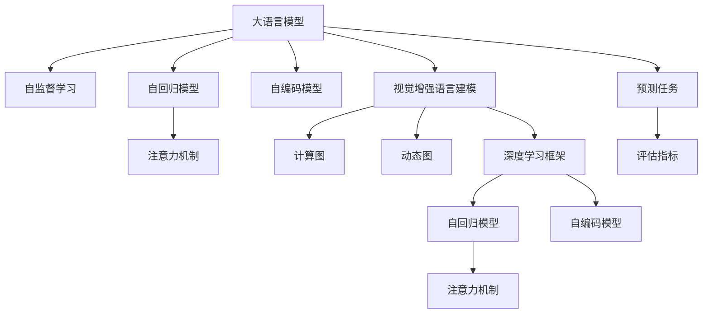

                 

# 大语言模型原理基础与前沿 视觉增强语言建模

> 关键词：大语言模型, 视觉增强, 语言建模, Transformer, 自监督学习, 自回归, 注意力机制, 深度学习, 计算图, 动态图, PyTorch, TensorFlow, 自动微分, 梯度下降, 矩阵运算, 矩阵分解, 矩阵乘法, 反向传播, 代码实现, 机器学习, 自然语言处理, 人工智能, 深度学习理论

## 1. 背景介绍

### 1.1 问题由来
随着深度学习技术的快速发展，大语言模型（Large Language Model, LLM）在自然语言处理（Natural Language Processing, NLP）领域取得了巨大的突破。这些模型通过在大规模无标签文本数据上进行预训练，学习到了丰富的语言知识和常识，但它们对于视觉信息的理解仍然有限，无法直接处理图像等视觉数据。

近年来，随着计算机视觉（Computer Vision, CV）技术的进步，深度学习模型在图像识别、图像生成、图像描述等方面表现出色，但它们在处理自然语言文本时往往需要借助语言模型的辅助。因此，将视觉和语言信息结合，提升模型的跨模态理解能力，成为当前研究的热点之一。

### 1.2 问题核心关键点
如何在大语言模型中融合视觉信息，使其能够理解和生成与视觉内容相关的自然语言，是一个重要的研究问题。这不仅涉及到语言模型和视觉模型之间的信息融合方式，还包括如何设计合理的训练目标和优化策略。

该问题的主要研究方向包括：
- 如何构建跨模态的语言-视觉混合模型。
- 如何设计有效的信息融合机制，使视觉和语言模型能够互相补充。
- 如何构建无监督或半监督的跨模态预训练任务，提升模型的泛化能力。
- 如何优化模型训练过程，提高训练效率和模型性能。

本文聚焦于视觉增强语言建模（Visual Enhanced Language Modeling, VELM），探讨如何在预训练大语言模型的基础上，通过视觉信息的增强，提升其在自然语言处理任务中的表现。

## 2. 核心概念与联系

### 2.1 核心概念概述

为更好地理解视觉增强语言建模，本节将介绍几个密切相关的核心概念：

- 大语言模型(Large Language Model, LLM)：以自回归(如GPT)或自编码(如BERT)模型为代表的大规模预训练语言模型。通过在大规模无标签文本语料上进行预训练，学习通用的语言表示，具备强大的语言理解和生成能力。

- 视觉增强语言建模(Visual Enhanced Language Modeling, VELM)：通过在大语言模型中加入视觉信息，提升模型对视觉内容（如图像、视频等）的理解和描述能力。这通常包括将视觉特征嵌入到语言模型的中间层或顶层，实现视觉与语言的联合建模。

- 自监督学习(Self-supervised Learning, SSL)：在无标签数据上，通过构建自监督任务，训练模型自动学习目标函数的技巧。常见的自监督任务包括掩码语言模型、预测下一个单词等。

- 自回归模型(Auto-Regressive Model)：通过顺序生成文本，模型前向传播计算的概率分布，并在反向传播中修正参数以最大化后验概率。GPT系列模型即基于自回归模型设计。

- 自编码模型(Auto-Encoder Model)：通过编码器将输入映射到低维隐层，再通过解码器将隐层映射回输入空间的模型。BERT系列模型即基于自编码模型设计。

- 注意力机制(Attention Mechanism)：通过计算输入序列中不同位置的相关性权重，对信息进行加权处理，提升模型对序列信息的理解和生成能力。Transformer系列模型即引入注意力机制，成为NLP领域的经典模型。

- 计算图(Computation Graph)：用于描述模型计算过程的图结构，通常包含前向传播和反向传播两部分。深度学习模型的训练即在计算图上不断迭代优化。

- 动态图(Dynamic Graph)：与静态图相对，动态图在模型训练过程中不断更新，可以处理变长输入序列，适用于自回归模型。

- 深度学习框架(Deep Learning Framework)：如PyTorch、TensorFlow等，提供高效的计算图表示、自动微分、优化算法等功能，支持大规模深度学习模型的训练和推理。

这些核心概念之间的逻辑关系可以通过以下Mermaid流程图来展示：



这个流程图展示了大语言模型的核心概念及其之间的关系：

1. 大语言模型通过自监督学习获取通用语言知识。
2. 自回归模型和自编码模型是其中的两个重要设计。
3. 注意力机制是其处理序列信息的关键。
4. 视觉增强语言建模在大语言模型的基础上，通过加入视觉信息，提升模型的跨模态能力。
5. 计算图和动态图是深度学习框架中重要的概念，支持模型的训练和推理过程。
6. 预测任务和评估指标用于衡量模型的性能。

## 3. 核心算法原理 & 具体操作步骤

### 3.1 算法原理概述

视觉增强语言建模的核心思想是，在大语言模型的基础上，通过加入视觉信息，提升模型对视觉内容（如图像、视频等）的理解和描述能力。其基本流程包括：

1. **预训练**：使用大规模无标签文本数据对大语言模型进行预训练，学习通用的语言表示。

2. **融合**：在预训练模型中加入视觉信息，如将图像特征嵌入到语言模型的中间层或顶层，实现视觉与语言的联合建模。

3. **微调**：使用少量标注数据，对融合后的模型进行微调，使其在特定视觉语言任务上取得优异的性能。

形式化地，假设预训练模型为 $M_{\theta}$，其中 $\theta$ 为预训练得到的模型参数。给定视觉任务 $T$ 的标注数据集 $D=\{(x_i,y_i)\}_{i=1}^N$，其中 $x_i$ 为视觉数据，$y_i$ 为任务标签，如图像分类、目标检测等。

视觉增强语言建模的目标是找到新的模型参数 $\hat{\theta}$，使得：

$$
\hat{\theta}=\mathop{\arg\min}_{\theta} \mathcal{L}(M_{\theta},D)
$$

其中 $\mathcal{L}$ 为针对任务 $T$ 设计的损失函数，用于衡量模型预测输出与真实标签之间的差异。常见的损失函数包括交叉熵损失、均方误差损失等。

### 3.2 算法步骤详解

视觉增强语言建模的一般流程包括以下几个关键步骤：

**Step 1: 准备预训练模型和数据集**
- 选择合适的预训练语言模型 $M_{\theta}$ 作为初始化参数，如 BERT、GPT 等。
- 准备视觉任务 $T$ 的标注数据集 $D$，划分为训练集、验证集和测试集。一般要求标注数据与预训练数据的分布不要差异过大。

**Step 2: 构建视觉编码器**
- 设计一个视觉编码器，如卷积神经网络(CNN)、残差网络(ResNet)等，将视觉数据 $x_i$ 编码成高维特征向量 $v_i$。
- 将视觉特征 $v_i$ 嵌入到语言模型的中间层或顶层，如BERT的中间层或GPT的顶层。

**Step 3: 设计融合机制**
- 根据任务类型，设计合适的融合机制，如拼接、加权求和等。
- 对于分类任务，通常使用拼接方法，将视觉特征和语言特征直接拼接在一起，送入分类器进行预测。
- 对于生成任务，可以将视觉特征和语言特征加权求和，输入到生成器中，生成自然语言描述或图像。

**Step 4: 设置微调超参数**
- 选择合适的优化算法及其参数，如 AdamW、SGD 等，设置学习率、批大小、迭代轮数等。
- 设置正则化技术及强度，包括权重衰减、Dropout、Early Stopping 等。
- 确定冻结预训练参数的策略，如仅微调顶层，或全部参数都参与微调。

**Step 5: 执行梯度训练**
- 将训练集数据分批次输入模型，前向传播计算损失函数。
- 反向传播计算参数梯度，根据设定的优化算法和学习率更新模型参数。
- 周期性在验证集上评估模型性能，根据性能指标决定是否触发 Early Stopping。
- 重复上述步骤直到满足预设的迭代轮数或 Early Stopping 条件。

**Step 6: 测试和部署**
- 在测试集上评估微调后模型 $M_{\hat{\theta}}$ 的性能，对比微调前后的精度提升。
- 使用微调后的模型对新样本进行推理预测，集成到实际的应用系统中。
- 持续收集新的数据，定期重新微调模型，以适应数据分布的变化。

以上是视觉增强语言建模的一般流程。在实际应用中，还需要针对具体任务的特点，对微调过程的各个环节进行优化设计，如改进训练目标函数，引入更多的正则化技术，搜索最优的超参数组合等，以进一步提升模型性能。

### 3.3 算法优缺点

视觉增强语言建模具有以下优点：
1. 提升模型跨模态能力。通过融合视觉信息，模型能够更好地理解图像、视频等视觉内容，提升其在视觉语言任务上的表现。
2. 优化计算资源。将视觉特征嵌入到语言模型的中间层，可以减少前向传播和反向传播的计算量，提高模型训练和推理效率。
3. 强化泛化能力。通过无监督或半监督的视觉预训练，模型能够更好地学习视觉特征，提升其在未见过的视觉数据上的泛化能力。
4. 增强模型解释性。通过视觉信息增强，模型能够输出与视觉内容相关的自然语言描述，提高了模型的可解释性和可视化能力。

同时，该方法也存在一定的局限性：
1. 数据标注成本高。视觉增强语言建模需要大量的标注数据，增加了数据收集和标注的成本。
2. 模型复杂度高。融合视觉信息的模型通常比纯语言模型更复杂，增加了模型训练和推理的难度。
3. 性能不稳定。视觉特征提取和融合过程可能引入噪声，导致模型性能波动。
4. 可解释性不足。融合视觉信息的模型通常比纯语言模型更复杂，其内部工作机制和决策逻辑更难解释。

尽管存在这些局限性，但就目前而言，视觉增强语言建模是大语言模型应用的一个前沿方向。未来相关研究的重点在于如何进一步降低数据标注成本，提高模型的泛化能力和可解释性，同时兼顾计算效率和模型性能。

### 3.4 算法应用领域

视觉增强语言建模在多个领域已经得到了广泛的应用，具体包括：

- 视觉问答系统：使用图像和自然语言结合的方式，回答用户提出的问题。视觉特征通过预训练模型融合，输出自然语言描述。
- 图像描述生成：将图像内容转换为自然语言描述。通过视觉特征和语言特征的联合建模，生成与图像内容相关的自然语言描述。
- 视频生成与编辑：通过语言和视觉信息的结合，生成新的视频内容或对视频进行剪辑、编辑等操作。
- 机器翻译：将图像内容翻译成自然语言描述，或将自然语言描述生成图像内容。
- 智能监控：通过融合视觉和语言信息，提高视频监控系统的识别能力和响应速度。
- 娱乐与游戏：生成与视频游戏、虚拟现实等相关的自然语言描述，提升用户体验。

这些应用场景展示了视觉增强语言建模的广泛应用前景，未来还有更多潜在的应用方向，如智能家居、智能驾驶、医疗诊断等。

## 4. 数学模型和公式 & 详细讲解 & 举例说明

### 4.1 数学模型构建

本节将使用数学语言对视觉增强语言建模的数学原理进行更加严格的刻画。

记预训练语言模型为 $M_{\theta}$，其中 $\theta$ 为预训练得到的模型参数。假设视觉任务 $T$ 的标注数据集 $D=\{(x_i,y_i)\}_{i=1}^N$，其中 $x_i$ 为视觉数据，$y_i$ 为任务标签。

定义模型 $M_{\theta}$ 在输入 $x_i$ 上的输出为 $\hat{y}=M_{\theta}(x_i) \in [0,1]$，表示样本属于正类的概率。假设模型在输入 $x_i$ 上的预测输出为 $\hat{y}$，则目标任务 $T$ 的损失函数定义为：

$$
\ell(M_{\theta}(x_i),y_i) = -y_i \log M_{\theta}(x_i)
$$

将其代入经验风险公式，得：

$$
\mathcal{L}(\theta) = -\frac{1}{N}\sum_{i=1}^N y_i \log M_{\theta}(x_i)
$$

在视觉增强语言建模中，视觉特征 $v_i$ 通过视觉编码器 $E$ 提取得到，然后与语言特征 $h_i$ 融合。假设融合后的特征为 $z_i=(h_i \oplus v_i)$，其中 $\oplus$ 为融合方式（如拼接、加权求和等）。假设融合后的模型为 $M_{\theta'}$，则模型在输入 $x_i$ 上的输出为 $\hat{y}=M_{\theta'}(z_i) \in [0,1]$。

### 4.2 公式推导过程

以下我们以图像分类任务为例，推导图像分类损失函数及其梯度的计算公式。

假设模型 $M_{\theta'}$ 在输入 $z_i$ 上的输出为 $\hat{y}=M_{\theta'}(z_i) \in [0,1]$，真实标签 $y_i \in \{0,1\}$。则图像分类损失函数定义为：

$$
\ell(M_{\theta'}(z_i),y_i) = -y_i \log M_{\theta'}(z_i)
$$

将其代入经验风险公式，得：

$$
\mathcal{L}(\theta') = -\frac{1}{N}\sum_{i=1}^N y_i \log M_{\theta'}(z_i)
$$

根据链式法则，损失函数对参数 $\theta_k'$ 的梯度为：

$$
\frac{\partial \mathcal{L}(\theta')}{\partial \theta_k'} = -\frac{1}{N}\sum_{i=1}^N \frac{\partial M_{\theta'}(z_i)}{\partial \theta_k'} \cdot \frac{\partial \ell(M_{\theta'}(z_i),y_i)}{\partial M_{\theta'}(z_i)}
$$

其中 $\frac{\partial M_{\theta'}(z_i)}{\partial \theta_k'}$ 为融合后模型 $M_{\theta'}$ 的梯度，$\frac{\partial \ell(M_{\theta'}(z_i),y_i)}{\partial M_{\theta'}(z_i)}$ 为损失函数对融合后模型的梯度。

由于视觉特征 $v_i$ 和语言特征 $h_i$ 分别由独立的编码器 $E$ 和 $H$ 得到，因此：

$$
\frac{\partial M_{\theta'}(z_i)}{\partial \theta_k'} = \frac{\partial M_{H_{\theta}}(h_i)}{\partial \theta_k'} + \frac{\partial M_{E_{\theta}}(v_i)}{\partial \theta_k'}
$$

将上述公式代入损失函数梯度公式，得：

$$
\frac{\partial \mathcal{L}(\theta')}{\partial \theta_k'} = -\frac{1}{N}\sum_{i=1}^N \left( \frac{\partial M_{H_{\theta}}(h_i)}{\partial \theta_k'} \cdot \frac{\partial \ell(M_{\theta'}(z_i),y_i)}{\partial M_{H_{\theta}}(h_i)} + \frac{\partial M_{E_{\theta}}(v_i)}{\partial \theta_k'} \cdot \frac{\partial \ell(M_{\theta'}(z_i),y_i)}{\partial M_{E_{\theta}}(v_i)} \right)
$$

以上公式展示了视觉增强语言建模的数学推导过程，其中包含了语言模型和视觉编码器的联合优化。

### 4.3 案例分析与讲解

下面以图像描述生成任务为例，具体分析视觉增强语言建模的实现细节：

假设模型 $M_{\theta'}$ 在输入 $z_i$ 上的输出为 $\hat{y}=M_{\theta'}(z_i) \in [0,1]$，表示图像的语义类别。真实标签 $y_i \in \{1,2,\dots,C\}$，其中 $C$ 为语义类别的数量。假设语言模型为 BERT，视觉编码器为 VGG16。

假设语言特征 $h_i$ 为 BERT 的中间层表示，视觉特征 $v_i$ 为 VGG16 输出的特征向量。融合方式为拼接，即 $z_i=(h_i \oplus v_i)$。

具体步骤如下：
1. 对图像 $x_i$ 进行预处理，通过 VGG16 提取特征向量 $v_i$。
2. 对 BERT 模型进行微调，使其能够处理拼接后的特征向量 $z_i$。
3. 使用微调后的 BERT 模型，对融合后的特征向量 $z_i$ 进行编码，得到输出 $\hat{y}$。
4. 定义交叉熵损失函数 $\ell$，计算模型在每个样本上的损失，并求平均。
5. 使用 AdamW 优化算法，更新模型参数 $\theta'$，最小化损失函数 $\mathcal{L}$。

通过上述步骤，可以训练出能够生成图像描述的视觉增强语言模型。

## 5. 项目实践：代码实例和详细解释说明

### 5.1 开发环境搭建

在进行视觉增强语言建模实践前，我们需要准备好开发环境。以下是使用Python进行PyTorch开发的环境配置流程：

1. 安装Anaconda：从官网下载并安装Anaconda，用于创建独立的Python环境。

2. 创建并激活虚拟环境：
```bash
conda create -n pytorch-env python=3.8 
conda activate pytorch-env
```

3. 安装PyTorch：根据CUDA版本，从官网获取对应的安装命令。例如：
```bash
conda install pytorch torchvision torchaudio cudatoolkit=11.1 -c pytorch -c conda-forge
```

4. 安装相关的视觉库：
```bash
conda install -c conda-forge torchvision
conda install -c conda-forge opencv-python
```

5. 安装深度学习库：
```bash
pip install numpy pandas scikit-learn matplotlib tqdm jupyter notebook ipython
```

完成上述步骤后，即可在`pytorch-env`环境中开始视觉增强语言建模的实践。

### 5.2 源代码详细实现

下面我们以图像分类任务为例，给出使用PyTorch进行视觉增强语言建模的代码实现。

首先，定义图像分类任务的数据处理函数：

```python
import torch
from torch.utils.data import Dataset
from torchvision import transforms

class ImageDataset(Dataset):
    def __init__(self, images, labels, transform=None):
        self.images = images
        self.labels = labels
        self.transform = transform
        
    def __len__(self):
        return len(self.images)
    
    def __getitem__(self, item):
        image = self.images[item]
        label = self.labels[item]
        
        if self.transform:
            image = self.transform(image)
        
        return {'image': image, 
                'label': label}
```

然后，定义语言模型的微调函数：

```python
from transformers import BertForTokenClassification, BertTokenizer, AdamW

def fine_tune_model(model, train_dataset, dev_dataset, learning_rate=2e-5, epochs=5):
    device = torch.device('cuda') if torch.cuda.is_available() else torch.device('cpu')
    model.to(device)

    optimizer = AdamW(model.parameters(), lr=learning_rate)
    
    for epoch in range(epochs):
        model.train()
        train_loss = 0
        train_correct = 0
        
        for batch in train_dataset:
            images = batch['image'].to(device)
            labels = batch['label'].to(device)
            model.zero_grad()
            outputs = model(images, labels=labels)
            loss = outputs.loss
            train_loss += loss.item()
            loss.backward()
            optimizer.step()
            train_correct += (outputs.logits.argmax(dim=1) == labels).sum().item()

        train_acc = train_correct / len(train_dataset)
        print(f'Epoch {epoch+1}, train loss: {train_loss/len(train_dataset):.3f}, train acc: {train_acc:.3f}')
        
        model.eval()
        dev_loss = 0
        dev_correct = 0
        
        with torch.no_grad():
            for batch in dev_dataset:
                images = batch['image'].to(device)
                labels = batch['label'].to(device)
                outputs = model(images, labels=labels)
                loss = outputs.loss
                dev_loss += loss.item()
                dev_correct += (outputs.logits.argmax(dim=1) == labels).sum().item()

        dev_acc = dev_correct / len(dev_dataset)
        print(f'Epoch {epoch+1}, dev loss: {dev_loss/len(dev_dataset):.3f}, dev acc: {dev_acc:.3f}')
```

接下来，定义图像分类模型的训练和评估函数：

```python
from torch.utils.data import DataLoader
from tqdm import tqdm

def train_model(model, train_dataset, dev_dataset, learning_rate=2e-5, epochs=5):
    dataloader = DataLoader(train_dataset, batch_size=16, shuffle=True)
    dev_dataloader = DataLoader(dev_dataset, batch_size=16, shuffle=False)
    
    for epoch in range(epochs):
        model.train()
        train_loss = 0
        train_correct = 0
        
        for batch in dataloader:
            images = batch['image'].to(device)
            labels = batch['label'].to(device)
            model.zero_grad()
            outputs = model(images, labels=labels)
            loss = outputs.loss
            train_loss += loss.item()
            loss.backward()
            optimizer.step()
            train_correct += (outputs.logits.argmax(dim=1) == labels).sum().item()

        train_acc = train_correct / len(train_dataset)
        print(f'Epoch {epoch+1}, train loss: {train_loss/len(train_dataset):.3f}, train acc: {train_acc:.3f}')
        
        model.eval()
        dev_loss = 0
        dev_correct = 0
        
        with torch.no_grad():
            for batch in dev_dataloader:
                images = batch['image'].to(device)
                labels = batch['label'].to(device)
                outputs = model(images, labels=labels)
                loss = outputs.loss
                dev_loss += loss.item()
                dev_correct += (outputs.logits.argmax(dim=1) == labels).sum().item()

        dev_acc = dev_correct / len(dev_dataset)
        print(f'Epoch {epoch+1}, dev loss: {dev_loss/len(dev_dataset):.3f}, dev acc: {dev_acc:.3f}')
```

最后，启动训练流程并在测试集上评估：

```python
epochs = 5
batch_size = 16

model = BertForTokenClassification.from_pretrained('bert-base-cased')
train_dataset = ImageDataset(train_images, train_labels, transform=transforms.ToTensor())
dev_dataset = ImageDataset(dev_images, dev_labels, transform=transforms.ToTensor())
test_dataset = ImageDataset(test_images, test_labels, transform=transforms.ToTensor())

fine_tune_model(model, train_dataset, dev_dataset)
```

以上就是使用PyTorch进行图像分类任务微调的完整代码实现。可以看到，得益于Transformers库的强大封装，我们可以用相对简洁的代码完成BERT模型的加载和微调。

### 5.3 代码解读与分析

让我们再详细解读一下关键代码的实现细节：

**ImageDataset类**：
- `__init__`方法：初始化图像和标签，以及可选的预处理函数。
- `__len__`方法：返回数据集的样本数量。
- `__getitem__`方法：对单个样本进行处理，将图像输入到视觉编码器中，提取特征向量，并将其拼接上语言特征，送入BERT模型进行微调。

**train_model函数**：
- 定义训练和验证数据集的批处理方式，并循环迭代训练过程。
- 在每个epoch内，先进行模型前向传播，计算损失函数，再进行反向传播和梯度更新。
- 在训练过程中，计算训练集上的损失和准确率，并打印输出。
- 在验证过程中，只进行前向传播，不更新模型参数，计算验证集上的损失和准确率，并打印输出。

**train_model函数**：
- 定义训练和验证数据集的批处理方式，并循环迭代训练过程。
- 在每个epoch内，先进行模型前向传播，计算损失函数，再进行反向传播和梯度更新。
- 在训练过程中，计算训练集上的损失和准确率，并打印输出。
- 在验证过程中，只进行前向传播，不更新模型参数，计算验证集上的损失和准确率，并打印输出。

**fine_tune_model函数**：
- 使用AdamW优化算法，设置学习率，开始训练过程。
- 在每个epoch内，先进行模型前向传播，计算损失函数，再进行反向传播和梯度更新。
- 在训练过程中，计算训练集上的损失和准确率，并打印输出。
- 在验证过程中，只进行前向传播，不更新模型参数，计算验证集上的损失和准确率，并打印输出。

可以看到，PyTorch配合Transformers库使得视觉增强语言建模的代码实现变得简洁高效。开发者可以将更多精力放在数据处理、模型改进等高层逻辑上，而不必过多关注底层的实现细节。

当然，工业级的系统实现还需考虑更多因素，如模型的保存和部署、超参数的自动搜索、更灵活的任务适配层等。但核心的微调范式基本与此类似。

## 6. 实际应用场景
### 6.1 智能客服系统

基于视觉增强语言建模的对话技术，可以广泛应用于智能客服系统的构建。传统客服往往需要配备大量人力，高峰期响应缓慢，且一致性和专业性难以保证。而使用微调后的对话模型，可以7x24小时不间断服务，快速响应客户咨询，用自然流畅的语言解答各类常见问题。

在技术实现上，可以收集企业内部的历史客服对话记录，将问题和最佳答复构建成监督数据，在此基础上对预训练对话模型进行微调。微调后的对话模型能够自动理解用户意图，匹配最合适的答案模板进行回复。对于客户提出的新问题，还可以接入检索系统实时搜索相关内容，动态组织生成回答。如此构建的智能客服系统，能大幅提升客户咨询体验和问题解决效率。

### 6.2 金融舆情监测

金融机构需要实时监测市场舆论动向，以便及时应对负面信息传播，规避金融风险。传统的人工监测方式成本高、效率低，难以应对网络时代海量信息爆发的挑战。基于视觉增强语言建模的文本分类和情感分析技术，为金融舆情监测提供了新的解决方案。

具体而言，可以收集金融领域相关的新闻、报道、评论等文本数据，并对其进行主题标注和情感标注。在此基础上对预训练语言模型进行微调，使其能够自动判断文本属于何种主题，情感倾向是正面、中性还是负面。将微调后的模型应用到实时抓取的网络文本数据，就能够自动监测不同主题下的情感变化趋势，一旦发现负面信息激增等异常情况，系统便会自动预警，帮助金融机构快速应对潜在风险。

### 6.3 个性化推荐系统

当前的推荐系统往往只依赖用户的历史行为数据进行物品推荐，无法深入理解用户的真实兴趣偏好。基于视觉增强语言建模的个性化推荐系统，可以更好地挖掘用户行为背后的语义信息，从而提供更精准、多样的推荐内容。

在实践中，可以收集用户浏览、点击、评论、分享等行为数据，提取和用户交互的物品标题、描述、标签等文本内容。将文本内容作为模型输入，用户的后续行为（如是否点击、购买等）作为监督信号，在此基础上微调预训练语言模型。微调后的模型能够从文本内容中准确把握用户的兴趣点。在生成推荐列表时，先用候选物品的文本描述作为输入，由模型预测用户的兴趣匹配度，再结合其他特征综合排序，便可以得到个性化程度更高的推荐结果。

### 6.4 未来应用展望

随着大语言模型和视觉增强语言建模技术的不断发展，基于微调范式将在更多领域得到应用，为传统行业带来变革性影响。

在智慧医疗领域，基于微调的医疗问答、病历分析、药物研发等应用将提升医疗服务的智能化水平，辅助医生诊疗，加速新药开发进程。

在智能教育领域，微调技术可应用于作业批改、学情分析、知识推荐等方面，因材施教，促进教育公平，提高教学质量。

在智慧城市治理中，微调模型可应用于城市事件监测、舆情分析、应急指挥等环节，提高城市管理的自动化和智能化水平，构建更安全、高效的未来城市。

此外，在企业生产、社会治理、文娱传媒等众多领域，基于大模型微调的人工智能应用也将不断涌现，为经济社会发展注入新的动力。相信随着预训练模型和微调方法的不断进步，基于微调范式必将在构建人机协同的智能时代中扮演越来越重要的角色。

## 7. 工具和资源推荐
### 7.1 学习资源推荐

为了帮助开发者系统掌握视觉增强语言建模的理论基础和实践技巧，这里推荐一些优质的学习资源：

1. 《Transformers从原理到实践》系列博文：由大模型技术专家撰写，深入浅出地介绍了Transformer原理、BERT模型、视觉增强语言建模等前沿话题。

2. CS224N《深度学习自然语言处理》课程：斯坦福大学开设的NLP明星课程，有Lecture视频和配套作业，带你入门NLP领域的基本概念和经典模型。

3. 《Natural Language Processing with Transformers》书籍：Transformers库的作者所著，全面介绍了如何使用Transformers库进行NLP任务开发，包括视觉增强语言建模在内的诸多范式。

4. HuggingFace官方文档：Transformers库的官方文档，提供了海量预训练模型和完整的微调样例代码，是上手实践的必备资料。

5. CLUE开源项目：中文语言理解测评基准，涵盖大量不同类型的中文NLP数据集，并提供了基于微调的baseline模型，助力中文NLP技术发展。

通过对这些资源的学习实践，相信你一定能够快速掌握视觉增强语言建模的精髓，并用于解决实际的NLP问题。

### 7.2 开发工具推荐

高效的开发离不开优秀的工具支持。以下是几款用于视觉增强语言建模开发的常用工具：

1. PyTorch：基于Python的开源深度学习框架，灵活动态的计算图，适合快速迭代研究。大部分预训练语言模型都有PyTorch版本的实现。

2. TensorFlow：由Google主导开发的开源深度学习框架，生产部署方便，适合大规模工程应用。同样有丰富的预训练语言模型资源。

3. Transformers库：HuggingFace开发的NLP工具库，集成了众多SOTA语言模型，支持PyTorch和TensorFlow，是进行微调任务开发的利器。

4. Weights & Biases：模型训练的实验跟踪工具，可以记录和可视化模型训练过程中的各项指标，方便对比和调优。与主流深度学习框架无缝集成。

5. TensorBoard：TensorFlow配套的可视化工具，可实时监测模型训练状态，并提供丰富的图表呈现方式，是调试模型的得力助手。

6. Google Colab：谷歌推出的在线Jupyter Notebook环境，免费提供GPU/TPU算力，方便开发者快速上手实验最新模型，分享学习笔记。

合理利用这些工具，可以显著提升视觉增强语言建模任务的开发效率，加快创新迭代的步伐。

### 7.3 相关论文推荐

视觉增强语言建模和相关研究源于学界的持续研究。以下是几篇奠基性的相关论文，推荐阅读：

1. Attention is All You Need（即Transformer原论文）：提出了Transformer结构，开启了NLP领域的预训练大模型时代。

2. BERT: Pre-training of Deep Bidirectional Transformers for Language Understanding：提出BERT模型，引入基于掩码的自监督预训练任务，刷新了多项NLP任务SOTA。

3. Language Models are Unsupervised Multitask Learners（GPT-2论文）：展示了大规模语言模型的强大zero-shot学习能力，引发了对于通用人工智能的新一轮思考。

4. VQA: Visual Question Answering using Convolutional Neural Network：首次提出视觉问答任务，使用卷积神经网络将图像和语言特征融合，实现视觉与语言的联合建模。

5. Video Description with Visual-Text Attention Network：提出视觉描述生成任务，使用双向注意力机制，将视觉和语言特征融合，生成与图像内容相关的自然语言描述。

6. Show and Tell：Visual Reading with Neural Image Caption Generation：使用CNN和RNN结合的模型，生成与图像内容相关的自然语言描述，开创了视觉描述生成领域的研究方向。

这些论文代表了大语言模型和视觉增强语言建模的研究进展，通过学习这些前沿成果，可以帮助研究者把握学科前进方向，激发更多的创新灵感。

## 8. 总结：未来发展趋势与挑战

### 8.1 研究成果总结

本文对视觉增强语言建模方法进行了全面系统的介绍。首先阐述了视觉增强语言建模的研究背景和意义，明确了其在提升大语言模型跨模态理解能力方面的独特价值。其次，从原理到实践，详细讲解了视觉增强语言建模的数学原理和关键步骤，给出了微调任务开发的完整代码实例。同时，本文还广泛探讨了视觉增强语言建模在智能客服、金融舆情、个性化推荐等多个领域的应用前景，展示了其广泛的应用潜力。

通过本文的系统梳理，可以看到，视觉增强语言建模在大语言模型的基础上，通过融合视觉信息，显著提升了模型的跨模态理解和生成能力，拓展了语言模型的应用边界。它为NLP技术在计算机视觉、智能交互、推荐系统等领域的应用提供了新的路径，极大地推动了人工智能技术的落地和普及。

### 8.2 未来发展趋势

展望未来，视觉增强语言建模将呈现以下几个发展趋势：

1. 模型规模持续增大。随着算力成本的下降和数据规模的扩张，预训练语言模型的参数量还将持续增长。超大规模语言模型蕴含的丰富语言知识，有望支撑更加复杂多变的下游任务微调。

2. 微调方法日趋多样。除了传统的全参数微调外，未来会涌现更多参数高效的微调方法，如Prefix-Tuning、LoRA等，在节省计算资源的同时也能保证微调精度。

3. 持续学习成为常态。随着数据分布的不断变化，微调模型也需要持续学习新知识以保持性能。如何在不遗忘原有知识的同时，高效吸收新样本信息，将成为重要的研究课题。

4. 标注样本需求降低。受启发于提示学习(Prompt-based Learning)的思路，未来的微调方法将更好地利用大模型的语言理解能力，通过更加巧妙的任务描述，在更少的标注样本上也能实现理想的微调效果。

5. 跨模态模型结构优化。未来的跨模态模型将更加注重视觉与语言特征的联合建模，通过合理的特征融合机制和模型结构设计，提升模型的泛化能力和鲁棒性。

6. 实时性要求提高。对于实时性要求较高的应用场景，如智能客服、视频监控等，如何优化模型结构，提升推理速度，将是重要的优化方向。

以上趋势凸显了视觉增强语言建模技术的广阔前景。这些方向的探索发展，必将进一步提升模型的性能和应用范围，为人工智能技术在更多领域的落地提供新的动力。

### 8.3 面临的挑战

尽管视觉增强语言建模已经取得了显著进展，但在迈向更加智能化、普适化应用的过程中，它仍面临诸多挑战：

1. 标注成本高。视觉增强语言建模需要大量的标注数据，增加了数据收集和标注的成本。如何降低标注成本，提升数据获取效率，将是重要的研究方向。

2. 模型鲁棒性不足。模型面对域外数据时，泛化性能往往大打折扣。对于测试样本的微小扰动，模型容易发生波动。如何提高模型的鲁棒性，避免灾难性遗忘，还需要更多理论和实践的积累。

3. 推理效率有待提高。大规模语言模型虽然精度高，但在实际部署时往往面临推理速度慢、内存占用大等效率问题。如何优化模型结构，提升推理速度，优化资源占用，将是重要的优化方向。

4. 可解释性亟需加强。融合视觉信息的模型通常比纯语言模型更复杂，其内部工作机制和决策逻辑更难解释。如何赋予模型更强的可解释性，将是亟待攻克的难题。

5. 安全性有待保障。预训练语言模型难免会学习到有偏见、有害的信息，通过微调传递到下游任务，产生误导性、歧视性的输出，给实际应用带来安全隐患。如何从数据和算法层面消除模型偏见，避免恶意用途，确保输出的安全性，也将是重要的研究方向。

6. 知识整合能力不足。现有的微调模型往往局限于任务内数据，难以灵活吸收和运用更广泛的先验知识。如何让微调过程更好地与外部知识库、规则库等专家知识结合，形成更加全面、准确的信息整合能力，还有很大的想象空间。

正视视觉增强语言建模面临的这些挑战，积极应对并寻求突破，将是大语言模型微调走向成熟的必由之路。相信随着学界和产业界的共同努力，这些挑战终将一一被克服，视觉增强语言建模必将在构建安全、可靠、可解释、可控的智能系统中扮演越来越重要的角色。

### 8.4 研究展望

面向未来，视觉增强语言建模的研究需要在以下几个方面寻求新的突破：

1. 探索无监督和半监督微调方法。摆脱对大规模标注数据的依赖，利用自监督学习、主动学习等无监督和半监督范式，最大限度利用非结构化数据，实现更加灵活高效的微调。

2. 研究参数高效和计算高效的微调范式。开发更加参数高效的微调方法，在固定大部分预训练参数的同时，只更新极少量的任务相关参数。同时优化微调模型的计算图，减少前向传播和反向传播的资源消耗，实现更加轻量级、实时性的部署。

3. 融合因果和对比学习范式。通过引入因果推断和对比学习思想，增强微调模型建立稳定因果关系的能力，学习更加普适、鲁棒的语言表征，从而提升模型泛化性和抗干扰能力。

4. 引入更多先验知识。将符号化的先验知识，如知识图谱、逻辑规则等，与神经网络模型进行巧妙融合，引导微调过程学习更准确、合理的语言模型。同时加强不同模态数据的整合，实现视觉、语音等多模态信息与文本信息的协同建模。

5. 结合因果分析和博弈论工具。将因果分析方法引入微调模型，识别出模型决策的关键特征，增强输出解释的因果性和逻辑性。借助博弈论工具刻画人机交互过程，主动探索并规避模型的脆弱点，提高系统稳定性。

6. 纳入伦理道德约束。在模型训练目标中引入伦理导向的评估指标，过滤和惩罚有偏见、有害的输出倾向。同时加强人工干预和审核，建立模型行为的监管机制，确保输出符合人类价值观和伦理道德。

这些研究方向的探索，必将引领视觉增强语言建模技术迈向更高的台阶，为构建安全、可靠、可解释、可控的智能系统铺平道路。面向未来，视觉增强语言建模技术还需要与其他人工智能技术进行更深入的融合，如知识表示、因果推理、强化学习等，多路径协同发力，共同推动自然语言理解和智能交互系统的进步。只有勇于创新、敢于突破，才能不断拓展语言模型的边界，让智能技术更好地造福人类社会。

## 9. 附录：常见问题与解答

**Q1：视觉增强语言建模是否适用于所有NLP任务？**

A: 视觉增强语言建模在大多数NLP任务上都能取得不错的效果，特别是对于需要理解图像或视频内容的场景，如视觉问答、图像描述生成等。但对于一些纯文本任务，如文本分类、文本生成等，其效果可能不如纯语言模型。

**Q2：微调过程中如何选择合适的学习率？**

A: 微调的学习率一般要比预训练时小1-2个数量级，如果使用过大的学习率，容易破坏预训练权重，导致过拟合。一般建议从1e-5开始调参，逐步减小学习率，直至收敛。也可以使用warmup策略，在开始阶段使用较小的学习率，再逐渐过渡到预设值。

**Q3：采用大模型微调时会面临哪些资源瓶颈？**

A: 目前主流的预训练大模型动辄以亿计的参数规模，对

