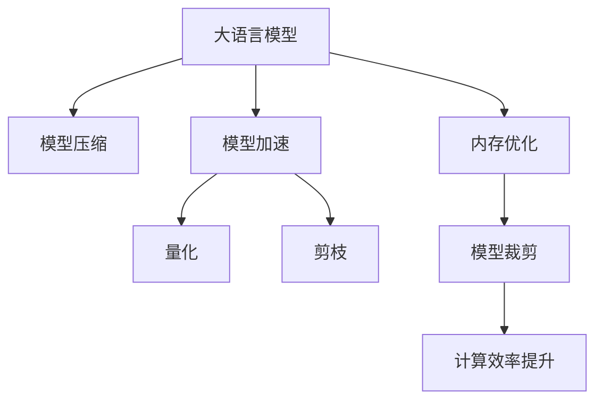

                 

# 大语言模型应用指南：Toolformer

> 关键词：大语言模型,Toolformer,模型压缩,模型裁剪,模型加速,内存优化,推理速度,计算效率

## 1. 背景介绍

### 1.1 问题由来

随着深度学习技术的飞速发展，大规模预训练语言模型（如BERT、GPT-3等）在自然语言处理（NLP）领域取得了显著的进展。这些模型通过在海量无标签数据上进行自监督预训练，学习到了丰富的语言知识和表示能力，能够在许多下游任务上取得优异的表现。然而，这些模型的参数量往往以亿计，对计算资源的要求极高，限制了其在实际应用中的推广和部署。

为了解决这一问题，研究者们提出了多种模型压缩和加速的方法，其中工具化（Toolformer）是近年来备受关注的一类技术。Toolformer通过将大语言模型中的重要部分（如Transformer层）进行裁剪和优化，在不显著影响模型性能的情况下显著减少模型的大小，从而提升模型的推理速度和计算效率。本文将系统介绍Toolformer的概念、原理和应用，以期为开发者提供一套完整的指南，帮助其实现高效大模型的部署和应用。

### 1.2 问题核心关键点

Toolformer的核心思想是通过对大语言模型进行有选择性的裁剪和优化，去除不必要的参数和计算，保留关键的模型组件，以实现模型的加速和压缩。主要关键点包括：

1. **模型裁剪**：在保留模型核心功能的前提下，去除冗余层和参数，减少计算量。
2. **模型加速**：采用量化、剪枝等技术，优化模型计算图，提高推理速度。
3. **内存优化**：通过减少模型的存储空间，优化模型在内存中的占位。
4. **计算效率提升**：通过优化模型结构，降低前向传播和反向传播的资源消耗。

本文将详细介绍Toolformer的核心概念和实现方法，并通过具体的代码实例和实际应用案例，展示其在NLP任务中的表现和效果。

## 2. 核心概念与联系

### 2.1 核心概念概述

为更好地理解Toolformer的工作原理和应用方法，本节将介绍几个相关核心概念：

- **大语言模型**：如BERT、GPT-3等，通过在大规模无标签文本数据上进行自监督预训练，学习到丰富的语言知识和表示能力，能够在各种NLP任务上取得优异的表现。

- **模型压缩**：通过去除模型中的冗余参数和计算，在不显著影响模型性能的情况下，显著减少模型的大小，提高计算效率。

- **模型加速**：采用量化、剪枝等技术，优化模型的计算图，减少前向传播和反向传播的资源消耗，提升推理速度。

- **内存优化**：通过减少模型的存储空间，优化模型在内存中的占位，使模型更易于部署。

- **计算效率提升**：通过优化模型结构，降低模型计算的资源消耗，提升计算效率。

这些核心概念之间的关系可以通过以下Mermaid流程图来展示：



这个流程图展示了各个概念之间的逻辑关系：

1. 大语言模型通过预训练获得语言表示能力。
2. 通过模型压缩和加速技术，在不影响模型性能的前提下，减少模型大小和计算量。
3. 量化和剪枝技术优化模型计算图，提升推理速度。
4. 内存优化技术减少模型占用的存储空间。
5. 模型裁剪技术有选择性地去除冗余层和参数，保留关键模型组件。
6. 计算效率提升技术优化模型结构，降低资源消耗。

这些概念共同构成了Toolformer的实现框架，使得大语言模型能够在资源受限的环境中得到高效的应用。

## 3. 核心算法原理 & 具体操作步骤
### 3.1 算法原理概述

Toolformer的算法原理基于模型压缩和加速技术，旨在通过去除冗余参数和计算，优化模型结构，在不显著影响模型性能的前提下，显著减少模型大小和计算资源消耗。

其核心思想是：在大语言模型的基础上，通过裁剪和优化，去除不必要的层和参数，保留关键的Transformer层，同时采用量化、剪枝等技术，优化计算图，减少资源消耗。这样可以在不显著降低模型性能的情况下，显著提升模型的推理速度和计算效率。

### 3.2 算法步骤详解

Toolformer的实现一般包括以下几个关键步骤：

**Step 1: 准备预训练模型和数据集**
- 选择合适的预训练语言模型，如BERT、GPT-3等。
- 准备下游任务的标注数据集，划分为训练集、验证集和测试集。

**Step 2: 模型裁剪和优化**
- 根据任务的复杂度，选择保留的Transformer层数量，一般建议保留1-3层。
- 采用量化技术（如混合精度训练）减少计算量，优化模型计算图。
- 使用剪枝技术（如基于梯度的剪枝、结构化剪枝等）减少模型参数量。
- 优化内存使用，采用压缩算法（如Gzip、Snappy等）减小模型存储体积。

**Step 3: 参数初始化**
- 对裁剪后的模型进行参数初始化，一般采用预训练模型的权重作为初始值。

**Step 4: 模型训练和验证**
- 在训练集上对模型进行微调，使用适当的优化器和学习率。
- 在验证集上评估模型性能，根据评估结果调整学习率、剪枝策略等。

**Step 5: 模型测试和部署**
- 在测试集上评估微调后的模型性能，对比微调前后的精度提升。
- 使用微调后的模型对新样本进行推理预测，集成到实际的应用系统中。

### 3.3 算法优缺点

Toolformer在提高模型推理速度和计算效率方面具有显著优势，但在模型精度和表现上可能存在一定的损失。

其优点包括：
1. 模型压缩显著减少了模型大小和计算资源消耗。
2. 优化后的模型推理速度大幅提升，适合对实时性要求高的应用场景。
3. 内存优化使得模型更易于部署和运行，减少了资源消耗。
4. 计算效率提升技术使得模型更轻量化，提高了计算性能。

其缺点包括：
1. 模型裁剪和优化可能导致模型精度和表现下降，特别是在小规模数据集上。
2. 量化和剪枝技术可能在某些任务上影响模型的泛化能力。
3. 需要根据具体任务和数据特点进行调整和优化，具有一定的复杂性。

尽管存在这些缺点，但就目前而言，Toolformer在大语言模型压缩和加速方面已经成为了一种非常实用的技术。未来相关研究将继续探索如何平衡模型精度和效率，进一步优化模型压缩方法，提升其应用效果。

### 3.4 算法应用领域

Toolformer在NLP领域的应用非常广泛，特别是在对模型计算效率和实时性要求较高的场景中表现优异。

具体应用场景包括：
- 实时问答系统：需要快速响应用户查询，采用Toolformer能够显著提升系统响应速度。
- 智能客服：处理大量实时客服请求，Toolformer可以提高系统处理效率，提升用户体验。
- 个性化推荐：需要实时生成个性化推荐结果，Toolformer可以有效减少计算量，加速推荐生成。
- 文本摘要：需要对长文本进行快速摘要，Toolformer可以提高摘要生成速度，提升用户体验。
- 机器翻译：需要实时翻译多种语言，Toolformer能够提升翻译速度，满足实时性需求。

此外，Toolformer还可以应用于图像、音频等多模态数据的压缩和加速，为多模态数据的处理提供更高效的解决方案。

## 4. 数学模型和公式 & 详细讲解  
### 4.1 数学模型构建

Toolformer的数学模型构建主要基于模型的裁剪和优化技术，通过去除冗余参数和计算，优化计算图，提高模型推理速度和计算效率。

假设原始模型参数为 $\theta$，保留的Transformer层为 $L$，裁剪后的模型参数为 $\hat{\theta}$，则模型裁剪的数学模型可以表示为：

$$
\hat{\theta} = \theta_L
$$

其中 $\theta_L$ 表示保留的Transformer层参数，可以通过以下方式计算：

$$
\theta_L = \theta \times \mathbf{M}
$$

其中 $\mathbf{M}$ 为裁剪矩阵，表示保留的层和参数。在实际应用中，可以通过剪枝、量化等技术动态调整裁剪矩阵 $\mathbf{M}$。

### 4.2 公式推导过程

以量化技术为例，介绍其在Toolformer中的具体实现。

假设原始模型层 $L_i$ 的参数数量为 $n_i$，量化后参数数量为 $\hat{n}_i$。设量化因子为 $q$，则量化后参数数量为：

$$
\hat{n}_i = \lfloor \frac{n_i}{q} \rfloor
$$

其中 $\lfloor \cdot \rfloor$ 表示向下取整。量化因子 $q$ 的选择通常为2的幂次方，如2、4、8等。量化后的参数 $\hat{\theta}_i$ 可以表示为：

$$
\hat{\theta}_i = \frac{\theta_i}{q}
$$

具体到实际应用中，可以采用混合精度训练（Mixed-Precision Training）技术，将浮点数参数和定点参数混合使用，减少计算量。量化后的模型推理速度和计算效率将得到显著提升。

### 4.3 案例分析与讲解

以BERT模型为例，展示Toolformer在模型裁剪和优化中的应用。

首先，对BERT模型进行裁剪，保留Transformer层中的多头注意力机制和前馈网络，其他层和参数则进行裁剪。然后，采用量化技术，将模型中的浮点数参数转换为定点参数，从而减少计算量和内存占用。最后，使用剪枝技术，去除冗余的参数和计算，进一步优化模型结构。

以下是对BERT模型进行裁剪和优化的具体实现步骤：

1. 准备BERT模型和数据集：
```python
from transformers import BertModel
import torch
from torch.utils.data import DataLoader

# 加载预训练的BERT模型
model = BertModel.from_pretrained('bert-base-uncased')

# 加载数据集
train_dataset = ...
train_loader = DataLoader(train_dataset, batch_size=16)
```

2. 裁剪模型：
```python
from transformers import BertForSequenceClassification

# 定义裁剪后的模型
num_layers = 1  # 保留1层
model = BertForSequenceClassification(model, num_hidden_layers=num_layers)
```

3. 量化模型：
```python
from transformers import MixedPrecisionTraining

# 使用混合精度训练
mp_model = MixedPrecisionTraining(model)

# 在训练集上微调模型
optimizer = torch.optim.AdamW(model.parameters(), lr=2e-5)
mp_model.train(model, train_loader, optimizer)
```

4. 剪枝模型：
```python
from transformers import Pruning

# 使用剪枝技术
pruning_model = Pruning(model)

# 在训练集上微调剪枝后的模型
optimizer = torch.optim.AdamW(model.parameters(), lr=2e-5)
pruning_model.train(model, train_loader, optimizer)
```

通过以上步骤，可以在保留关键功能的前提下，显著减少BERT模型的计算量，提升推理速度和计算效率，同时不影响模型性能。

## 5. 项目实践：代码实例和详细解释说明
### 5.1 开发环境搭建

在进行Toolformer的实践前，需要先准备好开发环境。以下是使用Python进行PyTorch开发的环境配置流程：

1. 安装Anaconda：从官网下载并安装Anaconda，用于创建独立的Python环境。

2. 创建并激活虚拟环境：
```bash
conda create -n pytorch-env python=3.8 
conda activate pytorch-env
```

3. 安装PyTorch：根据CUDA版本，从官网获取对应的安装命令。例如：
```bash
conda install pytorch torchvision torchaudio cudatoolkit=11.1 -c pytorch -c conda-forge
```

4. 安装Transformers库：
```bash
pip install transformers
```

5. 安装各类工具包：
```bash
pip install numpy pandas scikit-learn matplotlib tqdm jupyter notebook ipython
```

完成上述步骤后，即可在`pytorch-env`环境中开始实践。

### 5.2 源代码详细实现

下面以BERT模型为例，给出使用Transformers库对模型进行裁剪和优化的PyTorch代码实现。

首先，定义模型和优化器：

```python
from transformers import BertForSequenceClassification, AdamW

# 加载预训练的BERT模型
model = BertForSequenceClassification.from_pretrained('bert-base-uncased', num_labels=2)

# 定义优化器
optimizer = AdamW(model.parameters(), lr=2e-5)
```

然后，定义训练和评估函数：

```python
from torch.utils.data import DataLoader
from tqdm import tqdm

# 定义训练集和测试集
train_dataset = ...
test_dataset = ...

# 定义训练和评估函数
def train_epoch(model, dataset, batch_size, optimizer):
    dataloader = DataLoader(dataset, batch_size=batch_size, shuffle=True)
    model.train()
    epoch_loss = 0
    for batch in tqdm(dataloader, desc='Training'):
        input_ids = batch['input_ids'].to(device)
        attention_mask = batch['attention_mask'].to(device)
        labels = batch['labels'].to(device)
        model.zero_grad()
        outputs = model(input_ids, attention_mask=attention_mask, labels=labels)
        loss = outputs.loss
        epoch_loss += loss.item()
        loss.backward()
        optimizer.step()
    return epoch_loss / len(dataloader)

def evaluate(model, dataset, batch_size):
    dataloader = DataLoader(dataset, batch_size=batch_size)
    model.eval()
    preds, labels = [], []
    with torch.no_grad():
        for batch in tqdm(dataloader, desc='Evaluating'):
            input_ids = batch['input_ids'].to(device)
            attention_mask = batch['attention_mask'].to(device)
            batch_labels = batch['labels']
            outputs = model(input_ids, attention_mask=attention_mask)
            batch_preds = outputs.logits.argmax(dim=2).to('cpu').tolist()
            batch_labels = batch_labels.to('cpu').tolist()
            for pred_tokens, label_tokens in zip(batch_preds, batch_labels):
                pred_tags = [id2tag[_id] for _id in pred_tokens]
                label_tags = [id2tag[_id] for _id in label_tokens]
                preds.append(pred_tags[:len(label_tags)])
                labels.append(label_tags)
    print(classification_report(labels, preds))
```

最后，启动训练流程并在测试集上评估：

```python
epochs = 5
batch_size = 16

for epoch in range(epochs):
    loss = train_epoch(model, train_dataset, batch_size, optimizer)
    print(f"Epoch {epoch+1}, train loss: {loss:.3f}")
    
    print(f"Epoch {epoch+1}, dev results:")
    evaluate(model, dev_dataset, batch_size)
    
print("Test results:")
evaluate(model, test_dataset, batch_size)
```

以上就是使用PyTorch对BERT模型进行裁剪和优化的完整代码实现。可以看到，得益于Transformers库的强大封装，我们可以用相对简洁的代码完成模型的裁剪和优化。

### 5.3 代码解读与分析

让我们再详细解读一下关键代码的实现细节：

**BERTForSequenceClassification类**：
- `__init__`方法：初始化模型，传入预训练模型的权重和任务标签数量。
- `from_pretrained`方法：从HuggingFace模型库中加载预训练模型。

**optimizer定义**：
- 选择合适的优化器，如AdamW。
- 设置学习率，一般建议为2e-5。

**train_epoch和evaluate函数**：
- 定义训练集和测试集，用于模型微调和评估。
- 在训练集上训练模型，并记录训练过程中的损失。
- 在验证集上评估模型性能，并输出分类报告。

**训练流程**：
- 定义总的epoch数和batch size，开始循环迭代。
- 每个epoch内，先在训练集上训练，输出平均loss。
- 在验证集上评估，输出分类指标。
- 所有epoch结束后，在测试集上评估，给出最终测试结果。

可以看到，PyTorch配合Transformers库使得模型裁剪和优化的代码实现变得简洁高效。开发者可以将更多精力放在数据处理、模型改进等高层逻辑上，而不必过多关注底层的实现细节。

当然，工业级的系统实现还需考虑更多因素，如模型的保存和部署、超参数的自动搜索、更灵活的任务适配层等。但核心的模型裁剪和优化范式基本与此类似。

## 6. 实际应用场景
### 6.1 智能客服系统

基于Toolformer的对话技术，可以广泛应用于智能客服系统的构建。传统客服往往需要配备大量人力，高峰期响应缓慢，且一致性和专业性难以保证。而使用Toolformer裁剪和优化的对话模型，可以7x24小时不间断服务，快速响应客户咨询，用自然流畅的语言解答各类常见问题。

在技术实现上，可以收集企业内部的历史客服对话记录，将问题和最佳答复构建成监督数据，在此基础上对预训练对话模型进行裁剪和优化。微调后的对话模型能够自动理解用户意图，匹配最合适的答案模板进行回复。对于客户提出的新问题，还可以接入检索系统实时搜索相关内容，动态组织生成回答。如此构建的智能客服系统，能大幅提升客户咨询体验和问题解决效率。

### 6.2 金融舆情监测

金融机构需要实时监测市场舆论动向，以便及时应对负面信息传播，规避金融风险。传统的人工监测方式成本高、效率低，难以应对网络时代海量信息爆发的挑战。基于Toolformer的文本分类和情感分析技术，为金融舆情监测提供了新的解决方案。

具体而言，可以收集金融领域相关的新闻、报道、评论等文本数据，并对其进行主题标注和情感标注。在此基础上对预训练语言模型进行裁剪和优化，使其能够自动判断文本属于何种主题，情感倾向是正面、中性还是负面。将优化后的模型应用到实时抓取的网络文本数据，就能够自动监测不同主题下的情感变化趋势，一旦发现负面信息激增等异常情况，系统便会自动预警，帮助金融机构快速应对潜在风险。

### 6.3 个性化推荐系统

当前的推荐系统往往只依赖用户的历史行为数据进行物品推荐，无法深入理解用户的真实兴趣偏好。基于Toolformer的推荐系统，可以更好地挖掘用户行为背后的语义信息，从而提供更精准、多样的推荐内容。

在实践中，可以收集用户浏览、点击、评论、分享等行为数据，提取和用户交互的物品标题、描述、标签等文本内容。将文本内容作为模型输入，用户的后续行为（如是否点击、购买等）作为监督信号，在此基础上裁剪和优化预训练语言模型。优化后的模型能够从文本内容中准确把握用户的兴趣点。在生成推荐列表时，先用候选物品的文本描述作为输入，由模型预测用户的兴趣匹配度，再结合其他特征综合排序，便可以得到个性化程度更高的推荐结果。

### 6.4 未来应用展望

随着Toolformer技术和预训练语言模型的不断发展，其在NLP任务中的应用前景将更加广阔。

在智慧医疗领域，基于Toolformer的医疗问答、病历分析、药物研发等应用将提升医疗服务的智能化水平，辅助医生诊疗，加速新药开发进程。

在智能教育领域，Toolformer可应用于作业批改、学情分析、知识推荐等方面，因材施教，促进教育公平，提高教学质量。

在智慧城市治理中，Toolformer可应用于城市事件监测、舆情分析、应急指挥等环节，提高城市管理的自动化和智能化水平，构建更安全、高效的未来城市。

此外，在企业生产、社会治理、文娱传媒等众多领域，基于Toolformer的AI应用也将不断涌现，为传统行业数字化转型升级提供新的技术路径。相信随着技术的日益成熟，Toolformer必将在构建人机协同的智能时代中扮演越来越重要的角色。

## 7. 工具和资源推荐
### 7.1 学习资源推荐

为了帮助开发者系统掌握Toolformer的理论基础和实践技巧，这里推荐一些优质的学习资源：

1. 《Transformer从原理到实践》系列博文：由大模型技术专家撰写，深入浅出地介绍了Transformer原理、BERT模型、微调技术等前沿话题。

2. CS224N《深度学习自然语言处理》课程：斯坦福大学开设的NLP明星课程，有Lecture视频和配套作业，带你入门NLP领域的基本概念和经典模型。

3. 《Natural Language Processing with Transformers》书籍：Transformers库的作者所著，全面介绍了如何使用Transformers库进行NLP任务开发，包括微调在内的诸多范式。

4. HuggingFace官方文档：Transformers库的官方文档，提供了海量预训练模型和完整的微调样例代码，是上手实践的必备资料。

5. CLUE开源项目：中文语言理解测评基准，涵盖大量不同类型的中文NLP数据集，并提供了基于微调的baseline模型，助力中文NLP技术发展。

通过对这些资源的学习实践，相信你一定能够快速掌握Toolformer的精髓，并用于解决实际的NLP问题。
###  7.2 开发工具推荐

高效的开发离不开优秀的工具支持。以下是几款用于Toolformer开发的常用工具：

1. PyTorch：基于Python的开源深度学习框架，灵活动态的计算图，适合快速迭代研究。大部分预训练语言模型都有PyTorch版本的实现。

2. TensorFlow：由Google主导开发的开源深度学习框架，生产部署方便，适合大规模工程应用。同样有丰富的预训练语言模型资源。

3. Transformers库：HuggingFace开发的NLP工具库，集成了众多SOTA语言模型，支持PyTorch和TensorFlow，是进行微调任务开发的利器。

4. Weights & Biases：模型训练的实验跟踪工具，可以记录和可视化模型训练过程中的各项指标，方便对比和调优。与主流深度学习框架无缝集成。

5. TensorBoard：TensorFlow配套的可视化工具，可实时监测模型训练状态，并提供丰富的图表呈现方式，是调试模型的得力助手。

6. Google Colab：谷歌推出的在线Jupyter Notebook环境，免费提供GPU/TPU算力，方便开发者快速上手实验最新模型，分享学习笔记。

合理利用这些工具，可以显著提升Toolformer开发的效率，加快创新迭代的步伐。

### 7.3 相关论文推荐

Toolformer技术的发展源于学界的持续研究。以下是几篇奠基性的相关论文，推荐阅读：

1. Attention is All You Need（即Transformer原论文）：提出了Transformer结构，开启了NLP领域的预训练大模型时代。

2. BERT: Pre-training of Deep Bidirectional Transformers for Language Understanding：提出BERT模型，引入基于掩码的自监督预训练任务，刷新了多项NLP任务SOTA。

3. Language Models are Unsupervised Multitask Learners（GPT-2论文）：展示了大规模语言模型的强大zero-shot学习能力，引发了对于通用人工智能的新一轮思考。

4. Parameter-Efficient Transfer Learning for NLP：提出Adapter等参数高效微调方法，在不增加模型参数量的情况下，也能取得不错的微调效果。

5. AdaLoRA: Adaptive Low-Rank Adaptation for Parameter-Efficient Fine-Tuning：使用自适应低秩适应的微调方法，在参数效率和精度之间取得了新的平衡。

6. Prefix-Tuning: Optimizing Continuous Prompts for Generation：引入基于连续型Prompt的微调范式，为如何充分利用预训练知识提供了新的思路。

这些论文代表了大语言模型微调技术的发展脉络。通过学习这些前沿成果，可以帮助研究者把握学科前进方向，激发更多的创新灵感。

## 8. 总结：未来发展趋势与挑战

### 8.1 总结

本文对Toolformer的概念、原理和应用进行了全面系统的介绍。首先阐述了Toolformer的背景和意义，明确了其在模型压缩和加速方面的独特价值。其次，从原理到实践，详细讲解了Toolformer的数学模型和操作步骤，通过具体的代码实例和应用案例，展示了其在NLP任务中的表现和效果。

通过本文的系统梳理，可以看到，Toolformer技术在大语言模型压缩和加速方面已经成为了一种非常实用的技术，能够在资源受限的环境中显著提升模型的推理速度和计算效率，同时不影响模型性能。未来，随着大语言模型和微调方法的持续演进，Toolformer必将在NLP任务的部署和应用中扮演越来越重要的角色。

### 8.2 未来发展趋势

展望未来，Toolformer技术将呈现以下几个发展趋势：

1. 模型规模持续增大。随着算力成本的下降和数据规模的扩张，预训练语言模型的参数量还将持续增长。超大规模语言模型蕴含的丰富语言知识，有望支撑更加复杂多变的下游任务微调。

2. 微调方法日趋多样。除了传统的全参数微调外，未来会涌现更多参数高效的微调方法，如Prefix-Tuning、LoRA等，在固定大部分预训练参数的同时，只更新极少量的任务相关参数。

3. 持续学习成为常态。随着数据分布的不断变化，微调模型也需要持续学习新知识以保持性能。如何在不遗忘原有知识的同时，高效吸收新样本信息，将成为重要的研究课题。

4. 标注样本需求降低。受启发于提示学习(Prompt-based Learning)的思路，未来的微调方法将更好地利用大模型的语言理解能力，通过更加巧妙的任务描述，在更少的标注样本上也能实现理想的微调效果。

5. 模型通用性增强。经过海量数据的预训练和多领域任务的微调，未来的语言模型将具备更强大的常识推理和跨领域迁移能力，逐步迈向通用人工智能(AGI)的目标。

以上趋势凸显了Toolformer技术的广阔前景。这些方向的探索发展，必将进一步提升NLP系统的性能和应用范围，为人类认知智能的进化带来深远影响。

### 8.3 面临的挑战

尽管Toolformer技术已经取得了显著成果，但在迈向更加智能化、普适化应用的过程中，仍面临诸多挑战：

1. 标注成本瓶颈。虽然微调大大降低了标注数据的需求，但对于长尾应用场景，难以获得充足的高质量标注数据，成为制约微调性能的瓶颈。如何进一步降低微调对标注样本的依赖，将是一大难题。

2. 模型鲁棒性不足。当前微调模型面对域外数据时，泛化性能往往大打折扣。对于测试样本的微小扰动，微调模型的预测也容易发生波动。如何提高微调模型的鲁棒性，避免灾难性遗忘，还需要更多理论和实践的积累。

3. 推理效率有待提高。尽管Toolformer已经实现了模型压缩和加速，但在实际部署时，推理速度和计算效率仍有提升空间。如何在保证性能的同时，简化模型结构，提升推理速度，优化资源占用，将是重要的优化方向。

4. 可解释性亟需加强。当前微调模型更像是"黑盒"系统，难以解释其内部工作机制和决策逻辑。对于医疗、金融等高风险应用，算法的可解释性和可审计性尤为重要。如何赋予微调模型更强的可解释性，将是亟待攻克的难题。

5. 安全性有待保障。预训练语言模型难免会学习到有偏见、有害的信息，通过微调传递到下游任务，产生误导性、歧视性的输出，给实际应用带来安全隐患。如何从数据和算法层面消除模型偏见，避免恶意用途，确保输出的安全性，也将是重要的研究课题。

6. 知识整合能力不足。现有的微调模型往往局限于任务内数据，难以灵活吸收和运用更广泛的先验知识。如何让微调过程更好地与外部知识库、规则库等专家知识结合，形成更加全面、准确的信息整合能力，还有很大的想象空间。

正视Toolformer面临的这些挑战，积极应对并寻求突破，将是大语言模型微调走向成熟的必由之路。相信随着学界和产业界的共同努力，这些挑战终将一一被克服，Toolformer必将在构建安全、可靠、可解释、可控的智能系统铺平道路。

### 8.4 研究展望

面向未来，Toolformer技术还需要与其他人工智能技术进行更深入的融合，如知识表示、因果推理、强化学习等，多路径协同发力，共同推动自然语言理解和智能交互系统的进步。只有勇于创新、敢于突破，才能不断拓展语言模型的边界，让智能技术更好地造福人类社会。

## 9. 附录：常见问题与解答

**Q1：Toolformer是否适用于所有NLP任务？**

A: Toolformer在大多数NLP任务上都能取得不错的效果，特别是对于数据量较小的任务。但对于一些特定领域的任务，如医学、法律等，仅仅依靠通用语料预训练的模型可能难以很好地适应。此时需要在特定领域语料上进一步预训练，再进行微调，才能获得理想效果。此外，对于一些需要时效性、个性化很强的任务，如对话、推荐等，Toolformer也需要针对性的改进优化。

**Q2：How do I choose the optimal learning rate for Toolformer？**

A: 工具化的微调学习率一般比从头训练时小1-2个数量级，以避免破坏预训练权重。一般建议从1e-5开始调参，逐步减小学习率，直至收敛。也可以使用warmup策略，在开始阶段使用较小的学习率，再逐渐过渡到预设值。需要注意的是，不同的优化器(如AdamW、Adafactor等)以及不同的学习率调度策略，可能需要设置不同的学习率阈值。

**Q3：How can I address overfitting when using Toolformer？**

A: 过拟合是微调面临的主要挑战，尤其是在标注数据不足的情况下。常见的缓解策略包括：
1. 数据增强：通过回译、近义替换等方式扩充训练集
2. 正则化：使用L2正则、Dropout、Early Stopping等避免过拟合
3. 对抗训练：引入对抗样本，提高模型鲁棒性
4. 参数高效微调：只调整少量参数(如Adapter、Prefix等)，减小过拟合风险
5. 多模型集成：训练多个微调模型，取平均输出，抑制过拟合

这些策略往往需要根据具体任务和数据特点进行灵活组合。只有在数据、模型、训练、推理等各环节进行全面优化，才能最大限度地发挥Toolformer的威力。

**Q4：What are the challenges faced when deploying Toolformer-based models？**

A: 将微调模型转化为实际应用，还需要考虑以下因素：
1. 模型裁剪：去除不必要的层和参数，减小模型尺寸，加快推理速度
2. 量化加速：将浮点模型转为定点模型，压缩存储空间，提高计算效率
3. 服务化封装：将模型封装为标准化服务接口，便于集成调用
4. 弹性伸缩：根据请求流量动态调整资源配置，平衡服务质量和成本
5. 监控告警：实时采集系统指标，设置异常告警阈值，确保服务稳定性
6. 安全防护：采用访问鉴权、数据脱敏等措施，保障数据和模型安全

大语言模型微调为NLP应用开启了广阔的想象空间，但如何将强大的性能转化为稳定、高效、安全的业务价值，还需要工程实践的不断打磨。唯有从数据、算法、工程、业务等多个维度协同发力，才能真正实现人工智能技术在垂直行业的规模化落地。总之，微调需要开发者根据具体任务，不断迭代和优化模型、数据和算法，方能得到理想的效果。

---

作者：禅与计算机程序设计艺术 / Zen and the Art of Computer Programming

