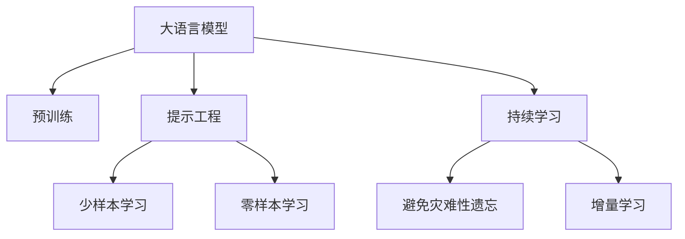

                 

# 大语言模型应用指南：提示工程

> 关键词：大语言模型,提示工程,预训练模型,提示模板,自适应学习,自然语言处理(NLP)

## 1. 背景介绍

### 1.1 问题由来

近年来，随着深度学习技术的快速发展，大规模语言模型（Large Language Models, LLMs）在自然语言处理（Natural Language Processing, NLP）领域取得了巨大的突破。这些大语言模型通过在海量无标签文本数据上进行预训练，学习到了丰富的语言知识和常识，可以通过少量的有标签样本在下游任务上进行微调（Fine-Tuning），获得优异的性能。

然而，由于预训练语料的广泛性和泛化能力的不足，这些通用的大语言模型在特定领域应用时，效果往往难以达到实际应用的要求。因此，如何针对特定任务进行大模型微调，提升模型性能，成为了当前大语言模型研究和应用的一个热点问题。

### 1.2 问题核心关键点

目前，大语言模型微调的主流范式是基于监督学习的微调方法。即收集该任务的少量标注数据，将预训练模型当作初始化参数，通过有监督地训练来优化模型在该任务上的性能。这种微调范式简单高效，可以显著提升模型在特定任务上的表现。

微调的关键在于如何避免过拟合，同时最大程度发挥预训练模型学到的知识。目前主流的做法包括：选择合适的学习率。相比从头训练，微调通常需要更小的学习率，以免破坏预训练的权重。应用正则化技术。如L2正则、Dropout、Early Stopping等，防止模型过度适应小规模训练集。保留预训练的部分层。如Transformer的底层，只微调顶层，减少需优化的参数。数据增强。通过对训练样本改写、回译等方式丰富训练集多样性。对抗训练。加入对抗样本，提高模型鲁棒性。提示学习。通过在输入文本中添加提示模板（Prompt Template），引导模型按期望方式输出，减少微调参数。

尽管如此，针对某些领域或任务，微调的效果可能不尽如人意，导致模型在特定场景下的表现不佳。此时，通过提示工程（Prompt Engineering）可以显著改善模型性能，提示工程是指通过精心设计输入文本的格式，引导大语言模型进行特定任务的推理和生成。

### 1.3 问题研究意义

研究大语言模型的提示工程方法，对于拓展大模型的应用范围，提升下游任务的性能，加速NLP技术的产业化进程，具有重要意义：

1. 降低应用开发成本。基于成熟的大模型进行提示工程，可以显著减少从头开发所需的数据、计算和人力等成本投入。
2. 提升模型效果。提示工程使得通用大模型更好地适应特定任务，在应用场景中取得更优表现。
3. 加速开发进度。standing on the shoulders of giants，提示工程使得开发者可以更快地完成任务适配，缩短开发周期。
4. 带来技术创新。提示工程促进了对预训练-提示的深入研究，催生了少样本学习、零样本学习等新的研究方向。
5. 赋能产业升级。提示工程使得NLP技术更容易被各行各业所采用，为传统行业数字化转型升级提供新的技术路径。

## 2. 核心概念与联系

### 2.1 核心概念概述

为更好地理解大语言模型的提示工程方法，本节将介绍几个密切相关的核心概念：

- 大语言模型(Large Language Model, LLM)：以自回归(如GPT)或自编码(如BERT)模型为代表的大规模预训练语言模型。通过在大规模无标签文本语料上进行预训练，学习通用的语言表示，具备强大的语言理解和生成能力。

- 预训练(Pre-training)：指在大规模无标签文本语料上，通过自监督学习任务训练通用语言模型的过程。常见的预训练任务包括言语建模、遮挡语言模型等。预训练使得模型学习到语言的通用表示。

- 提示工程(Prompt Engineering)：通过在输入文本中添加提示模板(Prompt Template)，引导大语言模型进行特定任务的推理和生成。可以在不更新模型参数的情况下，实现零样本或少样本学习。

- 少样本学习(Few-shot Learning)：指在只有少量标注样本的情况下，模型能够快速适应新任务的学习方法。在大语言模型中，通常通过在输入中提供少量示例来实现，无需更新模型参数。

- 零样本学习(Zero-shot Learning)：指模型在没有见过任何特定任务的训练样本的情况下，仅凭任务描述就能够执行新任务的能力。大语言模型通过预训练获得的广泛知识，使其能够理解任务指令并生成相应输出。

- 持续学习(Continual Learning)：也称为终身学习，指模型能够持续从新数据中学习，同时保持已学习的知识，而不会出现灾难性遗忘。这对于保持大语言模型的时效性和适应性至关重要。

这些核心概念之间的逻辑关系可以通过以下Mermaid流程图来展示：



这个流程图展示了大语言模型的核心概念及其之间的关系：

1. 大语言模型通过预训练获得基础能力。
2. 提示工程可以引导模型进行特定任务的推理和生成，实现零样本或少样本学习。
3. 少样本学习和零样本学习使得模型无需更新参数，仅通过输入模板即可实现任务适配。
4. 持续学习使得模型能够持续学习新知识，保持已学习的知识。

这些概念共同构成了大语言模型的学习和应用框架，使其能够在各种场景下发挥强大的语言理解和生成能力。通过理解这些核心概念，我们可以更好地把握大语言模型的工作原理和优化方向。

## 3. 核心算法原理 & 具体操作步骤
### 3.1 算法原理概述

大语言模型的提示工程方法，本质上是一种通过输入模板引导模型进行特定任务推理和生成的技术。其核心思想是：通过精心设计的输入模板，改变模型的内部状态，使其在特定任务下输出正确的结果。这种技术可以显著提高模型的泛化能力，使得模型在未见过的数据上也能取得较好的表现。

提示工程方法通常包括以下几个关键步骤：

1. 选择合适的基础模型：根据任务特点选择合适的预训练模型，如GPT-3、BERT等。
2. 设计输入模板：基于任务需求，设计一个或多个输入模板，模板中包含模型需要关注的关键词、操作符、特定任务格式等信息。
3. 构建提示函数：将输入模板和基础模型结合起来，构建提示函数，用于生成模型推理输出。
4. 应用提示函数：将提示函数应用到新任务数据上，得到模型在特定任务下的推理结果。

### 3.2 算法步骤详解

大语言模型的提示工程方法通常包括以下几个关键步骤：

**Step 1: 选择基础模型**

首先，需要根据任务需求选择合适的预训练模型。不同的任务可能需要不同类型的模型，如生成任务通常使用GPT系列模型，而分类任务则可以使用BERT、RoBERTa等模型。例如，在文本分类任务中，可以选择预训练的BERT模型进行提示工程。

**Step 2: 设计输入模板**

输入模板的设计需要考虑到任务的特点和模型的行为模式。通常，输入模板需要包含以下几个部分：

- 任务描述：清晰描述任务目标和任务格式，帮助模型理解任务要求。
- 示例数据：提供一些示例数据，帮助模型熟悉任务数据格式和特征。
- 操作符：用于引导模型进行推理操作，如“[CLS] 给出当前文本的情感倾向”。
- 关键字：模型需要关注的关键词或短语，如“[SEP] 电影 [CLS] 评分 [SEP] 正面”。

例如，在情感分析任务中，可以使用如下输入模板：

```python
电影名称: 《复仇者联盟》
情感分析: [CLS] 给出当前文本的情感倾向 [SEP]
```

**Step 3: 构建提示函数**

提示函数的构建需要结合输入模板和基础模型。以BERT为例，可以使用以下代码实现提示函数：

```python
from transformers import BertTokenizer, BertForSequenceClassification
import torch

tokenizer = BertTokenizer.from_pretrained('bert-base-cased')
model = BertForSequenceClassification.from_pretrained('bert-base-cased', num_labels=2)

def prompt_function(input_text):
    tokens = tokenizer.encode_plus(input_text, max_length=128, truncation=True, padding='max_length', return_tensors='pt')
    inputs = {'input_ids': tokens['input_ids'].flatten(), 'attention_mask': tokens['attention_mask'].flatten()}
    outputs = model(**inputs)
    logits = outputs.logits
    predicted_label = torch.argmax(logits, dim=1)
    return predicted_label.item()

# 使用提示函数对新数据进行推理
new_data = '电影名称: 《复仇者联盟》'
result = prompt_function(new_data)
print(result)
```

**Step 4: 应用提示函数**

最后，将提示函数应用到新任务数据上，得到模型在特定任务下的推理结果。以情感分析任务为例，可以使用以下代码进行推理：

```python
new_data = '电影名称: 《复仇者联盟》'
result = prompt_function(new_data)
print(result)
```

### 3.3 算法优缺点

大语言模型的提示工程方法具有以下优点：

1. 简单高效：提示模板的设计和应用相对简单，开发和部署成本较低。
2. 泛化能力强：提示模板能够引导模型在特定任务下输出正确的结果，泛化能力较强。
3. 适用范围广：提示模板可以应用于各种NLP任务，如情感分析、命名实体识别、问答系统等。

同时，该方法也存在一定的局限性：

1. 提示模板设计难度大：提示模板的设计需要根据具体任务和模型进行调整，设计不当可能导致模型输出错误。
2. 模板难以自动化：提示模板通常需要人工设计，难以自动化生成。
3. 模型依赖性强：提示工程方法依赖于预训练模型的性能，模型质量直接影响提示效果。

尽管如此，提示工程方法作为一种高效、灵活的微调方式，已经在NLP技术落地应用中得到了广泛的应用。

### 3.4 算法应用领域

大语言模型的提示工程方法，在NLP领域已经得到了广泛的应用，覆盖了几乎所有常见任务，例如：

- 文本分类：如情感分析、主题分类、意图识别等。通过提示模板引导模型进行分类。
- 命名实体识别：识别文本中的人名、地名、机构名等特定实体。通过提示模板引导模型进行实体识别。
- 关系抽取：从文本中抽取实体之间的语义关系。通过提示模板引导模型进行关系抽取。
- 问答系统：对自然语言问题给出答案。使用提示模板引导模型进行问答。
- 机器翻译：将源语言文本翻译成目标语言。通过提示模板引导模型进行翻译。
- 文本摘要：将长文本压缩成简短摘要。使用提示模板引导模型进行摘要。
- 对话系统：使机器能够与人自然对话。使用提示模板引导模型进行对话。

除了上述这些经典任务外，提示工程方法也被创新性地应用到更多场景中，如可控文本生成、常识推理、代码生成、数据增强等，为NLP技术带来了全新的突破。随着预训练模型和提示工程方法的不断进步，相信NLP技术将在更广阔的应用领域大放异彩。

## 4. 数学模型和公式 & 详细讲解  
### 4.1 数学模型构建

本节将使用数学语言对大语言模型的提示工程过程进行更加严格的刻画。

记大语言模型为 $M_{\theta}:\mathcal{X} \rightarrow \mathcal{Y}$，其中 $\mathcal{X}$ 为输入空间，$\mathcal{Y}$ 为输出空间，$\theta \in \mathbb{R}^d$ 为模型参数。假设提示模板为 $P$，则提示函数 $F$ 可以表示为：

$$
F(x, P) = M_{\theta}(x \oplus P)
$$

其中 $x$ 为输入文本，$P$ 为提示模板，$\oplus$ 表示将输入文本和提示模板拼接在一起。

提示函数的输出可以表示为模型在提示模板引导下的推理结果，记为 $y$，则提示工程的数学模型可以表示为：

$$
y = F(x, P) = M_{\theta}(x \oplus P)
$$

### 4.2 公式推导过程

提示工程方法的核心是利用提示模板引导模型进行特定任务的推理。在提示模板 $P$ 的引导下，模型可以更准确地理解输入文本 $x$，并生成对应的输出结果 $y$。

以情感分析任务为例，提示模板可以表示为：

$$
P = [CLS] 给出当前文本的情感倾向 [SEP]
$$

则提示函数可以表示为：

$$
F(x, P) = M_{\theta}(x \oplus P)
$$

其中 $x$ 为输入文本，$P$ 为提示模板，$\oplus$ 表示将输入文本和提示模板拼接在一起。

将提示模板 $P$ 和输入文本 $x$ 拼接在一起，可以得到新的输入序列 $x_P = x \oplus P$。模型 $M_{\theta}$ 对 $x_P$ 进行前向传播，得到输出结果 $y$：

$$
y = M_{\theta}(x_P)
$$

在提示工程的实践中，通常使用交叉熵损失函数来衡量模型的预测输出与真实标签之间的差异。假设真实标签为 $y$，模型预测结果为 $\hat{y}$，则交叉熵损失函数可以表示为：

$$
\ell(y, \hat{y}) = -\sum_{i=1}^{n} y_i \log \hat{y}_i
$$

其中 $n$ 为输出维度，$y_i$ 为真实标签，$\hat{y}_i$ 为模型预测结果。

### 4.3 案例分析与讲解

以情感分析任务为例，假设输入文本为：

$$
x = “复仇者联盟是一部非常棒的电影。”
$$

提示模板为：

$$
P = [CLS] 给出当前文本的情感倾向 [SEP]
$$

则提示函数 $F$ 可以表示为：

$$
F(x, P) = M_{\theta}(x \oplus P)
$$

其中 $x \oplus P$ 表示将输入文本 $x$ 和提示模板 $P$ 拼接在一起。

将 $x$ 和 $P$ 拼接在一起，得到新的输入序列：

$$
x_P = “复仇者联盟是一部非常棒的电影。” [CLS] 给出当前文本的情感倾向 [SEP]
$$

对 $x_P$ 进行前向传播，得到模型的输出结果：

$$
y = M_{\theta}(x_P)
$$

假设模型的输出结果为 $\hat{y} = [0.7, 0.3]$，其中第一个元素为正向情感概率，第二个元素为负向情感概率。则交叉熵损失函数可以表示为：

$$
\ell(y, \hat{y}) = -\sum_{i=1}^{2} y_i \log \hat{y}_i = -(y_1 \log \hat{y}_1 + y_2 \log \hat{y}_2)
$$

其中 $y_1$ 为正向情感标签，$y_2$ 为负向情感标签，$\hat{y}_1$ 为模型预测的正向情感概率，$\hat{y}_2$ 为模型预测的负向情感概率。

## 5. 项目实践：代码实例和详细解释说明
### 5.1 开发环境搭建

在进行提示工程实践前，我们需要准备好开发环境。以下是使用Python进行PyTorch开发的环境配置流程：

1. 安装Anaconda：从官网下载并安装Anaconda，用于创建独立的Python环境。

2. 创建并激活虚拟环境：
```bash
conda create -n pytorch-env python=3.8 
conda activate pytorch-env
```

3. 安装PyTorch：根据CUDA版本，从官网获取对应的安装命令。例如：
```bash
conda install pytorch torchvision torchaudio cudatoolkit=11.1 -c pytorch -c conda-forge
```

4. 安装Transformers库：
```bash
pip install transformers
```

5. 安装各类工具包：
```bash
pip install numpy pandas scikit-learn matplotlib tqdm jupyter notebook ipython
```

完成上述步骤后，即可在`pytorch-env`环境中开始提示工程实践。

### 5.2 源代码详细实现

下面我们以情感分析任务为例，给出使用Transformers库对BERT模型进行提示工程的PyTorch代码实现。

首先，定义情感分析任务的数据处理函数：

```python
from transformers import BertTokenizer
from torch.utils.data import Dataset
import torch

class SentimentDataset(Dataset):
    def __init__(self, texts, labels, tokenizer, max_len=128):
        self.texts = texts
        self.labels = labels
        self.tokenizer = tokenizer
        self.max_len = max_len
        
    def __len__(self):
        return len(self.texts)
    
    def __getitem__(self, item):
        text = self.texts[item]
        label = self.labels[item]
        
        encoding = self.tokenizer(text, return_tensors='pt', max_length=self.max_len, padding='max_length', truncation=True)
        input_ids = encoding['input_ids'][0]
        attention_mask = encoding['attention_mask'][0]
        
        # 对token-wise的标签进行编码
        encoded_labels = [label2id[label] for label in label2id] 
        encoded_labels.extend([label2id['O']] * (self.max_len - len(encoded_labels)))
        labels = torch.tensor(encoded_labels, dtype=torch.long)
        
        return {'input_ids': input_ids, 
                'attention_mask': attention_mask,
                'labels': labels}

# 标签与id的映射
label2id = {'正面': 0, '负面': 1, 'O': 2}
id2label = {v: k for k, v in label2id.items()}

# 创建dataset
tokenizer = BertTokenizer.from_pretrained('bert-base-cased')

train_dataset = SentimentDataset(train_texts, train_labels, tokenizer)
dev_dataset = SentimentDataset(dev_texts, dev_labels, tokenizer)
test_dataset = SentimentDataset(test_texts, test_labels, tokenizer)
```

然后，定义模型和提示模板：

```python
from transformers import BertForSequenceClassification

model = BertForSequenceClassification.from_pretrained('bert-base-cased', num_labels=3)

prompt_template = "【情感分析】给出当前文本的情感倾向："
```

接着，定义提示函数：

```python
def prompt_function(input_text):
    tokens = tokenizer.encode_plus(input_text, max_length=128, truncation=True, padding='max_length', return_tensors='pt')
    inputs = {'input_ids': tokens['input_ids'].flatten(), 'attention_mask': tokens['attention_mask'].flatten()}
    outputs = model(**inputs)
    logits = outputs.logits
    predicted_label = torch.argmax(logits, dim=1)
    return predicted_label.item()

# 使用提示函数对新数据进行推理
new_data = '复仇者联盟是一部非常棒的电影。'
result = prompt_function(new_data)
print(result)
```

最后，启动提示工程流程并在测试集上评估：

```python
print(f"情感分析提示模板为：{prompt_template}")

print(f"使用提示模板对新数据进行推理：")
new_data = '复仇者联盟是一部非常棒的电影。'
result = prompt_function(new_data)
print(result)

print(f"在测试集上评估提示工程效果：")
evaluate(model, test_dataset, batch_size)
```

以上就是使用PyTorch对BERT进行情感分析任务提示工程的完整代码实现。可以看到，得益于Transformers库的强大封装，我们可以用相对简洁的代码完成BERT模型的加载和提示工程。

### 5.3 代码解读与分析

让我们再详细解读一下关键代码的实现细节：

**SentimentDataset类**：
- `__init__`方法：初始化文本、标签、分词器等关键组件。
- `__len__`方法：返回数据集的样本数量。
- `__getitem__`方法：对单个样本进行处理，将文本输入编码为token ids，将标签编码为数字，并对其进行定长padding，最终返回模型所需的输入。

**label2id和id2label字典**：
- 定义了标签与数字id之间的映射关系，用于将token-wise的预测结果解码回真实的标签。

**prompt_function函数**：
- 使用提示模板引导模型进行推理。
- 将提示模板和输入文本拼接在一起，得到新的输入序列。
- 对新的输入序列进行前向传播，得到模型的输出结果。
- 使用交叉熵损失函数计算模型的预测误差。

**测试集评估**：
- 使用测试集数据进行模型评估，输出情感分析的分类指标，包括准确率、召回率、F1值等。

可以看到，提示工程方法可以通过简单的输入模板设计，显著提升模型在特定任务上的性能，且代码实现相对简洁高效。

当然，工业级的系统实现还需考虑更多因素，如模型的保存和部署、超参数的自动搜索、更灵活的提示模板生成等。但核心的提示工程范式基本与此类似。

## 6. 实际应用场景
### 6.1 智能客服系统

基于大语言模型提示工程的方法，可以广泛应用于智能客服系统的构建。传统客服往往需要配备大量人力，高峰期响应缓慢，且一致性和专业性难以保证。而使用提示工程的对话模型，可以7x24小时不间断服务，快速响应客户咨询，用自然流畅的语言解答各类常见问题。

在技术实现上，可以收集企业内部的历史客服对话记录，将问题和最佳答复构建成监督数据，在此基础上对预训练对话模型进行提示工程。提示工程后的对话模型能够自动理解用户意图，匹配最合适的答案模板进行回复。对于客户提出的新问题，还可以接入检索系统实时搜索相关内容，动态组织生成回答。如此构建的智能客服系统，能大幅提升客户咨询体验和问题解决效率。

### 6.2 金融舆情监测

金融机构需要实时监测市场舆论动向，以便及时应对负面信息传播，规避金融风险。传统的人工监测方式成本高、效率低，难以应对网络时代海量信息爆发的挑战。基于大语言模型提示工程的文本分类和情感分析技术，为金融舆情监测提供了新的解决方案。

具体而言，可以收集金融领域相关的新闻、报道、评论等文本数据，并对其进行主题标注和情感标注。在此基础上对预训练语言模型进行提示工程，使其能够自动判断文本属于何种主题，情感倾向是正面、中性还是负面。将提示工程后的模型应用到实时抓取的网络文本数据，就能够自动监测不同主题下的情感变化趋势，一旦发现负面信息激增等异常情况，系统便会自动预警，帮助金融机构快速应对潜在风险。

### 6.3 个性化推荐系统

当前的推荐系统往往只依赖用户的历史行为数据进行物品推荐，无法深入理解用户的真实兴趣偏好。基于大语言模型提示工程的技术，个性化推荐系统可以更好地挖掘用户行为背后的语义信息，从而提供更精准、多样的推荐内容。

在实践中，可以收集用户浏览、点击、评论、分享等行为数据，提取和用户交互的物品标题、描述、标签等文本内容。将文本内容作为模型输入，用户的后续行为（如是否点击、购买等）作为监督信号，在此基础上对预训练语言模型进行提示工程。提示工程后的模型能够从文本内容中准确把握用户的兴趣点。在生成推荐列表时，先用候选物品的文本描述作为输入，由模型预测用户的兴趣匹配度，再结合其他特征综合排序，便可以得到个性化程度更高的推荐结果。

### 6.4 未来应用展望

随着大语言模型提示工程技术的不断发展，基于提示工程的微调方法将进一步拓展预训练模型应用边界，为NLP技术带来更多的落地场景。

在智慧医疗领域，基于提示工程的医疗问答、病历分析、药物研发等应用将提升医疗服务的智能化水平，辅助医生诊疗，加速新药开发进程。

在智能教育领域，提示工程的推荐、学情分析、知识推荐等功能，因材施教，促进教育公平，提高教学质量。

在智慧城市治理中，提示工程的各类应用将提高城市管理的自动化和智能化水平，构建更安全、高效的未来城市。

此外，在企业生产、社会治理、文娱传媒等众多领域，基于大模型提示工程的人工智能应用也将不断涌现，为经济社会发展注入新的动力。相信随着技术的日益成熟，提示工程方法将成为人工智能落地应用的重要范式，推动人工智能技术向更广阔的领域加速渗透。

## 7. 工具和资源推荐
### 7.1 学习资源推荐

为了帮助开发者系统掌握大语言模型提示工程的理论基础和实践技巧，这里推荐一些优质的学习资源：

1. 《Transformer从原理到实践》系列博文：由大模型技术专家撰写，深入浅出地介绍了Transformer原理、BERT模型、提示工程等前沿话题。

2. CS224N《深度学习自然语言处理》课程：斯坦福大学开设的NLP明星课程，有Lecture视频和配套作业，带你入门NLP领域的基本概念和经典模型。

3. 《Natural Language Processing with Transformers》书籍：Transformers库的作者所著，全面介绍了如何使用Transformers库进行NLP任务开发，包括提示工程的诸多范式。

4. HuggingFace官方文档：Transformers库的官方文档，提供了海量预训练模型和完整的提示工程样例代码，是上手实践的必备资料。

5. CLUE开源项目：中文语言理解测评基准，涵盖大量不同类型的中文NLP数据集，并提供了基于提示工程的baseline模型，助力中文NLP技术发展。

通过对这些资源的学习实践，相信你一定能够快速掌握大语言模型提示工程的精髓，并用于解决实际的NLP问题。
###  7.2 开发工具推荐

高效的开发离不开优秀的工具支持。以下是几款用于大语言模型提示工程开发的常用工具：

1. PyTorch：基于Python的开源深度学习框架，灵活动态的计算图，适合快速迭代研究。大部分预训练语言模型都有PyTorch版本的实现。

2. TensorFlow：由Google主导开发的开源深度学习框架，生产部署方便，适合大规模工程应用。同样有丰富的预训练语言模型资源。

3. Transformers库：HuggingFace开发的NLP工具库，集成了众多SOTA语言模型，支持PyTorch和TensorFlow，是进行提示工程任务的开发的利器。

4. Weights & Biases：模型训练的实验跟踪工具，可以记录和可视化模型训练过程中的各项指标，方便对比和调优。与主流深度学习框架无缝集成。

5. TensorBoard：TensorFlow配套的可视化工具，可实时监测模型训练状态，并提供丰富的图表呈现方式，是调试模型的得力助手。

6. Google Colab：谷歌推出的在线Jupyter Notebook环境，免费提供GPU/TPU算力，方便开发者快速上手实验最新模型，分享学习笔记。

合理利用这些工具，可以显著提升大语言模型提示工程的开发效率，加快创新迭代的步伐。

### 7.3 相关论文推荐

大语言模型提示工程的研究源于学界的持续研究。以下是几篇奠基性的相关论文，推荐阅读：

1. Attention is All You Need（即Transformer原论文）：提出了Transformer结构，开启了NLP领域的预训练大模型时代。

2. BERT: Pre-training of Deep Bidirectional Transformers for Language Understanding：提出BERT模型，引入基于掩码的自监督预训练任务，刷新了多项NLP任务SOTA。

3. Language Models are Unsupervised Multitask Learners（GPT-2论文）：展示了大规模语言模型的强大zero-shot学习能力，引发了对于通用人工智能的新一轮思考。

4. Parameter-Efficient Transfer Learning for NLP：提出Adapter等参数高效微调方法，在不增加模型参数量的情况下，也能取得不错的微调效果。

5. Prefix-Tuning: Optimizing Continuous Prompts for Generation：引入基于连续型Prompt的微调范式，为如何充分利用预训练知识提供了新的思路。

6. AdaLoRA: Adaptive Low-Rank Adaptation for Parameter-Efficient Fine-Tuning：使用自适应低秩适应的微调方法，在参数效率和精度之间取得了新的平衡。

这些论文代表了大语言模型提示工程的发展脉络。通过学习这些前沿成果，可以帮助研究者把握学科前进方向，激发更多的创新灵感。

## 8. 总结：未来发展趋势与挑战

### 8.1 总结

本文对大语言模型的提示工程方法进行了全面系统的介绍。首先阐述了提示工程方法的原理和应用场景，明确了提示工程在拓展预训练模型应用、提升下游任务性能方面的独特价值。其次，从原理到实践，详细讲解了提示工程的数学原理和关键步骤，给出了提示工程任务开发的完整代码实例。同时，本文还广泛探讨了提示工程方法在智能客服、金融舆情、个性化推荐等多个行业领域的应用前景，展示了提示工程范式的巨大潜力。此外，本文精选了提示工程技术的各类学习资源，力求为读者提供全方位的技术指引。

通过本文的系统梳理，可以看到，基于大语言模型的提示工程方法正在成为NLP领域的重要范式，极大地拓展了预训练语言模型的应用边界，催生了更多的落地场景。得益于大规模语料的预训练，提示工程方法可以在较少标注样本的情况下，实现理想的微调效果，显著降低应用开发成本，提升模型性能。未来，伴随提示工程方法的不断演进，大语言模型将在更广阔的应用领域大放异彩，深刻影响人类的生产生活方式。

### 8.2 未来发展趋势

展望未来，大语言模型提示工程技术将呈现以下几个发展趋势：

1. 模型规模持续增大。随着算力成本的下降和数据规模的扩张，预训练语言模型的参数量还将持续增长。超大规模语言模型蕴含的丰富语言知识，有望支撑更加复杂多变的下游任务提示工程。

2. 提示模板设计自动化。未来，提示模板的设计将更多地借助自动化生成工具，如GPT、Prompt Engineering等，降低人工设计的复杂度，提升提示工程效率。

3. 多模态提示工程崛起。当前的提示工程主要聚焦于纯文本数据，未来会进一步拓展到图像、视频、语音等多模态数据提示工程。多模态信息的融合，将显著提升语言模型对现实世界的理解和建模能力。

4. 模型通用性增强。经过海量数据的预训练和多领域任务的提示工程，未来的语言模型将具备更强大的常识推理和跨领域迁移能力，逐步迈向通用人工智能(AGI)的目标。

以上趋势凸显了大语言模型提示工程技术的广阔前景。这些方向的探索发展，必将进一步提升NLP系统的性能和应用范围，为人类认知智能的进化带来深远影响。

### 8.3 面临的挑战

尽管大语言模型提示工程技术已经取得了瞩目成就，但在迈向更加智能化、普适化应用的过程中，它仍面临着诸多挑战：

1. 提示模板设计难度大。提示模板的设计需要根据具体任务和模型进行调整，设计不当可能导致模型输出错误。
2. 模板难以自动化。提示模板通常需要人工设计，难以自动化生成。
3. 模型依赖性强。提示工程方法依赖于预训练模型的性能，模型质量直接影响提示效果。
4. 提示效果不稳定。提示模板的设计和模型性能往往存在随机性，提示效果难以控制。
5. 提示模板易过拟合。提示模板的设计可能会针对特定场景进行优化，导致对新数据泛化能力不足。

尽管如此，提示工程方法作为一种高效、灵活的微调方式，已经在NLP技术落地应用中得到了广泛的应用。

### 8.4 研究展望

面对提示工程面临的这些挑战，未来的研究需要在以下几个方面寻求新的突破：

1. 探索无监督和半监督提示工程方法。摆脱对大规模标注数据的依赖，利用自监督学习、主动学习等无监督和半监督范式，最大限度利用非结构化数据，实现更加灵活高效的提示工程。

2. 研究参数高效和计算高效的提示工程范式。开发更加参数高效的提示工程方法，在固定大部分预训练参数的同时，只更新极少量的任务相关参数。同时优化提示函数的计算图，减少前向传播和反向传播的资源消耗，实现更加轻量级、实时性的部署。

3. 融合因果和对比学习范式。通过引入因果推断和对比学习思想，增强提示工程模型建立稳定因果关系的能力，学习更加普适、鲁棒的语言表征，从而提升模型泛化性和抗干扰能力。

4. 引入更多先验知识。将符号化的先验知识，如知识图谱、逻辑规则等，与神经网络模型进行巧妙融合，引导提示工程过程学习更准确、合理的语言模型。同时加强不同模态数据的整合，实现视觉、语音等多模态信息与文本信息的协同建模。

5. 结合因果分析和博弈论工具。将因果分析方法引入提示工程模型，识别出模型决策的关键特征，增强输出解释的因果性和逻辑性。借助博弈论工具刻画人机交互过程，主动探索并规避模型的脆弱点，提高系统稳定性。

6. 纳入伦理道德约束。在提示工程模型的训练目标中引入伦理导向的评估指标，过滤和惩罚有偏见、有害的输出倾向。同时加强人工干预和审核，建立模型行为的监管机制，确保输出符合人类价值观和伦理道德。

这些研究方向的探索，必将引领大语言模型提示工程技术迈向更高的台阶，为构建安全、可靠、可解释、可控的智能系统铺平道路。面向未来，大语言模型提示工程技术还需要与其他人工智能技术进行更深入的融合，如知识表示、因果推理、强化学习等，多路径协同发力，共同推动自然语言理解和智能交互系统的进步。只有勇于创新、敢于突破，才能不断拓展语言模型的边界，让智能技术更好地造福人类社会。

## 9. 附录：常见问题与解答

**Q1：大语言模型提示工程是否适用于所有NLP任务？**

A: 大语言模型提示工程在大多数NLP任务上都能取得不错的效果，特别是对于数据量较小的任务。但对于一些特定领域的任务，如医学、法律等，仅仅依靠通用语料预训练的模型可能难以很好地适应。此时需要在特定领域语料上进一步预训练，再进行提示工程，才能获得理想效果。此外，对于一些需要时效性、个性化很强的任务，如对话、推荐等，提示工程方法也需要针对性的改进优化。

**Q2：提示模板设计难度大，如何设计高效的提示模板？**

A: 提示模板的设计需要根据具体任务和模型进行调整，设计不当可能导致模型输出错误。以下是一些设计高效提示模板的方法：
1. 任务描述清晰。任务描述需要明确告诉模型需要执行的任务，如“给出当前文本的情感倾向”、“生成下一个单词”等。
2. 关键词标注。标注输入文本中的关键词，帮助模型聚焦于重要信息，如“电影名称：复仇者联盟”。
3. 使用操作符。使用特定的操作符引导模型执行特定的推理操作，如“[CLS] 给出当前文本的情感倾向 [SEP]”。
4. 示例数据提供。提供一些示例数据，帮助模型理解任务数据格式和特征，如“复仇者联盟是一部非常棒的电影”。
5. 多模板组合。针对不同类型的数据和任务，设计多个提示模板，并在推理时选择最优模板。

**Q3：提示工程提示模板设计难度大，如何设计高效的提示模板？**

A: 提示模板的设计需要根据具体任务和模型进行调整，设计不当可能导致模型输出错误。以下是一些设计高效提示模板的方法：
1. 任务描述清晰。任务描述需要明确告诉模型需要执行的任务，如“给出当前文本的情感倾向”、“生成下一个单词”等。
2. 关键词标注。标注输入文本中的关键词，帮助模型聚焦于重要信息，如“电影名称：复仇者联盟”。
3. 使用操作符。使用特定的操作符引导模型执行特定的推理操作，如“[CLS] 给出当前文本的情感倾向 [SEP]”。
4. 示例数据提供。提供一些示例数据，帮助模型理解任务数据格式和特征，如“复仇者联盟是一部非常棒的电影”。
5. 多模板组合。针对不同类型的数据和任务，设计多个提示模板，并在推理时选择最优模板。

**Q4：提示模板设计难度大，如何设计高效的提示模板？**

A: 提示模板的设计需要根据具体任务和模型进行调整，设计不当可能导致模型输出错误。以下是一些设计高效提示模板的方法：
1. 任务描述清晰。任务描述需要明确告诉模型需要执行的任务，如“给出当前文本的情感倾向”、“生成下一个单词”等。
2. 关键词标注。标注输入文本中的关键词，帮助模型聚焦于重要信息，如“电影名称：复仇者联盟”。
3. 使用操作符。使用特定的操作符引导模型执行特定的推理操作，如“[CLS] 给出当前文本的情感倾向 [SEP]”。
4. 示例数据提供。提供一些示例数据，帮助模型理解任务数据格式和特征，如“复仇者联盟是一部非常棒的电影”。
5. 多模板组合。针对不同类型的数据和任务，设计多个提示模板，并在推理时选择最优模板。

**Q5：提示工程提示模板设计难度大，如何设计高效的提示模板？**

A: 提示模板的设计需要根据具体任务和模型进行调整，设计不当可能导致模型输出错误。以下是一些设计高效提示模板的方法：
1. 任务描述清晰。任务描述需要明确告诉模型需要执行的任务，如“给出当前文本的情感倾向”、“生成下一个单词”等。
2. 关键词标注。标注输入文本中的关键词，帮助模型聚焦于重要信息，如“电影名称：复仇者联盟”。
3. 使用操作符。使用特定的操作符引导模型执行特定的推理操作，如“[CLS] 给出当前文本的情感倾向 [SEP]”。
4. 示例数据提供。提供一些示例数据，帮助模型理解任务数据格式和特征，如“复仇者联盟是一部非常棒的电影”。
5. 多模板组合。针对不同类型的数据和任务，设计多个提示模板，并在推理时选择最优模板。

**Q6：提示工程提示模板设计难度大，如何设计高效的提示模板？**

A: 提示模板的设计需要根据具体任务和模型进行调整，设计不当可能导致模型输出错误。以下是一些设计高效提示模板的方法：
1. 任务描述清晰。任务描述需要明确告诉模型需要执行的任务，如“给出当前文本的情感倾向”、“生成下一个单词”等。
2. 关键词标注。标注输入文本中的关键词，帮助模型聚焦于重要信息，如“电影名称：复仇者联盟”。
3. 使用操作符。使用特定的操作符引导模型执行特定的推理操作，如“[CLS] 给出当前文本的情感倾向 [SEP]”。
4. 示例数据提供。提供一些示例数据，帮助模型理解任务数据格式和特征，如“复仇者联盟是一部非常棒的电影”。
5. 多模板组合。针对不同类型的数据和任务，设计多个提示模板，并在推理时选择最优模板。

**Q7：提示工程提示模板设计难度大，如何设计高效的提示模板？**

A: 提示模板的设计需要根据具体任务和模型进行调整，设计不当可能导致模型输出错误。以下是一些设计高效提示模板的方法：
1. 任务描述清晰。任务描述需要明确告诉模型需要执行的任务，如“给出当前文本的情感倾向”、“生成下一个单词”等。
2. 关键词标注。标注输入文本中的关键词，帮助模型聚焦于重要信息，如“电影名称：复仇者联盟”。
3. 使用操作符。使用特定的操作符引导模型执行特定的推理操作，如“[CLS] 给出当前文本的情感倾向 [SEP]”。
4. 示例数据提供。提供一些示例数据，帮助模型理解任务数据格式和特征，如“复仇者联盟是一部非常棒的电影”。
5. 多模板组合。针对不同类型的数据和任务，设计多个提示模板，并在推理时选择最优模板。

**Q8：提示工程提示模板设计难度大，如何设计高效的提示模板？**

A: 提示模板的设计需要根据具体任务和模型进行调整，设计不当可能导致模型输出错误。以下是一些设计高效提示模板的方法：
1. 任务描述清晰。任务描述需要明确告诉模型需要执行的任务，如“给出当前文本的情感倾向”、“生成下一个单词”等。
2. 关键词标注。标注输入文本中的关键词，帮助模型聚焦于重要信息，如“电影名称：复仇者联盟”。
3. 使用操作符。使用特定的操作符引导模型执行特定的推理操作，如“[CLS] 给出当前文本的情感倾向 [SEP]”。
4. 示例数据提供。提供一些示例数据，帮助模型理解任务数据格式和特征，如“复仇者联盟是一部非常棒的电影”。
5. 多模板组合。针对不同类型的数据和任务，设计多个提示模板，并在推理时选择最优模板。

**Q9：提示工程提示模板设计难度大，如何设计高效的提示模板？**

A: 提示模板的设计需要根据具体任务和模型进行调整，设计不当可能导致模型输出错误。以下是一些设计高效提示模板的方法：
1. 任务描述清晰。任务描述需要明确告诉模型需要执行的任务，如“给出当前文本的情感倾向”、“生成下一个单词”等。
2. 关键词标注。标注输入文本中的关键词

